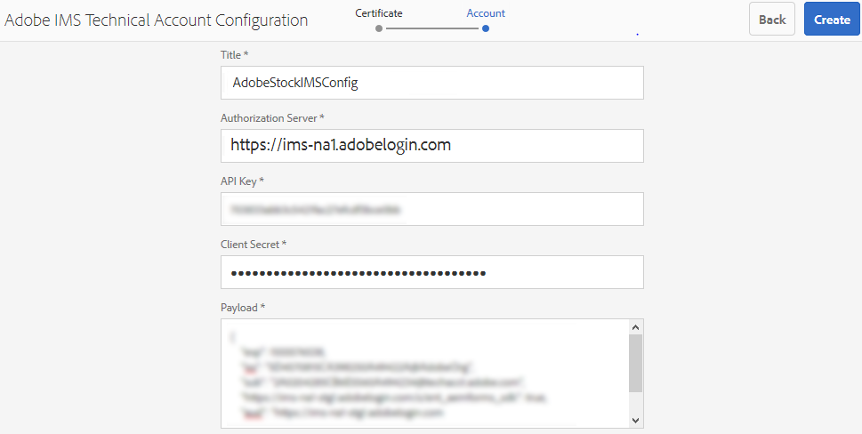

# Usar [!DNL Adobe Stock] recursos en [!DNL Adobe Experience Manager Assets] {#use-adobe-stock-assets-in-aem-assets}

<!-- old content

[!DNL Experience Manager Assets] provides users the ability to search, preview, save, and license [!DNL Adobe Stock] assets directly from [!DNL Experience Manager]. 

Organizations can integrate their [!DNL Adobe Stock] enterprise plan with [!DNL Experience Manager Assets] to ensure that licensed assets are broadly available for their creative and marketing projects, with the powerful asset management capabilities of [!DNL Experience Manager].

[!DNL Adobe Stock] service provides designers and businesses with access to millions of high-quality, curated, royalty-free photos, vectors, illustrations, videos, templates, and 3D assets for all their creative projects. [!DNL Experience Manager] users are able to quickly find, preview, and license [!DNL Adobe Stock] assets that are saved in [!DNL Experience Manager], without leaving the [!DNL Experience Manager] interface.
-->

<!-- New overview content
-->

[!DNL Adobe Stock]El servicio proporciona a diseñadores y empresas acceso a millones de fotos, vectores, ilustraciones, vídeos, plantillas y recursos 3D de alta calidad, verificados y libres de derechos de autor para todos sus proyectos creativos.

[!DNL Adobe Stock] para la oferta empresarial, de forma predeterminada, incluye derechos de uso compartido en toda la organización. Una vez que un usuario de su organización ha concedido una licencia a un recurso, otros usuarios de su organización pueden identificar, descargar y utilizar este recurso sin tener que volver a obtener una licencia. Una vez que su organización ha concedido una licencia a un recurso, el derecho a utilizarlo es perpetuo.

Las organizaciones pueden integrar su [!DNL Adobe Stock] plan empresarial con [!DNL Experience Manager Assets] para garantizar que los recursos con licencia estén disponibles en general para sus proyectos creativos y de marketing, con las potentes capacidades de administración de recursos de [!DNL Experience Manager]. [!DNL Experience Manager] los usuarios pueden encontrar, previsualizar y obtener licencias rápidamente de los recursos de Adobe Stock guardados en  [!DNL Experience Manager], sin salir de la  [!DNL Experience Manager] interfaz.

<!-- Old content
## Prerequisites {#prerequisites}

The integration requires an [enterprise [!DNL Adobe Stock] plan](https://stockenterprise.adobe.com/).
-->

## Integrar [!DNL Experience Manager] y [!DNL Adobe Stock] {#integrate-aem-and-adobe-stock}

[!DNL Experience Manager Assets] proporciona a los usuarios la capacidad de buscar, previsualizar, guardar y obtener licencias para  [!DNL Adobe Stock] recursos directamente desde  [!DNL Experience Manager].

**Requisitos previos**

La integración requiere:
* Un [plan  [!DNL Adobe Stock] empresarial](https://stockenterprise.adobe.com/)
* Un usuario con permisos en Admin Console al perfil de producto predeterminado de Stock
* Un usuario con permisos para el perfil de acceso de desarrollador para crear integración en Adobe Developer Console

Un plan empresarial [!DNL Adobe Stock],
* Proporciona derechos de producto para [!DNL Adobe Stock] (Existencias conectadas al Experience Manager)
* Créditos comprados en [!DNL Adobe Admin Console] para su derecho de stock
* Habilita la autenticación de cuenta de servicio (JWT) dentro de [!DNL Adobe Developer Console] para su derecho de stock
* Permite administrar los créditos y las licencias globalmente desde [!DNL Adobe Admin Console]

Dentro de la asignación de derechos, existe un perfil de producto predeterminado para [!DNL Adobe Stock] en [!DNL Admin Console]. Se pueden crear varios perfiles, que determinan quién puede obtener la licencia de los recursos de Stock. Un usuario que tenga acceso directamente al perfil de producto puede acceder a [https://stock.adobe.com/](https://stock.adobe.com/) y obtener una licencia para los recursos de Stock. Mientras que hay otro método para utilizar el acceso de desarrollador para crear la integración (API) para autenticar la comunicación entre [!DNL Experience Manager] y [!DNL Adobe Stock].

>[!NOTE]
>
>La autenticación de la cuenta de servicio de stock (JWT) viene con el derecho de enterprise Stock.
>
>La integración no admite la autenticación Oauth para la asignación de derechos de enterprise Stock.

<!-- old content
To allow communication between [!DNL Experience Manager] and [!DNL Adobe Stock], create an IMS configuration and an [!DNL Adobe Stock] configuration in [!DNL Experience Manager].

>[!NOTE]
>
>Only [!DNL Experience Manager] administrators and [!DNL Admin Console] administrators for an organization can perform the integration as it requires administrator privileges.
-->

## Pasos para integrar [!DNL Experience Manager] y [!DNL Adobe Stock] {#integration-steps}

Para integrar [!DNL Experience Manager] y [!DNL Adobe Stock], realice los siguientes pasos en la secuencia enumerada:

1. [Obtener un certificado público](#public-certificate)

   En [!DNL Experience Manager], cree una cuenta de IMS y genere un certificado público (clave pública).

1. [Crear conexión de cuenta de servicio (JWT)](#createnewintegration)

   En [!DNL Adobe Developer Console], cree un proyecto para su organización [!DNL Adobe Stock]. En el proyecto, configure una API con la clave pública para crear una conexión de cuenta de servicio (JWT). Obtenga las credenciales de cuenta de servicio y la información de carga útil de JWT.

1. [Configurar la cuenta de IMS](#create-ims-account-configuration)

   En [!DNL Experience Manager], configure la cuenta IMS con las credenciales de cuenta de servicio y la carga útil JWT.

1. [Configurar el servicio en la nube](#configure-the-cloud-service)

   En [!DNL Experience Manager], configure un servicio en la nube [!DNL Adobe Stock] mediante la cuenta de IMS.

### Crear una configuración de IMS {#create-an-ims-configuration}

La configuración de IMS autentica la instancia de autor [!DNL Experience Manager Assets] con el derecho [!DNL Adobe Stock].

La configuración de IMS incluye dos pasos:

* [Obtener un certificado público](#public-certificate)
* [Configurar la cuenta de IMS](#create-ims-account-configuration)

### Obtener un certificado público {#public-certificate}

La clave pública (certificado) autentica el perfil del producto en Adobe Developer Console.

1. Inicie sesión en la instancia de autor [!DNL Experience Manager Assets]. La dirección URL predeterminada es `http://localhost:4502/aem/start.html`.

1. En el panel **[!UICONTROL Herramientas]**, vaya a **[!UICONTROL Seguridad]** > **[!UICONTROL Configuraciones de IMS de Adobe]**.

1. En la página Configuraciones de IMS de Adobe, haga clic en **[!UICONTROL Crear]**. Se abre la página **[!UICONTROL Configuración de cuenta técnica de Adobe IMS]**.

1. En la pestaña **[!UICONTROL Certificate]**, seleccione **[!UICONTROL Adobe Stock]** en la lista desplegable **[!UICONTROL Cloud Solution]**.

1. Puede crear un certificado o reutilizar un certificado existente para la configuración.

   Para crear un certificado, seleccione la casilla **[!UICONTROL Create new certificate]** y especifique un **alias** para la clave pública. El alias sirve como nombre de la clave pública.

1. Haga clic en **[!UICONTROL Crear certificado]**. A continuación, haga clic en **[!UICONTROL OK]** para generar la clave pública.

1. Haga clic en el icono **[!UICONTROL Descargar clave pública]** y guarde el archivo de clave pública (.crt) en el equipo. La clave pública se utiliza más adelante para configurar la API para el inquilino de Brand Portal y generar credenciales de cuenta de servicio en Adobe Developer Console.

   Haga clic en **[!UICONTROL Siguiente]**. 

   

1. En la pestaña **Account**, se crea la cuenta de Adobe IMS que requiere las credenciales de la cuenta de servicio.

   Abra una nueva pestaña y [cree una conexión de cuenta de servicio (JWT) en Adobe Developer Console](#createnewintegration).

### Crear conexión de cuenta de servicio (JWT) {#createnewintegration}

En Adobe Developer Console, los proyectos y las API se configuran a nivel de organización. La configuración de una API crea una conexión de cuenta de servicio (JWT). Existen dos métodos para configurar la API, mediante la generación de un par de claves (claves privadas y públicas) o cargando una clave pública. En este ejemplo, las credenciales de la cuenta de servicio se generan cargando la clave pública.

Para generar las credenciales de cuenta de servicio y la carga útil JWT:

1. Inicie sesión en Adobe Developer Console con privilegios de administrador del sistema. La dirección URL predeterminada es [https://www.adobe.com/go/devs_console_ui](https://www.adobe.com/go/devs_console_ui).

   Asegúrese de seleccionar la organización de IMS correcta (derecho de stock) en la lista desplegable (organización).

1. Haga clic en **[!UICONTROL Crear nuevo proyecto]**. Se crea un proyecto en blanco con un nombre generado por el sistema para su organización.

   Haga clic en **[!UICONTROL Editar proyecto]**. Actualice el **[!UICONTROL Título del proyecto]** y **[!UICONTROL Descripción]** y, a continuación, haga clic en **[!UICONTROL Guardar]**.

1. En la pestaña **[!UICONTROL Project overview]**, haga clic en **[!UICONTROL Add API]**.

1. En **[!UICONTROL Add an API window]**, seleccione **[!UICONTROL Adobe Stock]**. Haga clic en **[!UICONTROL Siguiente]**. 

1. En la ventana **[!UICONTROL Configure API]**, seleccione la autenticación **[!UICONTROL Service Account (JWT)]**. Haga clic en **[!UICONTROL Siguiente]**. 

   

1. Haga clic en **[!UICONTROL Cargar la clave pública]**. Haga clic en **[!UICONTROL Seleccionar un archivo]** y cargue la clave pública (archivo .crt) que descargó en la sección [obtener certificado público](#public-certificate). Haga clic en **[!UICONTROL Siguiente]**. 

1. Compruebe la clave pública y haga clic en **[!UICONTROL Next]**.

1. Seleccione el perfil de producto predeterminado de **[!UICONTROL Adobe Stock]** y haga clic en **[!UICONTROL Guardar API configurada]**.

1. Una vez configurada la API, se le redirige a la página de información general de la API. En el panel de navegación izquierdo de **[!UICONTROL Credentials]**, haga clic en la opción **[!UICONTROL Service Account (JWT)]**. Aquí puede ver las credenciales y realizar acciones como generar tokens JWT, copiar detalles de credenciales y recuperar el secreto del cliente.

1. En la pestaña **[!UICONTROL Client Credentials]**, copie el **[!UICONTROL client ID]**.

   Haga clic en **[!UICONTROL Recuperar secreto de cliente]** y copie el **[!UICONTROL secreto de cliente]**.

   

1. Vaya a la pestaña **[!UICONTROL Generate JWT]** y copie la información **[!UICONTROL JWT Payload]**.

Ahora puede utilizar el ID de cliente (clave de API), el secreto del cliente y la carga útil JWT para [configurar la cuenta de IMS](#create-ims-account-configuration) en [!DNL Experience Manager Assets].

### Configurar la cuenta de IMS {#create-ims-account-configuration}

Debe tener las credenciales [certificate](#public-certificate) y [service account (JWT)](#createnewintegration) para configurar la cuenta de IMS.

Para configurar la cuenta de IMS:

1. Abra la configuración de IMS y vaya a la pestaña **[!UICONTROL Account]**. Mantuvo la página abierta mientras [obtenía el certificado público](#public-certificate).

1. Especifique un **[!UICONTROL Título]** para la cuenta de IMS.

   En el campo **[!UICONTROL Servidor de autorización]**, introduzca la dirección URL: [https://ims-na1.adobelogin.com/](https://ims-na1.adobelogin.com/).

   Introduzca el ID de cliente en el campo **[!UICONTROL API key]**, **[!UICONTROL Client Secret]** y **[!UICONTROL Payload]** (carga útil JWT) que ha copiado mientras [crea la conexión de cuenta de servicio (JWT)](#createnewintegration).

1. Haga clic en **[!UICONTROL Crear]**. Se crea una configuración de cuenta de IMS.

   

1. Seleccione la configuración de la cuenta de IMS y haga clic en **[!UICONTROL Comprobar estado]**.

   Haga clic en **[!UICONTROL Check]** en el cuadro de diálogo. Si la configuración es correcta, aparece un mensaje que indica que el *Token se recupera correctamente*.

   

### Configurar el servicio en la nube {#configure-the-cloud-service}

Para configurar el servicio en la nube [!DNL Adobe Stock]:

1. En la interfaz de usuario [!DNL Experience Manager], vaya a **[!UICONTROL Tools]** > **[!UICONTROL Cloud Services]** > **[!UICONTROL Adobe Stock]**.

1. En la página [!DNL Adobe Stock Configurations], haga clic en **[!UICONTROL Crear]**.

1. Especifique un **[!UICONTROL Título]** para la configuración de nube.

   Seleccione la configuración de IMS que ha creado mientras [configura la cuenta de IMS](#create-ims-account-configuration).

   Seleccione la configuración regional en la lista desplegable.

   

1. Haga clic en **[!UICONTROL Guardar y cerrar]**.

   La instancia de autor [!DNL Experience Manager Assets] ahora está integrada con [!DNL Adobe Stock]. Puede crear varias configuraciones [!DNL Adobe Stock] (por ejemplo, configuraciones basadas en configuración regional). Ahora puede acceder, buscar y obtener licencias para los activos [!DNL Adobe Stock] desde la interfaz de usuario [!DNL Experience Manager].

   

   >[!NOTE]
   >
   >En esta fase de la integración, solo los administradores pueden acceder a los [!DNL Adobe Stock] recursos, buscar recursos de Stock (mediante omnisearch) y obtener licencias para los recursos [!DNL Adobe Stock].
   >
   >Los administradores pueden agregar usuarios o grupos al servicio en la nube [!DNL Adobe Stock] y dar permisos a estos usuarios no administradores en [!DNL Experience Manager] para acceder a la configuración de Stock.

1. Para agregar usuarios o grupos, seleccione la configuración de nube [!DNL Adobe Stock] y haga clic en **[!UICONTROL Propiedades]**.

1. Busque para agregar los usuarios o grupos a los que ha asignado permisos para acceder a la configuración de Adobe Stock. Consulte [asignar permisos al grupo de usuarios](#assign-permissions-to-group).

## Asignación de permisos al grupo de usuarios {#assign-permissions-to-group}

Los administradores pueden crear grupos de usuarios y conceder permisos a determinados usuarios o grupos para acceder al servicio en la nube [!DNL Adobe Stock].

A continuación se indican los permisos necesarios para que un usuario busque y conceda una licencia a los recursos de Adobe Stock:

* Configure la ruta: `/conf/global/settings/stock`
* Privilegios: `jcr:read`
* Tipo de permiso: `Allow`

Puede crear un grupo de usuarios o asignar permisos a un grupo de usuarios existente. Los permisos se pueden asignar desde la interfaz [!DNL Experience Manager Assets] o desde la consola [!DNL User Admin].

**Para proporcionar acceso a un grupo de usuarios desde  [!DNL Experience Manager]:**

1. En la interfaz de usuario [!DNL Experience Manager], vaya a **[!UICONTROL Herramientas]** > **[!UICONTROL Seguridad]** > **[!UICONTROL Grupos]**. Cree un grupo de usuarios para [!DNL Adobe Stock].

1. Vaya a **[!UICONTROL Tools]** > **[!UICONTROL Security]** > **[!UICONTROL Permissions]**.

1. Busque el grupo de usuarios en el panel izquierdo y añada una nueva **[!UICONTROL Entrada de control de acceso (ACE)]** para Adobe Stock.

   * Configure la ruta: `/conf/global/settings/stock`
   * Privilegios: `jcr:read`
   * Tipo de permiso: `Allow`

   Haga clic en **[!UICONTROL Agregar]**.

   

1. Vaya a **[!UICONTROL Tools]** > **[!UICONTROL Cloud Services]** > **[!UICONTROL Adobe Stock]**. Seleccione la configuración de nube [!DNL Adobe Stock] y haga clic en **[!UICONTROL Propiedades]**.

1. Agregue el grupo de usuarios recién creado a la configuración [!DNL Adobe Stock] . Haga clic en **[!UICONTROL Guardar y cerrar]**.

   

**Para proporcionar acceso a un usuario desde  [!DNL User Admin Console]:**

1. Abra el Admin Console de usuario [!DNL Experience Manager]. La dirección URL predeterminada es `http://localhost:4502/userdamin`.

1. En el panel izquierdo, busque el usuario introduciendo `user_id` o `name`. Haga doble clic para abrir las propiedades de usuario.

1. Vaya a la pestaña **[!UICONTROL Permissions]** y permita `read` permisos para la configuración de nube [!DNL Adobe Stock]: `/conf/global/settings/stock`.

   >[!CAUTION]
   >
   >Si no se permite la configuración de nube, el usuario solo puede acceder a **[!UICONTROL Assets]** en la interfaz [!DNL Experience Manager].
   >
   >Para permitir el acceso a los activos [!UICONTROL Assets] y [!DNL Adobe Stock], asegúrese de que la configuración de nube esté permitida para el usuario.

1. Haga clic en **[!UICONTROL Save]** para actualizar los permisos.

   

1. Agregue el usuario o el grupo a la configuración de nube [!DNL Adobe Stock].

## Acceso a los recursos de Adobe Stock {#access-stock-assets}

Un usuario no administrador que tenga permisos para la configuración de nube [!DNL Adobe Stock] puede buscar y obtener una licencia para los activos [!DNL Adobe Stock] desde la interfaz [!DNL Experience Manager].

El usuario debe realizar un paso adicional para activar la configuración de nube [!DNL Adobe Stock] antes de acceder a los recursos [!DNL Adobe Stock]. Es una actividad única. Si al usuario se le asignan permisos en varias configuraciones de nube [!DNL Adobe Stock], el usuario puede seleccionar la configuración que desee en **[!UICONTROL Preferencias de usuario]**.

Para activar la configuración de nube [!DNL Adobe Stock]:

1. Inicie sesión en [!DNL Experience Manager].

1. Haga clic en el icono de usuario en la esquina superior derecha y, a continuación, haga clic en **[!UICONTROL Mis preferencias]**. Se abre la ventana **[!UICONTROL Preferencias de usuario]**.

1. Seleccione el **[!UICONTROL Stock Configuration]** que desee en la lista desplegable y haga clic en **[!UICONTROL Accept]** para activar la configuración.

   

1. Vaya a **[!UICONTROL Assets]** > **[!UICONTROL Adobe Stock]**. Ahora puede ver, buscar y obtener una licencia de [!DNL Adobe Stock] recursos.

La siguiente tabla explica cómo funcionan los permisos de usuario al acceder a los recursos [!DNL Adobe Stock]:

| Usuario | Agrupar | Permisos | Aceptar configuración de existencias en las preferencias de usuario | Acceso a recursos | Acceso a Adobe Stock |
| --- | --- | --- | --- | --- | --- |
| administrador | N/D | Todos | N/D | Sí | Sí |
| test-doc1 | Usuario DAM | `/conf/global/settings/stock/cloud-config` | Sí | Sí | Sí |
| test-doc1 | Usuario DAM | `/conf/global/settings/stock/cloud-config` | No | Error: No se pudieron cargar los datos | No |
| test-doc1 | Usuario DAM | permitir: `/conf/global/settings/stock` denegar: `/cloud-config` | La configuración de Stock no es visible | Sí | No |

## Usar y administrar [!DNL Adobe Stock] recursos en [!DNL Experience Manager] {#usemanage}

Con esta capacidad, las organizaciones pueden permitir que sus usuarios trabajen con [!DNL Adobe Stock] recursos en [!DNL Experience Manager Assets]. Desde la interfaz de usuario [!DNL Experience Manager], los usuarios pueden buscar [!DNL Adobe Stock] recursos y obtener una licencia para los recursos necesarios.

Una vez que un recurso [!DNL Adobe Stock] tiene licencia en [!DNL Experience Manager], se puede utilizar y administrar como un recurso típico. En [!DNL Experience Manager], los usuarios pueden buscar y previsualizar los recursos; copiar y publicar los recursos; compartir los recursos en [!DNL Brand Portal]; acceda a los recursos y utilícelos a través de la aplicación de escritorio [!DNL Experience Manager]; y así sucesivamente.

![Buscar  [!DNL Adobe Stock] recursos y filtrar resultados del  [!DNL Adobe Experience Manager] espacio de trabajo](assets/adobe-stock-search-results-workspace.png)

**A.**[!DNL Adobe Stock] Busque recursos similares a los del ID de proporcionado. **B.** Busque recursos que coincidan con la selección de forma u orientación. **C.** Busque uno de los tipos de recurso más admitidos **D.** Abra o contraiga el panel de filtros **E.** Obtenga la licencia y guarde el recurso seleccionado en [!DNL Experience Manager]**F.**[!DNL Experience Manager] Guarde el recurso en con la marca de agua **G.**[!DNL Adobe Stock] Explore los recursos del sitio web de que sean similares al recurso **H.**[!DNL Adobe Stock] Vea los recursos seleccionados en el sitio web de . **I.** Número de recursos seleccionados de los resultados de búsqueda **J.** Cambie entre la vista de tarjeta y la vista de lista

### Buscar recursos {#find-assets}

Los usuarios de [!DNL Experience Manager] pueden buscar recursos tanto en [!DNL Experience Manager] como en [!DNL Adobe Stock]. Cuando la ubicación de búsqueda no está limitada a [!DNL Adobe Stock], se muestran los resultados de búsqueda de [!DNL Experience Manager] y [!DNL Adobe Stock].

* Para buscar [!DNL Adobe Stock] recursos, haga clic en **[!UICONTROL Navegación]** > **[!UICONTROL Recursos]** > **[!UICONTROL Buscar en Adobe Stock]**.

* Para buscar recursos en [!DNL Adobe Stock] y [!DNL Experience Manager Assets], haga clic en buscar .

También puede empezar a escribir `Location: Adobe Stock` en la barra de búsqueda para seleccionar [!DNL Adobe Stock] recursos. [!DNL Experience Manager] ofrece funciones de filtrado avanzadas en los recursos buscados, lo que permite a los usuarios centrarse rápidamente en los recursos necesarios mediante filtros, como tipos de recursos admitidos, orientación de imagen y estado con licencia.

>[!NOTE]
>
>Los recursos que se buscan desde [!DNL Adobe Stock] se muestran en [!DNL Experience Manager]. [!DNL Adobe Stock] los recursos se recuperan y se almacenan en el  [!DNL Experience Manager] repositorio solo después de que un usuario  [guarde una ](/help/assets/aem-assets-adobe-stock.md#saveassets) licencia de  [recurso y guarde un recurso](/help/assets/aem-assets-adobe-stock.md#licenseassets). Los recursos que ya están almacenados en [!DNL Experience Manager] se muestran y resaltan para facilitar la referencia y el acceso. Además, los activos [!DNL Stock] se guardan con algunos metadatos adicionales para indicar el origen como [!DNL Stock].

![Filtros de búsqueda  [!DNL Experience Manager] y  [!DNL Adobe Stock] recursos resaltados en los resultados de búsqueda](assets/aem-search-filters2.jpg)

### Guarde y vea los recursos necesarios {#saveassets}

Seleccione un recurso que desee guardar en [!DNL Experience Manager]. Haga clic en [!UICONTROL Guardar] en la barra de herramientas de la parte superior y proporcione el nombre y la ubicación del recurso. Los recursos sin licencia se guardan localmente con una marca de agua.

La próxima vez que busque recursos, los recursos guardados se resaltarán con un distintivo para indicar que dichos recursos están disponibles en [!DNL Experience Manager Assets].

>[!NOTE]
>
>Los recursos añadidos recientemente muestran un distintivo Nuevo en lugar de un distintivo Con licencia .

### Recursos de licencia {#licenseassets}

Los usuarios pueden obtener licencias de [!DNL Adobe Stock] recursos mediante la cuota de su [!DNL Adobe Stock] plan empresarial. Al conceder una licencia a un recurso, este se guarda sin marca de agua y está disponible para su búsqueda y uso en [!DNL Experience Manager Assets].

![Cuadro de diálogo para obtener una licencia y guardar  [!DNL Adobe Stock] recursos en  [!DNL Experience Manager Assets]](assets/aem-stock_licenseandsave.jpg)

### Acceso a metadatos y propiedades de recursos {#access-metadata-and-asset-properties}

Los usuarios pueden acceder a los metadatos y previsualizarlos, incluidas las propiedades de metadatos [!DNL Adobe Stock] de los recursos guardados en [!DNL Experience Manager], y agregar **[!UICONTROL Referencias de licencia]** para un recurso. Sin embargo, las actualizaciones de la referencia de licencia no se sincronizan entre los sitios web [!DNL Experience Manager] y [!DNL Adobe Stock].

Los usuarios pueden ver las propiedades de los recursos, con licencia y sin licencia.

## Limitaciones conocidas {#known-limitations}

* **Problemas en la integración con  [!DNL Experience Manager] Service Pack 6.5.7.0 y superior**: Se identifica un problema inesperado durante la integración con  [!DNL Experience Manager] 6.5.7.0 y versiones posteriores. El problema se está probando y se espera que esté disponible en [!DNL Experience Manager] 6.5.11.0. Póngase en contacto con [!DNL Customer Support] para obtener una corrección inmediata.

* **La funcionalidad para restringir el acceso de los usuarios a las licencias no funciona correctamente**: Todos los usuarios que tengan  `read` permisos para la configuración de existencias pueden buscar y obtener licencias para los  [!DNL Adobe Stock] recursos.

* **Los usuarios no administradores deben activar manualmente la configuración de la  [!DNL Adobe Stock] nube**: En la ventana  **[!UICONTROL Preferencias de]** usuario, la  **[!UICONTROL Configuración de almacenamiento muestra la configuración de la]**   [!DNL Adobe Stock] nube como habilitada, pero no funciona para un usuario que no es administrador. El usuario debe hacer clic en el botón **[!UICONTROL Accept]** para activar la configuración de Stock. A falta de este paso, el sistema refleja un mensaje de error al acceder a **[!UICONTROL Assets]**.

* **La advertencia de imagen editorial no se muestra**: Al conceder licencias para una imagen, los usuarios no pueden comprobar si una imagen es de uso editorial solamente. Para evitar un posible uso indebido, los administradores pueden desactivar el acceso del Admin Console a los recursos editoriales.

* **Se muestra** un tipo de licencia incorrecto: Es posible que se muestre un tipo de licencia incorrecto en  [!DNL Experience Manager] para un recurso. Los usuarios pueden iniciar sesión en el sitio web [!DNL Adobe Stock] para ver el tipo de licencia.

* **Los campos de referencia y los metadatos no se sincronizan**: Cuando un usuario actualiza un campo de referencia de licencia, la información de referencia de licencia se actualiza en  [!DNL Experience Manager] pero no en el  [!DNL Adobe Stock] sitio web. Del mismo modo, si el usuario actualiza los campos de referencia en el sitio web [!DNL Adobe Stock], las actualizaciones no se sincronizan en [!DNL Experience Manager].

>[!MORELIKETHIS]
>
>* [Tutorial de vídeo sobre el  [!DNL Adobe Stock] uso de recursos con [!DNL Experience Manager Assets]](https://experienceleague.adobe.com/docs/experience-manager-learn/assets/creative-workflows/adobe-stock.html)
>* [[!DNL Adobe Stock] ayuda del plan empresarial](https://helpx.adobe.com/enterprise/using/adobe-stock-enterprise.html)
>* [[!DNL Adobe Stock] Preguntas más frecuentes](https://helpx.adobe.com/stock/faq.html)

<!--old content

### Create an IMS configuration {#create-an-ims-configuration}

1. In the [!DNL Experience Manager] user interface, navigate to **[!UICONTROL Tools]** > **[!UICONTROL Security]** > **[!UICONTROL Adobe IMS Configurations]**. Click **[!UICONTROL Create]** and select **[!UICONTROL Cloud Solution]** > **[!UICONTROL Adobe Stock]**.
1. Either reuse an existing certificate or select **[!UICONTROL Create new certificate]**.
1. Click **[!UICONTROL Create certificate]**. Once created, download the public key. Click **[!UICONTROL Next]**. Leave the [!UICONTROL Adobe IMS Technical Account Configuration] screen open to provide the required values shortly.
1. Access [Adobe Developer Console](https://console.adobe.io). Ensure that your account has administrator permissions for the organization for which the integration is required.
1. Click **[!UICONTROL Create new project]** and click **[!UICONTROL Add API]**. Select **[!UICONTROL Adobe Stock]** from the list of APIs that are available to you. Select [!UICONTROL OAUTH 2.0 Web].
1. Provide **[!UICONTROL Default redirect URI]** and **[!UICONTROL Redirect URI pattern]** values. Click **[!UICONTROL Save configured API]**. Copy the generated ID and secret.
1. In [!UICONTROL Adobe IMS Technical Account Configuration] screen, provide the values in the boxes titled **[!UICONTROL Title]**, **[!UICONTROL Authorization Server]**, **[!UICONTROL API Key]**, **[!UICONTROL Client Secret]**, and **[!UICONTROL Payload]**. For detailed information about these values, see [JWT authentication quick start](https://www.adobe.io/authentication/auth-methods.html#!AdobeDocs/adobeio-auth/master/JWT/JWT.md).

-->

<!-- TBD: Update the URL to update the terminology when AIO team updates their documentation URL. Logged issue github.com/AdobeDocs/adobeio-auth/issues/63.
-->

<!--
### Create [!DNL Adobe Stock] configuration in [!DNL Experience Manager] {#create-adobe-stock-configuration-in-aem}

1. In the [!DNL Experience Manager], navigate to **[!UICONTROL Tools]** > **[!UICONTROL Cloud Services]** > **[!UICONTROL Adobe Stock]**.
1. Click **[!UICONTROL Create]** to create a configuration and associate it with your existing IMS Configuration. Select `PROD` as the environment parameter.
1. In **[!UICONTROL Licensed Assets Path]** field, leave a location as is. Do not change the location where you want to store the [!DNL Adobe Stock] assets.
1. Complete creation by adding all the required properties. Click **[!UICONTROL Save & Close]**.
1. Add [!DNL Experience Manager] users or groups, who can license the assets.

>[!NOTE]
>
>If there are multiple [!DNL Adobe Stock] configurations, select the desired configuration in [!UICONTROL User Preferences] panel. To access the panel from [!DNL Experience Manager] home page, click the user icon and then click **[!UICONTROL User Preferences]** > **[!UICONTROL Stock Configuration]**.

-->