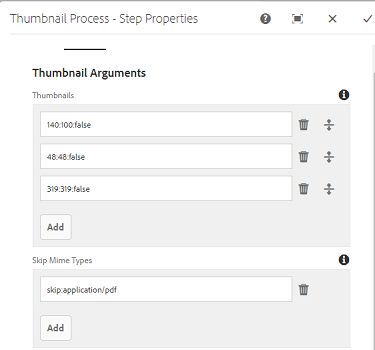

# Usar el rasterizador de PDF {#using-pdf-rasterizer}

Al cargar archivos PDF o AI grandes y con gran contenido en [!DNL Adobe Experience Manager Assets], es posible que la biblioteca predeterminada no genere una salida precisa. La biblioteca Rasterizer PDF de Adobe puede generar una salida más fiable y precisa en comparación con la salida de una biblioteca predeterminada. Adobe recomienda utilizar la biblioteca Rasterizer de PDF para las siguientes situaciones:

Adobe recomienda utilizar la biblioteca Rasterizer de PDF para lo siguiente:

* Archivos AI o archivos PDF pesados y con gran contenido.
* Los archivos AI y PDF con miniaturas que no se generan de forma predeterminada.
* Archivos AI con colores del sistema Pantone Matching (PMS).

Las miniaturas y vistas previas generadas con el rasterizador de PDF son de mejor calidad que los resultados predeterminados y, por lo tanto, ofrecen una experiencia de visualización uniforme en todos los dispositivos. La biblioteca Rasterizer de Adobe PDF no admite conversión de espacios de color. Siempre genera RGB independientemente del espacio de color del archivo de origen.

1. Instale el paquete Rasterizador de PDF en su implementación [!DNL Adobe Experience Manager] desde [Distribución de software]
(https://experience.adobe.com/#/downloads/content/software-distribution/en/aem.html?package=/content/software-distribution/en/details.html/content/dam/aem/public/adobe/packages/cq650/product/assets/aem-assets-pdf-rasterizer-pkg-4.4.zip).

   >[!NOTE]
   >
   >La biblioteca Rasterizer de PDF solo está disponible para Windows y Linux.

1. Acceda a la consola de flujo de trabajo [!DNL Assets] en `https://[aem_server]:[port]/workflow`. Abra el flujo de trabajo [!UICONTROL Recurso de actualización de DAM].

1. Para evitar la generación de miniaturas y representaciones web para archivos PDF y archivos AI mediante los métodos predeterminados, siga estos pasos:

   * Abra el paso **[!UICONTROL Procesar miniaturas]** y añada `application/pdf` o `application/postscript` en el campo **[!UICONTROL Omitir tipos de MIME]** en la pestaña **[!UICONTROL Miniaturas]** según sea necesario.

   

   * En la pestaña **[!UICONTROL Web Enabled Image]**, añada `application/pdf` o `application/postscript` en **[!UICONTROL Skip List]** según sus necesidades.

   

1. Abra el paso **[!UICONTROL Rasterizar PDF/AI Image Preview Representation]** y elimine el tipo MIME para el que desea omitir la generación predeterminada de representaciones de imágenes de vista previa. Por ejemplo, elimine el tipo MIME `application/pdf`, `application/postscript` o `application/illustrator` de la lista **[!UICONTROL Tipos MIME]**.

   

1. Arrastre el paso **[!UICONTROL PDF Rasterizer Handler]** desde el panel lateral hasta debajo del paso **[!UICONTROL Procesar miniaturas]**.
1. Configure los siguientes argumentos para el paso **[!UICONTROL Controlador de rasterizador de PDF]**:

   * Tipos MIME: `application/pdf` o `application/postscript`
   * Comandos: `PDFRasterizer -d -s 1280 -t PNG -i ${file}`
   * Añadir tamaños de miniatura: 319:319, 140:100, 48:48. Agregue la configuración de miniaturas personalizada, si es necesario.

   Los argumentos de la línea de comandos para el comando `PDFRasterizer` pueden incluir lo siguiente:

   * `-d`: Indicador que permite procesar texto, ilustraciones vectoriales e imágenes sin problemas. Crea imágenes de mejor calidad. Sin embargo, si se incluye este parámetro, el comando se ejecuta lentamente y aumenta el tamaño de las imágenes.

   * `-s`: Dimensión máxima de la imagen (altura o anchura). Se convierte a DPI para cada página. Si las páginas tienen un tamaño diferente, cada página puede escalarse potencialmente en una cantidad diferente. El valor predeterminado es el tamaño real de la página.

   * `-t`: Tipo de imagen de salida. Los tipos válidos son JPEG, PNG, GIF y BMP. El valor predeterminado es JPEG.

   * `-i`: Ruta para el PDF de entrada. Es un parámetro obligatorio.

   * `-h`: Ayuda

1. Para eliminar representaciones intermedias, seleccione **[!UICONTROL Eliminar representación generada]**.
1. Para permitir que el rasterizador de PDF genere representaciones web, seleccione **[!UICONTROL Generar representación web]**.

   

1. Especifique la configuración en la pestaña **[!UICONTROL Web Enabled Image]**.

   

1. Guarde el flujo de trabajo.
1. Para permitir que el rasterizador de PDF procese páginas PDF con bibliotecas PDF, abra el modelo **[!UICONTROL DAM Process Subasset]** desde la consola [!UICONTROL Workflow].
1. En el panel lateral, arrastre el paso Controlador de rasterizador de PDF debajo del paso **[!UICONTROL Crear representación de imagen habilitada para Web]**.
1. Configure los siguientes argumentos para el paso **[!UICONTROL Controlador de rasterizador de PDF]**:

   * Tipos MIME: `application/pdf` o `application/postscript`
   * Comandos: `PDFRasterizer -d -s 1280 -t PNG -i ${file}`
   * Añada tamaños de miniaturas: `319:319`, `140:100`, `48:48`. Agregue la configuración de miniaturas personalizada según sea necesario.

   Los argumentos de la línea de comandos para el comando `PDFRasterizer` pueden incluir lo siguiente:

   * `-d`: Indicador que permite procesar texto, ilustraciones vectoriales e imágenes sin problemas. Crea imágenes de mejor calidad. Sin embargo, si se incluye este parámetro, el comando se ejecuta lentamente y aumenta el tamaño de las imágenes.

   * `-s`: Dimensión máxima de la imagen (altura o anchura). Se convierte a DPI para cada página. Si las páginas tienen un tamaño diferente, cada página puede escalarse potencialmente en una cantidad diferente. El valor predeterminado es el tamaño real de la página.

   * `-t`: Tipo de imagen de salida. Los tipos válidos son JPEG, PNG, GIF y BMP. El valor predeterminado es JPEG.

   * `-i`: Ruta para el PDF de entrada. Es un parámetro obligatorio.

   * `-h`: Ayuda

1. Para eliminar representaciones intermedias, seleccione **[!UICONTROL Eliminar representación generada]**.
1. Para permitir que el rasterizador de PDF genere representaciones web, seleccione **[!UICONTROL Generar representación web]**.

   

1. Especifique la configuración en la pestaña **[!UICONTROL Web Enabled Image]**.

   

1. Guarde el flujo de trabajo.
1. Cargue un archivo PDF o un archivo AI a [!DNL Experience Manager Assets]. PDF Rasterizer genera las miniaturas y representaciones web del archivo.
