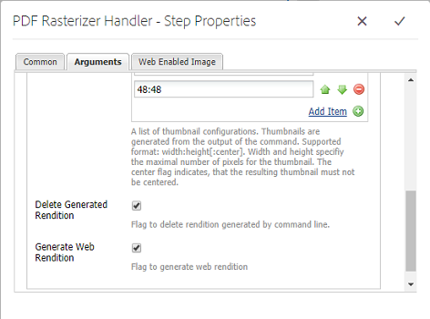

# Usar rasterizador de PDF {#using-pdf-rasterizer}

Al cargar archivos PDF o AI grandes con gran cantidad de contenido en [!DNL Adobe Experience Manager Assets], es posible que la conversión predeterminada no genere una salida precisa. La biblioteca Rasterizer de PDF de Adobe puede generar una salida más fiable y precisa en comparación con la salida de una biblioteca predeterminada. Adobe recomienda utilizar la biblioteca Rasterizer de PDF en los siguientes casos:

* Archivos AI o archivos PDF pesados y con gran contenido.
* Archivos AI y archivos PDF con miniaturas que no se generan de forma predeterminada.
* Archivos AI con colores Pantone Matching System (PMS).

Las miniaturas y previsualizaciones que se generan con el rasterizador de PDF tienen una mejor calidad en comparación con la salida lista para usar y, por lo tanto, proporcionan una experiencia de visualización uniforme en todos los dispositivos. La biblioteca Rasterizer de Adobe PDF no admite conversión de espacio de color. Siempre se envía a RGB independientemente del espacio de color del archivo de origen.

1. Instale el paquete Rasterizer PDF en su [!DNL Adobe Experience Manager] implementación desde Distribución [de](https://experience.adobe.com/#/downloads/content/software-distribution/en/aem.html?package=/content/software-distribution/en/details.html/content/dam/aem/public/adobe/packages/cq640/product/assets/aem-assets-pdf-rasterizer-pkg)software.

   >[!NOTE]
   >
   >La biblioteca Rasterizer PDF solo está disponible para Windows y Linux.

1. Acceda a la consola [!DNL Assets] de flujo de trabajo en `https://[aem_server]:[port]/workflow`. Abra el flujo de trabajo [!UICONTROL de recursos] de actualización de DAM.

1. Para evitar que la generación de miniaturas y representaciones web para archivos PDF y archivos AI utilice los métodos predeterminados, siga estos pasos:

   * Abra el paso **[!UICONTROL Miniaturas]** de proceso y agregue `application/pdf` o `application/postscript` en el campo **[!UICONTROL Omitir tipos]** de MIME en la ficha **[!UICONTROL Miniaturas]** , según sea necesario.

   

   * En la ficha Imagen **[!UICONTROL habilitada para]** Web, agregue `application/pdf` o `application/postscript` debajo de **[!UICONTROL Omitir Lista]** según sus necesidades.

   

1. Abra el paso **[!UICONTROL Rasterizar representación]** de Previsualización de imagen PDF/AI y elimine el tipo MIME para el que desea omitir la generación predeterminada de representaciones de imágenes de previsualización. Por ejemplo, elimine el tipo MIME `application/pdf`, `application/postscript`o `application/illustrator` de la lista Tipos **** MIME.

   

1. Arrastre el paso Controlador de rasterizador **** PDF desde el panel lateral hasta debajo del paso Miniaturas **[!UICONTROL de]** proceso.
1. Configure los siguientes argumentos para el paso del controlador de rasterizador **** PDF:

   * Tipos MIME: `application/pdf` o `application/postscript`
   * Comandos: `PDFRasterizer -d -p 1 -s 1280 -t PNG -i ${file}`
   * Añadir tamaños de miniaturas: 319:319, 140:100, 48:48. Añada la configuración de miniaturas personalizada, si es necesario.

   Los argumentos de la línea de comandos del `PDFRasterizer` comando pueden incluir lo siguiente:

   * `-d`:: Marca para permitir la representación suave de texto, ilustraciones vectoriales e imágenes. Crea imágenes de mejor calidad. Sin embargo, si se incluye este parámetro, el comando se ejecuta lentamente y aumenta el tamaño de las imágenes.

   * `-p`:: Número de página. El valor predeterminado son todas las páginas. Para denotar todas las páginas, utilice `*`.

   * `-s`:: Dimensión máxima de la imagen (altura o anchura). Se convierte a PPP para cada página. Si las páginas tienen un tamaño diferente, cada página podría escalarse en una cantidad diferente. El valor predeterminado es el tamaño real de la página.

   * `-t`:: Tipo de imagen de salida. Los tipos válidos son JPEG, PNG, GIF y BMP. El valor predeterminado es JPEG.

   * `-i`:: Ruta para el PDF de entrada. Es un parámetro obligatorio.

   * `-h`: Ayuda

1. Para eliminar representaciones intermedias, seleccione **[!UICONTROL Eliminar representación]** generada.

1. Para permitir que el rasterizador de PDF genere representaciones web, seleccione **[!UICONTROL Generar representación]** web.

   

1. Especifique la configuración en la ficha Imagen **[!UICONTROL habilitada para]** Web.

   

1. Guarde el flujo de trabajo.

1. Para habilitar el rasterizador de PDF para procesar páginas PDF con bibliotecas PDF, abra el modelo **[!UICONTROL DAM Process Subasset]** desde la consola [!UICONTROL Flujo de trabajo] .

1. En el panel lateral, arrastre el paso Controlador de rasterizador de PDF debajo del paso **[!UICONTROL Crear representación]** de imagen habilitada para Web.

1. Configure los siguientes argumentos para el paso del controlador de rasterizador **** PDF:

   * Tipos MIME: `application/pdf` o `application/postscript`

   * Comandos: `PDFRasterizer -d -p 1 -s 1280 -t PNG -i ${file}`
   * Añadir tamaños de miniaturas: `319:319`, `140:100`, `48:48`. Añada la configuración de miniaturas personalizadas según sea necesario.

   Los argumentos de la línea de comandos del `PDFRasterizer` comando pueden incluir lo siguiente:

   * `-d`:: Marca para permitir la representación suave de texto, ilustraciones vectoriales e imágenes. Crea imágenes de mejor calidad. Sin embargo, si se incluye este parámetro, el comando se ejecuta lentamente y aumenta el tamaño de las imágenes.

   * `-p`:: Número de página. El valor predeterminado son todas las páginas. `*` indica todas las páginas.

   * `-s`:: Dimensión máxima de la imagen (altura o anchura). Se convierte a PPP para cada página. Si las páginas tienen un tamaño diferente, cada página podría escalarse en una cantidad diferente. El valor predeterminado es el tamaño real de la página.

   * `-t`:: Tipo de imagen de salida. Los tipos válidos son JPEG, PNG, GIF y BMP. El valor predeterminado es JPEG.

   * `-i`:: Ruta para el PDF de entrada. Es un parámetro obligatorio.

   * `-h`: Ayuda

1. Para eliminar representaciones intermedias, seleccione **[!UICONTROL Eliminar representación]** generada.
1. Para permitir que el rasterizador de PDF genere representaciones web, seleccione **[!UICONTROL Generar representación]** web.

   

1. Especifique la configuración en la ficha Imagen **[!UICONTROL habilitada para]** Web.

   

1. Guarde el flujo de trabajo.
1. Cargue un archivo PDF o AI en [!DNL Experience Manager Assets]. PDF Rasterizer genera las miniaturas y las representaciones web del archivo.
