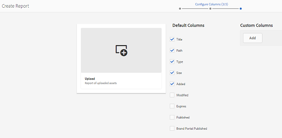

# Informes de recurso {#asset-reports}

| Versión | Vínculo del artículo |
| -------- | ---------------------------- |
| AEM as a Cloud Service | [Haga clic aquí](https://experienceleague.adobe.com/docs/experience-manager-cloud-service/content/assets/admin/asset-reports.html?lang=en) |
| AEM 6.5 | Este artículo |

Los informes de recursos le permiten evaluar la utilidad de su [!DNL Adobe Experience Manager Assets] implementación. Con [!DNL Assets], puede generar varios informes para sus recursos digitales. Los informes proporcionan información útil sobre el uso del sistema, cómo interactúan los usuarios con los recursos y cuáles se descargan y comparten.

Utilice la información de los informes para derivar métricas de éxito clave para medir la adopción de [!DNL Assets] dentro de su empresa y por parte de los clientes.

El [!DNL Assets] el marco de informes utiliza [!DNL Sling] trabajos para procesar solicitudes de informes de forma asincrónica de forma ordenada. Es escalable para repositorios grandes. El procesamiento asincrónico de informes aumenta la eficacia y la velocidad con que se generan los informes.

La interfaz de administración de informes es intuitiva e incluye opciones y controles específicos para acceder a informes archivados y ver los estados de ejecución de informes (correcto, fallido y en cola).

Cuando se genera un informe, se le notifica mediante un correo electrónico (opcional) y una notificación de la bandeja de entrada. Puede ver, descargar o eliminar un informe desde la página de lista de informes, en la que se muestran todos los informes generados anteriormente.

## Requisitos previos {#prerequisite-for-reporting}

Para generar informes, haga lo siguiente:

* Activar [!UICONTROL Grabador de eventos de CQ DAM de día] servicio desde **[!UICONTROL Herramientas]** > **[!UICONTROL Operaciones]** > **[!UICONTROL Consola web]**.
* Seleccione las actividades o eventos sobre los que desee crear informes. Por ejemplo, para generar un informe sobre los recursos descargados, seleccione [!UICONTROL Recurso descargado (DESCARGADO)].

## Generación de informes {#generate-reports}

[!DNL Experience Manager Assets] genera los siguientes informes estándar:

* Cargar
* Descargar
* Vencimiento
* Modificación
* Publicación
* [!DNL Brand Portal] publicación
* Uso del disco
* Archivos
* Vínculos compartidos

[!DNL Adobe Experience Manager] los administradores pueden generar y personalizar fácilmente estos informes para su implementación. Un administrador puede seguir estos pasos para generar un informe:

1. Entrada [!DNL Experience Manager] interfaz, haga clic en **[!UICONTROL Herramientas]** > **[!UICONTROL Assets]** > **[!UICONTROL Informes]**.

   

1. En el [!UICONTROL Informes de recursos] página, haga clic en **[!UICONTROL Crear]** en la barra de herramientas.
1. Desde el **[!UICONTROL Crear informe]** , seleccione el informe que desee crear y haga clic en **[!UICONTROL Siguiente]**.

   

   >[!NOTE]
   >
   >De forma predeterminada, los fragmentos de contenido y los vínculos compartidos se incluyen en el recurso [!UICONTROL Descargar] informe. Seleccione la opción adecuada para crear un informe de vínculos compartidos o para excluir fragmentos de contenido del informe de descarga.

   >[!NOTE]
   >
   >El [!UICONTROL Descargar] Este informe muestra los detalles de solo aquellos recursos que se descargan después de seleccionarlos individualmente o que se descargan mediante Acción rápida. Sin embargo, no incluye los detalles de los recursos que se encuentran dentro de una carpeta descargada.

1. Configure detalles del informe, como título, descripción, miniatura y ruta de la carpeta en el repositorio CRX donde se almacena el informe. De forma predeterminada, la ruta de la carpeta es `/content/dam`. Puede especificar una ruta diferente.

   

   Elija el intervalo de fechas para el informe.

   Puede optar por generar el informe ahora o en una fecha y hora futuras.

   >[!NOTE]
   >
   >Si decide programar el informe más adelante, asegúrese de especificar la fecha y la hora en los campos Fecha y Hora. Si no se especifica ningún valor, el motor de informes lo trata como un informe que se va a generar instantáneamente.

   Los campos de configuración pueden variar según el tipo de informe que cree. Por ejemplo, la variable **[!UICONTROL Uso de disco]** El informe proporciona opciones para incluir representaciones de recursos al calcular el espacio en disco utilizado por los recursos. Puede elegir incluir o excluir recursos en subcarpetas para el cálculo del uso del disco.

   >[!NOTE]
   >
   >El informe **[!UICONTROL Uso del disco]** no incluye campos de intervalo de fechas porque solo indica el uso actual del espacio en disco.

   

   Al crear el **[!UICONTROL Archivos]** , puede incluir/excluir subcarpetas. Sin embargo, no puede incluir representaciones de recursos para este informe.

   

   El informe **[!UICONTROL Compartir vínculos]** muestra las direcciones URL de los recursos que se comparten con usuarios externos desde [!DNL Assets]. Incluye los ID de correo electrónico del usuario que ha compartido los recursos, los ID de correo electrónico de los usuarios con los que se comparten los recursos, la fecha de uso compartido y la fecha de caducidad del vínculo. Las columnas no se pueden personalizar.

   El **[!UICONTROL Vínculos compartidos]** no incluye opciones para subcarpetas y representaciones porque solo publica las direcciones URL compartidas que aparecen en `/var/dam/share`.

   

1. Clic **[!UICONTROL Siguiente]** en la barra de herramientas.

1. En el **[!UICONTROL Configurar columnas]** de forma predeterminada, algunas columnas están seleccionadas para aparecer en el informe. Puede seleccionar más columnas. Cancelar la selección de una columna para excluirla en el informe.

   

   Para mostrar un nombre de columna personalizado o una ruta de propiedad, configure las propiedades del binario de recursos en `jcr:content` en CRX. Como alternativa, agréguela mediante el selector de rutas de propiedades.

   

1. Clic **[!UICONTROL Crear]** en la barra de herramientas. Un mensaje notifica que se ha iniciado la generación del informe.
1. En el [!UICONTROL Informes de recursos] página, el estado de generación del informe se basa en el estado actual del trabajo de informe, por ejemplo, [!UICONTROL Correcto], [!UICONTROL Error], [!UICONTROL En cola], o [!UICONTROL Programado]. El mismo estado aparece en la bandeja de entrada de notificaciones. Para ver la página del informe, haga clic en el vínculo del informe. También puede seleccionar el informe y hacer clic en **[!UICONTROL Ver]** en la barra de herramientas.

   

   Clic **[!UICONTROL Descargar]** en la barra de herramientas para descargar el informe en formato CSV.

## Añadir columnas personalizadas {#add-custom-columns}

Puede agregar columnas personalizadas a los siguientes informes para mostrar más datos para sus requisitos personalizados:

* Cargar
* Descargar
* Vencimiento
* Modificación
* Publicación
* [!DNL Brand Portal] publicación
* Archivos

Para añadir columnas personalizadas a estos informes, siga estos pasos:

1. En el [!DNL Manager interface], haga clic en **[!UICONTROL Herramientas]** > **[!UICONTROL Assets]** > **[!UICONTROL Informes]**.
1. En el [!UICONTROL Informes de recursos] página, haga clic en **[!UICONTROL Crear]** en la barra de herramientas.

1. Desde el **[!UICONTROL Crear informe]** , seleccione el informe que desee crear y haga clic en **[!UICONTROL Siguiente]**.
1. Configure los detalles del informe, como el título, la descripción, la miniatura, la ruta de la carpeta y el intervalo de fechas según corresponda.

1. Para mostrar una columna personalizada, especifique el nombre de la columna debajo de **[!UICONTROL Columnas personalizadas]**.

   

1. Añada la ruta de la propiedad en `jcr:content` en CRXDE utilizando el selector de ruta de propiedad. También puede escribir la ruta en el campo de ruta de la propiedad.

   

   Para agregar más columnas personalizadas, haga clic en **[!UICONTROL Añadir]** y repita los pasos 5 y 6.

1. Clic **[!UICONTROL Crear]** en la barra de herramientas. Un mensaje notifica que se ha iniciado la generación del informe.

## Configuración del servicio de depuración {#configure-purging-service}

Para eliminar los informes que ya no necesite, configure el servicio de depuración de informes de DAM desde la consola web para depurar los informes existentes en función de su cantidad y antigüedad.

1. Acceda a la consola web (administrador de configuración) desde `https://[aem_server]:[port]/system/console/configMgr`.
1. Abra el **[!UICONTROL Servicio de purga de informes DAM]** configuración.
1. Especifique la frecuencia (intervalo de tiempo) para el servicio de depuración en la variable `scheduler.expression.name` field. También puede configurar la edad y el umbral de cantidad para los informes.
1. Guarde los cambios.

## Información, sugerencias y limitaciones de solución de problemas {#best-practices-and-limitations}

* Si algunos informes o números de los informes no están disponibles o no se encuentran disponibles según lo esperado, asegúrese de que [!UICONTROL Grabador de eventos de CQ DAM de día] el servicio está activado.

* Elimine los informes que ya no sean necesarios. Utilice las opciones de configuración del servicio de depuración de informes de DAM para configurar los criterios de depuración de informes.

* Si el Informe de uso del disco no se genera y está utilizando [!DNL Dynamic Media], asegúrese de que todos los recursos proceden correctamente. Para resolverlo, vuelva a procesar los recursos y, a continuación, genere el informe de nuevo.
