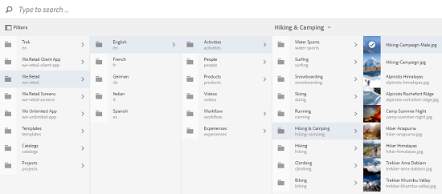

# Selector de recursos {#asset-selector}

>[!NOTE]
>
>Se invocó el selector de recursos [Selector de recursos](https://helpx.adobe.com/experience-manager/6-2/assets/using/asset-picker.html) en versiones anteriores de [!DNL Experience Manager].

El selector de recursos le permite examinar, buscar y filtrar recursos en [!DNL Adobe Experience Manager] Recursos. También puede recuperar los metadatos de los recursos que seleccione con el selector de recursos. Para personalizar la interfaz del selector de recursos, puede iniciarla con parámetros de solicitud admitidos. Estos parámetros establecen el contexto del selector de recursos para un escenario en particular.

Actualmente, puede pasar los parámetros de solicitud `assettype` (*Imagen/Vídeo/Texto*) y selección `mode` (*Único/múltiple*) como información contextual para el selector de recursos, que permanece intacta durante toda la selección.

El selector de recursos utiliza el HTML 5 **Window.postMessage** para enviar datos del recurso seleccionado al destinatario.

El selector de recursos se basa en el vocabulario del selector de base de Granite. De forma predeterminada, el selector de recursos funciona en modo Examinar. Sin embargo, puede aplicar filtros utilizando la experiencia Omnisearch para restringir la búsqueda de recursos concretos.

Puede integrar cualquier página web (independientemente de si forma parte del contenedor de CQ) con el selector de recursos (`https://[AEM_server]:[port]/aem/assetpicker.html`).

## Parámetros contextuales {#contextual-parameters}

Puede pasar los siguientes parámetros de solicitud en una URL para iniciar el selector de recursos en un contexto determinado:

| Nombre | Valores | Ejemplo | Función |
|---|---|---|---|
| sufijo de recurso (B) | Ruta de carpeta como sufijo de recurso en la URL:`http://localhost:4502/aem/` `assetpicker.html/<folder_path>` | Para iniciar el selector de recursos con una carpeta concreta seleccionada, por ejemplo, con la carpeta `/content/dam/we-retail/en/activities` seleccionada, la dirección URL debe tener el siguiente formato: `http://localhost:4502/aem/assetpicker.html` `/content/dam/we-retail/en/activities?assettype=images` | Si necesita seleccionar una carpeta concreta cuando se inicia el selector de recursos, pasarla como sufijo de recurso. |
| mode | único, múltiple | `http://localhost:4502/aem/assetpicker.html` `?mode=multiple`   `http://localhost:4502/aem/assetpicker.html` `?mode=single` | En el modo múltiple, puede seleccionar varios recursos simultáneamente mediante el selector de recursos. |
| cuadro de diálogo | true, false | `http://localhost:4502/aem/assetpicker.html` `?dialog=true` | Utilice estos parámetros para abrir el selector de recursos como cuadro de diálogo de Granite. Esta opción solo es aplicable cuando se inicia el selector de recursos a través de Granite Path Field y se configura como pickerSrc URL. |
| root | `<folder_path>` | `http://localhost:4502/aem/` `assetpicker.html?assettype=images` `&root=/content/dam/we-retail/en/activities` | Utilice esta opción para especificar la carpeta raíz del selector de recursos. En este caso, el selector de recursos permite seleccionar solo recursos secundarios (directos/indirectos) en la carpeta raíz. |
| viewmode | buscar |  | Para iniciar el selector de recursos en modo de búsqueda, con parámetros de tipo de recurso y tipo de mimetype. |
| assettype (S) | imágenes, documentos, multimedia, archivos | <ul><li>`http://localhost:4502/aem/assetpicker.html?viewmode=search&assettype=images`</li> <li>`http://localhost:4502/aem/assetpicker.html?viewmode=search&assettype=documents`</li> <li>`http://localhost:4502/aem/assetpicker.html?viewmode=search&assettype=multimedia`</li> <li>`http://localhost:4502/aem/assetpicker.html?viewmode=search&assettype=archives`</li> | Utilice esta opción para filtrar los tipos de recursos según el valor pasado. |
| mimetype | mimetype(s) (`/jcr:content/metadata/dc:format`) de un recurso (también se admite el comodín) | <ul><li>`http://localhost:4502/aem/assetpicker.html?viewmode=search&mimetype=image/png`</li>  <li>`http://localhost:4502/aem/assetpicker.html?viewmode=search&?mimetype=*png`</li>  <li>`http://localhost:4502/aem/assetpicker.html?viewmode=search&mimetype=*presentation`</li>  <li>`http://localhost:4502/aem/assetpicker?viewmode=search&mimetype=*presentation&mimetype=*png`</li></ul> | Utilícelo para filtrar recursos en función de tipos MIME |

## Uso del selector de recursos {#using-the-asset-selector}

1. Para acceder a la interfaz del selector de recursos, vaya a `https://[AEM_server]:[port]/aem/assetpicker`.
1. Vaya a la carpeta deseada y seleccione uno o varios recursos.

   

   También puede buscar el recurso deseado en el cuadro OmniSearch y luego seleccionarlo.

   

   Si busca recursos mediante el cuadro OmniSearch, puede seleccionar varios filtros de la variable **[!UICONTROL Filtros]** para restringir la búsqueda.

   

1. Toque o haga clic **[!UICONTROL Select]** en la barra de herramientas.
