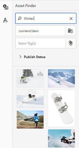

# Plantillas de recursos {#asset-templates}

Las plantillas de recursos son una clase especial de recursos que facilitan un reuso rápido del contenido con gran riqueza visual para medios digitales y de impresión. Una plantilla de recursos incluye dos partes, la sección de mensajería fija y la sección editable. La sección de mensajería fija puede contener contenido propio, como el logotipo de la marca y la información de copyright que está desactivada para la edición. La sección editable puede contener contenido visual y textual en campos que se pueden editar para personalizar la mensajería.

La flexibilidad para realizar ediciones limitadas mientras se asegura la señalización global hace que las plantillas de recursos sean componentes básicos ideales para una rápida adaptación y distribución del contenido como artefactos de contenido para diversas funciones. El redireccionamiento del contenido ayuda a reducir el coste de la administración de canales digitales e impresos y ofrece experiencias holísticas y coherentes en todos estos canales.

Como especialista en marketing, puede almacenar y administrar plantillas dentro de [!DNL Experience Manager Assets] y utilizar una sola plantilla base para crear varias experiencias de impresión personalizadas con facilidad. Puede crear varios tipos de material publicitario de marketing, incluidos folletos, folletos, postales, tarjetas de visita, etc., para transmitir su mensaje de marketing a los clientes de forma lúcida. También puede ensamblar salidas de impresión de varias páginas a partir de salidas de impresión existentes o nuevas. Sobre todo, puede ofrecer simultáneamente experiencias digitales e impresas con facilidad para proporcionar una experiencia coherente e integrada a los usuarios.

Aunque las plantillas de recursos son en su mayoría [!DNL Adobe InDesign] archivos, la competencia en [!DNL Adobe InDesign] no es una barrera para la creación de artefactos estelares. No es necesario asignar los campos de la plantilla [!DNL Adobe InDesign] a los campos de producto que necesita para crear catálogos. Puede editar las plantillas en modo WYSIWYG directamente en la interfaz web. Sin embargo, para que [!DNL Adobe InDesign] procese los cambios de edición, primero debe configurar [!DNL Experience Manager Assets] para integrarse con [!DNL Adobe InDesign Server].

La capacidad de editar [!DNL Adobe InDesign] plantillas desde la interfaz web ayuda a fomentar una buena colaboración entre el personal creativo y el personal de marketing. La mayor velocidad de contenido reduce el tiempo de salida al mercado para las garantías de marketing.

Puede lograr lo siguiente con las plantillas de recursos:

* Modifique los campos de plantilla editables desde la interfaz web.
* Controle el estilo básico del texto, por ejemplo el tamaño de fuente, el estilo y el tipo en el nivel de etiqueta.
* Cambiar imágenes dentro de la plantilla mediante el selector de contenido.
* Vista previa de las ediciones de plantillas.
* Combine varios archivos de plantilla para crear un artefacto de varias páginas.

Al elegir una plantilla para el material colateral, [!DNL Experience Manager Assets] crea una copia de la plantilla que puede editar. Se conserva la plantilla original, lo que garantiza que la señalización global permanezca intacta y se pueda reutilizar para garantizar la coherencia de la marca.

Puede exportar el archivo actualizado dentro de la carpeta principal en los formatos INDD, PDF o JPG. También puede descargar la salida en estos formatos en su sistema de archivos local.

## Creación de un colateral {#creating-a-collateral}

Considere un escenario en el que desee crear garantías digitales imprimibles, como folletos, folletos y publicidades para una próxima campaña, y compartirlas con tiendas de venta en todo el mundo. La creación de material colateral basado en una plantilla ayuda a ofrecer una experiencia de cliente unificada en todos los canales. Los diseñadores pueden crear las plantillas de campaña (de una sola página o de varias páginas) mediante una solución creativa como [!DNL InDesign] y cargar las plantillas en [!DNL Experience Manager Assets] para usted. Antes de crear un colateral, haga que una o más plantillas INDD se carguen en y estén disponibles con [!DNL Experience Manager] antelación.

1. En la interfaz [!DNL Experience Manager] haga clic en [!UICONTROL Assets].

1. En las opciones, seleccione **[!UICONTROL Templates]**.

   

1. Haga clic en **[!UICONTROL Crear]** y, a continuación, elija el colateral que desee crear en el menú. Por ejemplo, elija **[!UICONTROL Folleto]**.

   

1. Tenga una o más plantillas INDD cargadas en y disponibles con [!DNL Experience Manager] antelación. Elija una plantilla para el folleto y haga clic en **[!UICONTROL Siguiente]**.
1. Especifique un nombre y una descripción opcional para el folleto.

   

1. (Opcional) Haga clic en **[!UICONTROL Etiquetas]** y seleccione una o más etiquetas para el folleto. Haga clic en **[!UICONTROL Confirm]** para confirmar la selección.
1. Haga clic en **[!UICONTROL Crear]**. Un cuadro de diálogo confirma que se crea un nuevo folleto. Haga clic en **[!UICONTROL Abrir]** para abrir el folleto en modo de edición.

   <!-- -->

   Como alternativa, cierre el cuadro de diálogo y vaya a la carpeta de la página Plantillas con la que comenzó a trabajar para ver el folleto que ha creado. El tipo de garantía aparece en su miniatura en la vista de tarjeta. Por ejemplo, en este caso, la palabra [!UICONTROL Folleto] se muestra en la miniatura.

   

## Editar una garantía {#editing-a-collateral}

Puede editar un colateral inmediatamente después de crearlo. También puede abrirlo desde la página [!UICONTROL Plantillas] o la página de recursos.

1. Para abrir el material secundario para editarlo, realice una de las siguientes acciones:

   * Abra el colateral (folleto en este caso) que creó en el paso 7 de [Crear un colateral](/help/assets/asset-templates.md#creating-a-collateral).
   * En la página Plantillas , vaya a la carpeta en la que creó el material colateral y haga clic en la acción rápida [!UICONTROL Editar] en la miniatura de un material colateral.
   * En la página del recurso para el material colateral, haga clic en **[!UICONTROL Editar]** en la barra de herramientas.
   * Seleccione el colateral y haga clic en **[!UICONTROL Edit]** en la barra de herramientas.

   <!-- -->

   El buscador de recursos y el editor de texto se muestran a la izquierda de la página. El editor de texto está abierto de forma predeterminada.

   Puede utilizar el editor de texto para modificar el texto que desea que se muestre en el campo de texto. Puede modificar el tamaño de fuente, el estilo, el color y el tipo en el nivel de etiqueta.

   Con el buscador de recursos, puede examinar o buscar imágenes dentro de [!DNL Experience Manager Assets] y reemplazar las imágenes editables en la plantilla por las imágenes que elija.

   

   Los editables se muestran a la derecha. Para que un campo se pueda editar en [!DNL Experience Manager Assets], el campo correspondiente de la plantilla debe etiquetarse en [!DNL InDesign]. En otras palabras, deben marcarse como editables en [!DNL InDesign].

   >[!NOTE]
   >
   >Asegúrese de que la implementación [!DNL Experience Manager] está integrada con un [!DNL InDesign Server] para permitir que [!DNL Experience Manager Assets] extraiga datos de la plantilla [!DNL InDesign] y que esté disponible para edición. Para obtener más información, consulte [Integración de recursos de Experience Manager con InDesign Server](/help/assets/indesign.md).

1. Para modificar el texto de un campo editable, haga clic en el campo de texto de la lista de campos editables y edite el texto en el campo.

   

   Puede editar las propiedades del texto, por ejemplo el estilo de fuente, el color y el tamaño, utilizando las opciones proporcionadas.

1. Haga clic en **[!UICONTROL Preview]** para obtener una vista previa de los cambios de texto.

1. Para intercambiar una imagen, haga clic en **[!UICONTROL Buscador de recursos]** .

1. Seleccione el campo de imagen de la lista de campos editables y, a continuación, arrastre una imagen desde el selector de recursos al campo editable.

   

   También puede buscar imágenes utilizando palabras clave, etiquetas y según su estado de publicación. Puede navegar por el repositorio [!DNL Experience Manager Assets] y navegar a la ubicación de la imagen deseada.

   

1. Haga clic en **[!UICONTROL Preview]** para previsualizar la imagen.
1. Para editar una página específica en un material de varias páginas, utilice el navegador de páginas de la parte inferior.

1. Haga clic en **[!UICONTROL Preview]** en la barra de herramientas para obtener una vista previa de todos los cambios. Haga clic en **[!UICONTROL Listo]** para guardar los cambios de edición en el colateral.

   >[!NOTE]
   >
   >Las opciones Vista previa y Listo solo se activan cuando los campos de imagen editables del material no tienen iconos que falten. Si falta algún icono en el colateral, es porque [!DNL Experience Manager] no puede resolver las imágenes en la plantilla [!DNL InDesign]. Por lo general, [!DNL Experience Manager] no puede resolver imágenes en los siguientes casos:
   >
   >* Las imágenes no están incrustadas en la plantilla [!DNL InDesign] subyacente.
   >* Las imágenes están vinculadas desde el sistema de archivos local.

   >
   >Para habilitar [!DNL Experience Manager] para resolver imágenes, haga lo siguiente:
   >
   >* Incruste imágenes al crear plantillas [!DNL InDesign] (Consulte [Acerca de los vínculos y los gráficos incrustados](https://helpx.adobe.com/indesign/using/graphics-links.html)).
   >* Monte [!DNL Experience Manager] en el sistema de archivos local y, a continuación, asigne los iconos que faltan con los recursos existentes en [!DNL Experience Manager].

   >
   >Para obtener más información sobre cómo trabajar con [!DNL InDesign] documentos, consulte [prácticas recomendadas para trabajar con documentos de InDesign en Experience Manager](https://helpx.adobe.com/experience-manager/kb/best-practices-idd-docs-aem.html).

1. Para generar una representación PDF para el folleto, seleccione la opción Acrobat en el cuadro de diálogo y haga clic en **[!UICONTROL Continuar]**.
1. El material colateral se crea en la carpeta con la que comenzó. Para ver las representaciones, abra el material colateral y seleccione **[!UICONTROL Representaciones]** en la lista de navegación global.

   

1. Haga clic en la representación PDF en la lista de representaciones para descargar el archivo PDF. Abra el archivo PDF para revisar el material colateral.

   

## Combinar material colateral {#merge-collateral}

1. En la interfaz [!DNL Experience Manager] haga clic en [!UICONTROL Assets] en la página Navegación.

1. En las opciones, seleccione **[!UICONTROL Templates]**.

1. Haga clic en **[!UICONTROL Create]** y seleccione **[!UICONTROL Merge]** en el menú.

   

1. En la página [!UICONTROL Combinar plantilla], haga clic en **[!UICONTROL Combinar]** .

1. Vaya a la ubicación del material que desea combinar, haga clic en las miniaturas del material que desea combinar para seleccionarlo.

   

   También puede buscar plantillas en el cuadro Omnisearch .

   Puede navegar por el repositorio o las colecciones [!DNL Experience Manager Assets], navegar a la ubicación de las plantillas deseadas y, a continuación, seleccionarlas para fusionarlas.

   Puede aplicar varios filtros para buscar en las plantillas que desee. Por ejemplo, puede buscar plantillas basadas en el tipo de archivo o en etiquetas.

1. Haga clic en **[!UICONTROL Next]** en la barra de herramientas.
1. En la pantalla **[!UICONTROL Preview &amp; Reorder]**, reorganice las plantillas si es necesario y previsualice la selección de plantillas que desea combinar. A continuación, haga clic en **[!UICONTROL Next]** en la barra de herramientas.

   

1. En la pantalla [!UICONTROL Configurar plantilla], especifique un nombre para el colateral. De forma opcional, especifique las etiquetas que considere adecuadas. Si desea exportar la salida en formato PDF, seleccione **[!UICONTROL Acrobat (.PDF)]**. De forma predeterminada, el material colateral se exporta en formato JPG y [!DNL InDesign]. Para cambiar la miniatura de visualización del material de varias páginas, haga clic en **[!UICONTROL Cambiar miniatura]**.

   

1. Haga clic en **[!UICONTROL Save]** y, a continuación, haga clic en **[!UICONTROL OK]** en el cuadro de diálogo para cerrar el cuadro de diálogo. El material colateral de varias páginas se crea en la carpeta con la que comenzó.

   >[!NOTE]
   >
   >No se puede editar un material combinado posteriormente ni utilizarlo para crear otro material colateral.

## Prácticas recomendadas y limitaciones {#best-practices-limitations-tips}

* El editor [!DNL InDesign] de [!DNL Experience Manager] funciona a nivel de etiqueta y todo el texto de una sola etiqueta se considera una sola entidad. Para conservar el formato y los estilos de texto durante la edición, etiquete cada párrafo (o texto con un estilo diferente) por separado.
