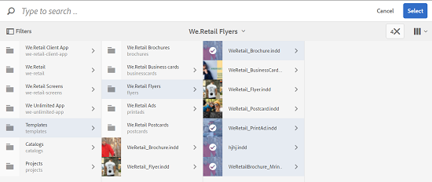

# Asset templates {#asset-templates}

Las plantillas de recursos son una clase especial de recursos que facilitan la reutilización rápida de contenido con gran riqueza visual para medios digitales e impresos. Una plantilla de recurso incluye dos partes, la sección de mensajería fija y la sección editable.

La sección de mensajes fijos puede contener contenido propio, como el logotipo de la marca y la información de copyright que está desactivada para la edición. La sección editable puede contener contenido visual y textual en los campos que se pueden editar para personalizar la mensajería.

La flexibilidad para realizar ediciones limitadas y, al mismo tiempo, asegurar la señalización global, hace que las plantillas de recursos sean los componentes básicos idóneos para una rápida adaptación y distribución del contenido como artefactos de contenido para diversas funciones. La reasignación del propósito del contenido ayuda a reducir el coste de la administración de los canales digitales e impresos y ofrece experiencias holísticas y coherentes en todos estos canales.

Como especialista en marketing, puede almacenar y gestionar plantillas en Recursos AEM y utilizar una única plantilla base para crear varias experiencias de impresión personalizadas con facilidad. Puede crear varios tipos de material publicitario de marketing, como folletos, volantes, postales, tarjetas de presentación, etc., para transmitir con lentitud su mensaje de marketing a los clientes. También puede montar salidas de impresión de varias páginas a partir de salidas de impresión nuevas o existentes. Por encima de todo, puede ofrecer simultáneamente experiencias digitales y de impresión con facilidad para ofrecer una experiencia coherente e integrada a los usuarios.

Aunque las plantillas de recursos son principalmente archivos de Adobe InDesign, la competencia en Adobe InDesign no es una barrera para la creación de artefactos estelares. No es necesario asignar los campos de la plantilla de Adobe InDesign a los campos de producto que, de lo contrario, se requieren al crear catálogos. Puede editar las plantillas en modo WYSIWYG directamente en la interfaz web. Sin embargo, para que Adobe InDesign procese los cambios de edición, primero debe configurar Recursos AEM para integrarlos con Adobe InDesign Server.

La capacidad de editar plantillas de Adobe InDesign desde la interfaz web ayuda a fomentar una mayor colaboración entre el personal de Creative y Marketing, al tiempo que reduce el tiempo de comercialización para las iniciativas de promoción locales.

Puede hacer lo siguiente con plantillas de recursos:

* Modificación de campos de plantilla editables desde la interfaz web
* Controlar el estilo básico del texto, por ejemplo, el tamaño de fuente, el estilo y el tipo en el nivel de etiqueta
* Cambiar imágenes dentro de la plantilla mediante el selector de contenido
* Vista previa de ediciones de plantillas
* Combinar varios archivos de plantilla para crear un artefacto de varias páginas

Al elegir una plantilla para el material colateral, Recursos AEM crea una copia de la plantilla que puede editar. Se conserva la plantilla original, lo que garantiza que la señalización global permanezca intacta y se pueda reutilizar para reforzar la coherencia de la marca.

Puede exportar el archivo actualizado en la carpeta principal con los siguientes formatos:

* INDD
* PDF
* JPG

También puede descargar la salida en estos formatos al sistema local.

## Crear una garantía {#creating-a-collateral}

Considere un escenario en el que desee crear material publicitario digital imprimible, como folletos, volantes y publicidades para una próxima campaña y compartir con tiendas de venta en todo el mundo. La creación de material publicitario basado en una plantilla ayuda a ofrecer una experiencia unificada del cliente en todos los canales. Los diseñadores pueden crear plantillas de campaña (una sola página o varias páginas) mediante una solución creativa, como InDesign, y cargar las plantillas a Recursos AEM por usted. Antes de crear un colateral, tenga una o varias plantillas INDD cargadas y disponibles en Experience Manager con antelación.

1. Toque o haga clic en el logotipo de AEM y, a continuación, toque o haga clic en Recursos.

1. En las opciones, seleccione **[!UICONTROL Plantillas]**.

   

1. Toque o haga clic en **[!UICONTROL Crear]** y, a continuación, elija el material que desee crear en el menú. Por ejemplo, elija **[!UICONTROL Folleto]**.

   

1. Tenga una o varias plantillas INDD cargadas y disponibles en Experience Manager por adelantado. Elija una plantilla para el folleto y toque o haga clic en **[!UICONTROL Siguiente]**.

   

1. Especifique un nombre y una descripción opcional para el folleto.

   

1. (Opcional) Toque **[!UICONTROL Etiquetas]** y seleccione una o varias etiquetas para el folleto. Toque **[!UICONTROL Confirmar]** para confirmar la selección.

   

1. Haga clic en **[!UICONTROL Crear]**. Un cuadro de diálogo confirma que se crea un nuevo folleto. Toque o haga clic en **[!UICONTROL Abrir]** para abrir el folleto en modo de edición.

   <!-- -->

   De forma alternativa, cierre el cuadro de diálogo y vaya a la carpeta de la página Plantillas con la que comenzó para ver el folleto que ha creado. El tipo de material publicitario aparece en su miniatura en la vista de tarjeta. Por ejemplo, en este caso, el folleto se muestra en la miniatura.

   

## Editar una garantía {#editing-a-collateral}

Puede editar un colateral inmediatamente después de crearlo. También puede abrirlo desde la página Plantillas o desde la página de recursos.

1. Para abrir el material publicitario para la edición, realice una de las siguientes acciones:

   * Abra el colateral (folleto en este caso) que ha creado en el paso 7 de [Crear una colateral](/help/assets/asset-templates.md#creating-a-collateral).
   * En la página Plantillas, desplácese hasta la carpeta en la que haya creado el colateral y toque o haga clic en la acción rápida Editar en la miniatura de un colateral.
   * En la página de recursos del material promocional, toque **[!UICONTROL Editar]** en la barra de herramientas.
   * Seleccione el colateral y toque **[!UICONTROL Editar]** en la barra de herramientas.
   <!-- -->

   El buscador de recursos y el editor de texto se muestran a la izquierda de la página. El editor de texto está abierto de forma predeterminada.

   Puede utilizar el editor de texto para modificar el texto que desea que se muestre en el campo de texto. Puede modificar el tamaño, el estilo, el color y el tipo de fuente en el nivel de etiqueta.

   Con el buscador de recursos, puede buscar o buscar imágenes en Recursos AEM y reemplazar las imágenes editables de la plantilla por las imágenes que desee.

   

   Los editables se muestran a la derecha. Para que un campo pueda editarse en Recursos AEM, el campo correspondiente de la plantilla debe etiquetarse en InDesign. En otras palabras, deben marcarse como editables en InDesign.

   

   >[!NOTE]
   >
   >Asegúrese de que la instancia de AEM está integrada con un servidor de InDesign para permitir que Recursos AEM extraiga datos de la plantilla de InDesign y los ponga a disposición para su edición. Para obtener más información, consulte [Integración de AEM Assets con InDesign Server](/help/assets/indesign.md).

1. Para modificar el texto de un campo editable, toque o haga clic en el campo de texto de la lista de campos editables y edite el texto del campo.

   

   Puede editar las propiedades del texto, por ejemplo, el estilo de fuente, el color y el tamaño, mediante las opciones proporcionadas.

1. Toque **[!UICONTROL Vista previa]** para obtener una vista previa de los cambios de texto.

   

1. Para intercambiar una imagen, toque el **[!UICONTROL Buscador]** de recursos.

   

1. Seleccione el campo de imagen de la lista de campos editables y, a continuación, arrastre una imagen deseada del selector de recursos al campo editable.

   

   También puede buscar imágenes mediante palabras clave, etiquetas y según su estado de publicación. Puede navegar por el repositorio de Recursos AEM y navegar hasta la ubicación de la imagen deseada.

   

1. Toque **[!UICONTROL Vista previa]** para obtener una vista previa de la imagen.

   

1. Para editar una página específica en una página secundaria de varias páginas, utilice el navegador de páginas en la parte inferior.

   

1. Toque **[!UICONTROL Vista previa]** en la barra de herramientas para obtener una vista previa de todos los cambios. Toque o haga clic en **[!UICONTROL Listo]** para guardar los cambios de edición en el colateral.

   >[!NOTE]
   >
   >Los iconos Vista previa y Listo solo se activan cuando los campos de imagen editables del material no tienen iconos que faltan. Si falta algún icono en el colateral, se debe a que AEM no puede resolver las imágenes en la plantilla de InDesign. Normalmente, AEM no puede resolver imágenes en los siguientes casos:
   >
   >    * Las imágenes no están incrustadas en la plantilla subyacente de InDesign
   >    * Las imágenes están vinculadas desde el sistema de archivos local
   >
   >Para permitir que AEM resuelva imágenes, haga lo siguiente:
   >
   >    * Incruste imágenes al crear plantillas de InDesign (consulte [Acerca de los vínculos y los gráficos](https://helpx.adobe.com/indesign/using/graphics-links.html)incrustados).
   >    * Monte AEM en el sistema de archivos local y, a continuación, asigne los iconos que faltan a los recursos de AEM existentes.
   >
   >Para obtener más información sobre el trabajo con documentos de InDesign, consulte [Prácticas recomendadas para trabajar con documentos de InDesign en AEM](https://helpx.adobe.com/experience-manager/kb/best-practices-idd-docs-aem.html).

1. Para generar una representación en PDF del folleto, seleccione la opción Acrobat en el cuadro de diálogo y haga clic en **[!UICONTROL Continuar]**.
1. El colateral se crea en la carpeta en la que se inició. Para ver las representaciones, abra el colateral y seleccione **[!UICONTROL Representaciones]** en la lista GlobalNav.

   

1. Toque o haga clic en la representación PDF en la lista de representaciones para descargar el archivo PDF. Abra el archivo PDF para revisar el material promocional.

   

## Combinar material publicitario {#merge-collateral}

1. Toque o haga clic en el logotipo de AEM y, a continuación, toque o haga clic en Recursos en la página de navegación.
1. En las opciones, seleccione **[!UICONTROL Plantillas]**.
1. Toque o haga clic en **[!UICONTROL Crear]** y elija **[!UICONTROL Combinar]** en el menú.

   

1. En la página Combinar  plantilla, toque **[!UICONTROL Combinar]**.

   

1. Vaya a la ubicación del material que desea combinar, toque o haga clic en las miniaturas del material que desea combinar para seleccionarlas.

   

   También puede buscar plantillas desde el cuadro Omniture.

   

   Puede navegar por el repositorio o las colecciones de Recursos AEM, navegar hasta la ubicación de las plantillas que desee y seleccionarlas para combinarlas.

   

   Puede aplicar varios filtros para buscar en las plantillas que desee. Por ejemplo, puede buscar plantillas en función del tipo de archivo o las etiquetas.

   

1. Toque o haga clic en **[!UICONTROL Siguiente]** en la barra de herramientas.
1. En la pantalla **[!UICONTROL Vista previa y reordenación]** , reorganice las plantillas si es necesario y previsualice la selección de plantillas que se combinarán. A continuación, toque o haga clic en **[!UICONTROL Siguiente]** en la barra de herramientas.

   

1. En la pantalla Configurar plantilla, especifique un nombre para el colateral. De forma opcional, especifique las etiquetas que considere adecuadas. Si desea exportar la salida en formato PDF, seleccione la opción **Acrobat (.PDF)** . De forma predeterminada, el material publicitario se exporta en formato JPG e InDesign. Para cambiar la miniatura de visualización del material publicitario de varias páginas, toque o haga clic en **[!UICONTROL Cambiar miniatura]**.

   

1. Toque o haga clic en **[!UICONTROL Guardar]** y, a continuación, toque o haga clic en **[!UICONTROL Aceptar]** en el cuadro de diálogo para cerrarlo. El colateral de varias páginas se crea en la carpeta en la que se inició.

   >[!NOTE]
   >
   >No puede editar una garantía combinada posteriormente ni utilizarla para crear otra garantía.
