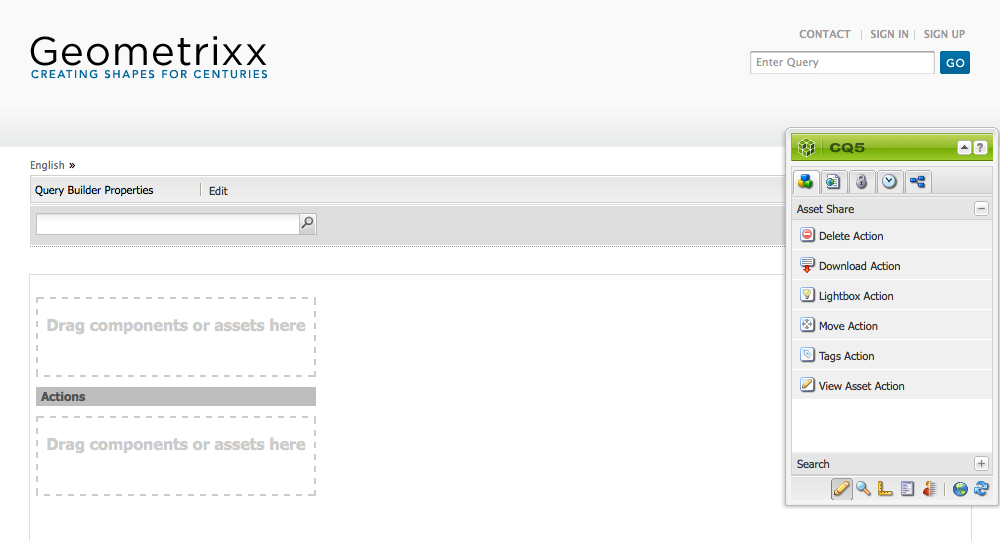
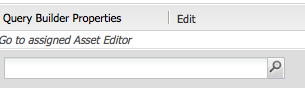
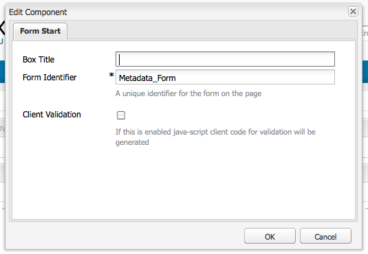
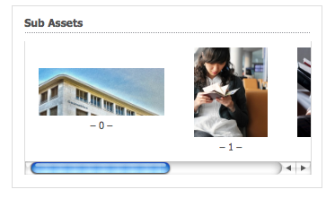
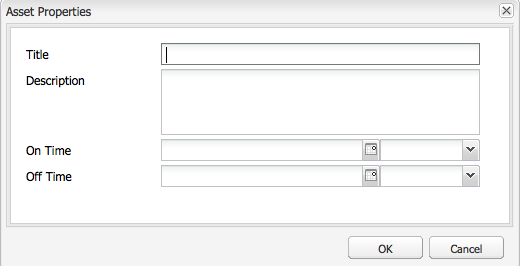

# Crear y configurar páginas del Editor de recursos {#creating-and-configuring-asset-editor-pages}

En este documento se describe lo siguiente:

* Por qué se crean páginas personalizadas del Editor de recursos.
* Cómo crear y personalizar páginas del Editor de recursos, que son páginas WCM que permiten ver y editar metadatos, así como realizar acciones en el recurso.
* Cómo editar varios recursos simultáneamente.

<!-- TBD: Add UICONTROL tags. Need PM review. Flatten the structure a bit. Re-write to remove Geometrixx mentions and to adhere to 6.5 default samples. -->

>[!NOTE]
>
>Asset Share está disponible como implementación de referencia de código abierto. Consulte [Asset Share Commons](https://adobe-marketing-cloud.github.io/asset-share-commons/). No se admite oficialmente.

## ¿Por qué crear y configurar páginas del Editor de recursos? {#why-create-and-configure-asset-editor-pages}

La administración de activos digitales se está utilizando en cada vez más escenarios. Al pasar de una solución a pequeña escala para un pequeño grupo de usuarios de formación profesional -por ejemplo, fotógrafos o taxónomos- a grupos de usuarios más grandes y diversos, por ejemplo usuarios empresariales, autores de WCM, periodistas, etc.-, la potente interfaz de usuario de [!DNL Adobe Experience Manager Assets] para usuarios profesionales puede proporcionar demasiada información y los interesados empiezan a solicitar interfaces de usuario o aplicaciones específicas para acceder a los recursos digitales que les son de importancia.

Estas aplicaciones centradas en los activos pueden ser simples galerías de fotos en una intranet donde los empleados pueden cargar fotos de las visitas de ferias o un centro de prensa en un sitio web público. Las aplicaciones centradas en recursos también pueden extenderse a soluciones completas, incluidos carros de compras, cierres de compra y procesos de verificación.

La creación de una aplicación centrada en los recursos se convierte, en gran medida, en un proceso de configuración que no requiere codificación, solo conocimiento de los grupos de usuarios y sus necesidades, así como conocimiento de los metadatos que se utilizan. Las aplicaciones centradas en recursos creadas con [!DNL Assets] son ampliables: con un esfuerzo de codificación moderado, se pueden crear componentes reutilizables para buscar, ver y modificar recursos.

Una aplicación centrada en recursos en [!DNL Experience Manager] consiste en una página del Editor de recursos, que puede utilizarse para obtener una vista detallada de un recurso específico. Una página del Editor de recursos también permite editar metadatos, siempre que el usuario que accede al recurso tenga los permisos necesarios.

<!--
## Create and configure an Asset Share page {#creating-and-configuring-an-asset-share-page}

You customize the DAM Finder functionality and create pages that have all the functionality you require, which are called Asset Share pages. To create a new Asset Share page, you add the page using the Geometrixx Asset Share template and then you customize the actions users can perform on that page, determine how viewers see the assets, and decide how users can build their queries.

Here are some use cases for creating a customized Asset Share page:

* Press Center for Journalists.
* Image Search Engine for internal business users.
* Image Database for website users.
* Media Tagging Interface for metadata editors.

### Create an Asset Share page {#creating-an-asset-share-page}

To create a new Asset Share page, you can either create it when you are working on web sites or from the digital asset manager.

>[!NOTE]
>
>By default, when you create an Asset Share page from **New** in the digital asset manager, an Asset viewer and Asset editor are automatically created for you.

To create an new Asset Share page in the **Websites** console:

1. In the **Websites** tab, navigate to the place where you want to create an asset share page and click **New**.

1. Select the **Asset Share** page and click **Create**. The new page is created and the asset share page is listed in the **Websites** tab.

The basic page created using the Geometrixx DAM Asset Share template looks as follows:

To customize your Asset Share page, you use elements from the sidekick and you also edit query builder properties. The page **Geometrixx Press Center** is a customized version of a page based on this template:

To create a new asset share page via the digital asset manager:

1. In the digital asset manager, in **New**, select **New Asset Share**.
1. In the **Title**, enter the name of the asset share page. If desired, enter a name for the URL.

   

1. Double-click the asset share page to open it and configure the page.

   

   By default, when you create an Asset Share page from **New**, an Asset viewer and Asset editor are automatically created for you.

#### Customize actions {#customizing-actions}

You can determine what actions users can perform on selected digital assets from a selection of predefined actions.

To add actions to the Asset Share page:

1. In the Asset Share page that you want to customize, click **Actions** in the sidekick.

The following actions are available:

 | Action | Description |
 |---|---|
 | [!UICONTROL Delete Action] | Users can delete the selected assets. |
 | [!UICONTROL Download Action] | Lets users download selected assets to their computers. |
 | [!UICONTROL Lightbox Action] | Saves assets to a "lightbox"   where you can perform other actions on them. This comes in handy when working   with assets across multiple pages. The lightbox can also be used as a   shopping cart for assets. |
 | [!UICONTROL Move Action] | Users can move the asset to another   location |
 | [!UICONTROL Tags Action] | Lets users add tags to selected assets |
 | [!UICONTROL View Asset Action] | Opens the asset in the Asset editor for   user manipulation. |

1. Drag the appropriate action to the **Actions** area on the page. Doing so creates a button that is used to execute that action.

#### Determine how search results are presented {#determining-how-search-results-are-presented}

You determine how results are displayed from a predefined list of lenses.

To change how search results are viewed:

1. In the Asset Share page that you want to customize, click Search.

1. Drag the appropriate lens to the top center of the page. In the Press Center, the lenses are already available. Users press the appropriate lens icon to display search results as desired.

The following lenses are available:

| Lens | Description |
|---|---|
| **[!UICONTROL List Lens]** |Presents the assets in a list fashion with details. |
| **[!UICONTROL Mosaic Lens]** |Presents assets in a mosaic fashion. |

#### Mosaic Lens {#mosaic-lens}

#### List Lens {#list-lens}

#### Customize the Query Builder {#customizing-the-query-builder}

The query builder lets you enter search terms and create content for the Asset Share page. When you edit the query builder, you also get to determine how many search results are displayed per page, which asset editor opens when you double-click an asset, the path the query searches, and customizes nodetypes.

To customize the query builder:

1. In the Asset Share page that you want to customize, click **Edit** in the Query Builder. By default, the **General** tab opens.
1. Select the number of results per page, the path of the asset editor (if you have a customized asset editor) and the Actions title.

1. Click the **Paths** tab. Enter a path or multiple paths that the search will run. These paths are overwritten if the user uses the Paths predicate.

1. Enter another node type, if desired.

1. In the **Query Builder URL** field, you can override or wrap the query builder and enter the new servlet URLs with the existing query builder component. In the **Feed URL** field, you can override the Feed URL as well.

1. In the **Text** field, enter the text you want to appear for results and page numbers of results. Click **OK** when finished making changes.

#### Add predicates {#adding-predicates}

Experience Manager Assets includes a number of predicates that you can add to the Asset Share page. These let your users further narrow searches. In some cases, they may override a query builder parameter (for example, the Path parameter).

To add predicates:

1. In the Asset Share page that you want to customize, click **Search**.

1. Drag the appropriate predicates to the Asset Share page underneath the query builder. Doing so creates the appropriate fields.

The following predicates are available:

| Predicate | Description |
|---|---|
| **[!UICONTROL Date Predicate]** |Lets users search for assets that were modified before and after certain dates. |
| **[!UICONTROL Options Predicate]** |The site owner can specify a property to search for (as in the property predicate, for example cq:tags) and a content tree to populate the options from (for example the tag tree). Doing so generates a list of options where the users can select the values (tags) that the selected property (tag property) should have. This predicate lets you build list controls like the list of tags, file types, image orientations, and so on. It is great for a fixed set of options. |
| **[!UICONTROL Path Predicate]** |Lets users define the path and subfolders, if desired. |
| **[!UICONTROL Property Predicate]** |The site owner specifies a property to search for, e.g. tiff:ImageLength and the user can then enter a value, e.g. 800. This returns all images that are 800 pixels high. Useful predicate if your property can have arbitrary values. |

For more information, see the [predicate Javadocs](https://helpx.adobe.com/experience-manager/6-5/sites/developing/using/reference-materials/javadoc/com/day/cq/search/eval/package-summary.html).

1. To configure the predicate further, double-click it. For example, when you open the Path Predicate, you need to assign the root path.

-->

## Crear y configurar una página del Editor de recursos {#creating-and-configuring-an-asset-editor-page}

Personalice el editor de recursos para determinar cómo pueden ver y editar los recursos digitales los usuarios. Para ello, cree una nueva página del Editor de recursos y luego personalice las vistas y las acciones que los usuarios pueden realizar en esa página.

>[!NOTE]
>
>Si desea agregar campos personalizados al editor de recursos DAM, agregue nuevos nodos `cq:Widget` a `/apps/dam/content/asseteditors.`

### Crear una página del Editor de recursos {#creating-the-asset-editor-page}

Al crear la página Editor de recursos, se recomienda crear la página directamente debajo de la página Uso compartido de recursos.

Para crear una página del Editor de recursos:

1. En la pestaña **[!UICONTROL Sitios web]**, desplácese hasta el lugar donde desee crear una página de editor de recursos y haga clic en **Nuevo**.
1. Seleccione **Editor de recursos de Geometrixx** y haga clic en **Crear**. La nueva página se crea y la página se enumera en la pestaña **Sitios web**.

La página básica creada con la plantilla Editor de recursos de Geometrixx tiene el siguiente aspecto:

Para personalizar la página Editor de recursos, utilice elementos de la barra de tareas. La página Editor de recursos a la que se accede desde **Centro de prensa de Geometrixx** es una versión personalizada de una página basada en esta plantilla:

#### Configure un Editor de recursos para que se abra desde una página Uso compartido de recursos {#setting-which-asset-editor-opens-from-an-asset-share-page}

Después de crear la página del Editor de recursos personalizada, debe asegurarse de que, al hacer doble clic en los recursos, el recurso compartido de recursos personalizado que ha creado abra los recursos en la página Editor personalizado.

Para establecer la página Editor de recursos:

1. En la página Uso compartido de recursos, haga clic en **Editar** junto al Generador de consultas.

1. Haga clic en la pestaña **General** si no está seleccionada.

1. En el campo **Ruta del Editor de recursos**, introduzca la ruta al editor de recursos en el que desea que se abra la página Uso compartido de recursos y haga clic en **Aceptar**.

#### Agregar componentes del Editor de recursos {#adding-asset-editor-components}

Para determinar la funcionalidad de un editor de recursos, agregue componentes a la página.

Para añadir componentes del editor de recursos:

1. En la página Editor de recursos que desea personalizar, seleccione **Editor de recursos** en la barra de tareas. Se muestran todos los componentes del editor de recursos disponibles.

>[!NOTE]
>
>Lo que se puede personalizar depende de los componentes disponibles. Para activar los componentes, vaya al modo Diseño y seleccione los componentes que necesita activados.

1. Arrastre los componentes de la barra de tareas al editor de recursos y realice las modificaciones necesarias en los cuadros de diálogo de los componentes. Los componentes se describen en la tabla siguiente y se describen en las instrucciones detalladas que se indican a continuación.

>[!NOTE]
>
>Al diseñar la página del editor de recursos, se crean componentes que son de solo lectura o editables. Los usuarios saben que un campo se puede editar si aparece una imagen de un lápiz en ese componente. De forma predeterminada, la mayoría de los componentes están configurados como solo lectura.

| Componente | Descripción |
|---|---|
| **[!UICONTROL Campo de ] formulario y  [!UICONTROL texto de metadatos]** | Permite agregar metadatos adicionales a un recurso y realizar una acción, como enviar, en ese recurso. |
| **[!UICONTROL Recursos secundarios]** | Permite personalizar subrecursos. |
| **Etiquetas** | Permite a los usuarios seleccionar y agregar etiquetas a un recurso. |
| **[!UICONTROL Miniatura]** | Muestra una miniatura del recurso, su nombre de archivo y le permite agregar un texto alternativo. Aquí también puede agregar acciones del editor de recursos. |
| **[!UICONTROL Título]** | Muestra el título del recurso, que se puede personalizar. |

#### Formulario de metadatos y campo de texto: configuración del componente Ver metadatos {#metadata-form-and-text-field-configuring-the-view-metadata-component}

El formulario de metadatos es un formulario que incluye una acción de inicio y finalización. Entre medias, se especifican los campos **Text**. Consulte [Forms](/help/sites-authoring/default-components-foundation.md#form-component) para obtener más información sobre cómo trabajar con formularios.

1. Cree una acción de inicio haciendo clic en **Editar** en el área Inicio del formulario. Si lo desea, puede introducir un título de Cuadro. De forma predeterminada, el título del cuadro es **Metadata**. Seleccione la casilla Validación del cliente si desea que se genere el código de cliente de java-script para la validación.

1. Cree una acción final haciendo clic en **Editar** en el área final del formulario. Por ejemplo, es posible que desee crear una opción **[!UICONTROL Submit]** que permita a los usuarios enviar sus cambios en los metadatos. De forma opcional, puede agregar una opción **Reset** que restablezca los metadatos a su estado original.

1. Entre **Inicio de formulario** y **Fin de formulario**, arrastre Campos de texto de metadatos al formulario. Los usuarios rellenan los metadatos en estos campos de texto, en los que pueden enviar o completar otra acción.

1. Haga doble clic en el nombre del campo, por ejemplo, **Title** para abrir el campo de metadatos y realizar cambios. En la pestaña **General** de la ventana **Editar componente**, se define el área de nombres y la etiqueta del campo, así como el tipo, por ejemplo, `dc:title`.

Consulte [Personalización y ampliación de recursos](/help/assets/extending-assets.md) para obtener información sobre cómo modificar los espacios de nombres disponibles en el formulario de metadatos.

1. Haga clic en la pestaña **Constraints**. Aquí puede seleccionar si un campo es obligatorio y, si es necesario, agregar restricciones.

1. Haga clic en la pestaña **Display**. Aquí puede introducir una nueva anchura y un número de filas para el campo de metadatos. Seleccione la casilla de verificación **Field is read only** para permitir que los usuarios editen los metadatos.

A continuación se muestra un ejemplo de formulario de metadatos con varios campos:

En la página Editor de recursos , los usuarios pueden introducir valores en los campos de metadatos (si son editables) y realizar la acción final (por ejemplo, enviar los cambios).

#### Subactivos {#sub-assets}

El componente Recursos secundarios es donde puede ver y seleccionar subrecursos. Puede determinar qué nombres aparecen en los [recursos principales](/help/assets/assets.md#what-are-digital-assets) y subrecursos.

Haga doble clic en el componente Recursos secundarios para abrir el cuadro de diálogo de subrecursos, donde puede cambiar los títulos del recurso principal y los subrecursos. Los valores predeterminados aparecen debajo del campo correspondiente.

A continuación se muestra un ejemplo de un componente Sub Assets rellenado:

Por ejemplo, si selecciona un subrecurso, observe cómo el componente muestra la página adecuada y cómo el título del cuadro cambia de Subrecursos a Siblings.

#### Etiquetas {#tags}

El componente Etiquetas es un componente en el que los usuarios pueden asignar etiquetas existentes a un recurso, lo que ayuda a organizarlo y recuperarlo más adelante. Puede hacer que este componente sea de solo lectura, de modo que los usuarios no puedan añadir etiquetas, sino que solo las vean.

Haga doble clic en el componente Etiquetas para abrir el cuadro de diálogo Etiquetas, donde puede cambiar el título de Etiquetas, si lo desea, y donde puede seleccionar los espacios de nombres asignados. Para que este campo sea editable, desactive la casilla de verificación **[!UICONTROL Ocultar Editar]**. De forma predeterminada, las etiquetas son editables.

Si los usuarios pueden editar etiquetas, pueden hacer clic en el lápiz para agregar etiquetas seleccionándolas en el menú desplegable Etiquetas .

El siguiente es un componente Etiquetas rellenado:

#### Miniatura    {#thumbnail}

El componente Miniatura es donde el recurso muestra la miniatura seleccionada (para muchos de los formatos la miniatura se extrae automáticamente). Además, el componente muestra el nombre de archivo y [acciones que puede modificar](/help/assets/assets-finder-editor.md#adding-asset-editor-actions).

Haga doble clic en el componente de miniatura para abrir el cuadro de diálogo de miniaturas donde puede cambiar el texto alternativo. De forma predeterminada, el texto alternativo de la miniatura es **Click to download** asset.

A continuación se muestra un ejemplo de un componente Miniatura rellenado:

#### Título {#title}

El componente Título muestra el título del recurso y una descripción.

De forma predeterminada, está en modo de solo lectura, por lo que los usuarios no pueden editarlo. Para que sea editable, haga doble clic en el componente y desactive la casilla **Ocultar botón de edición**. Además, introduzca un título para varios recursos.

Si se puede editar el Título, puede agregar un título y una descripción haciendo clic en el lápiz para abrir la ventana **Propiedades del recurso**. Además, puede activar y desactivar el recurso seleccionando la fecha y la hora.

Al editar el [!UICONTROL Título], los usuarios pueden cambiar el **Título**, **Descripción** e introducir **Tiempo de activación** y **Tiempo de desactivación** para activar y desactivar el recurso.

A continuación se muestra un ejemplo de un componente Título rellenado:

#### Agregar acciones del Editor de recursos {#adding-asset-editor-actions}

Puede determinar qué acciones pueden realizar los usuarios en los recursos digitales seleccionados a partir de una selección de acciones predefinidas.

Para agregar acciones a la página Editor de recursos:

1. En la página Editor de recursos que desea personalizar, haga clic en **Editor de recursos** en la barra de tareas.

Las acciones disponibles son las siguientes:

| Acción | Descripción |
|---|---|
| [!UICONTROL Descargar] | Permite a los usuarios descargar seleccionados   activos en sus equipos. |
| [!UICONTROL Editores] | Permite a los usuarios editar una imagen   (edición interactiva) |
| [!UICONTROL Lightbox] | Guarda los recursos en un   &quot;lightbox&quot; donde puede realizar otras acciones en ellos. Esto viene   muy útil cuando se trabaja con recursos en varias páginas. |
| [!UICONTROL Bloqueo] | Permite a los usuarios bloquear recursos. Esta   la funcionalidad no está activada de forma predeterminada y debe habilitarse en la lista   de los componentes. |
| [!UICONTROL Referencias] | Haga clic aquí para mostrar en qué páginas   el recurso se está utilizando. |
| [!UICONTROL Versiones] | Permite crear y restaurar   versiones de un recurso. |

1. Arrastre la acción adecuada al área **Actions** de la página. Crea una opción que se utiliza para ejecutar la acción que se arrastra a la página.

## Editar varios recursos con la página Editor de recursos {#multi-editing-assets-with-the-asset-editor-page}

Con [!DNL Experience Manager Assets] puede realizar cambios en varios recursos a la vez. Después de haber seleccionado los recursos, puede cambiar simultáneamente sus:

* Etiquetas
* Metadatos

Para editar varios recursos con la página Editor de recursos:

1. Abra la página **Centro de prensa** del Geometrixx:
   `https://localhost:4502/content/geometrixx/en/company/press.html`

1. Seleccione los recursos:

   * en Windows: `Ctrl + click` cada recurso.
   * en Mac: `Cmd + click` cada recurso.

   Para seleccionar un rango de recursos: haga clic en el primer recurso y luego en `Shift + click` el último recurso.

1. Haga clic en **Editar metadatos** en el campo **Actions** (parte izquierda de la página).
1. La página **Press Center Asset Editor** se abre en una nueva pestaña. Los metadatos de los recursos se muestran de la siguiente manera:

   * Una etiqueta de , que no se aplica a todos los recursos pero solo a algunos, se muestra en cursiva.
   * Una etiqueta que se aplica a todos los recursos se muestra con una fuente normal.
   * Metadatos que no sean etiquetas: el valor del campo solo se muestra si es el mismo para todos los recursos seleccionados.

1. Haga clic en **Descargar** para descargar un archivo ZIP que contenga las representaciones originales de los recursos.
1. Haga clic en editar la opción de etiquetas que está junto al campo **Etiquetas**.

   * Una etiqueta que no se aplica a todos los recursos, pero solo a unos pocos tiene un fondo gris.
   * Una etiqueta que se aplica a todos los recursos tiene un fondo blanco.

   Puede hacer lo siguiente:

   * Haga clic en `x` para eliminar la etiqueta de todos los recursos.
   * Haga clic en `+` para añadir la etiqueta a todos los recursos.
   * Haga clic en la **flecha** y seleccione una etiqueta para agregar una etiqueta nueva a todos los recursos.

   Haga clic en **OK** para escribir los cambios en el formulario. La casilla junto al campo **Etiquetas** está seleccionada automáticamente.

1. Edite el campo Description . Por ejemplo, establézcalo en:

   `This is a common description`

   Cuando se edita un campo, su valor sobrescribe los valores existentes de los recursos seleccionados cuando se envía el formulario.

   Nota: la casilla junto al campo se marca automáticamente cuando se edita el campo.

1. Haga clic en **Actualizar metadatos** para enviar el formulario y guardar los cambios para todos los recursos.

   Nota: solo se modifican los metadatos marcados.
