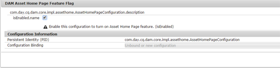

# [!DNL Adobe Experience Manager Assets] Experiencia de la página principal  {#aem-assets-home-page-experience}

Personalice la [!DNL Adobe Experience Manager Assets] página principal para obtener una experiencia de pantalla de bienvenida completa, que incluye una instantánea de las actividades recientes relacionadas con los recursos.

[!DNL Assets] la página de inicio proporciona una experiencia de pantalla de bienvenida completa y personalizada, que incluye una instantánea de actividades recientes, como recursos que se han visualizado o cargado recientemente.

La página de inicio [!DNL Assets] está deshabilitada de forma predeterminada. Para habilitarlo, realice los pasos siguientes:

1. Abra [!DNL Experience Manager] Administrador de configuración `https://[aem_server]:[port]/system/console/configMgr`.
1. Abra el servicio **[!UICONTROL Day CQ DAM Event Recorder]**.
1. Seleccione **[!UICONTROL Enable this service]** para habilitar el registro de actividades.

   

1. En la lista **[!UICONTROL Tipos de eventos]**, seleccione los eventos que desea registrar y guarde los cambios.

   >[!CAUTION]
   >
   >Al habilitar las opciones Recurso visto, Proyectos vistos y Colecciones vistas , aumenta significativamente la cantidad de eventos registrados.

1. Abra el servicio **[!UICONTROL DAM Asset Home Page Feature Flag]** desde Configuration Manager `https://[aem_server]:[port]/system/console/configMgr`.
1. Seleccione la opción `isEnabled.name` para habilitar la función [!DNL Assets] Home page . Guarde los cambios.

   

1. Abra el cuadro de diálogo **[!UICONTROL Preferencias de usuario]** y seleccione **[!UICONTROL Habilitar página principal de recursos]**. Guarde los cambios.

   

Después de habilitar la página de inicio [!DNL Assets], vaya a la interfaz de usuario [!DNL Assets] desde la página de navegación o acceda a ella directamente desde la dirección URL `https://[aem_server]:[port]/aem/assetshome.html/content/dam`.

Haga clic en **[!UICONTROL Haga clic aquí para configurar el vínculo de experiencia]** y agregar su nombre de usuario, imagen de fondo e imagen de perfil.

La página de inicio [!DNL Assets] incluye las siguientes secciones:

* Sección de bienvenida
* Sección Widget

**Sección de bienvenida**

Si su perfil existe, la sección de bienvenida muestra un mensaje de bienvenida dirigido a usted. Además, muestra la imagen de perfil y una imagen de bienvenida (si ya está configurada).

Si el perfil está incompleto, la sección de bienvenida muestra un mensaje de bienvenida genérico y un marcador de posición para la imagen del perfil.

**Sección Widget**

Esta sección aparece debajo de la sección de bienvenida y muestra las utilidades integradas en las siguientes secciones:

* Actividad
* Reciente
* Descubrir

**Actividad**: En esta sección, el widget  **[!UICONTROL Mi]** actividad muestra las actividades recientes realizadas por el usuario que ha iniciado sesión con recursos (incluidos recursos sin representaciones), por ejemplo, cargas de recursos, descargas, creación de recursos, ediciones, comentarios, anotaciones y compartidos.

**Reciente**: El widget  **[!UICONTROL Visualizar]** recientemente en esta sección muestra las entidades a las que ha accedido recientemente el usuario que ha iniciado sesión, incluidas las carpetas, las colecciones y los proyectos.

**Discover**: La  **** utilidad Nueva de esta sección muestra los recursos y las representaciones cargados recientemente en la  [!DNL Assets] implementación.

Para permitir la depuración de los datos de actividad del usuario, habilite el **[!UICONTROL servicio de depuración de eventos DAM]** desde Configuration Manager. Después de habilitar este servicio, el sistema eliminará las actividades del usuario que ha iniciado sesión y que superen un número especificado.

La pantalla de bienvenida proporciona ayuda para la navegación sencilla, por ejemplo, iconos en la barra de herramientas para acceder a carpetas, colecciones y catálogos.

>[!NOTE]
>
>Al habilitar los servicios [!UICONTROL Day CQ DAM Event Recorder] y [!UICONTROL DAM Event Purge], aumentan las operaciones de escritura en JCR y la indexación de búsquedas, lo que aumenta significativamente la carga en el servidor [!DNL Experience Manager]. La carga adicional en el servidor [!DNL Experience Manager] puede afectar a su rendimiento.

>[!CAUTION]
>
>La captura, el filtrado y la depuración de las actividades de usuario necesarias para la página principal [!DNL Assets] imponen una sobrecarga en el rendimiento. Por lo tanto, los administradores deben configurar la página principal de forma eficaz para los usuarios objetivo.
>
>Adobe recomienda que los administradores y usuarios que realizan operaciones masivas eviten utilizar la función Página principal de los recursos para evitar un aumento en las actividades de los usuarios. Además, los administradores pueden excluir las actividades de grabación para usuarios específicos configurando [!UICONTROL Day CQ DAM Event Recorder] desde [!UICONTROL Configuration Manager].
>
>Si utiliza la función , Adobe recomienda programar la frecuencia de depuración en función de la carga del servidor.
