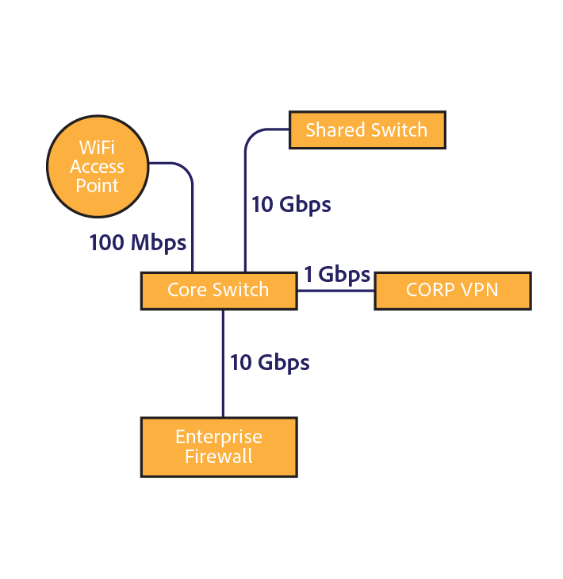
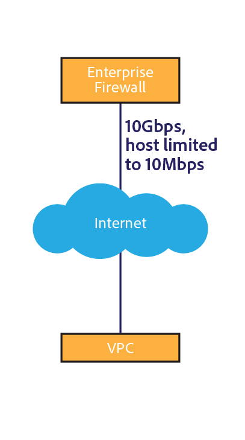

# [!DNL Assets] consideraciones de red {#assets-network-considerations}

Comprender su red es tan importante como comprender [!DNL Adobe Experience Manager Assets]. La red puede afectar a las experiencias de carga, descarga y usuario. El diagrama de la topología de red ayuda a identificar los puntos de estrangulamiento y las áreas suboptimizadas de la red que debe corregir para mejorar el rendimiento de la red y la experiencia del usuario.

Asegúrese de incluir lo siguiente en el diagrama de red:

* Conectividad desde el dispositivo cliente (por ejemplo, equipo, móvil y tableta) a la red.
* Topología de la red corporativa.
* Vínculo ascendente a Internet desde la red corporativa y el [!DNL Experience Manager] entorno.
* Topología de la [!DNL Experience Manager] entorno.
* Definir consumidores simultáneos de [!DNL Experience Manager] interfaz de red.
* Flujos de trabajo definidos del [!DNL Experience Manager] implementación.

## Conectividad desde el dispositivo cliente a la red corporativa {#connectivity-from-the-client-device-to-the-corporate-network}

Comience por crear un diagrama de la conectividad entre los dispositivos cliente individuales y la red corporativa. En esta fase, identifique los recursos compartidos, como las conexiones WiFi, en las que varios usuarios acceden al mismo punto o conmutan Ethernet para cargar y descargar recursos.

Los dispositivos cliente se conectan a la red corporativa de varias formas, como WiFi compartida, Ethernet a un conmutador compartido y VPN. La identificación y comprensión de los puntos de interrupción de esta red es importante para [!DNL Assets] planificar y modificar la red.

En la parte superior izquierda del diagrama, tres dispositivos se representan compartiendo un punto de acceso WiFi de 48 Mbps. Si todos los dispositivos se cargan simultáneamente, el ancho de banda de la red WiFi se comparte entre los dispositivos. En comparación con el sistema en su conjunto, un usuario puede encontrar un punto de estrangulamiento diferente para los tres clientes a través de este canal dividido.

Es un desafío medir la velocidad real de una red WiFi porque un dispositivo lento puede afectar a otros clientes en el punto de acceso. Si planea utilizar WiFi para interacciones de recursos, realice una prueba de velocidad desde varios clientes simultáneamente para evaluar el rendimiento.

La parte inferior izquierda del diagrama muestra dos dispositivos conectados a la red corporativa a través de canales independientes. Por lo tanto, cada dispositivo puede disponer de una velocidad mínima de 10 Mbps y 100 Mbps.

El equipo mostrado a la derecha tiene un flujo ascendente limitado a la red corporativa a través de una VPN con una velocidad de 1 Mbps. La experiencia del usuario con la conexión de 1 Mbps es muy diferente de la experiencia del usuario con la conexión de 1 Gbps. Según el tamaño de los recursos con los que interactúen los usuarios, el vínculo superior de VPN puede ser inadecuado para la tarea.

## Topología de la red corporativa {#topology-of-the-corporate-network}

El diagrama muestra velocidades de enlace ascendente más altas dentro de la red corporativa que las que se utilizan generalmente. Estas canalizaciones son recursos compartidos. Si se espera que el conmutador compartido gestione 50 clientes, puede ser potencialmente un punto de estrangulamiento. En el diagrama inicial, sólo dos equipos comparten la conexión concreta.

## Vínculo ascendente a Internet desde la red corporativa y [!DNL Experience Manager] entorno {#uplink-to-the-internet-from-the-corporate-network-and-aem-environment}

Es importante tener en cuenta factores desconocidos en Internet y en la conexión VPC, ya que el ancho de banda a través de Internet puede verse afectado debido a picos de carga o interrupciones de proveedores a gran escala. En general, la conectividad a Internet es fiable. Sin embargo, a veces puede introducir puntos de estrangulamiento.

En el enlace ascendente de una red corporativa a Internet, puede haber otros servicios utilizando el ancho de banda. Es importante comprender qué parte del ancho de banda se puede dedicar o priorizar para Assets. Por ejemplo, si un vínculo de 1 Gbps ya está en un 80% de utilización, sólo puede asignar un máximo del 20% del ancho de banda para [!DNL Experience Manager Assets].

Los servidores de seguridad y los servidores proxy empresariales también pueden configurar el ancho de banda de muchas maneras diferentes. Este tipo de dispositivo puede priorizar el ancho de banda mediante la calidad del servicio, las limitaciones de ancho de banda por usuario o las limitaciones de velocidad de bits por host. Estos son puntos de estrangulamiento importantes que hay que examinar, ya que pueden tener un impacto significativo [!DNL Assets] experiencia del usuario.

En este ejemplo, la empresa tiene un vínculo superior de 10 Gb/s. Debe ser lo suficientemente grande para varios clientes. Además, el cortafuegos impone un límite de velocidad de host de 10 Mbps. Esta limitación puede limitar potencialmente el tráfico a un solo host a 10 Mbps, aunque el vínculo superior a Internet esté a 10 Gbps.

Este es el punto de estrangulamiento más pequeño orientado al cliente. Sin embargo, puede realizar una evaluación de un cambio o configurar una lista de permitidos con el grupo de operaciones de red a cargo de este cortafuegos.

A partir de los diagramas de ejemplo, puede concluir que seis dispositivos comparten un canal conceptual de 10 Mbps. Según el tamaño de los recursos utilizados, esto puede ser insuficiente para satisfacer las expectativas de los usuarios.

## Topología de la [!DNL Experience Manager] entorno {#topology-of-the-aem-environment}

Diseño de la topología del [!DNL Experience Manager] requiere un conocimiento detallado de la configuración del sistema y de cómo está conectada la red dentro del entorno del usuario.

El escenario de ejemplo incluye una granja de servidores de publicación con cinco servidores, un almacén binario S3 y Dynamic Media configurado.

El despachante comparte su conexión de 100 Mbps con dos entidades, el mundo exterior y el [!DNL Experience Manager] implementación. Para realizar operaciones simultáneas de carga y descarga, se debe dividir este número entre dos. El almacenamiento externo adjunto utiliza una conexión independiente.

El [!DNL Experience Manager] La implementación comparte su conexión de 1 Gb/s con varios servicios. Desde la perspectiva de la topología de red, equivale a compartir un solo canal con distintos servicios.

Revisión de la red desde el dispositivo cliente al [!DNL Experience Manager] , el punto de estrangulamiento más pequeño parece ser el acelerador del cortafuegos empresarial de 10 Mbits. Puede utilizar estos valores en la calculadora de tamaño de la [Guía de tamaño de Assets](assets-sizing-guide.md) para determinar la experiencia del usuario.

## Flujos de trabajo definidos del [!DNL Experience Manager] implementación {#defined-workflows-of-the-aem-deployment}

Al considerar el rendimiento de la red, puede ser importante tener en cuenta los flujos de trabajo y la publicación que se producirán en el sistema. Además, S3 u otro almacenamiento conectado a la red que utilice y las solicitudes de E/S consumen ancho de banda de la red. Por lo tanto, incluso en una red totalmente optimizada, el rendimiento puede estar limitado por la E/S del disco.

Para optimizar los procesos relacionados con la ingesta de recursos (especialmente al cargar un gran número de recursos), explore los flujos de trabajo de recursos y conozca mejor su configuración.

Al evaluar la topología del flujo de trabajo interno, debe analizar lo siguiente:

* Procedimientos que escriben un recurso
* Flujos de trabajo/eventos en déclencheur al modificar recursos o metadatos
* Procedimientos que leen un recurso

Estos son algunos elementos que hay que tener en cuenta:

* XMP lectura/escritura de metadatos de la
* Activación y replicación automáticas
* Filigrana
* Ingesta de subrecursos/extracción de página
* Flujos de trabajo superpuestos.

Este es un ejemplo de cliente para la definición de un flujo de trabajo de recursos.

