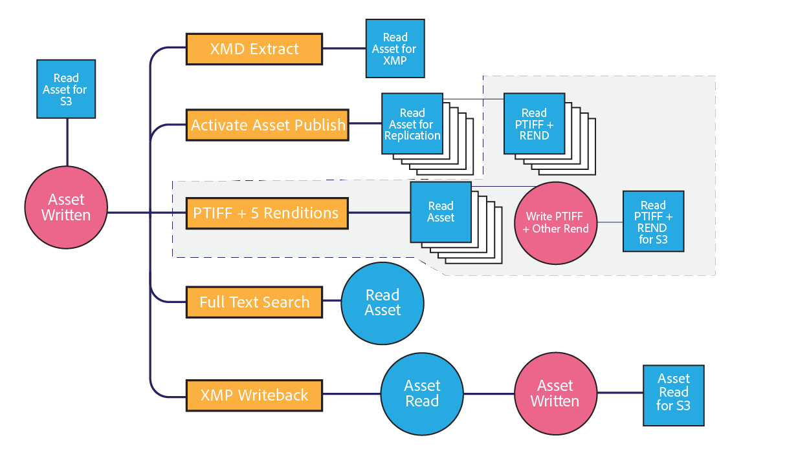

# [!DNL Assets] consideraciones de red  {#assets-network-considerations}

Comprender la red es tan importante como comprender [!DNL Adobe Experience Manager Assets]. La red puede afectar a las experiencias de carga, descarga y usuario. La creación de diagramas de topología de red ayuda a identificar los puntos de bloqueo y las áreas suboptimizadas de la red que debe corregir para mejorar el rendimiento de la red y la experiencia del usuario.

Asegúrese de incluir lo siguiente en el diagrama de red:

* Conectividad desde el dispositivo cliente (por ejemplo, equipo, móvil y tableta) a la red.
* Topología de la red corporativa.
* Vínculo ascendente a Internet desde la red corporativa y el entorno [!DNL Experience Manager].
* Topología del entorno [!DNL Experience Manager].
* Defina consumidores simultáneos de la interfaz de red [!DNL Experience Manager].
* Flujos de trabajo definidos de la implementación [!DNL Experience Manager].

## Conectividad desde el dispositivo cliente a la red corporativa {#connectivity-from-the-client-device-to-the-corporate-network}

Comience creando un diagrama de la conectividad entre los dispositivos cliente individuales y la red corporativa. En este momento, identifique los recursos compartidos, como las conexiones Wi-Fi, donde varios usuarios acceden al mismo punto o conmutador Ethernet para cargar y descargar recursos.

Los dispositivos cliente se conectan a la red corporativa de diversas maneras, como WiFi compartido, Ethernet a un conmutador compartido y VPN. La identificación y comprensión de los puntos de interrupción en esta red es importante para la planificación [!DNL Assets] y para modificar la red.

En la parte superior izquierda del diagrama, se representan tres dispositivos que comparten un punto de acceso WiFi de 48 Mbps. Si todos los dispositivos se cargan simultáneamente, el ancho de banda de la red WiFi se comparte entre los dispositivos. En comparación con el sistema en su conjunto, un usuario puede encontrar un punto de interrupción diferente para los tres clientes en este canal dividido.

Es un desafío medir la verdadera velocidad de una red WiFi porque un dispositivo lento puede afectar a otros clientes en el punto de acceso. Si planea utilizar WiFi para interacciones de recursos, realice una prueba de velocidad de varios clientes simultáneamente para evaluar el rendimiento.

La parte inferior izquierda del diagrama muestra dos dispositivos conectados a la red corporativa a través de canales independientes. Por lo tanto, cada dispositivo puede utilizar una velocidad mínima de 10 Mbps y 100 Mbps.

El equipo que se muestra a la derecha tiene una subida limitada a la red corporativa a través de una VPN con una velocidad de 1 Mbps. La experiencia del usuario en la conexión de 1Mbps es muy diferente de la del usuario en la conexión de 1Gbps. Según el tamaño de los recursos con los que interactúen los usuarios, el vínculo superior de su VPN puede ser inadecuado para la tarea.

## Topología de la red corporativa {#topology-of-the-corporate-network}

El diagrama muestra velocidades de enlace ascendente más altas dentro de la red corporativa que las que se utilizan generalmente. Estas tuberías son recursos compartidos. Si se espera que el conmutador compartido gestione 50 clientes, podría ser un punto de interrupción. En el diagrama inicial, solo dos equipos comparten la conexión concreta.

## Vínculo ascendente a Internet desde la red corporativa y [!DNL Experience Manager] entorno {#uplink-to-the-internet-from-the-corporate-network-and-aem-environment}

Es importante tener en cuenta factores desconocidos en Internet y en la conexión VPC, ya que el ancho de banda de Internet puede verse afectado debido a la carga máxima o a interrupciones de proveedores a gran escala. En general, la conectividad a Internet es fiable. Sin embargo, a veces puede introducir puntos de estrangulamiento.

En el enlace ascendente desde una red corporativa a Internet, puede haber otros servicios usando el ancho de banda. Es importante comprender cuánto del ancho de banda se puede dedicar o priorizar para los recursos. Por ejemplo, si un vínculo de 1 Gbps ya está en un 80 % de utilización, solo puede asignar un máximo del 20 % del ancho de banda para [!DNL Experience Manager Assets].

Los servidores de seguridad y los proxies empresariales también pueden dar forma al ancho de banda de muchas formas diferentes. Este tipo de dispositivo puede priorizar el ancho de banda mediante la calidad del servicio, las limitaciones de ancho de banda por usuario o las limitaciones de velocidad de bits por host. Estos son puntos de interrupción importantes que hay que examinar, ya que pueden tener un impacto significativo en la experiencia del usuario [!DNL Assets].

En este ejemplo, la empresa tiene un vínculo ascendente de 10 Gbps. Debe ser lo suficientemente grande para varios clientes. Además, el cortafuegos impone un límite de velocidad de host de 10 Mbps. Esta limitación puede reducir potencialmente el tráfico a un solo host a 10 Mbps, aunque el vínculo ascendente a Internet sea de 10 Gbps.

Este es el punto de interrupción más pequeño orientado al cliente. Sin embargo, puede evaluar un cambio o configurar una lista de permitidos con el grupo de operaciones de red a cargo de este servidor de seguridad.

En los diagramas de ejemplo, puede concluir que seis dispositivos comparten un canal conceptual de 10 Mbps. Según el tamaño de los activos apalancados, esto puede ser inadecuado para satisfacer las expectativas de los usuarios.

## Topología del entorno [!DNL Experience Manager] {#topology-of-the-aem-environment}

El diseño de la topología del entorno [!DNL Experience Manager] requiere un conocimiento detallado de la configuración del sistema y de cómo se conecta la red dentro del entorno del usuario.

El escenario de ejemplo incluye un conjunto de servidores de publicación con cinco servidores, un almacén binario S3 y Dynamic Media configurado.

El despachante comparte su conexión de 100 Mbps con dos entidades, el mundo exterior y la implementación [!DNL Experience Manager]. Para las operaciones de carga y descarga simultáneas, debe dividir este número por dos. El almacenamiento externo adjunto utiliza una conexión independiente.

La implementación [!DNL Experience Manager] comparte su conexión de 1 Gbps con varios servicios. Desde la perspectiva de la topología de red, equivale a compartir un solo canal con diferentes servicios.

Al revisar la red desde el dispositivo cliente a la implementación [!DNL Experience Manager], el punto de bloqueo más pequeño parece ser el acelerador de firewall empresarial de 10 Mbit. Puede utilizar estos valores en la calculadora de tamaño de la [Guía de tamaño de recursos](assets-sizing-guide.md) para determinar la experiencia del usuario.

## Flujos de trabajo definidos de la implementación [!DNL Experience Manager] {#defined-workflows-of-the-aem-deployment}

Al considerar el rendimiento de la red, puede ser importante tener en cuenta los flujos de trabajo y publicaciones que se producirán en el sistema. Además, S3 u otro almacenamiento conectado a la red que utilice y las solicitudes de E/S consumen ancho de banda de red. Por lo tanto, incluso en una red totalmente optimizada, el rendimiento puede verse limitado por la E/S de disco.

Para optimizar los procesos relacionados con la ingestión de recursos (especialmente al cargar un gran número de recursos), explore los flujos de trabajo de recursos y conozca mejor su configuración.

Al evaluar la topología del flujo de trabajo interno, debe analizar lo siguiente:

* Procedimientos para escribir un activo
* Flujos de trabajo/eventos que déclencheur cuando se modifican recursos/metadatos
* Procedimientos para leer un activo

Estos son algunos de los temas a considerar:

* XMP de lectura y escritura de metadatos
* Activación y replicación automáticas
* Marcas de agua
* Extracción de página/ingestión de subconjuntos
* Flujos de trabajo superpuestos.

Este es un ejemplo de cliente para la definición de un flujo de trabajo de recursos.

