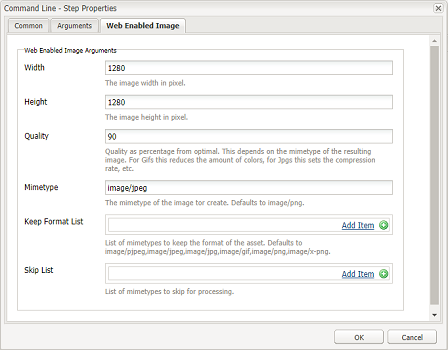

# Instale y configure ImageMagick para trabajar con [!DNL Experience Manager Assets] {#install-and-configure-imagemagick-to-work-with-aem-assets}

ImageMagick es un complemento de software para crear, editar, componer o convertir imágenes de mapa de bits. Puede leer y escribir imágenes en varios formatos (más de 200), incluidos PNG, JPEG, JPEG-2000, GIF, TIFF, DPX, EXR, WebP, Postscript, PDF y SVG. Utilice ImageMagick para cambiar el tamaño, girar, espejar, rotar, distorsionar, distorsionar y transformar imágenes. También puede ajustar los colores de la imagen, aplicar diversos efectos especiales o dibujar texto, líneas, polígonos, elipses y curvas mediante ImageMagick.

Utilice el controlador de medios [!DNL Adobe Experience Manager] de la línea de comandos para procesar imágenes a través de ImageMagick. Para trabajar con varios formatos de archivo utilizando ImageMagick, consulte [Prácticas recomendadas sobre formatos de archivo de recursos](/help/assets/assets-file-format-best-practices.md). Para obtener información sobre todos los formatos de archivo admitidos, consulte [Formatos compatibles con Assets](/help/assets/assets-formats.md).

Para procesar archivos de gran tamaño con ImageMagick, considere requisitos de memoria superiores a los habituales, posibles cambios necesarios en las políticas de IM y el impacto general en el rendimiento. Los requisitos de memoria dependen de diversos factores, como la resolución, la profundidad de bits, el perfil de color y el formato de archivo. Si tiene intención de procesar archivos muy grandes mediante ImageMagick, realice una referencia correcta del servidor [!DNL Experience Manager]. Al final se proporcionan algunos recursos útiles.

>[!NOTE]
>
>Si utiliza [!DNL Experience Manager] en [!DNL Adobe Managed Services] (AMS), póngase en contacto con el Servicio de atención al cliente de Adobe si tiene previsto procesar muchos archivos PSD o PSB de alta resolución. [!DNL Experience Manager] es posible que no procese archivos PSB de alta resolución que superen los 30000 x 23000 píxeles.

## Instalar ImageMagick {#installing-imagemagick}

Hay varias versiones de los archivos de instalación de ImageMagic disponibles para varios sistemas operativos. Utilice la versión apropiada para su sistema operativo.

1. Descargue los [archivos de instalación de ImageMagick](https://www.imagemagick.org/script/download.php) correspondientes para su sistema operativo.
1. Para instalar ImageMagick en el disco que aloja el servidor [!DNL Experience Manager], inicie el archivo de instalación.

1. Establezca la variable de ruta Entorno en el directorio de instalación de ImageMagic.
1. Para comprobar si la instalación se ha realizado correctamente, ejecute el comando `identify -version`.

## Configuración del paso del proceso de la línea de comandos {#set-up-the-command-line-process-step}

Puede configurar el paso del proceso de la línea de comandos para su caso de uso específico. Realice estos pasos para generar una imagen y miniaturas volteadas (140x100, 48x48, 319x319 y 1280x1280) cada vez que agregue un archivo de imagen JPEG a `/content/dam` en el servidor [!DNL Experience Manager]:

1. En el servidor [!DNL Experience Manager], vaya a la consola Flujo de trabajo (`https://[aem_server]:[port]/workflow`) y abra el modelo de flujo de trabajo **[!UICONTROL Recurso de actualización de DAM]**.
1. En el modelo de flujo de trabajo **[!UICONTROL DAM Update Asset]**, abra el paso **[!UICONTROL Miniaturas EPS (con tecnología ImageMagick)]**.
1. En la **[!UICONTROL pestaña Argumentos]**, añada `image/jpeg` a la lista **[!UICONTROL Tipos de MIME]**.

   

1. En el cuadro **[!UICONTROL Commands]**, introduzca el siguiente comando:

   `convert ./${filename} -flip ./${basename}.flipped.jpg`

1. Seleccione los indicadores **[!UICONTROL Delete Generated Rendition]** y **[!UICONTROL Generate Web Rendition]**.

   

1. En la pestaña **[!UICONTROL Web Enabled Image]**, especifique los detalles de la representación con dimensiones de 1280x1280 píxeles. Además, especifique `image/jpeg` en el cuadro **[!UICONTROL Tipo de metanfetán]**.

   

1. Haga clic en **[!UICONTROL Aceptar]** para guardar los cambios.

   >[!NOTE]
   >
   >Es posible que el comando `convert` no se ejecute con ciertas versiones de Windows (por ejemplo, Windows SE), ya que está en conflicto con la utilidad `convert` nativa que forma parte de la instalación de Windows. En este caso, mencione la ruta completa de la utilidad ImageMagick. Por ejemplo, especifique,
   >
   >
   >`"C:\Program Files\ImageMagick-6.8.9-Q16\convert.exe" -define jpeg:size=319x319 ./${filename} -thumbnail 319x319 cq5dam.thumbnail.319.319.png`

1. Abra el paso **[!UICONTROL Procesar miniaturas]** y añada el tipo MIME `image/jpeg` en **[!UICONTROL Omitir tipos de MIME]**.

   

1. En la pestaña **[!UICONTROL Web Enabled Image]**, añada el tipo MIME `image/jpeg` en **[!UICONTROL Skip List]**. Haga clic en **[!UICONTROL Aceptar]** para guardar los cambios.

   

1. Guarde el flujo de trabajo.

1. Para comprobar el procesamiento correcto, cargue una imagen JPG en [!DNL Assets]. Una vez completado el procesamiento, compruebe si se genera o no una imagen volteada y las representaciones.

## Mitigación de vulnerabilidades de seguridad {#mitigating-security-vulnerabilities}

Hay varias vulnerabilidades de seguridad asociadas con el uso de ImageMagick para procesar imágenes. Por ejemplo, el procesamiento de imágenes enviadas por el usuario implica el riesgo de ejecución de código remoto (RCE).

Además, varios complementos de procesamiento de imágenes dependen de la biblioteca ImageMagick, que incluye, entre otras cosas, imágenes de PHP, imágenes de Ruby y clips de papel y imágenes de nodejs.

Si utiliza ImageMagick o una biblioteca afectada, Adobe recomienda mitigar las vulnerabilidades conocidas realizando al menos una de las siguientes tareas (pero preferiblemente ambas):

1. Compruebe que todos los archivos de imagen comiencen con los [&quot;bytes mágicos&quot;](https://en.wikipedia.org/wiki/List_of_file_signatures) correspondientes a los tipos de archivo de imagen que admite antes de enviarlos a ImageMagick para su procesamiento.
1. Utilice un archivo de directiva para deshabilitar los codificadores vulnerables de ImageMagick. La directiva global para ImageMagick se encuentra en `/etc/ImageMagick`.
