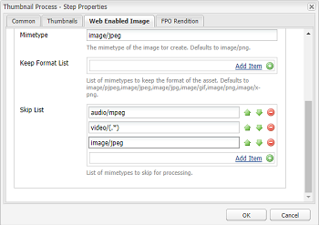

# Instale y configure ImageMagick para trabajar con [!DNL Experience Manager Assets] {#install-and-configure-imagemagick-to-work-with-aem-assets}

ImageMagick es un complemento de software para crear, editar, componer o convertir imágenes de mapa de bits. Puede leer y escribir imágenes en varios formatos (más de 200), incluidos PNG, JPEG, JPEG-2000, GIF, TIFF, DPX, EXR, WebP, Postscript, PDF y SVG. Utilice ImageMagick para cambiar el tamaño, voltear, reflejar, rotar, distorsionar, distorsionar y transformar imágenes. También puede ajustar los colores de la imagen, aplicar diversos efectos especiales o dibujar texto, líneas, polígonos, elipses y curvas mediante ImageMagick.

Utilice el controlador de medios [!DNL Adobe Experience Manager] de la línea de comandos para procesar las imágenes a través de ImageMagick. Para trabajar con varios formatos de archivo mediante ImageMagick, consulte [Prácticas recomendadas sobre formatos de archivo de recursos](/help/assets/assets-file-format-best-practices.md). Para obtener información sobre todos los formatos de archivo admitidos, consulte [Formatos admitidos para los recursos](/help/assets/assets-formats.md).

Para procesar archivos de gran tamaño con ImageMagick, considere la posibilidad de que los requisitos de memoria sean superiores a los habituales, los posibles cambios necesarios en las políticas de mensajería instantánea y el impacto general en el rendimiento. Los requisitos de memoria dependen de varios factores, como la resolución, la profundidad de bits, el perfil de color y el formato de archivo. Si desea procesar archivos muy grandes con ImageMagick, realice pruebas de rendimiento del servidor [!DNL Experience Manager] correctamente. Al final se proporcionan algunos recursos útiles.

>[!NOTE]
>
>Si utiliza [!DNL Experience Manager] en [!DNL Adobe Managed Services] (AMS), póngase en contacto con el Servicio de atención al cliente de Adobe si tiene previsto procesar muchos archivos PSD o PSB de alta resolución. [!DNL Experience Manager] es posible que no procese archivos PSB de alta resolución que superen los 30000 x 23000 píxeles.

## Instalar ImageMagick {#installing-imagemagick}

Hay disponibles varias versiones de los archivos de instalación de ImageMagic para varios sistemas operativos. Utilice la versión adecuada para su sistema operativo.

1. Descargue los [archivos de instalación de ImageMagick](https://www.imagemagick.org/script/download.php) correspondientes para su sistema operativo.
1. Para instalar ImageMagick en el disco que aloja el servidor [!DNL Experience Manager], inicie el archivo de instalación.

1. Establezca la variable de Entorno de ruta en el directorio de instalación de ImageMagic.
1. Para comprobar si la instalación se realizó correctamente, ejecute el comando `identify -version`.

## Configure el paso del proceso de la línea de comandos {#set-up-the-command-line-process-step}

Puede configurar el paso del proceso de la línea de comandos para un caso de uso concreto. Siga estos pasos para generar una imagen y unas miniaturas volteadas (140 x 100, 48 x 48, 319 x 319 y 1280 x 1280) cada vez que agregue un archivo de imagen JPEG a `/content/dam` en el servidor [!DNL Experience Manager]:

1. En el servidor [!DNL Experience Manager], vaya a la consola Flujo de trabajo (`https://[aem_server]:[port]/workflow`) y abra el modelo de flujo de trabajo **[!UICONTROL Recurso de actualización de DAM]**.
1. En el modelo de flujo de trabajo **[!UICONTROL Recurso de actualización de DAM]**, abra el paso **[!UICONTROL Miniaturas EPS (con tecnología ImageMagick)]**.
1. En la ficha **[!UICONTROL Argumentos]**, agregue `image/jpeg` a la lista **[!UICONTROL Tipos de MIME]**.

   

1. En el cuadro **[!UICONTROL Comandos]**, introduzca el siguiente comando:

   `convert ./${filename} -flip ./${basename}.flipped.jpg`

1. Seleccione los indicadores **[!UICONTROL Eliminar representación generada]** y **[!UICONTROL Generar representación Web]**.

   

1. En la ficha **[!UICONTROL Imagen habilitada para Web]**, especifique los detalles de la representación con dimensiones de 1280 x 1280 píxeles. Además, especifique `image/jpeg` en el cuadro **[!UICONTROL Mimetype]**.

   

1. Haga clic en **[!UICONTROL Aceptar]** para guardar los cambios.

   >[!NOTE]
   >
   >Es posible que el comando `convert` no se ejecute con ciertas versiones de Windows (por ejemplo, Windows SE), ya que está en conflicto con la utilidad `convert` nativa que forma parte de la instalación de Windows. En este caso, mencione la ruta completa de la utilidad ImageMagick. Por ejemplo, especifique,
   >
   >
   >`"C:\Program Files\ImageMagick-6.8.9-Q16\convert.exe" -define jpeg:size=319x319 ./${filename} -thumbnail 319x319 cq5dam.thumbnail.319.319.png`

1. Abra el paso **[!UICONTROL Procesar miniaturas]** y agregue el tipo MIME `image/jpeg` en **[!UICONTROL Omitir tipos de MIME]**.

   

1. En la ficha **[!UICONTROL Imagen habilitada para Web]**, agregue el tipo MIME `image/jpeg` en la Lista **[!UICONTROL Omitir]**. Haga clic en **[!UICONTROL Aceptar]** para guardar los cambios.

   

1. Guarde el flujo de trabajo.

1. Para verificar el procesamiento correcto, cargue una imagen JPG a [!DNL Assets]. Una vez completado el procesamiento, compruebe si se genera o no una imagen volteada y las representaciones.

## Mitigación de vulnerabilidades de seguridad {#mitigating-security-vulnerabilities}

Existen varias vulnerabilidades de seguridad asociadas con el uso de ImageMagick para procesar imágenes. Por ejemplo, el procesamiento de imágenes enviadas por el usuario implica el riesgo de ejecución remota de código (RCE).

Además, varios complementos de procesamiento de imágenes dependen de la biblioteca de ImageMagick, incluida, entre otras, la imagen de PHP, la imagen y el clip de Ruby y la imagen de nodejs.

Si utiliza ImageMagick o una biblioteca afectada, Adobe recomienda mitigar las vulnerabilidades conocidas realizando al menos una de las siguientes tareas (pero preferiblemente ambas):

1. Compruebe que todos los archivos de imagen comienzan con los [&quot;bytes mágicos&quot;](https://en.wikipedia.org/wiki/List_of_file_signatures) esperados correspondientes a los tipos de archivo de imagen que admite antes de enviarlos a ImageMagick para su procesamiento.
1. Utilice un archivo de política para deshabilitar los codificadores de ImageMagick vulnerables. La directiva global para ImageMagick se encuentra en `/etc/ImageMagick`.
