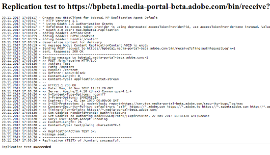

# Configure AEM Assets integration with Brand Portal {#configure-aem-assets-integration-with-brand-portal}

Si es cliente de Adobe Experience Manager (AEM) Assets Brand Portal, puede integrar Recursos AEM con Brand Portal para permitir la publicación de recursos en Brand Portal. Puede configurar esta integración mediante la interfaz Adobe.io.

En primer lugar, cree una aplicación, que incluya un mecanismo de autenticación, en la puerta de enlace pública de Marketing Cloud. A continuación, cree un perfil en la instancia de Recursos AEM con el ID de la aplicación que obtiene de la puerta de enlace.

Utilice esta configuración para publicar recursos de Recursos AEM en Brand Portal. En segundo plano, el servidor de AEM autentica su perfil con la puerta de enlace y, a continuación, integra Recursos AEM con Brand Portal.

>[!NOTE]
>
>La interfaz de usuario para configurar integraciones de autenticación está alojada en [https://legacy-oauth.cloud.adobe.io/](https://legacy-oauth.cloud.adobe.io/), que antes estaba alojada en [https://marketing.adobe.com/developer/](https://marketing.adobe.com/developer/).

## Crear aplicación JWT {#create-jwt-application}

1. Inicie sesión en [https://legacy-oauth.cloud.adobe.io/](https://legacy-oauth.cloud.adobe.io/) con su Adobe ID. **Se abre la página Aplicaciones** JWT.

   >[!NOTE]
   >
   >Solo puede crear un ID de aplicación si es el administrador del sistema de su organización. Inquilino es el nombre técnico de su organización que está registrada en Adobe Marketing Cloud.

1. Seleccione **[!UICONTROL Agregar aplicación]** para crear una aplicación.
1. Especifique un nombre para la aplicación y una descripción opcional.
1. En la lista **[!UICONTROL Organización]** , seleccione la organización para la que desea sincronizar los recursos.
1. En la lista **[!UICONTROL Ámbito]** , seleccione **[!UICONTROL dam-read]**, **[!UICONTROL dam-sync]**, **[!UICONTROL dam-write]** y **[!UICONTROL cc-share]**.
1. Haga clic en **[!UICONTROL Agregar]**. Se crea una aplicación de servicio JWT. Puede editar la aplicación y Guardar.
1. Copie el ID de aplicación que se genera para la nueva aplicación.

   >[!NOTE]
   >
   >Asegúrese de no copiar inadvertidamente el secreto de la aplicación en lugar del ID de la aplicación.

## Crear una nueva configuración de nube {#create-a-new-cloud-configuration}

1. En la página **[!UICONTROL Navegación]** de la instancia local de Recursos AEM, haga clic en el icono **[!UICONTROL Herramientas]** de la izquierda.

1. Vaya a **[!UICONTROL Cloud Services]>[!UICONTROL Legacy Cloud Services]**.

   

1. En **[!UICONTROL Cloud Services]**, busque el servicio **[!UICONTROL Assets Brand Portal]** en **[!UICONTROL Adobe Experience Cloud]**.

   

1. Haga clic en el vínculo **[!UICONTROL Configurar ahora]** debajo del servicio para mostrar el cuadro de diálogo **[!UICONTROL Crear configuración]** .
1. En el cuadro de diálogo **[!UICONTROL Crear configuración]** , especifique un título y un nombre para la nueva configuración y haga clic en **[!UICONTROL Crear]**.

   

1. En el cuadro de diálogo Replicación **[!UICONTROL de Brand Portal de Recursos]** AEM, especifique la dirección URL de su organización en el campo URL **[!UICONTROL del]** inquilino.
1. En el campo ID de **[!UICONTROL cliente]** , pegue el ID de aplicación que ha copiado al final del procedimiento [Crear una aplicación](/help/assets/brand-portal-configuring-integration.md#create-jwt-application). Seleccione **[!UICONTROL Aceptar]**.

   

1. Para que los recursos (publicados desde AEM) estén disponibles para los usuarios generales de Brand Portal, active la casilla de verificación Publicación **[!UICONTROL de carpetas]** públicas.

   >[!NOTE]
   >
   >La opción para activar Publicación **[!UICONTROL de carpetas]** públicas está disponible en AEM 6.3.2.1 y versiones posteriores.

1. En la página Configuración **[!UICONTROL de]** Brand Portal, haga clic en **[!UICONTROL Mostrar clave]** pública para mostrar la clave pública generada para su instancia.

   

   Como alternativa, haga clic en **[!UICONTROL Descargar clave pública para OAuth Gateway]** para descargar el archivo que contiene la clave pública. A continuación, abra el archivo para mostrar la clave pública.

## Habilitar la integración {#enable-integration}

1. Muestre la clave pública utilizando uno de los siguientes métodos mencionados en el último paso del procedimiento [Agregue una nueva configuración a Marketing Cloud](/help/assets/brand-portal-configuring-integration.md#create-a-new-cloud-configuration).

   * Haga clic en el botón **[!UICONTROL Mostrar clave]** pública para mostrar la clave.
   * Abra el archivo descargado que contiene la clave.

1. Abra la interfaz de Marketing Cloud Developer Connection y haga clic en la aplicación que ha creado en [Crear una aplicación](/help/assets/brand-portal-configuring-integration.md#create-jwt-application).
1. Pegue la clave pública en el campo Clave **[!UICONTROL pública]** de la interfaz de configuración
1. Haga clic en **[!UICONTROL Guardar.]** Un mensaje confirma que la aplicación se ha actualizado.

## Probar la integración {#test-the-integration}

1. En la página **[!UICONTROL Navegación]** de la instancia local de Recursos AEM, haga clic en el icono **[!UICONTROL Herramientas]** de la izquierda.

1. Vaya a **[!UICONTROL Implementación]** > **[!UICONTROL Replicación]**.

   

1. En la página **[!UICONTROL Replicación]** , haga clic en **[!UICONTROL Agentes en el autor]**.

   

1. Para verificar la conexión entre AEM Author y Brand Portal, abra cualquiera de los cuatro agentes de replicación y haga clic en **[!UICONTROL Probar conexión]**.

   >[!NOTE]
   >
   >Los agentes de replicación trabajan en paralelo y comparten la distribución del trabajo por igual, aumentando así la velocidad de publicación en cuatro veces la velocidad original. Una vez configurado el servicio en la nube, no se requiere una configuración adicional para habilitar los agentes de replicación activados de forma predeterminada para habilitar la publicación en paralelo de varios recursos.

   >[!NOTE]
   >
   >Evite desactivar cualquiera de los agentes de replicación, ya que puede provocar errores en la replicación de algunos de los recursos.

   

1. Observe la parte inferior de los resultados de la prueba para verificar que la replicación se realizó correctamente.

   

Después de que la replicación se realice correctamente, puede publicar recursos, carpetas y colecciones en Brand Portal. Para obtener más información, consulte:

* [Publicación de recursos y carpetas en Brand Portal](/help/assets/brand-portal-publish-folder.md)
* [Publicar colecciones en Brand Portal](/help/assets/brand-portal-publish-collection.md)

## Publish assets to Brand Portal {#publish-assets-to-brand-portal}

Después de que la replicación se realice correctamente, puede publicar recursos, carpetas y colecciones en Brand Portal. Para publicar recursos en Brand Portal, siga estos pasos:

>[!NOTE]
>
>Adobe recomienda la publicación escalonada, preferiblemente durante las horas no pico, para que el autor de AEM no ocupe recursos excesivos.

1. En la consola Recursos, seleccione los recursos o la carpeta que desea publicar y haga clic en la opción Publicación **** rápida de la barra de herramientas.

   También puede seleccionar los recursos que desea publicar en Brand Portal.

   

1. Para publicar los recursos en Brand Portal, hay dos opciones disponibles:
   * [Publicación inmediata de recursos](#publish-to-bp-now)
   * [Publicar recursos más tarde](#publish-to-bp-now)

### Publicar recursos ahora {#publish-to-bp-now}

Para publicar los recursos seleccionados en Brand Portal, realice una de las acciones siguientes:

* En la barra de herramientas, seleccione **[!UICONTROL Publicación]** rápida. A continuación, en el menú, seleccione **[!UICONTROL Publicar en Brand Portal]**.

* En la barra de herramientas, seleccione **[!UICONTROL Administrar publicación]**.

   1. A continuación, en la **[!UICONTROL acción]** , seleccione **[!UICONTROL Publicar en Brand Portal]** y, en **[!UICONTROL Programación]** , seleccione **[!UICONTROL Ahora]**. Haga clic en **[!UICONTROL Siguiente]**. 

   2. En **[!UICONTROL Ámbito]**, confirme la selección y haga clic en **[!UICONTROL Publicar en Brand Portal]**.

Aparece un mensaje que indica que los recursos se han puesto en cola para su publicación en Brand Portal. Inicie sesión en la interfaz de Brand Portal para ver los recursos publicados.

### Publicar recursos más tarde {#publish-to-bp-later}

Para programar la publicación de recursos en Brand Portal para una fecha u hora posterior:

1. Una vez que haya seleccionado los recursos o las carpetas que desea publicar, seleccione **[!UICONTROL Administrar publicación]** en la barra de herramientas de la parte superior.

1. En la página **[!UICONTROL Administrar publicación]** , seleccione **[!UICONTROL Publicar en Brand Portal]** en **[!UICONTROL Acción]** y seleccione **[!UICONTROL Más adelante]** en **[!UICONTROL Programación]**.

   

1. Seleccione una fecha **[!UICONTROL de]** activación y especifique la hora. Haga clic en **[!UICONTROL Siguiente]**. 

1. Seleccione una fecha **de** activación y especifique la hora. Haga clic en **Siguiente**. 

1. Especifique un título **** de workflow en **[!UICONTROL Flujos de trabajo]**. Haga clic en **[!UICONTROL Publicar posteriormente]**.

   

Ahora, inicie sesión en Brand Portal para ver si los recursos publicados están disponibles en la interfaz de Brand Portal.

