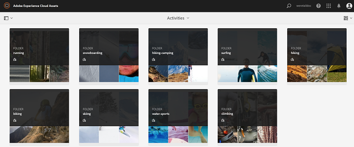

# Publicación de recursos en Brand Portal {#publish-assets-to-brand-portal}

| Versión | Vínculo del artículo |
| -------- | ---------------------------- |
| AEM as a Cloud Service | [Haga clic aquí](https://experienceleague.adobe.com/docs/experience-manager-cloud-service/content/assets/brand-portal/publish-to-brand-portal.html?lang=es) |
| AEM 6.5 | Este artículo |

Como administrador de recursos de Adobe Experience Manager AEM (), puede publicar recursos y carpetas en la instancia de AEM Assets Brand Portal (o programar el flujo de trabajo de publicación para una fecha u hora posterior) para su organización. Sin embargo, primero debe configurar AEM Assets con Brand Portal. Para obtener más información, consulte [Configurar AEM Assets con Brand Portal](/help/assets/configure-aem-assets-with-brand-portal.md).

Una vez completada la replicación, puede publicar recursos, carpetas y colecciones en Brand Portal. Para publicar recursos en Brand Portal, siga estos pasos:

>[!NOTE]
>
>Adobe recomienda la publicación escalonada, de preferencia durante las horas no pico, para que el autor de AEM no ocupe recursos excesivos.

1. En la consola Recursos, seleccione los recursos o la carpeta que desee publicar y haga clic en **[!UICONTROL Publicación rápida]** de la barra de herramientas.

   También puede seleccionar los recursos que desea publicar en Brand Portal.

   

1. Para publicar los recursos en Brand Portal, existen dos opciones disponibles:
   * [Publicar recursos inmediatamente](#publish-to-bp-now)
   * [Publicar recursos más tarde](#publish-to-bp-now)

## Publicar recursos ahora {#publish-to-bp-now}

Para publicar los recursos seleccionados en Brand Portal, haga una de las acciones siguientes:

* En la barra de herramientas, seleccione **[!UICONTROL Publicación rápida]**. A continuación, en el menú, seleccione **[!UICONTROL Publicar en Brand Portal]**.

* En la barra de herramientas, seleccione **[!UICONTROL Administrar publicación]**.

   1. A continuación, desde el **[!UICONTROL Acción]** select **[!UICONTROL Publicar en Brand Portal]**, y desde **[!UICONTROL Programación]** select **[!UICONTROL Ahora]**. Haga clic en **[!UICONTROL Siguiente]**.

   2. En **[!UICONTROL Ámbito]**, confirme la selección y haga clic en **[!UICONTROL Publicar en Brand Portal]**.

Aparece un mensaje que indica que los recursos se han puesto en cola para su publicación en Brand Portal. Inicie sesión en la interfaz de Brand Portal para ver los recursos publicados.

## Publicar recursos más tarde {#publish-to-bp-later}

Para programar la publicación de recursos en Brand Portal para una fecha u hora posterior:

1. Una vez que haya seleccionado los recursos o las carpetas que desea publicar, seleccione **[!UICONTROL Administrar publicación]** en la barra de herramientas de la parte superior.

1. Activado **[!UICONTROL Administrar publicación]** página, seleccione **[!UICONTROL Publicar en Brand Portal]** de **[!UICONTROL Acción]** y seleccione **[!UICONTROL Más tarde]** de **[!UICONTROL Programación]**.

   

1. Seleccione una **[!UICONTROL Fecha de activación]** y especifique la hora. Haga clic en **[!UICONTROL Siguiente]**. 

1. Seleccione una **Fecha de activación** y especifique la hora. Haga clic en **Siguiente**. 

1. Especifique un **[!UICONTROL título de flujo de trabajo]** en **[!UICONTROL Flujos de trabajo]**. Haga clic en **[!UICONTROL Publicar más tarde]**.

   

Ahora, inicie sesión en Brand Portal para ver si los recursos publicados están disponibles en la interfaz de Brand Portal.

## Ver el archivo o la carpeta publicados en Brand Portal {#view-published-file-folder}

1. Inicie sesión en la interfaz de Brand Portal para ver los recursos publicados (según la fecha u hora programadas).

   

1. Cambiar a vista de lista  para ver el estado de publicación actual del recurso.

<!--2. On the [Asset Reports page](#https://experienceleague.adobe.com/en/docs/experience-manager-cloud-service/content/assets/admin/asset-reports), you can see the current state of the report job, for example, Success, Failed, Queued, or Scheduled.-->

