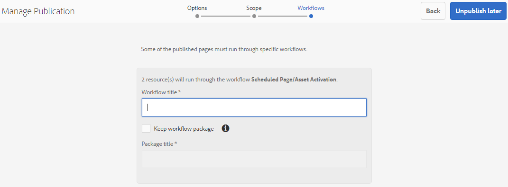

# Publicar carpetas en Brand Portal{#publish-folders-to-brand-portal}

Como administrador de recursos de Adobe Experience Manager (AEM), puede publicar recursos y carpetas en la instancia de AEM Assets Brand Portal (o programar el flujo de trabajo de publicación para una fecha y hora posteriores) para su organización. Sin embargo, primero debe integrar AEM Assets con Brand Portal. Para obtener más información, consulte [Configurar AEM Assets con Brand Portal](/help/assets/configure-aem-assets-with-brand-portal.md).

Después de publicar un recurso o una carpeta, estará disponible para los usuarios de Brand Portal.

Si realiza las modificaciones posteriores al recurso o la carpeta originales en AEM Assets, los cambios no se reflejarán en Brand Portal hasta que vuelva a publicar el recurso o la carpeta. Esta función garantiza que los cambios en curso no estén disponibles en Brand Portal. Solo los cambios aprobados publicados por un administrador están disponibles en Brand Portal.

## Publicar carpetas en Brand Portal {#publish-folders-to-brand-portal-1}

1. En la interfaz de AEM Assets, pase el ratón sobre la carpeta que quiera y seleccione la opción **Publicar** en las acciones rápidas.

   Como alternativa, seleccione la carpeta deseada y siga los pasos adicionales.

   

1. **Publicar carpetas ahora**

   Para publicar las carpetas seleccionadas en Brand Portal, haga una de las acciones siguientes:

   * En la barra de herramientas, seleccione **Publicación rápida**. A continuación, en el menú, seleccione **Publicar en Brand Portal**.

   * En la barra de herramientas, seleccione **Administrar publicación**.
   1. En **Action** seleccione **Publicar en Brand Portal**, en **Programación** seleccione **Ahora** y haga clic en **Siguiente.**
   1. Confirme su selección en **Ámbito** y haga clic en **Publicar en Brand Portal**.

   Aparece un mensaje que indica que la carpeta se ha puesto en cola para su publicación en Brand Portal. Inicie sesión en la interfaz de Brand Portal para ver la carpeta publicada.

   **Publicar carpetas más tarde**

   Para programar el flujo de trabajo de publicación en Brand Portal de las carpetas de recursos para una fecha u hora posterior:

   1. Una vez que haya seleccionado los recursos o las carpetas que desea publicar, seleccione **Administrar publicación** en la barra de herramientas de la parte superior.
   1. En **Action** seleccione **Publicar en Brand Portal**, en **Programación** seleccione **Más adelante**.

      

   1. Seleccione una **Fecha de activación** y especifique la hora. Haga clic en **Siguiente**. 
   1. Confirme la selección en **Ámbito**. Haga clic en **Siguiente**. 
   1. Especifique un título de flujo de trabajo en **Flujos de trabajo**. Haga clic en **Publicar más tarde**.

      

## Cancelar publicación desde Brand Portal {#unpublish-folders-from-brand-portal}

Puede eliminar cualquier carpeta de recursos publicada en Brand Portal cancelando la publicación de la instancia de autor de AEM. Después de cancelar la publicación de la carpeta original, su copia ya no estará disponible para los usuarios de Brand Portal.

Tiene la opción de cancelar la publicación de carpetas de Brand Portal rápidamente o programarlas para una fecha y hora posteriores. Para cancelar la publicación de carpetas de recursos desde Brand Portal:

1. En la interfaz de AEM Assets en la instancia de autor de AEM, seleccione la carpeta en la que desea cancelar la publicación.

   

1. En la barra de herramientas, haga clic en **Administrar publicación**.

1. **Cancelar publicación desde Brand Portal ahora**

   Para cancelar la publicación de la carpeta deseada rápidamente desde Brand Portal:

   1. En la barra de herramientas, seleccione **Administrar publicación**.
   1. En **Action** seleccione **Cancelar publicación de Brand Portal**, en **Scheduling** seleccione **Now** y haga clic en **Siguiente.**
   1. Confirme su selección en **Ámbito** y haga clic en **Cancelar publicación desde Brand Portal**.

   

   **Cancelar publicación desde Brand Portal más tarde**

   Para programar la publicación de una carpeta desde Brand Portal para una fecha y hora posteriores:

   1. En la barra de herramientas, seleccione **Administrar publicación**.
   1. En **Action** seleccione **Cancelar publicación de Brand Portal** y, en **Scheduling**, seleccione **Más tarde**.
   1. Seleccione una **Fecha de activación** y especifique la hora. Haga clic en **Siguiente**. 
   1. Confirme la selección en **Ámbito** y haga clic en **Siguiente**.
   1. Especifique un **título de flujo de trabajo** en **Flujos de trabajo**. Haga clic en **Cancelar publicación más tarde.**

      

>[!NOTE]
>
>El procedimiento para publicar o cancelar la publicación de un recurso en Brand Portal es similar al procedimiento correspondiente para una carpeta.
