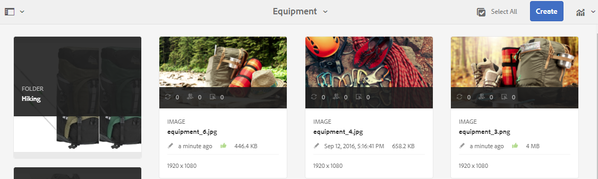

# Revisar recursos y colecciones de carpetas {#review-folder-assets-and-collections}

Configure flujos de trabajo de revisión para recursos dentro de una carpeta o una colección y compártalos con revisores o socios creativos para buscar comentarios.

[!DNL Adobe Experience Manager Assets] permite configurar un flujo de trabajo de revisión ad hoc para los recursos de una carpeta o colección y compartirlo con revisores o socios creativos para buscar comentarios.

Puede asociar el flujo de trabajo de revisión a un proyecto o crear una tarea de revisión independiente.

Después de compartir los recursos, los revisores pueden aprobarlos o rechazarlos. Las notificaciones se envían en varias etapas del flujo de trabajo para notificar a los destinatarios objetivo la finalización de varias tareas. Por ejemplo, cuando comparte una carpeta o colección, el revisor recibe una notificación de que se ha compartido una carpeta o colección para su revisión.

Una vez que el revisor completa la revisión (aprueba o rechaza los recursos), recibe una notificación de finalización de la revisión.

## Crear una tarea de revisión para carpetas {#creating-a-review-task-for-folders}

1. En la interfaz de usuario [!DNL Assets], seleccione la carpeta para la que desea crear una tarea de revisión.
1. En la barra de herramientas, haga clic en **[!UICONTROL Crear tarea de revisión]**  para abrir la página **[!UICONTROL Revisar tarea]**. Si no puede ver la opción en la barra de herramientas, haga clic en **[!UICONTROL Más]** y, a continuación, seleccione la opción .

1. (Opcional) En la lista **[!UICONTROL Proyecto]**, seleccione el proyecto al que desea asociar la tarea de revisión. De forma predeterminada, la opción **[!UICONTROL None]** está seleccionada. Si no desea asociar ningún proyecto con la tarea de revisión, conserve esta selección.

   >[!NOTE]
   >
   >En la lista **[!UICONTROL Proyectos]** solo están visibles los proyectos para los que tiene permisos de nivel de Editor (o superiores).

1. Introduzca un nombre para la tarea de revisión y seleccione un aprobador en la lista **[!UICONTROL Asignar a]**.

   >[!NOTE]
   >
   >Los miembros o grupos del proyecto seleccionado están disponibles como aprobadores en la lista **[!UICONTROL Asignar a]**.

1. Introduzca una descripción, la prioridad de la tarea y la fecha de vencimiento de la tarea de revisión.

   

1. En la pestaña Advanced , introduzca una etiqueta que se utilizará para crear el URI.

   

1. Haga clic en **[!UICONTROL Enviar]** y, a continuación, haga clic en **[!UICONTROL Listo]** para cerrar el mensaje de confirmación. Se envía una notificación para la nueva tarea al aprobador.
1. Inicie sesión en [!DNL Assets] como Aprobador y vaya a la interfaz de usuario de [!DNL Assets]. Para aprobar recursos, haga clic en **[!UICONTROL Notifications]** y seleccione la tarea de revisión en la lista.

   

1. En la página **[!UICONTROL Revisar tarea]**, examine los detalles de la tarea de revisión y haga clic en **[!UICONTROL Revisar]**.
1. En la página **[!UICONTROL Revisar tarea]**, seleccione los recursos y haga clic en **[!UICONTROL Aprobar/Rechazar]** para aprobarlos o rechazarlos, según corresponda.

   

1. Haga clic en **[!UICONTROL Completar]** en la barra de herramientas. En el cuadro de diálogo, introduzca un comentario y haga clic en **[!UICONTROL Completar]** para confirmar.
1. Vaya a la interfaz de usuario [!DNL Assets] y abra la carpeta . Los iconos de estado de aprobación de los recursos aparecen en la vista de tarjeta y en la vista de lista.

   **Vista de tarjeta**

   

   **Vista de lista**

   

## Crear una tarea de revisión para colecciones {#creating-a-review-task-for-collections}

1. En la página Colecciones , seleccione la colección para la que desea crear una tarea de revisión.
1. En la barra de herramientas, haga clic en **[!UICONTROL Crear tarea de revisión]**  para abrir la página **[!UICONTROL Revisar tarea]**. Si no puede ver la opción en la barra de herramientas, haga clic en **[!UICONTROL Más]** y, a continuación, seleccione la opción .

1. (Opcional) En la lista **[!UICONTROL Proyecto]**, seleccione el proyecto al que desea asociar la tarea de revisión. De forma predeterminada, la opción **[!UICONTROL None]** está seleccionada. Si no desea asociar ningún proyecto con la tarea de revisión, conserve esta selección.

   >[!NOTE]
   >
   >En la lista **[!UICONTROL Proyectos]** solo están visibles los proyectos para los que tiene permisos de nivel de Editor (o superiores).

1. Introduzca un nombre para la tarea de revisión y seleccione un aprobador en la lista **[!UICONTROL Asignar a]**.

   >[!NOTE]
   >
   >Los miembros o grupos del proyecto seleccionado están disponibles como aprobadores en la lista **[!UICONTROL Asignar a]**.

1. Introduzca una descripción, la prioridad de la tarea y la fecha de vencimiento de la tarea de revisión.

   

1. Haga clic en **[!UICONTROL Enviar]** y, a continuación, haga clic en **[!UICONTROL Listo]** para cerrar el mensaje de confirmación. Se envía una notificación para la nueva tarea al aprobador.
1. Inicie sesión en [!DNL Assets] como Aprobador y vaya a la consola [!DNL Assets]. Para aprobar recursos, haga clic en **[!UICONTROL Notifications]** y seleccione la tarea de revisión en la lista.
1. En la página **[!UICONTROL Revisar tarea]**, examine los detalles de la tarea de revisión y haga clic en **[!UICONTROL Revisar]**.
1. Todos los recursos de la colección están visibles en la página de revisión. Seleccione los recursos y haga clic en **[!UICONTROL Aprobar/Rechazar]** para aprobar o rechazar los recursos, según corresponda.

   

1. Haga clic en **[!UICONTROL Completar]** en la barra de herramientas. En el cuadro de diálogo, introduzca un comentario y haga clic en **[!UICONTROL Completar]** para confirmar.
1. Vaya a la consola Colecciones y abra la colección. Los iconos de estado de aprobación de los recursos aparecen en las vistas Tarjeta y Lista.

   

   *Figura: Vista de tarjeta.*

   

   *Figura: Vista de lista.*
