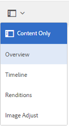

# Procesamiento de imágenes mediante [!DNL Adobe Camera Raw] {#camera-raw-support}

Puede habilitar la variable [!DNL Adobe Camera Raw] compatibilidad para procesar formatos de archivo sin procesar, como CR2, NEF y RAF, y procesar las imágenes en formato JPEG. La funcionalidad es compatible con [!DNL Adobe Experience Manager Assets] usando la variable [paquete Camera Raw](https://experience.adobe.com/#/downloads/content/software-distribution/en/aem.html?package=/content/software-distribution/en/details.html/content/dam/aem/public/adobe/packages/aem630/product/assets/aem-assets-cameraraw-pkg) disponible en Distribución de software.

>[!NOTE]
>
>La funcionalidad solo admite representaciones de JPEG. Es compatible con Windows de 64 bits, Mac OS y RHEL 7.x.

Para habilitar [!DNL Camera Raw] compatibilidad con [!DNL Experience Manager Assets], siga estos pasos:

1. Descargue el [[!DNL Camera Raw] paquete](https://experience.adobe.com/#/downloads/content/software-distribution/en/aem.html?package=/content/software-distribution/en/details.html/content/dam/aem/public/adobe/packages/cq650/product/assets/aem-assets-cameraraw-pkg-1.4.8.zip) from [!DNL Software Distribution].
1. Acceso `https://[aem_server]:[port]/workflow`. Abra el **[!UICONTROL Recurso de actualización DAM]** flujo de trabajo.
1. Edite el **[!UICONTROL Miniaturas de proceso]** paso a paso.
1. Proporcione la siguiente configuración en la **[!UICONTROL Miniaturas]** pestaña:

   * **[!UICONTROL Miniaturas]**: `140:100:false, 48:48:false, 319:319:false`
   * **[!UICONTROL Tipos MIME omitidos]**: `skip:image/dng, skip:image/x-raw-(.*)`

   

1. En el **[!UICONTROL Imagen habilitada para web]** en la **[!UICONTROL Omitir lista]** campo, especificar `audio/mpeg, video/(.*), image/dng, image/x-raw-(.*)`.

   

1. En el panel lateral, añada la variable **[!UICONTROL Controlador Camera Raw/DNG]** paso inferior a **[!UICONTROL Miniaturas de proceso]** paso a paso.
1. En el **[!UICONTROL Controlador Camera Raw/DNG]** , añada la siguiente configuración en la sección **[!UICONTROL Argumentos]** pestaña:

   * **[!UICONTROL Tipos de MIME]**: `image/dng` y `image/x-raw-(.*)`
   * **[!UICONTROL Comando]**:

      * `DAM_Raw_Converter ${directory}/${filename} ${directory} cq5dam.web.1280.1280.jpeg 1280 1280`
      * `DAM_Raw_Converter ${directory}/${filename} ${directory} cq5dam.thumbnail.319.319.jpeg 319 319`
      * `DAM_Raw_Converter ${directory}/${filename} ${directory} cq5dam.thumbnail.140.100.jpeg 140 100`
      * `DAM_Raw_Converter ${directory}/${filename} ${directory} cq5dam.thumbnail.48.48.jpeg 48 48`

   

1. Haga clic en **[!UICONTROL Guardar]**.

>[!NOTE]
>
>Asegúrese de que la configuración anterior sea la misma que la del **[!UICONTROL Ejemplo de recurso de actualización de DAM con paso de gestión Camera Raw y DNG]** configuración.

Ahora puede importar archivos sin procesar de cámara en Assets. Después de instalar el paquete Camera Raw y configurar el flujo de trabajo necesario, **[!UICONTROL Ajuste de imagen]** aparece en la lista de paneles laterales.

*Figura: Opciones del panel lateral.*

*Figura: Utilice la opción para realizar ediciones ligeras en las imágenes.*

Después de guardar las ediciones en un [!DNL Camera Raw] imagen, una nueva representación `AdjustedPreview.jpg` se genera para la imagen. Para otros tipos de imagen excepto [!DNL Camera Raw], los cambios se reflejan en todas las representaciones.

## Prácticas recomendadas, problemas conocidos y limitaciones {#best-practices}

La funcionalidad tiene las siguientes limitaciones:

* La funcionalidad solo admite representaciones de JPEG. Es compatible con Windows de 64 bits, Mac OS y RHEL 7.x.
* La reescritura de metadatos no es compatible con los formatos RAW y DNG.
* La variable [!DNL Camera Raw] La biblioteca de tiene limitaciones en torno al total de píxeles que puede procesar a la vez. Actualmente, puede procesar un máximo de 65000 píxeles en el lado largo de un archivo o 512 MP independientemente de los criterios que se encuentren primero.
