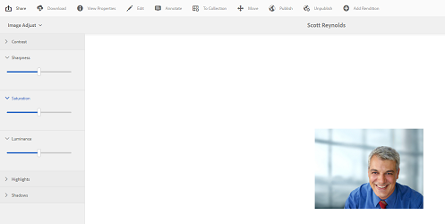

# Compatibilidad para procesar imágenes con Camera Raw {#camera-raw-support}

Puede activar la compatibilidad con Camera Raw para procesar formatos de archivo sin procesar, como CR2, NEF y RAF, y procesar las imágenes en formato JPEG. La funcionalidad se admite en Recursos Adobe Experience Manager mediante el paquete [de](https://www.adobeaemcloud.com/content/marketplace/marketplaceProxy.html?packagePath=/content/companies/public/adobe/packages/aem630/product/assets/aem-assets-cameraraw-pkg) Camera Raw disponible mediante Package Share.

>[!NOTE]
>
>La funcionalidad solo admite representaciones JPEG. Se admite en Windows de 64 bits, Mac OS y RHEL 7.x.

Para activar la compatibilidad con Camera Raw en Recursos de Adobe Experience Manager, siga estos pasos:

1. Descargue el paquete [de](https://www.adobeaemcloud.com/content/marketplace/marketplaceProxy.html?packagePath=/content/companies/public/adobe/packages/aem630/product/assets/aem-assets-cameraraw-pkg) Camera Raw desde Package Share.
1. Acceso `https://[aem_server]:[port]/workflow`. Abra el flujo de trabajo de recursos **[!UICONTROL de actualización de]** DAM.
1. Abra el paso Miniaturas **[!UICONTROL de proceso]** .
1. Proporcione la siguiente configuración en la ficha **[!UICONTROL Miniaturas]** :

   * **[!UICONTROL Miniaturas]**: `140:100:false, 48:48:false, 319:319:false`
   * **[!UICONTROL Tipos MIME omitidos]**: `skip:image/dng, skip:image/x-raw-(.*)`
   

1. En la ficha Imagen **[!UICONTROL habilitada para]** Web, en el campo **[!UICONTROL Omitir lista]** , especifique `audio/mpeg, video/(.*), image/dng, image/x-raw-(.*)`.

   

1. Desde el panel lateral, agregue el paso Controlador **[!UICONTROL RAW de cámara/DNG]** debajo del paso de creación **[!UICONTROL de]** miniaturas.
1. En el paso Controlador **[!UICONTROL Raw de cámara/DNG]** , agregue la siguiente configuración en la ficha **[!UICONTROL Argumentos]** :

   * **[!UICONTROL Tipos]** Mime: `image/dng` y `image/x-raw-(.*)`
   * **[!UICONTROL Comando]**:

      * `DAM_Raw_Converter ${directory}/${filename} ${directory} cq5dam.web.1280.1280.jpeg 1280 1280`
      * `DAM_Raw_Converter ${directory}/${filename} ${directory} cq5dam.thumbnail.319.319.jpeg 319 319`
      * `DAM_Raw_Converter ${directory}/${filename} ${directory} cq5dam.thumbnail.140.100.jpeg 140 100`
      * `DAM_Raw_Converter ${directory}/${filename} ${directory} cq5dam.thumbnail.48.48.jpeg 48 48`
   

1. Haga clic en **[!UICONTROL Guardar]**.

>[!NOTE]
>
>Asegúrese de que la configuración anterior es la misma que la configuración del paso **[!UICONTROL de control de DNG y RAW de cámara para actualizar DAM de]** muestra.

Ahora puede importar archivos sin procesar de cámara en Recursos AEM. Después de instalar el paquete RAW de cámara y configurar el flujo de trabajo necesario, la opción Ajuste **[!UICONTROL de]** imagen aparece en la lista de paneles laterales.

*Figura: Opciones del panel lateral*

*Figura: Utilice la opción para realizar ediciones ligeras en las imágenes*

Después de guardar las ediciones en una imagen de Camera Raw, `AdjustedPreview.jpg` se genera una nueva representación para la imagen. Para otros tipos de imágenes excepto Camera Raw, los cambios se reflejan en todas las representaciones.

## Prácticas recomendadas, problemas conocidos y limitaciones {#best-practices}

La funcionalidad tiene las siguientes limitaciones:

* La funcionalidad solo admite representaciones JPEG. Se admite en Windows de 64 bits, Mac OS y RHEL 7.x.
* La reescritura de metadatos no es compatible con los formatos RAW y DNG.
* La biblioteca de Camera Raw tiene limitaciones en cuanto al total de píxeles que puede procesar a la vez. Actualmente, puede procesar un máximo de 65000 píxeles en el lado largo de un archivo o 512 MP, sea cual sea el criterio que se encuentre primero.
