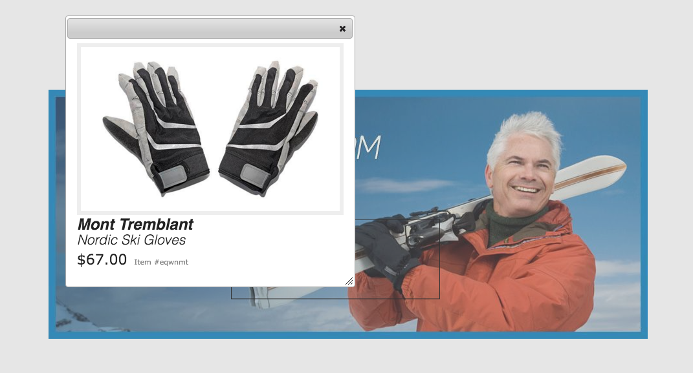

# Banner de carrusel{#carousel-banners}

Los banners de carrusel permiten a los especialistas en marketing impulsar la conversión creando fácilmente contenido promocional giratorio interactivo y entregándolo a cualquier pantalla.

La creación y modificación del contenido de los titulares promocionales puede llevar mucho tiempo, lo que limita su capacidad de publicar rápidamente contenido nuevo o de dirigirlo mejor. Los banners de carrusel permiten crear o modificar rápidamente banners giratorios. Puede añadir interactividad, como puntos interactivos vinculados a los detalles del producto o recursos relacionados, y entregarlos a cualquier pantalla, lo que le permite llevar el nuevo contenido promocional al mercado más rápido.

Los banners de carrusel se designan mediante un banner con la palabra **[!UICONTROL CAROUSELSET]**

En su sitio web, un banner de carrusel puede tener el siguiente aspecto:

Aquí puede navegar por las imágenes (haciendo clic en los números). Además, las diapositivas giran automáticamente en función de un intervalo de tiempo que se pueda personalizar. Las imágenes que agregue en banners de carrusel admiten zonas interactivas y mapas de imágenes, donde los usuarios pueden tocar o ir a un hipervínculo o acceder a una ventana de vista rápida.

En este ejemplo, un usuario ha tocado o hecho clic en un mapa de imagen y ha accedido a la ventana Vista rápida para obtener guantes:

## Vea cómo se crean los titulares de carrusel {#watch-how-carousel-banners-are-created}

Reproduzca un tutorial en [cómo se crean los banners de carrusel](https://s7d5.scene7.com/s7viewers/html5/VideoViewer.html?videoserverurl=https://s7d5.scene7.com/is/content/&amp;emailurl=https://s7d5.scene7.com/s7/emailFriend&amp;serverUrl=https://s7d5.scene7.com/is/image/&amp;config=Scene7SharedAssets/Universal_HTML5_Video_social&amp;contenturl=https://s7d5.scene7.com/skins/&amp;asset=S7tutorials/InteractiveCarouselBanner) (10 minutos y 33 segundos). También aprenderá a previsualizar, editar y enviar banners de carrusel.

>[!NOTE]
>
>Los usuarios no administrativos deben agregarse al grupo **[!UICONTROL dam-users]** para poder crear o editar banners de carrusel. Si tiene problemas para crear o editar, consulte con el administrador del sistema, que puede agregarlo al grupo **[!UICONTROL dam-users]**.

## Inicio rápido: Banner de carrusel {#quick-start-carousel-banners}

Para ponerte en marcha rápidamente con los titulares de carrusel:

1. [Identifique las variables de zona interactiva y mapa de imagen](#identifying-hotspot-and-image-map-variables)  (solo para clientes que utilicen Recursos Experience Manager + Dynamic Media)

   Comience identificando las variables dinámicas que utiliza la implementación de vista rápida existente de modo que pueda introducir los puntos interactivos y los datos de mapa de imagen correctamente durante el proceso de creación de banners de carrusel en Adobe Experience Manager Assets.

   >[!NOTE]
   >
   >Si es Experience Manager de Sitios o cliente de comercio electrónico, puede utilizar la función integrada para navegar a las páginas de producto y buscar los SKU existentes (unidad de mantenimiento de stock) en el catálogo de productos. No es necesario introducir manualmente variables de zona interactiva o mapa de imagen. Consulte la información sobre la [configuración de eCommerce](/help/commerce/cif-classic/administering/generic.md).
   >
   >
   >Si es cliente de Recursos Experience Manager y Dynamic Media, introduzca manualmente los datos de las zonas interactivas y los mapas de imágenes y, a continuación, integre la URL publicada o el código incrustado en su sistema de administración de contenido de terceros.

1. Opcional: [Cree un ajuste preestablecido de visualizador de conjuntos de carrusel](/help/assets/managing-viewer-presets.md), según sea necesario.

   Si es administrador, puede personalizar el comportamiento y el aspecto del carrusel creando su propio ajuste preestablecido de visualizador de carrusel. La principal ventaja es que puede reutilizar este ajuste preestablecido de visualizador personalizado para varios carruseles. Sin embargo, los usuarios pueden personalizar de forma opcional el comportamiento y el aspecto del carrusel directamente durante la creación del carrusel. Este método es el enfoque preferido cuando desea un diseño específico para un carrusel determinado.

1. [Cargar un titular de imagen](#uploading-image-banners).

   Cargue banners de imagen que desee hacer interactivos.

1. [Crear un conjunto de carrusel](#creating-carousel-sets).

   En Conjuntos de carruseles, los usuarios navegan por las imágenes de banner y tocan zonas interactivas o mapas de imágenes para acceder al contenido relevante.

   Para crear un conjunto de carrusel en Assets, pulse **[!UICONTROL Crear]** y, a continuación, seleccione **[!UICONTROL Conjuntos de carrusel]**. Agregue recursos a las diapositivas y pulse **[!UICONTROL Guardar]**. También puede editar el aspecto y el comportamiento del carrusel directamente en el editor.

1. [Agregue zonas interactivas o mapas de imágenes a un banner](#adding-hotspots-or-image-maps-to-an-image-banner) de imagen.

   Agregue una o más zonas interactivas o mapas de imagen a un banner de imagen y asocie cada una de ellas a una acción como un vínculo, una vista rápida o un fragmento de experiencia. Después de agregar zonas interactivas o mapas de imágenes, para finalizar esta tarea, publique el conjunto de carrusel. La publicación crea el código incrustado que puede utilizar para copiar y aplicar a la página de aterrizaje del sitio web.

   Consulte [(Opcional) Vista previa de banners de carrusel](#optional-previewing-carousel-banners) - Opcional. Si lo desea, puede ver una representación del conjunto de carrusel y probar su interactividad.

1. [Publicar letreros de carrusel](#publishing-carousel-banners).

   Puede publicar un conjunto de carrusel como lo haría con cualquier recurso. En Assets, vaya al conjunto de carrusel, selecciónelo y pulse **[!UICONTROL Publicar]**. Al publicar un conjunto de carrusel, se activa la dirección URL y la cadena Incrustar.

1. Realice una de las acciones siguientes:

   * [Agregue un banner de carrusel a la ](#adding-a-carousel-banner-to-your-website-page) página del sitio web. Puede agregar la URL del banner de carrusel o incrustar el código que ha copiado en la página del sitio web.

      * [Integre el banner de carrusel con una vista rápida](#integrating-the-carousel-banner-with-an-existing-quickview) existente. Si utiliza un sistema de administración de contenido web de terceros, debe integrar el nuevo titular de carrusel con la implementación de vista rápida existente en el sitio web.
   * [Agregue un banner de carrusel a su sitio web en Experience ](/help/assets/adding-dynamic-media-assets-to-pages.md) Manager. Si es cliente de Experience Manager Sites, puede agregar el conjunto de carrusel directamente a la página en Experience Manager mediante el componente Medios interactivos.

Para editar los conjuntos de carrusel, consulte [edición de conjuntos de carrusel](#editing-carousel-sets). Además, puede ver y editar [Propiedades del conjunto de carrusel](manage-assets.md#editing-properties).

## Identificación de variables de zona interactiva y mapa de imagen {#identifying-hotspot-and-image-map-variables}

Comience identificando las variables dinámicas que utiliza la implementación de vista rápida existente de modo que pueda introducir puntos interactivos o datos de mapa de imagen correctamente durante el proceso de creación de conjuntos de carrusel en Recursos de Experience Manager.

Cuando agregue zonas interactivas o mapas de imágenes a una imagen de titular en Recursos de Experience Manager, asigne un SKU y variables adicionales opcionales a cada zona interactiva o mapa de imagen. Estas variables se utilizan más adelante para hacer coincidir puntos interactivos o mapas de imágenes con contenido de vista rápida.

>[!NOTE]
>
>Si es cliente Experience Manager de Sites o comercio electrónico Experience Manager, omita este paso. No es necesario identificar manualmente las variables de zona interactiva o mapa de imagen; puede utilizar la integración con comercio electrónico para la integración del producto. Consulte la información sobre la [configuración de eCommerce](/help/commerce/cif-classic/administering/generic.md). Además, puede utilizar el componente interactivo y añadirlo a su página web.
>
>Si es cliente de Recursos Experience Manager o Medios, publica la URL o el código incrustado y, a continuación, integre el sistema de administración de contenido de terceros e identifique los puntos interactivos y los mapas de imágenes manualmente.

Es importante identificar correctamente el número y el tipo de variables que se asociarán con los datos de zona interactiva o mapa de imagen. Cada zona interactiva o mapa de imagen que se añada a una imagen de banner debe contener suficiente información para identificar sin ambigüedades el producto en el sistema back-end existente. Al mismo tiempo, cada zona interactiva o mapa de imagen no debe incluir más datos de los necesarios. El motivo es que esto haría que el proceso de entrada de datos sea demasiado complejo y en curso, o la administración de mapas de imágenes sea más propensa a errores.

Existen diferentes maneras de identificar un conjunto de variables que se utilizarán para los datos de zona interactiva o mapa de imagen.

A veces es suficiente consultar a los especialistas de TI responsables de la implementación de Quickview existente. Es probable que sepan cuál es el conjunto mínimo de datos necesario para identificar la vista rápida en el sistema. Sin embargo, normalmente también es posible analizar el comportamiento existente del código front-end.

La mayoría de las implementaciones de vista rápida utilizan el siguiente paradigma:

* El usuario activa un elemento de interfaz de usuario en el sitio web. Por ejemplo, al pulsar un botón **[!UICONTROL Quickview]**.
* El sitio web envía una solicitud de Ajax al servidor para cargar los datos o el contenido de la vista rápida, si es necesario.
* Los datos de vista rápida se traducen al contenido como preparación para su renderización en la página web.
* Por último, el código front-end procesa visualmente dicho contenido en la pantalla.

El método entonces es visitar diferentes áreas del sitio web existente donde se implementa la función Vista rápida. Déclencheur la vista rápida y captura la URL de Ajax que envía la página web para cargar los datos o el contenido de la vista rápida.

Normalmente no es necesario que utilice ninguna herramienta de depuración especializada. Los navegadores web modernos cuentan con inspectores web que realizan un trabajo adecuado. A continuación se indican algunos ejemplos de exploradores web que incluyen inspectores web:

* Para ver todas las solicitudes HTTP salientes en Google Chrome, pulse F12 (Windows) o Comando-Opción-I (Mac) para abrir el panel Herramientas para desarrolladores y, a continuación, pulse la pestaña Red.
* En Firefox, puede activar el complemento Firebug pulsando F12 (Windows) o Comando-Opción-I (Mac) y utilizar su ficha Red, o bien puede utilizar la herramienta Inspector integrada y su pestaña Red.

Cuando la supervisión de red está activada en el explorador, ponga en déclencheur la vista rápida en la página.

Ahora, busque la URL de Ajax de vista rápida en el registro de red y copie la URL grabada para su análisis futuro. Por lo general, cuando se déclencheur la vista rápida hay numerosas solicitudes que se envían al servidor. Normalmente, la URL de Ajax de vista rápida es una de las primeras de la lista. Tiene una ruta o parte de una cadena de consulta compleja y su tipo MIME de respuesta es `text/html`, `text/xml` o `text/javascript`.

Durante este proceso, es importante visitar diferentes áreas del sitio web, con diferentes tipos y categorías de productos. El motivo es que las URL de vista rápida tienen partes que son comunes para una categoría de sitio web determinada, pero cambian solo si visita un área diferente del sitio web.

En el caso más simple, la única parte de la variable en la URL de vista rápida es el SKU del producto. En este caso, el valor SKU es la única pieza de datos que necesita para agregar zonas interactivas o mapas de imagen a la imagen del banner.

Sin embargo, en casos complejos, la URL de vista rápida tiene diferentes elementos además del SKU, como el ID de categoría, el código de color y el código de tamaño, por ejemplo. En estos casos, cada elemento es una variable independiente en la definición de datos de zona interactiva o mapa de imagen en la función de titular de carrusel.

Veamos los siguientes ejemplos de direcciones URL de vista rápida y las variables de zona interactiva o mapa de imagen que se obtienen:

<table>
 <tbody>
  <tr>
   <td>SKU único, que se encuentra en la cadena de consulta.</td>
   <td>
Las direcciones URL de vista rápida registradas incluyen lo siguiente:

    <ul>
     <li>
<code>https://server/json?productId=866558&amp;source=100</code>
 </li>
     <li>
<code>https://server/json?productId=1196184&amp;source=100</code>
 </li>
     <li>
<code>https://server/json?productId=1081492&amp;source=100</code>
 </li>
     <li>
<code>https://server/json?productId=1898294&amp;source=100</code>
 </li>
    </ul> 
La única parte de variable en la dirección URL es el valor del parámetro de cadena de consulta <code>productId=</code> y es claramente un valor SKU. Por lo tanto, las zonas interactivas o los mapas de imágenes solo necesitan campos SKU rellenados con valores como <code>866558,</code> <code>1196184,</code> <code>1081492,</code> <code>1898294.</code>
 </td>
  </tr>
  <tr>
   <td>SKU único, que se encuentra en la ruta de URL.</td>
   <td>
Las direcciones URL de vista rápida registradas incluyen lo siguiente:

    <ul>
     <li>
<code>https://server/product/6422350843</code>
 </li>
     <li>
<code>https://server/product/1607745002</code>
 </li>
     <li>
<code>https://server/product/0086724882</code>
 </li>
    </ul> 
La parte de la variable se encuentra en la última parte de la ruta y se convierte en el valor de SKU de las zonas interactivas/mapas de imagen:<strong><code>6422350843</code>, <code>1607745002,</code> </strong><code>0086724882.</code>
 </td>
  </tr>
  <tr>
   <td>SKU e ID de categoría en la cadena de consulta.</td>
   <td>
Las direcciones URL de vista rápida registradas incluyen lo siguiente:

    <ul>
     <li>
<code>https://server/quickView/product/?category=1100004&amp;prodId=305466</code>
 </li>
     <li>
<code>https://server/quickView/product/?category=1100004&amp;prodId=310181</code>
 </li>
     <li>
<code>https://server/quickView/product/?category=1740148&amp;prodId=308706</code>
 </li>
    </ul> 
En este caso, hay dos partes diferentes en la dirección URL. El SKU se almacena en el parámetro <code>prodId</code> y el ID de categoría en el parámetro <code>category=</code>.
 
Como tal, las definiciones de zona interactiva/mapa de imagen son pares. Es decir, un valor de SKU y una variable adicional llamada <code>categoryId</code>. Los pares resultantes son los siguientes:

    <ul>
     <li>
El SKU es <strong><code>305466</code></strong> y <code>categoryId</code> es <code>1100004</code>.
 </li>
     <li>
El SKU es <strong><code>310181</code></strong> y <code>categoryId</code> es <strong><code>1100004</code></strong>.
 </li>
     <li>
El SKU es <strong><code>308706</code></strong> y <code>categoryId</code> es <strong><code>1740148</code></strong>.
 </li>
    </ul> </td>
  </tr>
 </tbody>
</table>

## Carga de banners de imagen {#uploading-image-banners}

Si ya ha cargado las imágenes que desea utilizar, avance al siguiente paso, [Creación de conjuntos de carrusel](#creating-carousel-sets). Tenga en cuenta que las imágenes utilizadas en el carrusel deben cargarse después de habilitar Dynamic Media.

Para cargar titulares de imagen, consulte [Carga de recursos](/help/assets/manage-assets.md).

## Creación de conjuntos de carrusel {#creating-carousel-sets}

>[!NOTE]
>
>Los usuarios no administrativos deben agregarse al grupo **[!UICONTROL dam-users]** para poder crear o editar banners de carrusel. Si tiene problemas para crear o editar, consulte con el administrador del sistema, que puede agregarlo al grupo **[!UICONTROL dam-users]**.

**Para crear un conjunto de carrusel:**

1. En Assets, vaya a la carpeta donde desee crear el conjunto de carrusel y pulse **[!UICONTROL Crear > Conjunto de carrusel]**.
1. En la página Editor de letreros de carrusel, pulse **[!UICONTROL Toque para abrir Selector de recursos]** para seleccionar la imagen de la primera diapositiva.

   En la página Editor de banners de carrusel , realice una de las acciones siguientes:

   * Cerca de la esquina superior izquierda de la página, pulse el icono **[!UICONTROL Agregar diapositiva]**.

   * Cerca del centro de la página, pulse **[!UICONTROL Toque para abrir el Selector de recursos]**.
   Pulse para seleccionar los recursos que desea incluir en el conjunto de carrusel. Los recursos seleccionados tienen un icono de marca de verificación sobre ellos. Cuando haya terminado, pulse **[!UICONTROL Seleccionar]** cerca de la esquina superior derecha de la página.

   Con el Selector de recursos, puede buscar recursos escribiendo una palabra clave y pulsando o haciendo clic en **[!UICONTROL Retorno]**. También puede aplicar filtros para restringir los resultados de búsqueda. Puede filtrar por ruta, colección, tipo de archivo y etiqueta. Seleccione el filtro y, a continuación, pulse el icono **[!UICONTROL Filtro]** en la barra de herramientas. Para cambiar la vista, pulse el icono Ver y seleccione **[!UICONTROL Vista de columna]**, **[!UICONTROL Vista de tarjeta]** o **[!UICONTROL Vista de lista]**.

   Consulte [Uso de selectores](/help/assets/working-with-selectors.md) para obtener más información.

1. Siga agregando diapositivas hasta que haya añadido todas las imágenes que desee rotar en el conjunto de carrusel.
1. (Opcional) Realice cualquiera de las siguientes acciones:

   * Si es necesario, arrastre las diapositivas para reordenar las imágenes en la lista de conjuntos.
   * Para eliminar una imagen, seleccione la imagen y, a continuación, pulse **[!UICONTROL Eliminar diapositiva]** en la barra de herramientas.

   * Para aplicar un ajuste preestablecido, cerca de la esquina superior derecha de la página, pulse la lista desplegable de ajustes preestablecidos y, a continuación, seleccione un ajuste preestablecido para aplicarlo al conjunto a la vez.
   Para eliminar una diapositiva, toque o haga clic en la diapositiva y toque o haga clic en **[!UICONTROL Eliminar diapositiva]** en la barra de herramientas. Para mover una diapositiva, pulse el icono de reordenación y mantenga presionada la posición deseada.

1. Después de agregar las imágenes en las diapositivas, puede agregar un punto interactivo, un mapa de imágenes o ambos a la imagen. Consulte [adición de zonas interactivas o mapas de imágenes](#adding-hotspots-or-image-maps-to-an-image-banner).
1. Puede cambiar el diseño visual y el comportamiento de los conjuntos de carrusel. Pulse las pestañas **[!UICONTROL Behavior]** y **[!UICONTROL Aspecto]** y ajuste cómo aparece el banner de carrusel o cómo se comportan los componentes específicos. Consulte [administración de ajustes preestablecidos de visor](/help/assets/viewer-presets.md) para obtener más información sobre cómo utilizar el editor de visores.

   >[!NOTE]
   >
   >Para los banners de carrusel, los siguientes son aspectos que puede ajustar:
   >
   >    * Duración que muestra una imagen. De forma predeterminada, cada imagen se muestra durante 9 segundos.
   >    * Animación. De forma predeterminada, cada transición de diapositiva es un fundido. Puede cambiarlo a una transición de diapositiva.
   >    * Estilo de los botones. Los usuarios pueden rotar por los banners tocando cada punto o número. Puede cambiar dónde aparecen los botones del indicador de conjunto (y si son numéricos o de un estilo punteado) y su tamaño.
   >    * Cambie el estilo de resaltado de un mapa de imagen o el icono utilizado para las zonas interactivas.
   >    * Antes de editar un ajuste preestablecido de visualizador, elija el estilo en el que desea el ajuste preestablecido. Si no elige un estilo, al comenzar a editar el ajuste preestablecido de visualizador, perderá todos los cambios si decide cambiar a otro ajuste preestablecido.

   >
   >Consulte [Consideraciones especiales para titulares de carrusel](/help/assets/managing-viewer-presets.md#special-considerations-for-creating-a-carousel-banner-viewer-preset) para obtener instrucciones detalladas y más información sobre el editor de visores.

   También puede obtener una vista previa del aspecto del banner de carrusel. Consulte [(Opcional) Vista previa de banners de carrusel](#optional-previewing-carousel-banners).

1. Toque **[!UICONTROL Guardar]** cuando termine.

## Adición de zonas interactivas o mapas de imagen a un titular de imagen {#adding-hotspots-or-image-maps-to-an-image-banner}

Puede agregar zonas interactivas o mapas de imágenes a un banner mediante el editor de conjuntos de carrusel.

Al agregar zonas interactivas o mapas de imágenes, puede definirlas como una visualización emergente de vista rápida, como un hipervínculo o un fragmento de experiencia.

Consulte [Fragmento de experiencias](/help/sites-authoring/experience-fragments.md).

>[!NOTE]
>
>Las herramientas de uso compartido de redes sociales en Carousel Banner no son compatibles cuando se incrusta el visor en un fragmento de experiencia.
>
>Para solucionar este problema, puede utilizar o crear ajustes preestablecidos de visualizador que no tengan herramientas de uso compartido en redes sociales. Estos ajustes preestablecidos de visor permiten incrustarlos correctamente en fragmentos de experiencias.

Cuando agregue zonas interactivas o mapas de imágenes a una imagen, recuerde guardar su trabajo. Las opciones Deshacer y Rehacer, cerca de la esquina superior derecha de la página, son compatibles durante la sesión de creación/edición actual.

Cuando termine de crear el banner de carrusel, puede usar la opción Vista previa para ver una representación de cómo el banner de carrusel aparece para los clientes.

Consulte [(Opcional) Vista previa de banners de carrusel](#optional-previewing-carousel-banners).

>[!NOTE]
>
>Cuando se añaden zonas interactivas a una imagen en una [imagen interactiva](/help/assets/interactive-images.md) o un titular de carrusel, la información del punto interactivo se almacena en la misma ubicación de metadatos. Esa ubicación es relativa a la ubicación de la imagen, independientemente de si es una imagen interactiva o un titular de carrusel. Esta funcionalidad significa que puede reutilizar fácilmente la misma imagen (junto con sus datos de puntos interactivos definidos) en cualquier visor.
No obstante, tenga en cuenta que los carrusel Banners admiten mapas de imágenes en imágenes que también pueden contener zonas interactivas; una imagen interactiva no. Tenga en cuenta esta regla si desea crear una imagen interactiva o un titular de carrusel que utilice la misma imagen. Considere la posibilidad de crear imágenes interactivas y titulares de carrusel utilizando copias independientes de la misma imagen.

>[!NOTE]
Si edita imágenes interactivas con zonas interactivas y recorta la imagen, se eliminarán las zonas interactivas.

Consulte también [Adición de mapas de imagen](/help/assets/image-maps.md).

**Para agregar puntos interactivos o mapas de imagen a un titular de imagen:**

1. En Assets, desplácese hasta el conjunto de carrusel que desee interactuar.
1. Seleccione el conjunto de carrusel y pulse **[!UICONTROL Editar]**. Se abre el Editor del visualizador de carrusel.
1. Seleccione la diapositiva que desee convertir en interactiva.
1. Cerca de la esquina superior izquierda de la página, pulse **[!UICONTROL Zona interactiva]** o **[!UICONTROL Mapa de imagen]**.
1. Realice una de las siguientes acciones:

   * Para zonas interactivas: En la imagen, pulse una ubicación en la que desee que aparezca el punto interactivo.
   * Para mapas de imágenes: En la imagen, haga clic en y arrastre desde la parte superior izquierda a la parte inferior derecha para crear el área del mapa de imagen. Para ajustar el tamaño del mapa de imagen, arrastre las esquinas.

   Si es necesario, arrastre el punto interactivo o el mapa de imagen a una nueva ubicación. Agregue zonas interactivas o mapas de imágenes adicionales según sea necesario.

   Para eliminar una zona interactiva o un mapa de imagen, pulse la pestaña **[!UICONTROL Acciones]**. En el encabezado **[!UICONTROL Mapas y zonas interactivas]**, del menú desplegable **[!UICONTROL Tipo seleccionado]**, seleccione el nombre del punto interactivo o del mapa de imagen que desea eliminar. Pulse el icono **[!UICONTROL Papelera]** situado junto al menú y, a continuación, pulse **[!UICONTROL Eliminar]**.

1. En el campo de texto Nombre , escriba el nombre del punto interactivo o del mapa de imagen. Este nombre también aparece en la lista desplegable **[!UICONTROL Mapas y zonas interactivas]**. Proporcionar un nombre facilita la identificación del punto interactivo o del mapa de imagen si decide cambiarlo en el futuro.
1. Realice una de las siguientes acciones en la pestaña **[!UICONTROL Actions]**:

   * Toque **[!UICONTROL Quickview]**.

      * Si es Experience Manager de Sitios y cliente de comercio electrónico, pulse el icono Selector de productos (lupa) para abrir la página Seleccionar producto . Pulse el producto que desee utilizar y, a continuación, pulse la marca de verificación en la esquina superior derecha de la página para poder volver al Editor de banners de carrusel.
      * Si no es cliente de Sitios Experience Manager o de comercio electrónico

         * Consulte [Identificación de variables de puntos interactivos](#identifying-hotspot-and-image-map-variables) si desea definir estas variables.
         * A continuación, introduzca manualmente el valor de SKU. En el campo de texto Valor de SKU , escriba el SKU del producto (unidad de mantenimiento de stock), que es un identificador único para cada producto o servicio distinto que ofrezca. El valor de SKU introducido rellena automáticamente la parte variable de la plantilla de vista rápida, de modo que el sistema sepa que debe asociar la zona interactiva tocada con la vista rápida de un SKU en particular.
         * (Opcional) Si hay otras variables dentro de la vista rápida que debe utilizar para identificar un producto, pulse **[!UICONTROL Agregar variable genérica]**. En el campo de texto, especifique una variable adicional. Por ejemplo, category=Mens es una variable agregada.

         * Consulte [Uso de selectores](/help/assets/working-with-selectors.md) para obtener más información.
   * Toque **[!UICONTROL Hipervínculo]**.

      * Si es cliente de Sites de Experience Manager, pulse el icono (carpeta) Selector de sitio para desplazarse a una dirección URL.
         >[!NOTE]
         El método de vinculación basado en URL no es posible si el contenido interactivo tiene vínculos con direcciones URL relativas, especialmente vínculos a páginas de sitios Experience Manager.

      * Si es cliente independiente, en el campo de texto HREF especifique la ruta de URL completa a una página web vinculada.

   Asegúrese de especificar si desea abrir el vínculo en una nueva pestaña del explorador (opción predeterminada recomendada) o en la misma pestaña.

   Consulte [Uso de selectores](/help/assets/working-with-selectors.md) para obtener más información.

   * Pulse **[!UICONTROL Fragmento de experiencias]**.

      * Si es cliente de Sitios Experience Manager, pulse el icono de búsqueda (lupa) para abrir la página Fragmento de experiencias . Toque o haga clic en el fragmento de experiencia que desee utilizar y, a continuación, pulse Seleccionar en la esquina superior derecha de la página para poder volver a la página de administración de puntos interactivos.
Consulte [Fragmentos de experiencias](/help/sites-authoring/experience-fragments.md).

      * Especifique la anchura y la altura del fragmento de experiencia tal como aparece en el banner.

         >[!NOTE]
         Las herramientas de uso compartido de redes sociales en Carousel Banner no son compatibles cuando se incrusta el visor en un fragmento de experiencia.
         Para solucionar este problema, cree ajustes preestablecidos de visualizador que no tengan herramientas de uso compartido en medios sociales. Estos ajustes preestablecidos de visor permiten incrustarlos correctamente en fragmentos de experiencias.
   

   También puede obtener una vista previa del aspecto del banner de carrusel. Consulte [(Opcional) Vista previa de banners de carrusel](#optional-previewing-carousel-banners).

1. Toque **[!UICONTROL Guardar]**.
1. Publique el conjunto de carrusel. La publicación crea el código incrustado o la URL que puede usar en la página del sitio web. Si es cliente de Experience Manager Sites, puede agregar el conjunto de carrusel directamente a su página web.

   Consulte [Publicación de recursos](/help/assets/publishing-dynamicmedia-assets.md).

   Consulte [Adición de un conjunto de carrusel a la página de aterrizaje del sitio web](#adding-a-carousel-banner-to-your-website-page)

## Edición de conjuntos de carrusel {#editing-carousel-sets}

>[!NOTE]
Los usuarios no administrativos deben agregarse al grupo **[!UICONTROL dam-users]** para poder crear o editar banners de carrusel. Si tiene problemas para crear o editar, consulte con el administrador del sistema, que puede agregarlo al grupo **[!UICONTROL dam-users]**.

Puede realizar varias tareas de edición en conjuntos de carrusel, como las siguientes:

* Agregue diapositivas a un conjunto de carrusel. Consulte también [Uso de selectores](/help/assets/working-with-selectors.md).
* Vuelva a ordenar las diapositivas en el conjunto de carrusel.
* Eliminar recursos del conjunto de carrusel.
* Aplique un ajuste preestablecido de visualizador.
* Eliminar el conjunto de carrusel.
* Agregue o edite zonas interactivas y mapas de imágenes. Consulte también [Uso de selectores](/help/assets/working-with-selectors.md).

**Edición de un conjunto de carrusel**

1. Realice una de las siguientes acciones:

   * Pase el ratón sobre un recurso de conjunto de carrusel y, a continuación, pulse **[!UICONTROL Editar]** (icono de lápiz).
   * Pase el ratón sobre un recurso de conjunto de carrusel, pulse **[!UICONTROL Seleccionar]** (icono de marca de verificación) y, a continuación, pulse **[!UICONTROL Editar]** en la barra de herramientas.

   * Pulse en un recurso de conjunto de carrusel y, a continuación, en la esquina superior izquierda de la página pulse **[!UICONTROL Editar]** (icono de lápiz).

1. Para editar el conjunto de carrusel, realice una de las acciones siguientes:

   * Para agregar una diapositiva, pulse el icono **[!UICONTROL Agregar diapositiva]** y luego navegue hasta el recurso que desee agregar a esa diapositiva y toque o haga clic en la marca de verificación.
   * Para reordenar las diapositivas, arrastre una diapositiva a una nueva ubicación (seleccione el icono de reordenar para mover elementos).
   * Para agregar una zona interactiva o un mapa de imagen, haga clic en los iconos de zona interactiva o mapa de imagen y consulte [adición de zonas interactivas y mapas de imagen](#adding-hotspots-or-image-maps-to-an-image-banner).
   * Para editar el aspecto o el comportamiento del conjunto de carrusel, pulse la pestaña **[!UICONTROL Aspecto]** o la pestaña **[!UICONTROL Comportamiento]** y, a continuación, defina las opciones que desee.
   * Para editar puntos interactivos o mapas de imágenes, en la diapositiva adecuada, seleccione un punto interactivo o mapa de imágenes y cambie según sea necesario en la pestaña **[!UICONTROL Actions]**.
   * Para eliminar una diapositiva, selecciónela y, a continuación, pulse **[!UICONTROL Eliminar diapositiva]** en la barra de herramientas.
   * Para aplicar un ajuste preestablecido, cerca de la esquina superior derecha de la página, pulse la lista desplegable **[!UICONTROL Ajuste preestablecido]** y, a continuación, seleccione un ajuste preestablecido de visualizador.
   * Para eliminar un conjunto de carrusel completo, vaya al conjunto de carrusel, selecciónelo y pulse **[!UICONTROL Eliminar]**.

   >[!NOTE]
   Si edita imágenes interactivas con zonas interactivas y recorta la imagen, se eliminarán las zonas interactivas.

## (Opcional) Vista previa de banners de carrusel {#optional-previewing-carousel-banners}

Puede utilizar Vista previa para ver cómo aparece el banner de carrusel para los clientes y para probar los puntos interactivos y los mapas de imágenes de los banners de carrusel para asegurarse de que se comportan del modo esperado.

Cuando esté satisfecho con el banner de carrusel, puede publicarlo.
Consulte [Incrustación del visualizador de imágenes o vídeos en una página web](/help/assets/embed-code.md).
Consulte [Vinculación de URL a la aplicación web](/help/assets/linking-urls-to-yourwebapplication.md). El método de vinculación basado en URL no es posible si el contenido interactivo tiene vínculos con direcciones URL relativas, especialmente vínculos a páginas de sitios Experience Manager.
Consulte [Adición de recursos de Dynamic Media a las páginas](/help/assets/adding-dynamic-media-assets-to-pages.md).

Puede obtener una vista previa de los banners de carrusel desde el Editor de carrusel (método preferido) o desde la lista **[!UICONTROL Visualizadores]**.

**Para obtener una vista previa de los banners de carrusel:**

1. En **[!UICONTROL Assets]**, vaya a un banner de carrusel existente que haya creado y pulse para abrirlo.
1. Toque **[!UICONTROL Editar]**.
1. En la lista de ajustes preestablecidos de visualizador situada en la esquina derecha de la barra de herramientas, seleccione un visualizador para previsualizar el banner de carrusel.

   

1. Toque **[!UICONTROL Preview]**.
1. Pulse las zonas interactivas o los mapas de imágenes de la imagen para poder probar las acciones asociadas.

**Para previsualizar los banners de carrusel desde la lista Visualizadores:**

1. En **[!UICONTROL Assets]**, vaya a un banner de carrusel existente que haya creado y pulse para abrirlo.
1. Cerca de la esquina superior izquierda de la página Vista previa, haga clic en el icono Contenido .
1. En la lista **[!UICONTROL Visualizadores]** del panel de la parte izquierda de la página, pulse el nombre del ajuste preestablecido del visualizador de banners de carrusel que desee utilizar.
1. Pulse las zonas interactivas o los mapas de imágenes de la imagen para poder probar las acciones asociadas.

## Publicación de letreros de carrusel {#publishing-carousel-banners}

Publique el carrusel para que pueda utilizarlo. Al publicar un conjunto de carrusel, se activa la dirección URL y el código incrustado. También publica el carrusel en la nube de Dynamic Media, que está integrada con una CDN para una entrega escalable y con rendimiento.

>[!NOTE]
Si utiliza una imagen interactiva existente con zonas interactivas para el banner de carrusel, debe publicar la imagen interactiva por separado después de publicar el banner de carrusel.
Además, si modifica una imagen interactiva publicada previamente que está utilizando en un banner de carrusel, debe publicar la imagen interactiva antes de que esos cambios se reflejen en el banner de carrusel.

Consulte [Publicación de Dynamic Media Assets](/help/assets/publishing-dynamicmedia-assets.md) para obtener información sobre cómo publicar banners de carrusel.

## Adición de un titular de carrusel a la página web {#adding-a-carousel-banner-to-your-website-page}

Después de cargar imágenes de banner para crear un carrusel, agregar zonas interactivas o mapas de imagen al banner y publicar el conjunto de carrusel, ya está listo para agregarlo a la página de sitio web existente.

>[!NOTE]
Si es cliente de Sitios Experience Manager, puede agregar el banner de carrusel directamente a su página arrastrando el componente Medios interactivos a su página. Consulte [Adición de recursos de Dynamic Media a páginas](/help/assets/adding-dynamic-media-assets-to-pages.md).

Sin embargo, si es cliente de recursos de Experience Manager independiente, puede añadir manualmente el banner de carrusel a la página de aterrizaje de su sitio web, tal como se describe en esta sección.

1. Copie el código incrustado del conjunto de carrusel publicado.
Consulte [Incrustación del visualizador de imágenes o vídeos en una página web](/help/assets/embed-code.md).

1. Agregue el código incrustado que ha copiado de Recursos de Experience Manager a su página web.
El código incrustado copiado es interactivo, por lo que debe ajustarse automáticamente al área de incrustación de la página.

## Integración del titular de carrusel con una vista rápida existente {#integrating-the-carousel-banner-with-an-existing-quickview}

Nota: este paso solo se aplica si es cliente independiente de Recursos Experience Manager.

El último paso de este proceso es la integración del titular de carrusel con una implementación de vista rápida existente en su sitio web. Cada implementación de QuickView es única y se necesita un enfoque específico que involucre la asistencia de una persona de TI de front-end.

La implementación de vista rápida existente representa normalmente una cadena de acciones interrelacionadas que se producen en la página web en el siguiente orden:

1. Un usuario déclencheur un elemento en la interfaz de usuario del sitio web.
1. El código del front-end obtiene una URL de vista rápida basada en el elemento de la interfaz de usuario que se activó en el paso 1.
1. El código front-end envía una solicitud de Ajax utilizando la URL obtenida en el paso 2.
1. La lógica back-end devuelve los datos o el contenido de vista rápida correspondientes al código front-end.
1. El código front-end carga los datos o el contenido de Quickview.
1. De forma opcional, el código front-end convierte los datos de Quickview cargados en una representación HTML.
1. El código front-end muestra un cuadro de diálogo modal o panel y representa el contenido HTML en la pantalla para el usuario final.

Estas llamadas no representan llamadas de API públicas independientes a las que la lógica de página web puede llamar desde un paso arbitrario. En su lugar, se trata de una llamada encadenada en la que cada paso siguiente se oculta en la última fase (llamada de retorno) del paso anterior.

Al mismo tiempo que el banner de carrusel sustituye al paso 1 y al paso 2 parcialmente, cuando un usuario toca un punto interactivo o un mapa de imagen dentro del banner de carrusel, el visor gestiona esta interacción. El visor devuelve un evento a la página web que contiene todos los datos de zona interactiva o mapa de imagen agregados anteriormente.

En un controlador de eventos de este tipo, el código front-end hace lo siguiente:

* Escucha un evento emitido por el titular de carrusel.
* Crea una URL de vista rápida basada en los datos de zona interactiva o mapa de imagen.
* Déclencheur el proceso de carga de la vista rápida desde el servidor y de renderización en la pantalla para su visualización.

El código incrustado devuelto por Recursos de Experience Manager ya tiene un controlador de eventos listo para usar que se comenta.

Por lo tanto, solo es necesario descomentar el código y reemplazar el cuerpo del controlador ficticio con el código específico de la página web en particular.

El proceso de construcción de la URL de vista rápida es opuesto al proceso utilizado para identificar las variables de zona interactiva y mapa de imagen que se abarcaron anteriormente.

Consulte [Identificación de variables de zona interactiva y mapa de imagen](#identifying-hotspot-and-image-map-variables).

El último paso para almacenar en déclencheur la URL de vista rápida y activar el panel de vista rápida requiere, muy probablemente, la asistencia de una persona de TI de front-end de su departamento de TI. Tienen conocimientos para saber mejor cómo realizar un déclencheur exacto de la implementación de QuickView desde el paso adecuado, teniendo una URL de Quickview lista para usar.

## Uso de las vistas rápidas para crear ventanas emergentes personalizadas {#using-quickviews-to-create-custom-pop-ups}

Consulte [Creación de ventanas emergentes personalizadas mediante vistas rápidas](/help/assets/custom-pop-ups.md).
