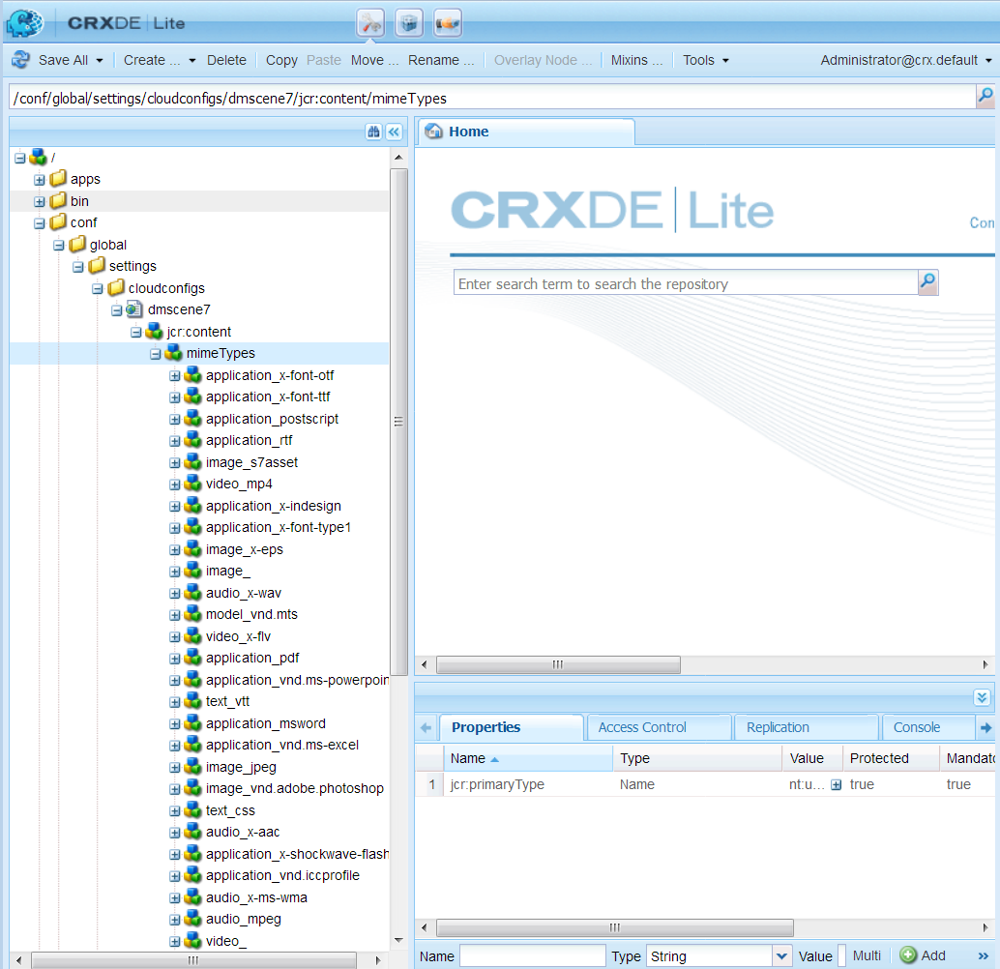
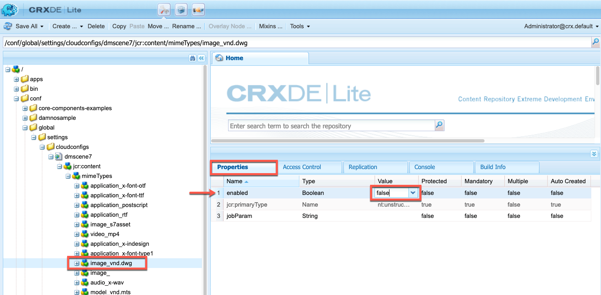

# Configuración de Dynamic Media: modo Scene7{#configuring-dynamic-media-scene-mode}

Si utiliza la configuración de Adobe Experience Manager para diferentes entornos, como desarrollo, ensayo y producción, configure los Cloud Services de Dynamic Media para cada uno de esos entornos.

## Diagrama de arquitectura de Dynamic Media: modo Scene7 {#architecture-diagram-of-dynamic-media-scene-mode}

En el diagrama de arquitectura siguiente se describe cómo funciona el modo Dynamic Media - Scene7.

Con la nueva arquitectura, Experience Manager es responsable de los recursos de origen principales y de las sincronizaciones con Dynamic Media para el procesamiento y la publicación de recursos:

1. Cuando el recurso de origen principal se carga en Experience Manager, se replica en Dynamic Media. En este punto, Dynamic Media gestiona todo el procesamiento de recursos y la generación de representaciones, como la codificación de vídeo y las variantes dinámicas de una imagen. <!-- (In Dynamic Media - Scene7 mode, be aware that you can only upload assets whose file sizes are 2 GB or less.) Jira ticket CQ-4286561 fixed this issue. DM-S7 NOW SUPPORTS THE UPLOAD OF ASSETS LARGER THAN 2 GB. -->
1. Una vez generadas las representaciones, el Experience Manager puede acceder de forma segura a las representaciones de Dynamic Media remotas y obtener una vista previa de ellas (no se devuelven binarios a la instancia de Experience Manager).
1. Una vez que el contenido está listo para publicarse y aprobarse, se déclencheur al servicio Dynamic Media para enviar el contenido a los servidores de entrega y almacenar el contenido en caché en la CDN (Red de entrega de contenido).


>[!IMPORTANT]
>
>La siguiente lista de funciones requiere que utilice la CDN predeterminada incluida con Adobe Experience Manager - Dynamic Media. Ninguna otra CDN personalizada es compatible con estas funciones.
>
>* [Imágenes inteligentes](/help/assets/imaging-faq.md)
* [Invalidación de caché](/help/assets/invalidate-cdn-cache-dynamic-media.md)
* [Protección de Hotlink](/help/assets/hotlink-protection.md)
* [Entrega de contenido HTTP/2](/help/assets/http2.md)
* Redireccionamiento de URL a nivel de CDN
* Akamai ChinaCDN (para una entrega óptima en China)


## Habilitar Dynamic Media en modo Scene7 {#enabling-dynamic-media-in-scene-mode}

[Dynamic Media está desactivado de forma predeterminada. ](https://business.adobe.com/products/experience-manager/assets/dynamic-media.html) Para aprovechar las funciones de Dynamic Media, debe habilitarlas.

>[!WARNING]
Dynamic Media - El modo Scene7 es para la instancia *Autor del Experience Manager solamente*. Como tal, debe configurar `runmode=dynamicmedia_scene7` en la instancia de Autor del Experience Manager, *no* en la instancia de Publicación del Experience Manager.

Para habilitar Dynamic Media, debe iniciar el Experience Manager utilizando el modo de ejecución `dynamicmedia_scene7` desde la línea de comandos introduciendo lo siguiente en una ventana de terminal (por ejemplo, el puerto utilizado es 4502):

```shell
java -Xms4096m -Xmx4096m -Doak.queryLimitInMemory=500000 -Doak.queryLimitReads=500000 -jar cq-quickstart-6.5.0.jar -gui -r author,dynamicmedia_scene7 -p 4502
```

## (Opcional) Migre los ajustes preestablecidos y configuraciones de Dynamic Media de la versión 6.3 a la versión 6.5 de cero tiempo de inactividad {#optional-migrating-dynamic-media-presets-and-configurations-from-to-zero-downtime}

La actualización de Experience Manager Dynamic Media de 6.3 a 6.4 o 6.5 ahora incluye la capacidad de no realizar implementaciones de downtime. Para migrar todos los ajustes preestablecidos y configuraciones de `/etc` a `/conf` en el CRXDE Lite, asegúrese de ejecutar el siguiente comando curl.

>[!NOTE]
Si ejecuta la instancia de Experience Manager en modo de compatibilidad (es decir, tiene instalada la compatibilidad empaquetada), no es necesario ejecutar estos comandos.

Para todas las actualizaciones, ya sea con o sin el paquete de compatibilidad, puede copiar los ajustes preestablecidos de visor predeterminados y listos para usar que se incluyeron originalmente con Dynamic Media ejecutando el siguiente comando Linux® curl:

`curl -u admin:admin -X POST https://<server_address>:<server_port>/libs/settings/dam/dm/presets/viewer.pushviewerpresets.json`

Para migrar cualquier ajuste preestablecido y configuración de visor personalizado que haya creado de `/etc` a `/conf`, ejecute el siguiente comando curl de Linux®:

`curl -u admin:admin -X POST https://<server_address>:<server_port>/libs/settings/dam/dm/presets.migratedmcontent.json`

## Instalación del paquete de características 18912 para la migración masiva de recursos {#installing-feature-pack-for-bulk-asset-migration}

La instalación del paquete de características 18912 es *opcional*.

El paquete de funciones 18912 le permite ingerir recursos de forma masiva mediante FTP, o migrar recursos desde Dynamic Media - Modo híbrido o Dynamic Media Classic a Dynamic Media - Modo Scene7 en Experience Manager. Está disponible desde [Adobe Professional Services](https://business.adobe.com/customers/consulting-services/main.html).

Para obtener más información, consulte [Instalación del paquete de características 18912 para la migración masiva de recursos](/help/assets/bulk-ingest-migrate.md).

## Crear una configuración de Dynamic Media en Cloud Services {#configuring-dynamic-media-cloud-services}

**Antes de configurar Dynamic Media** : después de recibir el correo electrónico de aprovisionamiento con credenciales de Dynamic Media, debe abrir la aplicación [ de escritorio de ](https://experienceleague.adobe.com/docs/dynamic-media-classic/using/getting-started/signing-out.html#getting-started)Dynamic Media Classic e iniciar sesión en la cuenta para cambiar la contraseña. La contraseña proporcionada en el correo electrónico de aprovisionamiento se genera en el sistema y se pretende que sea solo una contraseña temporal. Es importante que actualice la contraseña para que el Cloud Service de Dynamic Media esté configurado con las credenciales correctas.


**Para crear una configuración de Dynamic Media en Cloud Services:**

1. En el modo Autor del Experience Manager, seleccione el logotipo del Experience Manager para acceder a la consola de navegación global y seleccione el icono Herramientas. A continuación, vaya a **[!UICONTROL Cloud Services]** > **[!UICONTROL Configuración de Dynamic Media]**.
1. En la página Explorador de configuración de Dynamic Media, en el panel izquierdo, seleccione **[!UICONTROL global]** (no seleccione el icono de carpeta a la izquierda de **[!UICONTROL global]**) y, a continuación, seleccione **[!UICONTROL Crear]**.
1. En la página **[!UICONTROL Crear configuración de Dynamic Media]**, introduzca un título, la dirección de correo electrónico de la cuenta de Dynamic Media y la contraseña y, a continuación, seleccione su región. Esta información se proporciona por Adobe en el correo electrónico de aprovisionamiento. Póngase en contacto con el Servicio de atención al cliente de Adobe si no recibió el correo electrónico.

   Seleccione **[!UICONTROL Connect to Dynamic Media]**.

   >[!NOTE]
   Cuando reciba el correo electrónico de aprovisionamiento con las credenciales de Dynamic Media, abra la [aplicación de escritorio de Dynamic Media Classic](https://experienceleague.adobe.com/docs/dynamic-media-classic/using/getting-started/signing-out.html#getting-started) e inicie sesión en su cuenta para cambiar la contraseña. La contraseña proporcionada en el correo electrónico de aprovisionamiento se genera en el sistema y se pretende que sea solo una contraseña temporal. Es importante que actualice la contraseña para que el Cloud Service de Dynamic Media esté configurado con las credenciales correctas.

1. Cuando la conexión se realice correctamente, establezca lo siguiente. Los encabezados con un asterisco (*) son obligatorios:

   * **[!UICONTROL Empresa]** : nombre de la cuenta de Dynamic Media. Tiene varias cuentas de Dynamic Media. Por ejemplo, puede tener diferentes submarcas, divisiones, entornos de ensayo o producción.

   * **[!UICONTROL Ruta de carpeta raíz de la empresa]**

   * **[!UICONTROL Publicar recursos]** : puede elegir entre las tres opciones siguientes:
      * **** Inmediatamente significa que, cuando se cargan los recursos, el sistema los incorpora y proporciona la URL o la Incrustar al instante. No es necesario que el usuario intervenga para publicar recursos.
      * **[!UICONTROL Tras la]** activación, significa que debe publicar explícitamente el recurso primero antes de proporcionar un vínculo URL/incrustado.<br><!-- CQDOC-17478, Added March 9, 2021-->A partir de Experience Manager 6.5.8, la instancia de publicación de Experience Manager refleja valores de metadatos de Dynamic Media precisos, como  `dam:scene7Domain` y solo  `dam:scene7FileStatus` en  **[!UICONTROL el modo de publicación Tras]** activación . Para habilitar esta funcionalidad, instale Service Pack 8 y, a continuación, reinicie el Experience Manager. Vaya al Administrador de configuración de Sling. Busque la configuración para `Scene7ActivationJobConsumer Component` o cree una nueva). Seleccione la casilla de verificación **[!UICONTROL Replicar metadatos después de la publicación de Dynamic Media]** y, a continuación, seleccione **[!UICONTROL Guardar]**.

         

      * **[!UICONTROL Publicación selectivaEsta opción le permite controlar qué carpetas se publican en Dynamic Media.]** Permite utilizar funciones como Recorte inteligente o representaciones dinámicas, o determinar qué carpetas se publican exclusivamente en Experience Manager para la vista previa. Estos mismos recursos *no* se publican en Dynamic Media para su envío en el dominio público.<br>Puede establecer esta opción aquí en la configuración de  **[!UICONTROL Dynamic Media Cloud]** o, si lo prefiere, puede elegir establecer esta opción en el nivel de carpeta, en las  **[!UICONTROL propiedades]** de una carpeta.<br>Consulte  [Trabajar con publicación selectiva en Dynamic Media](/help/assets/selective-publishing.md).<br>Si más adelante cambia esta configuración o la cambia posteriormente a nivel de carpeta, esos cambios solo afectarán a los nuevos recursos que cargue a partir de ese momento. El estado de publicación de los recursos existentes en la carpeta permanece tal cual hasta que los cambie manualmente desde **[!UICONTROL Publicación rápida]** o el cuadro de diálogo **[!UICONTROL Administrar publicación]**.
   * **[!UICONTROL Servidor de vista previa segura]** : permite especificar la ruta de URL de su servidor de vista previa de representaciones seguras. Es decir, una vez generadas las representaciones, el Experience Manager puede acceder y previsualizar de forma segura las representaciones de Dynamic Media remotas (no se devuelven binarios a la instancia de Experience Manager).
A menos que tenga una disposición especial para utilizar el servidor de su propia empresa o un servidor especial, Adobe recomienda que deje esta configuración como se ha especificado.

   * **[!UICONTROL Sincronizar todo el contenido]** :  <!-- NEW OPTION, CQDOC-15371, Added March 4, 2020-->seleccionado de forma predeterminada. Anule la selección de esta opción si desea incluir o excluir selectivamente recursos de la sincronización con Dynamic Media. Al anular la selección de esta opción, puede elegir entre los dos modos de sincronización de Dynamic Media siguientes:

   * **[!UICONTROL Modo de sincronización de Dynamic Media]**
      * **[!UICONTROL Habilitado de forma predeterminada]** : la configuración se aplica a todas las carpetas de forma predeterminada, a menos que marque una carpeta específicamente para la exclusión.  <!-- you can then deselect the folders that you do not want the configuration applied to.-->
      * **[!UICONTROL Deshabilitado de forma predeterminada]** : la configuración no se aplica a ninguna carpeta hasta que marque explícitamente una carpeta seleccionada para sincronizar con Dynamic Media.
Para marcar una carpeta seleccionada para sincronizar con Dynamic Media, seleccione una carpeta de recursos y, en la barra de herramientas, seleccione **[!UICONTROL Properties]**. En la pestaña **[!UICONTROL Details]**, en la lista desplegable **[!UICONTROL Dynamic Media sync mode]**, elija una de las tres opciones siguientes. Cuando haya terminado, seleccione **[!UICONTROL Guardar]**. *Recuerde: estas tres opciones no están disponibles si ha seleccionado **[!UICONTROL Sincronizar todo el]**contenido anteriormente.* Consulte también  [Trabajar con publicación selectiva en el nivel de carpeta en Dynamic Media](/help/assets/selective-publishing.md).
         * **[!UICONTROL Heredado]** : no hay ningún valor de sincronización explícito en la carpeta; en su lugar, la carpeta hereda el valor de sincronización de una de sus carpetas antecesoras o el modo predeterminado en la configuración de nube. El estado detallado de heredado se muestra mediante una información del objeto.
         * **[!UICONTROL Habilitar para subcarpetas]** : Incluya todo en este subárbol para sincronizar con Dynamic Media. La configuración específica de la carpeta anula el modo predeterminado en la configuración de la nube.
         * **[!UICONTROL Deshabilitado para subcarpetas]** : excluya todo lo que hay en este subárbol de la sincronización con Dynamic Media.

   >[!NOTE]
   No se admite el control de versiones en DMS7. Además, la activación retrasada solo se aplica si **[!UICONTROL Publicar recursos]** en la página Editar configuración de Dynamic Media está configurada en **[!UICONTROL Al activarse]** y, a continuación, solo hasta la primera vez que se activa el recurso.
   Una vez activado un recurso, las actualizaciones se publican inmediatamente en S7 Delivery.

1. Seleccione **[!UICONTROL Guardar]**.
1. Para previsualizar de forma segura el contenido de Dynamic Media antes de publicarlo, debe &quot;lista de permitidos&quot; la instancia de autor del Experience Manager para conectarse a Dynamic Media:

   * Abra la [aplicación de escritorio de Dynamic Media Classic](https://experienceleague.adobe.com/docs/dynamic-media-classic/using/getting-started/signing-out.html#getting-started) e inicie sesión en su cuenta. Adobe proporcionó las credenciales y los detalles de inicio de sesión en el momento del aprovisionamiento. Si no dispone de esta información, póngase en contacto con el servicio de asistencia técnica.

   * En la barra de navegación cerca de la parte superior derecha de la página, vaya a **[!UICONTROL Configuración]** > **[!UICONTROL Configuración de la aplicación]** > **[!UICONTROL Publicar configuración]** > **[!UICONTROL Servidor de imágenes]**.

   * En la página Publicación del servidor de imágenes , en la lista desplegable Contexto de publicación , seleccione **[!UICONTROL Probar servicio de imágenes]**.
   * Para el filtro de direcciones de cliente, seleccione **[!UICONTROL Agregar]**.
   * Para activar la dirección, seleccione la casilla de verificación. Introduzca la dirección IP de la instancia de Autor del Experience Manager (no la IP de Dispatcher).
   * Seleccione **[!UICONTROL Guardar]**.

Ya ha finalizado con la configuración básica; está listo para usar el modo Dynamic Media - Scene7 .

Si desea personalizar aún más la configuración, puede completar opcionalmente cualquiera de las tareas en [(Opcional) Configuración avanzada en Dynamic Media - Modo Scene7](#optional-configuring-advanced-settings-in-dynamic-media-scene-mode).

## (Opcional) Configuración avanzada en Dynamic Media: modo Scene7 {#optional-configuring-advanced-settings-in-dynamic-media-scene-mode}

Si desea personalizar aún más la configuración y la configuración del modo Dynamic Media - Scene7 o optimizar su rendimiento, puede completar una o más de las siguientes *tareas opcionales*:

* [(Opcional) Configuración de Dynamic Media: configuración del modo Scene7](#optional-setup-and-configuration-of-dynamic-media-scene7-mode-settings)

* [(Opcional) Ajuste el rendimiento del modo Dynamic Media - Scene7](#optional-tuning-the-performance-of-dynamic-media-scene-mode)

* [(Opcional) Filtrar recursos para la replicación](#optional-filtering-assets-for-replication)

### (Opcional) Configuración de Dynamic Media: configuración del modo Scene7 {#optional-setup-and-configuration-of-dynamic-media-scene7-mode-settings}

Cuando esté en modo de ejecución `dynamicmedia_scene7`, utilice la interfaz de usuario de Dynamic Media Classic para cambiar la configuración de Dynamic Media.

Algunas de las tareas anteriores requieren que abra la [aplicación de escritorio de Dynamic Media Classic](https://experienceleague.adobe.com/docs/dynamic-media-classic/using/getting-started/signing-out.html#getting-started) y luego inicie sesión en su cuenta.

Las tareas de configuración y configuración incluyen lo siguiente:

* [Configuración de publicación para Image Server](#publishing-setup-for-image-server)
* [Configuración general de la aplicación](#configuring-application-general-settings)
* [Configuración de la gestión de color](#configuring-color-management)
* [Editar tipos MIME para formatos admitidos](#editing-mime-types-for-supported-formats)
* [Añadir tipos MIME para formatos no compatibles](#adding-mime-types-for-unsupported-formats)
* [Crear ajustes preestablecidos de conjuntos de lotes para generar automáticamente conjuntos de imágenes y conjuntos de giros](#creating-batch-set-presets-to-auto-generate-image-sets-and-spin-sets)

#### Configuración de publicación para Image Server {#publishing-setup-for-image-server}

La configuración de Configuración de publicación determina cómo se envían los recursos de forma predeterminada desde Dynamic Media. Si no se especifica ninguna configuración, Dynamic Media envía un recurso de acuerdo con la configuración predeterminada definida en Configuración de publicación. Por ejemplo, una solicitud para enviar una imagen que no incluya un atributo de resolución genera una imagen con la configuración Resolución de objeto predeterminada .

Para configurar la configuración de publicación: en Dynamic Media Classic, vaya a **[!UICONTROL Configuración]** > **[!UICONTROL Configuración de la aplicación]** > **[!UICONTROL Configuración de publicación]** > **[!UICONTROL Servidor de imágenes]**.

La pantalla Servidor de imágenes establece la configuración predeterminada para la entrega de imágenes. Consulte la pantalla IU para ver una descripción de cada configuración.

* **[!UICONTROL Atributos de solicitud]** : esta configuración impone límites a las imágenes que se pueden enviar desde el servidor.
* **[!UICONTROL Atributos de solicitud predeterminados]** : esta configuración está relacionada con el aspecto predeterminado de las imágenes.
* **[!UICONTROL Atributos de miniatura comunes]** : esta configuración se relaciona con el aspecto predeterminado de las imágenes en miniatura.
* **[!UICONTROL Predeterminados para los campos del catálogo]**: estos ajustes pertenecen a la resolución y al tipo de miniatura predeterminado de las imágenes.
* **[!UICONTROL Atributos de administración de color]** : esta configuración determina qué perfiles de color ICC se utilizan.
* **[!UICONTROL Atributos de compatibilidad]** : esta configuración permite que los párrafos iniciales y finales de las capas de texto se traten como en la versión 3.6 para la compatibilidad con versiones anteriores.
* **[!UICONTROL Compatibilidad con la localización]** : Esta configuración le permite administrar varios atributos de configuración regional. También le permite especificar una cadena de asignación de configuración regional para que pueda definir qué idiomas desea admitir para las distintas informaciones de objeto en Visualizadores. Para obtener más información sobre la configuración de **[Localization Support]**, consulte [Consideraciones al configurar la localización de recursos](https://experienceleague.adobe.com/docs/dynamic-media-classic/using/setup/publish-setup.html?lang=en#considerations-when-setting-up-localization-of-assets).

#### Configuración general de la aplicación {#configuring-application-general-settings}

Para abrir la página Configuración general de la aplicación , en la barra de navegación global de Dynamic Media Classic, vaya a **[!UICONTROL Configuración]** > **[!UICONTROL Configuración de la aplicación]** > **[!UICONTROL Configuración general]**.

**[!UICONTROL Servidores]** : al aprovisionar la cuenta, Dynamic Media proporciona automáticamente los servidores asignados a su empresa. Estos servidores se utilizan para construir cadenas de URL para el sitio web y las aplicaciones. Estas llamadas a URL son específicas de su cuenta. No cambie ninguno de los nombres de servidor a menos que se le indique explícitamente que lo haga el Servicio de atención al cliente de Adobe.

**[!UICONTROL Sobrescribir imágenes]** : Dynamic Media no permite que dos archivos tengan el mismo nombre. El ID de URL de cada elemento (el nombre de archivo menos la extensión) debe ser único. Estas opciones especifican cómo se cargan los recursos de reemplazo: si reemplazan el original o se convierten en duplicados. Se cambia el nombre de los recursos duplicados por &quot;-1&quot; (por ejemplo, el nombre de chair.tif cambia a chair-1.tif). Estas opciones afectan a los recursos cargados en una carpeta diferente a la original o a los recursos con una extensión de nombre de archivo diferente a la original (como JPG, TIF o PNG).

* **[!UICONTROL Sobrescribir en la carpeta actual, el mismo nombre/extensión de imagen base]** : esta opción es la regla más estricta para reemplazar. Requiere que cargue la imagen de reemplazo en la misma carpeta que el original y que la imagen de reemplazo tenga la misma extensión de nombre de archivo que el original. Si no se cumplen estos requisitos, se crea un duplicado.

>[!NOTE]
Para mantener la coherencia con el Experience Manager, elija siempre esta configuración: **Sobrescribir en la carpeta actual, el mismo nombre/extensión de imagen base**

* **[!UICONTROL Sobrescribir en cualquier carpeta, el mismo nombre/extensión de recurso base]** : requiere que la imagen de reemplazo tenga la misma extensión de nombre de archivo que la imagen original (por ejemplo, chair.jpg debe reemplazar a chair.jpg, no chair.tif). Sin embargo, puede cargar la imagen de reemplazo en una carpeta diferente a la original. La imagen actualizada reside en la nueva carpeta; el archivo ya no se puede encontrar en su ubicación original
* **[!UICONTROL Sobrescribir en cualquier carpeta, el mismo nombre de recurso base independientemente de la extensión]** : esta opción es la regla de reemplazo más inclusiva. Puede cargar una imagen de reemplazo en una carpeta distinta a la original, cargar un archivo con una extensión de nombre de archivo diferente y reemplazar el archivo original. Si el archivo original se encuentra en una carpeta diferente, la imagen de reemplazo reside en la nueva carpeta a la que se cargó.

**[!UICONTROL Perfiles de color predeterminados]** : consulte  [Configuración de la ](#configuring-color-management) administración de color para obtener más información.

>[!NOTE]
De forma predeterminada, el sistema muestra 15 representaciones al seleccionar **[!UICONTROL Representaciones]** y 15 ajustes preestablecidos de visualizador al seleccionar **[!UICONTROL Visualizadores]** en la vista de detalles del recurso. Puede aumentar este límite. Consulte [Aumente el número de ajustes preestablecidos de imagen que muestran](/help/assets/managing-image-presets.md#increasing-or-decreasing-the-number-of-image-presets-that-display) o [Aumente el número de ajustes preestablecidos de visor que muestran](/help/assets/managing-viewer-presets.md#increasing-the-number-of-viewer-presets-that-display).


#### Configuración de la gestión de color {#configuring-color-management}

La gestión de color de Dynamic Media le permite colorear los recursos correctos. Con la corrección de color, los recursos incorporados conservan su espacio de color (RGB, CMYK, Gris) y su perfil de color incrustado. Cuando se solicita una representación dinámica, el color de la imagen se corrige en el espacio de color de destino mediante la salida CMYK, RGB o Gris. Consulte [Configurar ajustes preestablecidos de imagen](/help/assets/managing-image-presets.md).

Para configurar las propiedades de color predeterminadas de modo que la corrección de color esté habilitada cuando se soliciten imágenes:

1. Abra la [aplicación de escritorio de Dynamic Media Classic](https://experienceleague.adobe.com/docs/dynamic-media-classic/using/getting-started/signing-out.html#getting-started) e inicie sesión en la cuenta con las credenciales proporcionadas durante el aprovisionamiento.
1. Vaya a **[!UICONTROL Configuración]** > **[!UICONTROL Configuración de la aplicación]**.
1. Expanda el área **[!UICONTROL Ajustes de publicación]** y seleccione **[!UICONTROL Servidor de imágenes]**. Configure **[!UICONTROL Publicar contexto]** en **[!UICONTROL Servicio de imágenes]** cuando establezca los valores predeterminados para las instancias de publicación.
1. Desplácese hasta la propiedad que desee cambiar. Por ejemplo, una propiedad en el área **[!UICONTROL Atributos de administración de color]**.

   Puede establecer las siguientes propiedades de corrección de color:

   * **[!UICONTROL Espacio de color predeterminado CMYK]** : nombre del perfil de color CMYK predeterminado
   * **[!UICONTROL Espacio de color predeterminado de escala de grises]** : nombre del perfil de color gris predeterminado
   * **[!UICONTROL RGB Espacio de color predeterminado]** : nombre del perfil de color RGB predeterminado
   * **[!UICONTROL Interpretación de la conversión de color]** : especifica la interpretación. Los valores aceptables son: **[!UICONTROL perceptual]**, **[!UICONTROL colométrico relativo]**, **[!UICONTROL saturación]**, **[!UICONTROL colométrico absoluto]**. Adobe recomienda **[!UICONTROL relativo]** como valor predeterminado.

1. Seleccione **[!UICONTROL Guardar]**.

Por ejemplo, puede establecer el **[!UICONTROL espacio de color predeterminado RGB]** en *sRGB* y el **[!UICONTROL espacio de color predeterminado CMYK]** en *WebCoated*.

Al hacerlo, se haría lo siguiente:

* Habilita la corrección de color para imágenes RGB y CMYK.
* Se supone que las imágenes RGB que no tienen un perfil de color están en el espacio de color *sRGB*.
* Las imágenes CMYK que no tienen un perfil de color se presuponen que están en *espacio de color WebCoated*.
* Representaciones dinámicas que devuelven la salida RGB y la devuelven en el espacio de color *sRGB*.
* Representaciones dinámicas que devuelven la salida CMYK, la devuelven en el espacio de color *WebCoated*.

#### Editar tipos MIME para formatos admitidos {#editing-mime-types-for-supported-formats}

Puede definir qué tipos de recursos procesa Dynamic Media y personalizar los parámetros avanzados de procesamiento de recursos. Por ejemplo, puede especificar parámetros de procesamiento de recursos para hacer lo siguiente:

* Convierta una Adobe PDF en un recurso de catálogo electrónico.
* Convierta un documento de Adobe Photoshop (.PSD) en un recurso de plantilla de banner para su personalización.
* Rasterizar un archivo Adobe Illustrator (.AI) o un archivo de PostScript® encapsulado de Adobe Photoshop (.EPS).
* [Los ](/help/assets/video-profiles.md) perfiles de vídeo y los perfiles de  [imágenes ](/help/assets/image-profiles.md) se pueden utilizar para definir el procesamiento de vídeos e imágenes, respectivamente.

Consulte [Carga de recursos](/help/assets/manage-assets.md#uploading-assets).

**Para editar tipos MIME para formatos compatibles:**

1. En el Experience Manager, seleccione el logotipo del Experience Manager para acceder a la consola de navegación global y, a continuación, vaya a **[!UICONTROL Tools]** > **[!UICONTROL General]** > **[!UICONTROL CRXDE Lite]**.
1. En el carril izquierdo, vaya a lo siguiente:

   `/conf/global/settings/cloudconfigs/dmscene7/jcr:content/mimeTypes`

   

1. En la carpeta mimeTypes , seleccione un tipo de mime.
1. En el lado derecho de la página CRXDE Lite, en la parte inferior:

   * Haga doble clic en el campo **[!UICONTROL enabled]**. De forma predeterminada, todos los tipos de MIME de recursos están habilitados (configurados en **[!UICONTROL true]**), lo que significa que los recursos se sincronizan con Dynamic Media para su procesamiento. Si desea excluir este tipo de MIME de recurso para que no se procese, cambie esta configuración a **[!UICONTROL false]**.

   * Pulse dos veces **[!UICONTROL jobParam]** para abrir su campo de texto asociado. Consulte [Tipos de MIME admitidos](/help/assets/assets-formats.md#supported-mime-types) para obtener una lista de los valores de parámetro de procesamiento permitidos que puede utilizar para un tipo de MIME determinado.

1. Realice una de las acciones siguientes:

   * Repita los pasos del 3 al 4 para editar más tipos MIME.
   * En la barra de menús de la página CRXDE Lite, seleccione **[!UICONTROL Guardar todo]**.

1. En la esquina superior izquierda de la página, seleccione **[!UICONTROL CRXDE Lite]** para volver al Experience Manager.

#### Adición de tipos MIME para formatos no admitidos {#adding-mime-types-for-unsupported-formats}

Puede añadir tipos MIME personalizados para formatos no compatibles en Recursos Experience Manager. Asegúrese de que el Experience Manager no elimina ningún nodo nuevo que agregue al CRXDE Lite moviendo el tipo MIME antes de `image_`. Además, asegúrese de que su valor habilitado esté establecido en **[!UICONTROL false]**.

**Para añadir tipos MIME para formatos no compatibles:**

1. En el Experience Manager, vaya a **[!UICONTROL Tools]** > **[!UICONTROL Operations]** > **[!UICONTROL Web Console]**.

   

1. Se abre una nueva pestaña del explorador en la página **[!UICONTROL Configuración de la consola web de Adobe Experience Manager]**.

   

1. En la página, desplácese hacia abajo hasta el nombre *Servicio MIME de tipo de recurso de Adobe CQ Scene7* como se muestra en la siguiente captura de pantalla. A la derecha del nombre, seleccione **[!UICONTROL Edit the configuration values]** (icono de lápiz).

   

1. En la página **Adobe CQ Scene7 Asset MIME type Service**, seleccione cualquier icono de signo más &lt;+>. La ubicación en la tabla donde se selecciona el signo más para añadir el nuevo tipo de mime es trivial.

   

1. Escriba `DWG=image/vnd.dwg` en el campo de texto vacío que acaba de agregar.

   El ejemplo `DWG=image/vnd.dwg` solo tiene fines de demostración. El tipo MIME que agregue aquí puede ser cualquier otro formato no admitido.

   

1. En la esquina inferior derecha de la página, seleccione **[!UICONTROL Guardar]**.

   En este punto, puede cerrar la ficha del explorador que tiene la página de configuración de la consola web de Adobe Experience Manager abierta.

1. Vuelva a la ficha del explorador que tiene la consola de Experience Manager abierta.
1. En el Experience Manager, vaya a **[!UICONTROL Tools]** > **[!UICONTROL General]** > **[!UICONTROL CRXDE Lite]**.

   

1. En el carril izquierdo, vaya a lo siguiente:

   `conf/global/settings/cloudconfigs/dmscene7/jcr:content/mimeTypes`

1. Arrastre el tipo de mime `image_vnd.dwg` y suéltelo directamente sobre `image_` en el árbol como se ve en la siguiente captura de pantalla.

   

1. Con el tipo de MIME `image_vnd.dwg` aún seleccionado, en la pestaña **[!UICONTROL Properties]**, en la fila **[!UICONTROL enabled]**, en el encabezado de la columna **[!UICONTROL Value]**, toque dos veces el valor para abrir la lista desplegable **[!UICONTROL Value]**.
1. Escriba `false` en el campo (o seleccione **[!UICONTROL false]** en la lista desplegable).

   

1. Cerca de la esquina superior izquierda de la página CRXDE Lite, seleccione **[!UICONTROL Guardar todo]**.

#### Crear ajustes preestablecidos de conjuntos de lotes para generar automáticamente conjuntos de imágenes y conjuntos de giros {#creating-batch-set-presets-to-auto-generate-image-sets-and-spin-sets}

Utilice los ajustes preestablecidos de conjuntos de lotes para automatizar la creación de conjuntos de imágenes o conjuntos de giros mientras los recursos se cargan en Dynamic Media.

En primer lugar, defina la convención de nomenclatura para ver cómo se agrupan los recursos en un conjunto. A continuación, cree un ajuste preestablecido de conjunto de lotes que sea un conjunto de instrucciones con nombre único e independiente. Debe definir cómo construir el conjunto utilizando imágenes que coincidan con las convenciones de nomenclatura definidas en la fórmula preestablecida.

Al cargar archivos, Dynamic Media crea automáticamente un conjunto con todos los archivos que coinciden con la convención de nombres definida en los ajustes preestablecidos activos.

##### Configurar la asignación de nombres predeterminada

Cree una convención de nombres predeterminada que se utilice en cualquier fórmula preestablecida de conjunto de lotes. Es probable que la convención de nombres predeterminada seleccionada en la definición del ajuste preestablecido de conjunto de lotes sea todo lo que necesita su empresa para generar conjuntos por lotes. Se crea un ajuste preestablecido de conjunto de lotes para utilizar la convención de nombres predeterminada que defina. Puede crear tantos ajustes preestablecidos de conjunto de lotes como desee con convenciones de nomenclatura personalizadas alternativas necesarias para un conjunto de contenido determinado en casos en los que exista una excepción a la nomenclatura predeterminada definida por la empresa.

Aunque no es necesario configurar una convención de nombres predeterminada para utilizar la funcionalidad preestablecida de conjuntos de lotes, se recomienda utilizar la convención de nombres predeterminada. Permite definir tantos elementos de la convención de nombres como desee agrupar en un conjunto para optimizar la creación de conjuntos de lotes.

Como alternativa, puede utilizar **[!UICONTROL View Code]** sin campos de formulario disponibles. En esta vista, se crean las definiciones de convención de nombres utilizando expresiones regulares.

Hay dos elementos disponibles para la definición: Coincidencia y Nombre base. Estos campos permiten definir todos los elementos de una convención de nombres e identificar la parte de la convención utilizada para asignar un nombre al conjunto en el que están contenidos. La convención de nombres individual de una empresa suele utilizar una o más líneas de definición para cada uno de estos elementos. Puede utilizar tantas líneas para su definición única y agruparlas en elementos distintos, como Imagen principal, Elemento de color, Elemento de vista alternativa y Elemento de muestra.

**Para configurar la nomenclatura predeterminada:**

1. Abra la [aplicación de escritorio de Dynamic Media Classic](https://experienceleague.adobe.com/docs/dynamic-media-classic/using/getting-started/signing-out.html#getting-started) e inicie sesión en su cuenta.

   Adobe proporcionó las credenciales y los detalles de inicio de sesión en el momento del aprovisionamiento. Si no dispone de esta información, póngase en contacto con el servicio de asistencia técnica.

1. En la barra de navegación cerca de la parte superior de la página, vaya a **[!UICONTROL Configuración]** > **[!UICONTROL Configuración de la aplicación]** > **[!UICONTROL Ajustes preestablecidos de conjuntos de lotes]** > **[!UICONTROL Nombres predeterminados]**.
1. Seleccione **[!UICONTROL Ver formulario]** o **[!UICONTROL Ver código]** para especificar cómo desea ver e introducir información sobre cada elemento.

   Puede seleccionar la casilla de verificación **[!UICONTROL Ver código]** para ver la generación del valor de expresión regular junto con las selecciones de formulario. Puede introducir o modificar estos valores para ayudar a definir los elementos de la convención de nomenclatura, si la vista del formulario lo limita por cualquier motivo. Si los valores no se pueden analizar en la vista de formulario, los campos del formulario se desactivan.

   >[!NOTE]
   Los campos de formulario desactivados no realizan ninguna validación de que las expresiones regulares son correctas. Los resultados de la expresión regular que está creando para cada elemento se muestran después de la línea de resultados. La expresión regular completa se puede ver en la parte inferior de la página.

1. Expanda cada elemento según sea necesario e introduzca las convenciones de nomenclatura que desee utilizar.
1. Si es necesario, realice una de las acciones siguientes:

   * Seleccione **[!UICONTROL Add]** para agregar otra convención de nombres para un elemento.
   * Seleccione **[!UICONTROL Quitar]** para eliminar una convención de nombres para un elemento.

1. Realice una de las acciones siguientes:

   * Seleccione **[!UICONTROL Guardar como]** y escriba un nombre para el ajuste preestablecido.
   * Seleccione **[!UICONTROL Guardar]** si está editando un ajuste preestablecido existente.

##### Crear un ajuste preestablecido de conjunto de lotes

Dynamic Media utiliza ajustes preestablecidos de conjuntos de lotes para organizar los recursos en conjuntos de imágenes (imágenes alternativas, opciones de color y giro de 360) para mostrarlos en los visualizadores. Los ajustes preestablecidos de conjuntos de lotes se ejecutan automáticamente junto con los procesos de carga de recursos en Dynamic Media.

Puede crear, editar y administrar los ajustes preestablecidos de conjuntos de lotes. Existen dos formas de definiciones de ajustes preestablecidos de conjuntos de lotes: una para una convención de nombres predeterminada que puede configurar y otra para convenciones de nombres personalizadas que cree sobre la marcha.

Se puede utilizar el método de campo de formulario para definir un ajuste preestablecido de conjunto de lotes o el método de código, que permite utilizar expresiones regulares. Al igual que en Nombre predeterminado, puede elegir Ver código al mismo tiempo que define en la Vista de formulario y utilizar expresiones regulares para crear las definiciones. Como alternativa, puede desmarcar cualquiera de las vistas para utilizar una o las otras exclusivamente.

**Para crear un ajuste preestablecido de conjunto de lotes:**

1. Abra la [aplicación de escritorio de Dynamic Media Classic](https://experienceleague.adobe.com/docs/dynamic-media-classic/using/getting-started/signing-out.html#getting-started) e inicie sesión en su cuenta.

   Adobe proporcionó las credenciales y los detalles de inicio de sesión en el momento del aprovisionamiento. Si no dispone de esta información, póngase en contacto con el servicio de asistencia técnica.

1. En la barra de navegación cerca de la parte superior de la página, vaya a **[!UICONTROL Configuración]** > **[!UICONTROL Ajustes de aplicación]** > **[!UICONTROL Ajustes preestablecidos de conjuntos de lotes]** > **[!UICONTROL Ajustes preestablecidos de conjuntos de lotes]**.

   **[!UICONTROL Ver formulario]**, tal como se define en la esquina superior derecha de la página Detalles, es la vista predeterminada.

1. En el panel Lista de ajustes preestablecidos, seleccione **[!UICONTROL Agregar]** para activar los campos de definición en el panel Detalles, en el lado derecho de la pantalla.
1. En el panel Detalles, en el campo Nombre de ajuste preestablecido , escriba un nombre para el ajuste preestablecido.
1. En el menú desplegable Tipo de conjunto de lotes , seleccione un tipo de ajuste preestablecido.
1. Realice una de las acciones siguientes:

   * Si está utilizando una convención de nombres predeterminada que configuró anteriormente en **[!UICONTROL Ajustes de aplicación]** > **[!UICONTROL Ajustes preestablecidos de conjuntos de lotes]** > **[!UICONTROL Nombres predeterminados]**, expanda **[!UICONTROL Convenciones de nombres de recursos]** y, a continuación, en la lista desplegable Nombres de archivos, seleccione **[!UICONTROL Predeterminados]**.

   * Para definir una nueva convención de nombres al configurar el ajuste preestablecido, expanda **[!UICONTROL Convenciones de nombres de recursos]** y, a continuación, en la lista desplegable Nombres de archivos, seleccione **[!UICONTROL Personalizado]**.

1. En Orden de secuencia, defina el orden en que se muestran las imágenes después de agrupar el conjunto en Dynamic Media.

   De forma predeterminada, los recursos se ordenan alfanuméricamente. Sin embargo, puede utilizar una lista de expresiones regulares separadas por coma para definir el orden.

1. Para Set Naming and Creation Convention , especifique el sufijo o prefijo del nombre base definido en la Convención de nombres de recursos. Además, defina dónde se creará el conjunto dentro de la estructura de carpetas de Dynamic Media.

   Si define un gran número de conjuntos, mantenga los conjuntos separados de las carpetas que contienen los propios recursos. Por ejemplo, cree una carpeta Conjuntos de imágenes y coloque los conjuntos generados aquí.

1. En el panel Detalles, seleccione **[!UICONTROL Guardar]**.
1. Seleccione **[!UICONTROL Activo]** junto al nuevo nombre del ajuste preestablecido.

   Al activar el ajuste preestablecido, se garantiza que, al cargar recursos en Dynamic Media, el ajuste preestablecido de conjunto de lotes se aplique para generar el conjunto.

##### Crear un ajuste preestablecido de conjunto de lotes para la generación automática de un conjunto de giros 2D

Puede utilizar el tipo de conjunto de lotes **[!UICONTROL Conjunto de giros de varios ejes]** para crear una fórmula que automatice la generación de conjuntos de giros 2D. La agrupación de imágenes utiliza expresiones regulares de fila y columna para que los recursos de imagen se alineen correctamente en la ubicación correspondiente de la matriz multidimensional. No hay un número mínimo o máximo de filas o columnas que deba tener en un conjunto de giros de varios ejes.

Por ejemplo, supongamos que desea crear un conjunto de giros de varios ejes denominado `spin-2dspin`. Tiene un conjunto de imágenes de conjuntos de giros que contienen tres filas, con 12 imágenes por fila. Las imágenes reciben el nombre siguiente:

```
spin-01-01
 spin-01-02
 …
 spin-01-12
 spin-02-01
 …
 spin-03-12
```

Con esta información, la fórmula Tipo de conjunto de lotes se puede crear de la siguiente manera:


La agrupación de la parte del nombre de recurso compartido del conjunto de giros se agrega al campo **[!UICONTROL Coincidencia]** (como resaltado). La parte variable del nombre del recurso que contiene la fila y la columna se agrega a los campos **[!UICONTROL Fila]** y **[!UICONTROL Columna]**, respectivamente.

Cuando se carga y publica el conjunto de giros, se activa el nombre de la fórmula de conjunto de giros 2D que aparece en **[!UICONTROL Ajustes preestablecidos de conjunto de lotes]** en el cuadro de diálogo **[!UICONTROL Opciones de carga de trabajo]**.

**Para crear un ajuste preestablecido de conjunto de lotes para la generación automática de un conjunto de giros 2D:**

1. Abra la [aplicación de escritorio de Dynamic Media Classic](https://experienceleague.adobe.com/docs/dynamic-media-classic/using/getting-started/signing-out.html#getting-started) e inicie sesión en su cuenta.

   Adobe proporcionó las credenciales y los detalles de inicio de sesión en el momento del aprovisionamiento. Si no dispone de esta información, póngase en contacto con el servicio de asistencia técnica.

1. En la barra de navegación cerca de la parte superior de la página, vaya a **[!UICONTROL Configuración]** > **[!UICONTROL Ajustes de aplicación]** > **[!UICONTROL Ajustes preestablecidos de conjuntos de lotes]** > **[!UICONTROL Ajustes preestablecidos de conjuntos de lotes]**.

   **[!UICONTROL Ver formulario]**, tal como se define en la esquina superior derecha de la página Detalles, es la vista predeterminada.

1. En el panel Lista de ajustes preestablecidos, seleccione **[!UICONTROL Agregar]** para activar los campos de definición en el panel Detalles, en el lado derecho de la pantalla.
1. En el panel Detalles, en el campo Nombre de ajuste preestablecido , escriba un nombre para el ajuste preestablecido.
1. En el menú desplegable Tipo de conjunto de lotes, seleccione **[!UICONTROL Conjunto de recursos]**.
1. En la lista desplegable Subtipo , seleccione **[!UICONTROL Conjunto de giros de varios ejes]**.
1. Expanda **[!UICONTROL Convenciones de nomenclatura de recursos]** y, a continuación, en la lista desplegable Nombres de archivos, seleccione **[!UICONTROL Personalizado]**.
1. Utilice los atributos **[!UICONTROL Coincidencia]** y, opcionalmente, **[!UICONTROL Nombre base]** para establecer una expresión regular para la asignación de nombres a los recursos de imagen que conforman la agrupación.

   Por ejemplo, el literal Match regular puede tener el siguiente aspecto:

   `(w+)-w+-w+`

1. Expanda **[!UICONTROL Posición de columna de fila]** y, a continuación, defina el formato de nombre para la posición del recurso de imagen dentro de la matriz de conjunto de giros 2D.

   Utilice el paréntesis para adoptar la posición de fila o columna en el nombre del archivo.

   Por ejemplo, para la expresión regular de fila, puede tener el siguiente aspecto:

   `\w+-R([0-9]+)-\w+`

   o

   `\w+-(\d+)-\w+`

   Para la expresión regular de su columna, puede tener el siguiente aspecto:

   `\w+-\w+-C([0-9]+)`

   o

   `\w+-\w+-C(\d+)`

   Los ejemplos anteriores son únicamente para fines de demostración. Puede crear la expresión regular según sus necesidades.

   >[!NOTE]
   Si la combinación de expresiones regulares de fila y columna no puede determinar la posición del recurso dentro de la matriz de conjuntos de giros multidimensionales, el recurso no se agrega al conjunto. También se registra un error.

1. Para Set Naming and Creation Convention , especifique el sufijo o prefijo del nombre base definido en la Convención de nombres de recursos.

   Además, defina dónde se crea el conjunto de giros dentro de la estructura de carpetas de Dynamic Media Classic.

   Si define un gran número de conjuntos, mantenga los conjuntos separados de las carpetas que contienen los propios recursos. Por ejemplo, cree una carpeta Conjuntos de giros para colocar los conjuntos generados aquí.

1. En el panel Detalles, seleccione **[!UICONTROL Guardar]**.
1. Seleccione **[!UICONTROL Activo]** junto al nuevo nombre del ajuste preestablecido.

   Al activar el ajuste preestablecido, se garantiza que, al cargar recursos en Dynamic Media, el ajuste preestablecido de conjunto de lotes se aplique para generar el conjunto.

### (Opcional) Ajuste el rendimiento del modo Dynamic Media - Scene7 {#optional-tuning-the-performance-of-dynamic-media-scene-mode}

Para mantener Dynamic Media en modo Scene7 funcionando sin problemas, Adobe recomienda los siguientes consejos de ajuste del rendimiento/escalabilidad de la sincronización:

* Actualización de los parámetros de trabajo predefinidos para el procesamiento de diferentes formatos de archivo.
* Actualización de los subprocesos de trabajo de la cola de Granite (recursos de vídeo) predefinidos.
* Actualización de los subprocesos de trabajo de la cola de Granite transient predefinidos (imágenes y recursos que no sean de vídeo).
* Actualización de las conexiones de carga máximas al servidor de Dynamic Media Classic.

#### Actualizar los parámetros de trabajo predefinidos para el procesamiento de diferentes formatos de archivo

Puede ajustar los parámetros de trabajo para un procesamiento más rápido al cargar archivos. Por ejemplo, si carga archivos PSD pero no desea procesarlos como plantillas, puede establecer la extracción de capas en false (desactivado). En tal caso, el parámetro de trabajo ajustado aparece de la siguiente manera: `process=None&createTemplate=false`.

Si desea activar la creación de plantillas, utilice los siguientes parámetros: `process=MaintainLayers&layerNaming=AppendName&createTemplate=true`.

<!-- THIS PARAGRAPH WAS REPLACED WITH THE TWO PARAGRAPHS DIRECTLY ABOVE BASED ON CQDOC-17657 You can tune job parameters for faster processing when you upload files. For example, if you are uploading PSD files, but do not want to process them as templates, you can set layer extraction to false (off). In such case, the tuned job parameter would appear as `process=None&createTemplate=false`. -->

Adobe recomienda utilizar los siguientes parámetros de trabajo &quot;ajustados&quot; para archivos PDF, PostScript® y PSD:

<!-- OLD PDF JOB PARAMETERS `pdfprocess=Rasterize&resolution=150&colorspace=Auto&pdfbrochure=false&keywords=false&links=false` -->

<!-- OLD POSTSCRIPT JOB PARAMETERS `psprocess=Rasterize&psresolution=150&pscolorspace=Auto&psalpha=false&psextractsearchwords=false&aiprocess=Rasterize&airesolution=150&aicolorspace=Auto&aialpha=false` -->

| Tipo de archivo | Parámetros de trabajo recomendados |
| ---| ---|
| PDF | `pdfprocess=Thumbnail&resolution=150&colorspace=Auto&pdfbrochure=false&keywords=false&links=false` |
| PostScript® | `psprocess=Rasterize&psresolution=150&pscolorspace=Auto&psalpha=false&psextractsearchwords=false&aiprocess=Thumbnail&airesolution=150&aicolorspace=Auto&aialpha=false` |
| PSD | `process=None&layerNaming=AppendName&anchor=Center&createTemplate=false&extractText=false&extendLayers=false` |

<!-- CQDOC-17657 for PSD entry in table above -->

Para actualizar cualquiera de estos parámetros, siga los pasos en [Habilitación de la compatibilidad con parámetros de trabajo de carga de recursos basados en tipo MIME/Dynamic Media Classic](/help/sites-administering/scene7.md#enabling-mime-type-based-assets-scene-upload-job-parameter-support).

#### Actualizar la cola de flujo de trabajo transitorio de Granite {#updating-the-granite-transient-workflow-queue}

La cola Flujo de trabajo de Granite Transit se utiliza para el flujo de trabajo **[!UICONTROL DAM Update Asset]**. En Dynamic Media, se utiliza para la ingesta y el procesamiento de imágenes.

**Para actualizar la cola de flujo de trabajo transitorio de Granite:**

1. Vaya a [https://&lt;server>/system/console/configMgr](https://localhost:4502/system/console/configMgr) y busque **Cola: Cola de flujo de trabajo transitorio de granito**.

   >[!NOTE]
   Es necesario buscar texto en lugar de una dirección URL directa porque el OSGi PID se genera dinámicamente.

1. En el campo **[!UICONTROL Maximum Parallel Jobs]** , cambie el número al valor deseado.

   Puede aumentar los **[!UICONTROL trabajos paralelos máximos]** para admitir correctamente la carga pesada de archivos en Dynamic Media. El valor exacto depende de la capacidad del hardware. En ciertos casos (es decir, una migración inicial o una carga masiva única), puede utilizar un valor grande. No obstante, tenga en cuenta que el uso de un valor grande (por ejemplo, dos veces el número de núcleos) puede tener efectos negativos en otras actividades simultáneas. Como tal, pruebe y ajuste el valor en función de su caso de uso particular.

<!--    By default, the maximum number of parallel jobs depends on the number of available CPU cores. For example, on a 4-core server, it assigns 2 worker threads. (A value between 0.0 and 1.0 is ratio based, or any numbers greater than 1 will assign the number of worker threads.)

   Adobe recommends that 32 **[!UICONTROL Maximum Parallel Jobs]** be configured to adequately support heavy upload of files to Dynamic Media Classic (Scene7). -->


1. Seleccione **[!UICONTROL Guardar]**.

#### Actualizar la cola de flujo de trabajo de Granite {#updating-the-granite-workflow-queue}

La cola Granite Workflow se utiliza para flujos de trabajo no transitorios. En Dynamic Media, se utilizaba para procesar vídeo con el flujo de trabajo **[!UICONTROL Dynamic Media Encode Video]**.

**Para actualizar la cola de flujo de trabajo de Granite:**

1. Vaya a `https://<server>/system/console/configMgr` y busque **Cola: Cola de flujo de trabajo de Granite**.

   >[!NOTE]
   Es necesario buscar texto en lugar de una dirección URL directa porque el OSGi PID se genera dinámicamente.

1. En el campo **[!UICONTROL Maximum Parallel Jobs]** , cambie el número al valor deseado.

   Puede aumentar el número máximo de trabajos paralelos para admitir correctamente la carga pesada de archivos en Dynamic Media. El valor exacto depende de la capacidad del hardware. En ciertos casos (es decir, una migración inicial o una carga masiva única), puede utilizar un valor grande. No obstante, tenga en cuenta que el uso de un valor grande (por ejemplo, dos veces el número de núcleos) puede tener efectos negativos en otras actividades simultáneas. Como tal, pruebe y ajuste el valor en función de su caso de uso particular.

   

1. Seleccione **[!UICONTROL Guardar]**.

#### Actualizar la conexión de carga de Dynamic Media Classic {#updating-the-scene-upload-connection}

La configuración de conexión de carga de Scene7 sincroniza los recursos de Experience Manager con los servidores de Dynamic Media Classic.

**Para actualizar la conexión de carga de Dynamic Media Classic:**

1. Ir a `https://<server>/system/console/configMgr/com.day.cq.dam.scene7.impl.Scene7UploadServiceImpl`
1. En el campo **[!UICONTROL Number of Connections]** o en el campo **[!UICONTROL Active job timeout]**, cambie el número como desee.

   La configuración **[!UICONTROL Number of Connections]** controla el número máximo de conexiones HTTP permitidas para el Experience Manager en la carga de Dynamic Media; normalmente, el valor predefinido de diez conexiones es suficiente.

   La configuración **[!UICONTROL Tiempo de espera del trabajo activo]** determina el tiempo de espera para que los recursos de Dynamic Media cargados se publiquen en el servidor de entrega. Este valor es de 2100 segundos o 35 minutos de forma predeterminada.

   Para la mayoría de los casos de uso, el ajuste de 2100 es suficiente.

   

1. Seleccione **[!UICONTROL Guardar]**.

### (Opcional) Filtrar recursos para la replicación {#optional-filtering-assets-for-replication}

En implementaciones que no son de Dynamic Media, se replican *todos* los recursos (tanto imágenes como vídeo) desde el entorno de creación de Experience Manager al nodo de publicación de Experience Manager. Este flujo de trabajo es necesario porque los servidores de publicación de Experience Manager también entregan los recursos.

Sin embargo, en las implementaciones de Dynamic Media, dado que los recursos se entregan mediante el Cloud Service, no es necesario replicar esos mismos recursos en los nodos de publicación de Experience Manager. Este flujo de trabajo de &quot;publicación híbrida&quot; evita costos de almacenamiento adicionales y tiempos de procesamiento más largos para replicar recursos. Otros contenidos, como las páginas del sitio, se siguen sirviendo desde los nodos de publicación del Experience Manager.

Los filtros permiten excluir *los recursos* de la replicación en el nodo de publicación del Experience Manager.

#### Usar filtros de recursos predeterminados para la replicación {#using-default-asset-filters-for-replication}

Si usa Dynamic Media para imágenes, vídeos o ambos, puede usar los filtros predeterminados que Adobe proporciona tal cual. Los siguientes filtros están activos de forma predeterminada:

|  | Filtro | Tipo de máquina | Representaciones |
| --- | --- | --- | --- |
| Entrega de imágenes de Dynamic Media | filter-image<br>filter-sets | Comienza con **image/**<br> Contains **applications/** y termina con **set**. | Las &quot;imágenes de filtro&quot; predeterminadas (se aplica a recursos de imágenes únicas, incluidas imágenes interactivas) y &quot;conjuntos de filtros&quot; (se aplica a conjuntos de giros, conjuntos de imágenes, conjuntos de medios mixtos y conjuntos de carrusel) serán:<br> ・ Excluir de la replicación la imagen original y las representaciones de imágenes estáticas. |
| Entrega de vídeo de Dynamic Media | filter-video | Comienza con **video/** | El &quot;vídeo de filtro&quot; listo para usar:<br> ・ Excluir de la replicación el vídeo original y las representaciones de miniaturas estáticas. |

>[!NOTE]
Los filtros se aplican a tipos MIME y no pueden ser específicos de la ruta.

#### Personalización de filtros de recursos para replicación {#customizing-asset-filters-for-replication}

1. En el Experience Manager, seleccione el logotipo del Experience Manager para acceder a la consola de navegación global y vaya a **[!UICONTROL Tools]** > **[!UICONTROL General]** > **[!UICONTROL CRXDE Lite]**.
1. En el árbol de carpetas de la izquierda, vaya a `/etc/replication/agents.author/publish/jcr:content/damRenditionFilters` para revisar los filtros.

   

1. Para definir el tipo de hora para el filtro, puede localizar el tipo de hora de la siguiente manera:

   En el carril izquierdo, expanda `content > dam > <locate_your_asset> > jcr:content > metadata` y, a continuación, en la tabla, busque `dc:format`.

   El siguiente gráfico es un ejemplo de la ruta de un recurso a `dc:format`.

   

   Observe que `dc:format` para el recurso `Fiji Red.jpg` es `image/jpeg`.

   Para que este filtro se aplique a todas las imágenes, independientemente de su formato, establezca el valor en `image/*` donde `*` es una expresión regular que se aplica a todas las imágenes de cualquier formato.

   Para que el filtro se aplique solo a imágenes del tipo JPEG, introduzca un valor de `image/jpeg`.

1. Defina qué representaciones desea incluir o excluir de la replicación.

   Los caracteres que se pueden usar para filtrar para la replicación son los siguientes:

   | Carácter que se va a usar | Cómo se filtran los recursos para la replicación |
   | --- | --- |
   | * | Carácter comodín |
   | + | Incluye recursos para replicación |
   | - | Excluye los activos de la replicación |

   Ir a `content/dam/<locate your asset>/jcr:content/renditions`.

   El siguiente gráfico es un ejemplo de las representaciones de un recurso.

   

   Si solo desea replicar el original, entonces debe introducir `+original`.
