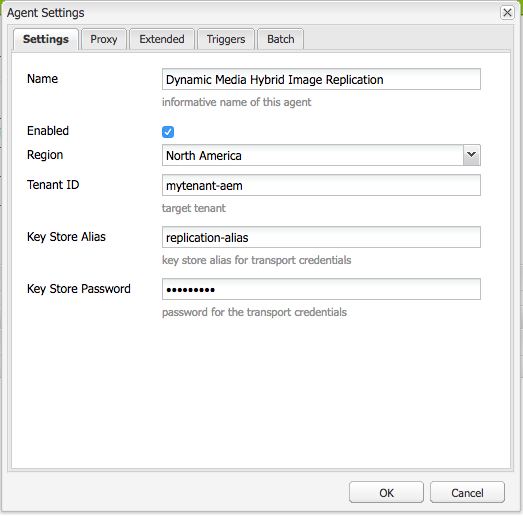

# Configuración de Dynamic Media - Modo híbrido{#configuring-dynamic-media-hybrid-mode}

Dynamic Media-Hybrid debe habilitarse y configurarse para su uso. Según el caso de uso, Dynamic Media tiene varias configuraciones [](#supported-dynamic-media-configurations)admitidas.

>[!NOTE]
>
>Si desea configurar y ejecutar Dynamic Media en el modo de ejecución de Scene7, consulte [Configuración de Dynamic Media - modo](/help/assets/config-dms7.md)Scene7.
>
>Si desea configurar y ejecutar Dynamic Media en modo de ejecución híbrido, siga las instrucciones de esta página.

Obtenga más información sobre el trabajo con [vídeo](/help/assets/video.md) en Dynamic Media.

>[!NOTE]
>
>Si utiliza la configuración de Adobe Experience Manager para diferentes entornos, como uno para desarrollo, uno para ensayo y otro para producción en directo, debe configurar los servicios de Dynamic Media Cloud para cada uno de esos entornos.

>[!NOTE]
>
>Si tiene problemas con la configuración de Dynamic Media, un lugar importante para ver son los archivos de registro específicos de Dynamic Media. Estos se instalan automáticamente al activar Dynamic Media:
>
>* `s7access.log`
>* `ImageServing.log`
>
>
Están documentados en [Supervisión y mantenimiento de su instancia](/help/sites-deploying/monitoring-and-maintaining.md)de AEM.

La publicación y entrega híbridas es una característica principal de la incorporación de Dynamic Media a Adobe Experience Manager. La publicación híbrida permite distribuir recursos de Dynamic Media, como imágenes, conjuntos y vídeos, desde la nube en lugar de desde los nodos de publicación de AEM.

Otros contenidos, como visores de Dynamic Media, páginas del sitio y contenido estático, se seguirán ofreciendo desde los nodos de publicación de AEM.

Si es cliente de Dynamic Media, debe utilizar la entrega híbrida como mecanismo de entrega para todo el contenido de Dynamic Media.

## Arquitectura de publicación híbrida para vídeos {#hybrid-publishing-architecture-for-videos}


## Arquitectura de publicación híbrida para imágenes {#hybrid-publishing-architecture-for-images}


## Configuraciones de Dynamic Media admitidas {#supported-dynamic-media-configurations}

Las tareas de configuración siguientes hacen referencia a los siguientes términos:

| **Term** | **Medios dinámicos habilitados** | **Descripción** |
|---|---|---|
| Nodo de creación de AEM | Marca de verificación blanca en círculo verde | El nodo de creación que implementa en On-Premise o a través de Managed Services. |
| Nodo de publicación de AEM | &quot;X&quot; blanca en un cuadrado rojo. | El nodo de publicación que implementa en On-Premise o a través de Managed Services. |
| Nodo de publicación de servicio de imágenes | Marca de verificación blanca en un círculo verde. | El nodo de publicación que se ejecuta en los centros de datos administrados por Adobe. Se refiere a la URL del servicio de imágenes. |

Puede optar por implementar Dynamic Media solo para imágenes, solo para vídeo o para imágenes y vídeos. Para determinar los pasos para configurar Dynamic Media para su escenario específico, consulte la siguiente tabla.

<table>
 <tbody>
  <tr>
   <td><strong>Escenario</strong></td>
   <td ><strong>Cómo funciona</strong></td>
   <td><strong>Pasos de configuración</strong></td>
  </tr>
  <tr>
   <td>Entregar SOLO imágenes en producción</td>
   <td>Las imágenes se entregan a través de los servidores de los centros de datos internacionales de Adobe y, a continuación, se almacenan en caché mediante una CDN para un rendimiento escalable y un alcance global.</td>
   <td>
    <ol>
     <li>En el nodo de <strong>creación</strong> de AEM, <a href="#enabling-dynamic-media">active Dynamic Media</a>.</li>
     <li>Configure las imágenes en <a href="#configuring-dynamic-media-cloud-services">Dynamic Media Cloud Services</a>.</li>
     <li><a href="#configuring-image-replication">Configure la replicación</a>de imágenes.</li>
     <li><a href="#replicating-catalog-settings">Replicar la configuración</a>del catálogo.</li>
     <li><a href="#replicating-viewer-presets">Replicar ajustes preestablecidos</a>de visor.</li>
     <li><a href="#using-default-asset-filters-for-replication">Utilice filtros de recursos predeterminados para la replicación</a>.</li>
     <li><a href="#configuring-dynamic-media-image-server-settings">Configuración de los ajustes</a>del servidor de imágenes de Dynamic Media.</li>
     <li><a href="#delivering-assets">Entregar recursos</a>.</li>
    </ol> </td>
  </tr>
  <tr>
   <td>Distribuya SÓLO imágenes en la preproducción (Dev, QE, Stage, etc.)</td>
   <td>Las imágenes se entregan a través del nodo de publicación de AEM. En este escenario, como el tráfico es mínimo, no es necesario entregar imágenes al centro de datos de Adobe. Una ventaja adicional es que esto permite una vista previa segura del contenido antes del inicio de la producción</td>
   <td>
    <ol>
     <li>En el nodo de <strong>creación</strong> de AEM, <a href="#enabling-dynamic-media">active Dynamic Media</a>.</li>
     <li>En el nodo de <strong>publicación</strong> de AEM, <a href="#enabling-dynamic-media">habilite Dynamic Media</a>.</li>
     <li><a href="#replicating-viewer-presets">Replicar ajustes preestablecidos</a>de visor.</li>
     <li>Configure el filtro <a href="#setting-up-asset-filters-for-imaging-in-non-production-deployments">de recursos para imágenes</a>que no sean de producción.</li>
     <li><a href="#configuring-dynamic-media-image-server-settings">Configure el servidor de imágenes de Dynamic Media.</a></li>
     <li><a href="#delivering-assets">Entregar recursos.</a></li>
    </ol> </td>
  </tr>
  <tr>
   <td>Distribuya SÓLO vídeo en cualquier entorno (producción, desarrollo, QE, etapa, etc.)</td>
   <td>Los vídeos son entregados y almacenados en caché por una CDN para un rendimiento escalable y un alcance global. La imagen del póster de vídeo (miniatura del vídeo que se muestra antes de que se inicie la reproducción) la proporcionará la instancia de publicación de AEM.</td>
   <td>
    <ol>
     <li>En el nodo de <strong>creación</strong> de AEM, <a href="#enabling-dynamic-media">active Dynamic Media</a>.</li>
     <li>En el nodo de <strong>publicación</strong> de AEM, <a href="#enabling-dynamic-media">active Dynamic Media</a> (la instancia de publicación sirve la imagen del póster de vídeo y proporciona metadatos para la reproducción de vídeo).</li>
     <li>Configuración de vídeo en los servicios de <a href="#configuring-dynamic-media-cloud-services">Dynamic Media Cloud.</a></li>
     <li><a href="#replicating-viewer-presets">Replicar ajustes preestablecidos</a>de visor.</li>
     <li>Configure el filtro <a href="#setting-up-asset-filters-for-video-only-deployments">de recursos solo</a>para vídeo.</li>
     <li><a href="#delivering-assets">Entregar recursos.</a></li>
    </ol> </td>
  </tr>
  <tr>
   <td>Entregar imágenes y vídeos en producción</td>
   <td><p>Los vídeos son entregados y almacenados en caché por una CDN para un rendimiento escalable y un alcance global. Las imágenes y las imágenes de póster de vídeo se entregan a través de los servidores de los centros de datos internacionales de Adobe y, a continuación, se almacenan en la caché mediante una CDN para obtener un rendimiento escalable y un alcance global.</p> <p>Consulte las secciones anteriores para configurar la imagen o el vídeo en la preproducción. </p> </td>
   <td>
    <ol>
     <li>En el nodo de <strong>creación</strong> de AEM, <a href="#enabling-dynamic-media">active Dynamic Media</a>.</li>
     <li>Configuración de vídeo en los servicios de <a href="#configuring-dynamic-media-cloud-services">Dynamic Media Cloud.</a></li>
     <li>Configure las imágenes en los servicios de <a href="#configuring-dynamic-media-cloud-services">Dynamic Media Cloud.</a></li>
     <li><a href="#configuring-image-replication">Configure la replicación</a>de imágenes.</li>
     <li><a href="#replicating-catalog-settings">Replicar la configuración</a>del catálogo.</li>
     <li><a href="#replicating-viewer-presets">Replicar ajustes preestablecidos</a>de visor.</li>
     <li><a href="#using-default-asset-filters-for-replication">Utilice filtros de recursos predeterminados para la replicación.</a></li>
     <li><a href="#configuring-dynamic-media-image-server-settings">Configure el servidor de imágenes de Dynamic Media.</a></li>
     <li><a href="#delivering-assets">Entregar recursos.</a></li>
    </ol> </td>
  </tr>
 </tbody>
</table>

## Activación de Dynamic Media {#enabling-dynamic-media}

[Los medios](https://www.adobe.com/solutions/web-experience-management/dynamic-media.html) dinámicos están deshabilitados de forma predeterminada. Para aprovechar las funciones de Dynamic Media, debe habilitar los medios dinámicos utilizando el modo de `dynamicmedia` ejecución como lo haría, por ejemplo, en el modo de `publish` ejecución. Antes de habilitar, asegúrese de revisar los requisitos [técnicos.](/help/sites-deploying/technical-requirements.md#dynamicmediaaddonprerequisites)

>[!NOTE]
>
>Al habilitar los medios dinámicos a través del modo de ejecución, se reemplaza la funcionalidad de AEM 6.1 y AEM 6.0, donde se activan los medios dinámicos al establecer el `dynamicMediaEnabled` indicador en **[!UICONTROL true]**. Este indicador no tiene funcionalidad en AEM 6.2 y posterior. Además, no es necesario reiniciar el inicio rápido para habilitar los medios dinámicos.

Al habilitar Medios dinámicos, las funciones de medios dinámicos estarán disponibles en la interfaz de usuario y cada recurso de imagen cargado recibirá una representación *cqdam.pyramid.tiff* que se utiliza para la entrega rápida de representaciones de imágenes dinámicas. Estos PTIFF tienen ventajas significativas, como (1) la capacidad de administrar una sola imagen principal y generar infinitas representaciones sobre la marcha sin ningún almacenamiento adicional y (2) la capacidad de utilizar visualizaciones interactivas como zoom, recorrido, giro, etc.

Si desea utilizar Dynamic Media Classic (Scene7) en AEM, no debe activar Dynamic Media a menos que utilice un escenario [](/help/sites-administering/scene7.md#aem-scene-integration-versus-dynamic-media)específico. Dynamic Media está desactivado a menos que habilite Dynamic Media mediante el modo de ejecución.

Para activar Dynamic Media, debe habilitar el modo de ejecución de Dynamic Media desde la línea de comandos o desde el nombre del archivo de inicio rápido.

**Para activar Dynamic Media**

1. En la línea de comandos, al iniciar el inicio rápido, haga lo siguiente:

   * Agregue `-r dynamicmedia` al final de la línea de comandos al iniciar el archivo jar.

   ```shell
   java -Xmx4096m -Doak.queryLimitInMemory=500000 -Doak.queryLimitReads=500000 -jar cq-quickstart-6.5.0.jar -r dynamicmedia
   ```

   Si está publicando en s7delivery, también debe incluir los siguientes argumentos trustStore:

   ```
   -Djavax.net.ssl.trustStore=<absoluteFilePath>/customerTrustStoreFileName>
   
    -Djavax.net.ssl.trustStorePassword=<passwordForTrustStoreFile>
   ```

1. Solicitar `https://localhost:4502/is/image` y asegurarse de que el servidor de imágenes se está ejecutando.

   >[!NOTE]
   >
   >Para solucionar problemas con Dynamic Media, consulte los siguientes registros en el `crx-quickstart/logs/` directorio:
   >
   >* ImageServer-&lt;PortId>-&lt;yyyy>&lt;mm>&lt;dd>.log: el registro de ImageServer proporciona estadísticas e información analítica utilizadas para analizar el comportamiento del proceso interno de ImageServer.
   Ejemplo de un nombre de archivo de registro de Image Server: `ImageServer-57346-2020-07-25.log`
   * s7access-&lt;aaaa>&lt;mm>&lt;dd>.log: el registro de acceso s7registra cada solicitud realizada a Dynamic Media a través `/is/image` y `/is/content`.
   Estos registros solo se utilizan cuando Dynamic Media está habilitado. No se incluyen en el paquete de **descarga completa** que se genera a partir de la `system/console/status-Bundlelist` página; al llamar a la asistencia al cliente si tiene un problema con Dynamic Media, anexe ambos registros al problema.

### Si ha instalado AEM en otro puerto o ruta de contexto... {#if-you-installed-aem-to-a-different-port-or-context-path}

Si va a implementar [AEM en un servidor](/help/sites-deploying/application-server-install.md) de aplicaciones y tiene Dynamic Media habilitado, debe configurar el dominio **propio** en el externalizador. De lo contrario, la generación de miniaturas de los recursos no funcionará correctamente en los recursos de medios dinámicos.

Además, si ejecuta el inicio rápido en un puerto o ruta de contexto diferente, también tiene que cambiar el dominio **propio** .

Cuando Dynamic Media está activado, las representaciones de miniaturas estáticas para los recursos de imagen se generan mediante Dynamic Media. Para que la generación de miniaturas funcione correctamente en los medios dinámicos, AEM debe realizar una solicitud de URL y conocer el número de puerto y la ruta de contexto.

En AEM:

* El dominio **propio** del [externalizador](/help/sites-developing/externalizer.md) se utiliza para recuperar el número de puerto y la ruta de contexto.
* Si no hay ningún dominio **propio** configurado, el número de puerto y la ruta de contexto se recuperan del servicio HTTP Jetty.

En una implementación de AEM QuickStart WAR, el número de puerto y la ruta de contexto no se pueden derivar, por lo que debe configurar un dominio **propio** . Consulte la documentación [de](/help/sites-developing/externalizer.md) externalizador sobre cómo configurar el dominio **propio** .

>[!NOTE]
En una implementación [independiente de](/help/sites-deploying/deploy.md)AEM Quickstart, generalmente no es necesario configurar un dominio **propio** porque el número de puerto y la ruta de contexto se pueden configurar automáticamente. Sin embargo, si todas las interfaces de red están desactivadas, debe configurar el dominio **propio** .

## Desactivación de Dynamic Media {#disabling-dynamic-media}

Los medios dinámicos no están activados de forma predeterminada. Sin embargo, si ha activado medios dinámicos anteriormente, puede que desee desactivarlos más adelante.

Para deshabilitar los medios dinámicos después de activarlos, debe quitar el indicador de modo `-r dynamicmedia` de ejecución.

**Para deshabilitar Dynamic Media después de habilitarlo**

1. En la línea de comandos, al iniciar el inicio rápido, puede realizar una de las siguientes acciones:

   * No agregue `-r dynamicmedia` a la línea de comandos al iniciar el archivo jar.

   ```shell
   java -Xmx4096m -Doak.queryLimitInMemory=500000 -Doak.queryLimitReads=500000 -jar cq-quickstart-6.5.0.jar
   ```

1. Solicitar `https://localhost:4502/is/image`. Recibirá un mensaje que indica que Dynamic Media está deshabilitado.

   >[!NOTE]
   Una vez deshabilitado el modo de ejecución de Dynamic Media, el paso del flujo de trabajo que genera la `cqdam.pyramid.tiff` representación se omite automáticamente. Esto también deshabilita la compatibilidad con representaciones dinámicas y otras funciones de Dynamic Media.
   Tenga en cuenta también que cuando el modo de ejecución de Dynamic Media está desactivado después de configurar el servidor AEM, todos los recursos cargados en ese modo de ejecución no son válidos.

## (Opcional) Migración de ajustes preestablecidos y configuraciones de Dynamic Media de 6.3 a 6.5 Zero Downtime {#optional-migrating-dynamic-media-presets-and-configurations-from-to-zero-downtime}

Si está actualizando AEM Dynamic Media de 6.3 a 6.5 (lo que ahora incluye la posibilidad de que no haya ningún tiempo de inactividad), debe ejecutar el siguiente comando curl para migrar todos los ajustes preestablecidos y configuraciones de `/etc` a `/conf` CRXDE Lite.

**Nota**: Si ejecuta la instancia de AEM en modo de compatibilidad (es decir, tiene instalada la compatibilidad), no es necesario ejecutar estos comandos.

Para todas las actualizaciones, con o sin el paquete de compatibilidad, puede copiar los ajustes preestablecidos de visor predeterminados y listos para usar que originalmente se incluían con Dynamic Media ejecutando el siguiente comando de control de Linux:

`curl -u admin:admin -X POST https://<server_address>:<server_port>/libs/settings/dam/dm/presets/viewer.pushviewerpresets.json`

Para migrar cualquier ajuste preestablecido de visor personalizado y configuración que haya creado de `/etc` a `/conf`, ejecute el siguiente comando de control de Linux:

`curl -u admin:admin -X POST https://<server_address>:<server_port>/libs/settings/dam/dm/presets.migratedmcontent.json`

## Configuración de la replicación de imágenes {#configuring-image-replication}

La entrega de imágenes de Dynamic Media funciona mediante la publicación de recursos de imagen, incluidas miniaturas de vídeo, desde AEM Author y su replicación al servicio de replicación bajo demanda de Adobe (la URL del servicio de replicación). A continuación, los recursos se entregan mediante el servicio de entrega de imágenes a petición (la URL del servicio de imágenes).

Debe hacer lo siguiente:

1. [Configure la autenticación](#setting-up-authentication).
1. [Configure el agente](#configuring-the-replication-agent)de replicación.

El Agente de replicación publica recursos de Dynamic Media como imágenes, metadatos de vídeo y conjuntos en el servicio de imágenes alojado por Adobe. El Agente de replicación no está habilitado de forma predeterminada.

Después de configurar el agente de replicación, debe [validar y probar que se ha configurado](#validating-the-replication-agent-for-dynamic-media)correctamente. En esta sección se describen estos procedimientos.

>[!NOTE]
El límite de memoria predeterminado para la creación de PTIFF es de 3 GB en todos los flujos de trabajo. Por ejemplo, puede procesar una imagen que requiera 3 GB de memoria mientras se pausan otros flujos de trabajo o puede procesar 10 imágenes en paralelo que requieran 300 MB de memoria cada una.
El límite de memoria es configurable y debe ajustarse a la disponibilidad de recursos del sistema y al tipo de contenido de imagen que se está procesando. Si tiene muchos recursos muy grandes y tiene suficiente memoria en el sistema, puede aumentar este límite para garantizar que las imágenes se procesen en paralelo.
Se rechazará una imagen que requiera más del límite máximo de memoria.
Para cambiar el límite de memoria para la creación de PTIFF, vaya a **[!UICONTROL Herramientas > Operaciones > Consola web > Adobe CQ Scene7 PTiffManager]** y cambie el valor de **[!UICONTROL maxMemory]** .

### Configuración de la autenticación {#setting-up-authentication}

Debe configurar la autenticación de replicación en el autor para replicar imágenes en el servicio de entrega de imágenes de Dynamic Media. Para ello, obtenga un KeyStore y luego guárdelo bajo el usuario de replicación **[!UICONTROL de medios]** dinámicos y configúrelo. El administrador de la empresa debería haber recibido un correo electrónico de bienvenida con el archivo KeyStore y las credenciales necesarias durante el proceso de aprovisionamiento. Si no recibió esto, póngase en contacto con el Servicio de atención al cliente.

**Para configurar la autenticación**

1. Póngase en contacto con el Servicio de atención al cliente para obtener el archivo y la contraseña de KeyStore si aún no lo tiene. Esto forma parte del aprovisionamiento y asociará las claves a su cuenta.
1. En AEM, toque el logotipo de AEM para acceder a la consola de navegación global y, a continuación, toque **[!UICONTROL Herramientas > Seguridad > Usuarios]**.
1. En la página Administración de usuarios, navegue hasta el usuario de replicación **[!UICONTROL de medios]** dinámicos y, a continuación, toque para abrir.

   

1. En la página Editar configuración de usuario para replicación de medios dinámicos, toque la ficha **[!UICONTROL Almacén]** de claves y, a continuación, haga clic en **[!UICONTROL Crear almacén de claves]**.

   

1. Introduzca una contraseña y confirme la contraseña en el cuadro de diálogo **[!UICONTROL Establecer contraseña]** de acceso a KeyStore.

   >[!NOTE]
   Recuerde la contraseña introducida. Tendrá que volver a introducirlo cuando configure el Agente de replicación más adelante.

   

1. En la página **[!UICONTROL Editar configuración de usuario para la replicación]** de medios dinámicos, expanda el área de archivo **KeyStore** Agregar clave privada y agregue lo siguiente (consulte las imágenes que se muestran a continuación):

   * En el campo **[!UICONTROL Nuevo alias]** , introduzca el nombre de un alias que utilizará posteriormente en la configuración de replicación; por ejemplo, `replication`.
   * Toque **[!UICONTROL KeyStore File]**. Vaya al archivo KeyStore que Adobe le ha proporcionado, selecciónelo y, a continuación, toque **[!UICONTROL Abrir]**.
   * En el campo Contraseña **[!UICONTROL del archivo]** KeyStore, introduzca la contraseña del archivo KeyStore. Esta **no es** la contraseña de KeyStore que creó en el paso 5, sino la contraseña del archivo KeyStore que Adobe proporciona en el correo electrónico de bienvenida que se le envió durante el aprovisionamiento. Póngase en contacto con el servicio de atención al cliente de Adobe si no ha recibido una contraseña para el archivo KeyStore.
   * En el campo Contraseña **[!UICONTROL de clave]** privada, introduzca la contraseña de clave privada (puede ser la misma contraseña de clave privada proporcionada en el paso anterior). Adobe proporciona la contraseña de clave privada en el correo electrónico de bienvenida que se le envía durante el aprovisionamiento. Póngase en contacto con el Servicio de atención al cliente de Adobe si no ha recibido una contraseña de clave privada.
   * En el campo Alias **[!UICONTROL de clave]** privada, introduzca el alias de clave privada. Por ejemplo, `*companyname*-alias`. Adobe proporciona el alias de clave privada en el correo electrónico de bienvenida que se le envía durante el aprovisionamiento. Póngase en contacto con el Servicio de atención al cliente de Adobe si no ha recibido un alias de clave privada.
   

1. Toque **[!UICONTROL Guardar y cerrar]** para guardar los cambios realizados en este usuario.

   A continuación, debe [configurar el agente de replicación.](#configuring-the-replication-agent)

### Configuración del Agente de replicación {#configuring-the-replication-agent}

1. En AEM, toque el logotipo de AEM para acceder a la consola de navegación global y, a continuación, toque **[!UICONTROL Herramientas > Implementación > Replicación > Agentes en el autor]**.
1. En la página Agentes del autor, toque Replicación de imágenes híbridas de Dynamic Media (s7delivery) ****.
1. Toque **[!UICONTROL Editar]**.
1. Toque la ficha **[!UICONTROL Configuración]** y, a continuación, introduzca lo siguiente:

   * **[!UICONTROL Habilitado]** : seleccione esta casilla de verificación para habilitar el agente de replicación.
   * **[!UICONTROL Región]** : se establece en la región adecuada: Norteamérica, Europa o Asia
   * **[!UICONTROL ID]** del inquilino: este valor es el nombre de su empresa o inquilino que está publicando en el servicio de replicación. Este valor es el ID del inquilino que Adobe proporciona en el correo electrónico de bienvenida que se le envía durante el aprovisionamiento. Póngase en contacto con el Servicio de atención al cliente de Adobe si no ha recibido este mensaje.
   * **[!UICONTROL Alias]** de almacén de claves: Este valor es el mismo que el valor** de nuevo alias** establecido al generar la clave en la [configuración de la autenticación](#setting-up-authentication); por ejemplo, `replication`. (Consulte el paso 7 en [Configuración de la autenticación](#setting-up-authentication)).
   * **[!UICONTROL Contraseña]** del almacén de claves: es la contraseña de KeyStore que se creó al tocar **[!UICONTROL Crear KeyStore]**. Adobe no proporciona esta contraseña. Consulte el paso 5 de [Configuración de la autenticación](#setting-up-authentication).
   La siguiente imagen muestra el agente de replicación con datos de ejemplo:

   

1. Toque **[!UICONTROL Aceptar]**.

### Validación del Agente de replicación para Dynamic Media {#validating-the-replication-agent-for-dynamic-media}

Para validar el agente de replicación para medios dinámicos, haga lo siguiente:

Toque **[!UICONTROL Probar conexión]**. El resultado de ejemplo es el siguiente:

```shell
11.03.2016 10:57:55 - Transferring content for ReplicationAction{type=TEST, path[0]='/content/dam', time=1457722675402, userId='admin', revision='null'}
11.03.2016 10:57:55 - * Auth User: replication-receiver
11.03.2016 10:57:55 - * HTTP Version: 1.1
11.03.2016 10:57:55 - * Using OAuth 2.0 Authorization Grants
11.03.2016 10:57:55 - * OAuth 2.0 User: dynamic-media-replication
11.03.2016 10:57:55 - * OAuth 2.0 Token: '*****' initialized
11.03.2016 10:57:55 - Publishing: POST[https://replicate-na.assetsadobe.com:8580/is-publish/publish-receiver?Cmd=Test&RootId=xfpuu-6613]
11.03.2016 10:57:55 - Publish response: OK[]
11.03.2016 10:57:55 - Transfer succeeded in 141 ms for ReplicationAction{type=TEST, path[0]='/content/dam', time=1457722675402, userId='admin', revision='null'}
-------------------------------------------------------------------------------------------------------------------------------
Replication test succeeded
```

>[!NOTE]
También puede realizar una de las siguientes comprobaciones:
* Compruebe los registros de replicación para asegurarse de que el recurso se replica.
* Publique una imagen. Toque la imagen y seleccione **[!UICONTROL Visores]** en el menú desplegable. A continuación, seleccione un ajuste preestablecido de visor, haga clic en URL y copie o pegue la URL en el navegador para comprobar que puede ver la imagen.


### Resolución de problemas de autenticación {#troubleshooting-authentication}

A la hora de configurar la autenticación, se presentan algunos problemas con sus soluciones. Antes de comprobarlos, asegúrese de haber configurado la replicación.

#### Problema: Código de estado HTTP 401 con mensaje: se requiere autorización {#problem-http-status-code-with-message-authorization-required}

Este problema puede deberse a un error al configurar KeyStore para `dynamic-media-replication` el usuario.

```shell
Replication test to s7delivery:https://s7bern.macromedia.com:8580/is-publish/
17.06.2016 18:54:43 - Transferring content for ReplicationAction{type=TEST, path[0]='/content/dam', time=1466214883309, userId='admin', revision='null'}
17.06.2016 18:54:43 - * Auth User: replication-receiver
17.06.2016 18:54:43 - * HTTP Version: 1.1
17.06.2016 18:54:43 - * Using OAuth 2.0 Authorization Grants
17.06.2016 18:54:43 - * OAuth 2.0 User: dynamic-media-replication
17.06.2016 18:54:43 - No OAuth token available. OAuth not initialized
17.06.2016 18:54:43 - * Using Client Auth SSL alias - replication-alias *
17.06.2016 18:54:43 - Publishing: POST[https://<localhost>:8580/is-publish//publish-receiver?Cmd=Test&RootId=brough]
17.06.2016 18:54:43 - Transfer failed for ReplicationAction{type=TEST, path[0]='/content/dam', time=1466214883309, userId='admin', revision='null'}. java.io.IOException: Failed to execute request
'https://<localhost>:8580/is-publish//publish-receiver?Cmd=Test&RootId=brough':
 Server returned status code 401 with message: Authorization required.
17.06.2016 18:54:43 - Error while replicating: com.day.cq.replication.ReplicationException: Transfer failed for ReplicationAction{type=TEST, path[0]='/content/dam', time=1466214883309,
 userId='admin', revision='null'}. java.io.IOException: Failed to execute request
'https://<localhost>:8580/is-publish//publish-receiver?Cmd=Test&RootId=brough':
 Server returned status code 401 with message: Authorization required.
```

**Solución**: Compruebe que el `KeyStore` archivo está guardado en el usuario de replicación **de medios** dinámicos y que se le ha proporcionado la contraseña correcta.

#### Problema: No Se Pudo Descifrar La Clave: No Se Pudieron Descifrar Los Datos {#problem-could-not-decrypt-key-could-not-decrypt-data}

```xml
Replication test to s7delivery:https://<localhost>:8580/is-publish/
17.06.2016 19:00:16 - Transferring content for ReplicationAction{type=TEST, path[0]='/content/dam', time=1466215216662, userId='admin', revision='null'}
17.06.2016 19:00:16 - * Auth User: replication-receiver
17.06.2016 19:00:16 - * HTTP Version: 1.1
17.06.2016 19:00:16 - * Using OAuth 2.0 Authorization Grants
17.06.2016 19:00:16 - * OAuth 2.0 User: dynamic-media-replication
17.06.2016 19:00:16 - No OAuth token available. OAuth not initialized
17.06.2016 19:00:16 - * Using Client Auth SSL alias - replication-alias *
17.06.2016 19:00:16 - Transfer failed for ReplicationAction{type=TEST, path[0]='/content/dam', time=1466215216662, userId='admin', revision='null'}. java.lang.SecurityException: java.security.UnrecoverableKeyException: Could not decrypt key: Could not decrypt data.
```

**Solución**: Compruebe la contraseña. La contraseña guardada en el agente de replicación no es la misma que se utilizó para crear el almacén de claves.

#### Problema: InvalidAlgorithmParameterException {#problem-invalidalgorithmparameterexception}

Este problema se debe a un error de configuración en la instancia de AEM Author. El proceso de Java del autor no está obteniendo lo correcto `javax.net.ssl.trustStore`. Puede ver este error en el registro de replicación:

```shell
14.04.2016 09:37:43 - Transfer failed for ReplicationAction{type=TEST, path[0]='/content/dam', time=1460651862089, userId='admin', revision='null'}. java.io.IOException: Failed to execute request 'https://<localhost>:8580/is-publish/publish-receiver?Cmd=Test&RootId=rbrough-osx2': java.lang.RuntimeException: Unexpected error: java.security.InvalidAlgorithmParameterException: the trustAnchors parameter must be non-empty
14.04.2016 09:37:43 - Error while replicating: com.day.cq.replication.ReplicationException: Transfer failed for ReplicationAction{type=TEST, path[0]='/content/dam', time=1460651862089, userId='admin', revision='null'}. java.io.IOException: Failed to execute request 'https://<localhost>:8580/is-publish/publish-receiver?Cmd=Test&RootId=rbrough-osx2': java.lang.RuntimeException: Unexpected error: java.security.InvalidAlgorithmParameterException: the trustAnchors parameter must be non-empty
```

O el registro de errores:

```shell
07.25.2019 12:00:59.893 *ERROR* [sling-threadpool-db2763bb-bc50-4bb5-bb64-10a09f432712-(apache-sling-job-thread-pool)-90-com_day_cq_replication_job_s7delivery(com/day/cq/replication/job/s7delivery)] com.day.cq.replication.Agent.s7delivery.queue Error during processing of replication.

java.io.IOException: Failed to execute request 'https://replicate-na.assetsadobe.com:8580/is-publish/publish-receiver?Cmd=Test&RootId=rbrough-osx': java.lang.RuntimeException: Unexpected error: java.security.InvalidAlgorithmParameterException: the trustAnchors parameter must be non-empty
        at com.scene7.is.catalog.service.publish.atomic.PublishingServiceHttp.executePost(PublishingServiceHttp.scala:195)
```

**Solución**: Asegúrese de que el proceso de Java de AEM Author tiene la propiedad del sistema `-Djavax.net.ssl.trustStore=` establecida en un almacén de confianza válido.

#### Problema: KeyStore no está configurado o no está inicializado {#problem-keystore-is-either-not-set-up-or-it-is-not-initialized}

Este problema puede deberse a una corrección urgente o a que un paquete de funciones sobrescriba el nodo del almacén de claves o el usuario de Dynamic Media.

Ejemplo de registro de replicación:

```shell
Replication test to s7delivery:https://replicate-na.assetsadobe.com/is-publish
02.08.2016 14:37:44 - Transferring content for ReplicationAction{type=TEST, path[0]='/content/dam', time=1470173864834, userId='admin', revision='null'}
02.08.2016 14:37:44 - * Auth User: replication-receiver
02.08.2016 14:37:44 - * HTTP Version: 1.1
02.08.2016 14:37:44 - * Using OAuth 2.0 Authorization Grants
02.08.2016 14:37:44 - * OAuth 2.0 User: dynamic-media-replication
02.08.2016 14:37:44 - Transfer failed for ReplicationAction{type=TEST, path[0]='/content/dam', time=1470173864834, userId='admin', revision='null'}. com.adobe.granite.keystore.KeyStoreNotInitialisedException: Uninitialised key store for user dynamic-media-replication
```

**Solución**:

1. Vaya a la página Administración de usuarios:
   `localhost:4502/libs/granite/security/content/useradmin.html`
1. En la página Administración de usuarios, desplácese hasta el `dynamic-media-replication` usuario y toque para abrirlo.
1. Click the **[!UICONTROL KeyStore]** tab. Si aparece el botón **[!UICONTROL Crear almacén]** de claves, debe rehacer los pasos que se encuentran en [Configuración de la autenticación](#setting-up-authentication) anteriormente.
1. Si tuvo que rehacer la configuración de KeyStore, es posible que también necesite [Configurar el Agente](/help/assets/config-dynamic.md#configuring-the-replication-agent) de replicación.

   Vuelva a configurar el Agente de replicación de s7delivery.
   `localhost:4502/etc/replication/agents.author/s7delivery.html`

1. Toque **[!UICONTROL Probar conexión]** para comprobar que la configuración es válida.

#### Problema: El agente de publicación utiliza SSL en lugar de OAuth {#problem-publish-agent-is-using-ssl-instead-of-oauth}

Este problema puede deberse a una corrección urgente o a un paquete de funciones que no se instaló correctamente o que sobrescribió la configuración.

Ejemplo de registro de replicación:

```shell
01.08.2016 18:42:59 - Transferring content for ReplicationAction{type=TEST, path[0]='/content/dam', time=1470073379634, userId='admin', revision='null'}
01.08.2016 18:42:59 - * Auth User: replication-receiver
01.08.2016 18:42:59 - * HTTP Version: 1.1
01.08.2016 18:42:59 - * Using Client Auth SSL alias - replication-receiver *
01.08.2016 18:42:59 - Publishing: POST[https://replicate-eu.assetsadobe2.com:443/is-publish/publish-receiver?Cmd=Test&RootId=altayerstaging]
01.08.2016 18:42:59 - Transfer failed for ReplicationAction{type=TEST, path[0]='/content/dam', time=1470073379634, userId='admin', revision='null'}. java.io.IOException: Failed to execute request 'https://replicate-eu.assetsadobe2.com:443/is-publish/publish-receiver?Cmd=Test&RootId=rbroughstaging': Server returned status code 401 with message: Authorization required.
01.08.2016 18:42:59 - Error while replicating: com.day.cq.replication.ReplicationException: Transfer failed for ReplicationAction{type=TEST, path[0]='/content/dam', time=1470073379634, userId='admin', revision='null'}. java.io.IOException: Failed to execute request 'https://replicate-eu.assetsadobe2.com:443/is-publish/publish-receiver?Cmd=Test&RootId=rbroughstaging': Server returned status code 401 with message: Authorization required.
```

**Solución:**

1. En AEM, haga clic en **[!UICONTROL Herramientas > General > CRXDE Lite]**.

   `localhost:4502/crx/de/index.jsp`

1. Vaya al nodo del Agente de replicación de s7delivery.
   `localhost:4502/crx/de/index.jsp#/etc/replication/agents.author/s7delivery/jcr:content`

1. Agregue esta configuración al agente de replicación (booleano con el valor establecido en **[!UICONTROL True]**):

   `enableOauth=true`

1. Cerca de la esquina superior izquierda de la página, toque **[!UICONTROL Guardar todo]**.

### Prueba de la configuración {#testing-your-configuration}

Adobe recomienda realizar una prueba completa de la configuración.

Asegúrese de que ya ha hecho lo siguiente antes de comenzar esta prueba:

* Se agregaron ajustes preestablecidos de imagen.
* Configure la Configuración de medios **[!UICONTROL dinámicos (anterior a 6.3)]** en Cloud Services. Se requiere la dirección URL del servicio de imágenes para esta prueba

**Para probar la configuración**

1. Cargue un recurso de imagen. (En Recursos, toque **[!UICONTROL Crear > Archivos]** y seleccione el archivo).
1. Espere a que finalice el flujo de trabajo.
1. Publique el recurso de imagen. (Seleccione el recurso y toque **[!UICONTROL Publicación]** rápida).
1. Vaya a las representaciones de esa imagen abriendo la imagen y tocando **[!UICONTROL Representaciones]**.

   

1. Seleccione cualquier representación dinámica.
1. Haga clic en **[!UICONTROL URL]** para obtener la URL de este recurso.
1. Vaya a la dirección URL seleccionada y compruebe si la imagen se comporta como se espera.

Otra forma de comprobar que los recursos se han entregado es adjuntar req=exists a la dirección URL.

## Configuring Dynamic Media Cloud Services {#configuring-dynamic-media-cloud-services}

El servicio de Dynamic Media Cloud ofrece compatibilidad con servicios en la nube, como la publicación híbrida y la entrega de imágenes y vídeos, análisis de vídeo y codificación de vídeo, entre otras cosas.

Como parte de la configuración, debe introducir un ID de registro, una URL de servicio de vídeo, una URL de servicio de imágenes, una URL de servicio de replicación y configurar la autenticación. Debería haber recibido toda esta información como parte del proceso de aprovisionamiento de cuentas. Si no ha recibido esta información, póngase en contacto con el administrador de Adobe Experience Manager o con el servicio de asistencia técnica de Adobe para obtener la información.

>[!NOTE]
Antes de configurar los servicios de Dynamic Media Cloud, asegúrese de configurar la instancia de publicación. También debe tener la replicación configurada antes de configurar los servicios de Dynamic Media Cloud.

Para configurar los servicios de nube de medios dinámicos:

1. En AEM, toque el logotipo de AEM para acceder a la consola de navegación global y toque **[!UICONTROL Herramientas > Servicios de nube > Configuración de Dynamic Media (anterior a 6.3)]**.
1. En la página Explorador de configuración de Dynamic Media, en el panel izquierdo, seleccione **[!UICONTROL global]** y, a continuación, toque **[!UICONTROL Crear]**.
1. En el cuadro de diálogo **[!UICONTROL Crear configuración]** de Dynamic Media, en el campo Título, escriba un título.
1. Si está configurando Dynamic Media para vídeo,

   * En el campo ID **[!UICONTROL de registro]** , escriba su ID de registro.
   * En el campo URL **[!UICONTROL del servicio de ]**vídeo, introduzca la URL del servicio de vídeo para Dynamic Media Gateway.

1. Si está configurando Dynamic Media para imágenes, en el campo URL **[!UICONTROL del servicio de]** imágenes, introduzca la URL del servicio de imágenes para Dynamic Media Gateway.
1. Toque **[!UICONTROL Guardar]** para volver a la página del explorador de configuración de Dynamic Media.
1. Toque el logotipo de AEM para acceder a la consola de navegación global.

## Configuración de informes de vídeo {#configuring-video-reporting}

Puede configurar informes de vídeo en varias instalaciones de AEM mediante Dynamic Media Hybrid.

**** Cuándo usar: Al configurar la Configuración de Dynamic Media (anterior a la versión 6.3), se inician numerosas funciones, como los informes de vídeo. La configuración crea un grupo de informes en una empresa regional de Analytics. Si configura varios nodos Autor, creará un grupo de informes independiente para cada uno. Como resultado, los datos de informes son incoherentes entre las instalaciones. Además, si cada nodo Autor hace referencia al mismo servidor de publicación híbrido, la última instalación de Autor cambia el grupo de informes de destino para todos los informes de vídeo. Este problema sobrecarga el sistema de Analytics con demasiados grupos de informes.

**** Introducción: Configure los informes de vídeo completando las tres tareas siguientes.

1. Cree un paquete de ajustes preestablecidos de Video Analytics después de configurar la configuración de Dynamic Media (anterior a la versión 6.3) en el primer nodo Autor. Esta tarea inicial es importante porque permite que una nueva configuración continúe utilizando el mismo grupo de informes.
1. Instale el paquete de ajustes preestablecidos de Video Analytics en cualquier ***nuevo*** nodo Autor ***antes*** de configurar la Configuración de Dynamic Media (anterior a 6.3).
1. Compruebe y depure la instalación del paquete.

### Creación de un paquete de ajustes preestablecidos de análisis de vídeo después de configurar el primer nodo Autor {#creating-a-video-analytics-preset-package-after-configuring-the-first-author-node}

Una vez finalizada esta tarea, tendrá un archivo de paquete que contiene los ajustes preestablecidos de Video Analytics. Estos ajustes preestablecidos contienen un grupo de informes, el servidor de seguimiento, el espacio de nombres de seguimiento y el ID de organización de Marketing Cloud, si están disponibles.

1. Si aún no lo ha hecho, configure la Configuración de Dynamic Media (anterior a 6.3).
1. (Opcional) Vea y copie la ID del grupo de informes (debe tener acceso al JCR). Aunque no se requiere la ID del grupo de informes, la validación es más sencilla.
1. Cree un paquete mediante el Administrador de paquetes.
1. Edite el paquete para incluir un filtro.

   En AEM: `/conf/global/settings/dam/dm/presets/analytics/jcr:content/userdata`

1. Cree el paquete.
1. Descargue o comparta el paquete de ajustes preestablecidos de Video Analytics para que se pueda compartir con los nuevos nodos de creación subsiguientes.

### Instalación del paquete de ajustes preestablecidos de Video Analytics antes de configurar nodos de creación adicionales {#installing-the-video-analytics-preset-package-before-you-configure-additional-author-nodes}

Asegúrese de completar esta tarea ***antes*** de configurar la Configuración de Dynamic Media (anterior a 6.3). Si no lo hace, se crea otro grupo de informes no utilizado. Además, aunque los informes de vídeo seguirán funcionando correctamente, la recopilación de datos no está optimizada.

Asegúrese de que el paquete de ajustes preestablecidos de Video Analytics del primer nodo Autor esté accesible en el nuevo nodo Autor.

1. Cargue el paquete de ajustes preestablecidos de Video Analytics que creó anteriormente en el Administrador de paquetes.
1. Instale el paquete de ajustes preestablecidos de Video Analytics.
1. Configuración de Dynamic Media (anterior a 6.3).

### Verificación y depuración de la instalación del paquete {#verifying-and-debugging-the-package-installation}

1. Realice una de las siguientes acciones para verificar y, si es necesario, depurar la instalación del paquete:

   * **Compruebe el ajuste preestablecido de Video Analytics mediante el JCR** Para comprobar el ajuste preestablecido de Video Analytics mediante el JCR, debe tener acceso a CRXDE Lite.

      AEM: en CRXDE Lite, vaya a `/conf/global/settings/
dam/dm/presets/analytics/jcr:content/userdata`

      Esto es `https://localhost:4502/crx/de/index.jsp#/conf/global/settings/dam/dm/presets/analytics/jcr%3Acontent/userdata`

      Si no tiene acceso a CRXDE Lite en el nodo Autor, puede comprobar el ajuste preestablecido a través del servidor de publicación.

   * **Compruebe el ajuste preestablecido de Video Analytics a través del servidor de imágenes**

      Puede validar el ajuste preestablecido de Video Analytics directamente realizando una solicitud req=userdata del servidor de imágenes.
Por ejemplo, para ver el ajuste preestablecido de Analytics en el nodo Autor, puede realizar la siguiente solicitud:

      `https://localhost:4502/is/image/conf/global/settings/dam/dm/presets/analytics?req=userdata`

      Para validar el ajuste preestablecido en servidores de publicación, puede realizar una solicitud directa similar en el servidor de publicación. Las respuestas son las mismas en los nodos Autor y Publicación. La respuesta es similar a la siguiente:**

      ```
      marketingCloudOrgId=0FC4E86B573F99CC7F000101
       reportSuite=aemaem6397618-2018-05-23
       trackingNamespace=aemvideodal
       trackingServer=aemvideodal.d2.sc.omtrdc.net
      ```

   * **Compruebe el ajuste preestablecido de Video Analytics mediante la herramienta Informes de vídeo en** Herramientas de toque de AEM **[!UICONTROL > Recursos > Informes de vídeo]**

      `https://localhost:4502/mnt/overlay/dam/gui/content/s7dam/videoreports/videoreport.html`

      Si ve el siguiente mensaje de error, el grupo de informes está disponible, pero sin rellenar. Este error es correcto (y deseado) en una nueva instalación antes de que el sistema recopile datos.
   

   Para generar datos de informes, cargue y publique un vídeo. Utilice **[!UICONTROL Copiar URL]** y ejecute el vídeo al menos una vez.

   Tenga en cuenta que los datos de informes pueden tardar hasta 12 horas en completarse a partir del uso del visor de vídeos.

   Si hay un error y el grupo de informes no está configurado correctamente, se muestra la siguiente alerta.

   

   Este error también se muestra si los informes de vídeo se ejecutan antes de configurar los servicios de configuración de Dynamic Media (anteriores a la versión 6.3).

### Solución de problemas con la configuración de informes de vídeo {#troubleshooting-the-video-reporting-configuration}

* Durante la instalación, a veces se agota el tiempo de espera de las conexiones al servidor de la API de Analytics. La instalación reintenta la conexión 20 veces, pero sigue fallando. Cuando se produce esta situación, el archivo de registro registra varios errores. Buscar `SiteCatalystReportService`.
* Si no instala primero el paquete de ajustes preestablecidos de Analytics, puede crear un nuevo grupo de informes.
* Al actualizar AEM 6.3 a AEM 6.4 o AEM 6.4.1 y, a continuación, configurar la Configuración de Dynamic Media (anterior a 6.3), se sigue creando un grupo de informes. Se sabe que este problema se ha solucionado en AEM 6.4.2.

### Acerca del ajuste preestablecido de Video Analytics {#about-the-video-analytics-preset}

El ajuste preestablecido de Video Analytics (a veces conocido simplemente como ajuste preestablecido de análisis) se almacena junto a los ajustes preestablecidos de visor en Dynamic Media. Es básicamente lo mismo que un ajuste preestablecido de visor, pero con información utilizada para configurar los informes de AppMeasurement y Video Heartbeat.

Las propiedades del ajuste preestablecido son las siguientes:

* `reportSuite`
* `trackingServer`
* `trackingNamespace`
* `marketingCloudOrgId` (no está presente en versiones anteriores de AEM)

AEM 6.4 y versiones posteriores guardan este ajuste preestablecido en `/conf/global/settings/dam/dm/presets/analytics/jcr:content/userdata`

## Replicar la configuración del catálogo {#replicating-catalog-settings}

Debe publicar su propia configuración de catálogo predeterminada como parte del proceso de configuración mediante el JCR. Para replicar la configuración del catálogo:

1. En una ventana Terminal, ejecute lo siguiente:

   `curl -u admin:admin localhost:4502/libs/settings/dam/dm/presets/viewer.pushviewerpresets`

1. En AEM, navegue a la siguiente ubicación en CRXDE Lite (requiere privilegios de administrador):

   `https://<*server*>:<*port*>/crx/de/index.jsp#/conf/global/settings/dam/dm/imageserver/`

1. Puntee en la ficha **[!UICONTROL Replicación]** .
1. Toque **[!UICONTROL Replicar]**.

## Replicar ajustes preestablecidos de visor {#replicating-viewer-presets}

Para distribuir *un recurso con un ajuste preestablecido de visor, debe replicar/publicar* el ajuste preestablecido de visor. (Todos los ajustes preestablecidos de visor deben activarse ** y replicarse para obtener la URL o el código incrustado de un recurso.)
Consulte Ajustes preestablecidos [de visor de](/help/assets/managing-viewer-presets.md#publishing-viewer-presets) publicación para obtener más información.

>[!NOTE]
De forma predeterminada, el sistema muestra una serie de representaciones al seleccionar **[!UICONTROL Representaciones]** y una variedad de ajustes preestablecidos de visor al seleccionar **[!UICONTROL Visores]** en la vista de detalles del recurso. Puede aumentar o disminuir el número visto. Consulte [Aumento del número de ajustes preestablecidos de imagen que muestran](/help/assets/managing-image-presets.md#increasingthenumberofimagepresetsthatdisplay) o [Aumento del número de ajustes preestablecidos de visor que se muestran](/help/assets/managing-viewer-presets.md#increasing-the-number-of-viewer-presets-that-display).

## Filtrado de Recursos para Replicación {#filtering-assets-for-replication}

En implementaciones de medios no dinámicos, puede replicar *todos* los recursos (imágenes y vídeo) del entorno de creación de AEM en el nodo de publicación de AEM. Este flujo de trabajo es necesario porque los servidores de publicación de AEM también envían los recursos.

Sin embargo, en las implementaciones de Dynamic Media, dado que los recursos se entregan a través de la nube, no es necesario replicarlos en los nodos de publicación de AEM. Este flujo de trabajo de &quot;publicación híbrida&quot; evita costos de almacenamiento adicionales y tiempos de procesamiento más largos para replicar recursos. Otros contenidos, como los visores de Dynamic Media, las páginas del sitio y el contenido estático, se siguen ofreciendo desde los nodos de publicación de AEM.

Además de replicar los recursos, también se replican los siguientes no activos:

* Configuración de envío de Dynamic Media: `/conf/global/settings/dam/dm/imageserver/jcr:content`
* Ajustes preestablecidos de imagen: `/conf/global/settings/dam/dm/presets/macros`
* Ajustes preestablecidos de visor: `/conf/global/settings/dam/dm/presets/viewer`

Los filtros permiten *excluir* recursos de la replicación en el nodo de publicación de AEM.

### Uso de filtros de recursos predeterminados para replicación {#using-default-asset-filters-for-replication}

Si utiliza Dynamic Media para (1) imágenes en producción **o** (2) imágenes y vídeo, puede utilizar los filtros predeterminados que se proporcionan tal cual. Los siguientes filtros están activos de forma predeterminada:

<table>
 <tbody>
  <tr>
   <td> </td>
   <td><strong>Filtro</strong></td>
   <td><strong>Tipo MIME</strong></td>
   <td><strong>Representaciones</strong></td>
  </tr>
  <tr>
   <td>Distribución de imágenes de Dynamic Media</td>
   <td><p>filter-images</p> <p>filter-sets</p> <p> </p> </td>
   <td><p>Comienza con <strong>image/</strong></p> <p>Contiene <strong>la aplicación/</strong> y termina con <strong>set</strong>.</p> </td>
   <td>Las "imágenes de filtro" integradas (se aplican a recursos de imágenes únicas, incluidas imágenes interactivas) y "conjuntos de filtros" (se aplican a conjuntos de giros, conjuntos de imágenes, conjuntos de medios mixtos y conjuntos de carrusel):
    <ul>
     <li>Incluir imágenes y metadatos PTIFF para la replicación (cualquier representación que comience con <strong>cqdam</strong>).</li>
     <li>Excluya de la replicación la imagen original y las representaciones de imágenes estáticas.</li>
    </ul> </td>
  </tr>
  <tr>
   <td>Entrega de vídeo de Dynamic Media</td>
   <td>filter-video</td>
   <td>Comienza con <strong>video/</strong></td>
   <td>El "video-filtro" incorporado:
    <ul>
     <li>Incluya representaciones de vídeo proxy, miniaturas de vídeo/imagen de póster, metadatos (tanto en las representaciones de vídeo principales como en las representaciones de vídeo) para la replicación (cualquier representación que comience con <strong>cqdam</strong>).</li>
     <li>Excluya de la replicación el vídeo original y las representaciones de miniaturas estáticas.<br /><br /> <strong> Nota: </strong>Nota: Las representaciones de vídeo proxy no contienen binarios, sino que son solo propiedades de nodo. Por lo tanto, no hay impacto en el tamaño del repositorio del editor.</li>
    </ul> </td>
  </tr>
  <tr>
   <td>Integración de Dynamic Media Classic (Scene7)</td>
   <td><p>filter-images</p> <p>filter-sets</p> <p>filter-video</p> </td>
   <td><p>Comienza con <strong>image/</strong></p> <p>Contiene <strong>la aplicación/</strong> y termina con <strong>set</strong>.</p> <p>Comienza con <strong>video/</strong></p> </td>
   <td><p>Configure el URI de transporte para que señale a su servidor de publicación de AEM en lugar de la URL del servicio de replicación de Adobe Dynamic Media Cloud. La configuración de este filtro permitirá a Dynamic Media Classic entregar recursos en lugar de la instancia de publicación de AEM.</p> <p>Las "imágenes de filtro" integradas, "conjuntos de filtros" y "video-filtro" incorporadas:</p>
    <ul>
     <li>Incluya imágenes PTIFF, representaciones de vídeo proxy y metadatos para la replicación. Sin embargo, como no existen en el JCR para los que ejecutan AEM (integración de Dynamic Media Classic), no hace nada de forma efectiva.</li>
     <li>Excluya de la replicación la imagen original, las representaciones de imágenes estáticas, el vídeo original y las representaciones de miniaturas estáticas. En su lugar, Dynamic Media Classic distribuirá recursos de imagen y vídeo.</li>
    </ul> </td>
  </tr>
 </tbody>
</table>

>[!NOTE]
Los filtros se aplican a tipos de MIME y no pueden ser específicos de la ruta.

### Configuración de filtros de recursos para implementaciones de solo vídeo {#setting-up-asset-filters-for-video-only-deployments}

Si utiliza Dynamic Media solo para vídeo, siga estos pasos para configurar los filtros de recursos para la replicación:

1. En AEM, toque el logotipo de AEM para acceder a la consola de navegación global y toque **[!UICONTROL Herramientas > Implementación > Replicación > Agentes en el autor]**.
1. En la página Agentes de creación, toque Agente **[!UICONTROL predeterminado (publicación)]**.
1. Toque **[!UICONTROL Editar]**.
1. En el cuadro de diálogo Configuración **[!UICONTROL del]** agente, en la ficha **[!UICONTROL Configuración]** , marque **[!UICONTROL Habilitado]** para activar el agente.
1. Toque **[!UICONTROL Aceptar]**.
1. En AEM, toque **[!UICONTROL Herramientas > General > CRXDE Lite]**.
1. En el árbol de carpetas izquierdo, vaya a `/etc/replication/agents.author/dynamic_media_replication/jcr:content/damRenditionFilters`
1. Busque **[!UICONTROL filter-video]**, haga clic con el botón derecho y seleccione **[!UICONTROL Copiar]**.
1. En el árbol de carpetas izquierdo, vaya a `/etc/replication/agents.author/publish`
1. Localice **[!UICONTROL jcr:content]**, haga clic con el botón derecho y seleccione **[!UICONTROL Pegar]**.

Esto configura la instancia de publicación de AEM para que proporcione la imagen del póster de vídeo, así como los metadatos de vídeo necesarios para la reproducción, mientras que el propio vídeo lo entrega el servicio de nube de Dynamic Media. El filtro también excluirá de la replicación el vídeo original y las representaciones de miniaturas estáticas, que no son necesarias en la instancia de publicación.

### Configuración de filtros de recursos para imágenes en implementaciones que no son de producción {#setting-up-asset-filters-for-imaging-in-non-production-deployments}

Si utiliza Dynamic Media para la creación de imágenes en implementaciones que no son de producción, siga estos pasos para configurar los filtros de recursos para la replicación:

1. En AEM, toque el logotipo de AEM para acceder a la consola de navegación global y toque **[!UICONTROL Herramientas > Implementación > Replicación > Agentes en el autor]**.
1. En la página Agentes de creación, toque Agente **[!UICONTROL predeterminado (publicación)]**.
1. Toque **[!UICONTROL Editar]**.
1. En el cuadro de diálogo Configuración **[!UICONTROL del]** agente, en la ficha **[!UICONTROL Configuración]** , marque **[!UICONTROL Habilitado]** para activar el agente.
1. Toque **[!UICONTROL Aceptar]**.
1. En AEM, toque **[!UICONTROL Herramientas > General > CRXDE Lite]**.
1. En el árbol de carpetas izquierdo, vaya a `/etc/replication/agents.author/dynamic_media_replication/jcr:content/damRenditionFilters`

   

1. Busque imágenes **[!UICONTROL de]** filtro, haga clic con el botón derecho y seleccione **[!UICONTROL Copiar]**.
1. En el árbol de carpetas izquierdo, vaya a `/etc/replication/agents.author/publish`
1. Localice **[!UICONTROL jcr:content]**, haga clic con el botón derecho y seleccione **[!UICONTROL Crear > Crear nodo]**. Escriba el nombre `damRenditionFilters` del tipo `nt:unstructured`.
1. Localice `damRenditionFilters`, haga clic con el botón derecho y seleccione **[!UICONTROL Pegar]**.

Esto configura la instancia de publicación de AEM para que las imágenes se entreguen al entorno que no sea de producción. El filtro también excluirá de la replicación la imagen original y las representaciones estáticas, que no son necesarias en la instancia de publicación.

>[!NOTE]
Si hay muchos filtros diferentes en un autor, cada agente necesita un usuario diferente asignado a él. El código de granito aplica un modelo de filtro por usuario. Tener siempre un usuario diferente para cada filtro configurado.
Si está utilizando más de un filtro en un servidor (por ejemplo, un filtro para que la replicación se publique y un segundo filtro para s7delivery), debe asegurarse de que estos dos filtros tengan un **userId** diferente asignado en el nodo **jcr:content** . Consulte la siguiente imagen:


### Personalización de filtros de recursos para replicación {#customizing-asset-filters-for-replication}

Para personalizar opcionalmente los filtros de recursos para la replicación:

1. En AEM, toque el logotipo de AEM para acceder a la consola de navegación global y toque **[!UICONTROL Herramientas > General > CRXDE Lite]**.
1. En el árbol de carpetas de la izquierda, vaya a para `/etc/replication/agents.author/dynamic_media_replication/jcr:content/damRenditionFilters` revisar los filtros.

   

1. Para definir el tipo de MIME para el filtro, puede localizar el tipo de MIME de la siguiente manera:

   En el carril izquierdo, expanda `content > dam > <locate_your_asset> >  jcr:content > metadata` y, a continuación, en la tabla, busque **[!UICONTROL dc:format]**.

   El siguiente gráfico es un ejemplo de la ruta de un recurso al formato dc:format.

   

   Observe que el `dc:format` del recurso `Fiji Red.jpg` es `image/jpeg`.

   Para que este filtro se aplique a todas las imágenes, independientemente de su formato, establezca el valor en `image/*` donde `*` es una expresión regular que se aplica a todas las imágenes de cualquier formato.

   Para que el filtro solo se aplique a imágenes del tipo JPEG, introduzca un valor de `image/jpeg`.

1. Defina qué representaciones desea incluir o excluir de la replicación.

   Los caracteres que se pueden usar para filtrar para la replicación son los siguientes:

<table>
 <tbody>
  <tr>
   <td><strong>Carácter que utilizar</strong></td>
   <td><strong>Cómo se filtran los recursos para la replicación</strong></td>
  </tr>
  <tr>
   <td>*</td>
   <td>Wildcard character<br /> </td>
  </tr>
  <tr>
   <td>+</td>
   <td>Incluye recursos para replicación.</td>
  </tr>
  <tr>
   <td>-</td>
   <td>Excluye los recursos de la replicación.</td>
  </tr>
 </tbody>
</table>

Ir a `content/dam/<locate your asset>/jcr:content/renditions`.

El siguiente gráfico es un ejemplo de las representaciones de un recurso.


Con el ejemplo anterior, si sólo desea replicar el PTIFF (Pyramid TIFF), debe introducir `+cqdam,*` que incluya todas las representaciones que empiecen por `cqdam`. En el ejemplo, esa representación es `cqdam.pyramid.tiff`.

Si sólo quería replicar el original, entonces ingresaría `+original`.

## Configuración de los ajustes del servidor de imágenes de Dynamic Media {#configuring-dynamic-media-image-server-settings}

La configuración del servidor de imágenes de Dynamic Media implica la edición del paquete de Adobe CQ Scene7 ImageServer y del paquete de Adobe CQ Scene7 PlatformServer.

>[!NOTE]
Dynamic Media funciona de forma predeterminada [después de habilitarse](#enabling-dynamic-media). Sin embargo, si lo desea, puede ajustar la instalación configurando el servidor de imágenes de Dynamic Media para que cumpla determinadas especificaciones o requisitos.

**Requisito previo**: *Antes* de configurar el servidor de imágenes de Dynamic Media, asegúrese de que la VM de Windows incluye una instalación de las bibliotecas de Microsoft Visual C++. Las bibliotecas son necesarias para ejecutar el servidor de imágenes de Dynamic Media. Puede [descargar el paquete redistribuible de Microsoft Visual C++ 2010 (x64) aquí](https://www.microsoft.com/en-us/download/details.aspx?id=14632).

Para configurar el servidor de imágenes de Dynamic Media:

1. En la esquina superior izquierda de AEM, toque **[!UICONTROL Adobe Experience Manager]** para acceder a la consola de navegación global y, a continuación, toque **[!UICONTROL Herramientas > Operaciones > Consola]** web.
1. En la página de configuración de la consola web de Adobe Experience Manager, toque **[!UICONTROL OSGi > Configuración]** para enumerar todos los paquetes que se ejecutan actualmente en AEM.

   Los servidores de entrega de Dynamic Media se encuentran bajo los siguientes nombres en la lista:

   * `Adobe CQ Scene7 ImageServer`
   * `Adobe CQ Scene7 PlatformServer`

1. En la lista de paquetes, a la derecha de Adobe CQ Scene7 Image Server, toque el icono Editar.
1. En el cuadro de diálogo Servidor de imágenes de Adobe CQ Scene7, establezca los siguientes valores de configuración:

   >[!NOTE]
   En la mayoría de los casos, no es necesario cambiar los valores predeterminados. Sin embargo, si cambia los valores predeterminados, debe reiniciar el paquete para que los cambios se vean afectados.

<table>
 <tbody>
  <tr>
   <td><strong>Propiedad</strong></td>
   <td><strong>Valor predeterminado</strong></td>
   <td><strong>Descripción</strong></td>
  </tr>
  <tr>
   <td>TcpPort.name</td>
   <td><code><em>empty</em></code></td>
   <td>Número de puerto que se usará para la comunicación con el proceso de ImageServer. De forma predeterminada, el puerto libre se detecta automáticamente.</td>
  </tr>
  <tr>
   <td>AllowRemoteAccess.name</td>
   <td><code><em>empty</em></code></td>
   <td><p>Permitir o no permitir el acceso remoto al proceso ImageServer. Si es false, el servidor de imágenes solo escucha en localhost.</p> <p>La configuración predeterminada del externalizador que apunta al host local debe especificar el dominio o la dirección IP reales de la instancia de VM específica. El motivo de esto es que el host local puede estar apuntando al sistema principal de la VM.</p> <p>Es posible que los dominios o las direcciones IP de la VM necesiten tener una entrada de archivo host para poder resolverse por sí mismos.</p> </td>
  </tr>
  <tr>
   <td>MaxRenderRgnPixels</td>
   <td>16 MPixels</td>
   <td>Tamaño máximo en megapíxeles que se procesa.</td>
  </tr>
  <tr>
   <td>MaxMessageSize</td>
   <td>16 MBytes</td>
   <td>Tamaño máximo del mensaje en megabytes que se entrega.</td>
  </tr>
  <tr>
   <td>RandomAccessUrlTimeout</td>
   <td>20</td>
   <td>Valor de tiempo de espera durante el tiempo en segundos que el ImageServer esperará a que el JCR responda a una solicitud de mosaico de rango.</td>
  </tr>
  <tr>
   <td>WorkerThread</td>
   <td>10</td>
   <td>Número de subprocesos de trabajo.</td>
  </tr>
 </tbody>
</table>

1. Toque **[!UICONTROL Guardar]**.
1. En la lista de paquetes, a la derecha de Adobe CQ Scene7 PlatformServer, toque el icono **[!UICONTROL Editar]** .
1. En el cuadro de diálogo Servidor de plataformas de Adobe CQ Scene7, defina las siguientes opciones de valor predeterminadas:

   >[!NOTE]
   El servidor de imágenes de Dynamic Media utiliza su propia caché de disco para almacenar en caché las respuestas. La caché HTTP de AEM y Dispacher no se pueden usar para almacenar en caché las respuestas desde el servidor de imágenes de Dynamic Media.

   | **Propiedad** | **Valor predeterminado** | **Descripción** |
   |---|---|---|
   | Caché habilitada | Activados | Indica si la caché de respuestas está habilitada o no. |
   | Raíz de caché | caché | Una o más rutas a las carpetas de la caché de respuesta. Las rutas relativas se resuelven con la carpeta interna del paquete de imágenes s7s. |
   | Tamaño máximo de caché | 200000000 | Tamaño máximo de la caché de respuesta en bytes. |
   | Entradas máximas de caché | 100 000 | Número máximo de entradas permitidas en la caché. |

### Configuración predeterminada de manifiesto {#default-manifest-settings}

El manifiesto predeterminado permite configurar los valores predeterminados que se utilizan para generar las respuestas de envío de Dynamic Media. Puede ajustar la calidad (calidad JPEG, resolución, modo de remuestreo), el almacenamiento en caché (caducidad) y evitar la representación de imágenes que son demasiado grandes (predeterminado, predeterminado, miniatura, máximo).

La ubicación de la configuración de manifiesto predeterminada se toma del valor predeterminado raíz **[!UICONTROL del]** catálogo del paquete de **[!UICONTROL Adobe CQ Scene7 PlatformServer]** . De forma predeterminada, este valor se encuentra en la siguiente ruta dentro de **[!UICONTROL Herramientas > General > CRXDE Lite]**:

`/conf/global/settings/dam/dm/imageserver/`


Puede cambiar los valores de las propiedades, como se describe en la tabla siguiente, introduciendo nuevos valores.

Cuando haya terminado de realizar cambios en el manifiesto predeterminado, en la esquina superior izquierda de la página, toque **[!UICONTROL Guardar todo]**.

Asegúrese de tocar la ficha Control **[!UICONTROL de]** acceso (a la derecha de la ficha Propiedades) y luego establecer los privilegios de control de acceso en `jcr:read` para todos los usuarios y los usuarios de replicación de medios dinámicos.


Tabla de la configuración de manifiesto y sus valores predeterminados:

<table>
 <tbody>
  <tr>
   <td><strong>Propiedad</strong></td>
   <td><strong>Valor predeterminado</strong></td>
   <td><strong>Descripción</strong></td>
  </tr>
  <tr>
   <td>bkgcolor</td>
   <td>FFFFFF</td>
   <td><p>Color de fondo predeterminado. Valor RGB utilizado para rellenar cualquier área de una imagen de respuesta que no contenga datos de imagen reales.</p> <p>Consulte también <a href="https://microsite.omniture.com/t2/help/en_US/s7/is_ir_api/is_api/image_catalog/r_bkgcolor.html">BkgColor</a> en la API de servicio de imágenes.</p> </td>
  </tr>
  <tr>
   <td>defaultpix</td>
   <td>300,300</td>
   <td><p>Tamaño de vista predeterminado. El servidor restringe el tamaño de las imágenes de respuesta para que no superen esta anchura y altura, si la solicitud no especifica el tamaño de vista que utiliza explícitamente wid=, hei= o scl=.</p> <p>Se especifica como dos números enteros, 0 o más, separados por una coma. Anchura y altura en píxeles. Puede que uno o ambos valores estén establecidos en 0 para mantenerlos sin restricciones. No se aplica a solicitudes anidadas o incrustadas.</p> <p>Consulte también <a href="https://microsite.omniture.com/t2/help/en_US/s7/is_ir_api/is_api/image_catalog/r_defaultpix.html">DefaultPix</a> en la API de servicio de imágenes.</p> <p>Sin embargo, normalmente se utiliza un ajuste preestablecido de visor o de imagen para distribuir el recurso. El valor predeterminado solo se aplica a un recurso que no utiliza un ajuste preestablecido de visor o de imagen.</p> </td>
  </tr>
  <tr>
   <td>defaultthumbpix</td>
   <td>100,100</td>
   <td><p>Tamaño de miniatura predeterminado. Se utiliza en lugar de attribute::DefaultPix para solicitudes de miniatura (req=tmb).</p> <p>El servidor restringe las imágenes de respuesta para que no sean mayores que este ancho y alto, si una solicitud de miniatura (req=tmb) no especifica el tamaño explícitamente, no especifica el tamaño de vista usando explícitamente wid=, hei= o scl=.</p> <p>Se especifica como dos números enteros, 0 o más, separados por una coma. Anchura y altura en píxeles. Puede que uno o ambos valores estén establecidos en 0 para mantenerlos sin restricciones. </p> <p>No se aplica a solicitudes anidadas o incrustadas.</p> <p>Consulte también <a href="https://microsite.omniture.com/t2/help/en_US/s7/is_ir_api/is_api/image_catalog/r_defaultthumbpix.html">DefaultThumbPix</a> en la API de servicio de imágenes. </p> </td>
  </tr>
  <tr>
   <td>caducidad</td>
   <td>36000000</td>
   <td><p>Tiempo de espera predeterminado de la caché del cliente. Proporciona un intervalo de caducidad predeterminado en caso de que un registro de catálogo en particular no contenga un valor de catálogo válido::Expiration.</p> <p>Número real, 0 o superior. Número de milisegundos hasta la caducidad desde que se generaron los datos de respuesta. Establezca el valor 0 para que la imagen de respuesta caduque siempre inmediatamente, lo que deshabilita el almacenamiento en caché del cliente. De forma predeterminada, este valor se establece en 10 horas, lo que significa que si se publica una imagen nueva, la imagen antigua tarda 10 horas en dejarse en caché para el usuario. Póngase en contacto con el Servicio de atención al cliente si necesita borrar la caché antes.</p> <p>Consulte también <a href="https://marketing.adobe.com/resources/help/en_US/s7/is_ir_api/is_api/image_catalog/r_expiration.html">Caducidad</a> en la API de servicio de imágenes.</p> </td>
  </tr>
  <tr>
   <td>jpegquality</td>
   <td>80</td>
   <td><p>Atributos de codificación JPEG predeterminados. Especifica los atributos predeterminados para las imágenes de respuesta JPEG.</p> <p>Número entero y indicador, separados por coma. El primer valor está en el rango 1.100 y define la calidad. El segundo valor puede ser 0 para el comportamiento normal, o 1 para desactivar el descenso de resolución de cromaticidad RGB que suelen utilizar los codificadores JPEG.</p> <p>Consulte también <a href="https://microsite.omniture.com/t2/help/en_US/s7/is_ir_api/is_api/image_catalog/r_jpegquality.html">JpegQuality</a> en la API de servicio de imágenes.</p> </td>
  </tr>
  <tr>
   <td>maxpix</td>
   <td>2000,2000</td>
   <td><p>Límite de tamaño de la imagen de respuesta. Ancho y altura máximos de la imagen de respuesta que se devuelve al cliente.</p> <p>El servidor devuelve un error si una solicitud genera una imagen de respuesta cuyo ancho o alto es mayor que el atributo::MaxPix.</p> <p>Consulte también <a href="https://microsite.omniture.com/t2/help/en_US/s7/is_ir_api/is_api/image_catalog/r_maxpix.html">MaxPix</a> en la API de servicio de imágenes.</p> </td>
  </tr>
  <tr>
   <td>resmode</td>
   <td>SHARP2</td>
   <td><p>Modo de remuestreo predeterminado. Especifica los atributos predeterminados de remuestreo e interpolación que se utilizarán para escalar datos de imagen.</p> <p>Se utiliza cuando resMode= no se especifica en una solicitud.</p> <p>Los valores permitidos incluyen BILIN, BICUB o SHARP2.</p> <p>Enum. Se establece en 2 para bilin, 3 para bicub o 4 para modo de interpolación sharp2. Utilice sharp2 para obtener los mejores resultados.</p> <p>Consulte también <a href="https://microsite.omniture.com/t2/help/en_US/s7/is_ir_api/is_api/image_catalog/r_is_cat_resmode.html">ResMode</a> en la API de servicio de imágenes.</p> </td>
  </tr>
  <tr>
   <td>resolución</td>
   <td>72</td>
   <td><p>Resolución de objeto predeterminada. Proporciona una resolución de objeto predeterminada en caso de que un registro de catálogo en particular no contenga un valor de catálogo válido::Resolution.</p> <p>Número real, mayor que 0. Normalmente se expresa como píxeles por pulgada, pero también puede estar en otras unidades, como píxeles por metro.</p> <p>Consulte también <a href="https://microsite.omniture.com/t2/help/en_US/s7/is_ir_api/is_api/image_catalog/r_resolution.html">Resolución</a> en la API de servicio de imágenes.</p> </td>
  </tr>
  <tr>
   <td>thumbnailtime</td>
   <td>1%,11%,21%,31%,41%,51%,61%,71%,81%,91%</td>
   <td>Estos valores representan una instantánea del tiempo de reproducción del vídeo y se pasan a <a href="https://encoding.com/">encoding.com</a>. Consulte <a href="/help/assets/video.md#aboutvideothumbnails">Acerca de las miniaturas</a> de vídeo para obtener más información.</td>
  </tr>
 </tbody>
</table>

## Configuración de la administración dinámica de color de medios {#configuring-dynamic-media-color-management}

La administración dinámica de color de los medios le permite colorear los recursos correctos para la vista previa.

Con la corrección de color, los recursos ingestados conservan su espacio de color (RGB, CMYK, Gris) y su perfil de color incrustado en la representación TIFF de la pirámide generada. Cuando se solicita una representación dinámica, el color de la imagen se corrige en el espacio de color de destino. El perfil de color de salida se configura en la configuración de publicación de Dynamic Media en el JCR.

La administración de color de Adobe utiliza perfiles ICC, un formato definido por International Color Consortium (ICC).

Puede configurar la administración dinámica de color de los medios y configurar los ajustes preestablecidos de imagen mediante la salida CMYK, RGB o gris. See [Configuring Image Presets](/help/assets/managing-image-presets.md).

Los casos de uso avanzados podrían utilizar un modificador de configuración manual `icc=` para seleccionar explícitamente un perfil de color de salida:

* `icc` - [https://marketing.adobe.com/resources/help/en_US/s7/is_ir_api/is_api/http_ref/r_icc.html](https://marketing.adobe.com/resources/help/en_US/s7/is_ir_api/is_api/http_ref/r_icc.html)

* `iccEmbed` - [https://marketing.adobe.com/resources/help/en_US/s7/is_ir_api/is_api/http_ref/r_iccembed.html](https://marketing.adobe.com/resources/help/en_US/s7/is_ir_api/is_api/http_ref/r_iccembed.html)

>[!NOTE]
El conjunto estándar de perfiles de color de Adobe solo está disponible si tiene [instalado Feature Pack 12445](https://www.adobeaemcloud.com/content/marketplace/marketplaceProxy.html?packagePath=/content/companies/public/adobe/packages/cq630/featurepack/cq-6.3.0-featurepack-12445) . Todos los paquetes de funciones y Service Packs están disponibles a través de Uso compartido de [paquetes](https://www.adobeaemcloud.com/content/packageshare.html). Feature Pack 12445 proporciona los perfiles de color de Adobe.

### Instalación de Feature Pack 12445 {#installing-feature-pack}

Debe instalar el paquete de funciones 12445 para utilizar las funciones de administración de color de Dynamic Media.

**Para instalar el paquete de funciones 12445**

1. Vaya a Uso compartido [de paquetes](https://www.adobeaemcloud.com/content/packageshare.html) y descargue cualquiera de las `cq-6.3.0-featurepack-12445`.

   Consulte [Cómo trabajar con paquetes](/help/sites-administering/package-manager.md) para obtener más información sobre el uso compartido de paquetes y paquetes en AEM.

1. Instale el paquete de funciones.

### Configuración de los perfiles de color predeterminados {#configuring-the-default-color-profiles}

Después de instalar el paquete de funciones, debe configurar los perfiles de color predeterminados adecuados para habilitar la corrección de color al solicitar datos de imagen RGB o CMYK.

**Para configurar los perfiles de color predeterminados**

1. En **[!UICONTROL Herramientas > General > CRXDE Lite]**, navegue hasta `/conf/global/settings/dam/dm/imageserver/jcr:content` que contenga los perfiles de color predeterminados de Adobe.

   

1. Agregue una propiedad de corrección de color desplazándose hasta la parte inferior de la ficha **[!UICONTROL Propiedades]** e introduciendo manualmente el nombre, el tipo y el valor de la propiedad, que se describen en las tablas siguientes. Después de introducir los valores, toque **[!UICONTROL Agregar]** y, a continuación, **[!UICONTROL Guardar todo]** para guardar los valores.

   Las propiedades de corrección de color se describen en la tabla Propiedades **de corrección de** color. Los valores que se pueden asignar a las propiedades de corrección de color se encuentran en la tabla Perfil **de color** .

   Por ejemplo, en **[!UICONTROL Nombre]**, agregue `iccprofilecmyk`, seleccione **[!UICONTROL Tipo]** `String`y agregue `WebCoated` como **[!UICONTROL Valor]**. A continuación, toque **[!UICONTROL Agregar]** y, a continuación, **[!UICONTROL Guardar todo]** para guardar los valores.

   

   **Tabla de propiedades de corrección de color**

<table>
 <tbody>
  <tr>
   <td><strong>Propiedad</strong></td>
   <td><strong>Tipo</strong></td>
   <td><strong>Predeterminado</strong></td>
   <td><strong>Descripción</strong></td>
  </tr>
  <tr>
   <td><a href="https://marketing.adobe.com/resources/help/en_US/s7/is_ir_api/is_api/image_catalog/r_iccprofilergb.html">iccprofilergb</a></td>
   <td>Cadena</td>
   <td>&lt;vacío&gt;</td>
   <td>Nombre del perfil de color RGB predeterminado.</td>
  </tr>
  <tr>
   <td><a href="https://marketing.adobe.com/resources/help/en_US/s7/is_ir_api/is_api/image_catalog/r_iccprofilecmyk.html">iccprofilecmyk</a></td>
   <td>Cadena</td>
   <td>&lt;vacío&gt;</td>
   <td>Nombre del perfil de color CMYK predeterminado.</td>
  </tr>
  <tr>
   <td><a href="https://marketing.adobe.com/resources/help/en_US/s7/is_ir_api/is_api/image_catalog/r_iccprofilegray.html">iccprofilegray</a></td>
   <td>Cadena</td>
   <td>&lt;vacío&gt;</td>
   <td>Nombre del perfil de color gris predeterminado.</td>
  </tr>
  <tr>
   <td><a href="https://marketing.adobe.com/resources/help/en_US/s7/is_ir_api/is_api/image_catalog/r_iccprofilesrcrgb.html">iccprofiles rcrgb</a></td>
   <td>Cadena</td>
   <td>&lt;vacío&gt;</td>
   <td>Nombre del perfil de color RGB predeterminado utilizado para imágenes RGB que no tienen un perfil de color incrustado</td>
  </tr>
  <tr>
   <td><a href="https://marketing.adobe.com/resources/help/en_US/s7/is_ir_api/is_api/image_catalog/r_iccprofilesrccmyk.html">iccprofiles rccmyk</a></td>
   <td>Cadena</td>
   <td>&lt;vacío&gt;</td>
   <td>Nombre del perfil de color CMYK predeterminado utilizado para imágenes CMYK que no tienen un perfil de color incrustado.</td>
  </tr>
  <tr>
   <td><a href="https://marketing.adobe.com/resources/help/en_US/s7/is_ir_api/is_api/image_catalog/r_iccprofilesrcgray.html">iccprofiles rcgris</a></td>
   <td>Cadena</td>
   <td>&lt;vacío&gt;</td>
   <td>Nombre del perfil de color gris predeterminado utilizado para imágenes CMYK que no tienen un perfil de color incrustado.</td>
  </tr>
  <tr>
   <td><a href="https://marketing.adobe.com/resources/help/en_US/s7/is_ir_api/is_api/image_catalog/r_iccblackpointcompensation.html">iccblackpointcompensación</a></td>
   <td>Booleano</td>
   <td>Verdadero</td>
   <td>Especifica si se debe realizar una compensación de punto negro durante la corrección de color. Adobe recomienda que esté activado.</td>
  </tr>
  <tr>
   <td><a href="https://marketing.adobe.com/resources/help/en_US/s7/is_ir_api/is_api/image_catalog/r_iccdither.html">iccdither</a></td>
   <td>Booleano</td>
   <td>False</td>
   <td>Especifica si se debe realizar el tramado durante la corrección de color.</td>
  </tr>
  <tr>
   <td><a href="https://marketing.adobe.com/resources/help/en_US/s7/is_ir_api/is_api/image_catalog/r_iccrenderintent.html">iccrenderintent</a></td>
   <td>Cadena</td>
   <td>relativo</td>
   <td><p>Especifica la interpretación. Los valores aceptables son: <strong>perceptual, relativo, saturación, absoluto. </strong><i></i>Adobe recomienda <strong>Relative </strong><i></i>como valor predeterminado.</p> </td>
  </tr>
 </tbody>
</table>

>[!NOTE]
Los nombres de propiedades distinguen entre mayúsculas y minúsculas y deben escribirse en minúsculas.

**Tabla de perfiles de color**

Están instalados los siguientes perfiles de color:

<table>
 <tbody>
  <tr>
   <th><p>Nombre</p> </th>
   <th><p>Espacio color</p> </th>
   <th><p>Descripción</p> </th>
  </tr>
  <tr>
   <td>AdobeRGB</td>
   <td>RGB</td>
   <td>Adobe RGB (1998)</td>
  </tr>
  <tr>
   <td>AppleRGB</td>
   <td>RGB</td>
   <td>Apple RGB</td>
  </tr>
  <tr>
   <td>CIERGB</td>
   <td>RGB</td>
   <td>CIE RGB</td>
  </tr>
  <tr>
   <td>CoatedFogra27</td>
   <td>CMYK</td>
   <td>Coated FOGRA27 (ISO 12647-2:2004)</td>
  </tr>
  <tr>
   <td>CoatedFogra39</td>
   <td>CMYK</td>
   <td>Coated FOGRA39 (ISO 12647-2:2004)</td>
  </tr>
  <tr>
   <td>CoatedGraCol</td>
   <td>CMYK</td>
   <td>Coated GRACoL 2006 (ISO 12647-2:2004)</td>
  </tr>
  <tr>
   <td>ColorMatchRGB</td>
   <td>RGB</td>
   <td>ColorMatch RGB</td>
  </tr>
  <tr>
   <td>EuropeISOCoated</td>
   <td>CMYK</td>
   <td>Europa ISO Coated FOGRA27</td>
  </tr>
  <tr>
   <td>EuroscaleCoated</td>
   <td>CMYK</td>
   <td>Euroscale Coated v2</td>
  </tr>
  <tr>
   <td>EuroscaleUncover</td>
   <td>CMYK</td>
   <td>Euroscale sin revestimiento v2</td>
  </tr>
  <tr>
   <td>JapanColorCoated</td>
   <td>CMYK</td>
   <td>Recubierto en color japonés 2001</td>
  </tr>
  <tr>
   <td>JapanColorNewspaper</td>
   <td>CMYK</td>
   <td>Japan Color 2002 Newspaper</td>
  </tr>
  <tr>
   <td>JapanColorUncover</td>
   <td>CMYK</td>
   <td>Japan Color 2001 sin recubrir</td>
  </tr>
  <tr>
   <td>JapanColorWebCoated</td>
   <td>CMYK</td>
   <td>Japan Color 2003 Web Coated</td>
  </tr>
  <tr>
   <td>JapanWebCoated</td>
   <td>CMYK</td>
   <td>Japan Web Coated (Ad)</td>
  </tr>
  <tr>
   <td>NewsprintSNAP2007</td>
   <td>CMYK</td>
   <td>US Newsprint (SNAP 2007)</td>
  </tr>
  <tr>
   <td>NTSC</td>
   <td>RGB</td>
   <td>NTSC (1953)</td>
  </tr>
  <tr>
   <td>PAL</td>
   <td>RGB</td>
   <td>PAL/SECAM</td>
  </tr>
  <tr>
   <td>ProPhoto</td>
   <td>RGB</td>
   <td>ProPhoto RGB</td>
  </tr>
  <tr>
   <td>PS4Default</td>
   <td>CMYK</td>
   <td>CMYK predeterminado de Photoshop 4</td>
  </tr>
  <tr>
   <td>PS5Default</td>
   <td>CMYK</td>
   <td>CMYK predeterminado de Photoshop 5</td>
  </tr>
  <tr>
   <td>SheetfeedCoated</td>
   <td>CMYK</td>
   <td>U.S. Sheetfeed Coated v2</td>
  </tr>
  <tr>
   <td>SheetfeedUncover</td>
   <td>CMYK</td>
   <td>U.S. Sheetfeed Uncover v2</td>
  </tr>
  <tr>
   <td>SMPTE</td>
   <td>RGB</td>
   <td>SMPTE-C</td>
  </tr>
  <tr>
   <td>sRGB</td>
   <td>RGB</td>
   <td>sRGB IEC61966-2.1</td>
  </tr>
  <tr>
   <td>UncoatedFogra29</td>
   <td>CMYK</td>
   <td>FOGRA29 sin estucar (ISO 12647-2:2004)</td>
  </tr>
  <tr>
   <td>WebCoated</td>
   <td>CMYK</td>
   <td>U.S. Web Coated (SWOP) v2</td>
  </tr>
  <tr>
   <td>WebCoatedFogra28</td>
   <td>CMYK</td>
   <td>Web Coated FOGRA28 (ISO 12647-2:2004)</td>
  </tr>
  <tr>
   <td>WebCoatedGrade3</td>
   <td>CMYK</td>
   <td>Papel Web Coated SWOP 2006 de grado 3</td>
  </tr>
  <tr>
   <td>WebCoatedGrade5</td>
   <td>CMYK</td>
   <td>Papel Web Coated SWOP 2006 de grado 5</td>
  </tr>
  <tr>
   <td>WebUnsquare</td>
   <td>CMYK</td>
   <td>U.S. Web sin estucar v2</td>
  </tr>
  <tr>
   <td>WideGamutRGB</td>
   <td>RGB</td>
   <td>RGB de gama amplia</td>
  </tr>
 </tbody>
</table>

1. Toque **[!UICONTROL Guardar todo]**.

Por ejemplo, puede establecer el **[!UICONTROL iccprofilergb]** en `sRGB`e **[!UICONTROL iccprofilecmyk]** en **[!UICONTROL WebCoated]**.

Al hacerlo, se haría lo siguiente:

* Activa la corrección de color para imágenes RGB y CMYK.
* Las imágenes RGB que no tengan un perfil de color se considerarán en el espacio de color *sRGB* .
* Las imágenes CMYK que no tengan un perfil de color se supondrán que están en el espacio de color *WebCoated* .
* Las representaciones dinámicas que devuelven salida RGB la devolverán en el *sRGB *espacio de color.
* Las representaciones dinámicas que devuelven una salida CMYK la devolverán en el espacio de color *WebCoated* .

## Distribución de recursos {#delivering-assets}

Después de completar todas las tareas anteriores, los recursos de Dynamic Media activados se sirven desde el servicio de imágenes o vídeo. En AEM, esta capacidad se muestra en una URL **[!UICONTROL de]** copia de imagen, una URL **[!UICONTROL de]** copia del visor, un código **[!UICONTROL de]** incrustación del visor y WCM.

See [Delivering Dynamic Media Assets](/help/assets/delivering-dynamic-media-assets.md).

<table>
 <tbody>
  <tr>
   <td><strong>Cuando...</strong></td>
   <td><strong>Resultado</strong></td>
  </tr>
  <tr>
   <td>Copiar una dirección URL de imagen</td>
   <td><p>El cuadro de diálogo Copiar URL muestra una URL similar a la siguiente (la URL se muestra únicamente con fines de demostración):</p> <p><code>https://IMAGESERVICEPUBLISHNODE/is/image/content/dam/path/to/Image.jpg?$preset$</code></p> <p>Donde <code>IMAGESERVICEPUBLISHNODE</code> hace referencia a la URL del servicio de imágenes.</p> <p>Consulte también <a href="/help/assets/delivering-dynamic-media-assets.md">Distribución de recursos</a>de Dynamic Media.</p> </td>
  </tr>
  <tr>
   <td>Copiar una URL de visor</td>
   <td><p>El cuadro de diálogo Copiar URL muestra una URL similar a la siguiente (la URL se muestra únicamente con fines de demostración):</p> <p><code>https://PUBLISHNODE/etc/dam/viewers/s7viewers/html5/BasicZoomViewer.html?asset=/content/dam/path/to/Image.jpg&amp;config=/conf/global/settings/dam/dm/presets/viewer/Zoom_dark&amp;serverUrl=https://IMAGESERVICEPUBLISHNODE/is/image/&amp;contentRoot=%2F</code></p> <p>Donde <code>PUBLISHNODE</code> hace referencia al nodo de publicación de AEM normal y <code>IMAGESERVICEPUBLISHNODE</code> hace referencia a la URL del servicio de imágenes.</p> <p>Consulte también <a href="/help/assets/delivering-dynamic-media-assets.md">Distribución de recursos</a>de Dynamic Media.</p> </td>
  </tr>
  <tr>
   <td>Copia del código incrustado de un visor</td>
   <td><p>El cuadro de diálogo Copiar código incrustado muestra un fragmento de código similar al siguiente (el ejemplo de código se muestra únicamente con fines de demostración):</p> <p><code class="code">&lt;style type="text/css"&gt;
       #s7basiczoom_div.s7basiczoomviewer{
       width:100%;
       height:auto;
       }
       &lt;/style&gt;
       &lt;script
       type="text/javascript" src="https://PUBLISHNODE/etc/dam/viewers/s7viewers/html5/js/BasicZoomViewer.js"&gt;&lt;/script&gt;
       &lt;div id="s7basiczoom_div"&gt;&lt;/div&gt;
       &lt;script type="text/javascript"&gt;
       var s7basiczoomviewer = new s7viewers.BasicZoomViewer({
       "containerId" : "s7basiczoom_div",
       "params" : {
       "serverurl" : "https://IMAGESERVICEPUBLISHNODE/is/image/",
       "contenturl" : "https://PUBLISHNODE/",
       "config" : "/conf/global/settings/dam/dm/presets/viewer/Zoom_dark",
       "asset" : "/content/dam/path/to/Image.jpg" }
       }).init();
       &lt;/script&gt;</code></p> <p>Donde <code>PUBLISHNODE</code> hace referencia al nodo de publicación de AEM normal y <code>IMAGESERVICEPUBLISHNODE</code> hace referencia a la URL del servicio de imágenes.</p> <p>Consulte también <a href="/help/assets/delivering-dynamic-media-assets.md">Distribución de recursos</a>de Dynamic Media.</p> </td>
  </tr>
 </tbody>
</table>

### Componentes de medios dinámicos WCM y de medios interactivos {#wcm-dynamic-media-and-interactive-media-components}

Las páginas de WCM que hacen referencia a componentes de Dynamic Media e Interactive Media hacen referencia al servicio de entrega.
