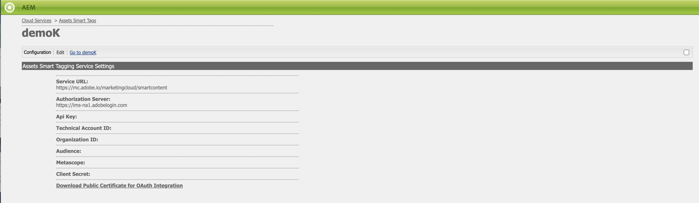

# Solución de problemas de etiquetas inteligentes para credenciales de OAuth {#oauth-config}

Se requiere una configuración de autorización abierta para adoptar el consentimiento para que la aplicación [!DNL Adobe Experience Manager] interactúe con Smart Content Services de forma segura.

>[!NOTE]
>
> No puede crear nuevas credenciales de JWT a partir de junio de 2024. A partir de ahora, solo se crean credenciales de servidor a servidor OAuth.
> La integración de JWT sigue funcionando hasta enero de 2025 solo para los usuarios de AMS y locales existentes.

## Configuración de OAuth para los nuevos usuarios de AMS {#oauth-config-existing-ams-users}

Consulte [configuración de servicios de contenido inteligente](#integrate-adobe-io) para obtener la configuración de los servicios de OAuth para un usuario nuevo. Una vez finalizado, siga estos [pasos](#prereqs-config-oauth-onprem).

>[!NOTE]
>
>Si es necesario, puede enviar un ticket de asistencia siguiendo el [proceso de asistencia](https://experienceleague.adobe.com/?lang=es&amp;support-tab=home?lang=es#support).

## Configuración de OAuth para los usuarios de AMS existentes {#oauth-config-new-ams-users}

Antes de realizar cualquiera de los pasos de esta metodología, es necesario implementar lo siguiente:

### Requisitos previos {#prereqs-config-oauth-onprem}

Una configuración de OAuth requiere los siguientes requisitos previos:

* Cree una nueva integración de OAuth en [Developer Console](https://developer.adobe.com/console/user/servicesandapis). Use `ClientID`, `ClientSecret`, `OrgID` y otras propiedades en los pasos siguientes:
* Los siguientes archivos se pueden encontrar en esta ruta de acceso `/apps/system/config in crx/de`:
   * `com.adobe.granite.auth.oauth.accesstoken.provider.<randomnumbers>.config`
   * `com.adobe.granite.auth.ims.impl.IMSAccessTokenRequestCustomizerImpl.<randomnumber>.config`

### Configuración de OAuth para los usuarios de AMS y OnPrem existentes {#steps-config-oauth-onprem}

El administrador del sistema puede realizar los siguientes pasos en **CRXDE**. El cliente de AMS puede comunicarse con el representante del Adobe o enviar un ticket de asistencia después del [proceso de asistencia](https://experienceleague.adobe.com/?lang=es&amp;support-tab=home?lang=es#support).

1. Agregar o actualizar las siguientes propiedades en `com.adobe.granite.auth.oauth.accesstoken.provider.<randomnumbers>.config`:

   * `auth.token.provider.authorization.grants="client_credentials"`
   * `auth.token.provider.orgId="<OrgID>"`
   * `auth.token.provider.default.claims=("\"iss\"\ :\ \"<OrgID>\"")`
   * `auth.token.provider.scope="read_pc.dma_smart_content,\ openid,\ AdobeID,\ additional_info.projectedProductContext"`

     `auth.token.validator.type="adobe-ims-similaritysearch"`
   * Actualice `auth.token.provider.client.id` con el ID de cliente de la nueva configuración de OAuth.
   * Actualizar `auth.access.token.request` a `"https://ims-na1.adobelogin.com/ims/token/v3"`
1. Cambie el nombre del archivo a `com.adobe.granite.auth.oauth.accesstoken.provider-<randomnumber>.config`.

   >[!IMPORTANT]
   >
   >Reemplace el punto (.) por un guión (-) como prefijo de `<randomnumber>`.

1. Siga estos pasos en `com.adobe.granite.auth.ims.impl.IMSAccessTokenRequestCustomizerImpl.<randomnumber>.config`:
   * Actualice la propiedad auth.ims.client.secret con el Secreto del cliente desde la nueva integración de OAuth.
   * Cambie el nombre del archivo a `com.adobe.granite.auth.ims.impl.IMSAccessTokenRequestCustomizerImpl-<randomnumber>.config`
1. Guarde todos los cambios en la consola de desarrollo del repositorio de contenido, por ejemplo, CRXDE.
<!--
1. Navigate to `/system/console/configMgr` and replace the OSGi configuration from `.<randomnumber>` to `-<randomnumber>`.
1. Delete the old OSGi configuration for `"Access Token provider name: adobe-ims-similaritysearch"` in `/system/console/configMgr`.
-->
1. En `System/console/configMgr`, puede ver archivos de configuración nuevos y antiguos. Elimine las configuraciones anteriores de `com.adobe.granite.auth.ims.impl.IMSAccessTokenRequestCustomizerImpl` y el nombre del proveedor de token de acceso `adobe-ims-similaritysearch`. Asegúrese de que la configuración actualizada solo esté implementada, en lugar de las configuraciones anteriores.
1. Reinicie la consola.

## Validar la configuración {#validate-the-configuration}

Una vez completada la configuración, puede utilizar un MBean de JMX para validar la configuración. Para validar, siga estos pasos.

1. Obtenga acceso a su servidor [!DNL Experience Manager] en `https://[aem_server]:[port]`.

1. Vaya a **[!UICONTROL Herramientas]** > **[!UICONTROL Operaciones]** > **[!UICONTROL Consola web]** para abrir la consola OSGi. Haga clic en **[!UICONTROL Principal] > [!UICONTROL JMX]**.

1. Haga clic en `com.day.cq.dam.similaritysearch.internal.impl`. Se abrirá **[!UICONTROL Tareas varias de SimilaritySearch]**.

1. Haga clic en `validateConfigs()`. En el diálogo **[!UICONTROL Validar configuraciones]**, haga clic en **[!UICONTROL Invocar]**.

Los resultados de validación se muestran en el mismo cuadro de diálogo.

>[!NOTE]
>
>Si se produce el error `unsupported_grant_type`, intente instalar la revisión de Granite. Consulte [migración de cuenta de servicio (JWT) a credenciales de servidor a servidor OAuth](https://experienceleague.adobe.com/en/docs/experience-cloud-kcs/kbarticles/ka-24660).

## Integración con Adobe Developer Console {#integrate-adobe-io}

Como usuario nuevo, al realizar la integración con Adobe Developer Console, el servidor [!DNL Experience Manager] autentica las credenciales del servicio con la puerta de enlace de Adobe Developer Console antes de reenviar la solicitud al servicio de contenido inteligente. Para integrarse, necesita una cuenta de Adobe ID que tenga privilegios de administrador para la organización y una licencia de Smart Content Service comprada y habilitada para su organización.

Para configurar el servicio de contenido inteligente, siga estos pasos de nivel superior:

<!---->

1. Para generar una clave pública, [cree una configuración de Smart Content Service](#oauth-config) en [!DNL Experience Manager]. [Descargar un certificado público](#oauth-config) para la integración de OAuth.

1. *[No aplicable si usted es un usuario existente]* [cree una integración en Adobe Developer Console](#create-adobe-i-o-integration).

1. [Configure su implementación](#configure-smart-content-service) con la clave de API y otras credenciales de Adobe Developer Console.

1. [Compruebe la configuración](#validate-the-configuration).

## Descargar un certificado público creando la configuración del servicio de contenido inteligente {#download-public-certificate}

Un certificado público permite autenticar el perfil en Adobe Developer Console.

1. En la interfaz de usuario de [!DNL Experience Manager], acceda a **[!UICONTROL Herramientas]** > **[!UICONTROL Cloud Service]** > **[!UICONTROL Cloud Service heredados]**.

1. En la página Cloud Service, haga clic en **[!UICONTROL Configurar ahora]** en **[!UICONTROL Etiquetas inteligentes de Assets]**.

1. En el cuadro de diálogo **[!UICONTROL Crear configuración]**, especifique un título y un nombre para la configuración de etiquetas inteligentes. Haga clic en **[!UICONTROL Crear]**.

1. AEM En el cuadro de diálogo **[!UICONTROL Servicio de contenido inteligente]**, use los siguientes valores:

   **[!UICONTROL URL de servicio]**: `https://smartcontent.adobe.io/<region where your Experience Manager author instance is hosted>`

   Por ejemplo, `https://smartcontent.adobe.io/apac`. Puede especificar `na`, `emea` o `apac` como las regiones en las que está alojada la instancia de autor de Experience Manager.

   >[!NOTE]
   >
   >Si el servicio administrado de Experience Manager se aprovisiona antes del 1 de septiembre de 2022, utilice la siguiente URL de servicio:
   >`https://mc.adobe.io/marketingcloud/smartcontent`

   **[!UICONTROL Servidor de autorización]**: `https://ims-na1.adobelogin.com`

   Deje los demás campos en blanco por ahora (se proporcionarán más adelante). Haga clic en **[!UICONTROL OK]**.

   

   *Figura: Cuadro de diálogo Servicio de contenido inteligente para proporcionar la URL del servicio de contenido*

   >[!NOTE]
   >
   >La URL proporcionada como [!UICONTROL URL de servicio] no es accesible a través del explorador y genera un error 404. La configuración funciona correctamente con el mismo valor del parámetro [!UICONTROL Service URL]. Para ver el estado general del servicio y el programa de mantenimiento, consulte [https://status.adobe.com](https://status.adobe.com).

1. Haga clic en **[!UICONTROL Descargar certificado público para la integración de OAuth]** y descargue el archivo de certificado público `AEM-SmartTags.crt`. Además, ya no es necesario cargar este certificado en la consola de Adobe Developer.

   

   *Figura: Configuración del servicio de etiquetado inteligente.*

## Creación de la integración con Adobe Developer Console {#create-adobe-i-o-integration}

Para usar las API del servicio de contenido inteligente, cree una integración en Adobe Developer Console para obtener [!UICONTROL clave de API] (generada en el campo [!UICONTROL ID de cliente] de la integración de Adobe Developer Console), [!UICONTROL ID de cuenta técnica], [!UICONTROL ID de organización] y [!UICONTROL SECRETO DE CLIENTE] para la [!UICONTROL configuración del servicio de etiquetado inteligente de Assets] de la nube en [!DNL Experience Manager].

1. Acceda a [https://developer.adobe.com/console/](https://developer.adobe.com/console/) en un explorador. Seleccione la cuenta adecuada y compruebe que la función de organización asociada sea administrador del sistema.

1. Cree un proyecto con el nombre que desee. Haga clic en **[!UICONTROL Añadir API]**.

1. En la página **[!UICONTROL Añadir una API]** , seleccione **[!UICONTROL Experience Cloud]** y **[!UICONTROL Contenido inteligente]**. Haga clic en **[!UICONTROL Siguiente]**. 

1. Elija el método de autenticación **[!UICONTROL OAuth Server-to-Server]**.

1. Agregue o modifique el **[!UICONTROL Nombre de credencial]** según sea necesario. Haga clic en **[!UICONTROL Siguiente]**.

1. Seleccione el perfil de producto **[!UICONTROL Smart Content Services]**. Haga clic en **[!UICONTROL Guardar API configurada]**. La API de OAuth se agrega a las credenciales conectadas para su uso posterior. Puede copiar la clave de API [!UICONTROL ID de cliente] o [!UICONTROL Generar token de acceso] desde ella.
<!--
1. On the **[!UICONTROL Select product profiles]** page, select **[!UICONTROL Smart Content Services]**. Click **[!UICONTROL Save configured API]**.

   A page displays more information about the configuration. Keep this page open to copy and add these values in [!UICONTROL Assets Smart Tagging Service Settings] of cloud configuration in [!DNL Experience Manager] to configure smart tags.

   

   *Figure: Details of integration in Adobe Developer Console*
-->

*Figura: Servidor a servidor OAuth configurado en Adobe Developer Console*

## Configurar el servicio de contenido inteligente {#configure-smart-content-service}

Para configurar la integración, use los valores de los campos [!UICONTROL ID. DE CUENTA TÉCNICA], [!UICONTROL ID. DE ORGANIZACIÓN], [!UICONTROL SECRETO DE CLIENTE] e [!UICONTROL ID. DE CLIENTE] de la integración de Adobe Developer Console. La creación de una configuración de nube de etiquetas inteligentes permite la autenticación de solicitudes de API desde la implementación de [!DNL Experience Manager].

1. En [!DNL Experience Manager], vaya a **[!UICONTROL Herramientas]** > **[!UICONTROL Cloud Service]** > **[!UICONTROL Cloud Services heredados]** para abrir la consola de [!UICONTROL Cloud Services].

1. En **[!UICONTROL Etiquetas inteligentes de Assets]**, abra la configuración creada anteriormente. En la página de configuración del servicio, haga clic en **[!UICONTROL Editar]**.

1. En el cuadro de diálogo **[!UICONTROL AEM Smart Content Service]**, utilice los valores predefinidos para los campos **[!UICONTROL URL de servicio]** y **[!UICONTROL Servidor de autorización]**.

1. Para los campos [!UICONTROL Clave de API], [!UICONTROL ID de cuenta técnica], [!UICONTROL ID de organización] y [!UICONTROL Secreto de cliente], copie y utilice los siguientes valores generados en la [integración de Adobe Developer Console](#create-adobe-i-o-integration).

   | [!UICONTROL Configuración del servicio de etiquetado inteligente de Assets] | [!DNL Adobe Developer Console] campos de integración |
   |--- |--- |
   | [!UICONTROL Clave De Api] | [!UICONTROL ID. DE CLIENTE] |
   | [!UICONTROL Id. de cuenta técnica] | [!UICONTROL ID. DE CUENTA TÉCNICA] |
   | [!UICONTROL ID de organización] | [!UICONTROL ID. DE ORGANIZACIÓN] |
   | [!UICONTROL Secreto de cliente] | [!UICONTROL SECRETO DE CLIENTE] |

>[!MORELIKETHIS]
>
>* [Información general y cómo entrenar etiquetas inteligentes](enhanced-smart-tags.md)
>* [Configurar el etiquetado inteligente](config-smart-tagging.md)
>* [Tutorial de vídeo sobre etiquetas inteligentes](https://experienceleague.adobe.com/docs/experience-manager-learn/assets/metadata/image-smart-tags.html)
