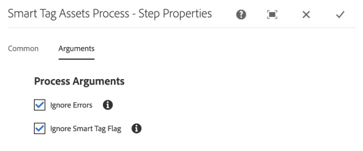

# Preparar [!DNL Assets] para el etiquetado inteligente {#configure-asset-tagging-using-the-smart-content-service}

Antes de poder etiquetar los recursos mediante inicios mediante Smart Content Services, integre [!DNL Experience ManageR Assets] con Adobe Developer Console para aprovechar el servicio inteligente de [!DNL Adobe Sensei]. Una vez configurado, entrene el servicio con unas pocas imágenes y una etiqueta.

Antes de utilizar Smart Content Service, asegúrese de lo siguiente:

* [Integración con Adobe Developer Console](#integrate-adobe-io).
* [Capacitación del servicio](#training-the-smart-content-service) de contenido inteligente.

   <!-- TBD: This link will update soon after the new articles goes live on docs.adobe.com. Change it when new URL is available.
  -->

* Instale el último [Service Pack de Experience Manager](https://experienceleague.adobe.com/docs/experience-manager-release-information/aem-release-updates/aem-releases-updates.html).

## Integración con Adobe Developer Console {#integrate-adobe-io}

Cuando se integra con Adobe Developer Console, el servidor [!DNL Experience Manager] autentica las credenciales del servicio con la puerta de enlace de Adobe Developer Console antes de reenviar la solicitud al servicio de contenido inteligente. Para integrarlo, necesita una cuenta de Adobe ID con privilegios de administrador para la organización y una licencia de Smart Content Service comprada y activada para su organización.

Para configurar el servicio de contenido inteligente, siga estos pasos de nivel superior:

1. [Cree una ](#obtain-public-certificate) configuración de Smart Content Services en  [!DNL Experience Manager] para generar una clave pública. [Obtenga un certificado público para la integración de OAuth.](#obtain-public-certificate)

1. [Cree una integración en Adobe Developer Console y cargue la clave pública generada.](#create-adobe-i-o-integration)

1. [Configure la ](#configure-smart-content-service) implementación con la clave de API y otras credenciales de Adobe Developer Console.

1. [Compruebe la configuración](#validate-the-configuration).

1. De forma opcional, [habilite el etiquetado automático en la carga de recursos](#enable-smart-tagging-in-the-update-asset-workflow-optional).

### Cree la configuración de Smart Content Service para obtener un certificado público {#obtain-public-certificate}

El certificado público permite autenticar el perfil en Adobe Developer Console.

1. En la interfaz de usuario [!DNL Experience Manager], acceda a **[!UICONTROL Herramientas]** > **[!UICONTROL Cloud Services]** > **[!UICONTROL Cloud Services heredados]**.

1. En la página Cloud Services, haga clic en **[!UICONTROL Configurar ahora]** en **[!UICONTROL Etiquetas inteligentes de recursos]**.

1. En el cuadro de diálogo **[!UICONTROL Crear configuración]**, especifique un título y un nombre para la configuración de etiquetas inteligentes. Haga clic en **[!UICONTROL Crear]**.

1. En el cuadro de diálogo **[!UICONTROL AEM Smart Content Service]**, utilice los valores siguientes:

   **[!UICONTROL URL de servicio]**: `https://mc.adobe.io/marketingcloud/smartcontent`

   **[!UICONTROL Servidor de autorización]**: `https://ims-na1.adobelogin.com`

   Deje el resto de campos en blanco por ahora (se proporcionará más tarde). Haga clic en **[!UICONTROL Aceptar]**.

   

   *Figura: Cuadro de diálogo de Smart Content Service para proporcionar la URL del servicio de contenido*

   >[!NOTE]
   >
   >La dirección URL proporcionada como [!UICONTROL URL de servicio] no es accesible a través del explorador y genera un error 404. La configuración funciona correctamente con el mismo valor del parámetro [!UICONTROL Service URL]. Para obtener información sobre el estado general del servicio y la programación de mantenimiento, consulte [https://status.adobe.com](https://status.adobe.com).

1. Haga clic en **[!UICONTROL Descargar certificado público para la integración de OAuth]** y descargue el archivo de certificado público `AEM-SmartTags.crt`.

   

   *Figura: Configuración del servicio de etiquetado inteligente*

#### Volver a configurar cuando un certificado caduque {#certrenew}

Una vez que caduca un certificado, ya no es de confianza. No puede renovar un certificado caducado. Para añadir un nuevo certificado, siga estos pasos.

1. Inicie sesión en la implementación [!DNL Experience Manager] como administrador. Haga clic en **[!UICONTROL Herramientas]** > **[!UICONTROL Seguridad]** > **[!UICONTROL Usuarios]**.

1. Busque y haga clic en el usuario **[!UICONTROL dam-update-service]**. Haga clic en la ficha **[!UICONTROL Almacén de claves]**.

1. Elimine el almacén de claves **[!UICONTROL similaritysearch]** y el certificado caducado. Haga clic en **[!UICONTROL Guardar y cerrar]**.

   

   *Imagen: Elimine la entrada `similaritysearch` en el almacén de claves para añadir un nuevo certificado de seguridad.*

1. Vaya a **[!UICONTROL Herramientas]** > **[!UICONTROL Cloud Services]** > **[!UICONTROL Servicios de nube heredados]**. Haga clic en **[!UICONTROL Etiquetas inteligentes de recursos]** > **[!UICONTROL Mostrar configuración]** > **[!UICONTROL Configuraciones disponibles]**. Haga clic en la configuración requerida.

1. Para descargar un certificado público, haga clic en **[!UICONTROL Descargar certificado público para la integración de OAuth]**.

1. Acceda a [https://console.adobe.io](https://console.adobe.io) y vaya a los servicios de contenido inteligente existentes en la página **[!UICONTROL Integrations]**. Cargue el nuevo certificado. Para obtener más información, consulte las instrucciones de [Creación de la integración de la consola de desarrollador de Adobe](#create-adobe-i-o-integration).

### Crear la integración de Adobe Developer Console {#create-adobe-i-o-integration}

Para utilizar las API de Smart Content Service, cree una integración en Adobe Developer Console para obtener [!UICONTROL Clave de API] (generada en el campo [!UICONTROL ID de CLIENTE] de la integración de Adobe Developer Console), [!UICONTROL ID DE CUENTA TÉCNICA], [!UICONTROL ID de ORGANIZACIÓN] y [!UICONTROL CLICLIER ENT SECRET] para [!UICONTROL Configuración del servicio de etiquetado inteligente de recursos] de la configuración de nube en [!DNL Experience Manager].

1. Acceda a [https://console.adobe.io](https://console.adobe.io/) en el explorador. Seleccione la cuenta adecuada y compruebe que la función de organización asociada sea administrador del sistema.

1. Cree un proyecto con el nombre que desee. Haga clic en **[!UICONTROL Añadir API]**.

1. En la página **[!UICONTROL Añadir una API]** , seleccione **[!UICONTROL Experience Cloud]** y **[!UICONTROL Contenido inteligente]**. Haga clic en **[!UICONTROL Siguiente]**. 

1. Seleccione **[!UICONTROL Cargar la clave pública]**. Proporcione el archivo de certificado descargado de [!DNL Experience Manager]. Se muestra un mensaje con las [!UICONTROL claves públicas cargadas correctamente]. Haga clic en **[!UICONTROL Siguiente]**. 

   La página [!UICONTROL Crear una nueva página de credenciales de cuenta de servicio (JWT)] muestra la clave pública de la cuenta de servicio que se acaba de configurar.

1. Haga clic en **[!UICONTROL Siguiente]**. 

1. En la página **[!UICONTROL Seleccionar perfiles de producto]**, seleccione **[!UICONTROL Servicios de contenido inteligente]**. Haga clic en **[!UICONTROL Guardar API configurada]**.

   La página muestra más información sobre la configuración. Mantenga esta página abierta para copiar y agregar estos valores en [!UICONTROL Configuración del servicio de etiquetado inteligente de recursos] de la configuración de nube en [!DNL Experience Manager] para configurar las etiquetas inteligentes.

   

   *Figura: Detalles de la integración en Adobe Developer Console*

### Configurar el servicio de contenido inteligente {#configure-smart-content-service}

Para configurar la integración, utilice los valores de los campos [!UICONTROL ID DE CUENTA TÉCNICA], [!UICONTROL ID DE ORGANIZACIÓN], [!UICONTROL CLIENT SECRET] y [!UICONTROL ID DE CLIENTE] de la integración de Adobe Developer Console. La creación de una configuración de nube de etiquetas inteligentes permite la autenticación de solicitudes de API desde la implementación [!DNL Experience Manager].

1. En [!DNL Experience Manager], vaya a **[!UICONTROL Herramientas]** > **[!UICONTROL Cloud Service]** > **[!UICONTROL Cloud Services heredados]** para abrir la consola [!UICONTROL Cloud Services].

1. En las **[!UICONTROL Etiquetas inteligentes de recursos]**, abra la configuración creada anteriormente. En la página de configuración de servicio, haga clic en **[!UICONTROL Editar]**.

1. En el cuadro de diálogo **[!UICONTROL AEM Smart Content Service]**, utilice los valores predefinidos para los campos **[!UICONTROL URL de servicio]** y **[!UICONTROL Servidor de autorización]**.

1. Para los campos [!UICONTROL Clave de API], [!UICONTROL Id. de cuenta técnica], [!UICONTROL Id. de organización] y [!UICONTROL Secreto de cliente], copie y utilice los siguientes valores generados en [Integración con la Consola de programador de Adobe](#create-adobe-i-o-integration).

   | [!UICONTROL Configuración del servicio de etiquetado inteligente de recursos] | [!DNL Adobe Developer Console] campos de integración |
   |--- |--- |
   | [!UICONTROL Clave de API] | [!UICONTROL ID DEL CLIENTE] |
   | [!UICONTROL Id. de cuenta técnica] | [!UICONTROL ID DE CUENTA TÉCNICA] |
   | [!UICONTROL Id. de organización] | [!UICONTROL ID. DE ORGANIZACIÓN] |
   | [!UICONTROL Secreto del cliente] | [!UICONTROL SECRETO DEL CLIENTE] |

### Validación de la configuración {#validate-the-configuration}

Después de completar la configuración, puede utilizar un MBean de JMX para validar la configuración. Para validar, siga estos pasos.

1. Acceda a su servidor [!DNL Experience Manager] en `https://[aem_server]:[port]`.

1. Vaya a **[!UICONTROL Herramientas]** > **[!UICONTROL Operaciones]** > **[!UICONTROL Consola Web]** para abrir la consola OSGi. Haga clic en **[!UICONTROL Principal] > [!UICONTROL JMX]**.

1. Haga clic `com.day.cq.dam.similaritysearch.internal.impl`. Abre **[!UICONTROL SimilitudBuscar Tareas varias]**.

1. Haga clic `validateConfigs()`. En el cuadro de diálogo **[!UICONTROL Validar configuraciones]**, haga clic en **[!UICONTROL Invocar]**.

Los resultados de validación se muestran en el mismo cuadro de diálogo.

### Habilitar el etiquetado inteligente en el flujo de trabajo [!UICONTROL Recurso de actualización de DAM] (opcional) {#enable-smart-tagging-in-the-update-asset-workflow-optional}

1. En [!DNL Experience Manager], vaya a **[!UICONTROL Herramientas]** > **[!UICONTROL Flujo de trabajo]** > **[!UICONTROL Modelos]**.

1. En la página **[!UICONTROL Modelos de flujo de trabajo]**, seleccione el modelo de flujo de trabajo de **[!UICONTROL recursos de actualización de DAM]**.

1. Haga clic en **[!UICONTROL Editar]** en la barra de herramientas.

1. Expanda el panel lateral para mostrar los pasos. Arrastre el paso **[!UICONTROL Recurso de etiqueta inteligente]** que está disponible en la sección Flujo de trabajo de DAM y colóquelo después del paso **[!UICONTROL Miniaturas del proceso]**.

   

   *Imagen: Añada el paso del recurso de etiquetas inteligentes después del paso de miniaturas de proceso en el flujo de trabajo de recursos de actualización de DAM*

1. Abra el paso en modo de edición. En **[!UICONTROL Configuración avanzada]**, compruebe que la opción **[!UICONTROL Avance del controlador]** está seleccionada.

   

   *Figura: Configurar el flujo de trabajo de recursos de actualización de DAM y agregar el paso de etiquetas inteligentes*

1. En la pestaña **[!UICONTROL Argumentos]**, seleccione **[!UICONTROL Omitir errores]** si desea que el flujo de trabajo se complete aunque falle el paso de etiquetado automático.

   

   *Figura: Configurar el flujo de trabajo de recursos de actualización de DAM para agregar el paso de la etiqueta inteligente y seleccionar el avance del controlador*

   Para etiquetar recursos al cargarlos, independientemente de si el etiquetado inteligente está activado en las carpetas, seleccione **[!UICONTROL Omitir indicador de etiqueta inteligente]**.

   

   *Figura: Configure el flujo de trabajo de recursos de actualización DAM para agregar el paso de la etiqueta inteligente y seleccione Omitir el indicador de etiqueta inteligente*

1. Haga clic en **[!UICONTROL Aceptar]** para cerrar el paso del proceso y, a continuación, guarde el flujo de trabajo.

## Formación del servicio de contenido inteligente {#training-the-smart-content-service}

Para que Smart Content Service reconozca su taxonomía empresarial, ejecútela en un conjunto de recursos que ya incluyen etiquetas que son relevantes para su negocio. Para etiquetar de forma eficaz las imágenes de marca, el servicio de contenido inteligente requiere que las imágenes de formación se ajusten a determinadas directrices. Después de la formación, el servicio puede aplicar la misma taxonomía a un conjunto de activos similar.

Puede entrenar el servicio varias veces para mejorar su capacidad de aplicar etiquetas relevantes. Después de cada ciclo de formación, ejecute un flujo de trabajo de etiquetado y compruebe si los recursos están etiquetados correctamente.

Puede capacitar al servicio de contenido inteligente de forma periódica o según sus necesidades.

>[!NOTE]
>
>El flujo de trabajo de formación solo se ejecuta en carpetas.

### Pautas para capacitación {#guidelines-for-training}

Para obtener los mejores resultados, las imágenes del conjunto de formación deben cumplir las siguientes directrices:

**Cantidad y tamaño:** Mínimo de 30 imágenes por etiqueta. Mínimo de 500 píxeles en el lado más largo.

**Coherencia**: Las imágenes de una etiqueta deben ser visualmente similares.

Por ejemplo, no es recomendable etiquetar todas estas imágenes como `my-party` (para formación) porque no son visualmente similares.

**Cobertura**: Las imágenes de la formación deben ser suficientemente variadas. La idea es dar algunos ejemplos, pero razonablemente diversos, para que el Experience Manager aprenda a centrarse en las cosas correctas. Si está aplicando la misma etiqueta en imágenes visualmente diferentes, incluya al menos cinco ejemplos de cada tipo.

Por ejemplo, para la etiqueta *model-down-pose*, incluya más imágenes de capacitación similares a la imagen resaltada a continuación para que el servicio identifique imágenes similares con mayor precisión durante el etiquetado.

**Distracción/obstrucción**: El servicio entrena mejor en imágenes que tienen menos distracción (fondos destacados, acompañamientos no relacionados, como objetos/personas con el tema principal).

Por ejemplo, para la etiqueta *casual-shoe*, la segunda imagen no es un buen candidato para la formación.

**Complejidad:** Si una imagen cumple los requisitos para más de una etiqueta, agregue todas las etiquetas aplicables antes de incluir la imagen para formación. Por ejemplo, para etiquetas como `raincoat` y `model-side-view`, agregue ambas etiquetas en el recurso elegible antes de incluirlo para formación.

>[!NOTE]
>
>La capacidad del servicio de contenido inteligente para formarse en sus etiquetas y aplicarlas en otras imágenes depende de la calidad de las imágenes que utilice para la formación. Para obtener los mejores resultados, Adobe recomienda que utilice imágenes visualmente similares para entrenar el servicio de cada etiqueta.

### Formación periódica {#periodic-training}

Puede habilitar el servicio de contenido inteligente para que imparta formación periódica sobre los recursos y las etiquetas asociadas dentro de una carpeta. Abra la página [!UICONTROL Propiedades] de la carpeta de recursos, seleccione **[!UICONTROL Habilitar etiquetas inteligentes]** en la ficha **[!UICONTROL Detalles]** y guarde los cambios.

Una vez seleccionada esta opción para una carpeta, [!DNL Experience Manager] ejecuta un flujo de trabajo de formación automáticamente para capacitar al servicio de contenido inteligente en los recursos de la carpeta y sus etiquetas. De forma predeterminada, el flujo de trabajo de formación se ejecuta semanalmente los sábados a las 12:30.

### Capacitación a pedido {#on-demand-training}

Puede entrenar el servicio de contenido inteligente siempre que sea necesario desde la consola Flujo de trabajo.

1. En la interfaz [!DNL Experience Manager], vaya a **[!UICONTROL Herramientas]** > **[!UICONTROL Flujo de trabajo]** > **[!UICONTROL Modelos]**.
1. En la página **[!UICONTROL Modelos de flujo de trabajo]**, seleccione el flujo de trabajo **[!UICONTROL Capacitación de etiquetas inteligentes]** y haga clic en **[!UICONTROL Flujo de trabajo de Inicio]** en la barra de herramientas.
1. En el cuadro de diálogo **[!UICONTROL Ejecutar flujo de trabajo]**, vaya a la carpeta de carga útil que incluye los recursos etiquetados para entrenar el servicio.
1. Especifique un título para el flujo de trabajo y un comentario. A continuación, haga clic en **[!UICONTROL Ejecutar]**. Los recursos y las etiquetas se envían para formación.

   

>[!NOTE]
>
>Una vez que los recursos de una carpeta se procesan para formación, solo los recursos modificados se procesan en los ciclos de formación posteriores.

### Informes de capacitación de vista {#viewing-training-reports}

Para comprobar si el servicio de contenido inteligente ha recibido formación sobre sus etiquetas en el conjunto de recursos de formación, consulte el informe de flujo de trabajo de formación desde la consola Informes.

1. En la interfaz [!DNL Experience Manager], vaya a **[!UICONTROL Herramientas]** > **[!UICONTROL Recursos]** > **[!UICONTROL Informes]**.
1. En la página **[!UICONTROL Informes de recursos]**, haga clic en **[!UICONTROL Crear]**.
1. Seleccione el informe **[!UICONTROL Formación sobre etiquetas inteligentes]** y, a continuación, haga clic en **[!UICONTROL Siguiente]** en la barra de herramientas.
1. Especifique un título y una descripción para el informe. En **[!UICONTROL Programar informe]**, deje seleccionada la opción **[!UICONTROL Ahora]**. Si desea programar el informe para más adelante, seleccione **[!UICONTROL Más adelante]** e indique una fecha y una hora. A continuación, haga clic en **[!UICONTROL Crear]** desde la barra de herramientas.
1. En la página **[!UICONTROL Informes de recursos]**, seleccione el informe que ha generado. Para vista del informe, haga clic en **[!UICONTROL Vista]** en la barra de herramientas.
1. Revise los detalles del informe.

   El informe muestra el estado de la formación de las etiquetas que ha entrenado. El color verde de la columna **[!UICONTROL Estado de formación]** indica que el servicio de contenido inteligente ha recibido formación para la etiqueta. El color amarillo indica que el servicio no está completamente entrenado para una etiqueta en particular. En este caso, agregue más imágenes con la etiqueta en concreto y ejecute el flujo de trabajo de formación para que el servicio se imparta completamente en la etiqueta.

   Si no ve las etiquetas en este informe, vuelva a ejecutar el flujo de trabajo de formación para estas etiquetas.

1. Para descargar el informe, selecciónelo en la lista y haga clic en **[!UICONTROL Descargar]** en la barra de herramientas. El informe se descarga como una hoja de cálculo de Microsoft Excel.

## Restricciones     {#limitations}

* Las etiquetas inteligentes mejoradas se basan en modelos de aprendizaje de imágenes y sus etiquetas. Estos modelos no siempre son perfectos para identificar etiquetas. La versión actual de Smart Content Service tiene las siguientes limitaciones:

   * Incapacidad para reconocer diferencias sutiles en las imágenes. Por ejemplo, camisas delgadas contra las tradicionales.
   * Imposibilidad de identificar etiquetas basadas en pequeños patrones o partes de una imagen. Por ejemplo, logotipos en camisetas.
   * El etiquetado se admite en las configuraciones regionales en las que se admite [!DNL Experience Manager]. Para obtener una lista de idiomas, consulte [Notas de la versión de los servicios de contenido inteligente](https://experienceleague.adobe.com/docs/experience-manager-64/release-notes/smart-content-service-release-notes.html).

* Para buscar recursos con etiquetas inteligentes (normales o mejoradas), utilice la [!DNL Assets] búsqueda Omniture (búsqueda de texto completo). No hay ningún predicado de búsqueda independiente para las etiquetas inteligentes.

>[!MORELIKETHIS]
>
>* [Descripción general y cómo se enseñan las etiquetas inteligentes](enhanced-smart-tags.md)
>* [Tutorial de vídeo sobre etiquetas inteligentes](https://experienceleague.adobe.com/docs/experience-manager-learn/assets/metadata/image-smart-tags.html)

