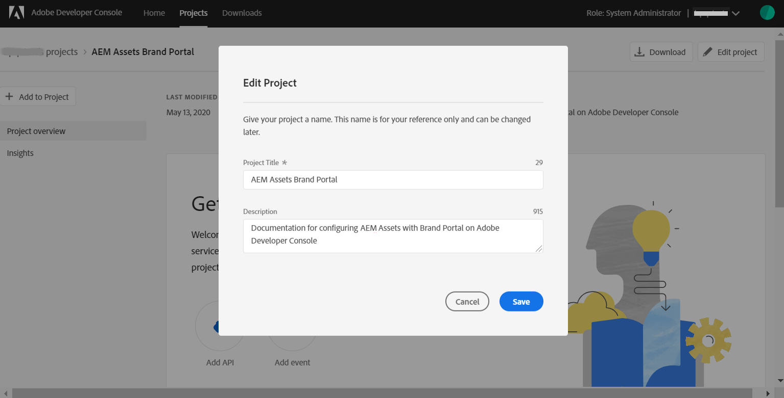

# Configurar AEM Assets con Brand Portal {#configure-integration-65}

Recursos Adobe Experience Manager (AEM) se configura con Brand Portal a través de Adobe Developer Console, que proporciona un distintivo IMS para la autorización del inquilino de Brand Portal.

>[!NOTE]
>
>La configuración de AEM Assets con Brand Portal mediante Adobe Developer Console es compatible con AEM 6.5.4.0 y versiones posteriores.
>
>Anteriormente, Brand Portal se configuraba en la IU clásica mediante OAuth Gateway heredado, que utiliza el intercambio de tokens JWT para obtener un Token de acceso IMS para la autorización.
>
>La configuración mediante OAuth heredado ya no se admite a partir del 6 de abril de 2020 y se cambia a la configuración mediante Adobe Developer Console.

>[!TIP]
>
>***Solo para clientes existentes***
>
>Se recomienda seguir utilizando la configuración heredada de OAuth Gateway. En caso de que surjan problemas con la configuración heredada de OAuth Gateway, elimine la configuración existente y cree una nueva configuración mediante Adobe Developer Console.

Esta ayuda describe los dos casos de uso siguientes:
* [Nueva configuración](#configure-new-integration-65): Si es un usuario nuevo de Brand Portal y desea configurar su instancia de autor de AEM Assets con Brand Portal, puede crear una nueva configuración en Adobe Developer Console.
* [Configuración](#upgrade-integration-65)de actualización: Si ya es un usuario de Brand Portal con su instancia de autor de Recursos AEM configurada con Brand Portal en OAuth Gateway heredado, se recomienda eliminar las configuraciones existentes y crear una nueva configuración en Adobe Developer Console.

La información proporcionada se basa en el supuesto de que cualquiera que lea esta Ayuda está familiarizado con las siguientes tecnologías:

* Instalación, configuración y administración de paquetes de Adobe Experience Manager y AEM

* Uso de sistemas operativos Linux y Microsoft Windows

## Requisitos previos {#prerequisites}

Para configurar AEM Assets con Brand Portal, es necesario lo siguiente:

* Una instancia de creación de Recursos AEM activa y en ejecución con el último Service Pack.
* URL del inquilino de Brand Portal.
* Un usuario con privilegios de administrador del sistema en la organización IMS del inquilino de Brand Portal.

[Descargar e instalar AEM 6.5](#aemquickstart)

[Descargar e instalar el último Service Pack de AEM](#servicepack)

### Descargar e instalar AEM 6.5 {#aemquickstart}

Se recomienda disponer de AEM 6.5 para configurar una instancia de creación de AEM. Si AEM no está en funcionamiento, descárguelo de las siguientes ubicaciones:

* Si ya es cliente de AEM, descargue AEM 6.5 del sitio web [de licencias de](http://licensing.adobe.com)Adobe.

* Si es un socio de Adobe, utilice [Adobe Partner Training Programa](https://adobe.allegiancetech.com/cgi-bin/qwebcorporate.dll?idx=82357Q) para solicitar AEM 6.5.

Después de descargar AEM, para obtener instrucciones sobre cómo configurar una instancia de autor de AEM, consulte [Implementación y mantenimiento](https://helpx.adobe.com/experience-manager/6-5/sites/deploying/using/deploy.html#defaultlocalinstall).

### Descargar e instalar AEM Service Pack más reciente {#servicepack}

Para obtener instrucciones detalladas, consulte

* [Notas de la versión de Service Pack de AEM 6.5](https://helpx.adobe.com/experience-manager/6-5/release-notes/sp-release-notes.html)

**Póngase en contacto con el Servicio de atención** al cliente si no puede encontrar el paquete de AEM o Service Pack más recientes.

## Crear configuración {#configure-new-integration-65}

La configuración de Recursos AEM con Brand Portal requiere configuraciones tanto en la instancia de creación de Recursos AEM como en Adobe Developer Console.

1. En la instancia de creación de Recursos AEM, cree una cuenta IMS y genere un certificado público (clave pública).

1. En Adobe Developer Console, cree un proyecto para el inquilino (organización) de Brand Portal.

1. En el proyecto, configure una API con la clave pública para crear una conexión de cuenta de servicio (JWT).

1. Obtenga las credenciales de la cuenta de servicio y la información de carga útil de JWT.

1. En la instancia de creación de Recursos AEM, configure la cuenta IMS con las credenciales de cuenta de servicio y la carga útil JWT.

1. En la instancia de creación de Recursos AEM, configure el servicio en la nube de Brand Portal mediante la cuenta IMS y el extremo de Brand Portal (dirección URL de la organización).

1. Pruebe la configuración publicando un recurso de la instancia de creación de Recursos AEM en Brand Portal.

>[!NOTE]
>
>Un inquilino de Brand Portal solo se configurará con una instancia de autor de AEM Assets.
>
>No configure un inquilino de Brand Portal con varias instancias de autor de Recursos AEM.

Realice los siguientes pasos en la secuencia mostrada si va a configurar Recursos AEM con Brand Portal por primera vez:
1. [Obtener un certificado público](#public-certificate)
1. [Crear conexión de cuenta de servicio (JWT)](#createnewintegration)
1. [Configurar cuenta de IMS](#create-ims-account-configuration)
1. [Configurar el servicio en la nube](#configure-the-cloud-service)
1. [Probar la configuración](#test-integration)

### Crear la configuración de IMS {#create-ims-configuration}

La configuración de IMS autentica el inquilino de Brand Portal con la instancia de creación de AEM Assets.

La configuración de IMS incluye dos pasos:

* [Obtener un certificado público](#public-certificate)
* [Configurar cuenta de IMS](#create-ims-account-configuration)

### Obtener un certificado público {#public-certificate}

El certificado público le permite autenticar su perfil en Adobe Developer Console.

1. Inicie sesión en la instancia de creación de Recursos AEM. La dirección URL predeterminada es
   `http:// localhost:4502/aem/start.html`
1. From the **Tools**  panel, navigate to **[!UICONTROL Security]** > **[!UICONTROL Adobe IMS Configurations]**.

   

1. En la página Configuraciones de Adobe IMS, haga clic en **[!UICONTROL Crear]**.

1. Se le redirige a la página de configuración **[!UICONTROL de la cuenta técnica de]** Adobe IMS. By default, the **Certificate** tab opens.

   Seleccione la solución de nube **[!UICONTROL Adobe Brand Portal]**.

1. Marque la casilla de verificación **[!UICONTROL Crear nuevo certificado]** y especifique un **alias** para el certificado. El alias sirve como nombre del cuadro de diálogo.

1. Haga clic en **[!UICONTROL Crear certificado]**. A continuación, haga clic en **[!UICONTROL Aceptar]** en el cuadro de diálogo para generar el certificado público.

   

1. Click **[!UICONTROL Download Public Key]** and save the certificate (.crt) file on your machine.

   El archivo de certificado se utilizará en pasos adicionales para configurar la API para el inquilino de Brand Portal y generar credenciales de cuenta de servicio en Adobe Developer Console.

   

1. Haga clic en **[!UICONTROL Siguiente]**. 

   En la ficha **Cuenta** , cree la cuenta de Adobe IMS, pero para ello necesitará las credenciales de cuenta de servicio que se generan en Adobe Developer Console. Mantenga esta página abierta por ahora.

   Abra una nueva ficha y [cree una conexión de cuenta de servicio (JWT) en Adobe Developer Console](#createnewintegration) para obtener las credenciales y la carga útil JWT para configurar la cuenta de IMS.

### Crear conexión de cuenta de servicio (JWT) {#createnewintegration}

En Adobe Developer Console, los proyectos y las API se configuran en el nivel de organización (inquilino de Brand Portal). La configuración de una API crea una conexión de cuenta de servicio (JWT) en Adobe Developer Console. Existen dos métodos para configurar la API, mediante la generación de un par de claves (claves privadas y públicas) o mediante la carga de una clave pública. Para configurar la instancia de creación de Recursos AEM con Brand Portal, debe generar un certificado público (clave pública) en la instancia de creación de Recursos AEM y crear credenciales en Adobe Developer Console cargando la clave pública. Esta clave pública se utiliza para configurar la API para la organización de Brand Portal seleccionada y genera las credenciales y la carga útil JWT para la cuenta de servicio. Estas credenciales se utilizan además para configurar la cuenta de IMS en la instancia de creación de Recursos AEM. Una vez configurada la cuenta de IMS, puede configurar el servicio en la nube de Brand Portal en la instancia de creación de Recursos AEM.

Realice los siguientes pasos para generar las credenciales de cuenta de servicio y la carga útil JWT:

1. Inicie sesión en Adobe Developer Console con privilegios de administrador del sistema en la organización de IMS (inquilino de Brand Portal). La dirección URL predeterminada es

   [https://www.adobe.com/go/devs_console_ui](https://www.adobe.com/go/devs_console_ui)

   >[!NOTE]
   >
   >Asegúrese de seleccionar la organización de IMS correcta (inquilino de Brand Portal) en el menú desplegable (lista de la organización) situado en la esquina superior derecha.

1. Click **[!UICONTROL Create new project]**. Se crea un proyecto en blanco para su organización.

   Haga clic en **[!UICONTROL Editar proyecto]** para actualizar el título **[!UICONTROL y la]** descripción **[!UICONTROL del]** proyecto y, a continuación, haga clic en **[!UICONTROL Guardar]**.

   

1. En la ficha Información general del proyecto, haga clic en **[!UICONTROL Añadir API]**.

   

1. En la ventana Añadir una API, seleccione **[!UICONTROL AEM Brand Portal]** y haga clic en **[!UICONTROL Siguiente]**.

   Asegúrese de tener acceso al servicio AEM Brand Portal.

1. En la ventana Configurar API, haga clic en **[!UICONTROL Cargar la clave]** pública. A continuación, haga clic en **[!UICONTROL Seleccionar un archivo]** y cargue el certificado público (archivo .crt) que ha descargado en la sección [Obtener certificado](#public-certificate) público.

   Haga clic en **[!UICONTROL Siguiente]**. 

   

1. Compruebe el certificado público y haga clic en **[!UICONTROL Siguiente]**.

1. Seleccione el producto predeterminado perfil **[!UICONTROL Assets Brand Portal]** y haga clic en **[!UICONTROL Guardar configuración]**.

   

1. Con la API configurada, se le redirige a la información general de la API. En el panel de navegación izquierdo, en **[!UICONTROL Credenciales]**, haga clic en Cuenta **[!UICONTROL de servicio (JWT)]**.

   >[!NOTE]
   >
   >Puede vista de las credenciales y realizar otras acciones (generar tokens JWT, copiar detalles de credenciales, recuperar el secreto del cliente, etc.) según sea necesario.

1. En la ficha **[!UICONTROL Credenciales]** de cliente, copie el ID **[!UICONTROL de]** cliente.

   Click **[!UICONTROL Retrieve Client Secret]** and copy the **[!UICONTROL client secret]**.

   

1. Navigate to the **[!UICONTROL Generate JWT]** tab and copy the **[!UICONTROL JWT Payload]**.

Ahora puede utilizar el ID de cliente (clave de API), el secreto de cliente y la carga útil JWT para [configurar la cuenta](#create-ims-account-configuration) IMS en la instancia de nube de AEM Assets.

<!--
### Create Adobe I/O integration {#createnewintegration}

Adobe I/O integration generates API Key, Client Secret, and Payload (JWT) which is required in setting up the IMS Account configurations.

1. Login to Adobe I/O Console with system administrator privileges on the IMS organization of the Brand Portal tenant.

   Default URL: [https://console.adobe.io/](https://console.adobe.io/) 

1. Click **[!UICONTROL Create Integration]**.

1. Select **[!UICONTROL Access an API]**, and click **[!UICONTROL Continue]**.

   

1. Create a new integration page opens. 
   
   Select your organization from the drop-down list.

   In **[!UICONTROL Experience Cloud]**, Select **[!UICONTROL AEM Brand Portal]** and click **[!UICONTROL Continue]**. 

   If the Brand Portal option is disabled for you, ensure that you have selected correct organization from the drop-down box above the **[!UICONTROL Adobe Services]** option. If you do not know your organization, contact your administrator.

   

1. Specify a name and description for the integration. Click **[!UICONTROL Select a File from your computer]** and upload the `AEM-Adobe-IMS.crt` file downloaded in the [obtain public certificates](#public-certificate) section.

1. Select the profile of your organization. 

   Or, select the default profile **[!UICONTROL Assets Brand Portal]** and click **[!UICONTROL Create Integration]**. The integration is created.

1. Click **[!UICONTROL Continue to integration details]** to view the integration information. 

   Copy the **[!UICONTROL API Key]** 
   
   Click **[!UICONTROL Retrieve Client Secret]** and copy the Client Secret key.

   

1. Navigate to **[!UICONTROL JWT]** tab, and copy the **[!UICONTROL JWT payload]**.

   The API Key, Client Secret key, and JWT payload information will be used to create IMS account configuration.
-->

### Crear la configuración de cuenta IMS {#create-ims-account-configuration}

Asegúrese de haber realizado los siguientes pasos:

* [Obtener un certificado público](#public-certificate)
* [Crear conexión de cuenta de servicio (JWT)](#createnewintegration)

Realice los siguientes pasos para configurar la cuenta de IMS que ha creado para [obtener un certificado](#public-certificate)público.

1. Abra la Configuración de IMS y vaya a la ficha **[!UICONTROL Cuentas]** . Mantuvo la página abierta mientras [obtenía un certificado](#public-certificate)público.

1. Especifique un **[!UICONTROL Título]** para la cuenta de IMS.

   En **[!UICONTROL Servidor de autorización]**, introduzca la dirección URL: [https://ims-na1.adobelogin.com/](https://ims-na1.adobelogin.com/)

   Pegue el ID de cliente en la clave de API, el secreto de cliente y la carga útil JWT que ha copiado al [crear la conexión](#createnewintegration)de cuenta de servicio (JWT).

   Haga clic en **[!UICONTROL Crear]**.

   La cuenta de IMS está configurada.

   

1. Seleccione la configuración de IMS y haga clic en **[!UICONTROL Comprobar estado]**.

   Haga clic en **[!UICONTROL Proteger]** en el cuadro de diálogo. Si la configuración es correcta, aparece un mensaje que indica que el *token se recupera correctamente*.

   

>[!CAUTION]
>
>Sólo debe tener una configuración de IMS. No cree varias configuraciones de IMS.
>
>Asegúrese de que la configuración de IMS pase la comprobación de estado. Si la configuración no pasa la comprobación de estado, no es válida. Debe eliminarla y crear una configuración nueva y válida.

### Configurar el servicio en la nube {#configure-the-cloud-service}

Siga estos pasos para crear el servicio en la nube de Brand Portal:

1. Inicie sesión en la instancia de creación de Recursos AEM.

1. From the **Tools**  panel, navigate to **[!UICONTROL Cloud Services]** > **[!UICONTROL AEM Brand Portal]**.

1. En la página Configuraciones de Brand Portal, haga clic en **[!UICONTROL Crear]**.

1. Especifique un **[!UICONTROL Título]** para la configuración.

   Seleccione la configuración de IMS que ha creado al [configurar la cuenta](#create-ims-account-configuration)de IMS.

   In the **[!UICONTROL Service URL]**, enter your Brand Portal tenant (organization) URL.

   

1. Haga clic en **[!UICONTROL Guardar y cerrar]**. Se crea la configuración de nube. La instancia de creación de Recursos AEM ahora está configurada con el inquilino de Brand Portal.

### Probar la configuración{#test-integration}

Realice los siguientes pasos para validar la configuración:

1. Inicie sesión en la instancia de nube de AEM Assets.

1. From the **Tools**  panel, navigate to **[!UICONTROL Deployment]** > **[!UICONTROL Replication]**.

   

1. En la página Replicación, haga clic en **[!UICONTROL Agentes en el autor]**.

   

1. Se crean cuatro agentes de replicación para cada inquilino.

   Busque los agentes de replicación del inquilino de Brand Portal.

   Haga clic en la dirección URL del agente de replicación.

   

   >[!NOTE]
   >
   >Los agentes de replicación trabajan en paralelo y comparten la distribución del trabajo por igual, aumentando así la velocidad de publicación en cuatro veces la velocidad original. Una vez configurado el servicio en la nube, no se requiere una configuración adicional para habilitar los agentes de replicación activados de forma predeterminada para habilitar la publicación en paralelo de varios recursos.

1. Para comprobar la conexión entre AEM Assets y Brand Portal, haga clic en **[!UICONTROL Probar conexión]**.

   

   Aparece un mensaje en la parte inferior de la página que indica que el paquete de prueba se entregó correctamente.

   

1. Compruebe los resultados de la prueba en los cuatro agentes de replicación uno por uno.

   >[!NOTE]
   >
   >Evite desactivar cualquiera de los agentes de replicación, ya que puede provocar errores en la replicación de algunos de los recursos.

La instancia de creación de AEM Assets se ha configurado correctamente con Brand Portal y ahora puede:

* [Publicar recursos desde AEM Assets en Brand Portal](../assets/brand-portal-publish-assets.md)
* [Publicar carpetas desde AEM Assets en Brand Portal](../assets/brand-portal-publish-folder.md)
* [Publicar colecciones desde AEM Assets en Brand Portal](../assets/brand-portal-publish-collection.md)
* [Configure Asset Sourcing](https://docs.adobe.com/content/help/es-ES/experience-manager-brand-portal/using/asset-sourcing-in-brand-portal/brand-portal-asset-sourcing.html) para que los usuarios de Brand Portal puedan contribuir y publicar recursos en Recursos AEM.

## Configuración de actualización {#upgrade-integration-65}

Realice los siguientes pasos en la secuencia indicada para actualizar las configuraciones existentes:
1. [Verificar trabajos en ejecución](#verify-jobs)
1. [Eliminar configuraciones existentes](#delete-existing-configuration)
1. [Crear configuración](#configure-new-integration-65)

### Verificar trabajos en ejecución {#verify-jobs}

Asegúrese de que no se esté ejecutando ningún trabajo de publicación en la instancia de creación de Recursos AEM antes de realizar ninguna modificación. Para ello, puede verificar los cuatro agentes de replicación y asegurarse de que la cola sea ideal o esté vacía.

1. Inicie sesión en la instancia de creación de Recursos AEM.

1. En el panel **Herramientas**  , vaya a **[!UICONTROL Implementación]** > Replicación **[!UICONTROL de implementación]**.

1. En la página Replicación, haga clic en **[!UICONTROL Agentes en el autor]**.

   

1. Busque los agentes de replicación del inquilino de Brand Portal.

   Asegúrese de que la **cola esté inactiva** para todos los agentes de replicación y de que no haya ningún trabajo de publicación activo.

   

### Eliminar configuraciones existentes {#delete-existing-configuration}

Debe ejecutar la siguiente lista de comprobación mientras elimina las configuraciones existentes.
* Eliminar los cuatro agentes de replicación
* Eliminar servicio de nube
* Eliminar usuario de MAC

1. Inicie sesión en la instancia de creación de Recursos AEM y abra CRX Lite como administrador. La dirección URL predeterminada es

   `http:// localhost:4502/crx/de/index.jsp`

1. Navegue hasta los cuatro agentes de replicación del inquilino de Brand Portal `/etc/replications/agents.author` y elimínelos.

   

1. Vaya a `/etc/cloudservices/mediaportal` y elimine la configuración **del servicio de** nube.

   

1. Navegue hasta `/home/users/mac` y elimine el usuario **** MAC del inquilino de Brand Portal.

   

Ahora puede [crear la configuración](#configure-new-integration-65) en la instancia de creación de AEM 6.5.

<!--
   Comment Type: draft

   <li> </li>
   -->

<!--
   Comment Type: draft

   <li>Step text</li>
   -->

Después de que la replicación se realice correctamente, puede publicar recursos, carpetas y colecciones en Brand Portal. Para obtener más información, consulte:

* [Publicar recursos en Brand Portal](/help/assets/brand-portal-publish-assets.md)
* [Publicar carpetas en Brand Portal](/help/assets/brand-portal-publish-folder.md)
* [Publicar colecciones en Brand Portal](/help/assets/brand-portal-publish-collection.md)
