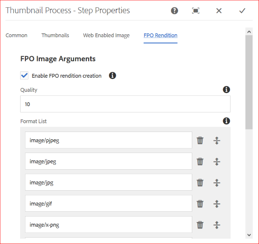

# Generar solo para ubicación representaciones para Adobe InDesign {#fpo-renditions}

Al colocar recursos de gran tamaño de AEM en documentos de Adobe InDesign, un profesional creativo debe esperar un tiempo considerable después de que [coloque un recurso](https://helpx.adobe.com/indesign/using/placing-graphics.html). Mientras tanto, se bloquea el uso del InDesign. Esto interrumpe el flujo creativo y afecta negativamente a la experiencia del usuario. Adobe permite colocar temporalmente representaciones de tamaño pequeño en documentos de InDesign para empezar. Cuando se requiere la salida final, por ejemplo, para los flujos de trabajo de impresión y publicación, los recursos originales de resolución completa sustituyen la representación temporal en segundo plano. Esta actualización asincrónica en segundo plano acelera el proceso de diseño para mejorar la productividad y no obstaculiza el proceso creativo.

AEM proporciona representaciones que se utilizan solo para la colocación (FPO). Estas representaciones de FPO tienen un tamaño de archivo pequeño, pero tienen la misma proporción de aspecto. Si una representación de FPO no está disponible para un recurso, Adobe InDesign utiliza el recurso original en su lugar. Este mecanismo de reserva garantiza que el flujo de trabajo creativo se ejecute sin interrupciones.

## Método para generar representaciones de FPO {#approach-to-generate-fpo-renditions}

AEM muchos métodos permiten procesar imágenes que se pueden utilizar para generar las representaciones de FPO. Los dos métodos más comunes son el uso de flujos de trabajo AEM integrados y el uso de ImageMagick. Con estos dos métodos, se configura la generación de representación de los recursos cargados recientemente y de los recursos que existen en AEM.

Puede utilizar ImageMagick para procesar imágenes, incluso para generar representaciones de FPO. Estas representaciones se reducen de muestra, es decir, las dimensiones en píxeles de la representación se reducen proporcionalmente si la imagen original tiene un PPI mayor que 72. Consulte [instalar y configurar ImageMagick para que funcione con AEM Assets](https://experienceleague.adobe.com/docs/experience-manager-65/assets/extending/best-practices-for-imagemagick.html).

|  | Uso de AEM flujo de trabajo integrado | Uso del flujo de trabajo ImageMagick | Observaciones |
|— |— |—|— |
| Para nuevos activos | Habilitar la representación de FPO ([help](#generate-renditions-of-new-assets-using-aem-workflow)) | Agregar la línea de comandos ImageMagick en AEM flujo de trabajo ([help](#generate-renditions-of-new-assets-using-imagemagick)) | AEM ejecuta el flujo de trabajo de recursos de actualización de DAM para cada carga. |
| Para activos existentes | Habilitar la representación de FPO en un nuevo flujo de trabajo de AEM dedicado ([help](#generate-renditions-of-existing-assets-using-aem-workflow)) | Agregar la línea de comandos ImageMagick en un nuevo flujo de trabajo AEM dedicado ([help](#generate-renditions-of-existing-assets-using-imagemagick)) | Las representaciones de FPO de los activos existentes se pueden crear a petición o en masa. |

>[!CAUTION]
>
>Cree los flujos de trabajo para generar representaciones modificando una copia de los flujos de trabajo predeterminados. Evita que los cambios se sobrescriban cuando AEM se actualiza, por ejemplo, instalando un nuevo Service Pack.

## Generar representaciones de nuevos activos mediante AEM flujo de trabajo {#generate-renditions-of-new-assets-using-aem-workflow}

A continuación se indican los pasos para configurar el modelo de flujo de trabajo de DAM Update Asset para habilitar la generación de representaciones:

1. Haga clic en **[!UICONTROL Herramientas]** > **[!UICONTROL Flujo de trabajo]** > **[!UICONTROL Modelos]**. Seleccione el modelo **[!UICONTROL DAM Update Asset]** y haga clic en **[!UICONTROL Editar]**.

1. Seleccione el paso **[!UICONTROL Procesar miniaturas]** y haga clic en **[!UICONTROL Configurar]**.

1. Haga clic en la pestaña **[!UICONTROL FPO Rendition]**. Seleccione **[!UICONTROL Habilitar la creación de representación de FPO]**.

   

1. Ajuste los valores de **[!UICONTROL Calidad]** y añada o modifique los valores de **[!UICONTROL Lista de formato]** según sea necesario. De forma predeterminada, la lista de tipos MIME para generar la representación de FPO es pjpeg, jpeg, jpg, gif, png, x-png y tiff. Haga clic en **[!UICONTROL Listo]**.

   >[!NOTE]
   >
   >La generación de representación es compatible con los tipos de archivo JPEG, GIF, PNG, TIFF, PSD y BMP.

1. Para activar los cambios, haga clic en **[!UICONTROL Sincronizar]**.

>[!NOTE]
>
>Las imágenes de más de 1280 píxeles por un lado no conservan las dimensiones de píxeles en la representación FPO.

## Generación de representaciones de recursos nuevos mediante ImageMagick {#generate-renditions-of-new-assets-using-imagemagick}

En AEM, el flujo de trabajo de recursos de actualización de DAM se ejecuta cuando se carga un nuevo recurso. Para utilizar ImageMagick para procesar representaciones de recursos recientemente cargados, agregue un nuevo comando al modelo de flujo de trabajo.

1. Haga clic en **[!UICONTROL Herramientas]** > **[!UICONTROL Flujo de trabajo]** > **[!UICONTROL Modelos]**. Seleccione el modelo **[!UICONTROL DAM Update Asset]** y haga clic en **[!UICONTROL Editar]**.

1. Haga clic en **[!UICONTROL Alternar panel lateral]** en la esquina superior izquierda. Busque el paso de la línea de comandos.

1. Arrastre el paso **[!UICONTROL Línea de comandos]** y agréguela antes del paso **[!UICONTROL Procesar miniaturas]**.

1. Seleccione el paso **[!UICONTROL Línea de comandos]** y haga clic en **[!UICONTROL Configurar]**.

1. Agregue la información deseada como **[!UICONTROL Title]** y **[!UICONTROL Description]** personalizados. Por ejemplo, la representación de FPO (con tecnología ImageMagick).

1. En la pestaña **[!UICONTROL Arguments]**, agregue **[!UICONTROL Mime Types]** relevantes para proporcionar una lista de formatos de archivo a los que se aplica el comando.

   

1. En la pestaña **[!UICONTROL Argumentos]**, en la sección **[!UICONTROL Comandos]**, agregue un comando ImageMagick relevante para generar representaciones de FPO.

   A continuación, se muestra un comando de ejemplo que genera representaciones de FPO en formato JPEG, con una resolución de muestreo inferior a 72 PPI, con una configuración de calidad del 10%, y gestiona archivos Adobe Photoshop de varias capas aplanando la salida:

   `convert -quality 10% -units PixelsPerInch ${filename} -resample 72 -flatten cq5dam.fpo.jpeg`

1. Para activar los cambios, haga clic en **[!UICONTROL Sincronizar]**.

Para obtener información detallada sobre las funcionalidades de la línea de comandos de ImageMagick, consulte https://imagemagick.org.

## Generar representaciones de recursos existentes mediante AEM flujo de trabajo {#generate-renditions-of-existing-assets-using-aem-workflow}

Para utilizar AEM flujo de trabajo para generar la representación FPO de los recursos existentes, cree un modelo de flujo de trabajo dedicado que utilice la opción de representación FPO integrada.

1. Haga clic en **[!UICONTROL Herramientas]** > **[!UICONTROL Flujo de trabajo]** > **[!UICONTROL Modelos]**. Para crear un modelo, haga clic en **[!UICONTROL Crear]** > **[!UICONTROL Crear modelo]**. Añada un **[!UICONTROL Título]** significativo y un **[!UICONTROL Nombre]**.

1. Seleccione el modelo y haga clic en **[!UICONTROL Edit]**. Haga clic en **[!UICONTROL Información de página]** > **[!UICONTROL Abrir propiedades]**. Seleccione **[!UICONTROL Flujo de trabajo transitorio]**. Esto mejora la escalabilidad y el rendimiento. Haga clic en ******[!UICONTROL Guardar y cerrar]**.

1. Haga clic en **[!UICONTROL Alternar panel lateral]** en la esquina superior izquierda. Busque el paso de miniaturas del proceso. Arrastre el paso **[!UICONTROL Procesar miniaturas]**.

1. Seleccione **[!UICONTROL Procesar miniaturas]** y haga clic en **[!UICONTROL Configurar]**. Siga la configuración [para generar la representación de nuevos recursos mediante AEM flujo de trabajo](#generate-renditions-of-new-assets-using-aem-workflow). Para activar los cambios, haga clic en **[!UICONTROL Sincronizar]**.

## Generar representaciones de recursos existentes mediante ImageMagick {#generate-renditions-of-existing-assets-using-imagemagick}

Para utilizar las capacidades de procesamiento de ImageMagick para generar la representación FPO de los recursos existentes, cree un modelo de flujo de trabajo dedicado que utilice la línea de comandos de ImageMagick para hacerlo.

1. Siga los pasos 1 a 3 de la configuración [para generar la representación de los recursos existentes mediante AEM sección de flujo de trabajo](#generate-renditions-of-existing-assets-using-aem-workflow).

1. Siga el paso 4 al paso 8 de la configuración [para generar la representación de nuevos recursos mediante la sección ImageMagick](#generate-renditions-of-new-assets-using-imagemagick).

## Ver representaciones de FPO {#view-fpo-renditions}

Puede comprobar las representaciones de FPO generadas una vez finalizado el flujo de trabajo. En la interfaz de usuario de AEM Assets, haga clic en el recurso para abrir una vista previa grande. Abra el carril izquierdo y seleccione Representaciones. Alternativamente, utilice el atajo de teclado `Alt + 3` cuando la vista previa esté abierta.

Haga clic en **[!UICONTROL FPO rendition]** para cargar su previsualización. Si lo desea, puede hacer clic con el botón derecho en la representación y guardarla en el sistema de archivos.

## Sugerencias y limitaciones {#tips-limitations}

* Para utilizar la configuración basada en ImageMagick, instale ImageMagick en el mismo equipo que AEM.
* Para generar representaciones de FPO de muchos recursos o de todo el repositorio, planifique y ejecute los flujos de trabajo durante la duración del tráfico bajo. La generación de representaciones de FPO para un gran número de activos es una actividad que consume muchos recursos y los servidores de AEM deben tener suficiente potencia de procesamiento y memoria disponibles.
* Para obtener información sobre rendimiento y escalabilidad, consulte [Ajuste de ImageMagick](https://experienceleague.adobe.com/docs/experience-manager-65/assets/administer/performance-tuning-guidelines.html).
* Para la gestión genérica de la línea de comandos de los recursos, consulte [controlador de la línea de comandos para procesar los recursos](https://experienceleague.adobe.com/docs/experience-manager-65/assets/extending/media-handlers.html).