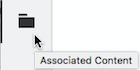

# Contenido asociado{#associated-content}

El contenido asociado proporciona la conexión para que los recursos (es decir, los) se puedan utilizar (opcionalmente) con el fragmento cuando se añada a una página de contenido. Esto proporciona flexibilidad al [proporcionar una serie de recursos a los que acceder cuando se utiliza el fragmento de contenido en una página](/help/sites-authoring/content-fragments.md#using-associated-content), al tiempo que ayuda a reducir el tiempo necesario para buscar el recurso adecuado.

## Añadir contenido asociado {#adding-associated-content}

>[!NOTE]
>
>Hay varios métodos para agregar [recursos visuales (p. ej., imágenes)](/help/assets/content-fragments/content-fragments.md#fragments-with-visual-assets) al fragmento o página.

Para hacer la asociación, primero debe [agregar sus recursos de medios a una colección](/help/assets/manage-collections.md#adding-assets-to-a-collection). Una vez hecho esto, puede:

1. Abra el fragmento y seleccione **Contenido asociado** en el panel lateral.

   

1. Seleccione **Asociar contenido** o **Asociar colección** (según corresponda, dependiendo de si alguna colección ya se ha asociado o no).
1. Seleccione la colección requerida.

   Si lo desea, puede añadir el propio fragmento a la colección seleccionada; esto ayuda al seguimiento.

   

1. Confirmar (con la marca de verificación). La colección se mostrará como asociada.

   

## Edición de contenido asociado {#editing-associated-content}

Una vez asociada una colección, puede:

* **** Elimine la asociación.
* **Añadir recursos** en la colección.
* Seleccione un recurso para realizar más acciones.
* Editar el recurso.

