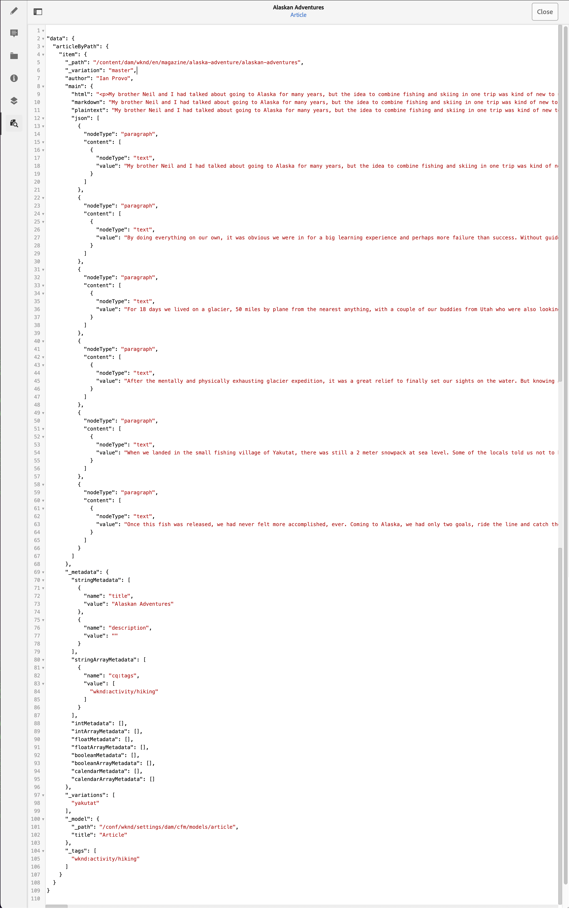

# Previsualización: representación JSON {#preview-json-representation}

AEM Al desarrollar los modelos para fragmentos de contenido como parte de su implementación sin encabezado de, puede utilizar el editor de fragmentos de contenido para ver la salida JSON de muestra para un fragmento de contenido, según un modelo. Por ejemplo, para hacerse una idea del aspecto que tendrá el resultado final. Esto podría resultar útil al validar la estructura JSON del modelo, quizá con contenido de muestra predeterminado por tipo de datos.

Uso del icono **Previsualizar**:

Puede ver la representación JSON del fragmento actual. Por ejemplo:

<!--
**Copy URL** lets you copy to clipboard the URL for either author or publish.
-->
