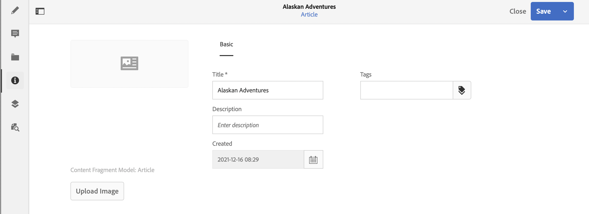

# Metadatos: Propiedades del fragmento {#metadata-fragment-properties}

Consulte cómo puede ver y editar las propiedades de los metadatos de los fragmentos de contenido en AEM para ajustar el contenido sin encabezado.

## Edición de propiedades/metadatos {#editing-properties-meta-data}

Puede ver y editar los metadatos (propiedades) de los fragmentos de contenido:

1. En la consola **Assets** vaya a la ubicación del fragmento de contenido.
2. O bien:

   * Seleccione [**Ver propiedades** para abrir los cuadros de diálogo](/help/assets/manage-assets.md#editing-properties). Una vez abierto para su visualización, también puede editarlo.
   * Abra el fragmento de contenido para editarlo y, a continuación, seleccione **Metadatos** en el panel lateral.

   

3. La pestaña **Básico** proporciona opciones que puede ver o editar:

   * Miniatura, para la cual puede **Cargar imagen**
   * **El** modo de fragmento de contenido indica el modelo utilizado para crear el fragmento actual
   * **Título**
   * **Descripción**
   * **Etiquetas**
      *  Las etiquetas son especialmente potentes a la hora de organizar los fragmentos, ya que se pueden utilizar para la clasificación de contenido y la taxonomía. Las etiquetas se pueden utilizar para encontrar contenido (mediante etiquetas) y aplicar operaciones por lotes.
Por ejemplo, puede etiquetar fragmentos relevantes como &quot;lanzamiento de Navidad&quot; para permitir solo explorarlos como un subconjunto o copiarlos para usarlos con otro lanzamiento futuro en una nueva carpeta.
   * Creado (solo visualización)
   
