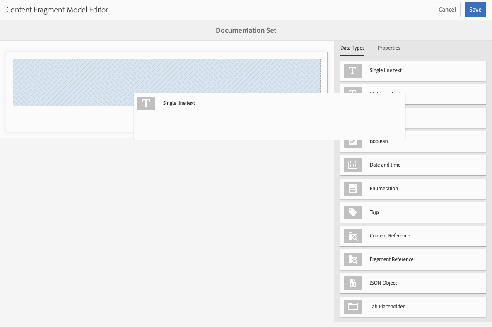
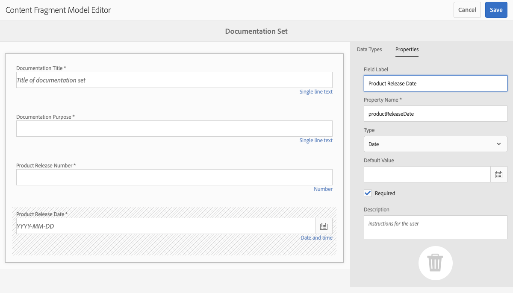
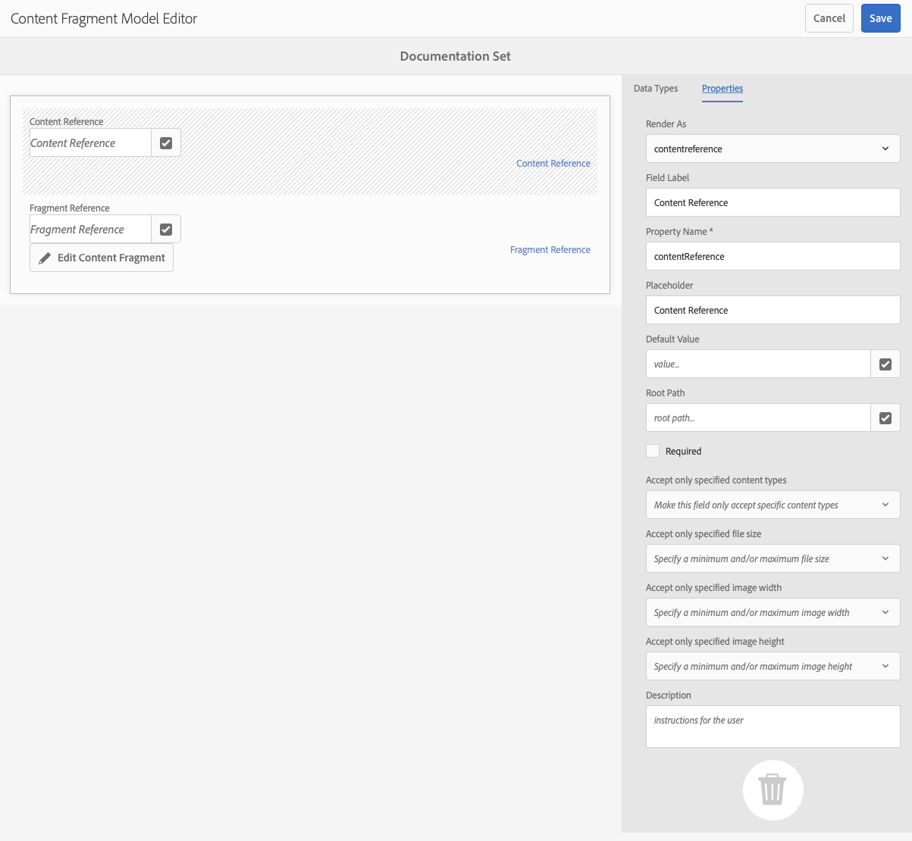
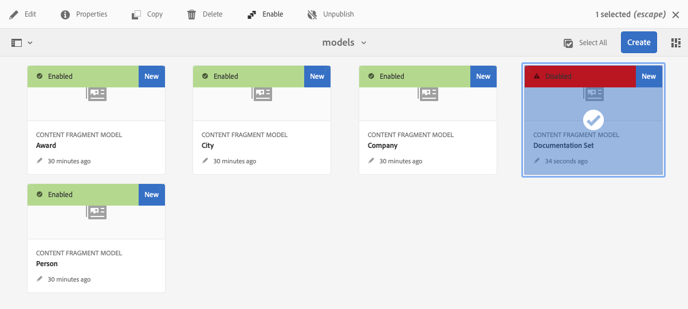

# Modelos de fragmento de contenido {#content-fragment-models}

Los modelos de fragmentos de contenido de AEM definen la estructura del contenido de sus [fragmentos de contenido](/help/assets/content-fragments/content-fragments.md), que sirven como base del contenido sin encabezado.

Para utilizar modelos de fragmentos de contenido, puede:

1. [Habilite la funcionalidad de modelo de fragmento de contenido para su instancia](/help/assets/content-fragments/content-fragments-configuration-browser.md).
1. [Cree](#creating-a-content-fragment-model) y [configure](#defining-your-content-fragment-model) sus modelos de fragmentos de contenido.
1. [Habilite los modelos de fragmentos de contenido](#enabling-disabling-a-content-fragment-model) para usarlos al crear fragmentos de contenido.
1. [Permita los modelos de fragmentos de contenido en las carpetas de recursos necesarias](#allowing-content-fragment-models-assets-folder) configurando **Políticas**.

## Creación de un modelo de fragmento de contenido {#creating-a-content-fragment-model}

1. Vaya a **Herramientas**, **Assets** y, a continuación, abra **Modelos de fragmentos de contenido**.
1. Vaya a la carpeta adecuada para su [configuración](/help/assets/content-fragments/content-fragments-configuration-browser.md).
1. Use **Crear** para abrir el asistente.

   >[!CAUTION]
   >
   >Si no se ha habilitado el uso de [modelos de fragmentos de contenido](/help/assets/content-fragments/content-fragments-configuration-browser.md), la opción **Crear** no estará disponible.

1. Especifique el **Título del modelo**. También puede agregar **Etiquetas**, una **Descripción** y seleccionar **Habilitar modelo** para [habilitar el modelo](#enabling-disabling-a-content-fragment-model) si es necesario.

   

1. Use **Crear** para guardar el modelo vacío. Un mensaje indica el éxito de la acción. Puede seleccionar **Abrir** para editar inmediatamente el modelo o **Listo** para volver a la consola.

## Definición del modelo de fragmento de contenido {#defining-your-content-fragment-model}

El modelo de fragmento de contenido define de manera efectiva la estructura de los fragmentos de contenido resultantes mediante una selección de **[Tipos de datos](#data-types)**. Con el editor de modelos puede añadir instancias de los tipos de datos y, a continuación, configurarlos para crear los campos obligatorios.

>[!CAUTION]
>
>Editar un modelo de fragmento de contenido existente puede afectar a los fragmentos dependientes.

1. Vaya a **Herramientas**, **Assets** y, a continuación, abra **Modelos de fragmentos de contenido**.

1. Vaya a la carpeta que contiene el modelo de fragmento de contenido.

1. Abra el modelo necesario para **Editar**; utilice la acción rápida o seleccione el modelo y, después, la acción en la barra de herramientas.

   Una vez abierto, el editor de modelos muestra lo siguiente:

   * A la izquierda: los campos ya definidos.
   * A la derecha: los **Tipos de datos** disponibles para crear campos (y **Propiedades** para su uso una vez creados los campos)

   >[!NOTE]
   >
   >Cuando un campo es **Obligatorio**, la **Etiqueta** indicada en el panel izquierdo se marca con un asterisco (**&#42;**).

   

1. **Adición de un campo**

   * Arrastre un tipo de datos requerido a la ubicación requerida para un campo.

     

   * Una vez agregado un campo al modelo, el panel derecho muestra las **Propiedades** que se pueden definir para ese tipo de datos en particular. Aquí puede definir lo que se requiere para ese campo.

      * Muchas propiedades se explican por sí mismas; para obtener más información, consulte [Propiedades](#properties).
      * Escribir una **Etiqueta de campo** autocompleta **Nombre de propiedad**, si está vacío, y se puede actualizar de forma manual posteriormente.

        >[!CAUTION]
        >
        Al actualizar manualmente la propiedad **Nombre de propiedad** para un tipo de datos, los nombres deben contener solo caracteres latinos, dígitos numéricos y guiones bajos &quot;_&quot; como carácter especial.
        >
        Si los modelos creados en versiones anteriores de AEM contienen caracteres no permitidos, elimínelos o actualícelos.

     Por ejemplo:

     

1. **Eliminación de un campo**

   Seleccione el campo requerido y, a continuación, haga clic en el icono de la papelera. Se le solicitará que confirme la acción.

   

1. Añada todos los campos obligatorios y defina las propiedades relacionadas, según sea necesario. Por ejemplo:

   

1. Seleccione **Guardar** para mantener la definición.

## Tipos de datos {#data-types}

Hay disponible una selección de tipos de datos para definir el modelo:

* **Texto de línea única**
   * Añada uno o más campos de una sola línea de texto; se puede definir la longitud máxima
* **Texto multilínea**
   * Un área de texto que puede ser Texto enriquecido, Texto sin formato o Markdown

     >[!NOTE]
     >
     Por motivos de rendimiento, no se recomienda tener más de diez campos de texto enriquecido en un modelo.
     >
     Si es necesario, se recomienda usar [fragmentos de contenido anidados](#fragment-reference-nested-fragments).

* **Número**
   * Adición de uno o más campos numéricos
* **Booleana**
   * Adición de una casilla de verificación booleana
* **Fecha y hora**
   * Adición de una fecha u hora
* **Lista desglosada**
   * Agregar un conjunto de casillas de verificación, botones de opción o campos desplegables
* **Etiquetas**
   * Permite a los autores de fragmentos acceder y seleccionar áreas de etiquetas
* **Referencia de contenido**
   * Referencias a otros contenidos, de cualquier tipo; se pueden usar para [crear contenido anidado](#using-references-to-form-nested-content)
   * Si se hace referencia a una imagen, puede optar por mostrar una miniatura
* **Referencia a fragmento**
   * Referencias a otros fragmentos de contenido; se pueden usar para [crear contenido anidado](#using-references-to-form-nested-content)
   * El tipo de datos se puede configurar para que los autores de fragmentos puedan hacer lo siguiente:
      * Editar directamente el fragmento al que se hace referencia.
      * Crear un nuevo fragmento de contenido basado en el modelo apropiado
* **Objeto JSON**
   * Permite al autor del fragmento de contenido introducir la sintaxis JSON en los elementos correspondientes de un fragmento.
      * Para permitir que AEM almacene el JSON directo que ha copiado y pegado desde otro servicio.
      * El JSON se pasará y se emitirá como JSON en GraphQL.
      * Incluye resaltado de sintaxis JSON, autocompletado y resaltado de errores en el editor de fragmentos de contenido.
* **Marcador de posición de pestaña**
   * Permite la introducción de pestañas para utilizarlas al editar el contenido del fragmento de contenido.
Esto se muestra como un divisor en el editor de modelos, que separa las secciones de la lista de tipos de datos de contenido. Cada instancia representa el inicio de una nueva pestaña.
En el editor de fragmentos, cada instancia aparecerá como una pestaña.

     >[!NOTE]
     >
     Este tipo de datos se utiliza exclusivamente para dar formato; el esquema AEM GraphQL lo ignora.

## Propiedades {#properties}

Muchas propiedades se explican por sí mismas; para otras, a continuación se proporcionan detalles adicionales:


* **Nombre de propiedad**

  Al actualizar manualmente esta propiedad para un tipo de datos, los nombres **debe** contener *solamente* caracteres latinos, dígitos numéricos y guiones bajos &quot;_&quot; como carácter especial.

  >[!CAUTION]
  >
  Si los modelos creados en versiones anteriores de AEM contienen caracteres no permitidos, elimínelos o actualícelos.

* **Representar como**
Las distintas opciones para realizar/procesar el campo en un fragmento. A menudo, esto le permite definir si el autor verá una sola instancia del campo o si se le permitirá crear varias instancias.

* **Etiqueta de campo**
La introducción de **Etiqueta de campo** genera automáticamente un **Nombre de propiedad**, que se puede actualizar de forma manual si es necesario.

* **Validación**
La validación básica está disponible mediante mecanismos como la propiedad **Requerido**. Algunos tipos de datos tienen campos de validación adicionales. Consulte [Validación](#validation) para obtener más información.

* Para el tipo de datos **Texto multilínea** es posible definir el **tipo predeterminado** como el siguiente:

   * **Texto enriquecido**
   * **Markdown**
   * **Texto sin formato**

  Si no se especifica, el valor predeterminado **Texto enriquecido** es el empleado para este campo.

  Cambiar el **tipo predeterminado** en un modelo de fragmento de contenido solo surte efecto en un fragmento de contenido existente relacionado después de que ese fragmento se abra en el editor y se guarde.

* **Único**
El contenido (para el campo específico) debe ser único en todos los fragmentos de contenido creados a partir del modelo actual.

  Se utiliza para garantizar que los autores de contenido no puedan repetir el contenido ya añadido en otro fragmento del mismo modelo.

  Por ejemplo, un campo de **Texto de una sola línea** llamado `Country` en el modelo de fragmentos de contenido no puede tener el valor `Japan` en dos fragmentos de contenido dependientes. Se emitirá una advertencia cuando se intente la segunda instancia.

  >[!NOTE]
  >
  La unicidad se garantiza por cada raíz de idioma.

  >[!NOTE]
  >
  Las variaciones pueden tener el mismo valor *único* como variaciones del mismo fragmento, pero no del mismo valor que se utiliza en cualquier variación de otros fragmentos.

* Consulte **[Referencia de contenido](#content-reference)** para obtener más información acerca de ese tipo de datos específico y sus propiedades.

* Consulte **[Referencia a fragmento (fragmentos anidados)](#fragment-reference-nested-fragments)** para obtener más información acerca de ese tipo de datos específico y sus propiedades.

<!--
* **Translatable**
  Checking the **Translatable** checkbox on a field in the Content Fragment Model editor does the following:

  * Ensures that the field's property name is added to the translation configuration, context `/content/dam/<sites-configuration>`, if not already present. 
  * For GraphQL: sets a `<translatable>` property on the Content Fragment field to `yes`, to allow GraphQL query filter for JSON output with only translatable content.
-->

## Validación {#validation}

Varios tipos de datos ahora incluyen la posibilidad de definir los requisitos de validación cuando el contenido se introduce en el fragmento resultante:

* **Texto de línea única**
   * Compare con un regex predefinido.
* **Número**
   * Compruebe si hay valores específicos.
* **Referencia de contenido**
   * Pruebe tipos de contenido específicos.
   * Solo se puede hacer referencia a los recursos con un tamaño de archivo especificado o más pequeño.
   * Solo se puede hacer referencia a las imágenes con un intervalo predefinido de anchura o altura (en píxeles).
* **Referencia a fragmento**
   * Pruebe un modelo de fragmento de contenido específico.

## Uso de referencias para formar contenido anidado {#using-references-to-form-nested-content}

Los fragmentos de contenido pueden formar contenido anidado mediante cualquiera de los siguientes tipos de datos:

* **[Referencia de contenido](#content-reference)**
   * Proporciona una sencilla referencia a otro contenido; de cualquier tipo.
   * Se puede configurar para una o varias referencias (en el fragmento resultante).

* **[Referencia a fragmento](#fragment-reference-nested-fragments)** (fragmentos anidados)
   * Hace referencia a otros fragmentos, según los modelos específicos definidos.
   * Permite incluir o recuperar datos estructurados.

     >[!NOTE]
     >
     Este método es de particular interés con [Entrega de contenido sin encabezado mediante fragmentos de contenido con GraphQL](/help/assets/content-fragments/content-fragments-graphql.md).
   * Se puede configurar para una o varias referencias (en el fragmento resultante).

>[!NOTE]
>
AEM tiene una protección contra recurrencias para lo siguiente:
>
* Referencias de contenido
Esto evita que el usuario agregue una referencia al fragmento actual. Esto puede dar lugar a un cuadro de diálogo vacío del selector de referencia a fragmento.
>
* Referencias a fragmento en GraphQL
Si crea una consulta profunda que devuelve varios fragmentos de contenido referenciados entre sí, devolverá un valor nulo en la primera ocurrencia.

### Referencia de contenido {#content-reference}

La referencia de contenido permite procesar contenido de otra fuente; por ejemplo, una imagen o un fragmento de contenido.

Además de las propiedades estándar, puede especificar las siguentes:

* La **Ruta raíz** para cualquier contenido referenciado
* Los tipos de contenido a los que se puede hacer referencia
* Las limitaciones de los tamaños de archivo
* Si se hace referencia a una imagen:
   * Mostrar miniatura
   * Restricciones de imagen de altura y anchura



### Referencia a fragmento (fragmentos anidados) {#fragment-reference-nested-fragments}

La referencia a fragmento hace referencia a uno o más fragmentos de contenido. Esta función es de especial interés cuando se recupera contenido para utilizarlo en la aplicación, ya que le permite recuperar datos estructurados con varias capas.

Por ejemplo:

* Un modelo que define los detalles de un empleado, entre los que se incluyen:
   * Una referencia al modelo que define al empleador (compañía).

```xml
type EmployeeModel {
    name: String
    firstName: String
    company: CompanyModel
}

type CompanyModel {
    name: String
    street: String
    city: String
}
```

>[!NOTE]
>
Esto es de particular interés en [Entrega de contenido sin encabezado mediante fragmentos de contenido con GraphQL](/help/assets/content-fragments/content-fragments-graphql.md).

Además de las propiedades estándar, puede definir las siguientes:

* **Procesar como**:

   * **Multicampo**: el autor del fragmento puede crear varias referencias individuales.

   * **fragmentreference**: permite al autor del fragmento seleccionar una sola referencia a un fragmento.

* **Tipo de modelo:**
sueden seleccionar varios modelos. Al crear el fragmento de contenido, cualquier fragmento al que se haga referencia debe haberse creado mediante estos modelos.

* **Ruta raíz:**
Esto especifica una ruta raíz para los fragmentos a los que se hace referencia.

* **Permitir creación de fragmentos**

  Esto permite al autor del fragmento crear un fragmento basado en el modelo adecuado.

   * **fragmentreferencecomposite**: permite al autor del fragmento crear un compuesto seleccionando varios fragmentos.

  

>[!NOTE]
>
Existe un mecanismo de protección contra la recurrencia. Prohíbe que el usuario seleccione el fragmento de contenido actual en la Referencia a fragmento. Esto puede dar lugar a un cuadro de diálogo vacío del selector de referencia a fragmento.
>
También existe una protección contra la recurrencia para las referencias a fragmento en GraphQL. Si crea una consulta profunda en dos fragmentos de contenido que se hacen referencia entre sí, devolverá un valor nulo.

## Activación o desactivación de un modelo de fragmento de contenido {#enabling-disabling-a-content-fragment-model}

Para tener un control total sobre el uso de los modelos de fragmentos de contenido, estos tienen un estado que puede establecer.

### Activación de un modelo de fragmento de contenido {#enabling-a-content-fragment-model}

Una vez creado un modelo, debe habilitarse para que:

* Está disponible para su selección al crear un fragmento de contenido.
* Se puede hacer referencia a ella desde un modelo de fragmento de contenido.
* Está disponible para GraphQL, por lo que se genera el esquema.

Para habilitar un modelo marcado como lo siguiente:

* **Borrador**: nuevo (nunca habilitado).
* **Deshabilitado** : se ha deshabilitado.

Puede usar la opción **Habilitar** desde:

* La barra de herramientas superior, cuando se selecciona el Modelo requerido.
* La Acción rápida correspondiente (pase el ratón sobre el Modelo requerido).



### Desactivación de un modelo de fragmento de contenido {#disabling-a-content-fragment-model}

Un modelo también se puede desactivar para que:

* El modelo ya no esté disponible como base para la creación de *nuevos* fragmentos de contenido.
* Sin embargo:
   * El esquema de GraphQL se sigue generando y aún se puede consultar (para evitar afectar a la API de JSON).
   * Cualquier fragmento de contenido basado en el modelo se puede consultar y devolver desde el extremo de GraphQL.
* Ya no se puede hacer referencia al modelo, pero las referencias existentes no se tocan y aún se pueden consultar y devolver desde el extremo GraphQL.

Para deshabilitar un modelo marcado como **Habilitado**, use la opción **Deshabilitar** desde:

* La barra de herramientas superior, cuando se selecciona el Modelo requerido.
* La Acción rápida correspondiente (pase el ratón sobre el Modelo requerido).


## Permitir modelos de fragmento de contenido en la carpeta de recursos {#allowing-content-fragment-models-assets-folder}

Para implementar el control de contenido, puede configurar **Políticas** en una carpeta de Assets para controlar qué modelos de fragmentos de contenido están permitidos para la creación de fragmentos en esa carpeta.

>[!NOTE]
>
El mecanismo es similar a [permitir plantillas de página](/help/sites-authoring/templates.md#allowing-a-template-author) para una página, y sus elementos secundarios, en propiedades avanzadas de una página.

Para configurar las **Directivas** para **Modelos de fragmento de contenido permitidos**:

1. Navegar y abrir **Propiedades** para la carpeta de recursos necesaria.

1. Abra la pestaña **Directivas**, donde puede configurar lo siguiente:

   * **Heredado de`<folder>`**

     Las directivas se heredan automáticamente al crear carpetas secundarias; la directiva se puede reconfigurar (y la herencia se rompe) si las subcarpetas necesitan permitir modelos diferentes de la carpeta principal.

   * **Modelos de fragmento de contenido permitidos por ruta**

     Se pueden permitir varios modelos.

   * **Modelos de fragmento de contenido permitidos por etiquetas**

     Se pueden permitir varios modelos.

   

1. **Guardar** cualquier cambio.

Los modelos de fragmento de contenido permitidos para una carpeta se resuelven de la siguiente manera:

* Las **Directivas** para los **Modelos de fragmento de contenido permitidos**.
* Si está vacío, intente determinar la directiva utilizando las reglas de herencia.
* Si la cadena de herencia no proporciona un resultado, consulte la configuración de **Cloud Services** para esa carpeta (primero directamente y luego mediante herencia).
* Si ninguno de los anteriores proporciona ningún resultado, no hay modelos permitidos para esa carpeta.

## Eliminación de un modelo de fragmento de contenido {#deleting-a-content-fragment-model}

>[!CAUTION]
>
La eliminación de un modelo de fragmento de contenido puede afectar a los fragmentos dependientes.

Para eliminar un modelo de fragmento de contenido, haga lo siguiente:

1. Vaya a **Herramientas**, **Assets** y, a continuación, abra **Modelos de fragmentos de contenido**.

1. Vaya a la carpeta que contiene el modelo de fragmento de contenido.
1. Seleccione el modelo, seguido de **Eliminar** en la barra de herramientas.

   >[!NOTE]
   >
   Si se hace referencia al modelo, se envía una advertencia. Tome las medidas adecuadas.

## Publicación de un modelo de fragmento de contenido {#publishing-a-content-fragment-model}

Los modelos de fragmento de contenido deben publicarse cuando se publican fragmentos de contenido dependientes, o antes de hacerlo.

Para publicar un modelo de fragmento de contenido, haga lo siguiente:

1. Vaya a **Herramientas**, **Assets** y, a continuación, abra **Modelos de fragmentos de contenido**.

1. Vaya a la carpeta que contiene el modelo de fragmento de contenido.
1. Seleccione el modelo, seguido de **Publicación** en la barra de herramientas.
El estado publicado se indica en la consola.

   >[!NOTE]
   >
   Si publica un fragmento de contenido para el que el modelo aún no se ha publicado, la lista de selección lo indica y el modelo se publica con el fragmento.

## Cancelación de la publicación de un modelo de fragmento de contenido {#unpublishing-a-content-fragment-model}

Los modelos de fragmento de contenido se pueden cancelar si ningún fragmento hace referencia a ellos.

Para cancelar la publicación de un modelo de fragmento de contenido:

1. Vaya a **Herramientas**, **Assets** y, a continuación, abra **Modelos de fragmentos de contenido**.

1. Vaya a la carpeta que contiene el modelo de fragmento de contenido.
1. Seleccione el modelo, seguido de **Cancelar la publicación** en la barra de herramientas.
El estado publicado se indica en la consola.

## Modelo de fragmento de contenido: propiedades {#content-fragment-model-properties}

Puede editar las **Propiedades** de un modelo de fragmento de contenido:

* **Básico**
   * **Título de modelo**
   * **Etiquetas**
   * **Descripción**
   * **Cargar imagen**
