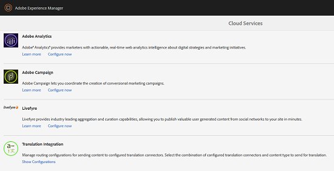
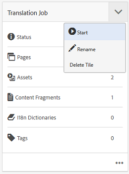
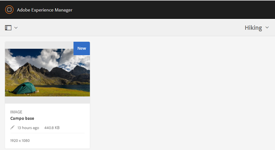

# Creación de proyectos de traducción para fragmentos de contenido {#creating-translation-projects-for-content-fragments}

Además de los recursos, Adobe Experience Manager (AEM) Assets admite flujos de trabajo de copia de idioma para [fragmentos de contenido](/help/assets/content-fragments/content-fragments.md) (incluidas las variaciones). No se requiere optimización adicional para ejecutar flujos de trabajo de copia de idioma en fragmentos de contenido. En cada flujo de trabajo, se envía todo el fragmento de contenido para su traducción.

Los tipos de flujos de trabajo que se pueden ejecutar en fragmentos de contenido son exactamente similares a los tipos de flujo de trabajo que se ejecutan para los recursos. Además, las opciones disponibles en cada tipo de flujo de trabajo coinciden con las opciones disponibles en los tipos de flujos de trabajo correspondientes para los recursos.

Puede ejecutar los siguientes tipos de flujos de trabajo de copia de idioma en los fragmentos de contenido:

**Crear y traducir**

En este flujo de trabajo, los fragmentos de contenido que se van a traducir se copian en la raíz del idioma al que se desea traducir. Además, según las opciones que elija, se crea un proyecto de traducción para los fragmentos de contenido en la consola Proyectos . Según la configuración, el proyecto de traducción se puede iniciar manualmente o se le puede permitir que se ejecute automáticamente en cuanto se cree el proyecto de traducción.

**Actualizar copias de idioma**

Cuando se actualiza o modifica el fragmento de contenido de origen, es necesario volver a traducir el fragmento de contenido específico de la configuración regional o del idioma correspondiente. El flujo de trabajo de copia de idioma de actualización traduce un grupo adicional de fragmentos de contenido y lo incluye en una copia de idioma para una configuración regional concreta. En este caso, los fragmentos de contenido traducidos se añaden a la carpeta de destino que ya contiene fragmentos de contenido traducidos anteriormente.

## Crear y traducir flujo de trabajo {#create-and-translate-workflow}

El flujo de trabajo Crear y traducir incluye las siguientes opciones. Los pasos de procedimiento asociados con cada opción son similares a los asociados con la opción correspondiente para los recursos.

* Crear solo estructura: Para ver los pasos del procedimiento, consulte [Crear estructura solo para los recursos](translation-projects.md#create-structure-only).
* Cree un nuevo proyecto de traducción: Para ver los pasos del procedimiento, consulte [Creación de un nuevo proyecto de traducción para los recursos](translation-projects.md#create-a-new-translation-project).
* Agregue al proyecto de traducción existente: Para ver los pasos del procedimiento, consulte [Agregar a un proyecto de traducción existente para los recursos](translation-projects.md#add-to-existing-translation-project).

## Actualizar flujo de trabajo de copias de idioma {#update-language-copies-workflow}

El flujo de trabajo Update language Copies incluye las siguientes opciones. Los pasos de procedimiento asociados con cada opción son similares a los asociados con la opción correspondiente para los recursos.

* Cree un nuevo proyecto de traducción: Para ver los pasos del procedimiento, consulte [Creación de un nuevo proyecto de traducción para assets](translation-projects.md#create-a-new-translation-project) (flujo de trabajo de actualización).
* Agregue al proyecto de traducción existente: Para ver los pasos del procedimiento, consulte [Agregar a un proyecto de traducción existente para recursos](translation-projects.md#add-to-existing-translation-project) (flujo de trabajo de actualización).

También puede crear copias de idioma temporales para fragmentos de forma similar a como crea copias temporales para los recursos. Para obtener más información, consulte [Creación de copias de idioma temporales para assets](translation-projects.md#creating-temporary-language-copies).

## Traducción de fragmentos de medios mixtos {#translating-mixed-media-fragments}

AEM permite traducir fragmentos de contenido que incluyen varios tipos de recursos de medios y colecciones. Si traduce un fragmento de contenido que incluye recursos en línea, las copias traducidas de estos recursos se almacenan en la raíz del idioma de destino.

Si el fragmento de contenido incluye una colección, los recursos de la colección se traducen junto con el fragmento de contenido. Las copias traducidas de los recursos se almacenan en la raíz del idioma de destino correspondiente en una ubicación que coincide con la ubicación física de los recursos de origen en la raíz del idioma de origen.

Para poder traducir fragmentos de contenido que incluyen medios mixtos, edite primero el marco de traducción predeterminado para permitir la traducción de recursos en línea y colecciones asociadas con fragmentos de contenido.

1. Pulse o haga clic en el logotipo de AEM y vaya a **[!UICONTROL Herramientas > Implementación > Cloud Services]**.
1. Busque **[!UICONTROL Translation Integration]** en **[!UICONTROL Adobe Marketing Cloud]** y pulse o haga clic en **[!UICONTROL Mostrar configuraciones]**.

   

1. En la lista de configuraciones disponibles, pulse o haga clic en **[!UICONTROL Configuración predeterminada (Configuración de integración de traducción)]** para abrir la página **[!UICONTROL Configuración predeterminada]**.

   

1. Haga clic en **[!UICONTROL Editar]** en la barra de herramientas para mostrar el cuadro de diálogo **[!UICONTROL Configuración de traducción]**.

   

1. Vaya a la pestaña **[!UICONTROL Assets]** y elija **[!UICONTROL Recursos de medios en línea y Colecciones asociadas]** en la lista **[!UICONTROL Translate Content Fragment Assets]**. Pulse o haga clic en **[!UICONTROL Aceptar]** para guardar los cambios.

   

1. Desde la carpeta raíz en inglés, abra un fragmento de contenido.

   

1. Pulse o haga clic en el icono **[!UICONTROL Insertar recurso]**.

   

1. Inserte un recurso en el fragmento de contenido.

   

1. Toque o haga clic en el icono **[!UICONTROL Asociar contenido]**.

   

1. Pulse o haga clic en **[!UICONTROL Asociar contenido]**.

   

1. Seleccione una colección e inclúyala en el fragmento de contenido. Pulse o haga clic en **[!UICONTROL Guardar]**.

   

1. Seleccione el fragmento de contenido y pulse o haga clic en el icono **[!UICONTROL GlobalBrowder]**.
1. Seleccione **[!UICONTROL Referencias]** en el menú para mostrar el panel **[!UICONTROL Referencias]**.

   

1. Pulse o haga clic en **[!UICONTROL Textos en idiomas]** en **[!UICONTROL Textos]** para mostrar los textos en idiomas.

   

1. Pulse o haga clic en **[!UICONTROL Crear y traducir]** en la parte inferior del panel para mostrar el cuadro de diálogo **[!UICONTROL Crear y traducir]**.

   

1. Seleccione el idioma de destino en la lista **[!UICONTROL Idiomas de destino]**.

   

1. Seleccione el tipo de proyecto de traducción en la lista **[!UICONTROL Proyecto]**.

   

1. Especifique el título del proyecto en el cuadro **[!UICONTROL Título del proyecto]** y, a continuación, toque o haga clic en **Crear**.

   

1. Vaya a la consola **[!UICONTROL Proyectos]** y abra la carpeta del proyecto para el proyecto de traducción que ha creado.

   

1. Toque o haga clic en el mosaico del proyecto para abrir la página de detalles del proyecto.

   

1. En el mosaico Trabajo de traducción , compruebe el número de recursos que desea traducir.
1. Desde el mosaico **[!UICONTROL Trabajo de traducción]**, inicie el trabajo de traducción.

   

1. Haga clic en los puntos suspensivos en la parte inferior del mosaico Trabajo de traducción para mostrar el estado del trabajo de traducción.

   

1. Toque o haga clic en el fragmento de contenido para comprobar la ruta de los recursos asociados traducidos.

   

1. Revise la copia de idioma de la colección en la consola Colecciones.

   

   Observe que solo se traduce el contenido de la colección. La colección en sí no está traducida.

1. Vaya a la ruta del recurso asociado traducido. Observe que el recurso traducido se almacena en la raíz del idioma de destino.

   

1. Vaya a los recursos de la colección que se traducen junto con el fragmento de contenido. Observe que las copias traducidas de los recursos se almacenan en la raíz del idioma de destino correspondiente.

   

   >[!NOTE]
   >
   >Los procedimientos para añadir un fragmento de contenido a un proyecto existente o para realizar flujos de trabajo de actualización son similares a los procedimientos correspondientes para los recursos. Para obtener orientación sobre estos procedimientos, consulte los procedimientos descritos para los activos.

