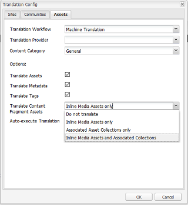
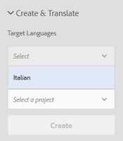

# Creación de proyectos de traducción para fragmentos de contenido {#creating-translation-projects-for-content-fragments}

Además de los recursos, Adobe Experience Manager AEM () Assets admite flujos de trabajo de copia de idioma para [fragmentos de contenido](/help/assets/content-fragments/content-fragments.md) (incluidas las variaciones). No se requiere ninguna optimización adicional para ejecutar flujos de trabajo de copia de idioma en fragmentos de contenido. En cada flujo de trabajo, todo el fragmento de contenido se envía para su traducción.

Los tipos de flujos de trabajo que se pueden ejecutar en fragmentos de contenido son exactamente similares a los tipos de flujo de trabajo que se ejecutan para los recursos. Además, las opciones disponibles dentro de cada tipo de flujo de trabajo coinciden con las opciones disponibles en los tipos de flujos de trabajo correspondientes para los recursos.

Puede ejecutar los siguientes tipos de flujos de trabajo de copia de idioma en fragmentos de contenido:

**Crear y traducir**

En este flujo de trabajo, los fragmentos de contenido que se van a traducir se copian en la raíz del idioma al que desea traducirlo. Además, según las opciones que elija, se creará un proyecto de traducción para los fragmentos de contenido en la consola Proyectos. Según la configuración, el proyecto de traducción se puede iniciar manualmente o se puede permitir que se ejecute automáticamente en cuanto se cree el proyecto de traducción.

**Actualizar copias de idioma**

Cuando se actualiza o modifica el fragmento de contenido de origen, el fragmento de contenido específico de la configuración regional o del idioma correspondiente requiere una nueva traducción. El flujo de trabajo de actualización de copias de idioma traduce un grupo adicional de fragmentos de contenido e lo incluye en una copia de idioma para una configuración regional determinada. En este caso, los fragmentos de contenido traducidos se añaden a la carpeta de destino que ya contiene fragmentos de contenido traducidos anteriormente.

## Crear y traducir flujo de trabajo {#create-and-translate-workflow}

El flujo de trabajo Crear y traducir incluye las siguientes opciones. Los pasos de procedimiento asociados a cada opción son similares a los asociados a la opción correspondiente para los recursos.

* Crear solo estructura: para ver los pasos del procedimiento, consulte [Crear estructura solo para recursos](translation-projects.md#create-structure-only).
* Crear un proyecto de traducción: para ver los pasos del procedimiento, consulte [Creación de un proyecto de traducción para recursos](translation-projects.md#create-a-new-translation-project).
* Agregar a un proyecto de traducción existente: para ver los pasos del procedimiento, consulte [Añadir a un proyecto de traducción existente para recursos](translation-projects.md#add-to-existing-translation-project).

## Actualizar flujo de trabajo de copias de idioma {#update-language-copies-workflow}

El flujo de trabajo Actualizar copias de idioma incluye las siguientes opciones. Los pasos de procedimiento asociados a cada opción son similares a los asociados a la opción correspondiente para los recursos.

* Crear un proyecto de traducción: para ver los pasos del procedimiento, consulte [Creación de un proyecto de traducción para recursos](translation-projects.md#create-a-new-translation-project) (flujo de trabajo de actualización).
* Agregar a un proyecto de traducción existente: para ver los pasos del procedimiento, consulte [Añadir a un proyecto de traducción existente para recursos](translation-projects.md#add-to-existing-translation-project) (flujo de trabajo de actualización).

También puede crear copias de idioma temporales para fragmentos de forma similar a como crea copias temporales para los recursos. Para obtener más información, consulte [Creación de copias de idioma temporales para los recursos](translation-projects.md#creating-temporary-language-copies).

## Traducción de fragmentos de medios mixtos {#translating-mixed-media-fragments}

AEM traducir fragmentos de contenido que incluyen varios tipos de recursos y colecciones de medios. Si traduce un fragmento de contenido que incluye recursos en línea, las copias traducidas de estos recursos se almacenan en la raíz del idioma de destino.

Si el fragmento de contenido incluye una colección, los recursos de la colección se traducen junto con el fragmento de contenido. Las copias traducidas de los recursos se almacenan dentro de la raíz del idioma de destino adecuado en una ubicación que coincida con la ubicación física de los recursos de origen debajo de la raíz del idioma de origen.

Para poder traducir fragmentos de contenido que incluyan medios mixtos, primero edite el marco de trabajo de traducción predeterminado para habilitar la traducción de recursos en línea y colecciones asociadas con fragmentos de contenido.

1. AEM Haga clic en el logotipo de la y vaya a **[!UICONTROL Herramientas > Implementación > Cloud Service]**.
1. Localizar **[!UICONTROL Integración de traducción]** bajo **[!UICONTROL Adobe Marketing Cloud]** y haga clic en **[!UICONTROL Mostrar configuraciones]**.

   

1. En la lista de configuraciones disponibles, haga clic en **[!UICONTROL Configuración predeterminada (configuración de integración de traducción)]** para abrir **[!UICONTROL Configuración predeterminada]** página.

   

1. Clic **[!UICONTROL Editar]** en la barra de herramientas para mostrar el **[!UICONTROL Configuración de traducción]** diálogo.

   

1. Vaya a **[!UICONTROL Assets]** y elija **[!UICONTROL Recursos de medios en línea y colecciones asociadas]** desde el **[!UICONTROL Traducir recursos de fragmentos de contenido]** lista. Clic **[!UICONTROL OK]** para guardar los cambios.

   

1. En la carpeta raíz en inglés, abra un fragmento de contenido.

   

1. Haga clic en **[!UICONTROL Insertar recurso]** icono.

   

1. Inserte un recurso en el fragmento de contenido.

   

1. Haga clic en **[!UICONTROL Asociar contenido]** icono.

   

1. Clic **[!UICONTROL Asociar contenido]**.

   

1. Seleccione una colección e inclúyala en el fragmento de contenido. Haga clic en **[!UICONTROL Guardar]**.

   

1. Seleccione el fragmento de contenido y haga clic en **[!UICONTROL GlobalNav]** icono.
1. Seleccionar **[!UICONTROL Referencias]** en el menú para mostrar el **[!UICONTROL Referencias]** panel.

   

1. Clic **[!UICONTROL Copias de idioma]** bajo **[!UICONTROL Copias]** para mostrar las copias de idioma.

   

1. Clic **[!UICONTROL Crear y traducir]** desde en la parte inferior del panel para mostrar el **[!UICONTROL Crear y traducir]** diálogo.

   

1. Seleccione el idioma de destino en la **[!UICONTROL Idiomas de destino]** lista.

   

1. Seleccione el tipo de proyecto de traducción en la **[!UICONTROL Proyecto]** lista.

   

1. Especifique el título del proyecto en la **[!UICONTROL Título del proyecto]** y haga clic en **Crear**.

   

1. Vaya a **[!UICONTROL Proyectos]** y abra la carpeta del proyecto para el proyecto de traducción que ha creado.

   

1. Haga clic en el mosaico del proyecto para abrir la página de detalles del proyecto.

   

1. En el mosaico Trabajo de traducción, compruebe el número de recursos que desea traducir.
1. Desde el **[!UICONTROL Trabajo de traducción]** mosaico, inicie el trabajo de traducción.

   

1. Haga clic en los puntos suspensivos en la parte inferior del mosaico Trabajo de traducción para mostrar el estado del trabajo de traducción.

   

1. Haga clic en el fragmento de contenido para comprobar la ruta de los recursos asociados traducidos.

   

1. Revise la copia de idioma de la colección en la consola Colecciones.

   

   Observe que solo se traduce el contenido de la colección. La colección en sí no está traducida.

1. Vaya a la ruta del recurso asociado traducido. Observe que el recurso traducido se almacena en la raíz del idioma de destino.

   

1. Vaya a los recursos de la colección que se traducen junto con el fragmento de contenido. Observe que las copias traducidas de los recursos se almacenan en la raíz del idioma de destino correspondiente.

   

   >[!NOTE]
   >
   >Los procedimientos para añadir un fragmento de contenido a un proyecto existente o para realizar flujos de trabajo de actualización son similares a los procedimientos correspondientes para los recursos. Para obtener instrucciones sobre estos procedimientos, consulte los procedimientos descritos para los activos.
