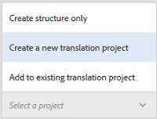

# Creación de proyectos de traducción para fragmentos de contenido {#creating-translation-projects-for-content-fragments}

Además de los recursos, Recursos Adobe Experience Manager (AEM) admite flujos de trabajo de copia de idioma para fragmentos [de](content-fragments.md) contenido (incluidas las variaciones). No se requiere optimización adicional para ejecutar flujos de trabajo de copia de idioma en fragmentos de contenido. En cada flujo de trabajo, se envía todo el fragmento de contenido para su traducción.

Los tipos de flujos de trabajo que se pueden ejecutar en fragmentos de contenido son exactamente similares a los tipos de flujo de trabajo que se ejecutan para los recursos. Además, las opciones disponibles en cada tipo de flujo de trabajo coinciden con las opciones disponibles en los tipos de flujos de trabajo correspondientes para los recursos.

Puede ejecutar los siguientes tipos de flujos de trabajo de copia de idioma en los fragmentos de contenido:

**Crear y traducir**

En este flujo de trabajo, los fragmentos de contenido que se van a traducir se copian en la raíz de idioma del idioma al que se desea traducir. Además, según las opciones que elija, se crea un proyecto de traducción para los fragmentos de contenido en la consola Proyectos. Según la configuración, el proyecto de traducción puede iniciarse manualmente o puede ejecutarse automáticamente en cuanto se cree el proyecto de traducción.

**Actualizar copias de idioma**

Cuando se actualiza o modifica el fragmento de contenido de origen, el fragmento de contenido específico de configuración regional/idioma correspondiente requiere una retraducción. El flujo de trabajo de copia del idioma de actualización traduce un grupo adicional de fragmentos de contenido y lo incluye en una copia del idioma para una configuración regional concreta. En este caso, los fragmentos de contenido traducido se agregan a la carpeta de destino que ya contiene fragmentos de contenido previamente traducidos.

## Crear y traducir flujos de trabajo {#create-and-translate-workflow}

El flujo de trabajo Crear y traducir incluye las siguientes opciones. Los pasos de procedimiento asociados con cada opción son similares a los asociados con la opción correspondiente para los activos.

* Crear solamente estructura: Para ver los pasos del procedimiento, consulte [Crear estructura solo para recursos](translation-projects.md#create-structure-only).
* Cree un nuevo proyecto de traducción: Para ver los pasos del procedimiento, consulte [Creación de un nuevo proyecto de traducción para recursos](translation-projects.md#create-a-new-translation-project).
* Agregar al proyecto de traducción existente: Para ver los pasos del procedimiento, consulte [Agregar a proyecto de traducción existente para recursos](translation-projects.md#add-to-existing-translation-project).

## Actualizar flujo de trabajo de copias de idioma {#update-language-copies-workflow}

El flujo de trabajo de actualización de copias de idioma incluye las siguientes opciones. Los pasos de procedimiento asociados con cada opción son similares a los asociados con la opción correspondiente para los activos.

* Cree un nuevo proyecto de traducción: Para ver los pasos del procedimiento, consulte [Creación de un nuevo proyecto de traducción para recursos](translation-projects.md#create-a-new-translation-project) (flujo de trabajo de actualización).
* Agregar al proyecto de traducción existente: Para ver los pasos del procedimiento, consulte [Agregar al proyecto de traducción existente para recursos](translation-projects.md#add-to-existing-translation-project) (flujo de trabajo de actualización).

También puede crear copias de idioma temporales para fragmentos de forma similar a como crea copias temporales para los recursos. Para obtener más información, consulte [Creación de copias de idioma temporales para recursos](translation-projects.md#creating-temporary-language-copies).

## Traducción de fragmentos de medios mixtos {#translating-mixed-media-fragments}

AEM le permite traducir fragmentos de contenido que incluyen varios tipos de recursos de medios y colecciones. Si traduce un fragmento de contenido que incluye recursos en línea, las copias traducidas de estos recursos se almacenan en la raíz del idioma de destino.

Si el fragmento de contenido incluye una colección, los recursos de la colección se traducen junto con el fragmento de contenido. Las copias traducidas de los recursos se almacenan en la raíz del idioma de destino correspondiente en una ubicación que coincide con la ubicación física de los recursos de origen en la raíz del idioma de origen.

Para poder traducir fragmentos de contenido que incluyen medios mixtos, primero edite el marco de traducción predeterminado para permitir la traducción de recursos en línea y colecciones asociadas con fragmentos de contenido.

1. Toque o haga clic en el logotipo de AEM y vaya a **[!UICONTROL Herramientas > Implementación > Servicios]** de nube.
1. Busque Integración **[!UICONTROL de]** traducción en **[!UICONTROL Adobe Marketing Cloud]** y toque o haga clic en **[!UICONTROL Mostrar configuraciones]**.

   

1. En la lista de configuraciones disponibles, toque o haga clic en Configuración **[!UICONTROL predeterminada (Configuración de integración de traducción)]** para abrir la página Configuración **** predeterminada.

   

1. Haga clic en **[!UICONTROL Editar]** en la barra de herramientas para mostrar el cuadro de diálogo Configuración **[!UICONTROL de]** traducción.

   

1. Vaya a la ficha **[!UICONTROL Recursos]** y seleccione Recursos de medios **[!UICONTROL en línea y Colecciones]** asociadas en la lista **[!UICONTROL Traducir recursos]** de fragmentos de contenido. Click/tap **[!UICONTROL OK]** to save the changes.

   

1. En la carpeta raíz inglesa, abra un fragmento de contenido.

   

1. Toque o haga clic en el icono **[!UICONTROL Insertar recurso]** .

   

1. Inserte un recurso en el fragmento de contenido.

   

1. Toque o haga clic en el icono **[!UICONTROL Asociar contenido]** .

   

1. Toque o haga clic en **[!UICONTROL Asociar contenido]**.

   

1. Seleccione una colección e inclúyala en el fragmento de contenido. Click/tap **[!UICONTROL Save]**.

   

1. Seleccione el fragmento de contenido y toque o haga clic en el icono de **[!UICONTROL GlobalNav]** .
1. Seleccione **[!UICONTROL Referencias]** en el menú para mostrar el panel **[!UICONTROL Referencias]** .

   

1. Toque o haga clic en **[!UICONTROL Copias]** de idioma en **[!UICONTROL Copias]** para mostrar las copias de idioma.

   

1. Toque o haga clic en **[!UICONTROL Crear y traducir]** en la parte inferior del panel para mostrar el cuadro de diálogo **[!UICONTROL Crear y traducir]** .

   

1. Seleccione el idioma de destino en la lista Idiomas **[!UICONTROL de]** destino.

   

1. Seleccione el tipo de proyecto de traducción en la lista **[!UICONTROL Proyecto]** .

   

1. Especifique el título del proyecto en el cuadro Título **[!UICONTROL del]** proyecto y, a continuación, toque o haga clic en **Crear**.

   

1. Vaya a la consola **[!UICONTROL Proyectos]** y abra la carpeta del proyecto para el proyecto de traducción que ha creado.

   

1. Toque o haga clic en el mosaico del proyecto para abrir la página de detalles del proyecto.

   

1. En el mosaico Trabajo de traducción, compruebe el número de recursos que se van a traducir.
1. En el mosaico Trabajo **[!UICONTROL de]** traducción, inicie el trabajo de traducción.

   

1. Haga clic en las elipses en la parte inferior del mosaico Trabajo de traducción para mostrar el estado del trabajo de traducción.

   

1. Toque o haga clic en el fragmento de contenido para comprobar la ruta de los recursos asociados traducidos.

   

1. Revise la copia de idioma de la colección en la consola Colecciones.

   

   Tenga en cuenta que solo se traduce el contenido de la colección. La colección en sí no está traducida.

1. Vaya a la ruta del recurso asociado traducido. Observe que el recurso traducido se almacena en la raíz del idioma de destino.

   

1. Vaya a los recursos de la colección que se traducen junto con el fragmento de contenido. Observe que las copias traducidas de los recursos se almacenan en la raíz del idioma de destino correspondiente.

   

   >[!NOTE]
   >
   >Los procedimientos para agregar un fragmento de contenido a un proyecto existente o para realizar flujos de trabajo de actualización son similares a los procedimientos correspondientes para los recursos. Para obtener información sobre estos procedimientos, consulte los procedimientos descritos para los activos.

