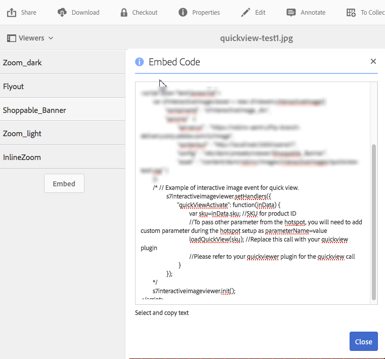

# Uso de las vistas rápidas para crear ventanas emergentes personalizadas {#using-quickviews-to-create-custom-pop-ups}

La vista rápida predeterminada se utiliza en las experiencias de comercio electrónico, en las que se muestra una ventana emergente con información del producto para dirigir una compra. Sin embargo, puede almacenar en déclencheur contenido personalizado para que se muestre en las ventanas emergentes. En función del visor, esta funcionalidad permite a los usuarios pulsar en un punto interactivo, una imagen en miniatura o un mapa de imágenes para ver información o contenido relacionado.

Las vistas rápidas son compatibles con los siguientes visores en Dynamic Media:

* Imágenes interactivas (zonas interactivas en las que se puede hacer clic)
* Vídeo interactivo (imágenes en miniatura en las que se puede hacer clic durante la reproducción del vídeo)
* Banners de carrusel (zonas interactivas o mapas de imágenes en las que se puede hacer clic)

Aunque la funcionalidad de cada visor es diferente, el proceso de creación de una vista rápida es el mismo en los tres visualizadores admitidos.

**Para usar las vistas rápidas para crear ventanas emergentes personalizadas:**

1. Cree una vista rápida para un recurso cargado.

   Normalmente, se crea una vista rápida al mismo tiempo que se edita un recurso para utilizarlo con el visualizador que se está utilizando.

   <table>
    <tbody>
    <tr>
    <td><strong>Visor que utiliza</strong></td>
    <td><strong>Complete estos pasos si desea crear la vista rápida</strong></td>
    </tr>
    <tr>
    <td>Imágenes interactivas</td>
    <td><a href="/help/assets/interactive-images.md#adding-hotspots-to-an-image-banner" target="_blank">Adición de zonas interactivas a un titular de imagen</a>.</td>
    </tr>
    <tr>
    <td>Vídeos interactivos</td>
    <td><a href="/help/assets/interactive-videos.md#adding-interactivity-to-your-video" target="_blank">Añadir interactividad al vídeo</a>.</td>
    </tr>
    <tr>
    <td>Banner de carrusel</td>
    <td><a href="/help/assets/carousel-banners.md#adding-hotspots-or-image-maps-to-an-image-banner" target="_blank">Adición de zonas interactivas o mapas de imagen a un banner</a>.<br /> </td>
    </tr>
    </tbody>
   </table>

1. Obtenga el código incrustado del visor para integrar el visor en el sitio web.

   <table>
    <tbody>
    <tr>
    <td><strong>Visor que utiliza</strong><br /> </td>
    <td><strong>Complete estos pasos si desea integrar el visor con el sitio web</strong></td>
    </tr>
    <tr>
    <td>Imagen interactiva</td>
    <td><a href="/help/assets/interactive-images.md#integrating-an-interactive-image-with-your-website" target="_blank">Integración de una imagen interactiva con el sitio web</a>.<br /> </td>
    </tr>
    <tr>
    <td>Vídeo interactivo<br /> </td>
    <td><a href="/help/assets/interactive-videos.md#integrating-an-interactive-video-with-your-website" target="_blank">Integración de un vídeo interactivo con el sitio web</a>.<br /> </td>
    </tr>
    <tr>
    <td>Banner de carrusel</td>
    <td><a href="/help/assets/carousel-banners.md#adding-a-carousel-banner-to-your-website-page" target="_blank">Adición de un banner de carrusel a la página</a> de su sitio web.<br /> </td>
    </tr>
    </tbody>
   </table>

1. El visor que utilice ahora debe saber cómo utilizar la vista rápida.

   El visor utiliza un controlador denominado `QuickViewActive`.

   ****
EjemploSupongamos que utiliza el siguiente código incrustado de ejemplo en la página web para una imagen interactiva:

   

   El controlador se carga en el visor mediante `setHandlers`:

   `*viewerInstance*.setHandlers({ *handler 1*, *handler 2*}, ...`

   **Utilizando el ejemplo de código incrustado de ejemplo de arriba, hay el siguiente código:**

   ```xml
   s7interactiveimageviewer.setHandlers({
       quickViewActivate": function(inData) {
           var sku=inData.sku;
           var genericVariable1=inData.genericVariable1;
           var genericVariable2=inData.genericVariable2;
          loadQuickView(sku,genericVariable1,genericVariable2);
       }
   })
   ```

   Obtenga más información sobre el método `setHandlers()` en lo siguiente:

   * Visor de imágenes interactivo: [https://experienceleague.adobe.com/docs/dynamic-media-developer-resources/library/viewers-for-aem-assets-only/interactive-images/jsapi-interactive-image/r-html5-aem-int-image-viewer-javascriptapiref-sethandlers.html](https://experienceleague.adobe.com/docs/dynamic-media-developer-resources/library/viewers-for-aem-assets-only/interactive-images/jsapi-interactive-image/r-html5-aem-int-image-viewer-javascriptapiref-sethandlers.html)
   * Visor de vídeo interactivo: [https://experienceleague.adobe.com/docs/dynamic-media-developer-resources/library/viewers-for-aem-assets-only/interactive-video/jsapi-interactive-video/r-html5-aem-int-video-javascriptapiref-sethandlers.html](https://experienceleague.adobe.com/docs/dynamic-media-developer-resources/library/viewers-for-aem-assets-only/interactive-video/jsapi-interactive-video/r-html5-aem-int-video-javascriptapiref-sethandlers.html)

1. Ahora debe configurar el controlador `quickViewActivate`.

   El controlador `quickViewActivate` controla las vistas rápidas en el visor. El controlador contiene la lista de variables y las llamadas de función que se utilizan con la vista rápida. El código incrustado proporciona una asignación para la variable de SKU establecida en la vista rápida y una llamada de función `loadQuickView` de ejemplo.

   **Variables**
mappingMap para usar en su página web con el valor SKU y las variables genéricas contenidas en Quickview:

   `var *variable1*= inData.*quickviewVariable*`

   El código incrustado proporcionado tiene una asignación de muestra para la variable SKU:

   `var sku=inData.sku`

   Asigne también variables adicionales desde la vista rápida, como se muestra a continuación:

   ```
   var <i>variable2</i>= inData.<i>quickviewVariable2</i>
    var <i>variable3</i>= inData.<i>quickviewVariable3</i>
   ```

   **Función**
callEl controlador también requiere una llamada a la función para que funcione Quickview. Se supone que la página host puede acceder a la función. El código incrustado proporciona una llamada de función de ejemplo:

   `loadQuickView(sku)`

   La llamada a la función de ejemplo supone que la función `loadQuickView()` existe y es accesible.

   Obtenga más información sobre el método `quickViewActivate` en lo siguiente:

   * Visor de imágenes interactivo: [https://experienceleague.adobe.com/docs/dynamic-media-developer-resources/library/viewers-for-aem-assets-only/interactive-images/c-html5-aem-interactive-image-event-callbacks.html](https://experienceleague.adobe.com/docs/dynamic-media-developer-resources/library/viewers-for-aem-assets-only/interactive-images/c-html5-aem-interactive-image-event-callbacks.html)
   * Visor de vídeo interactivo: [https://experienceleague.adobe.com/docs/dynamic-media-developer-resources/library/viewers-for-aem-assets-only/interactive-video/c-html5-aem-int-video-event-callbacks.html](https://experienceleague.adobe.com/docs/dynamic-media-developer-resources/library/viewers-for-aem-assets-only/interactive-video/c-html5-aem-int-video-event-callbacks.html)
   * Compatibilidad con datos interactivos en el visor de vídeo interactivo: [https://experienceleague.adobe.com/docs/dynamic-media-developer-resources/library/viewers-for-aem-assets-only/interactive-video/c-html5-aem-int-video-int-data-support.html](https://experienceleague.adobe.com/docs/dynamic-media-developer-resources/library/viewers-for-aem-assets-only/interactive-video/c-html5-aem-int-video-int-data-support.html)

1. Haga lo siguiente:

   * Descomente la sección setHandlers del código incrustado.
   * Asigne cualquier variable adicional contenida en la vista rápida.

      * Actualice la llamada `loadQuickView(sku,*var1*,*var2*)` si está agregando variables adicionales.
   * Cree una función `loadQuickView` () simple en la página, fuera del visor.

      Por ejemplo, a continuación se escribe el valor de SKU en la consola del explorador:

   ```xml
   function loadQuickView(sku){
       console.log ("quickview sku value is " + sku);
   }
   ```

   * Cargue una página HTML de prueba en un servidor web y ábrala.

      Con las variables de la vista rápida asignadas y la llamada a la función establecida, la consola del explorador escribe el valor de la variable en la consola del explorador mediante la función de ejemplo proporcionada.


1. Ahora puede utilizar una función para invocar una ventana emergente simple en la vista rápida. El siguiente ejemplo utiliza un `DIV` para una ventana emergente.
1. Establezca el estilo de la ventana emergente `DIV` de la siguiente manera. Añada su propio estilo adicional como desee.

   ```xml
   <style type="text/css">
       #quickview_div{
           position: absolute;
           z-index: 99999999;
           display: none;
       }
   </style>
   ```

1. Coloque la ventana emergente `DIV` en el cuerpo de la página HTML.

   Uno de los elementos se configura con un ID que se actualiza con el valor SKU cuando el usuario invoca una vista rápida. El ejemplo también incluye un botón simple para volver a ocultar la ventana emergente una vez que esté visible.

   ```xml
   <div id="quickview_div" >
       <table>
           <tr><td><input id="btnClosePopup" type="button" value="Close"        onclick='document.getElementById("quickview_div").style.display="none"' /><br /></td></tr>
           <tr><td>SKU</td><td><input type="text" id="txtSku" name="txtSku"></td></tr>
       </table>
   </div>
   ```

1. Agregue una función para poder actualizar el valor de SKU en la ventana emergente; haga visible la ventana emergente reemplazando la función simple creada en el paso 5. con lo siguiente:

   ```xml
   <script type="text/javascript">
       function loadQuickView(sku){
           document.getElementById("txtSku").setAttribute("value",sku); // write sku value
           document.getElementById("quickview_div").style.display="block"; // show popup
       }
   </script>
   ```

1. Cargue una página HTML de prueba en el servidor web y ábrala. El visor muestra la ventana emergente `DIV` cuando un usuario invoca una vista rápida.
1. **Cómo mostrar la ventana emergente personalizada en modo de pantalla completa**

   Algunos visores, como el de vídeo interactivo, admiten la visualización en modo de pantalla completa. Sin embargo, el uso de la ventana emergente como se describe en los pasos anteriores hace que se muestre detrás del visor mientras está en modo de pantalla completa.

   Para que la pantalla emergente se muestre tanto en el modo estándar como en el de pantalla completa, se adjunta la ventana emergente al contenedor del visor. Utilice un segundo método de controlador, `initComplete`.

   El controlador `initComplete` se invoca después de inicializar el visor.

   ```xml
   "initComplete":function() { code block }
   ```

   Obtenga más información sobre el método `init()` en lo siguiente:

   * Visor de imágenes interactivo: [https://experienceleague.adobe.com/docs/dynamic-media-developer-resources/library/viewers-for-aem-assets-only/interactive-images/jsapi-interactive-image/r-html5-aem-int-image-viewer-javascriptapiref-init.html](https://experienceleague.adobe.com/docs/dynamic-media-developer-resources/library/viewers-for-aem-assets-only/interactive-images/jsapi-interactive-image/r-html5-aem-int-image-viewer-javascriptapiref-init.html)
   * Visor de vídeo interactivo: [https://experienceleague.adobe.com/docs/dynamic-media-developer-resources/library/viewers-for-aem-assets-only/interactive-video/jsapi-interactive-video/r-html5-aem-int-video-javascriptapiref-init.html](https://experienceleague.adobe.com/docs/dynamic-media-developer-resources/library/viewers-for-aem-assets-only/interactive-video/jsapi-interactive-video/r-html5-aem-int-video-javascriptapiref-init.html)

1. Para adjuntar al visor la ventana emergente descrita en los pasos anteriores, utilice el siguiente código:

   ```xml
   "initComplete":function() {
       var popup = document.getElementById('quickview_div');
       popup.parentNode.removeChild(popup);
       var sdkContainerId = s7interactivevideoviewer.getComponent("container").getInnerContainerId();
       var inner_container = document.getElementById(sdkContainerId);
       inner_container.appendChild(popup);
   }
   ```

   En el código anterior, se hizo lo siguiente:

   * Se ha identificado la ventana emergente personalizada.
   * Se ha eliminado del DOM.
   * Se ha identificado el contenedor del visor.
   * Se adjuntó la ventana emergente al contenedor del visor.

1. Todo el código de setHandlers se parece al siguiente (se ha utilizado el visualizador de vídeo interactivo):

   ```xml
   s7interactivevideoviewer.setHandlers({
       "quickViewActivate": function(inData) {
           var sku=inData.sku;
           loadQuickView(sku);
   
       },
       "initComplete":function() {
           var popup = document.getElementById('quickview_div'); // get custom quick view container
           popup.parentNode.removeChild(popup); // remove it from current DOM
           var sdkContainerId = s7interactivevideoviewer.getComponent("container").getInnerContainerId();
           var inner_container = document.getElementById(sdkContainerId);
           inner_container.appendChild(popup);
       }
   });
   ```

1. Una vez cargados los controladores, se inicializa el visor:

   `*viewerInstance.*init()`

   ****
EjemploEste ejemplo utiliza el visualizador de imágenes interactivo.

   `s7interactiveimageviewer.init()`

   Después de incrustar el visor en la página host, asegúrese de que la instancia del visor se crea y los controladores se cargan antes de que se invoque el visor con `init()`.
