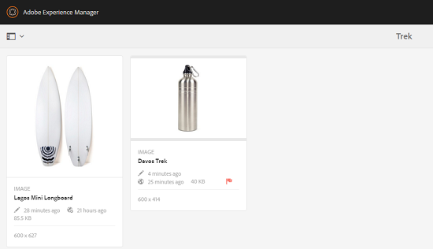
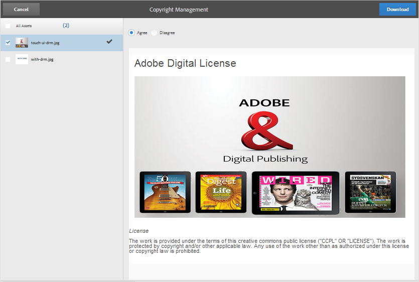

# Digital Rights Management para los recursos {#digital-rights-management-in-assets}

Los recursos digitales suelen estar asociados a una licencia que especifica los términos y la duración del uso. Debido a que [!DNL Adobe Experience Manager Assets] está completamente integrado con la plataforma [!DNL Experience Manager], puede administrar de manera eficiente la información de caducidad de recursos y los estados de recursos. También puede asociar información de licencias con recursos.

## Caducidad del recurso {#asset-expiration}

La caducidad de los activos es una forma eficaz de aplicar los requisitos de licencia de los activos. Garantiza que el recurso publicado no se publique cuando caduque, lo que evita la posibilidad de cualquier infracción de licencia. Un usuario sin permisos de administrador no puede editar, copiar, mover, publicar ni descargar un recurso caducado.

Puede vista del estado de caducidad de un recurso en la consola [!DNL Assets] tanto en la tarjeta como en las vistas de lista.

*Figura: En la vista de lista, la columna   Estado muestra la pancarta   Caducada.*

Puede vista el estado de caducidad de un recurso en la [!UICONTROL línea de tiempo] en el carril izquierdo.

>[!NOTE]
>
>La fecha de caducidad de un recurso se muestra de forma diferente para los usuarios de distintos horarios.

También puede vista el estado de caducidad de los recursos en el carril **[!UICONTROL References]**. Gestiona los estados de caducidad de los recursos y las relaciones entre los recursos compuestos y los subrecursos, colecciones y proyectos a los que se hace referencia.

1. Desplácese al recurso para el que desea realizar una vista haciendo referencia a páginas web y recursos compuestos.
1. Seleccione el recurso y abra **[!UICONTROL Referencias]** en el carril izquierdo. Para los recursos caducados, el carril [!UICONTROL References] muestra el estado de caducidad **[!UICONTROL El recurso caduca]** en la parte superior.

   

   Si el recurso tiene subrecursos caducados, el carril [!UICONTROL References] muestra el estado **[!UICONTROL Asset has Expired Sub-Assets]**.

   

### Buscar recursos caducados {#search-expired-assets}

Puede buscar recursos caducados, incluidos los subrecursos caducados, en el panel Buscar.

1. En la consola [!DNL Assets], haga clic en **[!UICONTROL Buscar]** en la barra de herramientas para mostrar el cuadro de búsqueda de Omniture.

1. Con el cursor en el cuadro Omniture, seleccione la tecla `Enter` para mostrar la página de resultados de búsqueda.
1. Abra el panel de búsqueda en el carril izquierdo. Haga clic en la opción **[!UICONTROL Estado de caducidad]** para expandirla.

   

1. Elija **[!UICONTROL Caducado]**. Solo se muestran los recursos caducados después de filtrar los resultados de la búsqueda.

Al elegir la opción **[!UICONTROL Caducado]**, la consola [!DNL Assets] solo muestra los recursos y subrecursos caducados a los que hacen referencia los recursos compuestos. Los recursos compuestos que hacen referencia a subrecursos caducados no se muestran inmediatamente después de que caduquen los subrecursos. En su lugar, se muestran después de que [!DNL Experience Manager] detecte que hacen referencia a subrecursos caducados la próxima vez que se ejecute el Planificador.

Si modifica la fecha de caducidad de un recurso publicado a una fecha anterior al ciclo de Planificador actual, el programa seguirá detectando este recurso como recurso caducado la próxima vez que se ejecute y reflejará su estado de forma acorde.

Además, si un fallo o error impide que el Planificador detecte los recursos caducados en el ciclo actual, el Planificador vuelve a examinar estos recursos en el siguiente ciclo y detecta su estado de caducidad.

Para habilitar la consola [!DNL Assets] para mostrar los recursos compuestos de referencia junto con los subrecursos caducados, configure un flujo de trabajo **[!UICONTROL Notificación de caducidad de Adobe CQ DAM]** en Configuration Manager [!DNL Experience Manager].

1. Abra el Administrador de configuración [!DNL Experience Manager].
1. Elija **[!UICONTROL Notificación de caducidad de Adobe CQ DAM]**. De forma predeterminada, **[!UICONTROL Planificador basado en tiempo]** está seleccionado, lo que programa un trabajo para comprobar en un momento específico si un recurso tiene subrecursos caducados. Una vez finalizado el trabajo, los recursos que tienen subrecursos caducados y recursos a los que se hace referencia se muestran como caducados en los resultados de la búsqueda.

1. Para ejecutar el trabajo periódicamente, desactive el campo **[!UICONTROL Regla de planificador basada en tiempo]** y modifique el tiempo en segundos en el campo **[!UICONTROL Programador periódico]**. Por ejemplo, la expresión de ejemplo `0 0 0 &ast; &ast; ?` desencadena el trabajo a las 00 horas.
1. Seleccione **[!UICONTROL enviar correo electrónico]** para recibir correos electrónicos cuando caduque un recurso.

   >[!NOTE]
   >
   >Solo el creador de recursos (la persona que carga un recurso concreto en [!DNL Assets]) recibe un correo electrónico cuando caduca el recurso. Consulte [cómo configurar la notificación por correo electrónico](/help/sites-administering/notification.md) para obtener más detalles sobre cómo configurar las notificaciones por correo electrónico en el nivel general [!DNL Experience Manager].

1. En el campo **[!UICONTROL Notificación previa en segundos]**, especifique el tiempo en segundos antes de que un recurso caduque cuando desee recibir una notificación con respecto a la caducidad. Los creadores de recursos reciben un mensaje antes de que caduque el recurso, en el que se les notifica que el recurso está a punto de caducar después de la hora especificada. Una vez caducado el recurso, recibirá otra notificación que confirma la caducidad. Además, los recursos caducados se desactivan.

1. Haga clic en **[!UICONTROL Guardar]**.

## Estados de recursos {#asset-states}

La consola [!DNL Assets] puede mostrar varios estados para los recursos. Según el estado actual de un recurso concreto, su vista de tarjeta muestra una etiqueta que describe su estado, por ejemplo, Caducado, Publicado, Aprobado, Rechazado, etc.

1. En la interfaz de usuario [!DNL Assets], seleccione un recurso.
1. Haga clic en **[!UICONTROL Publicar]** en la barra de herramientas. Si no ve la opción **Publicar** en la barra de herramientas, haga clic en **[!UICONTROL Más]** en la barra de herramientas y busque la opción **[!UICONTROL Publicar]** .
1. Elija **[!UICONTROL Publicar]** en el menú y, a continuación, cierre el cuadro de diálogo de confirmación.
1. Salga del modo de selección. El estado de publicación del recurso aparece en la parte inferior de la miniatura del recurso en la vista de tarjeta. En la vista de lista, la columna Publicado muestra la hora en que se publicó el recurso.

   

1. Para mostrar la página de detalles del recurso, en la interfaz [!DNL Assets], seleccione un recurso y haga clic en **[!UICONTROL Propiedades]** .

1. En la ficha [!UICONTROL Avanzado], establezca una fecha de caducidad para el recurso en el campo **[!UICONTROL Caduca]**.

   

   *Figura:  [!UICONTROL Ficha ] avanzada de la página   Propiedades del recurso para establecer la caducidad del recurso.*

1. Haga clic en **[!UICONTROL Guardar]** y, a continuación, haga clic en **[!UICONTROL Cerrar]** para mostrar la consola Recursos.
1. El estado de publicación del recurso indica un estado caducado en la parte inferior de la miniatura del recurso en la vista de tarjeta. En la vista de lista, el estado del recurso se muestra como **[!UICONTROL Caducado]**.

   

1. En la consola [!DNL Assets], seleccione una carpeta y cree una tarea de revisión en ella.
1. Revise y apruebe/rechace los recursos en la tarea de revisión y haga clic en **[!UICONTROL Completar]**.
1. Vaya a la carpeta para la que creó la tarea de revisión. El estado de los recursos aprobados/rechazados se muestra en la parte inferior de la vista de tarjetas. En la vista de lista, los estados de aprobación y caducidad se muestran en las columnas correspondientes.

   

1. Para buscar recursos en función de su estado, haga clic en **[!UICONTROL Buscar]**  para mostrar la barra de Omniture.
1. Seleccione `Return` y haga clic en [!DNL Experience Manager] para mostrar el panel de búsqueda.
1. En el panel de búsqueda, haga clic en **[!UICONTROL Estado de publicación]** y seleccione **[!UICONTROL Publicado]** para buscar recursos publicados en [!DNL Assets].

   

1. Haga clic en **[!UICONTROL Estado de aprobación]** y haga clic en la opción adecuada para buscar recursos aprobados o rechazados.

   

1. Para buscar recursos en función de su estado de caducidad, seleccione **[!UICONTROL Estado de caducidad]** en el panel Buscar y elija la opción adecuada.

   

1. También puede buscar recursos en función de una combinación de estados en varias facetas de búsqueda. Por ejemplo, puede buscar recursos publicados que hayan sido aprobados en una tarea de revisión y que aún no hayan caducado seleccionando las opciones correspondientes en las facetas de búsqueda.

   

## Digital Rights Management en [!DNL Assets] {#digital-rights-management-in-assets-1}

Esta función fuerza la aceptación del contrato de licencia antes de poder descargar un recurso con licencia desde [!DNL Adobe Experience Manager Assets].

Si selecciona un recurso protegido y hace clic en **[!UICONTROL Descargar]**, se le redirigirá a una página de licencia para aceptar el contrato de licencia. Si no acepta el contrato de licencia, la opción **[!UICONTROL Descargar]** no está disponible.

Si la selección contiene varios recursos protegidos, selecciónelos de uno en uno, acepte el contrato de licencia y continúe con la descarga del recurso.

Un recurso se considera protegido si se cumple cualquiera de estas condiciones:

* La propiedad de metadatos del recurso `xmpRights:WebStatement` señala la ruta de la página que contiene el contrato de licencia del recurso.
* El valor de la propiedad de metadatos del recurso `adobe_dam:restrictions` es un HTML sin procesar que especifica el contrato de licencia.

>[!NOTE]
>
>La ubicación `/etc/dam/drm/licenses` utilizada para almacenar licencias en versiones anteriores de [!DNL Experience Manager] está en desuso.
>
>Si crea o modifica páginas de licencia o las transfiere desde versiones anteriores [!DNL Experience Manager], Adobe recomienda almacenarlas en `/apps/settings/dam/drm/licenses` o `/conf/&ast;/settings/dam/drm/licenses`.

### Descargar recursos protegidos con DRM {#downloading-drm-assets}

1. En la vista de tarjeta, seleccione los recursos que desea descargar y haga clic en **[!UICONTROL Descargar]**.
1. En la página **[!UICONTROL Administración de derechos de autor]**, seleccione el recurso que desee descargar de la lista.
1. En el panel [!UICONTROL Licencia], elija **[!UICONTROL Aceptar]**. Aparece una marca de verificación junto al recurso. Haga clic en la opción **[!UICONTROL Descargar]**.

   >[!NOTE]
   >
   >La opción **[!UICONTROL Descargar]** sólo se habilita cuando se decide aceptar el contrato de licencia para un recurso protegido. Sin embargo, si la selección incluye recursos protegidos y no protegidos, solo se enumerarán en el panel los recursos protegidos y la opción **[!UICONTROL Descargar]** se habilitará para descargar los recursos no protegidos. Para aceptar simultáneamente acuerdos de licencia para varios recursos protegidos, seleccione los recursos de la lista y, a continuación, elija **[!UICONTROL Aceptar]**.

   

1. En el cuadro de diálogo, haga clic en **[!UICONTROL Descargar]** para descargar el recurso o sus representaciones.
