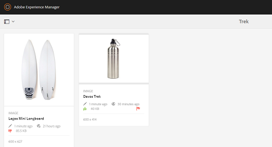

# Digital Rights Management para recursos {#digital-rights-management-in-assets}

| Versión | Vínculo del artículo |
| -------- | ---------------------------- |
| AEM as a Cloud Service | [Haga clic aquí](https://experienceleague.adobe.com/docs/experience-manager-cloud-service/content/assets/manage/drm.html?lang=en) |
| AEM 6.5 | Este artículo |

Los recursos digitales suelen estar asociados a una licencia que especifica los términos y la duración de uso. Porque [!DNL Adobe Experience Manager Assets] está totalmente integrado con el [!DNL Experience Manager] puede administrar de forma eficaz la información de caducidad y los estados de los recursos. También puede asociar la información de licencias con los recursos.

## Caducidad de recursos {#asset-expiration}

La caducidad de los recursos es una forma eficaz de aplicar los requisitos de licencia a los recursos. Garantiza que el recurso publicado se cancele la publicación cuando caduque, lo que evita la posibilidad de que se produzca cualquier infracción de licencia. Un usuario sin permisos de administrador no puede editar, copiar, mover, publicar ni descargar un recurso caducado.

Puede ver el estado de caducidad de un recurso en la variable [!DNL Assets] consola en las vistas de tarjeta y lista.

*Imagen: en la vista de lista, la variable [!UICONTROL Estado] muestra la columna [!UICONTROL Caducado] Banner.*

Puede ver el estado de caducidad de un recurso en la variable [!UICONTROL Cronología] en el carril izquierdo.

>[!NOTE]
>
>La fecha de caducidad de un recurso se muestra de forma diferente para los usuarios de diferentes zonas horarias.

También puede ver el estado de caducidad de los recursos en la **[!UICONTROL Referencias]** carril. Administra los estados de caducidad de los recursos y las relaciones entre los recursos compuestos y los recursos secundarios, las colecciones y los proyectos a los que se hace referencia.

1. Desplácese hasta el recurso para el que desee ver las páginas web de referencia y los recursos compuestos.
1. Seleccione el recurso y abra **[!UICONTROL Referencias]** en el carril izquierdo. Para los recursos caducados, la variable [!UICONTROL Referencias] carril muestra el estado de caducidad **[!UICONTROL El recurso ha caducado]** en la parte superior.

   

   Si el recurso tiene recursos secundarios caducados, la variable [!UICONTROL Referencias] carril muestra el estado **[!UICONTROL El recurso tiene recursos secundarios caducados]**.

   

### Buscar recursos caducados {#search-expired-assets}

Puede buscar recursos caducados, incluidos los subrecursos caducados en el panel Buscar.

1. En el [!DNL Assets] consola, haga clic en **[!UICONTROL Buscar]** en la barra de herramientas para mostrar el cuadro Omnisearch.

1. Con el cursor en el cuadro Omnisearch, seleccione la opción `Enter` para mostrar la página de resultados de la búsqueda.
1. Abra el panel de búsqueda en el carril izquierdo. Haga clic en **[!UICONTROL Estado de caducidad]** para expandirla.

   

1. Elegir **[!UICONTROL Caducado]**. Solo se muestran los recursos caducados después de filtrar los resultados de búsqueda.

Al elegir la variable **[!UICONTROL Caducado]** , la opción [!DNL Assets] La consola solo muestra los recursos caducados y los subrecursos a los que hacen referencia los recursos compuestos. Los recursos compuestos que hacen referencia a subrecursos caducados no se muestran inmediatamente después de que caduquen los subrecursos. Alternativamente, se muestran después de [!DNL Experience Manager] detecta que hacen referencia a recursos secundarios caducados la próxima vez que se ejecute el programador.

Si modifica la fecha de caducidad de un recurso publicado a una fecha anterior al ciclo de programación actual, la programación sigue detectando este recurso como caducado la próxima vez que se ejecute y refleja su estado en consecuencia.

Además, si un fallo o error impide que el programador detecte los recursos caducados en el ciclo actual, vuelve a examinarlos en el ciclo siguiente y detecta su estado caducado.

Para habilitar la variable [!DNL Assets] para mostrar los recursos compuestos de referencia junto con los subrecursos caducados, configure una **[!UICONTROL Notificación de caducidad de Adobe CQ DAM]** flujo de trabajo en [!DNL Experience Manager] Administrador de configuración.

1. Abrir [!DNL Experience Manager] Administrador de configuración.
1. Elegir **[!UICONTROL Notificación de caducidad de Adobe CQ DAM]**. De forma predeterminada, **[!UICONTROL Planificador basado en tiempo]** está seleccionado, lo que programa un trabajo para comprobar en un momento específico si un recurso tiene subrecursos caducados. Una vez finalizado el trabajo, los recursos que tienen recursos secundarios caducados y los recursos a los que se hace referencia se muestran como caducados en los resultados de búsqueda.

1. Para ejecutar el trabajo periódicamente, desactive el campo **[!UICONTROL Regla de planificador basada en tiempo]** y modifique el tiempo en segundos en el campo **[!UICONTROL Programador periódico]**. Por ejemplo, la expresión de ejemplo `0 0 0 * * ?` déclencheur el trabajo a las 00 horas.
1. Seleccionar **[!UICONTROL enviar correo electrónico]** para recibir correos electrónicos cuando caduca un recurso.

   >[!NOTE]
   >
   >Solo el creador de recursos (la persona que carga un recurso en particular en ) [!DNL Assets]) recibe un correo electrónico cuando caduca el recurso. Consulte [configuración de las notificaciones por correo electrónico](/help/sites-administering/notification.md) para obtener más información sobre la configuración de notificaciones por correo electrónico en general, [!DNL Experience Manager] nivel.

1. En el **[!UICONTROL Notificación previa en segundos]** , especifique el tiempo en segundos antes de la hora en que caduca un recurso cuando desee recibir una notificación sobre la caducidad. Los creadores de recursos reciben un mensaje antes de la caducidad del recurso en el que se le notifica que el recurso está a punto de caducar después del tiempo especificado. Una vez que caduque el recurso, recibirá otra notificación que confirmará la caducidad. Además, los recursos caducados se desactivan.

1. Haga clic en **[!UICONTROL Guardar]**.

## Estados de los recursos {#asset-states}

El [!DNL Assets] La consola de puede mostrar varios estados para los recursos. Según el estado actual de un recurso determinado, la vista de tarjeta muestra una etiqueta que describe su estado, por ejemplo, Caducado, Publicado, Aprobado, Rechazado, etc.

1. En el [!DNL Assets] interfaz de usuario, seleccione un recurso.
1. Clic **[!UICONTROL Publish]** en la barra de herramientas. Si no ve **Publish** en la barra de herramientas, haga clic en **[!UICONTROL Más]** en la barra de herramientas y busque **[!UICONTROL Publish]**  opción.
1. Elegir **[!UICONTROL Publish]** en el menú y cierre el cuadro de diálogo de confirmación.
1. Salga del modo de selección. El estado de publicación del recurso aparece en la parte inferior de la miniatura del recurso en la vista de tarjeta. En la vista de lista, la columna Publicado muestra la hora a la que se publicó el recurso.

   

1. Para mostrar la página de detalles del recurso, en [!DNL Assets] , seleccione un recurso y haga clic en **[!UICONTROL Propiedades]** .

1. En el [!UICONTROL Avanzadas] pestaña, establezca una fecha de caducidad para el recurso desde la pestaña **[!UICONTROL Caduca]** field.

   

   *Figura: [!UICONTROL Avanzadas] pestaña en el recurso [!UICONTROL Propiedades] para establecer la caducidad del recurso.*

1. Clic **[!UICONTROL Guardar]** y luego haga clic en **[!UICONTROL Cerrar]** para mostrar la consola Recursos.
1. El estado de publicación del recurso indica un estado caducado en la parte inferior de la miniatura del recurso en la vista de tarjeta. En la vista de lista, el estado del recurso se muestra como **[!UICONTROL Caducado]**.

   

1. En el [!DNL Assets] , seleccione una carpeta y cree una tarea de revisión en la carpeta.
1. Revise y apruebe/rechace los recursos en la tarea de revisión y haga clic en **[!UICONTROL Completar]**.
1. Vaya a la carpeta para la que creó la tarea de revisión. El estado de los recursos que aprobó o rechazó se muestra en la parte inferior de la vista de tarjeta. En la vista de lista, los estados de aprobación y caducidad se muestran en las columnas correspondientes.

   

1. Para buscar recursos según su estado, haga clic en **[!UICONTROL Buscar]**  para mostrar la barra Omnisearch.
1. Seleccionar `Return` y haga clic en [!DNL Experience Manager] para mostrar el panel de búsqueda.
1. En el panel de búsqueda, haga clic en **[!UICONTROL Estado de publicación]** y seleccione **[!UICONTROL Publicado]** para buscar recursos publicados en [!DNL Assets].

   

1. Clic **[!UICONTROL Estado de aprobación]** y haga clic en la opción adecuada para buscar recursos aprobados o rechazados.

   

1. Para buscar recursos en función de su estado de caducidad, seleccione **[!UICONTROL Estado de caducidad]** en el panel Buscar y elija la opción adecuada.

   

1. También puede buscar recursos en función de una combinación de estados en varias facetas de búsqueda. Por ejemplo, puede buscar recursos publicados que se hayan aprobado en una tarea de revisión y que aún no hayan caducado seleccionando las opciones adecuadas en las facetas de búsqueda.

   

## Digital Rights Management en [!DNL Assets] {#digital-rights-management-in-assets-1}

Esta función exige la aceptación del acuerdo de licencia antes de poder descargar un recurso con licencia desde [!DNL Adobe Experience Manager Assets].

Si selecciona un recurso protegido y hace clic en **[!UICONTROL Descargar]**, se le redirigirá a una página de licencia para aceptar el acuerdo de licencia. Si no acepta el acuerdo de licencia, la variable **[!UICONTROL Descargar]** La opción no está disponible.

Si la selección contiene varios recursos protegidos, seleccione un recurso a la vez, acepte el acuerdo de licencia y proceda a descargar el recurso.

Un activo se considera protegido si se cumple cualquiera de estas condiciones:

* La propiedad de metadatos del recurso `xmpRights:WebStatement` señala a la ruta de la página que contiene el acuerdo de licencia del recurso.
* El valor de la propiedad de metadatos del recurso `adobe_dam:restrictions` es un HTML sin procesar que especifica el acuerdo de licencia.

>[!NOTE]
>
>La ubicación. `/etc/dam/drm/licenses` se utiliza para almacenar licencias en versiones anteriores de [!DNL Experience Manager] está obsoleto.
>
>Si crea o modifica páginas de licencias, o las transfiere desde páginas anteriores [!DNL Experience Manager] Versiones de, Adobe recomienda almacenarlas en `/apps/settings/dam/drm/licenses` o `/conf/&ast;/settings/dam/drm/licenses`.

### Descarga de recursos protegidos por DRM {#downloading-drm-assets}

1. En la vista de tarjeta, seleccione los recursos que desee descargar y haga clic en **[!UICONTROL Descargar]**.
1. En la página **[!UICONTROL Administración de derechos de autor]**, seleccione el recurso que desee descargar de la lista.
1. En el [!UICONTROL Licencia] panel, elija **[!UICONTROL Aceptar]**. Aparece una marca de verificación junto al recurso. Haga clic en **[!UICONTROL Descargar]** opción.

   >[!NOTE]
   >
   >El **[!UICONTROL Descargar]** Esta opción solo se activa cuando se decide aceptar el contrato de licencia de un recurso protegido. Sin embargo, si la selección incluye recursos protegidos y no protegidos, solo los recursos protegidos aparecen en el panel y la variable **[!UICONTROL Descargar]** está activada para descargar los recursos no protegidos. Para aceptar simultáneamente acuerdos de licencia para varios recursos protegidos, seleccione los recursos de la lista y, a continuación, elija **[!UICONTROL Aceptar]**.

   

1. En el cuadro de diálogo, haga clic en **[!UICONTROL Descargar]** para descargar el recurso o sus representaciones.
