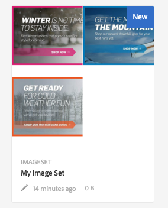

# Trabajo con Dynamic Media {#working-with-dynamic-media}

[Dynamic Media](https://business.adobe.com/products/experience-manager/assets/dynamic-media.html) ayuda a proporcionar bajo demanda recursos de marketing y mercadotecnia de rico contenido visual, escalados automáticamente para el consumo en la Web, dispositivos móviles y redes sociales. Con un conjunto de recursos de origen principales, Dynamic Media genera y ofrece múltiples variaciones de contenido enriquecido en tiempo real a través de su red global, escalable y optimizada para el rendimiento.

Dynamic Media proporciona experiencias de visualización interactivas, que incluyen zoom, giro de 360 grados y vídeo. Dynamic Media introduce de forma exclusiva los flujos de trabajo de la solución de administración de recursos digitales (Recursos) de Adobe Experience Manager para simplificar y agilizar el proceso de administración de campañas digitales.

<!-- >ARTICLE IS MISSING. GIVES 404 [!NOTE]
>
>A Community article is available on [Working with Adobe Experience Manager and Dynamic Media](https://helpx.adobe.com/experience-manager/using/aem_dynamic_media.html). -->

## Qué puede hacer con Dynamic Media {#what-you-can-do-with-dynamic-media}

Dynamic Media permite administrar los recursos antes de publicarlos. Cómo trabajar con recursos en general se explica en detalle en [Uso de recursos digitales](manage-assets.md). Los temas generales incluyen la carga, descarga, edición y publicación de recursos; ver y editar propiedades, y buscar recursos.

Las funciones solo de Dynamic Media incluyen lo siguiente:

* [Banner de carrusel](carousel-banners.md)
* [Conjuntos de imágenes](image-sets.md)
* [Imágenes interactivas](interactive-images.md)
* [Vídeos interactivos](interactive-videos.md)
* [Conjuntos de medios mixtos](mixed-media-sets.md)
* [Imágenes panorámicas](panoramic-images.md)

* [Conjuntos de giros](spin-sets.md)
* [Vídeo](video.md)
* [Envío de recursos de Dynamic Media](delivering-dynamic-media-assets.md)
* [Administración de recursos](managing-assets.md)
* [Uso de las vistas rápidas para crear ventanas emergentes personalizadas](custom-pop-ups.md)

Consulte también [Configuración de Dynamic Media](administering-dynamic-media.md).

>[!NOTE]
>
>Para comprender las diferencias entre usar Dynamic Media e integrar Dynamic Media Classic con Adobe Experience Manager, consulte [Integración de Dynamic Media Classic frente a Dynamic Media](/help/sites-administering/scene7.md#aem-scene-integration-versus-dynamic-media).

## Dynamic Media habilitado frente a Dynamic Media deshabilitado {#dynamic-media-on-versus-dynamic-media-off}

Puede saber si Dynamic Media está habilitado (activado) por las siguientes características:

* Las representaciones dinámicas están disponibles al descargar o previsualizar recursos.
* Hay disponibles conjuntos de imágenes, conjuntos de giros y conjuntos de medios mixtos.
* Se crean representaciones PTIFF.

Al hacer clic en un recurso de imagen, la vista del recurso es diferente con Dynamic Media [enabled](config-dynamic.md#enabling-dynamic-media). Dynamic Media utiliza los visores HTML5 bajo demanda.

### Representaciones dinámicas {#dynamic-renditions}

Las representaciones dinámicas, como los ajustes preestablecidos de imagen y visor (en **[!UICONTROL Dynamic]**), están disponibles cuando Dynamic Media está habilitado.

### Conjuntos de imágenes, conjuntos de giros, conjuntos de medios mixtos {#image-sets-spins-sets-mixed-media-sets}

Los conjuntos de imágenes, los conjuntos de giros y los conjuntos de medios mixtos están disponibles si Dynamic Media está activado.

### Representaciones PTIFF {#ptiff-renditions}

Los recursos habilitados para Dynamic Media incluyen `pyramid.tiffs`.

### Cambio en las vistas de recursos {#asset-views-change}

Con Dynamic Media habilitado, puede acercar y alejar haciendo clic en los botones `+` y `-`. También puede tocar o hacer clic en para acercar cierta área. Revertir le lleva a la versión original y puede crear la imagen a pantalla completa haciendo clic en las flechas diagonales. Dynamic Media habilitado tiene este aspecto:

Con Dynamic Media desactivado, puede acercar y alejar y revertir al tamaño original:

