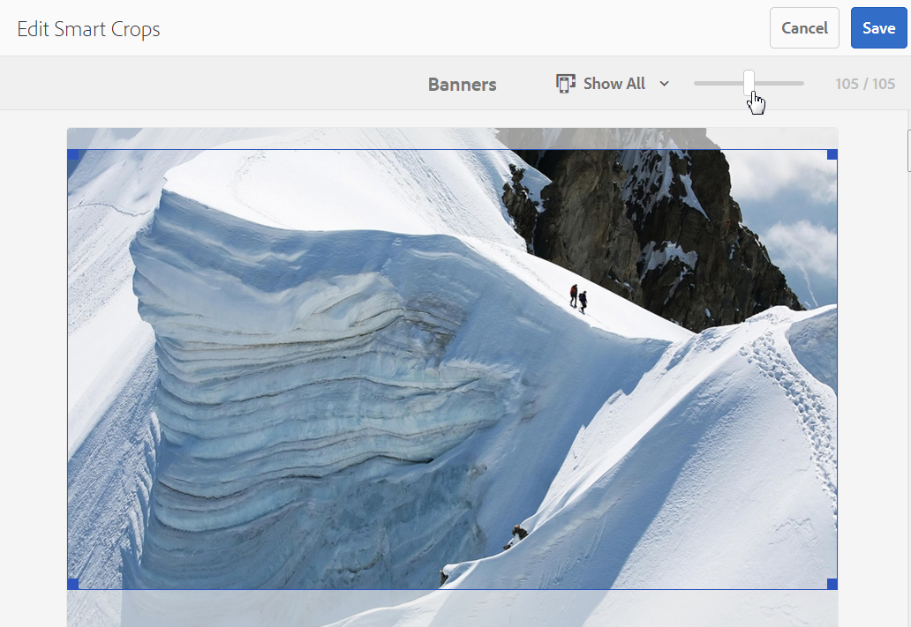
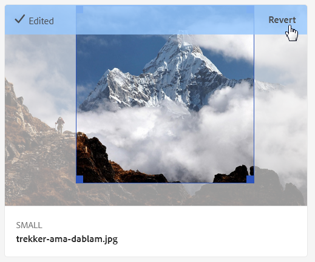

# Perfiles de imagen de Dynamic Media {#image-profiles}

Al cargar imágenes, puede recortar automáticamente la imagen al cargar aplicando un perfil de imagen a la carpeta.

>[!IMPORTANT]
>
>* El recorte inteligente solo está disponible en el modo Dynamic Media - Scene7.
>* Los perfiles de imagen no son aplicables a archivos PDF, GIF animado o INDD (Adobe InDesign).

## Opciones de recorte {#crop-options}

Al implementar el recorte inteligente en imágenes, Adobe recomienda la siguiente práctica recomendada y aplica el siguiente límite:

| Tipo de límite | Práctica recomendada | Límite impuesto |
| --- | --- | --- |
| Número de recortes inteligentes por imagen | 5 | 100 |

Consulte también [Limitaciones de Dynamic Media](/help/assets/limitations.md).

<!-- CQDOC-16069 for paragraph directly below -->

Las coordenadas de recorte inteligente dependen de la relación de aspecto. Para las distintas configuraciones de recorte inteligente de un perfil de imagen, si la proporción de aspecto es la misma para las dimensiones añadidas en el perfil de imagen, se envía la misma proporción de aspecto a Dynamic Media. Adobe recomienda utilizar la misma área de recorte. Al hacerlo, se asegura de que no haya ningún impacto en las diferentes dimensiones utilizadas en el perfil de imagen.

Cada generación de recorte inteligente que cree requiere un procesamiento adicional. Por ejemplo, si agrega más de cinco proporciones de aspecto de recorte inteligente, la tasa de ingesta de recursos puede ser lenta. También provoca un aumento de la carga en los sistemas. Dado que puede aplicar el recorte inteligente en el nivel de carpeta, Adobe recomienda utilizarlo en las carpetas *solo* donde sea necesario.

**Directrices para definir el recorte inteligente en un perfil de imagen**
Para mantener el uso del recorte inteligente bajo control y optimizar el tiempo de procesamiento y el almacenamiento de los cultivos, Adobe recomienda las siguientes directrices y sugerencias:

* Los recursos de imagen a los que se va a aplicar un recorte inteligente deben tener un mínimo de 50 x 50 píxeles o más.
* Lo ideal es que tenga de 10 a 15 cultivos inteligentes por imagen para optimizar las relaciones de pantalla y el tiempo de procesamiento.
* Asigne un nombre a los cultivos inteligentes en función de las dimensiones de recorte, no del uso final. Al hacerlo, se ayuda a optimizar los duplicados en los que se utiliza una sola dimensión en varias páginas.
* Cree perfiles de imagen en cuanto a página/tipo de recurso para carpetas y subcarpetas específicas en lugar de un perfil de recorte inteligente común que se aplique a todas las carpetas o todos los recursos.
* Un perfil de imagen que aplique a las subcarpetas anulará un perfil de imagen que se aplique a la carpeta.
* No se permite un perfil de imagen que contenga dimensiones de recorte inteligente duplicadas.
* No se permiten perfiles de imagen con nombre duplicado que tengan definidas las opciones de recorte inteligente.

Hay dos opciones de recorte de imagen entre las que elegir: Recorte de píxeles o Recorte inteligente. También puede optar por automatizar la creación de muestras de color e imagen.

>[!IMPORTANT]
>
>* Adobe recomienda revisar los cultivos y las muestras generados para asegurarse de que sean adecuados y relevantes para su marca y valores.
>* El formato de imagen CMYK no es compatible con el recorte inteligente.

| Opción | Cuándo se usa | Descripción |
| --- | --- | --- |
| Recorte de píxeles | Recorte masivo de imágenes basado únicamente en dimensiones. | Para usar esta opción, selecciona **[!UICONTROL Recorte de píxeles]** de la lista desplegable Opciones de recorte.  Para recortar desde los lados de una imagen, escriba el número de píxeles que desea recortar desde cualquier lado o cada lado de la imagen. La cantidad de imagen que se recorta depende de la configuración de ppp (píxeles por pulgada) en el archivo de imagen.  Un recorte de píxeles de perfil de imagen se procesa de la siguiente manera: · Los valores son Superior, Inferior, Izquierda y Derecha. · La parte superior izquierda se considera `0,0` y el recorte de píxeles se calcula a partir de ahí. · Punto de inicio del recorte: izquierda es X y superior es Y · Cálculo horizontal: dimensión de píxel horizontal de la imagen original menos izquierda y luego menos derecha. · Cálculo vertical: altura de píxel vertical menos Superior y luego menos Inferior.  Por ejemplo, supongamos que tiene una imagen de 4000 x 3000 píxeles. Utilice valores: Superior=250, Inferior=500, Izquierda=300, Derecha=700.  Desde el recorte superior izquierdo (300.250) utilizando el espacio de relleno de (4000-300-700, 3000-250-500 o 3000.2250). |
| Recorte inteligente | Recorte masivo de imágenes en función de su punto focal visual. | El recorte inteligente utiliza el poder de la inteligencia artificial en la IA de Adobe para automatizar rápidamente el recorte masivo de imágenes. El recorte inteligente detecta y recorta automáticamente el punto focal de cualquier imagen para capturar el punto de interés deseado, independientemente del tamaño de la pantalla.
 
Para usar Recorte inteligente, selecciona **[!UICONTROL Recorte inteligente]** en la lista desplegable Opciones de recorte y, a la derecha de Recorte de imagen adaptable, habilita (activa) la función.
 
Los tamaños de punto de interrupción predeterminados de Grande, Medium y Pequeño generalmente abarcan toda la gama de tamaños que la mayoría de las imágenes se utilizan en dispositivos móviles y tabletas, equipos de escritorio y banners. Si lo desea, puede editar los nombres predeterminados de Grande, Medium y Pequeño.
 
Para agregar más puntos de interrupción, seleccione **[!UICONTROL Agregar recorte]** para eliminar un recorte, seleccione el icono Basura. |
| Muestra de color e imagen | Bulk genera una muestra de imagen para cada imagen. | **Nota**: la muestra inteligente no se admite en Dynamic Media Classic.  Busque y genere automáticamente muestras de alta calidad a partir de imágenes de productos que muestren color o textura.  Para usar muestras de color e imagen, seleccione **[!UICONTROL Recorte inteligente]** en la lista desplegable Opciones de recorte y, a continuación, a la derecha de Color y muestra de imagen, habilite (active) la función. Introduzca un valor en píxeles en los cuadros de texto Anchura y Altura.  Aunque todos los recortes de imagen están disponibles en el carril Representaciones, las muestras solo se utilizan mediante la función Copiar URL. Utilice su propio componente de visualización para procesar la muestra en el sitio. (La excepción a esta regla son los titulares de carrusel. Dynamic Media proporciona el componente de visualización para la muestra utilizada en los titulares de carrusel).  **Uso de muestras de imagen**  La dirección URL de las muestras de imagen es sencilla. Es:  `/is/image/company/&lt;asset_name&gt;:Swatch` donde `:Swatch` se anexa a la solicitud de recurso.  **Uso de muestras de color**  Para usar muestras de color, realice una solicitud `req=userdata` con lo siguiente: `/is/image/&lt;company_name&gt;/&lt;swatch_asset_name&gt;:Swatch?req=userdata`  Por ejemplo, el siguiente es un recurso de muestra en Dynamic Media Classic: `https://my.company.com:8080/is/image/DemoCo/Sleek:Swatch` y aquí está la URL `req=userdata` correspondiente del recurso de muestra: `https://my.company.com:8080/is/image/DemoCo/Sleek:Swatch?req=userdata`  La respuesta de `req=userdata` es la siguiente: `SmartCropDef=Swatch SmartCropHeight=200.0` `SmartCropRect=0.421671,0.389815,0.0848564,0.0592593,200,200` `SmartCropType=Swatch` `SmartCropWidth=200.0` `SmartSwatchColor=0xA56DB2`  También puede solicitar una respuesta de `req=userdata` en formato XML o JSON, como en los siguientes ejemplos de URL: `https://my.company.com:8080/is/image/DemoCo/Sleek:Swatch?req=userdata,json` `https://my.company.com:8080/is/image/DemoCo/Sleek:Swatch?req=userdata,xml`  **Nota:** Cree su propio componente WCM para solicitar una muestra de color y analizar el atributo `SmartSwatchColor`, representado por un Valor hexadecimal de RGB de 24 bits.  Consulte también [`userdata` en la Guía de referencia de visores](https://experienceleague.adobe.com/es/docs/dynamic-media-developer-resources/image-serving-api/image-serving-api/http-protocol-reference/command-reference/req/r-userdata). |

## Máscara de enfoque {#unsharp-mask}

Use **[!UICONTROL Máscara de enfoque]** para ajustar un efecto de filtro de enfoque en la imagen final con disminución de resolución. Puede controlar la intensidad del efecto, el radio del efecto (medido en píxeles) y un umbral de contraste que se ignora. Este efecto usa las mismas opciones que el filtro *Máscara de enfoque* de Adobe Photoshop.

>[!NOTE]
>
>La máscara de enfoque solo se aplica a representaciones de menor escala dentro del PTIFF (tiff piramidal) con una disminución de resolución superior al 50 %. Esto significa que las representaciones de mayor tamaño dentro del objeto ptiff no se ven afectadas por la máscara de enfoque, mientras que las representaciones de menor tamaño, como las miniaturas, se modifican (y muestran la máscara de enfoque).

En **[!UICONTROL Máscara de enfoque]**, tiene las siguientes opciones de filtrado:

| Opción | Descripción |
| --- | --- |
| Cantidad | Controla la cantidad de contraste que se aplica a los píxeles del borde. El valor predeterminado es 1,75. Para imágenes de alta resolución, puede aumentarla hasta 5. Considere la cantidad como una medida de la intensidad del filtro. El intervalo es de 0 a 5. |
| Radio | Determina el número de píxeles adyacentes a los píxeles de borde que afectarán al enfoque. Para imágenes de alta resolución, escriba de 1 a 2. Un valor bajo enfoca únicamente los píxeles de borde; un valor alto enfoca una banda más ancha de píxeles. El valor correcto depende del tamaño de la imagen. El valor predeterminado es 0,2. El intervalo es de 0 a 250. |
| Umbral | Determina el intervalo de contraste que debe omitirse cuando se aplica el filtro de máscara de enfoque. En otras palabras, esta opción determina la diferencia que debe existir entre los píxeles enfocados y el área adyacente para que se consideren píxeles de borde y se enfoquen. Para evitar introducir ruido, experimente con valores entre 0 y 255. |

El enfoque se describe en [Imágenes de enfoque](/help/assets/assets/sharpening_images.pdf).

## Creación de perfiles de imagen de Dynamic Media {#creating-image-profiles}

Para definir parámetros de procesamiento avanzados para otros tipos de recursos, consulte [Configuración del procesamiento de recursos](config-dms7.md#configuring-asset-processing).

Ver [Perfiles para procesar metadatos, imágenes y vídeos](processing-profiles.md).

Consulte también [Prácticas recomendadas para organizar su Assets digital con el fin de usar perfiles de procesamiento](/help/assets/organize-assets.md).

**Para crear perfiles de imagen de Dynamic Media:**

1. Seleccione el logotipo de Adobe Experience Manager y vaya a **[!UICONTROL Herramientas]** > **[!UICONTROL Assets]** > **[!UICONTROL Perfiles de imagen]**.
1. Seleccione **[!UICONTROL Crear]** para que pueda agregar un perfil de imagen.
1. Introduzca un nombre de perfil y valores para máscara de enfoque, recorte o muestra, o ambos.

   Utilice un nombre de perfil específico para el propósito deseado. Por ejemplo, si desea crear un perfil que genere solo muestras, es decir, el recorte inteligente está desactivado y la muestra de color e imagen activada, utilice el nombre de perfil &quot;Muestras inteligentes&quot;.

   Consulte también [Opciones de recorte inteligente y muestra inteligente](#crop-options) y [Máscara de enfoque](#unsharp-mask).

   

1. Seleccione **[!UICONTROL Guardar]**. El perfil recién creado aparece en la lista de perfiles disponibles.

## Editar o eliminar perfiles de imagen de Dynamic Media {#editing-or-deleting-image-profiles}

1. Seleccione el logotipo de Experience Manager y vaya a **[!UICONTROL Herramientas]** > **[!UICONTROL Assets]** > **[!UICONTROL Perfiles de imagen]**.
1. Seleccione el perfil de imagen que desea editar o eliminar. Para editarlo, seleccione **[!UICONTROL Editar perfil de imagen]**. Para quitarlo, seleccione **[!UICONTROL Eliminar perfil de imagen]**.

   

1. Si está editando, guarde los cambios. Si está eliminando, confirme que desea eliminar el perfil.

## Aplicar un perfil de imagen de Dynamic Media a las carpetas {#applying-an-image-profile-to-folders}

Cuando se asigna un perfil de imagen a una carpeta, las subcarpetas heredan automáticamente el perfil de su carpeta principal. Este flujo de trabajo significa que solo puede asignar un perfil de imagen a una carpeta. Tenga en cuenta la estructura de carpetas de donde carga, almacena, utiliza y archiva los recursos.

Si ha asignado un perfil de imagen diferente a una carpeta, el nuevo perfil anulará el perfil anterior. Los recursos de carpeta existentes anteriormente permanecen sin cambios. El nuevo perfil se aplica a los recursos que se agregan a la carpeta más adelante.

Las carpetas que tienen un perfil asignado se indican en la interfaz de usuario utilizando el nombre de perfil que aparece en la tarjeta.

<!-- When you add smart crop to an existing Image Profile, you need to re-trigger the [DAM Update Asset workflow](assets-workflow.md) if you want to generate crops for existing assets in your asset repository. -->

Puede aplicar perfiles de imagen a carpetas específicas o globalmente a todos los recursos.

Puede volver a procesar los recursos en una carpeta que ya tenga un perfil de imagen existente cambiado a posteriori. Vea [Volver a procesar recursos en una carpeta después de haber editado su perfil de procesamiento](processing-profiles.md#reprocessing-assets).

### Aplicar perfiles de imagen de Dynamic Media a carpetas específicas {#applying-image-profiles-to-specific-folders}

Puede aplicar un perfil de imagen a una carpeta desde el menú **[!UICONTROL Herramientas]** o, si está en la carpeta, desde **[!UICONTROL Propiedades]**. En esta sección se describe cómo aplicar perfiles de imagen a las carpetas de ambos modos.

Las carpetas que ya tienen un perfil asignado se indican mediante la visualización del nombre del perfil directamente debajo del nombre de la carpeta.

Puede volver a procesar los recursos en una carpeta que ya tenga un perfil de vídeo existente cambiado a posteriori. Vea [Volver a procesar recursos en una carpeta después de haber editado su perfil de procesamiento](processing-profiles.md#reprocessing-assets).

#### Aplicación de perfiles de imagen de Dynamic Media a carpetas desde la interfaz de usuario Perfiles {#applying-image-profiles-to-folders-from-profiles-user-interface}

1. Seleccione el logotipo de Experience Manager y vaya a **[!UICONTROL Herramientas]** > **[!UICONTROL Assets]** > **[!UICONTROL Perfiles de imagen]**.
1. Seleccione el perfil de imagen que desea aplicar a una o varias carpetas.

   

1. Seleccione **[!UICONTROL Aplicar perfil de procesamiento a las carpetas]** y seleccione la carpeta o carpetas que desee usar para recibir los recursos cargados recientemente. A continuación, seleccione **[!UICONTROL Aplicar]**. Las carpetas que ya tienen un perfil asignado se indican mediante la visualización del nombre del perfil directamente debajo del nombre de la carpeta.

#### Aplicar perfiles de imagen de Dynamic Media a carpetas desde Propiedades {#applying-image-profiles-to-folders-from-properties}

1. Seleccione el logotipo de Experience League y vaya a **[!UICONTROL Assets]**. A continuación, vaya a la carpeta principal de la carpeta a la que desea aplicar un perfil de imagen.
1. En la carpeta, active la marca de verificación para seleccionarla y, a continuación, seleccione **[!UICONTROL Propiedades]**.
1. Seleccione la ficha **[!UICONTROL Perfiles de imagen]**. En la lista desplegable **[!UICONTROL Nombre del perfil]**, seleccione el perfil y, a continuación, seleccione **[!UICONTROL Guardar y cerrar]**. Las carpetas que ya tienen un perfil asignado se indican mediante la visualización del nombre del perfil directamente debajo del nombre de la carpeta.

   

### Aplicar un perfil de imagen de Dynamic Media globalmente {#applying-an-image-profile-globally}

Además de aplicar un perfil a una carpeta, también puede aplicar uno de forma global para que cualquier contenido cargado en recursos de Experience Manager en cualquier carpeta tenga aplicado el perfil seleccionado.

Puede volver a procesar los recursos en una carpeta que ya tenga un perfil de vídeo existente cambiado a posteriori. Vea [Volver a procesar recursos en una carpeta después de editar su perfil de procesamiento](processing-profiles.md#reprocessing-assets).

**Para aplicar un perfil de imagen de Dynamic Media globalmente:**

1. Realice una de las siguientes acciones:

   * Vaya a `https://&lt;AEM server&gt;/mnt/overlay/dam/gui/content/assets/foldersharewizard.html/content/dam`, aplique el perfil adecuado y seleccione **[!UICONTROL Guardar]**.

     

   * Vaya a CRXDE Lite hasta el siguiente nodo: `/content/dam/jcr:content`.

     Agregue la propiedad `imageProfile:/conf/global/settings/dam/adminui-extension/imageprofile/<name of image profile>` y seleccione **[!UICONTROL Guardar todo]**.

     

## Editar el recorte inteligente o la muestra inteligente de una sola imagen {#editing-the-smart-crop-or-smart-swatch-of-a-single-image}

>[!IMPORTANT]
>
>* El recorte inteligente solo está disponible en el modo Dynamic Media - Scene7.

Puede realinear o cambiar manualmente el tamaño de la ventana de recorte inteligente de una imagen para restringir aún más su punto focal.

Después de editar un recorte inteligente y guardarlo, el cambio se propaga dondequiera que utilice el recorte para las imágenes específicas.

Vuelva a ejecutar el recorte inteligente para generar los recortes adicionales de nuevo, si es necesario.

Ver también [Editar el recorte inteligente o la muestra inteligente de varias imágenes](#editing-the-smart-crop-or-smart-swatch-of-multiple-images).

**Para editar el recorte inteligente o la muestra inteligente de una sola imagen:**

1. Seleccione el logotipo de Experience Manager y vaya a **[!UICONTROL Assets]** y, a continuación, a la carpeta que tenga aplicado un recorte inteligente o un perfil de imagen de muestra inteligente.
1. Seleccione la carpeta para poder abrir su contenido.
1. Seleccione la imagen cuyo recorte inteligente o muestra inteligente desee ajustar.
1. En la barra de herramientas, seleccione **[!UICONTROL Recorte inteligente]**.

   >[!TIP]
   >
   >Utilice la tecla de acceso directo `s` para editar los recortes inteligentes o las muestras inteligentes.

1. Realice una de las siguientes acciones:

   * Cerca de la esquina superior derecha de la página, arrastre la barra deslizante hacia la izquierda o hacia la derecha para aumentar o disminuir la visualización de la imagen, respectivamente.
   * En la imagen, arrastre un controlador de esquina para ajustar el tamaño del área visible del recorte o muestra.
   * En la imagen, arrastre el cuadro o la muestra a una nueva ubicación. Solo puede editar muestras de imagen; las muestras de color son estáticas.
   * Encima de la imagen, selecciona **[!UICONTROL Revertir]** para deshacer todas las ediciones y restaurar el recorte o muestra original.

1. Cerca de la esquina superior derecha de la página, seleccione **[!UICONTROL Guardar]** y, a continuación, **[!UICONTROL Cerrar]** para volver a la carpeta de recursos.

## Editar el recorte inteligente o la muestra inteligente de varias imágenes {#editing-the-smart-crop-or-smart-swatch-of-multiple-images}

>[!IMPORTANT]
>
>* El recorte inteligente solo está disponible en el modo Dynamic Media - Scene7.

Después de aplicar un perfil de imagen (que contiene Recorte inteligente) a una carpeta, se les aplica un recorte a todas las imágenes de dicha carpeta. Si lo desea, puede *realinear* manualmente o cambiar el tamaño de la ventana de recorte inteligente en varias imágenes para restringir aún más su punto focal.

Después de editar un recorte inteligente y guardarlo, el cambio se propaga dondequiera que utilice el recorte para las imágenes específicas.

Vuelva a ejecutar el recorte inteligente para generar los recortes adicionales de nuevo, si es necesario.

**Para editar el recorte inteligente o la muestra inteligente de varias imágenes:**

1. Seleccione el logotipo de Experience Manager y vaya a **[!UICONTROL Assets]** y, a continuación, a una carpeta que tenga aplicado un recorte inteligente o un perfil de imagen de muestra inteligente.
1. En la carpeta, seleccione el icono **[!UICONTROL Más acciones]** (...) y luego seleccione **[!UICONTROL Recorte inteligente]**.

1. En la página **[!UICONTROL Editar recortes inteligentes]**, realice una de las siguientes acciones:

   * Ajuste el tamaño de visualización de las imágenes en la página.

     A la derecha de la lista desplegable de nombre del punto de interrupción, arrastre la barra deslizante a la izquierda o a la derecha para cambiar el tamaño de la visualización de la imagen visible.

     

   * Filtre la lista de imágenes visibles en función de los nombres de los puntos de interrupción. En el ejemplo siguiente, las imágenes se filtran con el nombre de punto de interrupción &quot;Medium&quot;.

     Cerca de la esquina superior derecha de la página, en la lista desplegable, seleccione un nombre de punto de interrupción para filtrar por las imágenes que ve. (Consulte la imagen anterior).

     

   * Cambie el tamaño del cuadro de recorte inteligente. Realice una de las siguientes acciones:

      * Si la imagen solo tiene un recorte inteligente o una muestra inteligente, en la imagen, arrastre el controlador de esquina del cuadro de recorte para ajustar el tamaño del área visible del recorte.
      * Si la imagen tiene un recorte inteligente y una muestra inteligente, en la imagen, arrastre el controlador de esquina del cuadro de recorte para ajustar el tamaño del área visible del recorte. O bien, seleccione la muestra inteligente debajo de la imagen (las muestras de color son estáticas) y, a continuación, arrastre el controlador de esquina del cuadro de recorte para ajustar el tamaño del área visible de la muestra.

     

   * Mueva el cuadro de recorte inteligente. Realice una de las siguientes acciones:

      * Si la imagen solo tiene un recorte inteligente o una muestra inteligente, en la imagen, arrastre el cuadro de recorte a una nueva ubicación.
      * Si la imagen tiene un recorte inteligente y una muestra inteligente, en la imagen, arrastre el cuadro de recorte inteligente a una nueva ubicación. O bien, seleccione la muestra inteligente debajo de la imagen (las muestras de color son estáticas) y, a continuación, arrastre el cuadro de recorte de muestra inteligente a una nueva ubicación.

     

   * Deshacer todas las ediciones y restaurar el recorte inteligente o la muestra inteligente original (solo se aplica a la sesión de edición actual).

     Seleccione **[!UICONTROL Revertir]** sobre la imagen.

     

1. Cerca de la esquina superior derecha de la página, seleccione **[!UICONTROL Guardar]** y, a continuación, **[!UICONTROL Cerrar]** para volver a la carpeta de recursos.

## Eliminación de un perfil de imagen de Dynamic Media de carpetas {#removing-an-image-profile-from-folders}

Cuando se quita un perfil de imagen de una carpeta, las subcarpetas heredan automáticamente la eliminación del perfil de su carpeta principal. Sin embargo, cualquier procesamiento de archivos que se haya producido dentro de las carpetas permanecerá intacto.

Puede quitar un perfil de imagen de una carpeta desde el menú **[!UICONTROL Herramientas]** o, si se encuentra en la carpeta, desde **[!UICONTROL Propiedades]**. En esta sección se describe cómo quitar perfiles de imagen de las carpetas de ambos modos.

### Eliminación de perfiles de imagen de Dynamic Media de carpetas mediante la interfaz de usuario Perfiles {#removing-image-profiles-from-folders-via-profiles-user-interface}

1. Seleccione el logotipo de Experience Manager y vaya a **[!UICONTROL Herramientas]** > **[!UICONTROL Assets]** > **[!UICONTROL Perfiles de imagen]**.
1. Seleccione el perfil de imagen que desea eliminar de una o varias carpetas.
1. Seleccione **[!UICONTROL Quitar perfil de procesamiento de las carpetas]**, seleccione la carpeta o carpetas que desee usar para quitar el perfil y seleccione **[!UICONTROL Quitar]**.

   Puede confirmar que el perfil de imagen ya no se aplica a una carpeta porque el nombre ya no aparece debajo del nombre de la carpeta.

### Eliminación de perfiles de imagen de Dynamic Media de carpetas mediante Propiedades {#removing-image-profiles-from-folders-via-properties}

1. Seleccione el logotipo de Experience Manager, vaya a **[!UICONTROL Assets]** y luego a la carpeta de la que desee quitar un perfil de imagen.
1. En la carpeta, active la marca de verificación para seleccionarla y, a continuación, seleccione **[!UICONTROL Propiedades]**.
1. Seleccione la ficha **[!UICONTROL Perfiles de imagen]**.
1. En la lista desplegable **[!UICONTROL Nombre de perfil]**, selecciona **[!UICONTROL Ninguno]**, luego selecciona **[!UICONTROL Guardar y cerrar]**.

   Las carpetas que ya tienen un perfil asignado se indican mediante la visualización del nombre del perfil directamente debajo del nombre de la carpeta.
