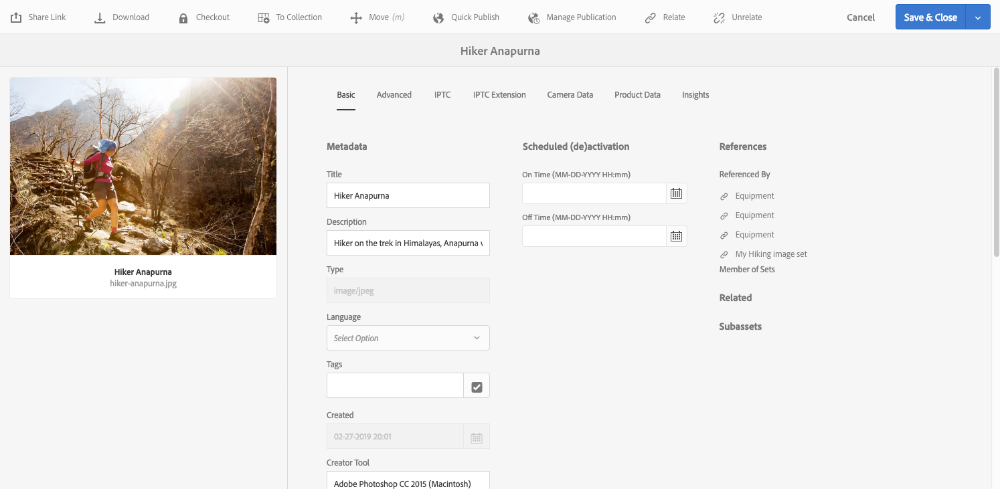

# Conjuntos de imágenes {#image-sets}

Los conjuntos de imágenes proporcionan a los usuarios una experiencia de visualización integrada, en la que pueden ver diferentes vistas de un elemento seleccionando una imagen en miniatura. Los conjuntos de imágenes permiten presentar vistas alternativas de un elemento y el visor ofrece herramientas de zoom para examinar las imágenes de cerca.

Los conjuntos de imágenes se designan mediante un banner con la palabra `IMAGESET`. Además, si se publica el conjunto de imágenes, se muestra la fecha de publicación, indicada por el icono **[!UICONTROL Mundo]**, junto con la fecha de la última modificación, indicada por el icono **[!UICONTROL Lápiz]**.

En el conjunto de imágenes, también puede crear muestras creando un conjunto de imágenes y añadiendo miniaturas.

Esta aplicación es útil para cuando desea mostrar un elemento en un color, patrón o acabado diferente. Para crear un conjunto de imágenes con muestras de color, necesita una imagen para cada color, trama o acabado diferente que desee presentar a los usuarios. También necesita una muestra de color, trama o acabado para cada color, trama o acabado.

Por ejemplo, supongamos que desea presentar imágenes de mayúsculas con diferentes listas de colores; las listas son rojas, verdes y azules. En este caso, necesitas tres inyecciones de la misma gorra. Necesitas un tiro con un rojo, uno con un verde, y uno con un pico azul. También necesita una muestra de color rojo, verde y azul. Las muestras de color sirven como miniaturas que los usuarios seleccionan en el Visor de conjuntos de muestras para ver el límite rojo, verde o azul.

>[!NOTE]
>
>Para obtener información sobre la interfaz de usuario de Assets, consulte [Administrar recursos](/help/assets/manage-assets.md).

Al crear un conjunto de imágenes, Adobe recomienda las siguientes prácticas recomendadas y aplica los límites siguientes:

| Tipo de límite | Práctica recomendada | Límite impuesto |
| --- | --- | --- |
| Número de recursos duplicados por conjunto | No hay duplicados | 20 ‡ |
| Número máximo de imágenes por conjunto | 5-10 imágenes por conjunto | 1000 |

‡ práctica recomendada es no tener recursos duplicados en un conjunto. El límite es de 20 duplicados para un solo recurso. Si agrega otro duplicado para ese recurso (dentro de ese conjunto), la solicitud genera un error o ignora el duplicado.

Ver también [limitaciones de Dynamic Media](/help/assets/limitations.md).

## Inicio rápido: Conjuntos de imágenes {#quick-start-image-sets}

**Para que pueda ponerse en marcha rápidamente:**

1. [Cargue sus imágenes de origen principales para varias vistas](#uploading-assets-in-image-sets).

   Comience por cargar las imágenes de los conjuntos de imágenes. Cuando elija imágenes, recuerde que los clientes pueden aplicar zoom a las imágenes en el Visor de conjuntos de imágenes. Asegúrese de que las imágenes tengan al menos 2000 píxeles en la dimensión más grande para obtener un detalle de zoom óptimo. Dynamic Media puede procesar imágenes de hasta 25 MP (megapíxeles) cada una. Por ejemplo, puede utilizar una imagen de 5000 x 5000 MP o cualquier otra combinación de tamaño de hasta 25 MP.

   Consulte [Dynamic Media - Formatos de imagen rasterizada admitidos](/help/assets/assets-formats.md#supported-raster-image-formats-dynamic-media) para obtener una lista de los formatos admitidos por los conjuntos de imágenes.

<!--    Adobe Experience Manager Assets supports many image file formats, but lossless TIFF, PNG, and EPS images are recommended. -->

1. [Crear un conjunto de imágenes](#creating-image-sets).

   En los conjuntos de imágenes, los usuarios seleccionan imágenes en miniatura en el Visor de conjuntos de imágenes.

   Para crear un conjunto de imágenes en Assets, ve a **[!UICONTROL Crear]** > **[!UICONTROL Conjuntos de imágenes]**. A continuación, agregue imágenes y seleccione **[!UICONTROL Guardar]**.

   También puede crear conjuntos de imágenes automáticamente mediante [ajustes preestablecidos de conjuntos de lotes](/help/assets/config-dms7.md).
   >[!IMPORTANT]
   >
   >IPS (Image Production System) crea los conjuntos de lotes como parte de la ingesta de recursos y solo están disponibles en el modo Dynamic Media - Scene7.

   Consulte [Preparar recursos de conjuntos de imágenes para cargar y cargar sus archivos](#uploading-assets-in-image-sets).

   Consulte [Trabajar con selectores](/help/assets/working-with-selectors.md).

1. Agregue [ajustes preestablecidos del visualizador de conjuntos de imágenes](/help/assets/managing-viewer-presets.md), según sea necesario.

   Los administradores pueden crear o modificar ajustes preestablecidos del visualizador de conjuntos de imágenes. Para ver el conjunto de imágenes con un ajuste preestablecido de visualizador, seleccione el conjunto de imágenes y, en el menú desplegable del carril izquierdo, seleccione **[!UICONTROL Visualizadores]**.

   Vaya a **[!UICONTROL Herramientas]** > **[!UICONTROL Assets]** > **[!UICONTROL Ajustes preestablecidos de visor]** si desea crear o editar ajustes preestablecidos de visor.

1. (Opcional) [Ver un conjunto de imágenes](/help/assets/image-sets.md#viewing-image-sets) creado mediante ajustes preestablecidos de conjunto por lotes.
1. [Previsualizar conjuntos de imágenes](/help/assets/previewing-assets.md).

   Seleccione el conjunto de imágenes y podrá previsualizarlo. Seleccione los iconos de miniaturas para examinar el conjunto de imágenes en el visor seleccionado. Puede elegir diferentes visores en el menú **[!UICONTROL Visualizadores]**, disponible en el menú desplegable del carril izquierdo.

1. [Publish y conjunto de imágenes](/help/assets/publishing-dynamicmedia-assets.md).

   La publicación de un conjunto de imágenes activa la URL y el código incrustado. Además, debe [publicar cualquier ajuste preestablecido de visor personalizado](/help/assets/managing-viewer-presets.md) que haya creado. Los ajustes preestablecidos de visualizador listos para usar ya se han publicado.

1. [Vincular direcciones URL a la aplicación web](/help/assets/linking-urls-to-yourwebapplication.md) o [Incrustar el visor de vídeo o de imágenes](/help/assets/embed-code.md).

   Experience Manager Assets crea llamadas de URL para conjuntos de imágenes y las activa después de publicar los conjuntos de imágenes. Puede copiar estas direcciones URL al previsualizar los recursos. También puede incrustarlos en el sitio web.

   Seleccione el conjunto de imágenes y, a continuación, en el menú desplegable del carril izquierdo, seleccione **[!UICONTROL Visualizadores]**.

   Ver [Vincular un conjunto de imágenes a una página web](/help/assets/linking-urls-to-yourwebapplication.md) e [Incrustar el visor de imágenes o vídeos](/help/assets/embed-code.md).

Para editar conjuntos de imágenes, consulte [Editar conjuntos de imágenes](#editing-image-sets). Además, puede ver y editar [propiedades del conjunto de imágenes](/help/assets/manage-assets.md#editing-properties).

Si tiene problemas al crear conjuntos, consulte Imágenes y conjuntos en [Solución de problemas de Dynamic Media - Modo Scene7](/help/assets/troubleshoot-dms7.md#images-and-sets).

## Carga de recursos en conjuntos de imágenes {#uploading-assets-in-image-sets}

Comience por cargar las imágenes de los conjuntos de imágenes. Cuando elija imágenes, recuerde que los clientes pueden aplicar zoom a las imágenes en el Visor de conjuntos de imágenes. Asegúrese de que las imágenes tengan al menos 2000 píxeles en la dimensión más grande. Los conjuntos de imágenes admiten muchos formatos de archivo de imagen, pero se recomiendan imágenes de TIFF, PNG y EPS sin pérdidas.

Puede cargar imágenes para conjuntos de imágenes del mismo modo que [cargaría cualquier otro recurso en Assets](/help/assets/manage-assets.md#uploading-assets).

Consulte [Dynamic Media - Formatos de imagen rasterizada admitidos](/help/assets/assets-formats.md#supported-raster-image-formats-dynamic-media) para obtener una lista de los formatos admitidos por los conjuntos de imágenes.

### Preparar recursos del conjunto de imágenes para cargar {#preparing-image-set-assets-for-upload}

Antes de crear conjuntos de imágenes, asegúrese de que las imágenes tengan el tamaño y el formato correctos.

Para crear un conjunto de imágenes de varias vistas, necesita imágenes que muestren un elemento desde diferentes puntos de vista o que muestren diferentes aspectos del mismo elemento. El objetivo es resaltar las características importantes de un elemento para que los espectadores tengan una imagen completa de su aspecto o de sus acciones.

Dado que los usuarios pueden ampliar las imágenes en conjuntos de imágenes, asegúrese de que las imágenes tengan al menos 2000 píxeles en la dimensión más grande. <!-- Assets support many image file formats, but lossless TIFF, PNG, and EPS images are recommended. -->

>[!NOTE]
>
>Además, si utiliza miniaturas para indicar muestras de productos, debe hacer lo siguiente:
>
>Se necesitan viñetas o diferentes tomas de la misma imagen mostrándola en diferentes colores, patrones o acabados. También necesita archivos de miniaturas que se correspondan con los diferentes colores, motivos o acabados. Por ejemplo, para presentar miniaturas con un conjunto de imágenes que muestre la misma chaqueta en negro, marrón y verde, necesitará:
>
>* Un tiro negro, marrón y verde de la misma chaqueta.
>* Miniatura en color negro, marrón y verde.

## Crear un conjunto de imágenes {#creating-image-sets}

Puede crear conjuntos de imágenes a través de la interfaz de usuario o de la API. En esta sección se describe cómo crear conjuntos de imágenes en la interfaz de usuario.

>[!NOTE]
>
>También puede crear conjuntos de imágenes automáticamente mediante [ajustes preestablecidos de conjuntos de lotes](/help/assets/config-dms7.md#creating-batch-set-presets-to-auto-generate-image-sets-and-spin-sets).
>**Importante: IPS (Image Production System) crea** conjuntos de lotes como parte de la ingesta de recursos y solo están disponibles en el modo Dynamic Media - Scene7.

Al agregar recursos al conjunto, estos se agregan automáticamente en orden alfanumérico. Puede reordenar u ordenar manualmente los recursos una vez añadidos.

>[!NOTE]
>
>No se admiten conjuntos de imágenes para recursos con &quot;,&quot; (coma) en el nombre del archivo.

Al crear un conjunto de imágenes, Adobe recomienda las siguientes prácticas recomendadas y aplica los límites siguientes:

| Tipo de límite | Práctica recomendada | Límite impuesto |
| --- | --- | --- |
| Número de recursos duplicados por conjunto | No hay duplicados | 20 ‡ |
| Número máximo de imágenes por conjunto | 5-10 imágenes por conjunto | 1000 |

‡ práctica recomendada es no tener recursos duplicados en un conjunto. El límite es de 20 duplicados para un solo recurso. Si agrega otro duplicado para ese recurso (dentro de ese conjunto), la solicitud genera un error o ignora el duplicado.

Ver también [limitaciones de Dynamic Media](/help/assets/limitations.md).

**Para crear un conjunto de imágenes:**

1. En Experience Manager, seleccione el logotipo del Experience Manager para acceder a la consola de navegación global y, a continuación, vaya a **[!UICONTROL Navegación]** > **[!UICONTROL Assets]**. Vaya a donde desee crear un conjunto de imágenes y, a continuación, vaya a **[!UICONTROL Crear]** > **[!UICONTROL Conjunto de imágenes]** para abrir la página Editor de conjuntos de imágenes.

   También puede crear el conjunto desde una carpeta que contenga los recursos.

   

1. En la página Editor de conjuntos de imágenes, en el campo **[!UICONTROL Título]**, escriba un nombre para el conjunto de imágenes. El nombre aparece en el titular en todo el conjunto de imágenes. Si lo desea, introduzca una descripción.

   

1. Realice una de las siguientes acciones:

   * Cerca de la esquina superior izquierda de la página Editor de conjuntos de imágenes, seleccione **[!UICONTROL Agregar recurso]**.

   * Cerca de la mitad de la página Editor de conjuntos de imágenes, seleccione **[!UICONTROL Toque para abrir el Selector de recursos]**.

   Seleccione los recursos que desea incluir en el conjunto de imágenes. Los recursos seleccionados tienen un icono de marca de verificación sobre ellos. Cuando termine, cerca de la esquina superior derecha de la página, seleccione **[!UICONTROL Seleccionar]**.

   Con el Selector de recursos, puede buscar recursos escribiendo una palabra clave y pulsando o haciendo clic en **[!UICONTROL Retorno]**. También puede aplicar filtros para restringir los resultados de búsqueda. Puede filtrar por ruta, colección, tipo de archivo y etiqueta. Seleccione el filtro y, a continuación, seleccione el icono **[!UICONTROL Filtro]** en la barra de herramientas. Para cambiar la vista, pulse el icono Ver y seleccione **[!UICONTROL Vista de columna]**, **[!UICONTROL Vista de tarjeta]** o **[!UICONTROL Vista de lista]**.

   Consulte [Trabajar con selectores](/help/assets/working-with-selectors.md).

   

1. Al agregar recursos al conjunto, estos se agregan automáticamente en orden alfanumérico. Puede reordenar u ordenar manualmente los recursos después de agregarlos.

   Si es necesario, arrastre el icono Reordenar de un recurso a la derecha del nombre de archivo del recurso para reordenar las imágenes hacia arriba o hacia abajo en la lista de conjuntos.

   

   Si desea cambiar una miniatura o muestra, seleccione el icono **+** **miniatura** que está junto a la imagen y vaya a la miniatura o muestra que desee. Cuando termine de seleccionar todas las imágenes, seleccione **[!UICONTROL Guardar]**.

1. (Opcional) Realice una de las siguientes acciones:

   * Para eliminar una imagen, seleccione la imagen y seleccione **[!UICONTROL Eliminar recurso]**.

   * Para aplicar un ajuste preestablecido, cerca de la esquina superior derecha de la página, seleccione **[!UICONTROL Ajuste preestablecido]** y, a continuación, seleccione un ajuste preestablecido para aplicar a todos los recursos a la vez.

   >[!NOTE]
   >
   >Al crear el conjunto de imágenes, puede cambiar la miniatura del conjunto de imágenes o permitir que el Experience Manager seleccione la miniatura automáticamente en función de los recursos del conjunto de imágenes. Para seleccionar una miniatura, seleccione **[!UICONTROL Cambiar miniatura]** sobre el campo Título en la página Editor de conjuntos de imágenes y, a continuación, seleccione cualquier imagen (puede navegar también a otras carpetas para buscar imágenes). Si ha seleccionado una miniatura y, a continuación, decide que quiere que Experience Manager genere una del conjunto de imágenes, seleccione **[!UICONTROL Cambiar a]** > **[!UICONTROL Miniatura automática]**.

1. Seleccione **[!UICONTROL Guardar]**. El conjunto de imágenes recién creado aparecerá en la carpeta en la que lo creó.

## Ver un conjunto de imágenes {#viewing-image-sets}

Puede crear conjuntos de imágenes en la interfaz de usuario o automáticamente mediante [ajustes preestablecidos de conjunto por lotes](/help/assets/config-dms7.md#creating-batch-set-presets-to-auto-generate-image-sets-and-spin-sets).

>[!IMPORTANT]
>
>IPS [Image Production System] crea los conjuntos de lotes como parte de la ingesta de recursos y solo están disponibles en el modo Dynamic Media - Scene7.)

Sin embargo, los conjuntos creados mediante ajustes preestablecidos de conjuntos de lotes, *no* aparecen en la interfaz de usuario. Puede ver estos conjuntos de tres formas diferentes. (Estos métodos están disponibles aunque haya creado los conjuntos de imágenes en la interfaz de usuario).

* Abra las propiedades de un recurso individual. Las propiedades indican qué conjuntos hacen referencia al recurso seleccionado o de qué es miembro. Seleccione el nombre del conjunto si desea ver el conjunto completo.

  

* Desde una imagen de miembro de cualquier conjunto. Seleccione el menú **[!UICONTROL Conjuntos]** para mostrar los conjuntos de los que es miembro el recurso.

  

* Desde la búsqueda, puede seleccionar **[!UICONTROL Filter]**, luego expandir **[!UICONTROL Dynamic Media]** y seleccionar **[!UICONTROL Conjuntos]**.

  La búsqueda devuelve conjuntos coincidentes creados manualmente en la interfaz de usuario o creados automáticamente mediante ajustes preestablecidos de conjuntos de lotes. Para los conjuntos automatizados, la búsqueda se realiza utilizando los criterios de búsqueda &quot;Comienza con&quot;, que son diferentes de la búsqueda del Experience Manager, que se basa en el uso de los criterios de búsqueda &quot;Contiene&quot;. Establecer el filtro en **[!UICONTROL Conjuntos]** es la única manera de buscar conjuntos automatizados.

  

>[!NOTE]
>
>Puede ver los conjuntos a través de la interfaz de usuario como se describe en [Editar conjuntos de imágenes](#editing-image-sets).

## Editar un conjunto de imágenes {#editing-image-sets}

Puede realizar varias tareas de edición en conjuntos de imágenes, como las siguientes:

* Agregar imágenes al conjunto de imágenes.
* Reordene las imágenes del conjunto de imágenes.
* Eliminar recursos del conjunto de imágenes.
* Aplicar ajustes preestablecidos de visor.
* Elimine el conjunto de imágenes.

**Para editar un conjunto de imágenes:**

1. Realice una de las siguientes acciones:

   * Pase el ratón sobre un recurso del conjunto de imágenes y seleccione **[!UICONTROL Editar]** (icono de lápiz).
   * Pase el ratón sobre un recurso de conjunto de imágenes, seleccione **[!UICONTROL Seleccionar]** (icono de marca de verificación) y, a continuación, seleccione **[!UICONTROL Editar]** en la barra de herramientas.
   * Seleccione en un recurso de conjunto de imágenes y, a continuación, seleccione **[!UICONTROL Editar]** (icono de lápiz) en la barra de herramientas.

1. Para editar las imágenes del conjunto de imágenes, realice una de las siguientes acciones:

   * Para reordenar los recursos, arrastre una imagen a una nueva ubicación (seleccione el icono de reordenar para mover los elementos).
   * Para ordenar los elementos en orden ascendente o descendente, seleccione el encabezado de la columna.
   * Para agregar un recurso o actualizar un recurso existente, seleccione **[!UICONTROL Agregar recurso]**. Vaya a un recurso, selecciónelo y, a continuación, seleccione **[!UICONTROL Seleccionar]** cerca de la esquina superior derecha de la página.

     >[!NOTE]
     >
     >Si elimina la imagen que el Experience Manager utiliza para la miniatura reemplazándola por otra imagen, se seguirá mostrando el recurso original.
   * Para eliminar un recurso, selecciónelo y seleccione **[!UICONTROL Eliminar recurso]**.
   * Para aplicar un ajuste preestablecido, cerca de la esquina superior derecha de la página, seleccione **[!UICONTROL Ajuste preestablecido]** y, a continuación, seleccione un ajuste preestablecido de visor.
   * Para añadir o cambiar una miniatura, seleccione el icono de miniatura situado junto a la derecha del recurso. Vaya a la nueva miniatura o recurso de muestra, selecciónelo y, a continuación, seleccione **[!UICONTROL Seleccionar]**.
   * Para eliminar un conjunto de imágenes completo, ve al conjunto de imágenes, selecciónalo y selecciona **[!UICONTROL Eliminar]**.

   >[!NOTE]
   >
   >Para editar las imágenes de un conjunto de imágenes, vaya al conjunto, seleccione **[!UICONTROL Definir miembros]** en el carril izquierdo y, a continuación, seleccione el icono Lápiz en un recurso individual para abrir la ventana de edición.

1. Seleccione **[!UICONTROL Guardar]** cuando haya terminado de editar.

## Previsualización de un conjunto de imágenes {#previewing-image-sets}

Consulte [Vista previa de recursos](/help/assets/previewing-assets.md).

## Publish y un conjunto de imágenes {#publishing-image-sets}

Consulte [Publicación de Assets](/help/assets/publishing-dynamicmedia-assets.md).
