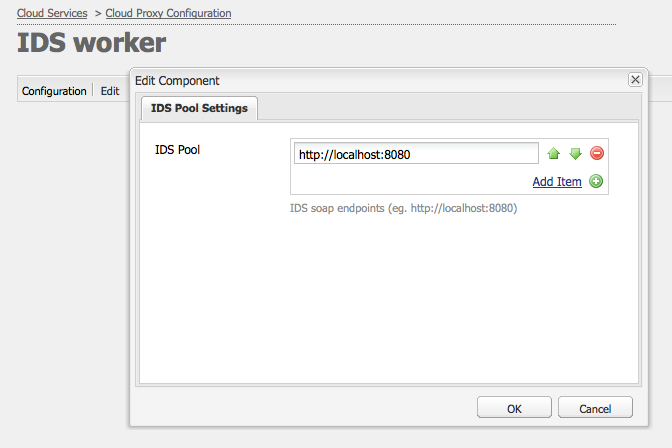

# Integrar [!DNL Adobe Experience Manager Assets] con [!DNL Adobe InDesign Server] {#integrating-aem-assets-with-indesign-server}

[!DNL Adobe Experience Manager Assets] utilice:

* Un proxy para distribuir la carga de determinadas tareas de procesamiento. Un proxy es una [!DNL Experience Manager] instancia que se comunica con un trabajador proxy para cumplir una tarea específica y otras [!DNL Experience Manager] instancias para ofrecer los resultados.
* Trabajador proxy para definir y administrar una tarea específica.
Pueden abarcar una amplia variedad de tareas; por ejemplo, utilizar un [!DNL InDesign Server] método para procesar archivos.

Para cargar archivos completamente a [!DNL Experience Manager Assets] los que ha creado con [!DNL Adobe InDesign] un proxy se utiliza. Esto utiliza un trabajador proxy para comunicarse con el [!DNL Adobe InDesign Server], donde se ejecutan [las secuencias de comandos](https://www.adobe.com/devnet/indesign/documentation.html#idscripting) para extraer metadatos y generar varias representaciones para [!DNL Experience Manager Assets]. El programa de trabajo proxy habilita la comunicación bidireccional entre las instancias [!DNL InDesign Server] y las [!DNL Experience Manager] en una configuración de nube.

>[!NOTE]
>
>[!DNL Adobe InDesign] se ofrece en dos ofertas distintas. [Aplicación de escritorio de Adobe InDesign](https://www.adobe.com/products/indesign.html) que se utiliza para diseñar diseños de página para impresión y distribución digital. [Adobe InDesign Server](https://www.adobe.com/products/indesignserver.html) le permite crear mediante programación documentos automatizados en función de lo que haya creado con [!DNL InDesign]. Funciona como un servicio que ofrece una interfaz a su motor de [ExtendScript](https://www.adobe.com/devnet/scripting.html) .Las secuencias de comandos se escriben en [!DNL ExtendScript], lo cual es similar a [!DNL JavaScript]. Para obtener información sobre [!DNL InDesign] secuencias de comandos, consulte [https://www.adobe.com/devnet/indesign/documentation.html#idscripting](https://www.adobe.com/devnet/indesign/documentation.html#idscripting).

## Funcionamiento de la extracción {#how-the-extraction-works}

El [!DNL Adobe InDesign Server] se puede integrar con [!DNL Experience Manager Assets] para que los archivos INDD creados con [!DNL InDesign] se puedan cargar, generar representaciones, extraer todos los medios (por ejemplo, vídeo) y almacenarlos como recursos:

>[!NOTE]
>
>Las versiones anteriores de [!DNL Experience Manager] fueron capaces de extraer XMP y la miniatura, ahora todos los medios se pueden extraer.

1. Cargue el archivo INDD en [!DNL Experience Manager Assets].
1. Un marco envía secuencias de comandos a los [!DNL InDesign Server] mediante SOAP (Simple Object Access Protocol).
Esta secuencia de comandos de comando:

   * Recupere el archivo INDD.
   * Ejecutar [!DNL InDesign Server] comandos:

      * Se extraen la estructura, el texto y los archivos multimedia.
      * Se generan representaciones PDF y JPG.
      * Se generan representaciones HTML e IDML.
   * Vuelva a publicar los archivos resultantes en [!DNL Experience Manager Assets].

   >[!NOTE]
   >
   >IDML es un formato basado en XML que procesa todo el contenido del [!DNL InDesign] archivo. Se almacena como un paquete comprimido mediante compresión [ZIP](https://www.techterms.com/definition/zip) . Para obtener más información, consulte Formatos de intercambio de [InDesign INX e IDML](https://www.peachpit.com/articles/article.aspx?p=1381880&amp;seqNum=8).

   >[!CAUTION]
   >
   >Si el [!DNL InDesign Server] no está instalado o no está configurado, puede cargar un archivo INDD en [!DNL Experience Manager]. Sin embargo, las representaciones generadas se limitarán a PNG y JPEG. No podrá generar representaciones de HTML, .idml ni de páginas.

1. Después de la generación de extracción y representación:

   * La estructura se replica en un `cq:Page` (tipo de representación).
   * El texto y los archivos extraídos se almacenan en [!DNL Experience Manager Assets].
   * Todas las representaciones se almacenan en [!DNL Experience Manager Assets], en el propio recurso.

## Integrar el [!DNL InDesign Server] con el Experience Manager {#integrating-the-indesign-server-with-aem}

Para integrar el [!DNL InDesign Server] para su uso con [!DNL Experience Manager Assets] y después de configurar el proxy, debe:

1. [Instale el InDesign Server](#installing-the-indesign-server).
1. Si es necesario, [configure el flujo de trabajo](#configuring-the-aem-assets-workflow)de Experience Manager Assets.
Esto solo es necesario si los valores predeterminados no son adecuados para la instancia.
1. Configure un programa de trabajo [proxy para el InDesign Server](#configuring-the-proxy-worker-for-indesign-server).

### Instale el [!DNL InDesign Server] {#installing-the-indesign-server}

Para instalar y inicio el [!DNL InDesign Server] para su uso con [!DNL Experience Manager]:

1. Descargue e instale el [!DNL InDesign Server].

1. Si es necesario, puede personalizar la configuración de la [!DNL InDesign Server] instancia.

1. Desde la línea de comandos, inicio el servidor:

   `<*ids-installation-dir*>/InDesignServer.com -port 8080`

   Esto inicio el servidor con la escucha del complemento SOAP en el puerto 8080. Todos los mensajes y resultados de registro se escriben directamente en la ventana de comandos.

   >[!NOTE]
   >
   >Si desea guardar los mensajes de salida en un archivo, utilice la redirección; por ejemplo, en Windows:
   >`<ids-installation-dir>/InDesignServer.com -port 8080 > ~/temp/INDD-logfile.txt 2>&1`

### Configurar el flujo de trabajo [!DNL Experience Manager Assets] {#configuring-the-aem-assets-workflow}

[!DNL Experience Manager Assets] tiene un flujo de trabajo preconfigurado **[!UICONTROL DAM Update Asset]**, que tiene varios pasos de proceso específicos para [!DNL InDesign]:

* [Extracción de medios](#media-extraction)
* [Extracción de páginas](#page-extraction)

Este flujo de trabajo está configurado con valores predeterminados que se pueden adaptar para su configuración en las distintas instancias de creación (es un flujo de trabajo estándar, por lo que hay más información disponible en [Edición de un flujo de trabajo](/help/sites-developing/workflows-models.md#configuring-a-workflow-step)). Si está utilizando los valores predeterminados (incluido el puerto SOAP), no es necesaria ninguna configuración.

Tras la configuración, la carga de [!DNL InDesign] archivos en [!DNL Experience Manager Assets] (por cualquiera de los métodos habituales) activa el flujo de trabajo para procesar el recurso y preparar las distintas representaciones. Pruebe la configuración cargando un archivo INDD en [!DNL Experience Manager Assets] para confirmar que ve las distintas representaciones creadas por IDS en `<*your_asset*>.indd/Renditions`

#### Media extraction {#media-extraction}

Este paso controla la extracción de medios desde el archivo INDD.

Para personalizar, puede editar la pestaña **[!UICONTROL Argumentos]** del paso **[!UICONTROL Extracción de medios]**.

Argumentos de extracción de medios y rutas de secuencias de comandos

* **Biblioteca** de ExtendScript: Se trata de una sencilla biblioteca de métodos http get/post, que requieren los demás scripts.

* **Ampliar secuencias de comandos**: Aquí puede especificar diferentes combinaciones de scripts. Si desea que sus propias secuencias de comandos se ejecuten en el [!DNL InDesign Server], guarde las secuencias de comandos en `/apps/settings/dam/indesign/scripts`.

Para obtener información sobre [!DNL Adobe InDesign] secuencias de comandos, consulte la documentación para desarrolladores de [InDesign](https://www.adobe.com/devnet/indesign/documentation.html#idscripting)

>[!CAUTION]
>
>No cambie la biblioteca ExtendScript. Esta biblioteca proporciona la funcionalidad HTTP necesaria para comunicarse con Sling. Esta configuración especifica la biblioteca que se enviará a la [!DNL InDesign Server] para utilizarla allí.

La secuencia `ThumbnailExport.jsx` de comandos ejecutada por el paso del flujo de trabajo de Media Extracción genera una representación en miniatura en formato JPG. Esta representación se utiliza en el paso del flujo de trabajo Miniaturas de proceso para generar las representaciones estáticas requeridas por [!DNL Experience Manager].

Puede configurar el paso del flujo de trabajo Miniaturas de proceso para generar representaciones estáticas de diferentes tamaños. Asegúrese de que no elimina los valores predeterminados, ya que la [!DNL Experience Manager Assets] interfaz los requiere. Por último, el paso del flujo de trabajo Eliminar representación de Previsualización de imagen elimina la representación en miniatura de JPG, ya que ya no es necesaria.

#### Page extraction {#page-extraction}

Esto crea una [!DNL Experience Manager] página a partir de los elementos extraídos. Se utiliza un controlador de extracción para extraer datos de una representación (actualmente HTML o IDML). Estos datos se utilizan para crear una página con PageBuilder.

Para personalizar, puede editar la pestaña **[!UICONTROL Argumentos]** del paso **[!UICONTROL Extracción de página]**.

* **Controlador** de Extracción de página: En la lista emergente, seleccione el controlador que desee utilizar. Un controlador de extracción funciona en una representación específica, elegida por un elemento relacionado `RenditionPicker` (consulte la API `ExtractionHandler`).
In a standard [!DNL Experience Manager] installation the following is available:
   * Identificador de Extracción de exportación IDML: Funciona en la `IDML` representación generada en el paso MediaExtract.

* **Nombre** de página: Especifique el nombre que desea asignar a la página resultante. Si se deja en blanco, el nombre es &quot;page&quot; (o una derivativa si &quot;page&quot; ya existe).

* **Título** de página: Especifique el título que desea asignar a la página resultante.

* **Ruta** raíz de página: La ruta a la ubicación raíz de la página resultante. Si se deja en blanco, se utilizará el nodo que contiene las representaciones del recurso.

* **Plantilla** de página: Plantilla que se utilizará al generar la página resultante.

* **Diseño** de página: El diseño de página que se utilizará al generar la página resultante.

### Configurar el trabajador proxy para [!DNL InDesign Server] {#configuring-the-proxy-worker-for-indesign-server}

>[!NOTE]
>
>El programa de trabajo reside en la instancia de proxy.

1. En la consola Herramientas, expanda Configuraciones **[!UICONTROL de]** Cloud Services en el panel izquierdo. A continuación, expanda Configuración **[!UICONTROL de proxy de]** nube.

1. Haga doble clic en el programa de **[!UICONTROL IDS de trabajo]** para abrirlo y configurarlo.

1. Haga clic en **[!UICONTROL Editar]** para abrir el cuadro de diálogo de configuración y definir la configuración necesaria:

   

   * **Agrupación** de IDS Los extremos de SOAP que se utilizarán para la comunicación con el [!DNL InDesign Server]. Puede agregar, quitar y ordenar los elementos que sean necesarios.

1. Haga clic en Aceptar para guardar.

### Configurar el Externalizador de vínculos de CQ de día {#configuring-day-cq-link-externalizer}

Si [!DNL InDesign Server] y [!DNL Experience Manager] se ejecuta en diferentes hosts o en cualquiera de estas aplicaciones o en ambas no se ejecutan en puertos predeterminados, configure [!UICONTROL Day CQ Link Externalizer] para establecer el nombre de host, el puerto y la ruta de contenido para el [!DNL InDesign Server].

1. Acceda a la consola web en `https://[aem_server]:[port]/system/console/configMgr`.
1. Locate the configuration **[!UICONTROL Day CQ Link Externalizer]**, and click **[!UICONTROL Edit]** to open it.
1. Especifique el nombre de host y la ruta de contexto para el [!DNL Adobe InDesign Server] y haga clic en **Guardar**.

   

### Habilitar procesamiento de trabajos en paralelo para [!DNL InDesign Server] {#enabling-parallel-job-processing-for-indesign-server-s}

Ahora puede habilitar el procesamiento de trabajos paralelos para IDS. Determinar el número máximo de trabajos paralelos (`x`) que un [!DNL InDesign Server] proceso puede:

* En un solo equipo multiprocesador, el número máximo de trabajos paralelos (`x`) que un proceso [!DNL InDesign Server] puede ser menor que el número de procesadores que ejecutan IDS.
* Cuando ejecuta IDS en varios equipos, debe contar el número total de procesadores disponibles (es decir, en todos los equipos) y luego restar el número total de equipos.

Para configurar el número de trabajos de IDS paralelos:

1. Abra la ficha **[!UICONTROL Configuraciones]** de la consola Félix; por ejemplo: `https://[aem_server]:[port]/system/console/configMgr`.

1. Seleccione la cola de procesamiento de IDS en `Apache Sling Job Queue Configuration`.

1. Configurar:

   * **Tipo** - `Parallel`
   * **Trabajos** paralelos máximos: `<*x*>` (como se calculó arriba)

1. Guarde estos cambios.
1. Para habilitar la compatibilidad con varias sesiones para Adobe CS6 y versiones posteriores, marque `enable.multisession.name` la casilla de verificación, en `com.day.cq.dam.ids.impl.IDSJobProcessor.name` Configuración.
1. Cree un [grupo de trabajadores de `x` IDS agregando extremos de SOAP a la configuración](#configuring-the-proxy-worker-for-indesign-server)de IDS Worker.

   Si hay varios equipos en ejecución [!DNL InDesign Server], agregue extremos SOAP (número de procesadores por máquina -1) para cada equipo.

<!-- 
TBD: Make updates to configurations for allow and block list after product updates are done.
-->

>[!NOTE]
>
>Al trabajar con un grupo de trabajadores, puede habilitar la lista de bloqueados de los trabajadores de IDS.
>
>Para ello, habilite la casilla **[!UICONTROL enable.reintentar.name]** , en la `com.day.cq.dam.ids.impl.IDSJobProcessor.name` configuración, que habilita las recuperaciones de trabajos IDS.
>
>Además, en la configuración `com.day.cq.dam.ids.impl.IDSPoolImpl.name` , establezca un valor positivo para el `max.errors.to.blacklist` parámetro que determina el número de recuperaciones de trabajos antes de excluir un ID de la lista de controladores de trabajos.
>
>De forma predeterminada, después del (`retry.interval.to.whitelist.name`) tiempo configurable en minutos, se vuelve a validar el programa de trabajo de IDS. Si el trabajador se encuentra en línea, se elimina de la lista de bloqueados.

## Habilitar compatibilidad con [!DNL InDesign Server] 10.0 o posterior {#enabling-support-for-indesign-server-or-later}

Para [!DNL InDesign Server] 10.0 o superior, realice los siguientes pasos para habilitar la compatibilidad con varias sesiones.

1. Abra Configuration Manager desde su [!DNL Experience Manager Assets] instancia `https://[aem_server]:[port]/system/console/configMgr`.
1. Edite la configuración `com.day.cq.dam.ids.impl.IDSJobProcessor.name`.
1. Seleccione la opción **[!UICONTROL ids.cc.enable]** y haga clic en **[!UICONTROL Guardar]**.

>[!NOTE]
>
>Para [!DNL InDesign Server] la integración con [!DNL Experience Manager Assets], utilice un procesador multi-core porque la función de soporte de sesión necesaria para la integración no es compatible con sistemas de un solo núcleo.

## Configurar [!DNL Experience Manager] credenciales {#configure-aem-credentials}

Puede cambiar las credenciales de administrador predeterminadas (nombre de usuario y contraseña) para acceder al [!DNL InDesign Server] desde su [!DNL Experience Manager] implementación sin interrumpir la integración con el [!DNL InDesign Server].

1. Ir a `/etc/cloudservices/proxy.html`.
1. En el cuadro de diálogo, especifique el nombre de usuario y la contraseña nuevos.
1. Guarde las credenciales.

>[!MORELIKETHIS]
>
>* [Acerca de Adobe InDesign Server](https://www.adobe.com/products/indesignserver/faq.html)

