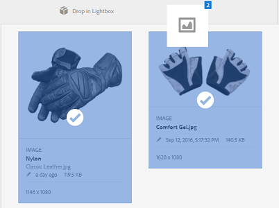

# Lightbox {#lightbox}

Lightbox es un tipo especial de colección que proporciona un acceso fácil a los recursos. Puede acceder rápidamente a Lightbox para añadir o eliminar recursos. Sirve como su galería de imágenes personal.

Si es un [!DNL Adobe Experience Manager Assets] Usuario, Lightbox se crea automáticamente la primera vez que se inicia sesión en la aplicación. Es exclusivo de su inicio de sesión. Los demás usuarios no pueden acceder a Lightbox.

## Añadir recursos a Lightbox {#adding-assets-to-lightbox}

1. Desde el [!DNL Assets] interfaz de usuario, seleccione los recursos que desee añadir a Lightbox.
1. Arrastre los recursos al **[!UICONTROL Soltar en Lightbox]** zona. Suelte cuando la zona de colocación se active y su etiqueta cambie a **[!UICONTROL Soltar para añadir]**.

   

1. En el cuadro de diálogo, haga clic en **[!UICONTROL Añadir]** y, a continuación, ciérrelo para completar el proceso. Los recursos seleccionados se añaden a Lightbox.
1. Para ver Lightbox, vaya a la consola Colecciones.
1. Clic **[!UICONTROL Lightbox]** para ver los recursos que contiene.

   >[!NOTE]
   >
   >Aunque Lightbox se parece a una colección, no se pueden realizar todas las acciones que se realizan normalmente en las colecciones. Por ejemplo, no puede eliminar, compartir ni ver la configuración de un Lightbox. Además, no se puede agregar a otras colecciones. Sin embargo, puede editar los recursos de una caja de luz.

## Eliminación de recursos de Lightbox {#removing-assets-from-lightbox}

1. Vaya a la consola Colecciones y haga clic en Lightbox para ver sus recursos.
1. Seleccione los recursos que desea eliminar.
1. En la barra de herramientas, haga clic en **[!UICONTROL Eliminar]**.
1. En el cuadro de diálogo, haga clic en **[!UICONTROL Eliminar]** para confirmar la acción de eliminación. Los recursos se eliminan de Lightbox.
