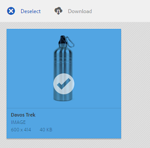

# Compartir recurso como vínculo {#asset-link-sharing}

| Versión | Vínculo del artículo |
| -------- | ---------------------------- |
| AEM as a Cloud Service | [Haga clic aquí](https://experienceleague.adobe.com/docs/experience-manager-cloud-service/content/assets/manage/share-assets.html?lang=en) |
| AEM 6.5 | Este artículo |

[!DNL Adobe Experience Manager Assets] permite compartir recursos, carpetas y colecciones como una dirección URL con miembros de la organización y entidades externas, incluidos socios y proveedores. Compartir recursos a través de un vínculo es una forma cómoda de poner los recursos a disposición de terceros sin que tengan que iniciar sesión primero en [!DNL Assets].

>[!PREREQUISITES]
>
>* Necesita `Edit ACL` en la carpeta o el recurso que desee compartir como vínculo.
>* Para enviar correos electrónicos a los usuarios, configure los detalles del servidor SMTP en [Day CQ Mail Service](#configmailservice).

## Compartir recursos {#share-assets}

Para generar la dirección URL de los recursos que desea compartir con los usuarios, utilice el [!UICONTROL Vínculos compartidos] diálogo.

* Los usuarios con privilegios de administrador o con permisos de lectura en `/var/dam/share` La ubicación de puede ver los vínculos que se han compartido con ellos.
* Los usuarios que tienen permisos de lectura en `/var/dam/jobs/download` La ubicación de puede descargar recursos desde el vínculo compartido.

1. En el [!DNL Assets] interfaz de usuario, seleccione el recurso que desea compartir como vínculo.

1. En la barra de herramientas, haga clic en **[!UICONTROL Compartir vínculo]** . El vínculo que se crea después de hacer clic en **[!UICONTROL Compartir]** se muestra de antemano en la [!UICONTROL Compartir vínculo] field. El vínculo no se crea hasta que seleccione **[!UICONTROL Enviar]**.

   

   *Imagen: cuadro de diálogo para compartir recursos como vínculo.*

1. En el apartado de la dirección de correo electrónico del cuadro de diálogo **[!UICONTROL Uso compartido de vínculos]**, escriba el ID de correo electrónico del usuario con el que desea compartir el vínculo. Puede agregar uno o más usuarios.

   >[!NOTE]
   >
   >Si introduce un ID de correo electrónico de un usuario que no es miembro de su organización, las palabras [!UICONTROL Usuario externo] llevan como prefijo el ID de correo electrónico del usuario.

1. En el **[!UICONTROL Asunto]** , escriba un asunto para el recurso que desea compartir.

1. En el **[!UICONTROL Mensaje]** , escriba un mensaje opcional.

1. En el **[!UICONTROL Caducidad]** , especifique una fecha y hora de caducidad para el vínculo. El tiempo de caducidad predeterminado del vínculo es un día.

   

1. Para permitir que los usuarios descarguen el recurso original, seleccione **[!UICONTROL Permitir la descarga del archivo original]**. Para permitir que los usuarios descarguen solo las representaciones de los recursos compartidos, seleccione **[!UICONTROL Permitir la descarga de representaciones de archivos]**.

1. Clic **[!UICONTROL Compartir]**. Un mensaje confirma que el vínculo se comparte con los usuarios por correo electrónico.

1. Para ver el recurso compartido, haga clic en el vínculo del correo electrónico que se envía al usuario. Para generar una vista previa del recurso, haga clic en el recurso compartido. Para cerrar la vista previa, haga clic en **[!UICONTROL Atrás]**. Si ha compartido una carpeta, haga clic en **[!UICONTROL Carpeta principal]** para volver a la carpeta principal.

   

   >[!NOTE]
   >
   >[!DNL Experience Manager] admite la generación de la vista previa de recursos de solo [los tipos de archivo admitidos](/help/assets/assets-formats.md). Si se comparten otros tipos MIME, solo puede descargar los recursos y no puede obtener una vista previa.

1. Para descargar el recurso compartido, haga clic en **[!UICONTROL Seleccionar]** en la barra de herramientas, haga clic en el recurso y, a continuación, en **[!UICONTROL Descargar]** en la barra de herramientas.

   

1. Para ver los recursos que ha compartido como vínculos, vaya a [!DNL Assets] y haga clic en el botón [!DNL Experience Manager] logotipo. Elegir **[!UICONTROL Navegación]**. En el panel Navegación, elija **[!UICONTROL Vínculos compartidos]** para mostrar una lista de recursos compartidos.

1. Para dejar de compartir un recurso, selecciónelo y haga clic en **[!UICONTROL Dejar de compartir]** en la barra de herramientas. A continuación aparece un mensaje de confirmación. La entrada del recurso se eliminará de la lista.

## Configuración del servicio de correo Day CQ {#configure-day-cq-mail-service}

1. En el [!DNL Experience Manager] página principal, vaya a **[!UICONTROL Herramientas]** > **[!UICONTROL Operaciones]** > **[!UICONTROL Consola web]**.
1. En la lista de servicios, busque **[!UICONTROL Day CQ Mail Service]**.
1. Clic **[!UICONTROL Editar]** junto al servicio y configure los siguientes parámetros para **[!UICONTROL Day CQ Mail Service]** con los detalles mencionados en contra de sus nombres:

   * Nombre de host del servidor SMTP: nombre de host del servidor de correo electrónico
   * Puerto del servidor SMTP: puerto del servidor de correo electrónico
   * Usuario de SMTP: nombre de usuario del servidor de correo electrónico
   * Contraseña de SMTP: contraseña del servidor de correo electrónico

   

1. Haga clic en **[!UICONTROL Guardar]**.

## Configurar el tamaño máximo de datos {#configure-maximum-data-size}

Al descargar recursos desde el vínculo compartido mediante la función Compartir vínculos, [!DNL Experience Manager] comprime la jerarquía de recursos del repositorio y, a continuación, devuelve el recurso en un archivo ZIP. Sin embargo, en ausencia de límites en la cantidad de datos que se pueden comprimir en un archivo ZIP, grandes cantidades de datos se someten a compresión, lo que provoca errores de memoria insuficiente en JVM. Para proteger el sistema de un posible ataque de denegación de servicio debido a esta situación, configure el tamaño máximo utilizando **[!UICONTROL Tamaño máximo de contenido (sin comprimir)]** parámetro para **[!UICONTROL Servlet proxy Day CQ DAM Adhoc Asset Share]** en el Administrador de configuración. Si el tamaño sin comprimir del recurso supera el valor configurado, se rechazan las solicitudes de descarga de recursos. El valor predeterminado es 100 MB.

1. Haga clic en [!DNL Experience Manager] y, a continuación, vaya a **[!UICONTROL Herramientas]** > **[!UICONTROL Operaciones]** > **[!UICONTROL Consola web]**.
1. En la consola web, busque **[!UICONTROL Servlet proxy Day CQ DAM Adhoc Asset Share]** configuración.
1. Abra la configuración del servlet proxy **[!UICONTROL Day CQ DAM Adhoc Asset Share]** en modo de edición y modifique el valor del parámetro **[!UICONTROL Tamaño de contenido máximo (sin comprimir)]**.

   

1. Guarde los cambios.

## Prácticas recomendadas y solución de problemas {#best-practices-and-troubleshooting}

* Es posible que las carpetas de recursos o las colecciones que contienen un espacio en blanco en su nombre no se compartan.
* Si los usuarios no pueden descargar los recursos compartidos, consulte con su [!DNL Experience Manager] administrador de qué [límites de descarga](#configure-maximum-data-size) son.
* Si no puede enviar correos electrónicos con vínculos a recursos compartidos o si los demás usuarios no pueden recibir su correo electrónico, consulte con su [!DNL Experience Manager] administrador si la variable [servicio de correo electrónico](#configure-day-cq-mail-service) está configurado o no.
* Si no puede compartir recursos mediante la funcionalidad de uso compartido de vínculos, asegúrese de que tiene los permisos adecuados. Consulte [compartir recursos](#share-assets).
* Si un recurso compartido se mueve a una ubicación diferente, su vínculo deja de funcionar. Vuelva a crear el vínculo y a compartirlo con los usuarios.

* Si desea compartir vínculos de su [!DNL Experience Manager] Cree la implementación en entidades externas, asegúrese de exponer únicamente las siguientes direcciones URL que se utilizan para compartir vínculos, para `GET` solo solicitudes de. Bloquear otras direcciones URL por motivos de seguridad.

   * `http://[aem_server]:[port]/linkshare.html`
   * `http://[aem_server]:[port]/linksharepreview.html`
   * `http://[aem_server]:[port]/linkexpired.html`

  Entrada [!DNL Experience Manager] interfaz, acceso **[!UICONTROL Herramientas]** > **[!UICONTROL Operaciones]** > **[!UICONTROL Consola web]**. Abra el **[!UICONTROL Externalizador de vínculos CQ de día]** y modifique las siguientes propiedades en la **[!UICONTROL Domains]** con los valores mencionados en contra de `local`, `author`, y `publish`. Para el `local` y `author` , proporcione la URL para las instancias local y Author, respectivamente. Si ejecuta una sola [!DNL Experience Manager] Instancia de autor, utilice el mismo valor para `local` y `author` propiedades. Para instancias de publicación, proporcione la dirección URL del [!DNL Experience Manager] Instancia de publicación.
