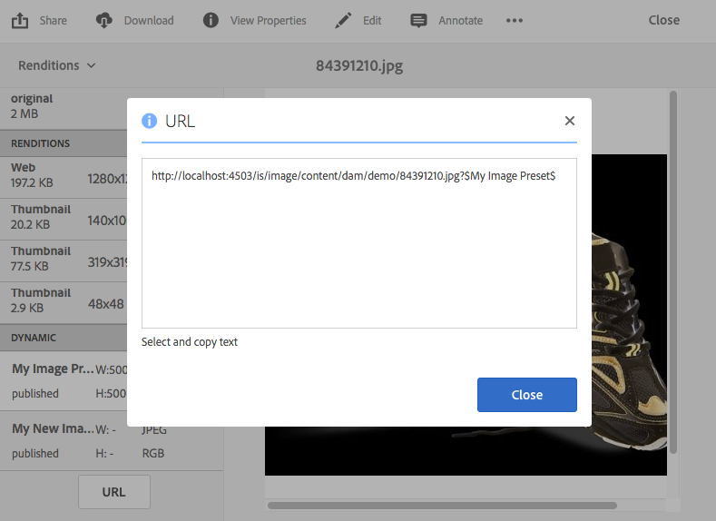
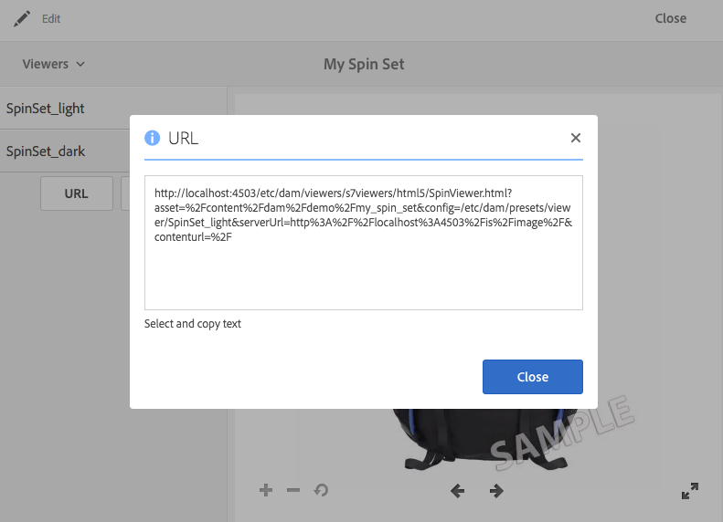

# Vinculación de URL en la aplicación web {#linking-urls-to-your-web-application}

Sus sitios web y aplicaciones acceden a los servicios de Dynamic Media mediante llamadas URL. Después de publicar un recurso, Dynamic Media activa una cadena URL que hace referencia al recurso. Puede pegar estas direcciones URL en un explorador web para probarlas.

Solo se establece un vínculo a las direcciones URL si *no* usa el Experience Manager como WCM. La vinculación, en lugar de la incrustación, se utiliza cuando desea distribuir un reproductor de vídeo como ventana emergente o modal. Si usa Experience Manager como WCM, [agrega los recursos directamente en la página](adding-dynamic-media-assets-to-pages.md).

Para colocar estas cadenas de URL en las páginas web y aplicaciones, cópielas desde Dynamic Media.

>[!NOTE]
>
>Las cadenas URL solo están disponibles para representaciones dinámicas de recursos. Actualmente no están disponibles para recursos estáticos que residen en DAM y no en el servidor de Dynamic Media. El botón URL no aparece para representaciones que son estáticas.

Consulte también [Incrustar el visor de vídeo o de imágenes en una página web](embed-code.md).

Vea también [Vincular URL de YouTube a su aplicación web](video.md).

Ver también [Entregar imágenes optimizadas para un sitio adaptable](responsive-site.md).

Consulte también [Cargar recursos](manage-assets.md#uploading-assets).

## Obtener una URL para un recurso {#obtaining-a-url-for-an-asset}

Puede obtener una cadena URL generada por un ajuste preestablecido de imagen o un ajuste preestablecido de visor. Después de copiar la dirección URL, esta aterriza en el Portapapeles para que pueda pegarla según sea necesario en las páginas del sitio web o de la aplicación.

>[!NOTE]
>
>La URL no estará disponible para copiar hasta que haya publicado el recurso seleccionado. Además, también debe publicar el ajuste preestablecido de visualizador o de imagen.
>
>Consulte [recursos de Publish](publishing-dynamicmedia-assets.md).
>
>Consulte [Ajustes preestablecidos de visor de Publish](managing-viewer-presets.md#publishing-viewer-presets).
>
>Ver [Ajustes preestablecidos de imagen de Publish](managing-image-presets.md#publishing-image-presets).

Existen varias formas de obtener una cadena URL. Sin embargo, los pasos siguientes le muestran solo un método que puede utilizar.

**Para obtener una dirección URL para un recurso:**

1. Vaya al recurso *publicado* cuya URL de ajuste preestablecido de imagen o URL de ajuste preestablecido de visualizador desee copiar y seleccione el recurso para abrirlo.

   Recuerde que las direcciones URL solo están disponibles para copiarse *después* de *publicar* los recursos por primera vez. Además, también se debe publicar el ajuste preestablecido de visualizador o de imagen.

   Consulte [recursos de Publish](publishing-dynamicmedia-assets.md).

   Consulte [Ajustes preestablecidos de visor de Publish](managing-viewer-presets.md#publishing-viewer-presets).

   Ver [Ajustes preestablecidos de imagen de Publish](managing-image-presets.md#publishing-image-presets).

1. En función del recurso que haya seleccionado, realice una de las siguientes acciones:

   * Si seleccionó una imagen, en el menú desplegable, seleccione **[!UICONTROL Representaciones]**.

     Bajo el encabezado **[!UICONTROL Dynamic]**, seleccione un nombre de ajuste preestablecido para ver su representación en el marco derecho. Si es necesario, desplácese por la lista Representaciones para ver el encabezado Dinámico.

     En la parte inferior del carril izquierdo, seleccione **[!UICONTROL URL]**.

     

   * Si seleccionó un conjunto de giros, un conjunto de imágenes, un conjunto de carrusel o un vídeo, en el menú desplegable, seleccione **[!UICONTROL Visualizadores]**.

     En el carril izquierdo, seleccione un nombre de ajuste preestablecido de visualizador. Se abre una vista previa del conjunto o vídeo en una página independiente.

     En el carril izquierdo, al final, seleccione **[!UICONTROL URL]**.

     

1. Seleccione y copie el texto en el explorador web para poder previsualizar el recurso o agregarlo a la página de contenido web.

   Para salir de la ventana URL, selecciona **[!UICONTROL X]** o **[!UICONTROL Cerrar]**.

## Obtener una URL para un recurso estático {#obtaining-a-url-for-a-static-asset}

Dynamic Media admite el envío de recursos estáticos, que son recursos adicionales que van más allá de las imágenes y el vídeo. Los formatos de recursos estáticos admitidos para la entrega incluyen los siguientes:

* Archivos 3D
* GIF animado
* Archivos de audio
* CSS
* JavaScript (cuando su empresa está configurada con su propio dominio)
* PDF
* SVG
* XML
* ZIP

**Para obtener una dirección URL para un recurso estático:**

1. Vaya al recurso estático *publicado* cuya URL desee copiar y seleccione el recurso para abrirlo.

   Recuerde que las direcciones URL solo están disponibles para copiar *después de* de haber *publicado* el recurso estático por primera vez.

   Consulte [recursos de Publish](publishing-dynamicmedia-assets.md).

1. Utilice cualquiera de los siguientes métodos para obtener la URL del recurso estático publicado:

   * `The URL of the published static is the following:`

      * `https://*<server_name>*/is/content/*<company_name>*/*<static_asset_filename>*.*<extension>*`

        Por ejemplo, `https://aem.com/is/content/adobe/image.gif`.

   * Seleccione **[!UICONTROL Recurso]** > **[!UICONTROL Representaciones dinámicas]** y, a continuación, seleccione una representación dinámica del recurso estático y copie la dirección URL.

     Cambie la dirección URL copiada para que utilice `is/content` en la ruta de acceso en lugar de `is/image/`.

## Obtener una URL de vídeo para una representación de vídeo publicada {#obtaining-a-video-url-for-a-published-video-rendition}

1. En Experience Manager, vaya a **[!UICONTROL Herramientas]** > **[!UICONTROL Implementación]** > **[!UICONTROL Nube]** > **[!UICONTROL Cloud Service]**.
1. En la página **[!UICONTROL Cloud Service]**, desplácese hacia abajo hasta el encabezado **[!UICONTROL Cloud Service de Dynamic Media]** y, a continuación, seleccione **[!UICONTROL Mostrar configuraciones]**.
1. En **[!UICONTROL Configuraciones disponibles]**, seleccione el nombre de la configuración que desee.

1. En la página **[!UICONTROL Configuración de Dynamic Media Cloud]**, en **[!UICONTROL URL del servicio de vídeo]**, copie la ruta de URL completa. Debe actualizar la ruta de URL copiada más adelante en los pasos.

   Por ejemplo, la ruta de la URL puede tener un aspecto similar al siguiente:

   `https://s7athens.macromedia.com:9090/DMGateway/`

   (La ruta anterior es solo un ejemplo; no es la ruta real que copia).

1. En **[!UICONTROL ID de registro]**, copie el nombre del cliente que se encuentra en la última parte del ID.

   Por ejemplo, si el id. de registro fuera `87654321|MyCompany`, el nombre del cliente sería `MyCompany`.

1. Cerca de la esquina superior izquierda de la página, seleccione **[!UICONTROL Cloud Service]**, luego seleccione el logotipo del Experience Manager y vaya a **[!UICONTROL General]** > **[!UICONTROL CRXDE Lite]**.
1. Copie toda la ruta de representación de vídeo desde el JCR (repositorio de contenido Java™).

   Por ejemplo, la ruta de representación del vídeo puede tener un aspecto similar al siguiente:

   `/_renditions_/0bd/0bd28743-a616-4fe6-92aa-6eae7c2112f/avs/Momentum_1080-0x720-2600k.mp4`

   (La ruta anterior es solo un ejemplo; no es la ruta real que copia).

1. Organice la información copiada en el siguiente orden para que forme una ruta de URL completa:

   `<Video_Service_URL>/public/<Customer_name_from_Registration_ID>/<Video_rendition_path>`

   Por ejemplo, utilizando las rutas de ejemplo y el nombre de cliente de ejemplo de los pasos anteriores, la ruta completa aparece de la siguiente manera:

   `https://s7athens.macromedia.com:9090/DMGateway/public/MyCompany/_renditions_/0bd/0bd28743-a616-4fe6-92aa-6eae7c2112ff/avs/Momentum_1080-0x720-2600k.mp4`

   Este ejemplo es la dirección URL completa del vídeo para una representación de vídeo publicada.

## Obtener una URL de vídeo para flujo de velocidad de bits adaptable (DASH o HLS) {#obtaining-a-video-url-for-adaptive-streaming-hls}

1. En Experience Manager, vaya a **[!UICONTROL Herramientas]** > **[!UICONTROL Implementación]** > **[!UICONTROL Nube]** > **[!UICONTROL Cloud Service]**.
1. En la página **[!UICONTROL Cloud Service]**, desplácese hacia abajo hasta el encabezado **[!UICONTROL Cloud Service de Dynamic Media]** y, a continuación, seleccione **[!UICONTROL Mostrar configuraciones]**.
1. En **[!UICONTROL Configuraciones disponibles]**, seleccione el nombre de la configuración que desee.
1. En la página **[!UICONTROL Configuración de Cloud Service de Dynamic Media]**, haga lo siguiente:

   * En **[!UICONTROL URL del servicio de vídeo]**, copie la ruta de la URL completa. Necesita la ruta de URL copiada más adelante en estos pasos. Por ejemplo, la ruta de la URL puede tener un aspecto similar al siguiente:

   `https://gateway-na.assetsadobe.com/DMGateway/`

   (La ruta anterior es solo un ejemplo; no es la ruta real que copia).

   * En **[!UICONTROL ID de registro]**, copie el nombre del cliente que se encuentra en la última parte del ID. Necesitará el nombre de cliente que ha copiado más adelante.

     Por ejemplo, si el id. de registro fuera `87654321|demoCo`, el nombre de cliente que copiaría sería `demoCo`.

1. Según el protocolo de entrega de vídeo que utilice, copie el selector de protocolo correspondiente. Necesita el selector de protocolo copiado más adelante en estos pasos.

   | Protocolo de entrega de vídeo que está utilizando | Selector de protocolo a utilizar |
   |---|---|
   | HTTP   Si utiliza HTTP (entrega de vídeo no seguro), asegúrese de cambiar https a http en el valor de URL del servicio de vídeo que copió anteriormente. | `public/` |
   | HTTPS | `public-ssl/` |

1. Copie la ruta completa del recurso de vídeo en Experience Manager, tal como la procesa Dynamic Media. Necesita esta ruta de recursos de vídeo copiada más adelante en estos pasos.

   Por ejemplo:

   `/content/dam/marketing/MyVideo.mp4`

1. Combine todas las piezas copiadas anteriormente para crear una cadena en el siguiente orden:

   &lt; `video service URL`>&lt; `protocol selector`>&lt; `customer name`>&lt; `video asset path`>

   Por ejemplo, utilizando la información copiada de los ejemplos de estos pasos, la cadena aparecería de la siguiente manera:

   `https://gateway-na.assetsadobe.com/DMGateway/public-ssl/demoCo/content/dam/marketing/MyVideo.mp4`

1. Complete la dirección URL adjuntando `.m3u8` al final de la cadena. Por ejemplo, anexando `.m3u8` a la cadena del paso anterior, la ruta de acceso de la dirección URL completa aparecería de la siguiente manera:

   `https://gateway-na.assetsadobe.com/DMGateway/public-ssl/demoCo/content/dam/marketing/MyVideo.mp4.m3u8`

## Utilice HTTP/2 para enviar los recursos de Dynamic Media {#using-http-to-deliver-your-dynamic-media-assets}

HTTP/2 es el nuevo protocolo web actualizado que mejora la forma en que los exploradores y servidores se comunican. Proporciona una transferencia de información más rápida y reduce la cantidad de potencia de procesamiento necesaria. La entrega de recursos de Dynamic Media ahora se puede realizar a través de HTTP/2, que proporciona mejores tiempos de respuesta y carga.

Consulte [Entrega de contenido HTTP2](http2.md) para obtener información detallada sobre cómo empezar a usar HTTP/2 con su cuenta de Dynamic Media.
