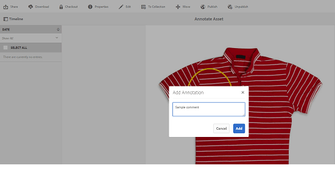

# Administración de recursos digitales {#manage-digital-assets}

| Versión | Vínculo del artículo |
| -------- | ---------------------------- |
| AEM as a Cloud Service | [Haga clic aquí](https://experienceleague.adobe.com/docs/experience-manager-cloud-service/content/assets/manage/manage-digital-assets.html?lang=es) |
| AEM 6.5 | Este artículo |

En [!DNL Adobe Experience Manager Assets], puede hacer más que almacenar y administrar sus recursos. [!DNL Experience Manager] ofrece capacidades de administración de recursos de nivel empresarial. Puede editar y compartir recursos, ejecutar búsquedas avanzadas y crear varias representaciones de decenas de formatos de archivo compatibles. También puede administrar versiones y derechos digitales, automatizar el procesamiento de recursos, administrar y administrar metadatos, colaborar mediante anotaciones y mucho más.

Este artículo describe las tareas básicas de administración de recursos, como crear o cargar; actualizaciones de metadatos; copiar, mover y eliminar; publicar, cancelar la publicación y buscar recursos. Para comprender la interfaz de usuario, consulte [Introducción a la interfaz de usuario de recursos](/help/sites-authoring/basic-handling.md). Para administrar fragmentos de contenido, consulte [administrar fragmentos de contenido](/help/assets/content-fragments/content-fragments-managing.md) recursos.

## Crear carpetas {#creating-folders}

Al organizar una colección de recursos (por ejemplo, todas las `Nature` imágenes), puede crear carpetas para mantenerlas juntas. Puede utilizar carpetas para categorizar y organizar los recursos. [!DNL Experience Manager Assets] no requiere que organice los recursos en carpetas para funcionar mejor.

>[!NOTE]
>
>* No se admite el uso compartido de una carpeta [!DNL Assets] del tipo `sling:OrderedFolder` al compartirla con el Experience Cloud. Si desea compartir una carpeta, no seleccione [!UICONTROL Ordenado] al crear una carpeta.
>* [!DNL Experience Manager] no permite el uso de la palabra `subassets` como nombre de una carpeta. Es una palabra clave reservada para un nodo que contiene subrecursos para recursos compuestos.

1. Vaya al lugar de la carpeta de recursos digitales en el que desea crear una carpeta. En el menú, haga clic en **[!UICONTROL Crear]**. Seleccione **[!UICONTROL Nueva carpeta]**.
1. En el campo **[!UICONTROL Título]**, proporcione un nombre de carpeta. De forma predeterminada, DAM utiliza el título que ha proporcionado como nombre de la carpeta. Una vez creada la carpeta, puede anular el valor predeterminado y especificar otro nombre de carpeta.
1. Haga clic en **[!UICONTROL Crear]**. La carpeta se mostrará en la carpeta de recursos digitales.

No se admiten los siguientes caracteres (lista de caracteres separados por espacios):

* Un nombre de archivo de recursos no puede contener ninguno de estos caracteres: `* / : [ \\ ] | # % { } ? &`
* El nombre de una carpeta de recursos no puede contener ninguno de estos caracteres: `* / : [ \\ ] | # % { } ? \" . ^ ; + & \t`

No incluya caracteres especiales en las extensiones de los nombres de archivo de los recursos.

## Carga de activos {#uploading-assets}

<!-- TBD the following:
Move this section into a new article. CQDOC-14874 ticket is created for this.
In this complete article, replace emphasis with UICONTROL where appropriate.
-->

Puede cargar varios tipos de recursos (incluidas imágenes, archivos de PDF, archivos RAW, etc.) desde la carpeta local o desde una unidad de red a [!DNL Experience Manager Assets].

>[!NOTE]
>
>En el modo Dynamic Media - Scene7, el tamaño predeterminado del archivo de carga de recursos es de 2 GB o menos. Para configurar la carga de recursos de más de 2 GB y hasta 15 GB, consulte [&#x200B; (opcional) Configuración de Dynamic Media: modo Scene7 para cargar recursos de más de 2 GB](/help/assets/config-dms7.md#optional-config-dms7-assets-larger-than-2gb).

>[!IMPORTANT]
>
>Assets que cargue en Experience Manager y que tenga un nombre de archivo de más de 100 caracteres, tendrá un nombre abreviado cuando se utilicen en Dynamic Media.
>
>Los 100 primeros caracteres del nombre de archivo se utilizan tal cual; los caracteres restantes se sustituyen por una cadena alfanumérica. Este método de cambio de nombre garantiza un nombre único cuando el recurso se utiliza en Dynamic Media. También está diseñado para dar cabida a la longitud máxima de nombre de archivo de recursos permitida en Dynamic Media.

Puede elegir cargar recursos en carpetas con o sin un perfil de procesamiento asignado a ellos.

En el caso de las carpetas que tienen un perfil de procesamiento asignado, el nombre del perfil aparece en la miniatura en la vista de tarjeta. En la vista de lista, el nombre del perfil aparece en la columna **Perfil de procesamiento**. Consulte [Perfiles de procesamiento](/help/assets/processing-profiles.md).

Antes de cargar un recurso, asegúrese de que esté en un [formato](/help/assets/assets-formats.md) compatible con [!DNL Experience Manager Assets].

1. En la interfaz de usuario [!DNL Assets], vaya a la ubicación donde desee agregar recursos digitales.
1. Para cargar los recursos, realice una de las siguientes acciones:

   * En la barra de herramientas, haga clic en **[!UICONTROL Crear]**. A continuación, en el menú, haga clic en **[!UICONTROL Archivos]**. Puede cambiar el nombre del archivo en el cuadro de diálogo presentado si es necesario.
   * En un explorador que admita HTML5, arrastre los recursos directamente a la interfaz de usuario de [!DNL Assets]. No se muestra el cuadro de diálogo para cambiar el nombre del archivo.

   

   Para seleccionar varios archivos, seleccione la clave `Ctrl` o `Command` y seleccione los recursos en el cuadro de diálogo del selector de archivos. Al utilizar una iPad, solo puede seleccionar un archivo a la vez.

   Puede pausar la carga de recursos grandes (superiores a 500 MB) y reanudarla más tarde desde la misma página. Haga clic en **[!UICONTROL Pausar]** junto a la barra de progreso que aparece cuando se inicia una carga.

   

El tamaño por encima del cual un recurso se considera un recurso grande es configurable. Por ejemplo, puede configurar el sistema para que considere los recursos superiores a 1000 MB (en lugar de los 500 MB) como recursos grandes. En este caso, **[!UICONTROL Pausa]** aparece en la barra de progreso cuando se cargan recursos de tamaño superior a 1000 MB.

La opción [!UICONTROL Pause] no muestra si se ha cargado un archivo de más de 1000 MB con un archivo de menos de 1000 MB. Sin embargo, si cancela la carga de menos de 1000 MB, aparecerá la opción **[!UICONTROL Pausar]**.

Para modificar el límite de tamaño, configure la propiedad `chunkUploadMinFileSize` del nodo `fileupload` en el repositorio de CRX disponible en `/apps/dam/gui/content/assets/jcr:content/actions/secondary/create/items/fileupload`.

Al hacer clic en **[!UICONTROL Pausa]**, se cambia a la opción **[!UICONTROL Reproducir]**. Para reanudar la carga, haz clic en **[!UICONTROL Reproducir]**.

Para cancelar una carga en curso, haga clic en Cerrar (`X`) junto a la barra de progreso. Al cancelar la operación de carga, [!DNL Assets] elimina la parte del recurso que se ha cargado parcialmente.

La capacidad de reanudar la carga es especialmente útil en situaciones de bajo ancho de banda y problemas de red, en los que se tarda mucho tiempo en cargar un recurso de gran tamaño. Puede pausar la operación de carga y continuar más tarde cuando la situación mejore. Cuando reanude la carga, esta comienza desde el punto en el que la ha pausado.

Durante la operación de carga, [!DNL Experience Manager] guarda las partes del recurso que se están cargando como fragmentos de datos en el repositorio de CRX. Una vez completada la carga, [!DNL Experience Manager] consolida estos fragmentos en un solo bloque de datos en el repositorio.

Para configurar la tarea de limpieza para los trabajos de carga de fragmentos no finalizados, vaya a `https://[aem_server]:[port]/system/console/configMgr/org.apache.sling.servlets.post.impl.helper.ChunkCleanUpTask`.

>[!CAUTION]
>
>La carga de fragmentos se activa cuando el valor predeterminado es 500 MB y el tamaño del fragmento es 50 MB. Si edita [Apache Jackrabbit Oak TokenConfiguration](https://experienceleague.adobe.com/docs/experience-cloud-kcs/kbarticles/KA-16464.html?lang=es) y establece `timeout configuration` en menos del tiempo que tarda un recurso en cargarse, se producirá un tiempo de espera de sesión mientras la carga del recurso está en curso. Por lo tanto, cambie `chunkUploadMinFileSize` y `chunksize` para que cada solicitud de fragmento actualice la sesión.
>
>Teniendo en cuenta el tiempo de espera de caducidad de la credencial, la latencia, el ancho de banda y las cargas simultáneas esperadas, el valor más alto que le permite asegurarse de que se selecciona lo siguiente:
>
>* Para asegurarse de que la carga de fragmentos está habilitada para archivos con tamaños que probablemente causen caducidad de credenciales mientras la carga está en curso.
>
>* Para asegurarse de que cada fragmento termina antes de que caduque la credencial.

Si carga un recurso con el mismo nombre que otro que ya está disponible en la ubicación en la que lo está cargando, se muestra un cuadro de diálogo de advertencia.

Puede elegir reemplazar un recurso existente, crear otra versión o mantener ambos cambiando el nombre del nuevo recurso que se carga. Si reemplaza un recurso existente, se eliminarán los metadatos del recurso y cualquier modificación anterior (por ejemplo, anotar o recortar) que haya realizado en el recurso existente. Si decide conservar ambos recursos, se cambiará el nombre del nuevo recurso y se anexará el número `1` a su nombre.


>[!NOTE]
>
>Cuando selecciona **[!UICONTROL Reemplazar]** en el cuadro de diálogo [!UICONTROL Conflicto de nombres], el ID de recurso se regenera para el nuevo recurso. Este ID es diferente del ID del recurso anterior.
>
>Si Assets Insights está habilitado para rastrear impresiones o clics con [!DNL Adobe Analytics], el ID de recurso regenerado invalida los datos capturados para el recurso en [!DNL Analytics].

Si el recurso que sube existe en [!DNL Assets], el cuadro de diálogo **[!UICONTROL Duplicados detectados]** le advierte de que está intentando cargar un recurso duplicado. El cuadro de diálogo solo aparece si el valor de suma de comprobación `SHA 1` del binario del recurso existente coincide con el valor de suma de comprobación del recurso que carga. En este caso, los nombres de los recursos no importan.

>[!NOTE]
>
>El cuadro de diálogo [!UICONTROL Duplicados detectados] solo aparece cuando la característica de detección de duplicados está habilitada. Para habilitar la característica de detección de duplicados, consulte [Habilitar detección de duplicados](/help/assets/duplicate-detection.md).


Para conservar el recurso duplicado en [!DNL Assets], haga clic en **[!UICONTROL Conservar]**. Para eliminar el recurso duplicado que subió, haga clic en **[!UICONTROL Eliminar]**.

[!DNL Experience Manager Assets] evita que cargue recursos con los caracteres prohibidos en sus nombres de archivo. Si intenta cargar un recurso con un nombre de archivo que contenga un carácter no permitido o más, [!DNL Assets] muestra un mensaje de advertencia y detiene la carga hasta que elimine estos caracteres o realice la carga con un nombre permitido.

Para adaptarse a convenciones de nomenclatura de archivos específicas para su organización, el cuadro de diálogo [!UICONTROL Cargar Assets] le permite especificar nombres largos para los archivos que carga.

Sin embargo, no se admiten los siguientes caracteres (lista de caracteres separados por espacios):

* el nombre de archivo del recurso no debe contener `* / : [ \\ ] | # % { } ? &`
* el nombre de la carpeta de recursos no debe contener `* / : [ \\ ] | # % { } ? \" . ^ ; + & \t`

No incluya caracteres especiales en las extensiones de los nombres de archivo de los recursos.


Además, la interfaz de usuario [!DNL Assets] muestra el recurso más reciente que ha cargado o la carpeta que creó en primer lugar.

Si cancela la operación de carga antes de que se carguen los archivos, [!DNL Assets] detiene la carga del archivo actual y actualiza el contenido. Sin embargo, los archivos que ya se han cargado no se eliminan.

El cuadro de diálogo de progreso de carga en [!DNL Assets] muestra el recuento de archivos cargados correctamente y los archivos que no se cargaron.

### Cargas en serie {#serialuploads}

La carga de numerosos recursos por lotes consume recursos de E/S significativos, lo que puede afectar negativamente al rendimiento de su implementación de [!DNL Assets]. En particular, si tiene una conexión a Internet lenta, el tiempo de carga aumenta drásticamente debido a un pico en la E/S del disco. Es más, su explorador web puede introducir restricciones adicionales en el número de solicitudes de POST que [!DNL Assets] puede administrar para las cargas de recursos simultáneas. Como resultado, la operación de carga falla o finaliza antes de tiempo. En otras palabras, [!DNL Experience Manager Assets] puede omitir algunos archivos al ingerir un conjunto de archivos o puede fallar por completo al ingerir cualquier archivo.

Para superar esta situación, [!DNL Assets] ingiere un recurso a la vez (carga en serie) durante una operación de carga en lotes, en lugar de ingerir simultáneamente todos los recursos.

La carga serie de recursos está habilitada de forma predeterminada. Para deshabilitar la característica y permitir la carga simultánea, superponga el nodo `fileupload` en Crx-de y establezca el valor de la propiedad `parallelUploads` en `true`.

### Carga de recursos mediante FTP {#uploading-assets-using-ftp}

Dynamic Media permite la carga por lotes de recursos a través del servidor FTP. Si tiene intención de cargar recursos grandes (>1 GB) o cargar carpetas y subcarpetas completas, debe utilizar FTP. Incluso puede configurar la carga por FTP para que se produzca de forma programada recurrente.

>[!NOTE]
>
>En el modo Dynamic Media - Scene7, el tamaño predeterminado del archivo de carga de recursos es de 2 GB o menos. Para configurar la carga de recursos de más de 2 GB y hasta 15 GB, consulte [&#x200B; (opcional) Configuración de Dynamic Media: modo Scene7 para cargar recursos de más de 2 GB](/help/assets/config-dms7.md#optional-config-dms7-assets-larger-than-2gb).

>[!NOTE]
>
>Para cargar recursos a través de FTP en el modo Dynamic Media - Scene7, instale Feature Pack 18912 en las instancias de autor de [!DNL Experience Manager]. Póngase en contacto con el servicio de atención al cliente de [Adobe](https://experienceleague.adobe.com/es?support-solution=General#support) para obtener acceso a FP-18912 y completar la configuración de su cuenta de FTP. Para obtener más información, consulte [Instalar paquete de funciones 18912 para la migración masiva de recursos](/help/assets/bulk-ingest-migrate.md).
>
>Si usa FTP para cargar recursos, se omitirá la configuración de carga especificada en [!DNL Experience Manager]. En su lugar, se utilizan las reglas de procesamiento de archivos, tal como se definen en Dynamic Media Classic.

**Para cargar recursos mediante FTP**

1. Si elige un cliente FTP, inicie sesión en el servidor FTP con el nombre de usuario y la contraseña de FTP que recibió del correo electrónico de aprovisionamiento. En el cliente FTP, cargue archivos o carpetas en el servidor FTP.

1. Abra la [aplicación de escritorio de Dynamic Media Classic](https://experienceleague.adobe.com/docs/dynamic-media-classic/using/intro/dynamic-media-classic-desktop-app.html?lang=es#system-requirements-dmc-app) y luego inicie sesión en su cuenta.

   El Adobe proporcionó sus credenciales e inicio de sesión en el momento del aprovisionamiento. Si no dispone de esta información, póngase en contacto con el Servicio de atención al cliente de Adobe.

1. En la barra de navegación global, haga clic en **[!UICONTROL Cargar]**.
1. En la página Cargar, cerca de la esquina superior izquierda, haz clic en la ficha **[!UICONTROL Vía FTP]**.
1. En la parte izquierda de la página, elija una carpeta FTP desde la que cargar los archivos; en la parte derecha de la página, elija una carpeta de destino.
1. Cerca de la esquina inferior derecha de la página, haga clic en **[!UICONTROL Opciones de trabajo]** y establezca las opciones que desee en función de los recursos de la carpeta que seleccionó.

   Ver [Opciones de trabajo de carga](#upload-job-options).

   >[!NOTE]
   >
   >Al cargar recursos a través de FTP, las opciones de trabajo de carga establecidas en Dynamic Media Classic (S7) tienen prioridad sobre los parámetros de procesamiento de recursos establecidos en [!DNL Experience Manager].

1. En la esquina inferior derecha del cuadro de diálogo Opciones del trabajo de carga, haga clic en **[!UICONTROL Guardar]**.
1. En la esquina inferior derecha de la página Cargar, haga clic en **[!UICONTROL Enviar carga]**.

   Para ver el progreso de la carga, en la barra de navegación global, haga clic en **[!UICONTROL Trabajos]**. La página Trabajos muestra el progreso de la carga. Puede seguir trabajando en [!DNL Experience Manager] y volver a la página Trabajos en Dynamic Media Classic en cualquier momento para revisar un trabajo en curso.
Para cancelar un trabajo de carga en curso, haga clic en **[!UICONTROL Cancelar]** junto al campo Duración.

#### Opciones del trabajo de carga {#upload-job-options}

| Opción Cargar | Subopción | Descripción |
|---|---|---|
| Nombre del trabajo | | El nombre predeterminado que se rellena previamente en el campo de texto incluye la parte del nombre introducida por el usuario y la marca de fecha y hora. Puede utilizar el nombre predeterminado o escribir un nombre de su propia creación para este trabajo de carga. <br>El trabajo y otros trabajos de carga y publicación se registran en la página Trabajos, donde puede comprobar el estado de los trabajos. |
| Publish después de la carga | | Publica automáticamente los recursos que carga. |
| Sobrescribir en cualquier carpeta, mismo nombre de base independientemente de la extensión | | Seleccione esta opción si desea que los archivos que cargue reemplacen a los archivos existentes con los mismos nombres. El nombre de esta opción podría ser diferente, según la configuración de **[!UICONTROL Configuración de la aplicación]** > **[!UICONTROL Configuración general]** > **[!UICONTROL Cargar a la aplicación]** > **[!UICONTROL Sobrescribir imágenes]**. |
| Descomprimir archivos Zip o Tar al cargar | | |
| Opciones de trabajo | | Haga clic en **[!UICONTROL Opciones de trabajo]** para poder abrir el cuadro de diálogo [!UICONTROL Opciones de trabajo de carga] y elegir las opciones que afectan a todo el trabajo de carga. Estas opciones son las mismas para todos los tipos de archivo.<br>Puede elegir las opciones predeterminadas para cargar archivos a partir de la página Configuración general de la aplicación. Para abrir esta página, elige **[!UICONTROL Configuración]** > **[!UICONTROL Configuración de la aplicación]**. Seleccione la opción **[!UICONTROL Opciones de carga predeterminadas]** para abrir el cuadro de diálogo [!UICONTROL Opciones de carga de trabajo]. |
| | Cuando  | Seleccione Una vez o Recurrente. Para definir un trabajo recurrente, elija una opción Repetir (Diario, Semanal, Mensual o Personalizado) para especificar cuándo desea que se repita el trabajo de carga por FTP. A continuación, especifique las opciones de programación según sea necesario. |
| | Incluir subcarpetas | Cargue todas las subcarpetas dentro de la carpeta que desee cargar. Los nombres de la carpeta y sus subcarpetas que carga se especifican automáticamente en [!DNL Experience Manager Assets]. |
| | Opciones de recorte | Para recortar manualmente desde los lados de una imagen, seleccione el menú Recortar y elija Manual. A continuación, introduzca el número de píxeles que desea recortar de cualquier lado o de cada lado de la imagen. La cantidad de imagen que se recorta depende de la configuración de ppp (píxeles por pulgada) en el archivo de imagen. Por ejemplo, si la imagen muestra 150 ppp y escribe 75 en los cuadros de texto Superior, Derecho, Inferior e Izquierdo, se recorta una media pulgada de cada lado.<br> Para recortar automáticamente los píxeles de espacio en blanco de una imagen, abra el menú Recortar, elija Manual e introduzca las medidas de los píxeles en los campos Superior, Derecha, Inferior e Izquierda para recortarlos de los lados. También puede elegir Recortar en el menú Recortar y elegir estas opciones:<br> **Recortar Basado En** <ul><li>**Color** - Elija la opción Color. A continuación, seleccione el menú Esquina y elija la esquina de la imagen con el color que mejor represente el color del espacio en blanco que desea recortar.</li><li>**Transparencia**: elija la opción Transparencia.<br> **Tolerancia**: arrastre el control deslizante para especificar una tolerancia de 0 a 1. Para recortar basándose en el color, especifique 0 para recortar píxeles únicamente si coinciden exactamente con el color seleccionado en la esquina de la imagen. Los números más cercanos a 1 permiten una mayor diferencia de color.<br>Para recortar según la transparencia, especifique 0 para recortar píxeles solamente si son transparentes. Los números más cercanos a 1 permiten una mayor transparencia.</li></ul><br>Estas opciones de recorte no son destructivas. |
| | Opciones de perfil de color | Elija una conversión de color al crear los archivos optimizados que se utilizan para la entrega:<ul><li>Conservación de color predeterminada: Mantiene los colores de la imagen de origen siempre que las imágenes contienen información sobre el espacio de color; no hay conversión de color. Casi todas las imágenes de hoy en día tienen el perfil de color adecuado ya incrustado. Sin embargo, si una imagen de origen CMYK no contiene un perfil de color incrustado, los colores se convierten en un espacio de color sRGB (azul verde rojo estándar). sRGB es el espacio de color recomendado para mostrar imágenes en páginas web.</li><li>Mantener el espacio de color original: conserva los colores originales sin ninguna conversión de color en el punto. Para las imágenes sin un perfil de color incrustado, la conversión de color se realiza utilizando los perfiles de color predeterminados configurados en la configuración de Publish. Es posible que los perfiles de color no se alineen con el color en los archivos creados con esta opción. Por lo tanto, se recomienda utilizar la opción Conservación de color predeterminada.</li><li>Personalizar de > A<br> Abre menús para que pueda elegir un espacio de color Convertir de y Convertir a. Esta opción avanzada anula cualquier información de color que esté incrustada en el archivo de origen. Seleccione esta opción cuando todas las imágenes que está enviando contengan datos de perfil de color incorrectos o que falten.</li></ul> |
| | Opciones de edición de imágenes | Puede conservar las máscaras de recorte en las imágenes y elegir un perfil de color.<br> Ver [Opciones de configuración para ediciones de imágenes al cargar](#setting-image-editing-options-at-upload). |
| | Opciones de Postscript | Puede rasterizar archivos de PostScript®, recortar archivos, mantener fondos transparentes, elegir una resolución y elegir un espacio de color.<br> Ver [Configuración de las opciones de carga de PostScript y Illustrator](#setting-postscript-and-illustrator-upload-options). |
| | Opciones de Photoshop | Puede crear plantillas a partir de archivos de Adobe ® Photoshop®, mantener las capas, especificar cómo se asignan los nombres a las capas, extraer el texto y especificar cómo se anclan las imágenes en las plantillas.<br> plantillas no son compatibles con [!DNL Experience Manager].<br> Consulte [Configuración de las opciones de carga de Photoshop](#setting-photoshop-upload-options). |
| | Opciones del PDF | Puede rasterizar los archivos, extraer palabras de búsqueda y vínculos, generar automáticamente un catálogo electrónico, establecer la resolución y elegir un espacio de color.<br>No se admiten catálogos electrónicos en [!DNL Experience Manager]. <br> Consulte [Configuración de opciones de carga del PDF](#setting-pdf-upload-options).<br>**Nota**: El número máximo de páginas para que un PDF se considere para la extracción es 5000 para las nuevas cargas. Este límite cambiará a 100 páginas (para todos los PDF) el 31 de diciembre de 2022. Ver también [limitaciones de Dynamic Media](/help/assets/limitations.md). |
| | Opciones de Illustrator | Puede rasterizar archivos de Adobe Illustrator®, mantener fondos transparentes, elegir una resolución y elegir un espacio de color.<br> Ver [Configuración de las opciones de carga de PostScript y Illustrator](#setting-postscript-and-illustrator-upload-options). |
| | Opciones de vídeo | Puede transcodificar un archivo de vídeo seleccionando un ajuste preestablecido de vídeo.<br> Ver [Configuración de las opciones de carga de eVideo](#setting-evideo-upload-options). |
| | Valores preestablecidos de conjunto por lotes | Para crear un conjunto de imágenes o un conjunto de giros a partir de los archivos cargados, haga clic en la columna Activo del ajuste preestablecido que desee utilizar. Puede seleccionar más de un ajuste preestablecido. Los ajustes preestablecidos se crean en la página Ajustes de aplicación/Ajustes preestablecidos de conjunto de lotes de Dynamic Media Classic.<br> Consulte [Configuración de ajustes preestablecidos de conjuntos de lotes para generar automáticamente conjuntos de imágenes y conjuntos de giros](config-dms7.md#creating-batch-set-presets-to-auto-generate-image-sets-and-spin-sets) para obtener más información sobre la creación de ajustes preestablecidos de conjuntos de lotes.<br> Ver [Establecer ajustes preestablecidos de conjunto de lotes al cargar](#setting-batch-set-presets-at-upload). |

#### Definir opciones para las ediciones de imagen al cargar {#setting-image-editing-options-at-upload}

Al cargar archivos de imagen, incluidos archivos AI, EPS y de PSD, puede realizar las siguientes acciones de edición en el cuadro de diálogo [!UICONTROL Cargar opciones del trabajo]:

* Recorte el espacio en blanco desde el borde de las imágenes (consulte la descripción en la tabla anterior).
* Recortar manualmente desde los lados de las imágenes (consulte la descripción en la tabla anterior).
* Elija un perfil de color (consulte la descripción de la opción en la tabla anterior).
* Crear una máscara a partir de un trazado de recorte.
* Enfoque de imágenes con opciones de máscara de enfoque
* Fondo de cobertura

<!--
| Option | Sub-option | Description |
|---|---|---|
| Create Mask From Clipping Path | | Create a mask for the image based on its clipping path information. This option applies to images created with image-editing applications in which a clipping path was created. |
| Unsharp Masking | | Lets you fine-tune a sharpening filter effect on the final downsampled image, controlling the intensity of the effect, the radius of the effect (as measured in pixels), and a threshold of contrast that is ignored.<br> This effect uses the same options as Photoshop's Unsharp Mask filter. Contrary to what the name suggests, Unsharp Mask is a sharpening filter. Under Unsharp Masking, set the options you want. Setting options are described in the following: |
| | Amount | Controls the amount of contrast that is applied to edge pixels.<br> Think of it as the intensity of the effect. The main difference between the amount values of Unsharp Mask in Dynamic Media and the amount values in Adobe Photoshop, is that Photoshop has an amount range of 1% to 500%. Whereas, in Dynamic Media, the value range is 0.0 to 5.0. A value of 5.0 is the rough equivalent of 500% in Photoshop; a value of 0.9 is the equivalent of 90%, and so on. |
| | Radius | Controls the radius of the effect. The value range is 0-250.<br> The effect is run on all pixels in an image and radiates out from all pixels in all directions. The radius is measured in pixels. For example, to get a similar sharpening effect for a 2000 x 2000 pixel image and 500 x 500 pixel image, you would set a radius of two pixels on the 2000 x 2000 pixel image and a radius value of one pixel on the 500 x 500 pixel image. A larger value is used for an image that has more pixels. |
| | Threshold | Threshold is a range of contrast that is ignored when the Unsharp Mask filter is applied. It is important so that no "noise" is introduced to an image when this filter is used. The value range is 0-255, which is the number of brightness steps in a grayscale image. 0=black, 128=50% gray and 255=white.<br> For example, a threshold value of 12 ignores slight variations is skin tone brightness to avoid adding noise, but still add edge contrast to areas such as where eyelashes meet skin.<br> For example, if you have a photo of someone's face, the Unsharp Mask affects the parts of the image, such as where eyelashes and skin meet to create an obvious area of contrast, and the smooth skin itself. Even the smoothest skin exhibits subtle changes in brightness values. If you do not use a threshold value, the filter accentuates these subtle changes in skin pixels. In turn, a noisy and undesirable effect is created while contrast on the eyelashes is increased, enhancing sharpness.<br> To avoid this issue, a threshold value is introduced that tells the filter to ignore pixels that do not change contrast dramatically, like smooth skin.<br> In the zipper graphic shown earlier, notice the texture next to the zippers. Image noise is exhibited because the threshold values were too low to suppress the noise. |
| | Monochrome | Select to unsharp-mask image brightness (intensity).<br> Deselect to unsharp-mask each color component separately. |
| Knockout Background | | Automatically removes the background of an image when you upload it. This technique is useful to draw attention to a particular object and make it stand out from a busy background. Select to enable or "turn on" the Knockout Background feature and the following sub-options: |
| | Corner | Required.<br> The corner of the image that is used to define the background color to knockout.<br> You can choose from **Upper Left**, **Bottom Left**, **Upper Right**, or **Bottom Right**. |
| | Fill Method | Required.<br> Controls pixel transparency from the Corner location that you set.<br> You can choose from the following fill methods: <ul><li>**Flood Fill** - turns all pixels transparent that match the Corner that you have specified and are connected to it.</li><li>**Match Pixel** - turns all matching pixels transparent, regardless of their location on the image.</li></ul> |
| | Tolerance | Optional.<br> Controls the allowable amount of variation in pixel color matching based on the Corner location that you set.<br> Use a value of 0.0 to match pixel colors exactly or, use a value of 1.0 to allow for the greatest variation. |
-->

#### Definición de las opciones de carga de PostScript y Illustrator {#setting-postscript-and-illustrator-upload-options}

Al cargar archivos de imagen de PostScript (EPS) o Illustrator (AI), puede aplicarles formato de varias formas. Puede rasterizar los archivos, mantener el fondo transparente, elegir una resolución y elegir un espacio de color. Las opciones para formatear archivos de PostScript y Illustrator están disponibles en el cuadro de diálogo [!UICONTROL Cargar opciones del trabajo] en [!UICONTROL Opciones de PostScript] y [!UICONTROL Opciones de Illustrator].

| Opción | Subopción | Descripción |
|---|---|---|
| Procesamiento | | Elija **[!UICONTROL Rasterizar]** para convertir los gráficos vectoriales del archivo al formato de mapa de bits. |
| Mantener el fondo transparente en la imagen procesada | | Mantenga la transparencia en segundo plano del archivo. |
| Resolución | | Determina la configuración de resolución. Esta configuración determina cuántos píxeles se muestran por pulgada en el archivo. |
| Espacio color | | Seleccione el menú Espacio de color y elija entre las siguientes opciones de espacio de color: |
| | Detectar automáticamente | Conserva el espacio de color del archivo. |
| | Forzar como RGB | Convierte al espacio de color del RGB. |
| | Forzar como CMYK | Convierte al espacio de color CMYK. |
| | Forzar como escala de grises | Convierte al espacio de color en escala de grises. |

#### Determinar las opciones de carga de Photoshop {#setting-photoshop-upload-options}

Los archivos de documento de Photoshop (PSD) se utilizan principalmente para crear plantillas de imagen. Al cargar un archivo de PSD, puede crear una plantilla de imagen automáticamente a partir del archivo (seleccione la opción [!UICONTROL Crear plantilla] en la pantalla Cargar).

Dynamic Media crea varias imágenes a partir de un archivo de PSD con capas si utiliza el archivo para crear una plantilla; crea una imagen para cada capa.

Use las [!UICONTROL Opciones de recorte] y las [!UICONTROL Opciones de perfil de color], descritas anteriormente, con las opciones de carga de Photoshop.

>[!NOTE]
>
>No se admiten plantillas en [!DNL Experience Manager].

| Opción | Subopción | Descripción |
|---|---|---|
| Mantener capas | | Extrae las capas del PSD, si las hay, en recursos individuales. Las capas de recursos permanecen asociadas al PSD. Para verlos, abra el fichero PSD en la Vista de detalles y seleccione el panel Capa. |
| Crear plantilla | | Crea una plantilla a partir de las capas del fichero de PSD. |
| Extraer texto | | Extrae el texto para que los usuarios puedan buscar texto en un visor. |
| Extender las capas al tamaño del fondo | | Amplía el tamaño de las capas de imagen copiadas al tamaño de la capa de fondo. |
| Nombres de capas | | Las capas del archivo de PSD se cargan como imágenes independientes. |
| | Nombre de capa | Nombra las imágenes después de sus nombres de capa en el archivo PSD. Por ejemplo, una capa denominada Etiqueta de precio en el archivo PSD original se convierte en una imagen denominada Etiqueta de precio. Sin embargo, si los nombres de las capas del fichero de PSD son nombres de capas Photoshop por defecto (Fondo, Capa 1, Capa 2, etc.), las imágenes recibirán los nombres de sus números de capa en el fichero de PSD. No reciben un nombre por sus nombres de capa predeterminados. |
| | Photoshop y número de capa | Nombra las imágenes después de sus números de capa en el fichero PSD, ignorando los nombres de capa originales. Las imágenes se nombran con el nombre de archivo Photoshop y un número de capa anexado. Por ejemplo, la segunda capa de un archivo llamado Anuncio de primavera.psd se llama Anuncio de primavera_2 aunque tuviera un nombre no predeterminado en Photoshop. |
| | Nombre de capa y Photoshop | Nombra las imágenes después del archivo de PSD seguido del nombre o número de capa. El número de capa se utiliza si los nombres de capa del fichero de PSD son nombres de capa de Photoshop por defecto. Por ejemplo, una capa denominada Etiqueta de precio en un archivo de PSD denominado SpringAd se denomina Etiqueta de precio de anuncio de primavera. Una capa con el nombre predeterminado Capa 2 se denomina Anuncio de primavera_2. |
| Anclaje | | Especifique cómo se anclan las imágenes en las plantillas que se generan a partir de la maquetación por capas producida a partir del fichero PSD. De forma predeterminada, el anclaje es el centro. Un anclaje central permite que las imágenes de reemplazo llenen mejor el mismo espacio, sin importar la proporción de aspecto de la imagen de reemplazo. Las imágenes con un aspecto diferente que reemplazan a esta imagen, al hacer referencia a la plantilla y utilizar la sustitución de parámetros, ocupan efectivamente el mismo espacio. Cambie a una configuración diferente si la aplicación requiere las imágenes de reemplazo para rellenar el espacio asignado en la plantilla. |

#### Definir opciones de carga del PDF {#setting-pdf-upload-options}

Al cargar un archivo de PDF, puede aplicarle formato de varias formas. Recorta sus páginas, extrae palabras de búsqueda, introduce una resolución de píxeles por pulgada y elige un espacio de color. Los archivos de PDF suelen contener un margen de recorte, marcas de recorte, marcas de registro y otras marcas de impresora. Puede recortar estas marcas desde los lados de las páginas a medida que carga un archivo de PDF.

El número máximo de páginas para que un PDF se tenga en cuenta para la extracción es de 5000 para las nuevas cargas. Este límite cambiará a 100 páginas (para todos los PDF) el 31 de diciembre de 2022. Ver también [limitaciones de Dynamic Media](/help/assets/limitations.md).

>[!NOTE]
>
>No se admiten catálogos electrónicos en [!DNL Experience Manager].

Elija entre las siguientes opciones:

| Opción | Subopción | Descripción |
|---|---|---|
| Procesamiento | Rasterizar | (Predeterminado) Extrae las páginas del archivo PDF y convierte los gráficos vectoriales en imágenes de mapa de bits. Elija esta opción si desea crear un catálogo electrónico. |
| Extraer | Palabras de búsqueda | Extrae palabras del archivo del PDF para que se pueda buscar en él por palabra clave en un visor de catálogos electrónicos. |
| | Vínculos | Extrae vínculos de los archivos del PDF y los convierte a mapas de imágenes que se utilizan en un visor de catálogos electrónicos. |
| Generar catálogo electrónico automáticamente a partir de un PDF de varias páginas | | Crea automáticamente un catálogo electrónico a partir del archivo del PDF. El catálogo electrónico recibe el nombre del archivo de PDF que ha cargado. (Esta opción solo está disponible si rasteriza el archivo de PDF a medida que lo carga). |
| Resolución | | Determina la configuración de resolución. Esta configuración determina cuántos píxeles se muestran por pulgada en el archivo de PDF. El valor predeterminado es 150. |
| Espacio color | | Seleccione el menú Espacio de color y elija un espacio de color para el archivo del PDF. La mayoría de los archivos de PDF tienen imágenes en color RGB y CMYK. El espacio de color RGB es preferible para la visualización en línea. |
| | Detectar automáticamente | Conserva el espacio de color del archivo del PDF. |
| | Forzar RGB | Convierte al espacio de color del RGB. |
| | Forzar CMYK | Convierte al espacio de color CMYK. |
| | Forzar escala de grises | Convierte al espacio de color en escala de grises. |

#### Determinar las opciones de carga de eVideo {#setting-evideo-upload-options}

Para transcodificar un archivo de vídeo eligiendo entre varios ajustes preestablecidos de vídeo.

| Opción | Subopción | Descripción |
|---|---|---|
| Vídeo adaptable | | Un solo ajuste preestablecido de codificación que funciona con cualquier relación de aspecto para crear vídeos para su envío a dispositivos móviles, tabletas y de escritorio. Los vídeos de origen cargados que se codifican con este ajuste preestablecido se establecen con una altura fija. Sin embargo, la anchura se amplía automáticamente para conservar la relación de aspecto del vídeo. <br>Una práctica recomendada es utilizar la codificación de vídeo adaptable. |
| Ajustes preestablecidos de codificación única | Ordenar ajustes preestablecidos de codificación | Seleccione **[!UICONTROL Nombre]** o **[!UICONTROL Tamaño]** si desea ordenar los ajustes preestablecidos de codificación enumerados en Escritorio, Móvil y Tablet por nombre o por tamaño de resolución. |
| | Escritorio | Cree un archivo MP4 para ofrecer una experiencia de flujo continuo o vídeo progresivo a los equipos de escritorio. Seleccione una o varias relaciones de aspecto con el tamaño de resolución y la velocidad de datos de destino que desee. |
| | Mobile | Cree un archivo MP4 para su envío a dispositivos móviles iPhone o Android™. Seleccione una o varias relaciones de aspecto con el tamaño de resolución y la velocidad de datos de destino que desee. |
| | Tableta | Cree un archivo MP4 para su envío a dispositivos iPad o tabletas Android™. Seleccione una o varias relaciones de aspecto con el tamaño de resolución y la velocidad de datos de destino que desee. |

#### Establecer ajustes preestablecidos del conjunto de lotes al cargar {#setting-batch-set-presets-at-upload}

Si desea crear automáticamente un conjunto de imágenes o un conjunto de giros a partir de imágenes cargadas, haga clic en la columna Activo del ajuste preestablecido que desee utilizar. Puede seleccionar más de un ajuste preestablecido.

Consulte [Configuración de ajustes preestablecidos de conjuntos de lotes para generar conjuntos de imágenes y conjuntos de giros automáticamente](/help/assets/config-dms7.md#creating-batch-set-presets-to-auto-generate-image-sets-and-spin-sets) para obtener más información sobre la creación de ajustes preestablecidos de conjuntos de lotes.

### Cargas transmitidas {#streamed-uploads}

Si carga muchos recursos en Adobe Experience Manager, las solicitudes de E/S al servidor aumentan drásticamente, lo que reduce la eficacia de carga y puede incluso provocar que se agote el tiempo de espera de algunas tareas de carga. [!DNL Experience Manager Assets] admite la carga en flujo de recursos. La carga transmitida reduce la E/S del disco durante la operación de carga al evitar el almacenamiento de recursos en una carpeta temporal del servidor antes de copiarlos en el repositorio. En su lugar, los datos se transfieren directamente al repositorio. De este modo, se reduce el tiempo para cargar recursos grandes y la posibilidad de tiempos de espera. La carga transmitida está habilitada de manera predeterminada en [!DNL Assets].

>[!NOTE]
>
>La carga por streaming está deshabilitada para Adobe Experience Manager que se ejecuta en un servidor JEE con una versión de API de servlet inferior a la 3.1.

### Extraer archivo ZIP que contiene recursos {#extractzip}

Puede cargar archivos ZIP como cualquier otro recurso compatible. Las mismas reglas de nombre de archivo se aplican a los archivos ZIP. [!DNL Experience Manager] le permite extraer un archivo ZIP a una ubicación DAM. Si los archivos de almacenamiento no contienen ZIP como extensión, habilite la detección de tipos de archivo mediante contenido.

Seleccione un archivo ZIP a la vez, haga clic en **[!UICONTROL Extraer archivo]** y seleccione una carpeta de destino. Seleccione una opción que desee que gestione conflictos, si los hay. Si los recursos del archivo ZIP existen en la carpeta de destino, puede seleccionar una de estas opciones: omitir extracción, reemplazar archivos existentes, mantener ambos recursos cambiando el nombre o crear una versión.

Una vez finalizada la extracción, [!DNL Experience Manager] le notifica en el área de notificación. Mientras [!DNL Experience Manager] extrae el ZIP, puede volver a su trabajo sin interrumpir la extracción.


Algunas limitaciones de la función son:

* Si existe una carpeta con el mismo nombre en el destino, los recursos del archivo ZIP se extraen en la carpeta existente.
* Si cancela la extracción, no se eliminarán los recursos ya extraídos.
* No puede seleccionar dos archivos ZIP al mismo tiempo y extraerlos. Solo puede extraer un archivo ZIP a la vez.
* Al cargar un archivo ZIP, si el cuadro de diálogo de carga muestra un error de servidor 500, vuelva a intentarlo después de instalar [el Service Pack más reciente](/help/release-notes/release-notes.md).

## Previsualización de recursos {#previewing-assets}

Para obtener una vista previa de un recurso, siga estos pasos.

1. Desde la interfaz de usuario [!DNL Assets], vaya a la ubicación del recurso que desea previsualizar.
1. Haga clic en el recurso deseado para poder abrirlo.

1. En el modo de vista previa, hay opciones de zoom disponibles para [tipos de imagen compatibles](/help/assets/assets-formats.md#supported-raster-image-formats) (con edición interactiva).

   Para ampliar un recurso, haga clic en `+` (o haga clic en la lupa del recurso). Para alejar, haga clic en `-`. Al acercar, puede mirar de cerca cualquier área de la imagen si realiza una panorámica. La flecha para restablecer el zoom le devuelve a la vista original. Para restablecer la vista al tamaño original, haz clic en **[!UICONTROL Restablecer]** .

**Obtener vista previa de recursos usando solo teclas de teclado**

Para obtener una vista previa de un recurso mediante el teclado, siga estos pasos:

1. Desde la interfaz de usuario [!DNL Assets], navegue hasta el recurso deseado mediante `Tab` y las teclas de dirección.

1. Presione la tecla `Enter` en el recurso deseado para poder abrirlo. Puede ampliar los recursos en el modo de vista previa.

1. Para hacer zoom en el recurso:
   1. Utilice la tecla `Tab` para desplazar el foco a la opción de ampliar.
   1. Utilice la tecla `Enter` para ampliar la imagen.

   Para alejar, use la tecla `Tab` para enfocar la opción de alejar y presione `Enter`.

1. Utilice las teclas `Shift` + `Tab` para volver a enfocar la imagen.

1. Utilice las teclas de flecha para desplazarse por la imagen ampliada.

>[!MORELIKETHIS]
>
>* [Vista previa de Dynamic Media Assets](/help/assets/previewing-assets.md).
>* [Ver recursos secundarios](managing-linked-subassets.md#viewing-subassets).

## Editar propiedades y metadatos {#editing-properties}

1. Vaya a la ubicación del recurso cuyos metadatos desee editar.

1. Seleccione el recurso y, a continuación, en la barra de herramientas, seleccione **[!UICONTROL Propiedades]** para poder ver las propiedades del recurso. También puede elegir la acción rápida **[!UICONTROL Propiedades]** en la tarjeta de recursos.

   

1. En la página [!UICONTROL Propiedades], edite las propiedades de los metadatos en varias fichas. Por ejemplo, en la ficha **[!UICONTROL Básico]**, edite el título y la descripción.

   >[!NOTE]
   >
   >El diseño de la página [!UICONTROL Properties] y las propiedades de metadatos disponibles dependen del esquema de metadatos subyacente. Para obtener información sobre cómo modificar el diseño de la página [!UICONTROL Propiedades], consulte [Esquemas de metadatos](/help/assets/metadata-schemas.md).

1. Para programar una fecha y hora determinada para la activación del recurso, utilice el selector de fechas situado junto al campo **[!UICONTROL Tiempo de activación]**.

   

   *Imagen: use el selector de fechas para programar la activación de recursos.*

1. Marque la opción **[!UICONTROL Tiempo de activación/desactivación alcanzado]** si desea actualizar las déclencheur del agente de replicación en las propiedades de metadatos.
   

1. Para desactivar el recurso después de una duración determinada, elija la fecha y la hora de desactivación del selector de fechas situado junto al campo **[!UICONTROL Tiempo de inactividad]**. La fecha de desactivación debe ser posterior a la fecha de activación de un recurso. Después del [!UICONTROL tiempo de inactividad], un recurso y sus representaciones no están disponibles a través de la interfaz web [!DNL Assets] ni a través de la API HTTP.

1. En el campo **[!UICONTROL Etiquetas]**, seleccione una o más etiquetas. Para agregar una etiqueta personalizada, escriba el nombre en el cuadro y seleccione `Enter`. La nueva etiqueta se guardó en [!DNL Experience Manager]. [!DNL YouTube] requiere etiquetas para publicar. Ver [publicar vídeos en YouTube](video.md#publishing-videos-to-youtube).

   >[!NOTE]
   >
   >Para crear etiquetas, necesita permiso de escritura en `/content/cq:tags/default` en el repositorio de CRX.

1. Para clasificar el recurso, haga clic en la ficha **[!UICONTROL Avanzado]** y, a continuación, haga clic en la estrella adecuada para asignar la clasificación que desee.

   

   La puntuación de clasificación que asigna al recurso se muestra en **[!UICONTROL Sus clasificaciones]**. La puntuación de clasificación promedio que el recurso recibió de los usuarios que lo calificaron se muestra en **[!UICONTROL Clasificación]**. Además, el desglose de las puntuaciones de clasificación que contribuyen a la puntuación de clasificación promedio se muestra en **[!UICONTROL Desglose de clasificación]**. Puede buscar recursos en función de las puntuaciones de clasificación promedio.

1. Para ver las estadísticas de uso del recurso, haga clic en la ficha **[!UICONTROL Información]**.

   Las estadísticas de uso incluyen lo siguiente:

   * Número de veces que se vio o descargó el recurso
   * Canales/dispositivos a través de los cuales se ha utilizado el recurso
   * Soluciones creativas en las que el recurso se ha utilizado recientemente

   Para obtener más información, consulte [Assets Insights](/help/assets/asset-insights.md).

1. Haga clic en **[!UICONTROL Guardar y cerrar]**.
1. Vaya a la interfaz de usuario [!DNL Assets]. Las propiedades de metadatos editadas, como título, descripción, clasificaciones, etc., se muestran en la tarjeta de recursos en la vista Tarjeta y en las columnas relevantes de la vista Lista.

## Copiar recursos {#copying-assets}

Al copiar un recurso o una carpeta, se copia todo el recurso o la carpeta, junto con su estructura de contenido. Un recurso o una carpeta copiados están duplicados en la ubicación de destino. El recurso en la ubicación de origen no se modifica.

Algunos atributos que son únicos de una copia concreta de un recurso no se transfieren. Algunos ejemplos son:

* ID de recurso, fecha y hora de creación, y versiones e historial de versiones. Algunas de estas propiedades están indicadas por las propiedades `jcr:uuid`, `jcr:created` y `cq:name`.

* La hora de creación y las rutas referenciadas son únicas para cada recurso y cada una de sus representaciones.

Se conservan las demás propiedades e información de metadatos. No se crea una copia parcial al copiar un recurso.

1. En la interfaz [!DNL Assets], seleccione uno o varios recursos y haga clic en **[!UICONTROL Copiar]** en la barra de herramientas. También puede seleccionar la opción **[!UICONTROL Copiar]**  desde la tarjeta de recursos.

   >[!NOTE]
   >
   >Si usa la acción rápida [!UICONTROL Copiar], solo podrá copiar un recurso a la vez.

1. Vaya a la ubicación en la que desea copiar los recursos.

   >[!NOTE]
   >
   >Si copia un recurso en la misma ubicación, [!DNL Experience Manager] genera automáticamente una variación del nombre. Por ejemplo, si copia un recurso con el título `Square`, [!DNL Experience Manager] genera automáticamente el título de su copia como `Square1`.

1. Haga clic en la opción de recurso **[!UICONTROL Pegar]**  desde la barra de herramientas. A continuación, los Assets se copian en esta ubicación.

   >[!NOTE]
   >
   >La opción **[!UICONTROL Pegar]** está disponible en la barra de herramientas hasta que finalice la operación de pegado.

## Mover y cambiar el nombre de recursos {#moving-or-renaming-assets}

Cuando mueve recursos (o carpetas) a otra ubicación, los recursos (o carpetas) no se duplican de forma distinta a al copiar el recurso. Los recursos (o las carpetas) se colocan en la ubicación de destino y se eliminan de la ubicación de origen. También puede cambiar el nombre del recurso al moverlo a la nueva ubicación.
Si mueve un recurso publicado a una ubicación diferente, puede volver a publicar el recurso de forma opcional. De forma predeterminada, la operación de movimiento en un recurso publicado cancela su publicación automáticamente. Un recurso movido se vuelve a publicar si el autor selecciona la opción [!UICONTROL Volver a publicar] al mover el recurso.


Para mover recursos o carpetas:

1. Desplácese hasta la ubicación del recurso que desee mover.

1. Seleccione el recurso y haga clic en la opción **[!UICONTROL Mover]** en la barra de herramientas.
   

1. En el asistente [!UICONTROL Mover Assets], realice una de las siguientes acciones:

   * Especifique el nombre del recurso una vez que se haya movido. A continuación, haga clic en **[!UICONTROL Siguiente]** para continuar.

   * Haga clic en **[!UICONTROL Cancelar]** para detener el proceso.

   >[!NOTE]
   >
   >* Puede especificar el mismo nombre para el recurso si no hay ningún recurso con ese nombre en la nueva ubicación. Sin embargo, debe utilizar un nombre diferente si mueve el recurso a una ubicación en la que exista un recurso con el mismo nombre. Si utiliza el mismo nombre, el sistema genera automáticamente una variación del nombre. Por ejemplo, si el recurso tiene el nombre Cuadrado, el sistema genera el nombre Cuadrado1 para su copia.
   >* Al cambiar el nombre, no se permiten espacios en blanco en el nombre del archivo.

1. En el cuadro de diálogo **[!UICONTROL Seleccionar destino]**, realice una de las siguientes acciones:

   * Vaya a la nueva ubicación de los recursos y, a continuación, haga clic en **[!UICONTROL Siguiente]** para continuar.

   * Haga clic en **[!UICONTROL Atrás]** para volver a la pantalla **[!UICONTROL Cambiar nombre]**.

1. Si los recursos que se están moviendo tienen páginas, recursos o colecciones de referencia, la ficha **[!UICONTROL Ajustar referencias]** aparece junto a la ficha **[!UICONTROL Seleccionar destino]**.

   Realice una de las siguientes acciones en la pantalla **[!UICONTROL Ajustar referencias]**:

   * Especifique las referencias que se van a ajustar en función de los nuevos detalles y, a continuación, haga clic en **[!UICONTROL Mover]** para continuar.

   * En la columna **[!UICONTROL Ajustar]**, seleccione o anule la selección de referencias a los recursos.
   * Haga clic en **[!UICONTROL Atrás]** para volver a la pantalla **[!UICONTROL Seleccionar destino]**.

   * Haga clic en **[!UICONTROL Cancelar]** para detener la operación de movimiento.

   Si no actualiza las referencias, seguirán apuntando a la ruta anterior del recurso. Si ajusta las referencias, se actualizan a la nueva ruta del recurso.

### Movimiento de recursos mediante la operación de arrastrar {#move-using-drag}

Puede mover recursos (o carpetas) a una carpeta del mismo nivel arrastrándolos a la ubicación de destino, en lugar de usar la opción [!UICONTROL Mover] en la interfaz de usuario. Sin embargo, esta operación solo es posible en la vista de lista.

Al mover recursos arrastrándolos, no se abre el asistente [!UICONTROL Mover recurso], por lo que no tiene la opción de cambiar el nombre de los recursos al moverlos. Además, los recursos ya publicados se vuelven a publicar al moverlos arrastrándolos, sin solicitar la aprobación del usuario para volver a publicarlos.


## Administrar representaciones {#managing-renditions}

1. Puede agregar o quitar representaciones de un recurso, excepto el original. Vaya a la ubicación del recurso para el que desea agregar o quitar representaciones.

1. Haga clic en el recurso para abrir su página.
1. En la interfaz del Experience Manager, seleccione **[!UICONTROL Representaciones]** en la lista.
1. En el panel **[!UICONTROL Representaciones]**, vea la lista de representaciones generadas para el recurso.

   

   >[!NOTE]
   >
   >De manera predeterminada, [!DNL Assets] no muestra la representación original del recurso en el modo de vista previa. Si es administrador, puede usar superposiciones para configurar [!DNL Assets] de modo que se muestren las representaciones originales en el modo de vista previa.

1. Seleccione una representación para verla o eliminarla.

   **Eliminar una representación**

   Seleccione una representación en el panel **[!UICONTROL Representaciones]** y, a continuación, haga clic en la opción **[!UICONTROL Eliminar representación]**  de la barra de herramientas. Las representaciones no se pueden eliminar por lotes una vez completado el procesamiento del recurso. Para los recursos individuales, puede eliminar las representaciones manualmente desde la interfaz de usuario. Para varios recursos, puede personalizar Experience Manager para eliminar representaciones específicas o eliminar los recursos y volver a cargar los recursos eliminados.

   **Cargar una nueva representación**

   Vaya a la página de detalles del recurso y haga clic en la opción **[!UICONTROL Agregar representación]**  de la barra de herramientas para cargar una nueva representación para el recurso.

   >[!NOTE]
   >
   >Si selecciona una representación en el panel **[!UICONTROL Representaciones]**, la barra de herramientas cambia de contexto y muestra solo las acciones que son relevantes para la representación. No se muestran las opciones, como la opción [!UICONTROL Cargar representación]. Para ver estas opciones en la barra de herramientas, vaya a la página de detalles del recurso.

   Puede configurar las dimensiones de la representación que desee que se muestren en la página de detalles de un recurso de imagen o vídeo. Según las dimensiones que especifique, [!DNL Assets] muestra la representación con las dimensiones exactas o más cercanas.

   Para configurar las dimensiones de representación de una imagen en el nivel de detalle del recurso, superponga el `renditionpicker` nodo (`libs/dam/gui/content/assets/assetpage/jcr:content/body/content/content/items/assetdetail/items/col1/items/assetview/renditionpicker`) y configure el valor de la propiedad de anchura. Configure la propiedad **[!UICONTROL size (Long) en KB]** en lugar de width para que pueda personalizar la representación en la página de detalles del recurso según el tamaño de la imagen. En el caso de la personalización basada en el tamaño, la propiedad `preferOriginal` asigna preferencia al original si el tamaño de la representación coincidente es mayor que el del original.

   Del mismo modo, puede personalizar la imagen de la página Anotación superponiendo `libs/dam/gui/content/assets/annotate/jcr:content/body/content/content/items/content/renditionpicker`.

   

   Para configurar las dimensiones de representación de un recurso de vídeo, vaya al nodo `videopicker` en el repositorio de CRX en la ubicación `/libs/dam/gui/content/assets/assetpage/jcr:content/body/content/content/items/assetdetail/items/col1/items/assetview/videopicker`, superponga el nodo y, a continuación, edite la propiedad adecuada.

   >[!NOTE]
   >
   >Las anotaciones de vídeo solo se admiten en navegadores con formatos de vídeo compatibles con HTML5. Además, según el explorador, se admiten diferentes formatos de vídeo. Sin embargo, el formato de vídeo MXF aún no es compatible con las anotaciones de vídeo.

Para obtener más información sobre cómo generar y ver subrecursos, consulte [Administrar subrecursos](managing-linked-subassets.md#generate-subassets).

## Eliminar recursos {#deleting-assets}

Para eliminar recursos, un usuario necesita permisos de eliminación en `dam/asset`. Si solo tiene permisos de modificación, solo puede editar los metadatos del recurso y agregar anotaciones al recurso. Sin embargo, no puede eliminar el recurso ni sus metadatos.

Para resolver o quitar las referencias entrantes de otras páginas, actualice las referencias relevantes antes de eliminar un recurso. Para impedir que los usuarios eliminen los recursos a los que se hace referencia y los vínculos rotos, desactive la opción Forzar eliminación con una superposición.

Para eliminar un recurso o una carpeta que contenga un recurso:

1. Vaya a la ubicación del recurso o a la carpeta que desee eliminar.

1. Seleccione el recurso o la carpeta y haga clic en **[!UICONTROL Eliminar]**  en la barra de herramientas.

   Una vez confirmada la eliminación:

   * Si el recurso no tiene referencias, se elimina.

   * Si el recurso tiene referencias, un mensaje de error le informa de que se hace referencia a **Uno o más recursos**. Puede seleccionar **[!UICONTROL Forzar eliminación]** o **[!UICONTROL Cancelar]**.

   >[!NOTE]
   >
   >* Para resolver o quitar las referencias entrantes de otras páginas, actualice las referencias relevantes antes de eliminar un recurso. Además, deshabilite la opción de eliminación forzada mediante una superposición para impedir que los usuarios eliminen los recursos a los que se hace referencia y dejen los vínculos rotos.
   >* Es posible eliminar una *carpeta* que contenga archivos de recursos desprotegidos. Antes de eliminar una carpeta, asegúrese de que los usuarios no desprotejan ningún recurso digital.

>[!NOTE]
>
>Si elimina una carpeta mediante el método anterior de la interfaz de usuario, también se eliminarán los grupos de usuarios asociados.
>
>Sin embargo, los grupos de usuarios redundantes, no utilizados y autogenerados se pueden limpiar del repositorio con el método `clean` en JMX en la instancia de autor (`https://[server]:[port]/system/console/jmx/com.day.cq.dam.core.impl.team%3Atype%3DClean+redundant+groups+for+Assets`).

## Descarga de recursos {#downloading-assets}

Consulte [Descargar recursos del Experience Manager](/help/assets/download-assets-from-aem.md).

## Publish o cancelar la publicación de recursos {#publish-assets}

Después de cargar, procesar o editar los recursos en el autor de [!DNL Experience Manager], publique el recurso en el servidor de publicación. La publicación hace que el recurso esté disponible públicamente. La acción de cancelación de publicación eliminó el recurso del servidor de publicación, pero no del servidor de creación.

Para obtener información específica de [!DNL Dynamic Media], consulte [publicación [!DNL Dynamic Media] recursos](/help/assets/publishing-dynamicmedia-assets.md).

1. Vaya a la ubicación del recurso o la carpeta de recursos que desee publicar o quitar del entorno de publicación (cancelar publicación).

1. Seleccione el recurso o la carpeta cuya publicación desea cancelar y haga clic en la opción **[!UICONTROL Administrar publicación]**  en la barra de herramientas. Como alternativa, para publicar rápidamente, selecciona la opción **[!UICONTROL Quick Publish]** de la barra de herramientas. Si la carpeta que desea publicar incluye una carpeta vacía, esta no se publicará.

1. Seleccione la opción **[!UICONTROL Publish]** o **[!UICONTROL Cancelar la publicación]** según sea necesario.

   
   *Figura: Opciones de Publish y cancelación de publicación y la opción de programación.*

1. Seleccione **[!UICONTROL Ahora]** para actuar sobre el recurso de inmediato o seleccione **[!UICONTROL Más tarde]** para programar la acción. Seleccione una fecha y una hora si elige la opción **[!UICONTROL Más tarde]**. Haga clic en **[!UICONTROL Siguiente]**.

1. Al publicar, si un recurso hace referencia a otros recursos, sus referencias se enumeran en el asistente. Solo se muestran las referencias que no se han publicado o que se han modificado desde la última publicación. Elija las referencias que desea publicar.

1. Al cancelar la publicación, si un recurso hace referencia a otros recursos, elija las referencias que desea cancelar la publicación. Haga clic en **[!UICONTROL Cancelar la publicación]**. En el cuadro de diálogo de confirmación, haga clic en **[!UICONTROL Cancelar]** para detener la acción o haga clic en **[!UICONTROL Cancelar la publicación]** para confirmar que se cancelará la publicación de los recursos en la fecha especificada.

Conozca las siguientes limitaciones y sugerencias relacionadas con la publicación o cancelación de publicación de recursos o carpetas:

* La opción [!UICONTROL Administrar publicación] solo está disponible para las cuentas de usuario que tienen permisos de replicación.
* Al cancelar la publicación de un recurso complejo, cancele la publicación solo del recurso. Evite cancelar la publicación de las referencias, ya que es posible que otros recursos publicados hagan referencia a ellas.
* Las carpetas vacías no se publican.
* Si publica un recurso que se está procesando, solo se publica el contenido original. Faltan las representaciones. Espere a que se complete el procesamiento y, a continuación, publique o vuelva a publicar el recurso una vez finalizado el procesamiento.

## Grupo de usuarios cerrado {#closed-user-group}

Se usa un grupo de usuarios cerrado (CUG) para limitar el acceso a carpetas de recursos específicas publicadas desde [!DNL Experience Manager]. Si crea un CUG para una carpeta, el acceso a la carpeta (incluidos los recursos y subcarpetas de la carpeta) está restringido únicamente a los miembros o grupos asignados. Para acceder a la carpeta, deben iniciar sesión con sus credenciales de seguridad.

Los CUG son una forma adicional de restringir el acceso a sus recursos. También puede configurar una página de inicio de sesión para la carpeta.

1. Seleccione una carpeta de la interfaz [!DNL Assets] y haga clic en la opción [!UICONTROL Propiedades] de la barra de herramientas para que pueda mostrar la página de propiedades.
1. En la ficha **[!UICONTROL Permisos]**, agregue miembros o grupos en **[!UICONTROL Grupo de usuarios cerrado]**.

   

1. Para mostrar una pantalla de inicio de sesión cuando los usuarios accedan a la carpeta, seleccione la opción **[!UICONTROL Habilitar]**. A continuación, seleccione la ruta de acceso a una página de inicio de sesión en [!DNL Experience Manager] y guarde los cambios.

   

   >[!NOTE]
   >
   >Si no especifica la ruta de acceso a una página de inicio de sesión, [!DNL Experience Manager] muestra la página de inicio de sesión predeterminada en la instancia de publicación.

1. Publish la carpeta e intente obtener acceso a ella desde la instancia de publicación. Se muestra una pantalla de inicio de sesión.
1. Si es miembro de CUG, introduzca sus credenciales de seguridad. La carpeta se mostrará después de que [!DNL Experience Manager] lo autentique.

## Buscar recursos {#assetsearch}

La búsqueda de recursos es fundamental para el uso de un sistema de administración de recursos digitales. Esta funcionalidad es importante para los creativos, para la administración sólida de recursos por parte de los usuarios y los especialistas en marketing, o para la administración por parte de los administradores de DAM.

Para realizar búsquedas simples, avanzadas y personalizadas con el fin de descubrir y utilizar los recursos más apropiados, consulte [buscar recursos en Experience Manager](search-assets.md).

## Acciones rápidas {#quick-actions}

Los iconos de acción rápida están disponibles para un solo recurso a la vez. Según el dispositivo, realice las siguientes acciones para mostrar los iconos de acción rápida:

* Dispositivos táctiles: toque y mantenga presionado. Por ejemplo, en una iPad, puede seleccionar y mantener presionado un recurso para que se muestren las acciones rápidas.
* Dispositivos no táctiles: Pase el puntero por encima. Por ejemplo, en un dispositivo de escritorio, se muestra la barra de acciones rápidas si pasa el puntero sobre la miniatura del recurso.

### Navegar y seleccionar recursos {#navigating-and-selecting-assets}

Puede ver, navegar y seleccionar recursos con cualquiera de las vistas disponibles (tarjeta, columna y lista) usando la opción **[!UICONTROL Seleccionar]**.

En la vista de lista y en la vista de columna, la opción **[!UICONTROL Select]** se muestra al pasar el puntero sobre la miniatura del recurso.

En la vista de tarjeta, se muestra la opción **[!UICONTROL Seleccionar]** como una acción rápida.

Al examinar una carpeta o una colección en la interfaz de usuario de [!DNL Assets] en un explorador, puede seleccionar todos los recursos mostrados o cargados mediante la opción [!UICONTROL Seleccionar todo] de la esquina superior derecha. Inicialmente, solo se cargan 100 recursos en la vista de tarjeta y 200 en la vista de lista. Se cargan más recursos en la vista a medida que se desplaza por la página de resultados de la búsqueda. La opción [!UICONTROL Seleccionar todo] solo selecciona los recursos cargados.

Para obtener más información, vea [ver y seleccionar los recursos](/help/sites-authoring/basic-handling.md#viewing-and-selecting-resources).

## Edición de imágenes {#editing-images}

Las herramientas de edición de la interfaz [!DNL Assets] le permiten realizar pequeños trabajos de edición en los recursos de imagen. Puede recortar, rotar, voltear y realizar otros trabajos de edición en imágenes. También puede agregar mapas de imagen a los recursos.

>[!NOTE]
>
>Para algunos componentes, el modo de pantalla completa tiene opciones adicionales disponibles.

1. Realice una de las siguientes acciones para abrir un recurso en modo de edición:

   * Seleccione el recurso y haga clic en **[!UICONTROL Editar]** en la barra de herramientas.
   * Haga clic en la opción **[!UICONTROL Editar]** que se muestra en un recurso en la vista de tarjeta.
   * Haga clic en **[!UICONTROL Editar]** en la barra de herramientas .

1. Para recortar la imagen, haga clic en **[!UICONTROL Recortar]** .

1. Seleccione la opción que desee en la lista. El área de recorte aparece en la imagen según la opción elegida. La opción **Mano libre** permite recortar la imagen sin restricciones de proporción de aspecto.

1. Seleccione el área que desea recortar y cambie su tamaño o posición en la imagen.

1. Use las opciones **[!UICONTROL Deshacer]**  y **[!UICONTROL Rehacer]**  para revertir a la imagen sin recortar o conservar la imagen recortada, respectivamente.
1. Haga clic en la opción **[!UICONTROL Rotate]** adecuada para girar la imagen en el sentido de las agujas del reloj o en sentido contrario.

   

1. Haga clic en las opciones **[!UICONTROL Voltear]** adecuadas si desea voltear la imagen horizontalmente  o verticalmente .

1. Para completar la edición de la imagen, haga clic en **[!UICONTROL Finalizar]** . Al hacer clic en **Finalizar** también se inicia la regeneración de representaciones.

>[!NOTE]
>
>La edición de imágenes es compatible con los formatos de archivo BMP, GIF, PNG y JPEG.

También puede añadir mapas de imagen con el editor de imágenes. Para obtener más información, consulte [Agregar mapas de imagen](/help/assets/image-maps.md).

>[!NOTE]
>
>Para editar un archivo TXT, establezca **Day CQ Link Externalizer** desde el Administrador de configuración.

## Escala de cronología {#timeline}

La cronología permite ver varios eventos para un elemento seleccionado, como flujos de trabajo activos para un recurso, comentarios/anotaciones, registros de actividad y versiones.


*Figura: Ordenar entradas de cronología para un recurso.*

>[!NOTE]
>
>En la consola [Colecciones](/help/assets/manage-collections.md#navigating-the-collections-console), la lista **[!UICONTROL Mostrar todo]** proporciona opciones para ver solamente comentarios y flujos de trabajo. Además, la cronología solo se muestra para las colecciones de nivel superior que aparecen en la consola. No se muestra si navega dentro de cualquiera de las colecciones.

>[!NOTE]
>
>La cronología contiene varias [opciones específicas de los fragmentos de contenido](/help/assets/content-fragments/content-fragments-managing.md#timeline-for-content-fragments).

## Anotar recursos {#annotating}

Las anotaciones son comentarios o notas explicativas que se agregan a imágenes o vídeos. Las anotaciones permiten a los especialistas en marketing colaborar y dejar comentarios sobre los recursos.

Las anotaciones de vídeo solo se admiten en exploradores con formatos de vídeo compatibles con HTML5. Los formatos de vídeo compatibles con [!DNL Assets] dependen del explorador. Sin embargo, el formato de vídeo MXF aún no es compatible con las anotaciones de vídeo.

>[!NOTE]
>
>Para los fragmentos de contenido, se crean [anotaciones en el editor de fragmentos](/help/assets/content-fragments/content-fragments-variations.md#annotating-a-content-fragment).

1. Vaya a la ubicación del recurso al que desea agregar anotaciones.
1. Haga clic en la opción **[!UICONTROL Anotar]** de una de las siguientes opciones:

   * [Acciones rápidas](/help/assets/manage-assets.md#quick-actions)
   * En la barra de herramientas después de seleccionar el recurso o navegar a la página del recurso.

1. Agregue un comentario en el cuadro **[!UICONTROL Comentario]** de la parte inferior de la cronología. También puede marcar un área de la imagen y agregar una anotación en el cuadro de diálogo **[!UICONTROL Agregar anotación]**.

1. Para notificar a un usuario una anotación, especifique la dirección de correo electrónico del usuario y añada el comentario. Por ejemplo, para notificar a Aaron MacDonald una anotación, escriba @aa. Las sugerencias de todos los usuarios coincidentes se muestran en una lista. Seleccione la dirección de correo electrónico de Aaron en la lista para que pueda etiquetar a la persona con el comentario. Del mismo modo, puede etiquetar a más usuarios en cualquier lugar dentro de la anotación o antes o después de ella.

   

   >[!NOTE]
   >
   >Para un usuario que no es administrador, las sugerencias aparecen únicamente si el usuario tiene permisos de lectura en la ruta `/home` en CRXDE.

1. Después de agregar la anotación, haga clic en **[!UICONTROL Agregar]** para guardarla. Se envía una notificación para la anotación a Aaron.

   >[!NOTE]
   >
   >Puede añadir varias anotaciones antes de guardarlas.

1. Haga clic en **[!UICONTROL Cerrar]** para salir del modo Anotación.
1. Para ver la notificación, inicia sesión en [!DNL Assets] con las credenciales de Aaron MacDonald&#39;s y haz clic en la opción **[!UICONTROL Notificaciones]** para ver la notificación.

   >[!NOTE]
   >
   >Las anotaciones también se pueden añadir a los recursos de vídeo. Al realizar anotaciones en vídeos, el reproductor realiza pausas para permitirle realizar anotaciones en un fotograma. Para obtener más información, consulte [administración de recursos de vídeo](/help/assets/managing-video-assets.md). El formato de vídeo MXF aún no es compatible con las anotaciones de vídeo.

1. Para elegir un color diferente para poder diferenciar entre usuarios, haga clic en la opción Perfil y luego en **[!UICONTROL Mis preferencias]**.

   

   Especifique el color que desee en el cuadro **[!UICONTROL Color de anotación]** y, a continuación, haga clic en **[!UICONTROL Aceptar]**.

   

>[!NOTE]
>
>También puede agregar anotaciones a una colección. Sin embargo, si una colección contiene colecciones secundarias, sólo puede agregar anotaciones o comentarios a la colección principal. La opción Anotar no está disponible para colecciones secundarias.

### Ver anotaciones guardadas {#viewing-saved-annotations}

Solo puede ver una anotación a la vez.

>[!NOTE]
>
>Si selecciona varias anotaciones, se podrá ver la anotación más reciente en la interfaz de usuario.
>
>La selección múltiple solo es compatible para imprimir el recurso anotado como PDF.

**Para ver las anotaciones guardadas de un recurso:**

1. Vaya a la ubicación del recurso y abra la página del recurso.

1. En la interfaz del Experience Manager, elija **[!UICONTROL Cronología]**.
1. En la lista **[!UICONTROL Mostrar todo]** de la cronología, seleccione **[!UICONTROL Comentarios]** para filtrar los resultados según las anotaciones.

   Haga clic en un comentario en el panel **[!UICONTROL Cronología]** si desea ver la anotación correspondiente en la imagen.

   

   Haga clic en **[!UICONTROL Eliminar]** para eliminar un comentario en particular.

### Imprimir anotaciones {#printing-annotations}

Si un recurso tiene anotaciones o ha sido sometido a un flujo de trabajo de revisión, puede imprimirlo junto con anotaciones y revisar el estado como archivo de PDF para su revisión sin conexión.

También puede elegir imprimir solo las anotaciones o revisar el estado.

>[!NOTE]
>
>Puede seleccionar varias anotaciones al imprimir el recurso anotado como PDF.

Para imprimir las anotaciones y revisar el estado, haga clic en **[!UICONTROL Imprimir]** y siga las instrucciones del asistente. La opción **[!UICONTROL Imprimir]** solo aparece en la barra de herramientas cuando el recurso tiene al menos un estado de anotación o revisión asignado.

1. Desde la interfaz [!DNL Assets], abra la página de vista previa de un recurso.
1. Realice una de las siguientes acciones:

   * Para imprimir todas las anotaciones y el estado de revisión, omita el paso 3 y vaya directamente al paso 4.
   * Para imprimir anotaciones específicas y revisar el estado, abra la [cronología](/help/assets/manage-assets.md#timeline) y, a continuación, vaya al paso 3.

1. Para imprimir anotaciones específicas, selecciónelas en la cronología.

   

   Para imprimir solo el estado de la revisión, selecciónelo en la cronología.

1. Haga clic en **[!UICONTROL Imprimir]** en la barra de herramientas.

1. En el cuadro de diálogo Imprimir, elija la posición en la que desea que se muestre el estado de las anotaciones o la revisión en el PDF. Por ejemplo, si desea que las anotaciones o el estado se impriman en la parte superior derecha de la página que contiene la imagen impresa, utilice la configuración **Superior izquierda**. Está seleccionada de forma predeterminada.

   Puede elegir otros ajustes en función de la posición en la que desea que aparezcan las anotaciones o el estado en el PDF impreso. Si desea que las anotaciones o el estado aparezcan en una página independiente del recurso impreso, elija **[!UICONTROL Página siguiente]**.

1. Haga clic en **[!UICONTROL Imprimir]**. Según la opción elegida en el paso 2, el PDF generado muestra las anotaciones/el estado en la posición especificada. Por ejemplo, si elige imprimir las anotaciones y el estado de la revisión mediante la configuración **Superior izquierda**, la salida generada se parece al archivo PDF que se muestra aquí.

   

1. Descargar  o imprimir  del PDF mediante las opciones de la parte superior derecha.

   >[!NOTE]
   >
   >Si el recurso tiene subrecursos, puede imprimirlos todos junto con sus anotaciones específicas en el sentido de la página.

   Para editar el aspecto del archivo de PDF procesado, por ejemplo, el color, el tamaño y el estilo de fuente, abra la **[!UICONTROL configuración del PDF de anotaciones]** desde el Administrador de configuración y modifique las opciones que desee. Por ejemplo, para cambiar el color de visualización del estado aprobado, modifique el código de color en el campo correspondiente. Para obtener información sobre cómo cambiar el color de fuente de las anotaciones, consulte [Anotar](/help/assets/manage-assets.md#annotating).

   

   Vuelva al archivo de PDF procesado y actualícelo. El PDF actualizado refleja los cambios realizados.

Si un recurso incluye anotaciones en idiomas extranjeros (especialmente idiomas no latinos), primero debe configurar el servicio de administración de fuentes CQ-DAM-Handler-Gibson en el servidor [!DNL Experience Manager] para poder imprimir estas anotaciones. Al configurar el servicio Administrador de fuentes CQ-DAM-Handler-Gibson, proporcione la ruta en la que se encuentran las fuentes de los idiomas deseados.

1. Abra la página de configuración del servicio CQ-DAM-Handler-Gibson Font Manager desde la dirección URL `https://[aem_server]:[port]/system/console/configMgr/com.day.cq.dam.handler.gibson.fontmanager.impl.FontManagerServiceImpl`.
1. Para configurar el servicio Administrador de fuentes CQ-DAM-Handler-Gibson, realice una de las siguientes acciones:

   * En la opción Directorio de fuentes del sistema, especifique la ruta completa al directorio de fuentes del sistema. Por ejemplo, si es un usuario de Mac, puede especificar la ruta como */Library/Fonts* en la opción de directorio de fuentes del sistema. [!DNL Experience Manager] obtiene las fuentes de este directorio.
   * Cree un directorio denominado `fonts` dentro de la carpeta `crx-quickstart`. El servicio de administración de fuentes CQ-DAM-Handler-Gibson recupera automáticamente las fuentes en la ubicación `crx-quickstart/fonts`. Puede anular esta ruta predeterminada desde la opción de directorio Fuentes del servidor de Adobe.

   * Cree una carpeta para fuentes en el sistema y almacene las fuentes deseadas en la carpeta. A continuación, especifique la ruta completa a esa carpeta en la opción de directorio Fuentes del cliente.

1. Acceda a la configuración del PDF de anotaciones desde la dirección URL `https://[aem_server]:[4502]/system/console/configMgr/com.day.cq.dam.core.impl.annotation.pdf.AnnotationPdfConfig`.
1. Configure el PDF de anotaciones con el conjunto correcto de font-family de la siguiente manera:

   * Incluya la cadena `<font_family_name_of_custom_font, sans-serif>` dentro de la opción de la familia de fuentes. Por ejemplo, si desea imprimir anotaciones en CJK (chino, japonés y coreano), incluya la cadena `Arial Unicode MS, Noto Sans, Noto Sans CJK JP, sans-serif` en la opción font-family. Si desea imprimir anotaciones en hindi, descargue la fuente adecuada y configure la familia de fuentes como Arial® Unicode MS®, Noto Sans, Noto Sans CJK JP, Noto Sans Devanagari, sans-serif.

1. Reinicie la implementación [!DNL Experience Manager].

A continuación se muestra un ejemplo de cómo puede configurar [!DNL Experience Manager] para que imprima anotaciones en CJK (chino, japonés y coreano):

1. Descargue las fuentes Google Noto CJK desde los siguientes vínculos y almacénelas en el directorio de fuentes configurado en el servicio Administrador de fuentes.

   * Fuente All In One Super CJK: [https://fonts.google.com/noto/use](https://fonts.google.com/noto/use)
   * Noto Sans (para idiomas europeos): [https://fonts.google.com/noto](https://fonts.google.com/noto)
   * No utilice fuentes para un idioma de su elección: [https://fonts.google.com/noto](https://fonts.google.com/noto)

1. Configure el archivo del PDF de anotaciones estableciendo el parámetro font-family en `Arial Unicode MS, Noto Sans, Noto Sans CJK JP, sans-serif`. Esta configuración está disponible de forma predeterminada y funciona para todos los idiomas europeos y CJK.
1. Si el idioma que elige es diferente de los idiomas mencionados en el paso 2, añada una entrada adecuada (separada por comas) a la familia de fuentes predeterminada.

## Crear, administrar, previsualizar y revertir versiones de recursos {#asset-versioning}

El control de versiones crea una instantánea de los recursos digitales en un momento específico. El uso de versiones ayuda a restaurar los recursos a un estado anterior más adelante. Por ejemplo, si desea deshacer un cambio realizado en un recurso, restaure la versión sin editar del recurso. En [!DNL Experience Manager], puede crear una versión, ver la revisión actual, ver las diferencias en paralelo entre dos versiones de imágenes y restaurar un recurso a su versión anterior.

Puede crear versiones en [!DNL Experience Manager] en los siguientes casos:

* Cargue un recurso con el mismo nombre de archivo que exista en la misma ubicación. Puede ser un recurso nuevo o una versión modificada del mismo recurso.
* Edite una imagen en [!DNL Experience Manager] y guarde los cambios.
* Editar los metadatos de un recurso.
* Use la aplicación de escritorio [!DNL Experience Manager] para desproteger un recurso existente, editarlo y [cargar los cambios](https://experienceleague.adobe.com/docs/experience-manager-desktop-app/using/using.html?lang=es#edit-assets-upload-updated-assets).

También puede activar el control automático de versiones mediante un flujo de trabajo. Al crear una versión para un recurso, los metadatos y las representaciones se guardan junto con la versión. Las representaciones son alternativas procesadas de las mismas imágenes, por ejemplo, una representación PNG de un archivo JPEG cargado.

1. Vaya a la ubicación del recurso para el que desea crear una versión y haga clic en él para abrir su previsualización. En la esquina superior izquierda de la página, abra el menú y seleccione **[!UICONTROL Cronología]**.

   

   *Imagen: abre el menú desde el área superior izquierda de la página y selecciona la opción [!UICONTROL Cronología].*

1. Para crear una versión del recurso:

   * Haga clic en **[!UICONTROL Acciones]** en la parte inferior.
   * Haga clic en **[!UICONTROL Guardar como versión]** para poder crear una versión para el recurso. Opcionalmente, puede añadir una etiqueta y un comentario.
   * Haga clic en **[!UICONTROL Crear]** para crear una versión.

     

     *Imagen: cree una versión de un recurso desde la barra lateral izquierda de [!UICONTROL Cronología].*

1. Para ver una versión de un recurso:

   * Haga clic en **[!UICONTROL Mostrar todo]** en [!UICONTROL escala de tiempo].
   * Haga clic en **[!UICONTROL Versiones]**. Todas las versiones creadas para un recurso se muestran en la barra lateral izquierda.

   * Seleccione una versión específica del recurso y haga clic en **[!UICONTROL Previsualizar versión]**.

1. Para volver a una versión anterior del recurso, haga lo siguiente. Después de revertir, esta versión se muestra en la interfaz [!DNL Assets] y está disponible para su uso.

   * Haga clic en una versión del recurso. Opcionalmente, puede añadir una etiqueta y un comentario.
   * Haga clic en **[!UICONTROL Revertir a esta versión]**.

     

     *Imagen: seleccione una versión y vuelva a ella. Se convierte en la versión actual que luego está disponible para los usuarios de DAM.*

1. Para comparar entre dos versiones de una imagen, siga estos pasos:
   * Haga clic en la versión que se va a comparar con la versión actual.
   * Arrastre el control deslizante a la izquierda para superponer esta versión sobre la versión actual y comparar.

   

   *Imagen: use el control deslizante para comparar sin esfuerzo las versiones seleccionadas de un recurso con la versión actual.*

### Iniciar un flujo de trabajo en un recurso {#starting-a-workflow-on-an-asset}

Para aplicar un flujo de trabajo para procesar un recurso, consulte [iniciar flujo de trabajo en un recurso](/help/assets/assets-workflow.md#apply-a-workflow-to-an-asset).

## Colecciones {#collections}

Una colección es un conjunto ordenado de recursos. Utilice las colecciones para compartir recursos relacionados entre los usuarios o para agrupar recursos similares para facilitar la detección.

* Una colección puede incluir recursos de diferentes ubicaciones porque solo contienen referencias a estos recursos. Cada colección mantiene la integridad referencial de los recursos.
* Puede compartir colecciones con varios usuarios con diferentes niveles de privilegios, como editar, ver, etc.

Para obtener información detallada sobre la administración de colecciones, consulte [Administrar colecciones de recursos digitales](/help/assets/manage-collections.md).

## Ocultar recursos caducados al ver recursos en la aplicación de escritorio o el vínculo de recursos de Adobe {#hide-expired-assets-via-acp-api}

La aplicación de escritorio [!DNL Experience Manager] permite el acceso al repositorio DAM desde Windows o Mac Desktop. Adobe Asset Link permite el acceso a los recursos desde las aplicaciones de escritorio de [!DNL Creative Cloud] admitidas.

Al examinar los recursos desde la interfaz de usuario de [!DNL Experience Manager], no se muestran los recursos caducados. Para evitar ver, buscar y recuperar recursos caducados al examinar recursos desde la aplicación de escritorio y Asset Link, los administradores pueden realizar la siguiente configuración. La configuración funciona para todos los usuarios, independientemente del privilegio de administrador.

Ejecute el siguiente comando CURL. Asegúrese de que los usuarios que tengan acceso a los recursos tengan acceso de lectura a `/conf/global/settings/dam/acpapi/`. Los usuarios que forman parte del grupo `dam-user` tienen el permiso de forma predeterminada.

```curl
curl -v -u admin:admin --location --request POST 'http://localhost:4502/conf/global/settings/dam/acpapi/configuration/_jcr_content' \
--header 'Content-Type: application/x-www-form-urlencoded' \
--data-urlencode 'jcr:title=acpapiconfig' \
--data-urlencode 'hideExpiredAssets=true' \
--data-urlencode 'hideExpiredAssets@TypeHint=Boolean' \
--data-urlencode 'jcr:primaryType=nt:unstructured' \
--data-urlencode '../../jcr:primaryType=sling:Folder'
```

Para obtener más información, consulte cómo [examinar recursos DAM mediante la aplicación de escritorio](https://experienceleague.adobe.com/docs/experience-manager-desktop-app/using/using.html?lang=es#browse-search-preview-assets) y [cómo utilizar Adobe Asset Link](https://helpx.adobe.com/es/enterprise/using/manage-assets-using-adobe-asset-link.html).
