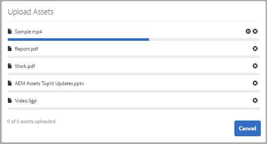
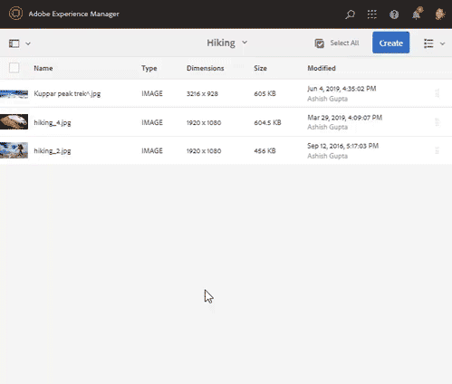
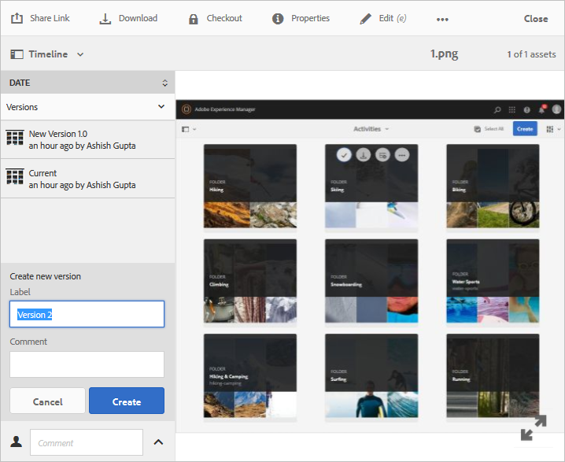

# Administrar los recursos digitales {#manage-digital-assets}

En [!DNL Adobe Experience Manager Assets] puede hacer más que simplemente almacenar y administrar sus recursos. [!DNL Experience Manager] ofrece funciones de administración de recursos de nivel empresarial. Puede editar y compartir recursos, ejecutar búsquedas avanzadas, crear varias representaciones de decenas de formatos de archivo compatibles, administrar versiones y derechos digitales, automatizar el procesamiento de recursos, administrar y administrar metadatos, colaborar utilizando anotaciones y mucho más.

Este artículo describe las tareas básicas de administración de recursos, como crear o cargar; actualizaciones de metadatos; copiar, mover y eliminar; publicar, cancelar la publicación y buscar recursos. Para comprender la interfaz de usuario, consulte [Introducción a la interfaz de usuario de recursos](/help/sites-authoring/basic-handling.md). Para administrar los fragmentos de contenido, consulte [Administrar fragmentos de contenido](/help/assets/content-fragments/content-fragments-managing.md) recursos.

## Crear carpetas {#creating-folders}

Al organizar una colección de recursos, por ejemplo, todas las imágenes `Nature`, puede crear carpetas para mantenerlas juntas. Puede utilizar carpetas para categorizar y organizar los recursos. [!DNL Experience Manager Assets] no requiere que organice los recursos en carpetas para que funcionen mejor.

>[!NOTE]
>
>* No se admite el uso compartido de una carpeta [!DNL Assets] del tipo `sling:OrderedFolder` al compartirla en el Marketing Cloud. Si desea compartir una carpeta, no seleccione [!UICONTROL Pedido] al crear una carpeta.
>* [!DNL Experience Manager] no permite usar  `subassets` word como nombre de una carpeta. Es una palabra clave reservada para el nodo que contiene subrecursos para los recursos compuestos.


1. Vaya al lugar de la carpeta de recursos digitales donde desee crear una carpeta nueva. En el menú, haga clic en **[!UICONTROL Crear]**. Seleccione **[!UICONTROL Nueva carpeta]**.
1. En el campo **[!UICONTROL Title]**, proporcione un nombre de carpeta. De forma predeterminada, DAM utiliza el título que ha proporcionado como nombre de carpeta. Una vez creada la carpeta, puede anular el valor predeterminado y especificar otro nombre de carpeta.
1. Haga clic en **[!UICONTROL Crear]**. La carpeta se muestra en la carpeta de recursos digitales.

No se admiten los siguientes caracteres (lista de) separados por espacios:

* Un nombre de archivo de recurso no puede contener ninguno de estos caracteres: `* / : [ \\ ] | # % { } ? &`
* Un nombre de carpeta de recursos no puede contener ninguno de estos caracteres: `* / : [ \\ ] | # % { } ? \" . ^ ; + & \t`

No incluya caracteres especiales en las extensiones de los nombres de archivo de los recursos.

## Cargar recursos {#uploading-assets}

<!-- TBD the following:
Move this section into a new article. CQDOC-14874 ticket is created for this.
In this complete article, replace emphasis with UICONTROL where appropriate.
-->

Puede cargar varios tipos de recursos (incluidas imágenes, archivos PDF, archivos RAW, etc.) desde la carpeta local o una unidad de red a [!DNL Experience Manager Assets].

>[!NOTE]
>
>En el modo Dynamic Media - Scene7, solo puede cargar recursos cuyo tamaño de archivo sea de 2 GB o menos.

Puede elegir cargar recursos a carpetas que tengan o no un perfil de procesamiento asignado a ellas.

Para las carpetas que tienen asignado un perfil de procesamiento, el nombre del perfil aparece en la miniatura de la vista de tarjeta. En la vista de lista, el nombre del perfil aparece en la columna **Perfil de procesamiento**. Consulte [Perfiles de procesamiento](/help/assets/processing-profiles.md).

Antes de cargar un recurso, asegúrese de que está en un [formato](/help/assets/assets-formats.md) compatible con [!DNL Experience Manager Assets].

1. En la interfaz de usuario [!DNL Assets], vaya a la ubicación en la que desee agregar recursos digitales.
1. Para cargar los recursos, siga uno de estos procedimientos:

   * En la barra de herramientas, haga clic en **[!UICONTROL Crear]**. A continuación, en el menú, haga clic en **[!UICONTROL Files]**. Si es necesario, puede cambiar el nombre del archivo en el cuadro de diálogo presentado.
   * En un explorador compatible con HTML5, arrastre los recursos directamente a la interfaz de usuario [!DNL Assets] . No se muestra el cuadro de diálogo para cambiar el nombre del archivo.

   

   Para seleccionar varios archivos, seleccione la clave `Ctrl` o `Command` y seleccione los recursos en el cuadro de diálogo del selector de archivos. Al utilizar un iPad, solo se puede seleccionar un archivo a la vez.

   Puede pausar la carga de recursos grandes (buenos de 500 MB) y reanudarla más tarde desde la misma página. Haga clic en **[!UICONTROL Pausar]** junto a la barra de progreso que aparece al iniciarse la carga.

   

El tamaño por encima del cual un recurso se considera un recurso grande se puede configurar. Por ejemplo, puede configurar el sistema para que considere los recursos superiores a 1000 MB (en lugar de 500 MB) como recursos grandes. En este caso, **[!UICONTROL Pause]** aparece en la barra de progreso cuando se cargan recursos de tamaño bueno a 1000 MB.

La opción [!UICONTROL Pausar] no muestra si se carga un archivo de buenos más de 1000 MB con un archivo de menos de 1000 MB. Sin embargo, si cancela la carga de menos de 1000 MB, aparecerá la opción **[!UICONTROL Pausar]**.

Para modificar el límite de tamaño, configure la propiedad `chunkUploadMinFileSize` del nodo `fileupload`en el repositorio CRX.

Al hacer clic en **[!UICONTROL Pausar]**, se desplaza a la opción **[!UICONTROL Reproducir]**. Para reanudar la carga, haga clic en **[!UICONTROL Reproducir]**.


Para cancelar una carga continua, haga clic en cerrar (`X`) junto a la barra de progreso. Al cancelar la operación de carga, [!DNL Assets] elimina la parte parcialmente cargada del recurso.

La capacidad de reanudar la carga es especialmente útil en escenarios de bajo ancho de banda y en problemas de red, donde la carga de un recurso grande tarda mucho tiempo. Puede pausar la operación de carga y continuar más tarde cuando mejore la situación. Cuando se reanuda, la carga comienza desde el punto en el que se detuvo.

Durante la operación de carga, [!DNL Experience Manager] guarda las partes del recurso que se están cargando como fragmentos de datos en el repositorio CRX. Cuando la carga termina, [!DNL Experience Manager] consolida estos fragmentos en un solo bloque de datos en el repositorio.

Para configurar la tarea de limpieza para los trabajos de carga de bloques no finalizados, vaya a `https://[aem_server]:[port]/system/console/configMgr/org.apache.sling.servlets.post.impl.helper.ChunkCleanUpTask`.

>[!CAUTION]
>
>El valor predeterminado cuando se activa la carga de fragmentos es de 500 MB y el tamaño del fragmento es de 50 MB. Si modifica [Apache Jackrabbit Oak TokenConfiguration](https://helpx.adobe.com/experience-manager/kb/How-to-set-token-session-expiration-AEM.html) para establecer que `timeout configuration` sea inferior al tiempo que tarda un recurso en cargarse, puede encontrarse con una situación de tiempo de espera de sesión mientras la carga del recurso está en curso. Por lo tanto, debe cambiar los `chunkUploadMinFileSize` y `chunksize` para que cada solicitud de fragmento actualice la sesión.
>
>Dado el tiempo de espera de caducidad, la latencia, el ancho de banda y las cargas simultáneas esperadas, se elige el valor más alto que le permite asegurarse de que se selecciona lo siguiente:
>
>* Para garantizar que la carga de bloques esté habilitada para archivos con tamaños que probablemente causen una caducidad de credenciales mientras la carga esté en curso.
   >
   >
* Para asegurarse de que cada fragmento termina antes de que caduque la credencial.


Si carga un recurso con el mismo nombre que el de un recurso ya disponible en la ubicación donde está cargando el recurso, aparece un cuadro de diálogo de advertencia.

Puede reemplazar un recurso existente, crear otra versión o conservar ambas cambiando el nombre del nuevo recurso que se carga. Si reemplaza un recurso existente, se eliminan los metadatos del recurso y las modificaciones anteriores (por ejemplo, anotar o recortar) que haya realizado en el recurso existente. Si decide mantener ambos recursos, se cambiará el nombre del nuevo recurso por el número `1` anexado a su nombre.


>[!NOTE]
>
>Cuando selecciona **[!UICONTROL Reemplazar]** en el cuadro de diálogo [!UICONTROL Conflicto de nombres], el ID de recurso se regenera para el nuevo recurso. Este ID es diferente del ID del recurso anterior.
>
>Si Asset Insights está habilitado para rastrear impresiones o clics con [!DNL Adobe Analytics], el ID de recurso regenerado invalida los datos capturados para el recurso en [!DNL Analytics].

Si el recurso que carga existe en [!DNL Assets], el cuadro de diálogo **[!UICONTROL Duplicados detectados]** advierte que está intentando cargar un recurso duplicado. El cuadro de diálogo solo aparece si el valor de suma de comprobación `SHA 1` del binario del recurso existente coincide con el valor de suma de comprobación del recurso que se carga. En este caso, los nombres de los recursos no importan.

>[!NOTE]
>
>El cuadro de diálogo [!UICONTROL Duplicados detectados] solo aparece cuando la función de detección de duplicados está habilitada. Para habilitar la función de detección de duplicados, consulte [Habilitar detección de duplicados](/help/assets/duplicate-detection.md).


Para conservar el recurso duplicado en [!DNL Assets], haga clic en **[!UICONTROL Mantener]**. Para eliminar el recurso duplicado que ha cargado, haga clic en **[!UICONTROL Eliminar]**.

[!DNL Experience Manager Assets] impide que cargue recursos con los caracteres prohibidos en sus nombres de archivo. Si intenta cargar un recurso con un nombre de archivo que contenga uno o más caracteres no permitidos, [!DNL Assets] muestra un mensaje de advertencia y detiene la carga hasta que elimina estos caracteres o carga con un nombre permitido.

Para adaptarlo a convenciones específicas de nomenclatura de archivos para su organización, el cuadro de diálogo [!UICONTROL Cargar recursos] le permite especificar nombres largos para los archivos que carga.

Sin embargo, no se admiten los siguientes caracteres (lista de) separados por espacios:

* el nombre del archivo de recursos no debe contener `* / : [ \\ ] | # % { } ? &`
* el nombre de la carpeta de activos no debe contener `* / : [ \\ ] | # % { } ? \" . ^ ; + & \t`

No incluya caracteres especiales en las extensiones de los nombres de archivo de los recursos.



Además, la interfaz de usuario [!DNL Assets] muestra el recurso más reciente que ha cargado o la carpeta que creó primero.

Si cancela la operación de carga antes de que se carguen los archivos, [!DNL Assets] detiene la carga del archivo actual y actualiza el contenido. Sin embargo, los archivos que ya se han cargado no se eliminan.

El cuadro de diálogo de progreso de carga en [!DNL Assets] muestra el recuento de los archivos cargados correctamente y los archivos que no se cargaron correctamente.

### Cargas serie {#serialuploads}

La carga de numerosos recursos en masa consume importantes recursos de E/S, lo que puede afectar negativamente al rendimiento de su implementación [!DNL Assets]. En particular, si tiene una conexión a Internet lenta, el tiempo de carga aumenta drásticamente debido a un pico en la E/S del disco. Además, el explorador web puede introducir restricciones adicionales al número de solicitudes de POST que [!DNL Assets] puede gestionar para cargas de recursos simultáneas. Como resultado, la operación de carga falla o finaliza antes de tiempo. En otras palabras, [!DNL Experience Manager Assets] puede perder algunos archivos al ingerir un montón de archivos o no ingerir ningún archivo.

Para superar esta situación, [!DNL Assets] ingesta un recurso a la vez (carga serie) durante una operación de carga masiva, en lugar de la ingesta simultánea de todos los recursos.

La carga serie de recursos está activada de forma predeterminada. Para desactivar la función y permitir la carga simultánea, superponga el nodo `fileupload` en Crx-de y establezca el valor de la propiedad `parallelUploads` en `true`.

### Cargar recursos mediante FTP {#uploading-assets-using-ftp}

Dynamic Media permite la carga por lotes de recursos a través del servidor FTP. Si tiene intención de cargar recursos de gran tamaño (>1 GB) o carpetas y subcarpetas completas, debe utilizar FTP. Incluso puede configurar la carga FTP para que se produzca de forma programada y recurrente.

>[!NOTE]
>
>En el modo Dynamic Media - Scene7, solo puede cargar recursos cuyo tamaño de archivo sea de 2 GB o menos.

>[!NOTE]
>
>Para cargar recursos a través de FTP en el modo Dynamic Media - Scene7 , instale Feature Pack 18912 en las instancias de creación [!DNL Experience Manager]. Póngase en contacto con [Adobe Customer Care](https://helpx.adobe.com/es/contact/enterprise-support.ec.html) para obtener acceso a FP-18912 y completar la configuración de su cuenta de FTP. Para obtener más información, consulte [Instalación del paquete de características 18912 para la migración masiva de recursos](/help/assets/bulk-ingest-migrate.md).
>
>Si utiliza FTP para cargar recursos, se ignorará la configuración de carga especificada en [!DNL Experience Manager]. En su lugar, se utilizan las reglas de procesamiento de archivos, tal como se definen en Dynamic Media Classic.

**Para cargar recursos mediante FTP**

1. Con el cliente FTP que elija, inicie sesión en el servidor FTP con el nombre de usuario y la contraseña de FTP que recibió del correo electrónico de aprovisionamiento. En el cliente FTP, cargue archivos o carpetas en el servidor FTP.

1. Abra la [aplicación de escritorio de Dynamic Media Classic](https://experienceleague.adobe.com/docs/dynamic-media-classic/using/intro/dynamic-media-classic-desktop-app.html?lang=en#system-requirements-dmc-app) e inicie sesión en su cuenta.

   Adobe proporcionó las credenciales y el inicio de sesión en el momento del aprovisionamiento. Si no dispone de esta información, póngase en contacto con el servicio de asistencia técnica.

1. En la barra de navegación global, haga clic en **[!UICONTROL Cargar]**.
1. En la página Cargar , cerca de la esquina superior izquierda, haga clic en la pestaña **[!UICONTROL Via FTP]**.
1. En la parte izquierda de la página, seleccione una carpeta FTP desde la que cargar los archivos. a la derecha de la página, elija una carpeta de destino.
1. Cerca de la esquina inferior derecha de la página, haga clic en **[!UICONTROL Opciones de trabajo]** y, a continuación, defina las opciones que desee en función de los recursos de la carpeta seleccionada.

   Consulte [Cargar opciones de trabajo](#upload-job-options).

   >[!NOTE]
   >
   >Cuando se cargan recursos a través de FTP, las opciones de trabajo de carga que se establecen en Dynamic Media Classic (S7) prevalecen sobre los parámetros de procesamiento de recursos establecidos en [!DNL Experience Manager].

1. En la esquina inferior derecha del cuadro de diálogo Opciones de carga de trabajo, haga clic en **[!UICONTROL Guardar]**.
1. En la esquina inferior derecha de la página Cargar, haga clic en **[!UICONTROL Enviar carga]**.

   Para ver el progreso de la carga, en la barra de navegación global, haga clic en **[!UICONTROL Trabajos]**. La página Trabajos muestra el progreso de la carga. Puede seguir trabajando en [!DNL Experience Manager] y volver a la página Trabajos de Dynamic Media Classic en cualquier momento para revisar un trabajo en curso.
Para cancelar un trabajo de carga en curso, haga clic en **[!UICONTROL Cancelar]** junto al tiempo de duración.

#### Cargar opciones de trabajo {#upload-job-options}

| Opción Cargar | Subopción | Descripción |
|---|---|---|
| Nombre del trabajo |  | El nombre predeterminado que se rellena previamente en el campo de texto incluye la parte introducida por el usuario del nombre y la marca de fecha y hora. Puede utilizar el nombre predeterminado o introducir un nombre de su propia creación para este trabajo de carga. <br>El trabajo y otros trabajos de carga y publicación se registran en la página Trabajos, donde puede comprobar el estado de los trabajos. |
| Publicar después de la carga |  | Publica automáticamente los recursos que se cargan. |
| Sobrescribir en cualquier carpeta, el mismo nombre de recurso base independientemente de la extensión |  | Seleccione esta opción si desea que los archivos cargados reemplacen los archivos existentes con los mismos nombres. El nombre de esta opción puede ser diferente, dependiendo de la configuración en **[!UICONTROL Configuración de la aplicación]** > **[!UICONTROL Configuración general]** > **[!UICONTROL Cargar a la aplicación]** > **[!UICONTROL Sobrescribir imágenes]**. |
| Descomprimir archivos zip o tar al cargar |  |  |
| Opciones de trabajo |  | Haga clic en **[!UICONTROL Opciones de trabajo]** para abrir el cuadro de diálogo [!UICONTROL Opciones de carga de trabajo] y elija las opciones que afectan a todo el trabajo de carga. Estas opciones son las mismas para todos los tipos de archivo.<br>Puede elegir las opciones predeterminadas para cargar archivos que comiencen en la página Configuración general de la aplicación . Para abrir esta página, seleccione **[!UICONTROL Configuración]** > **[!UICONTROL Configuración de la aplicación]**. Seleccione la opción **[!UICONTROL Opciones de carga predeterminadas]** para abrir el cuadro de diálogo [!UICONTROL Opciones de carga de trabajo]. |
|  | Cuando | Seleccione Único o Recurrente. Para configurar un trabajo recurrente, elija una opción de repetición (Diario, Semanal, Mensual o Personalizado) para especificar cuándo desea que se repita el trabajo de carga de FTP. A continuación, especifique las opciones de programación según sea necesario. |
|  | Incluir subcarpetas | Cargue todas las subcarpetas dentro de la carpeta que desee cargar. Los nombres de la carpeta y sus subcarpetas que carga se introducen automáticamente en [!DNL Experience Manager Assets]. |
|  | Opciones de recorte | Para recortar manualmente desde los lados de una imagen, seleccione el menú Recortar y elija Manual. A continuación, introduzca el número de píxeles que desea recortar desde cualquier lado o cada lado de la imagen. La cantidad de imagen recortada depende de la configuración de ppi (píxeles por pulgada) en el archivo de imagen. Por ejemplo, si la imagen muestra 150 ppp y especifica 75 en los cuadros de texto Superior, Derecha, Inferior e Izquierda, se recortará media pulgada de cada lado.<br> Para recortar automáticamente píxeles de espacio en blanco de una imagen, abra el menú Recortar, seleccione Manual e introduzca medidas de píxeles en los campos Superior, Derecha, Inferior e Izquierda para recortar desde los lados. También puede elegir Recortar en el menú Recortar y elegir estas opciones:<br> **Separar en función de** <ul><li>**Color** : elija la opción Color. A continuación, seleccione el menú Esquina y elija la esquina de la imagen con el color que mejor represente el color de espacio en blanco que desea recortar.</li><li>**Transparencia** : elija la opción Transparencia.<br> **Tolerancia** : arrastre el control deslizante para especificar una tolerancia de 0 a 1. Para recortar en función del color, especifique 0 para recortar píxeles solo si coinciden exactamente con el color seleccionado en la esquina de la imagen. Los números más cercanos a 1 permiten una mayor diferencia de color.<br>Para recortar en función de la transparencia, especifique 0 para recortar píxeles solo si son transparentes. Los números más cercanos a 1 permiten una mayor transparencia.</li></ul><br>Tenga en cuenta que estas opciones de recorte no son destructivas. |
|  | Opciones de perfil de color | Elija una conversión de color cuando cree archivos optimizados que se utilicen para la entrega:<ul><li>Conservación de color predeterminada: Mantiene los colores de la imagen de origen siempre que las imágenes contienen información de espacio de color; no hay conversión de color. Casi todas las imágenes de hoy tienen el perfil de color adecuado ya incrustado. Sin embargo, si una imagen de origen CMYK no contiene un perfil de color incrustado, los colores se convierten en espacios de color sRGB (azul verde rojo estándar). sRGB es el espacio de color recomendado para mostrar imágenes en páginas web.</li><li>Mantener espacio de color original: Conserva los colores originales sin ninguna conversión de color en el punto. En el caso de las imágenes sin un perfil de color incrustado, cualquier conversión de color se realiza mediante los perfiles de color predeterminados configurados en la configuración de publicación. Es posible que los perfiles de color no estén alineados con el color de los archivos creados con esta opción. Por lo tanto, se le recomienda utilizar la opción Conservación de color predeterminada.</li><li>Personalizar de > A<br> Abre los menús para que pueda elegir un espacio de color Convertir de y Convertir en . Esta opción avanzada anula cualquier información de color incrustada en el archivo de origen. Seleccione esta opción cuando todas las imágenes que envía contienen datos de perfil de color incorrectos o que faltan.</li></ul> |
|  | Opciones de edición de imágenes | Puede conservar las máscaras de recorte en las imágenes y elegir un perfil de color.<br> Consulte  [Configuración de las opciones de edición de imágenes al cargar](#setting-image-editing-options-at-upload). |
|  | Opciones de Postscript | Puede rasterizar archivos de PostScript®, recortar archivos, mantener fondos transparentes, elegir una resolución y elegir un espacio de color.<br> Consulte  [Configuración de las opciones de carga de PostScript y Illustrator](#setting-postscript-and-illustrator-upload-options). |
|  | Opciones de Photoshop | Puede crear plantillas a partir de archivos Photoshop® de Adobe®, mantener las capas, especificar el nombre de las capas, extraer texto y especificar cómo se anclan las imágenes en las plantillas.<br> Tenga en cuenta que las plantillas no son compatibles con  [!DNL Experience Manager].<br> Consulte  [Configuración de las opciones de carga de Photoshop](#setting-photoshop-upload-options). |
|  | Opciones de PDF | Puede rasterizar los archivos, extraer palabras de búsqueda y vínculos, generar automáticamente un catálogo electrónico, establecer la resolución y elegir un espacio de color.<br> Tenga en cuenta que los catálogos electrónicos no son compatibles con  [!DNL Experience Manager]. <br> Consulte  [Configuración de opciones de carga de PDF](#setting-pdf-upload-options). |
|  | Opciones de Illustrator | Puede rasterizar archivos Adobe Illustrator®, mantener fondos transparentes, elegir una resolución y elegir un espacio de color.<br> Consulte  [Configuración de las opciones de carga de PostScript y Illustrator](#setting-postscript-and-illustrator-upload-options). |
|  | Opciones de eVideo | Puede transcodificar un archivo de vídeo eligiendo un ajuste preestablecido de vídeo.<br> Consulte  [Configuración de las opciones de carga de eVideo](#setting-evideo-upload-options). |
|  | Valores preestablecidos de conjunto por lotes | Para crear un conjunto de imágenes o un conjunto de giros a partir de los archivos cargados, haga clic en la columna Activo del ajuste preestablecido que desee utilizar. Puede seleccionar más de un ajuste preestablecido. Los ajustes preestablecidos se crean en la página Ajustes de aplicación/Ajustes preestablecidos de conjunto de lotes de Dynamic Media Classic.<br> Consulte  [Configuración de ajustes preestablecidos de conjuntos de lotes para generar automáticamente conjuntos de imágenes y conjuntos de giros ](config-dms7.md#creating-batch-set-presets-to-auto-generate-image-sets-and-spin-sets) para obtener más información sobre la creación de ajustes preestablecidos de conjuntos de lotes.<br> Consulte  [Configuración de ajustes preestablecidos de conjuntos de lotes al cargar](#setting-batch-set-presets-at-upload). |

#### Definir las opciones de edición de imágenes al cargar {#setting-image-editing-options-at-upload}

Al cargar archivos de imagen, incluidos archivos AI, EPS y PSD, puede realizar las siguientes acciones de edición en el cuadro de diálogo [!UICONTROL Opciones de carga de trabajo]:

* Recorte los espacios en blanco desde el borde de las imágenes (consulte la descripción en la tabla anterior).
* Recortar manualmente desde los lados de las imágenes (consulte la descripción en la tabla anterior).
* Elija un perfil de color (consulte la descripción de la opción en la tabla anterior).
* Cree una máscara a partir de una ruta de recorte.
* Enfoque de imágenes con opciones de máscara de enfoque
* Contexto

<!--
| Option | Sub-option | Description |
|---|---|---|
| Create Mask From Clipping Path | | Create a mask for the image based on its clipping path information. This option applies to images created with image-editing applications in which a clipping path was created. |
| Unsharp Masking | | Lets you fine-tune a sharpening filter effect on the final downsampled image, controlling the intensity of the effect, the radius of the effect (as measured in pixels), and a threshold of contrast that is ignored.<br> This effect uses the same options as Photoshop’s Unsharp Mask filter. Contrary to what the name suggests, Unsharp Mask is a sharpening filter. Under Unsharp Masking, set the options you want. Setting options are described in the following: |
| | Amount | Controls the amount of contrast that is applied to edge pixels.<br> Think of it as the intensity of the effect. The main difference between the amount values of Unsharp Mask in Dynamic Media and the amount values in Adobe Photoshop, is that Photoshop has an amount range of 1% to 500%. Whereas, in Dynamic Media, the value range is 0.0 to 5.0. A value of 5.0 is the rough equivalent of 500% in Photoshop; a value of 0.9 is the equivalent of 90%, and so on. |
| | Radius | Controls the radius of the effect. The value range is 0-250.<br> The effect is run on all pixels in an image and radiates out from all pixels in all directions. The radius is measured in pixels. For example, to get a similar sharpening effect for a 2000 x 2000 pixel image and 500 x 500 pixel image, you would set a radius of two pixels on the 2000 x 2000 pixel image and a radius value of one pixel on the 500 x 500 pixel image. A larger value is used for an image that has more pixels. |
| | Threshold | Threshold is a range of contrast that is ignored when the Unsharp Mask filter is applied. It is important so that no "noise" is introduced to an image when this filter is used. The value range is 0-255, which is the number of brightness steps in a grayscale image. 0=black, 128=50% gray and 255=white.<br> For example, a threshold value of 12 ignores slight variations is skin tone brightness to avoid adding noise, but still add edge contrast to areas such as where eyelashes meet skin.<br> For example, if you have a photo of someone’s face, the Unsharp Mask affects the parts of the image, such as where eyelashes and skin meet to create an obvious area of contrast, and the smooth skin itself. Even the smoothest skin exhibits subtle changes in brightness values. If you do not use a threshold value, the filter accentuates these subtle changes in skin pixels. In turn, a noisy and undesirable effect is created while contrast on the eyelashes is increased, enhancing sharpness.<br> To avoid this issue, a threshold value is introduced that tells the filter to ignore pixels that do not change contrast dramatically, like smooth skin.<br> In the zipper graphic shown earlier, notice the texture next to the zippers. Image noise is exhibited because the threshold values were too low to suppress the noise. |
| | Monochrome | Select to unsharp-mask image brightness (intensity).<br> Deselect to unsharp-mask each color component separately. |
| Knockout Background | | Automatically removes the background of an image when you upload it. This technique is useful to draw attention to a particular object and make it stand out from a busy background. Select to enable or “turn on” the Knockout Background feature and the following sub-options: |
| | Corner | Required.<br> The corner of the image that is used to define the background color to knockout.<br> You can choose from **Upper Left**, **Bottom Left**, **Upper Right**, or **Bottom Right**. |
| | Fill Method | Required.<br> Controls pixel transparency from the Corner location that you set.<br> You can choose from the following fill methods: <ul><li>**Flood Fill** - turns all pixels transparent that match the Corner that you have specified and are connected to it.</li><li>**Match Pixel** - turns all matching pixels transparent, regardless of their location on the image.</li></ul> |
| | Tolerance | Optional.<br> Controls the allowable amount of variation in pixel color matching based on the Corner location that you set.<br> Use a value of 0.0 to match pixel colors exactly or, use a value of 1.0 to allow for the greatest variation. |
-->

#### Establecer las opciones de carga de PostScript y Illustrator {#setting-postscript-and-illustrator-upload-options}

Al cargar archivos de imagen PostScript (EPS) o Illustrator (AI), puede aplicarles formato de varias formas. Puede rasterizar los archivos, mantener el fondo transparente, elegir una resolución y elegir un espacio de color. Las opciones para dar formato a los archivos PostScript y Illustrator están disponibles en el cuadro de diálogo [!UICONTROL Opciones de carga de trabajo] en [!UICONTROL Opciones de PostScript] y [!UICONTROL Opciones de Illustrator].

| Opción | Subopción | Descripción |
|---|---|---|
| Procesando |  | Elija **[!UICONTROL Rasterizar]** para convertir los gráficos vectoriales del archivo al formato de mapa de bits. |
| Mantener fondo transparente en imagen representada |  | Mantener la transparencia en segundo plano del archivo. |
| Resolución |  | Determina la configuración de resolución. Esta configuración determina cuántos píxeles se muestran por pulgada en el archivo. |
| Espacio color |  | Seleccione el menú Espacio de color y elija entre las siguientes opciones de espacio de color: |
|  | Detectar automáticamente | Conserva el espacio de color del archivo. |
|  | Forzar como RGB | Se convierte al espacio de color RGB. |
|  | Forzar como CMYK | Se convierte al espacio de color CMYK. |
|  | Forzar como escala de grises | Se convierte al espacio de color de escala de grises. |

#### Definir las opciones de carga de Photoshop {#setting-photoshop-upload-options}

Los archivos de documento de Photoshop (PSD) se utilizan habitualmente para crear plantillas de imagen. Al cargar un archivo PSD, puede crear una plantilla de imagen automáticamente desde el archivo (seleccione la opción [!UICONTROL Crear plantilla] en la pantalla Cargar).

Dynamic Media crea varias imágenes a partir de un archivo PSD con capas si utiliza el archivo para crear una plantilla; crea una imagen para cada capa.

Utilice las [!UICONTROL Opciones de recorte] y [!UICONTROL Opciones de perfil de color] descritas anteriormente con las opciones de carga de Photoshop.

>[!NOTE]
>
>Las plantillas no son compatibles con [!DNL Experience Manager].

| Opción | Subopción | Descripción |
|---|---|---|
| Mantener capas |  | Extrae las capas del PSD, si las hay, en recursos individuales. Las capas de recursos permanecen asociadas al PSD. Puede verlos abriendo el archivo PSD en la vista de detalles y seleccionando el panel de capa. |
| Crear plantilla |  | Crea una plantilla a partir de las capas del archivo PSD. |
| Extraer texto |  | Extrae el texto para que los usuarios puedan buscar texto en un visualizador. |
| Ampliación de las capas al tamaño de fondo |  | Amplía el tamaño de las capas de imagen recortadas al tamaño de la capa de fondo. |
| Asignación de nombres a capas |  | Las capas del archivo PSD se cargan como imágenes independientes. |
|  | Nombre de capa | Nombra las imágenes según sus nombres de capa en el archivo PSD. Por ejemplo, una capa denominada Etiqueta de precio en el archivo PSD original se convierte en una imagen denominada Etiqueta de precio. Sin embargo, si los nombres de capa del archivo PSD son nombres de capa predeterminados de Photoshop (Fondo, Capa 1, Capa 2, etc.), las imágenes reciben el nombre de sus números de capa en el archivo PSD, no de sus nombres de capa predeterminados. |
|  | Photoshop y número de capa | Nombra las imágenes según sus números de capa en el archivo PSD, ignorando los nombres de capa originales. Las imágenes reciben el nombre del archivo Photoshop y un número de capa anexado. Por ejemplo, la segunda capa de un archivo llamado Spring Ad.psd se llama Spring Ad_2 aunque tenga un nombre no predeterminado en Photoshop. |
|  | Photoshop y nombre de capa | Nombra las imágenes después del archivo PSD seguido del nombre de la capa o el número de capa. El número de capa se utiliza si los nombres de capa del archivo PSD son nombres de capa predeterminados de Photoshop. Por ejemplo, una capa denominada Price Tag en un archivo PSD llamado SpringAd se llama Spring Ad_Price Tag. Una capa con el nombre predeterminado Capa 2 se llama Anuncio de primavera_2. |
| Ancla |  | Especifique cómo se anclan las imágenes en plantillas generadas a partir de la composición en capas producida a partir del archivo PSD. De forma predeterminada, el anclaje es el centro. Un anclaje central permite que las imágenes de reemplazo ocupen el mismo espacio, independientemente de la proporción de aspecto de la imagen de reemplazo. Las imágenes con un aspecto diferente que reemplazan a esta imagen, al hacer referencia a la plantilla y utilizar la sustitución de parámetros, ocupan efectivamente el mismo espacio. Cambie a una configuración diferente si la aplicación requiere que las imágenes de reemplazo rellenen el espacio asignado en la plantilla. |

#### Definir las opciones de carga de PDF {#setting-pdf-upload-options}

Al cargar un archivo PDF, puede aplicarle formato de varias formas. Recorte sus páginas, extraiga palabras de búsqueda, introduzca una resolución de píxeles por pulgada y elija un espacio de color. Los archivos PDF suelen contener un margen de recorte, marcas de recorte, marcas de registro y otras marcas de impresora. Puede recortar estas marcas desde los lados de las páginas a medida que carga un archivo PDF.

>[!NOTE]
>
>Los catálogos electrónicos no son compatibles con [!DNL Experience Manager].

Elija entre las siguientes opciones:

| Opción | Subopción | Descripción |
|---|---|---|
| Procesando | Rasterizar | (Predeterminado) Extrae las páginas del archivo PDF y convierte los gráficos vectoriales en imágenes de mapa de bits. Elija esta opción para crear un catálogo electrónico. |
| Extraer | Palabras de búsqueda | Extrae palabras del archivo PDF para que el archivo se pueda buscar por palabra clave en un visor de catálogos electrónicos. |
|  | Vínculos | Extrae vínculos de los archivos PDF y los convierte en mapas de imágenes que se utilizan en un visor de catálogos electrónicos. |
| Generación automática de catálogos electrónicos a partir de PDF de varias páginas |  | Crea automáticamente un catálogo electrónico a partir del archivo PDF. El Catálogo electrónico recibe el nombre del archivo PDF que ha cargado. (Esta opción solo está disponible si rasteriza el archivo PDF al cargarlo). |
| Resolución |  | Determina la configuración de resolución. Esta configuración determina cuántos píxeles se muestran por pulgada en el archivo PDF. El valor predeterminado es 150. |
| Espacio color |  | Seleccione el menú Espacio de color y elija un espacio de color para el archivo PDF. La mayoría de los archivos PDF tienen imágenes en color RGB y CMYK. El espacio de color RGB es preferible para la visualización en línea. |
|  | Detectar automáticamente | Conserva el espacio de color del archivo PDF. |
|  | Forzar como RGB | Se convierte al espacio de color RGB. |
|  | Forzar como CMYK | Se convierte al espacio de color CMYK. |
|  | Forzar como escala de grises | Se convierte al espacio de color de escala de grises. |

#### Establecer las opciones de carga de eVideo {#setting-evideo-upload-options}

Para transcodificar un archivo de vídeo eligiendo entre una variedad de ajustes preestablecidos de vídeo.

| Opción | Subopción | Descripción |
|---|---|---|
| Vídeo adaptable |  | Un ajuste preestablecido de codificación único que funciona con cualquier proporción de aspecto para crear vídeos para su envío a dispositivos móviles, tabletas y equipos de escritorio. Los vídeos de origen cargados que se codifican con este ajuste preestablecido se configuran con una altura fija. Sin embargo, la anchura se escala automáticamente para conservar la proporción de aspecto del vídeo. <br>Una práctica recomendada es utilizar la codificación de vídeo adaptable. |
| Ajustes preestablecidos de codificación única | Ordenar ajustes preestablecidos de codificación | Seleccione Nombre o Tamaño para ordenar los ajustes preestablecidos de codificación enumerados en Escritorio, Móvil y Tablet por nombre o por tamaño de resolución. |
|  | Escritorio | Cree un archivo MP4 para ofrecer una experiencia de vídeo progresivo o de flujo continuo a los equipos de escritorio. Seleccione una o varias relaciones de aspecto con el tamaño de resolución y la velocidad de datos de destino que desee. |
|  | Móvil | Cree un archivo MP4 para enviarlo a dispositivos móviles iPhone o Android. Seleccione una o varias relaciones de aspecto con el tamaño de resolución y la velocidad de datos de destino que desee. |
|  | Tablet | Cree un archivo MP4 para enviarlo a dispositivos iPad o tableta Android. Seleccione una o varias relaciones de aspecto con el tamaño de resolución y la velocidad de datos de destino que desee. |

#### Definir ajustes preestablecidos de conjuntos de lotes al cargar {#setting-batch-set-presets-at-upload}

Si desea crear automáticamente un conjunto de imágenes o un conjunto de giros a partir de imágenes cargadas, haga clic en la columna Activo del ajuste preestablecido que desee utilizar. Puede seleccionar más de un ajuste preestablecido.

Consulte [Configuración de ajustes preestablecidos de conjuntos de lotes para generar automáticamente conjuntos de imágenes y conjuntos de giros](/help/assets/config-dms7.md#creating-batch-set-presets-to-auto-generate-image-sets-and-spin-sets) para obtener más información sobre la creación de ajustes preestablecidos de conjuntos de lotes.

### Cargas por transmisión {#streamed-uploads}

Si carga muchos recursos en Adobe Experience Manager, las solicitudes de E/S al servidor aumentan drásticamente, lo que reduce la eficacia de la carga e incluso puede provocar que se agote el tiempo de espera de alguna tarea de carga. [!DNL Experience Manager Assets] admite la carga de recursos por secuencias. La carga por secuencias reduce el E/S de disco durante la operación de carga al evitar el almacenamiento de recursos en una carpeta temporal del servidor antes de copiarlo en el repositorio. En su lugar, los datos se transfieren directamente al repositorio. De este modo, se reduce el tiempo de carga de recursos grandes y la posibilidad de tiempos de espera. La carga por transmisión está habilitada de forma predeterminada en [!DNL Assets].

>[!NOTE]
>
>La carga de flujo continuo está deshabilitada para Adobe Experience Manager que se ejecuta en el servidor JEE con versiones de servlet-api inferiores a 3.1.

### Extraer archivo ZIP que contiene recursos {#extractzip}

Puede cargar archivos ZIP como cualquier otro recurso admitido. Las mismas reglas de nombre de archivo se aplican a los archivos ZIP. [!DNL Experience Manager] permite extraer un archivo ZIP en una ubicación DAM. Si los archivos de archivo no contienen ZIP como extensión, habilite la detección de tipo de archivo mediante contenido.

Seleccione un archivo ZIP a la vez, haga clic en **[!UICONTROL Extraer archivo]** y seleccione una carpeta de destino. Seleccione una opción para gestionar conflictos, si los hay. Si los recursos del archivo ZIP ya existen en la carpeta de destino, puede seleccionar una de estas opciones: omita la extracción, reemplace los archivos existentes, mantenga ambos recursos cambiando el nombre o cree una nueva versión.

Una vez finalizada la extracción, [!DNL Experience Manager] se lo notifica en el área de notificación. Mientras [!DNL Experience Manager] extrae el ZIP, puede volver al trabajo sin interrumpir la extracción.


Algunas limitaciones de la función son:

* Si existe una carpeta con el mismo nombre en el destino, los recursos del archivo ZIP se extraen en la carpeta existente.
* Si cancela la extracción, los recursos ya extraídos no se eliminarán.
* No puede seleccionar dos archivos ZIP al mismo tiempo y extraerlos. Solo puede extraer un archivo ZIP a la vez.
* Al cargar un archivo ZIP, si el cuadro de diálogo de carga muestra un error de servidor 500, vuelva a intentarlo después de instalar [el último Service Pack](/help/release-notes/sp-release-notes.md).

## Vista previa de recursos {#previewing-assets}

Para obtener una vista previa de un recurso, siga estos pasos.

1. En la interfaz de usuario [!DNL Assets], vaya a la ubicación del recurso cuya vista previa desee ver.
1. Haga clic en el recurso que desee abrir.

1. En el modo de vista previa, las opciones de zoom están disponibles para [tipos de imagen admitidos](/help/assets/assets-formats.md#supported-raster-image-formats) (con edición interactiva).

   Para acercar un recurso, haga clic en `+` (o haga clic en la lupa del recurso). Para reducir, haga clic en `-`. Al acercar el zoom, puede observar de cerca cualquier área de la imagen mediante la panorámica. La flecha para restablecer el zoom le lleva de nuevo a la vista original. Para restablecer la vista al tamaño original, haga clic en **[!UICONTROL Restablecer]** .

**Vista previa de recursos utilizando solo teclas de teclado**

Para obtener una vista previa de un recurso mediante el teclado, siga estos pasos:

1. En la interfaz de usuario [!DNL Assets], vaya al recurso deseado mediante `Tab` y las teclas de flecha.

1. Seleccione la clave `Enter` en el recurso deseado para abrirlo. Puede acercar los recursos al modo de vista previa.

1. Para acercar el recurso:
   1. Utilice la tecla `Tab` para mover el enfoque a la opción de acercamiento.
   1. Utilice la tecla `Enter` para acercar la imagen.

   Para reducir, utilice la tecla `Tab` para mover el foco a la opción de alejamiento y seleccione `Enter`.

1. Utilice las teclas `Shift` + `Tab` para mover el enfoque de nuevo a la imagen.

1. Utilice las teclas de flecha para moverse por la imagen ampliada.

>[!MORELIKETHIS]
>
>* [Vista previa de Dynamic Media Assets](/help/assets/previewing-assets.md).
>* [Ver subrecursos](managing-linked-subassets.md#viewing-subassets).


## Editar propiedades y metadatos {#editing-properties}

1. Vaya a la ubicación del recurso para editar sus metadatos.

1. Seleccione el recurso y haga clic en **[!UICONTROL Properties]** en la barra de herramientas para ver las propiedades del recurso. Como alternativa, seleccione la acción rápida **[!UICONTROL Properties]** en la tarjeta del recurso.

   

1. En la página [!UICONTROL Propiedades], edite las propiedades de los metadatos en varias pestañas. Por ejemplo, en la ficha **[!UICONTROL Básico]**, edite el título, la descripción, etc.

   >[!NOTE]
   >
   >El diseño de la página [!UICONTROL Properties] y las propiedades de metadatos disponibles dependen del esquema de metadatos subyacente. Para obtener información sobre cómo modificar el diseño de la página [!UICONTROL Properties], consulte [Esquemas de metadatos](/help/assets/metadata-schemas.md).

1. Para programar una fecha y hora determinada para la activación del recurso, utilice el selector de fechas situado junto al campo **[!UICONTROL Tiempo de activación]**.

   

   *Figura: Utilice el selector de fechas para programar la activación de recursos.*

1. Para desactivar el recurso después de una duración determinada, seleccione la fecha y hora de desactivación del selector de fechas situado junto al campo **[!UICONTROL Tiempo de desactivación]**. La fecha de desactivación debe ser posterior a la fecha de activación de un recurso. Después del [!UICONTROL Tiempo de inactividad], un recurso y sus representaciones no están disponibles a través de la interfaz web [!DNL Assets] o a través de la API HTTP.

1. En el campo **[!UICONTROL Etiquetas]**, seleccione una o varias etiquetas. Para agregar una etiqueta personalizada, escriba el nombre de la etiqueta en el cuadro y seleccione `Enter`. La nueva etiqueta se guarda en [!DNL Experience Manager]. [!DNL YouTube] requiere etiquetas para publicar. Consulte [publicar vídeos en YouTube](video.md#publishing-videos-to-youtube).

   >[!NOTE]
   >
   >Para crear etiquetas, necesita permiso de escritura en `/content/cq:tags/default` en el repositorio CRX.

1. Para clasificar el recurso, haga clic en la pestaña **[!UICONTROL Advanced]** y, a continuación, haga clic en la estrella en la posición adecuada para asignar la clasificación deseada.

   

   La puntuación de clasificación que asigna al recurso se muestra en **[!UICONTROL Sus clasificaciones]**. La puntuación de clasificación promedio que el recurso recibió de los usuarios que calificaron el recurso se muestra en **[!UICONTROL Clasificación]**. Además, el desglose de las puntuaciones de clasificación que contribuyen a la puntuación de clasificación promedio se muestra en **[!UICONTROL Desglose de clasificación]**. Puede buscar recursos en función de puntuaciones de clasificación promedio.

1. Para ver las estadísticas de uso del recurso, haga clic en la pestaña **[!UICONTROL Insights]**.

   Las estadísticas de uso incluyen lo siguiente:

   * Número de veces que se ha visto o descargado el recurso
   * Canales/dispositivos a través de los cuales se utilizó el recurso
   * Soluciones creativas en las que se ha utilizado recientemente el recurso

   Para obtener más información, consulte [Asset Insights](/help/assets/asset-insights.md).

1. Haga clic en **[!UICONTROL Guardar y cerrar]**.
1. Vaya a la interfaz de usuario [!DNL Assets]. Las propiedades de metadatos editadas, como título, descripción, clasificaciones, etc., se muestran en la tarjeta de recursos de la vista de tarjeta y en las columnas relevantes de la vista de lista.

## Copiar recursos {#copying-assets}

Al copiar un recurso o una carpeta, se copia todo el recurso o la carpeta, junto con su estructura de contenido. Un recurso copiado o una carpeta se duplica en la ubicación de destino. El recurso en la ubicación de origen no se modifica.

No se arrastran algunos atributos que son exclusivos de una copia concreta de un recurso. Algunos ejemplos son:

* ID del recurso, fecha y hora de creación, versiones e historial de versiones. Algunas de estas propiedades están indicadas por las propiedades `jcr:uuid`, `jcr:created` y `cq:name`.

* El tiempo de creación y las rutas a las que se hace referencia son únicos para cada recurso y cada una de sus representaciones.

La información de otras propiedades y metadatos se conserva. No se crea una copia parcial al copiar un recurso.

1. En la interfaz [!DNL Assets], seleccione uno o varios recursos y haga clic en **[!UICONTROL Copiar]** en la barra de herramientas. Como alternativa, seleccione la opción **[!UICONTROL Copiar]**  acción rápida en la tarjeta de recursos.

   >[!NOTE]
   >
   >Si utiliza la acción rápida [!UICONTROL Copy], solo puede copiar un recurso a la vez.

1. Desplácese a la ubicación en la que desee copiar los recursos.

   >[!NOTE]
   >
   >Si copia un recurso en la misma ubicación, [!DNL Experience Manager] genera automáticamente una variación del nombre. Por ejemplo, si copia un recurso llamado `Square`, [!DNL Experience Manager] genera automáticamente el título de su copia como `Square1`.

1. Haga clic en la opción **[!UICONTROL Pegar]**  en la barra de herramientas. A continuación, los recursos se copian en esta ubicación.

   >[!NOTE]
   >
   >La opción **[!UICONTROL Pegar]** está disponible en la barra de herramientas hasta que se complete la operación de pegado.

## Mover y cambiar el nombre de los recursos {#moving-or-renaming-assets}

Cuando se mueven recursos (o carpetas) a otra ubicación, los recursos (o carpetas) no se duplican, a diferencia de lo que sucede con la copia del recurso. Los recursos (o las carpetas) se colocan en la ubicación de destino y se eliminan de la ubicación de origen. También puede cambiar el nombre del recurso al moverlo a la nueva ubicación.
Si está moviendo un recurso publicado a una ubicación diferente, tiene la opción de volver a publicar el recurso. De forma predeterminada, la operación de movimiento en un recurso publicado anula la publicación automáticamente. Un recurso movido se vuelve a publicar si el autor selecciona la opción [!UICONTROL Volver a publicar] al mover el recurso.


Para mover recursos o carpetas:

1. Navegue a la ubicación del recurso que desee mover.

1. Seleccione el recurso y haga clic en la opción **[!UICONTROL Mover]** en la barra de herramientas.
   

1. En el asistente [!UICONTROL Mover recursos], realice una de las siguientes acciones:

   * Especifique el nombre del recurso cuando se haya desplazado. A continuación, haga clic en **[!UICONTROL Siguiente]** para continuar.

   * Haga clic en **[!UICONTROL Cancelar]** para detener el proceso.
   >[!NOTE]
   >
   >* Puede especificar el mismo nombre para el recurso si no hay ningún recurso con ese nombre en la nueva ubicación. Sin embargo, debe utilizar un nombre diferente si mueve el recurso a una ubicación donde exista un recurso con el mismo nombre. Si utiliza el mismo nombre, el sistema genera automáticamente una variación del nombre. Por ejemplo, si el recurso tiene el nombre Cuadrado, el sistema genera el nombre Cuadrado1 para su copia.
   >* Al cambiar el nombre, no se permiten espacios en blanco en el nombre del archivo.


1. En el cuadro de diálogo **[!UICONTROL Seleccionar destino]**, realice una de las siguientes acciones:

   * Vaya a la nueva ubicación de los recursos y, a continuación, haga clic en **[!UICONTROL Siguiente]** para continuar.

   * Haga clic en **[!UICONTROL Back]** para volver a la pantalla **[!UICONTROL Cambiar nombre]**.

1. Si los recursos que se mueven tienen páginas, recursos o colecciones de referencia, la pestaña **[!UICONTROL Ajustar referencias]** aparece junto a la pestaña **[!UICONTROL Seleccionar destino]**.

   Realice una de las siguientes acciones en la pantalla **[!UICONTROL Ajustar referencias]**:

   * Especifique las referencias que desea ajustar en función de los nuevos detalles y haga clic en **[!UICONTROL Mover]** para continuar.

   * En la columna **[!UICONTROL Ajustar]**, seleccione o anule la selección de referencias a los recursos.
   * Haga clic en **[!UICONTROL Back]** para volver a la pantalla **[!UICONTROL Select Destination]**.

   * Haga clic en **[!UICONTROL Cancel]** para detener la operación de movimiento.

   Si no actualiza las referencias, seguirán apuntando a la ruta anterior del recurso. Si ajusta las referencias, se actualizan a la nueva ruta de recursos.

### Mover recursos mediante la operación de arrastrar {#move-using-drag}

Puede mover recursos (o carpetas) a una carpeta del mismo nivel arrastrándolos a la ubicación de destino, en lugar de utilizar la opción [!UICONTROL Mover] en la interfaz de usuario. Sin embargo, esta operación solo es posible en la vista de lista.

Al mover recursos arrastrándolos, no se abre el asistente [!UICONTROL Mover recurso] y, por lo tanto, no se obtiene la opción de cambiar el nombre de los recursos al moverlos. Además, los recursos ya publicados se vuelven a publicar al moverlos arrastrando, sin solicitar la aprobación del usuario para volver a publicar.


## Administrar representaciones {#managing-renditions}

1. Puede añadir o eliminar representaciones para un recurso, excepto el original. Desplácese a la ubicación del recurso para el que desee agregar o quitar representaciones.

1. Haga clic en el recurso para abrir su página.
1. En la interfaz del Experience Manager, seleccione **[!UICONTROL Representaciones]** en la lista.
1. En el panel **[!UICONTROL Representaciones]**, consulte la lista de representaciones generadas para el recurso.

   

   >[!NOTE]
   >
   >De forma predeterminada, [!DNL Assets] no muestra la representación original del recurso en el modo de vista previa. Si es administrador, puede utilizar superposiciones para configurar [!DNL Assets] de modo que muestre las representaciones originales en el modo de vista previa.

1. Seleccione una representación para verla o eliminarla.

   **Eliminar una representación**

   Seleccione una representación en el panel **[!UICONTROL Representaciones]** y, a continuación, haga clic en la opción **[!UICONTROL Eliminar representación]**  de la barra de herramientas. Las representaciones no se pueden eliminar de forma masiva una vez finalizado el procesamiento de recursos. Para recursos individuales, puede eliminar las representaciones manualmente desde la interfaz de usuario. Para varios recursos, puede personalizar el Experience Manager para que elimine representaciones específicas o elimine los recursos y vuelva a cargar los recursos eliminados.

   **Cargar una nueva representación**

   Vaya a la página de detalles del recurso y haga clic en la opción **[!UICONTROL Añadir representación]**  en la barra de herramientas para cargar una nueva representación para el recurso.

   >[!NOTE]
   >
   >Si selecciona una representación en el panel **[!UICONTROL Representaciones]**, la barra de herramientas cambia de contexto y muestra solo las acciones que son relevantes para la representación. Las opciones, como la opción [!UICONTROL Upload Rendition], no se muestran. Para ver estas opciones en la barra de herramientas, vaya a la página de detalles del recurso.

   Puede configurar las dimensiones de la representación que desea que se muestren en la página de detalles de una imagen o un recurso de vídeo. En función de las dimensiones que especifique, [!DNL Assets] muestra la representación con las dimensiones exactas o más cercanas.

   Para configurar las dimensiones de representación de una imagen en el nivel de detalle del recurso, superponga el `renditionpicker` nodo (`libs/dam/gui/content/assets/assetpage/jcr:content/body/content/content/items/assetdetail/items/col1/items/assetview/renditionpicker`) y configure el valor de la propiedad de anchura. Configure el **[!UICONTROL tamaño de la propiedad (Long) en KB]** en lugar de la anchura para personalizar la representación en la página de detalles del recurso según el tamaño de la imagen. En el caso de la personalización basada en el tamaño, la propiedad `preferOriginal` asigna preferencia al original si el tamaño de la representación coincidente es mayor que el del original.

   Del mismo modo, puede personalizar la imagen de la página Anotación superponiendo `libs/dam/gui/content/assets/annotate/jcr:content/body/content/content/items/content/renditionpicker`.

   

   Para configurar las dimensiones de representación de un recurso de vídeo, vaya al nodo `videopicker` en el repositorio CRX en la ubicación `/libs/dam/gui/content/assets/assetpage/jcr:content/body/content/content/items/assetdetail/items/col1/items/assetview/videopicker`, superponga el nodo y, a continuación, edite la propiedad adecuada.

   >[!NOTE]
   >
   >Las anotaciones de vídeo solo se admiten en navegadores con formatos de vídeo compatibles con HTML5. Además, según el navegador, se admiten diferentes formatos de vídeo.

Para obtener más información sobre la generación y visualización de subrecursos, consulte [administración de subrecursos](managing-linked-subassets.md#generate-subassets).

## Eliminar recursos {#deleting-assets}

Para eliminar recursos, un usuario necesita permisos de eliminación en `dam/asset`. Si solo tiene permisos de modificación, solo puede editar los metadatos del recurso y añadir anotaciones al recurso. Sin embargo, no puede eliminar el recurso o sus metadatos.

Para resolver o eliminar las referencias entrantes de otras páginas, actualice las referencias relevantes antes de eliminar un recurso. Para impedir que los usuarios eliminen los recursos a los que se hace referencia y dejen vínculos rotos, desactive la opción de forzar la eliminación mediante una superposición.

Para eliminar un recurso o una carpeta que contenga un recurso:

1. Vaya a la ubicación del recurso o a la carpeta que desee eliminar.

1. Seleccione el recurso o la carpeta y haga clic en **[!UICONTROL Delete]**  en la barra de herramientas.

   Una vez que confirme la eliminación:

   * Si el recurso no tiene referencias, se eliminará.

   * Si el recurso tiene referencias, un mensaje de error le informa de que **Se hace referencia a uno o más recursos**. Puede seleccionar **[!UICONTROL Forzar eliminación]** o **[!UICONTROL Cancelar]**.
   >[!NOTE]
   >
   >* Para resolver o eliminar las referencias entrantes de otras páginas, actualice las referencias relevantes antes de eliminar un recurso. Además, desactive la opción de forzar eliminación mediante una superposición para impedir que los usuarios eliminen los recursos a los que se hace referencia y dejen vínculos rotos.
   >* Es posible eliminar una *carpeta* que contenga archivos de recursos extraídos. Antes de eliminar una carpeta, asegúrese de que los usuarios no hayan extraído ningún recurso digital.


>[!NOTE]
>
>Si elimina una carpeta utilizando el método anterior de la interfaz de usuario, también se eliminan los grupos de usuarios asociados.
>
>Sin embargo, los grupos de usuarios redundantes, no utilizados y autogenerados existentes se pueden limpiar del repositorio utilizando el método `clean` en JMX en la instancia de autor (`http://[server]:[port]/system/console/jmx/com.day.cq.dam.core.impl.team%3Atype%3DClean+redundant+groups+for+Assets`).

## Descargar recursos {#downloading-assets}

Consulte [Descargar recursos del Experience Manager](/help/assets/download-assets-from-aem.md).

## Publicar o cancelar la publicación de recursos {#publish-assets}

Después de cargar, procesar o editar los recursos en [!DNL Experience Manager] autor, publica el recurso en el servidor de publicación. La publicación hace que el recurso esté disponible públicamente. La acción de cancelación de publicación eliminó el recurso del servidor de publicación, pero no del servidor de creación.

Para obtener información específica de [!DNL Dynamic Media], consulte [publicación [!DNL Dynamic Media] assets](/help/assets/publishing-dynamicmedia-assets.md).

1. Vaya a la ubicación del recurso o de la carpeta de recursos que desea publicar o que desea eliminar del entorno de publicación (cancelar la publicación).

1. Seleccione el recurso o la carpeta que desea cancelar la publicación y haga clic en la opción **[!UICONTROL Administrar publicación]**  en la barra de herramientas. Como alternativa, para publicar rápidamente, seleccione la opción **[!UICONTROL Publicación rápida]** en la barra de herramientas. Si la carpeta que desea publicar incluye una carpeta vacía, la carpeta vacía no se publica.

1. Seleccione la opción **[!UICONTROL Publicar]** o **[!UICONTROL Cancelar publicación]** según sea necesario.

   
   *Figura: Publicar y cancelar la publicación y la opción de programación.*

1. Seleccione **[!UICONTROL Now]** para actuar sobre el recurso de inmediato o seleccione **[!UICONTROL Later]** para programar la acción. Seleccione una fecha y una hora si elige la opción **[!UICONTROL Later]** . Haga clic en **[!UICONTROL Siguiente]**. 

1. Al publicar, si un recurso hace referencia a otros recursos, sus referencias se enumeran en el asistente. Solo se muestran las referencias que se han cancelado la publicación o se han modificado desde la última publicación. Elija las referencias que desea publicar.

1. Al cancelar la publicación, si un recurso hace referencia a otros recursos, elija las referencias que desea cancelar la publicación. Haga clic en **[!UICONTROL Cancelar publicación]**. En el cuadro de diálogo de confirmación, haga clic en **[!UICONTROL Cancelar]** para detener la acción o haga clic en **[!UICONTROL Cancelar publicación]** para confirmar que los recursos se cancelarán en la fecha especificada.

Comprenda las siguientes limitaciones y sugerencias relacionadas con la publicación o cancelación de la publicación de recursos o carpetas:

* La opción [!UICONTROL Administrar publicación] solo está disponible para las cuentas de usuario que tienen permisos de replicación.
* Al cancelar la publicación de un recurso complejo, cancele la publicación del recurso únicamente. Evite cancelar la publicación de las referencias porque otros recursos publicados pueden hacer referencia a ellas.
* Las carpetas vacías no se publican.
* Si publica recursos que se están procesando, solo se publicará el contenido original. Faltan las representaciones. Espere a que se complete el procesamiento y, a continuación, publique o vuelva a publicar el recurso una vez finalizado el procesamiento.

## Grupo de usuarios cerrado {#closed-user-group}

Un grupo de usuarios cerrado (CUG) se utiliza para limitar el acceso a carpetas de recursos específicas publicadas desde [!DNL Experience Manager]. Si crea un CUG para una carpeta, el acceso a la carpeta (incluidos los recursos de la carpeta y las subcarpetas) está restringido solo a los miembros o grupos asignados. Para acceder a la carpeta, deben iniciar sesión con sus credenciales de seguridad.

Los CUG son una forma adicional de restringir el acceso a sus recursos. También puede configurar una página de inicio de sesión para la carpeta.

1. Seleccione una carpeta en la interfaz [!DNL Assets] y haga clic en la opción [!UICONTROL Properties] en la barra de herramientas para mostrar la página de propiedades.
1. En la pestaña **[!UICONTROL Permisos]**, agregue miembros o grupos en **[!UICONTROL Grupo de usuarios cerrado]**.

   

1. Para mostrar una pantalla de inicio de sesión cuando los usuarios acceden a la carpeta, seleccione la opción **[!UICONTROL Enable]**. A continuación, seleccione la ruta a una página de inicio de sesión en [!DNL Experience Manager] y guarde los cambios.

   

   >[!NOTE]
   >
   >Si no especifica la ruta a una página de inicio de sesión, [!DNL Experience Manager] muestra la página de inicio de sesión predeterminada en la instancia de publicación.

1. Publique la carpeta e intente acceder a ella desde la instancia de publicación. Se muestra una pantalla de inicio de sesión.
1. Si es miembro de CUG, introduzca sus credenciales de seguridad. La carpeta se muestra después de que [!DNL Experience Manager] lo autentique.

## Buscar recursos {#assetsearch}

La búsqueda de recursos es fundamental para el uso de un sistema de administración de recursos digitales, ya sea para su uso posterior por parte de los creativos, para la sólida administración de recursos por parte de los usuarios comerciales y los especialistas en marketing, o para la administración por parte de los administradores de DAM.

Para realizar búsquedas simples, avanzadas y personalizadas con el fin de descubrir y utilizar los recursos más adecuados, consulte [Buscar recursos en Experience Manager](search-assets.md).

## Acciones rápidas {#quick-actions}

Los iconos de acción rápida están disponibles para un único recurso a la vez. En función del dispositivo, realice las siguientes acciones para mostrar los iconos de acción rápida:

* Dispositivos táctiles: Toque y sostenga. Por ejemplo, en un iPad, puede pulsar y mantener presionado un recurso para que se muestren las acciones rápidas.
* Dispositivos no táctiles: Puntero al pasar el ratón. Por ejemplo, en un dispositivo de escritorio, se muestra la barra de acciones rápidas si pasa el puntero sobre la miniatura del recurso.

### Navegar y seleccionar recursos {#navigating-and-selecting-assets}

Puede ver, navegar y seleccionar recursos con cualquiera de las vistas disponibles (Tarjeta, Columna y Lista) mediante la opción **[!UICONTROL Seleccionar]**.

En la vista de lista y de columna, aparece la opción **[!UICONTROL Seleccionar]** al pasar el puntero sobre la miniatura del recurso.

En la vista de tarjeta, la opción **[!UICONTROL Select]** aparece como una acción rápida.


Al examinar una carpeta o una colección en la interfaz de usuario [!DNL Assets] en un explorador, puede seleccionar todos los recursos mostrados o cargados mediante la opción [!UICONTROL Seleccionar todo] de la esquina superior derecha. Inicialmente, solo se cargan 100 recursos en la vista de tarjeta y 200 en la vista de lista. Se cargan más recursos a la vista mientras se desplaza por la página de resultados de la búsqueda. La opción [!UICONTROL Select All] selecciona solo los recursos cargados.

Para obtener más información, consulte [ver y seleccionar sus recursos](/help/sites-authoring/basic-handling.md#viewing-and-selecting-resources).

## Editar imágenes {#editing-images}

Las herramientas de edición de la interfaz [!DNL Assets] permiten realizar pequeños trabajos de edición en recursos de imagen. Puede recortar, rotar, voltear y realizar otros trabajos de edición en imágenes. También puede añadir mapas de imagen a los recursos.

>[!NOTE]
>
>Para algunos componentes, el modo Pantalla completa tiene opciones adicionales disponibles.

1. Realice una de las siguientes acciones para abrir un recurso en modo de edición:

   * Seleccione el recurso y, a continuación, haga clic en **[!UICONTROL Editar]** en la barra de herramientas.
   * Haga clic en la opción **[!UICONTROL Editar]** que aparece en un recurso en la vista de tarjeta.
   * Haga clic en **[!UICONTROL Editar]** en la opción .

1. Para recortar la imagen, haga clic en **[!UICONTROL Recortar]** .

1. Seleccione la opción que desee en la lista. El área de recorte aparece en la imagen según la opción elegida. La opción **Mano libre** permite recortar la imagen sin restricciones de proporción de aspecto.

   

1. Seleccione el área que desea recortar y cambie el tamaño o la posición en la imagen.

1. Utilice las opciones **[!UICONTROL Deshacer]**  y **[!UICONTROL Rehacer]**  para revertir a la imagen sin recortar o conservar la imagen recortada, respectivamente.
1. Haga clic en la opción **[!UICONTROL Rotar]** correspondiente para girar la imagen en el sentido de las agujas del reloj o en el sentido contrario.

   

1. Haga clic en las opciones **[!UICONTROL Flip]** adecuadas para voltear la imagen horizontalmente  o verticalmente .

1. Para completar la edición de la imagen, haga clic en **[!UICONTROL Finish]** . Al hacer clic en **Finish** también se inicia la regeneración de las representaciones.

>[!NOTE]
>
>La edición de imágenes es compatible con los formatos BMP, GIF, PNG y JPEG.

También puede agregar mapas de imagen mediante el editor de imágenes. Para obtener más información, consulte [Adición de mapas de imagen](/help/assets/image-maps.md).

>[!NOTE]
>
>Para editar un archivo TXT, establezca **Day CQ Link Externalizer** desde Configuration Manager.

## Escala de tiempo {#timeline}

La cronología permite ver varios eventos de un elemento seleccionado, como flujos de trabajo activos de un recurso, comentarios/anotaciones, registros de actividades y versiones.



*Figura: Ordene las entradas de la línea de tiempo de un recurso.*

>[!NOTE]
>
>En la [Consola de colecciones](/help/assets/manage-collections.md#navigating-the-collections-console), la lista **[!UICONTROL Mostrar todo]** proporciona opciones para ver solo comentarios y flujos de trabajo. Además, la línea de tiempo solo se muestra para las colecciones de nivel superior que aparecen en la consola. No se muestra si se desplaza dentro de ninguna de las colecciones.

>[!NOTE]
>
>La línea de tiempo contiene varias [opciones específicas de los fragmentos de contenido](/help/assets/content-fragments/content-fragments-managing.md#timeline-for-content-fragments).

## Anotar recursos {#annotating}

Las anotaciones son comentarios o notas explicativas añadidas a imágenes o vídeos. Las anotaciones permiten a los especialistas en marketing colaborar y dejar comentarios sobre los recursos.

Las anotaciones de vídeo solo se admiten en navegadores con formatos de vídeo compatibles con HTML5. Los formatos de vídeo compatibles con [!DNL Assets] dependen del explorador.

>[!NOTE]
>
>Para los fragmentos de contenido, [las anotaciones se crean en el editor de fragmentos](/help/assets/content-fragments/content-fragments-variations.md#annotating-a-content-fragment).

1. Navegue a la ubicación del recurso al que desee agregar anotaciones.
1. Haga clic en la opción **[!UICONTROL Anotar]** de una de las siguientes maneras:

   * [Acciones rápidas](/help/assets/manage-assets.md#quick-actions)
   * En la barra de herramientas, después de seleccionar el recurso o de desplazarse a la página del recurso.

1. Agregue un comentario en el cuadro **[!UICONTROL Comentario]** de la parte inferior de la cronología. También puede marcar un área de la imagen y agregar una anotación en el cuadro de diálogo **[!UICONTROL Agregar anotación]**.

   

1. Para notificar a un usuario sobre una anotación, especifique la dirección de correo electrónico del usuario y añada el comentario. Por ejemplo, para notificar a Aaron MacDonald sobre una anotación, escriba @aa. Las sugerencias para todos los usuarios coincidentes se muestran en una lista. Seleccione la dirección de correo electrónico de Aaron de la lista para etiquetarla con el comentario. Del mismo modo, puede etiquetar a más usuarios en cualquier lugar dentro de la anotación o antes o después de ella.

   

   >[!NOTE]
   >
   >Para un usuario que no es administrador, las sugerencias aparecen solo si el usuario tiene permisos de lectura en la ruta `/home` de CRXDE.

1. Después de añadir la anotación, haga clic en **[!UICONTROL Add]** para guardarla. Se envía una notificación para la anotación a Aaron.

   >[!NOTE]
   >
   >Puede agregar varias anotaciones antes de guardarlas.

1. Haga clic en **[!UICONTROL Close]** para salir del modo de anotación.
1. Para ver la notificación, inicie sesión en [!DNL Assets] con las credenciales de Aaron MacDonald&#39;s y haga clic en la opción **[!UICONTROL Notifications]** para ver la notificación.

   >[!NOTE]
   >
   >Las anotaciones también se pueden agregar a los recursos de vídeo. Al anotar vídeos, el reproductor se detiene para permitirle realizar anotaciones en un marco. Para obtener más información, consulte [administración de recursos de vídeo](/help/assets/managing-video-assets.md).

1. Para elegir un color diferente y diferenciar entre usuarios, haga clic en la opción Perfil y haga clic en **[!UICONTROL Mis preferencias]**.

   

   Especifique el color que desee en el cuadro **[!UICONTROL Color de anotación]** y haga clic en **[!UICONTROL Aceptar]**.

   

>[!NOTE]
>
>También puede agregar anotaciones a una colección. Sin embargo, si una colección contiene colecciones secundarias, solo puede agregar anotaciones/comentarios a la colección principal. La opción Anotar no está disponible para colecciones secundarias.

### Ver anotaciones guardadas {#viewing-saved-annotations}

1. Para ver las anotaciones guardadas para un recurso, vaya a la ubicación del recurso y abra la página del recurso.

1. En la interfaz del Experience Manager, seleccione **[!UICONTROL Línea de tiempo]**.
1. En la lista **[!UICONTROL Mostrar todo]** de la cronología, seleccione **[!UICONTROL Comentarios]** para filtrar los resultados según las anotaciones.

   Haga clic en un comentario en el panel **[!UICONTROL Línea de tiempo]** para ver la anotación correspondiente en la imagen.

   

   Haga clic en **[!UICONTROL Eliminar]** para eliminar un comentario en particular.

### Imprimir anotaciones {#printing-annotations}

Si un recurso tiene anotaciones o se ha sometido a un flujo de trabajo de revisión, puede imprimir el recurso junto con anotaciones y revisar el estado como archivo PDF para su revisión sin conexión.

También puede elegir imprimir solo las anotaciones o el estado de revisión.

Para imprimir las anotaciones y revisar el estado, haga clic en **[!UICONTROL Imprimir]** y siga las instrucciones del asistente. La opción **[!UICONTROL Imprimir]** aparece en la barra de herramientas solo cuando el recurso tiene asignado al menos una anotación o un estado de revisión.

1. En la interfaz [!DNL Assets], abra la página de vista previa de un recurso.
1. Realice una de las acciones siguientes:

   * Para imprimir todas las anotaciones y el estado de la revisión, omita el paso 3 y vaya directamente al paso 4.
   * Para imprimir anotaciones específicas y revisar el estado, abra la [línea de tiempo](/help/assets/manage-assets.md#timeline) y vaya al paso 3.

1. Para imprimir anotaciones específicas, seleccione las anotaciones en la cronología.

   

   Para imprimir solo el estado de revisión, selecciónelo en la cronología.

1. Haga clic en **[!UICONTROL Imprimir]** en la barra de herramientas.

1. En el cuadro de diálogo Imprimir, elija la posición en la que desea que se muestre el estado de las anotaciones/revisiones en el PDF. Por ejemplo, si desea que las anotaciones o el estado se impriman en la parte superior derecha de la página que contiene la imagen impresa, utilice la configuración **Superior izquierda**. Se selecciona de forma predeterminada.

   

   Puede elegir otros ajustes en función de la posición en la que desea que aparezcan las anotaciones o el estado en el PDF impreso. Si desea que las anotaciones o el estado aparezcan en una página independiente del recurso impreso, elija **[!UICONTROL Página siguiente]**.

   >[!NOTE]
   >
   >Es posible que las anotaciones largas no se representen correctamente en el archivo PDF. Para una representación óptima, Adobe recomienda limitar las anotaciones a 50 palabras.

1. Haga clic en **[!UICONTROL Imprimir]**. Según la opción elegida en el paso 2, el PDF generado muestra las anotaciones/el estado en la posición especificada. Por ejemplo, si elige imprimir las anotaciones y el estado de la revisión mediante la configuración **Superior izquierda**, la salida generada se parece al archivo PDF que se muestra aquí.

   

1. Descargue la opción  o imprima  utilizando las opciones de la parte superior derecha.

   >[!NOTE]
   >
   >Si el recurso tiene subrecursos, puede imprimir todos los subrecursos junto con sus anotaciones específicas en el sentido de la página.

   Para modificar el aspecto del archivo PDF procesado, por ejemplo el color de fuente, el tamaño y el estilo, el color de fondo de los comentarios y estados, abra la **[!UICONTROL configuración de PDF de anotación]** en el Administrador de configuración y modifique las opciones deseadas. Por ejemplo, para cambiar el color de visualización del estado aprobado, modifique el código de color en el campo correspondiente. Para obtener información sobre cómo cambiar el color de fuente de las anotaciones, consulte [Anotación](/help/assets/manage-assets.md#annotating).

   

   Vuelva al archivo PDF procesado y actualícelo. El PDF actualizado refleja los cambios realizados.

Si un recurso incluye anotaciones en idiomas extranjeros (especialmente en idiomas que no sean latinos), primero debe configurar el servicio CQ-DAM-Handler-Gibson Font Manager en el servidor [!DNL Experience Manager] para poder imprimir estas anotaciones. Al configurar el servicio CQ-DAM-Handler-Gibson Font Manager, proporcione la ruta donde se encuentran las fuentes para los idiomas deseados.

1. Abra la página de configuración del servicio CQ-DAM-Handler-Gibson Font Manager en la dirección URL `https://[aem_server]:[port]/system/console/configMgr/com.day.cq.dam.handler.gibson.fontmanager.impl.FontManagerServiceImpl`.
1. Para configurar el servicio CQ-DAM-Handler-Gibson Font Manager, realice una de las siguientes acciones:

   * En la opción del directorio Fuentes del sistema, especifique la ruta completa al directorio de fuentes del sistema. Por ejemplo, si es un usuario de Mac, puede especificar la ruta como */Library/Fonts* en la opción de directorio Fuentes del sistema. [!DNL Experience Manager] recupera las fuentes de este directorio.
   * Cree un directorio denominado `fonts` dentro de la carpeta `crx-quickstart` . CQ-DAM-Handler-Gibson Font Manager Service recupera automáticamente las fuentes en la ubicación `crx-quickstart/fonts`. Puede anular esta ruta predeterminada desde la opción de directorio Fuentes del servidor de Adobe.

   * Cree una nueva carpeta para las fuentes del sistema y almacene las fuentes deseadas en la carpeta . A continuación, especifique la ruta completa a esa carpeta en la opción de directorio Fuentes del cliente .

1. Acceda a la configuración de PDF de anotación desde la dirección URL `https://[aem_server]:[4502]/system/console/configMgr/com.day.cq.dam.core.impl.annotation.pdf.AnnotationPdfConfig`.
1. Configure el PDF de anotación con el conjunto correcto de familia de fuentes de la siguiente manera:

   * Incluya la cadena `<font_family_name_of_custom_font, sans-serif>` dentro de la opción de la familia de fuentes. Por ejemplo, si desea imprimir anotaciones en CJK (chino, japonés y coreano), incluya la cadena `Arial Unicode MS, Noto Sans, Noto Sans CJK JP, sans-serif` en la opción de la familia de fuentes. Si desea imprimir anotaciones en hindi, descargue la fuente apropiada y configure la familia de fuentes como Arial Unicode MS, Noto Sans, Noto Sans CJK JP, Noto Sans Devanagari, sans-serif.

1. Reinicie la implementación [!DNL Experience Manager].

A continuación se muestra un ejemplo de cómo configurar [!DNL Experience Manager] para imprimir anotaciones en CJK (chino, japonés y coreano):

1. Descargue fuentes de Google Noto CJK de los siguientes vínculos y guárdelas en el directorio de fuentes configurado en el servicio de Font Manager.

   * Fuente Super CJK todo en uno: [https://www.google.com/get/noto/help/cjk/](https://www.google.com/get/noto/help/cjk/)
   * Noto Sans (para lenguas europeas): [https://www.google.com/get/noto/](https://www.google.com/get/noto/)
   * No fuentes para un idioma de su elección: [https://www.google.com/get/noto/](https://www.google.com/get/noto/)

1. Configure el archivo PDF de anotación estableciendo el parámetro de familia de fuentes en `Arial Unicode MS, Noto Sans, Noto Sans CJK JP, sans-serif`. Esta configuración está disponible de forma predeterminada y funciona para todos los idiomas europeos y CJK.
1. Si el idioma de su elección es diferente de los idiomas mencionados en el paso 2, añada una entrada adecuada (separada por comas) a la familia de fuentes predeterminada.

## Crear, administrar, previsualizar y revertir versiones de recursos {#asset-versioning}

Al generar una versión se crea una instantánea de activos digitales en un punto específico en el tiempo. El control de versiones ayuda a restaurar los recursos a un estado anterior en un momento posterior. Por ejemplo, si desea deshacer un cambio realizado en un recurso, restaure la versión sin editar del recurso. En [!DNL Experience Manager], puede crear una versión, ver la revisión actual, ver las diferencias en paralelo entre dos versiones de imágenes y restaurar un recurso a su versión anterior.

Puede crear versiones en [!DNL Experience Manager] en los siguientes escenarios:

* Cargue un recurso con el mismo nombre de archivo que existe en la misma ubicación. Puede ser un recurso nuevo o una versión modificada del mismo recurso.
* Edite una imagen en [!DNL Experience Manager] y guarde los cambios.
* Edite los metadatos de un recurso.
* Utilice la aplicación de escritorio [!DNL Experience Manager] para extraer un recurso existente, editarlo y [cargar los cambios](https://experienceleague.adobe.com/docs/experience-manager-desktop-app/using/using.html?lang=en#edit-assets-upload-updated-assets).

También puede habilitar el control automático de versiones mediante un flujo de trabajo. Al crear una versión para un recurso, los metadatos y las representaciones se guardan junto con la versión. Las representaciones son alternativas representativas de las mismas imágenes, por ejemplo, una representación PNG de un archivo JPEG cargado.

1. Vaya a la ubicación del recurso para el que desea crear una versión y haga clic en él para abrir su vista previa. En la esquina superior izquierda de la página, abra el menú y seleccione **[!UICONTROL Línea de tiempo]**.

   

   *Figura: Abra el menú en el área superior izquierda de la página y seleccione la opción   Línea de tiempo .*

1. Para crear una versión del recurso:

   * Haga clic en **[!UICONTROL Actions]** en la parte inferior.
   * Haga clic en **[!UICONTROL Guardar como versión]** para crear una versión para el recurso. De forma opcional, agregue una etiqueta y un comentario.
   * Haga clic en **[!UICONTROL Crear]** para crear una versión.

      

      *Figura: Cree una versión de un recurso desde la barra lateral izquierda   Timelinelineleft.*

1. Para ver una versión de un recurso:

   * Haga clic en **[!UICONTROL Mostrar todo]** en [!UICONTROL Línea de tiempo].
   * Haga clic en **[!UICONTROL Versiones]**. Todas las versiones creadas para un recurso aparecen en la barra lateral izquierda.

   * Seleccione una versión específica del recurso y haga clic en **[!UICONTROL Vista previa de la versión]**.

1. Para volver a una versión anterior del recurso, haga lo siguiente. Después de revertir, esta versión se muestra en la interfaz [!DNL Assets] y está disponible para su uso.

   * Haga clic en una versión del recurso. De forma opcional, agregue una etiqueta y un comentario.
   * Haga clic en **[!UICONTROL Revertir a esta versión]**.

      

      *Figura: Seleccione una versión y vuelva a ella. Se convierte en la versión actual que está disponible para los usuarios de DAM.*

1. Para comparar dos versiones de una imagen, siga estos pasos:
   * Haga clic en la versión que desea comparar con la versión actual.
   * Arrastre el control deslizante hacia la izquierda para superponer esta versión sobre la versión actual y comparar.

   

   *Figura: Utilice el control deslizante para comparar sin esfuerzo las versiones seleccionadas de un recurso con la versión actual.*

### Inicio de un flujo de trabajo en un recurso {#starting-a-workflow-on-an-asset}

Para aplicar un flujo de trabajo para procesar un recurso, consulte [Iniciar flujo de trabajo en un recurso](/help/assets/assets-workflow.md#apply-a-workflow-to-an-asset).

## Colecciones {#collections}

Una colección es un conjunto ordenado de recursos. Utilice las colecciones para compartir recursos relacionados entre usuarios o para agrupar recursos similares para facilitar la detección.

* Una colección puede incluir recursos de distintas ubicaciones porque solo contienen referencias a estos recursos. Cada colección mantiene la integridad referencial de los recursos.
* Puede compartir colecciones con varios usuarios con diferentes niveles de privilegios, como editar, ver, etc.

Para obtener más información sobre la administración de colecciones, consulte [administrar colecciones](/help/assets/manage-collections.md).

## Ocultar recursos caducados al ver recursos en la aplicación de escritorio o en el Adobe Asset Link {#hide-expired-assets-via-acp-api}

[!DNL Experience Manager] la aplicación de escritorio permite acceder al repositorio DAM desde Windows o Mac Desktop. Adobe Asset Link permite acceder a los recursos desde las aplicaciones de escritorio [!DNL Creative Cloud] compatibles.

Al examinar recursos desde la interfaz de usuario [!DNL Experience Manager], no se muestran los recursos caducados. Para evitar la visualización, búsqueda y captura de recursos caducados al examinar recursos desde la aplicación de escritorio y Asset Link, los administradores pueden realizar la siguiente configuración. La configuración funciona para todos los usuarios, independientemente del privilegio de administrador.

Ejecute el siguiente comando CURL. Asegúrese de tener acceso de lectura en `/conf/global/settings/dam/acpapi/` para los usuarios que acceden a los recursos. Los usuarios que forman parte del grupo `dam-user` tienen el permiso de forma predeterminada.

```curl
curl -v -u admin:admin --location --request POST 'http://localhost:4502/conf/global/settings/dam/acpapi/configuration/_jcr_content' \
--header 'Content-Type: application/x-www-form-urlencoded' \
--data-urlencode 'jcr:title=acpapiconfig' \
--data-urlencode 'hideExpiredAssets=true' \
--data-urlencode 'hideExpiredAssets@TypeHint=Boolean' \
--data-urlencode 'jcr:primaryType=nt:unstructured' \
--data-urlencode '../../jcr:primaryType=sling:Folder'
```

Para obtener más información, consulte cómo [examinar los recursos DAM mediante la aplicación de escritorio](https://experienceleague.adobe.com/docs/experience-manager-desktop-app/using/using.html#browse-search-preview-assets) y [cómo usar Adobe Asset Link](https://helpx.adobe.com/enterprise/admin-guide.html/enterprise/using/manage-assets-using-adobe-asset-link.ug.html).
