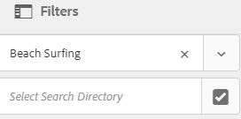

# Administrar colecciones {#managing-collections}

Una colección es un conjunto de activos dentro de [!DNL Adobe Experience Manager Assets]. Utilice las colecciones para compartir recursos entre los usuarios. El conjunto puede ser una colección estática o una colección dinámica basada en los resultados de la búsqueda.

A diferencia de las carpetas, una colección puede incluir recursos de distintas ubicaciones. Puede compartir colecciones con varios usuarios a los que se asignan distintos niveles de privilegios, como ver, editar, etc.

Puede compartir varias colecciones con un usuario. Cada colección contiene referencias a recursos. La integridad referencial de los recursos se mantiene entre colecciones.

Las colecciones son de los siguientes tipos, según la forma en que recopilan los recursos:

* Colección que contiene una lista de referencia estática de recursos, carpetas y otras colecciones.

* Colección inteligente que incluye recursos de forma dinámica en función de criterios de búsqueda.

## Acceda a la consola de colecciones {#navigating-the-collections-console}

Para abrir **[!UICONTROL Collections]**, en la interfaz [!DNL Experience Manager], vaya a **[!UICONTROL Assets]** > **[!UICONTROL Colecciones]**.

## Crear una colección {#creating-a-collection}

Puede crear una colección con [referencias estáticas](#creating-a-collection-with-static-references) o basada en un [filtro basado en criterios de búsqueda](#creating-a-smart-collection). También puede crear una colección a partir de un lightbox.

### Crear una colección con referencias estáticas {#creating-a-collection-with-static-references}

Puede crear una colección con referencias estáticas, por ejemplo, una colección con referencias a recursos, carpetas, colecciones, conjuntos de giros y conjuntos de imágenes.

1. Vaya a la consola **[!UICONTROL Collections]** .
1. En la barra de herramientas, haga clic en **[!UICONTROL Crear]**.
1. En la página **[!UICONTROL Crear colección]**, introduzca un título y una descripción opcional para la colección.
1. Agregue miembros a la colección y asigne los permisos correspondientes. Como alternativa, seleccione **[!UICONTROL Colección pública]** para permitir que todos los usuarios tengan acceso a la colección.

   >[!NOTE]
   >
   >Para permitir que los miembros compartan colecciones con otros usuarios, proporcione los permisos de lectura del grupo `dam-users` en la ruta `home/users`. Otorgue permiso a los usuarios en la ubicación `/content/dam/collections` para que puedan ver las colecciones en listas emergentes. Como alternativa, haga que el usuario forme parte del grupo `dam-users`.

1. (Opcional) Agregue una imagen en miniatura para la colección.
1. Haga clic en **[!UICONTROL Crear]** y, a continuación, haga clic en **[!UICONTROL Aceptar]** para cerrar el cuadro de diálogo. En la consola Colecciones se abre una colección con el título y las propiedades especificados.

   >[!NOTE]
   >
   >[!DNL Experience Manager Assets] permite crear tareas de revisión para una colección de forma similar a como se crean tareas de revisión para una carpeta de recursos.

   Para añadir recursos a la colección, vaya a la interfaz de usuario [!DNL Assets] . Para obtener más información, consulte [Agregar recursos a una colección](#adding-assets-to-a-collection).

### Crear colecciones utilizando dropzone {#create-collections-using-dropzone}

Puede arrastrar recursos de la interfaz de usuario [!DNL Assets] a una colección. También puede crear una copia de una colección y arrastrar los recursos allí.

1. En la interfaz de usuario [!DNL Assets], seleccione los recursos que desee agregar a una colección.
1. Arrastre los recursos a la zona **[!UICONTROL Colocar en la colección]**. También puede hacer clic en **[!UICONTROL To Collection]** en la barra de herramientas.

   

1. En la página **[!UICONTROL Agregar a la colección]**, haga clic en **[!UICONTROL Crear colección]** en la barra de herramientas.

   Si desea agregar los recursos a una colección existente, selecciónela en la página y haga clic en **[!UICONTROL Agregar]**. De forma predeterminada, se selecciona la colección con la fecha de actualización más reciente.

1. En el cuadro de diálogo **[!UICONTROL Crear nueva colección]**, indique un nombre para la colección. Si desea que todos los usuarios tengan acceso a la colección, seleccione **[!UICONTROL Colección pública]**.
1. Haga clic en **[!UICONTROL Continue]** para crear la colección.

### Crear una colección inteligente {#creating-a-smart-collection}

Una colección inteligente usa criterios de búsqueda para rellenar recursos de forma dinámica. Puede crear una colección inteligente utilizando solo archivos y no carpetas o archivos y carpetas.

Para crear una colección inteligente, siga los pasos:

1. Vaya a la interfaz de usuario [!DNL Assets] y haga clic en buscar.

1. Escriba la palabra clave de búsqueda en el cuadro Omnisearch y seleccione `Enter`. Abra el panel Filtros y aplique un filtro de búsqueda.

1. En la lista **[!UICONTROL Files &amp; Folders]**, seleccione **[!UICONTROL Files]**.

   

1. Haga clic en **[!UICONTROL Guardar colección inteligente]**.

1. Especifique un nombre para la colección. Seleccione **[!UICONTROL Public]** para añadir el grupo Usuarios de DAM con la función Visualizador a la colección inteligente.

   

   >[!NOTE]
   >
   >Si selecciona **[!UICONTROL Public]**, la colección inteligente estará disponible para todos los usuarios con la función de propietario después de crearla. Si cancela la opción **[!UICONTROL Public]**, el grupo de usuarios de DAM ya no está asociado con la colección inteligente.

1. Haga clic en **[!UICONTROL Save]** para crear la colección inteligente y cierre el cuadro de mensaje para completar el proceso.

   La nueva colección inteligente también se agrega a la lista **[!UICONTROL Búsquedas guardadas]**.

   

   La etiqueta de la opción **[!UICONTROL Crear selección inteligente]** cambia a **[!UICONTROL Editar selección inteligente]**. Para editar la configuración de la colección inteligente, seleccione **[!UICONTROL Archivos]** en la lista **[!UICONTROL Archivos y carpetas]**. Haga clic en la opción **[!UICONTROL Editar selección inteligente]** .

## Agregar recursos a una colección {#adding-assets-to-a-collection}

Puede agregar recursos a una colección que contenga una lista de recursos o carpetas a los que se hace referencia. Las colecciones inteligentes utilizan una consulta de búsqueda para rellenar recursos. Por lo tanto, las referencias estáticas a recursos y carpetas no son aplicables a ellos.

1. En la interfaz de usuario de [!DNL A]Assets, seleccione el recurso y haga clic en **[!UICONTROL To Collection]**  en la barra de herramientas.
También puede arrastrar el recurso al área **[!UICONTROL Colocar en colección]** de la interfaz. Agregue los recursos cuando la etiqueta de la región cambie a **[!UICONTROL Drop to Add]**.

1. En la página **[!UICONTROL Agregar a la colección]**, seleccione la colección a la que desea agregar el recurso.

1. Haga clic en **[!UICONTROL Add]** y cierre el mensaje de confirmación. El recurso se agrega a la colección.

## Editar una colección inteligente {#editing-a-smart-collection}

Las colecciones inteligentes se crean guardando una búsqueda para que pueda modificar su contenido modificando los parámetros de búsqueda de la [búsqueda guardada](#saved-searches).

1. En la interfaz de usuario [!DNL Assets], haga clic en la opción de búsqueda  de la barra de herramientas.
1. Con el cursor en el cuadro Omnisearch , seleccione la tecla `Return`.
1. En la interfaz [!DNL Experience Manager], abra el panel Filtros .
1. En la lista **[!UICONTROL Búsquedas guardadas]**, seleccione la colección inteligente que desee modificar. El panel Buscar aparecen los filtros configurados para la búsqueda guardada.

   

1. En la lista **[!UICONTROL Files &amp; Folders]**, seleccione **[!UICONTROL Files]**.
1. Modifique uno o más filtros según sea necesario. Haga clic en **[!UICONTROL Editar colección inteligente]**.

   También puede editar el nombre de la colección inteligente.

   

1. Haga clic en **[!UICONTROL Guardar]**. Aparece el cuadro de diálogo **[!UICONTROL Editar colección inteligente]**.
1. Haga clic en **[!UICONTROL Sobrescribir]** para reemplazar la colección inteligente original por la colección editada. Como alternativa, seleccione **[!UICONTROL Guardar como]** para guardar la colección editada por separado.
1. En el cuadro de diálogo de confirmación, haga clic en **[!UICONTROL Save]** para completar el proceso.

## Ver y editar metadatos de colección {#view-edit-collection-metadata}

Los metadatos de la colección comprenden datos sobre la colección, incluidas las etiquetas que se agreguen.

1. En la consola [!UICONTROL Collections], seleccione una colección y haga clic en **[!UICONTROL Properties]** en la barra de herramientas.
1. En la página **[!UICONTROL Metadatos de la colección]**, consulte los metadatos de la colección desde las pestañas **[!UICONTROL Básico]** y **[!UICONTROL Avanzado]**.
1. Modifique los metadatos según sea necesario. Para guardar los cambios, haga clic en **[!UICONTROL Guardar y cerrar]** en la barra de herramientas.

## Editar metadatos de varias colecciones de forma masiva {#editing-collection-metadata-in-bulk}

Puede editar los metadatos de varias colecciones simultáneamente. Esta funcionalidad le ayuda a duplicar rápidamente metadatos comunes en varias colecciones.

1. En la consola Colecciones , seleccione dos o más colecciones.
1. En la barra de herramientas, haga clic en **[!UICONTROL Properties]**.
1. En la página **[!UICONTROL Metadatos de la colección]**, edite los metadatos en las pestañas **[!UICONTROL Básico]** y **[!UICONTROL Avanzado]**, según sea necesario.
1. Para ver las propiedades de los metadatos de una colección específica, cancele la selección de las colecciones restantes de la lista de colecciones. Los campos del editor de metadatos se rellenan con los metadatos de la colección en particular.

   >[!NOTE]
   >
   >* En la página [!UICONTROL Properties], puede eliminar colecciones de la lista de colecciones cancelando la selección. La lista de colecciones tiene todas las colecciones seleccionadas de forma predeterminada. [!DNL Experience Manager] no actualiza los metadatos de las colecciones que elimine.
   >* En la parte superior de la lista, active la casilla de verificación situada cerca de **[!UICONTROL Title]** para alternar entre la selección de las colecciones y la eliminación de la lista.

1. Haga clic en **[!UICONTROL Guardar y cerrar]** en la barra de herramientas y cierre el cuadro de diálogo de confirmación.
1. Para anexar los nuevos metadatos con los metadatos existentes, seleccione **[!UICONTROL Append mode]**. Si no selecciona esta opción, los metadatos nuevos sustituirán a los metadatos existentes en los campos. Haga clic en **[!UICONTROL Submit]**.

   >[!NOTE]
   >
   >Los metadatos que agregue para las colecciones seleccionadas sobrescriben los metadatos anteriores para estas colecciones. Utilice el [!UICONTROL modo Anexar] para agregar nuevos valores a los metadatos existentes en los campos que pueden contener varios valores. Los campos de un solo valor siempre se sobrescriben. Las etiquetas que agregue en el campo [!UICONTROL Etiquetas] se anexan a la lista de etiquetas existente en los metadatos.

Para personalizar la página [!UICONTROL Properties] de metadatos, incluyendo la adición, modificación y eliminación de propiedades de metadatos, utilice el editor de esquemas.

>[!TIP]
>
>El método de edición masiva funciona para los recursos disponibles en una colección. Para los recursos disponibles en todas las carpetas o que coinciden con criterios comunes, es posible [actualizar los metadatos de forma masiva después de buscar](/help/assets/search-assets.md#metadataupdates).

## Buscar colecciones {#searching-collections}

Puede buscar colecciones desde la consola Colecciones . Cuando busca con palabras clave en el cuadro Omnisearch , [!DNL Assets] busca nombres de recopilación, metadatos y las etiquetas agregadas a las colecciones.

Si busca colecciones del nivel superior, solo se devolverán colecciones individuales en los resultados de búsqueda. [!DNL Assets] o las carpetas dentro de las colecciones se excluyen. En todos los demás casos (por ejemplo, dentro de una colección individual o en una jerarquía de carpetas), se devuelven todos los recursos, carpetas y colecciones relevantes.

## Buscar en colecciones {#searching-within-collections}

En la consola Colecciones, haga clic en una colección para abrirla.

Dentro de una colección, la búsqueda [!DNL Experience Manager] está restringida a los recursos (y sus etiquetas y metadatos) dentro de la colección que está viendo. Al buscar dentro de una carpeta, se devuelven todos los recursos coincidentes y las carpetas secundarias de la carpeta actual. Al buscar dentro de una colección, solo se devuelven los recursos, carpetas y otras colecciones que coinciden con los miembros directos de la colección.

## Editar configuración de colección {#editing-collection-settings}

Puede editar la configuración de la colección, como el título y la descripción, o agregar miembros a una colección.

1. Seleccione una colección y haga clic en **[!UICONTROL Settings]** en la barra de herramientas. También puede utilizar la acción rápida **[!UICONTROL Settings]** de la miniatura de la colección.
1. Modifique la configuración de la colección en la página **[!UICONTROL Configuración de la colección]**. Por ejemplo, modifique el título de la colección, las descripciones, los miembros y los permisos tal como se describe en [Añadir colecciones](#creating-a-collection).

1. Para guardar los cambios, haga clic en **[!UICONTROL Guardar]**.

## Eliminar una colección {#deleting-a-collection}

1. En la consola Colecciones , seleccione una o varias colecciones y haga clic en Eliminar en la barra de herramientas.

1. En el cuadro de diálogo, haga clic en **[!UICONTROL Delete]** para confirmar la acción de eliminación.

   >[!NOTE]
   >
   >También puede eliminar colecciones inteligentes [eliminando búsquedas guardadas](#saved-searches).

## Descargar una colección {#downloading-a-collection}

Cuando descarga una colección, se descarga toda la jerarquía de recursos de la colección, incluidas las carpetas y las colecciones secundarias.

1. En la consola Colecciones , seleccione una o varias colecciones para descargar.
1. En la barra de herramientas, haga clic en **[!UICONTROL Descargar]**.
1. En el cuadro de diálogo **[!UICONTROL Download]**, haga clic en **[!UICONTROL Download]**. Si desea descargar las representaciones de los recursos dentro de la colección, seleccione **[!UICONTROL Representaciones]**. Seleccione la opción **[!UICONTROL Email]** para enviar una notificación por correo electrónico al propietario de la colección.

   Cuando selecciona una colección para descargar, se descarga la jerarquía completa de carpetas bajo la colección. Para incluir cada colección que descargue (incluidos los recursos de colecciones secundarias anidadas en la colección principal) en una carpeta individual, seleccione **[!UICONTROL Crear carpeta independiente para cada recurso]**.

## Crear colecciones anidadas {#creating-nested-collections}

Puede agregar una colección a otra colección, creando así una colección anidada.

1. En la consola Colecciones , seleccione la colección o el grupo de colecciones que desee y haga clic en **[!UICONTROL Colección]** en la barra de herramientas.

1. En la página **[!UICONTROL Agregar a la colección]**, seleccione la colección en la que desea agregar la colección.

   >[!NOTE]
   >
   >La colección actualizada más recientemente está seleccionada de forma predeterminada en la página **[!UICONTROL Agregar a la colección]**.

1. Haga clic en **[!UICONTROL Agregar]**. Un mensaje confirma que la colección se agrega a la colección de destino en la página **[!UICONTROL Seleccionar destino]**. Cierre el mensaje para completar el proceso.

>[!NOTE]
>
>Las colecciones inteligentes no se pueden anidar. En otras palabras, las colecciones inteligentes no pueden contener ninguna otra colección.

## Búsquedas guardadas {#saved-searches}

En la interfaz de usuario [!DNL Assets] puede buscar o filtrar recursos en función de determinadas reglas, criterios de búsqueda o facetas de búsqueda personalizadas. Si los guarda como **[!UICONTROL Búsquedas guardadas]**, puede acceder a ellos más adelante desde la lista **[!UICONTROL Búsquedas guardadas]** del panel Filtro. Al crear una búsqueda guardada también se crea una colección inteligente.

Las búsquedas guardadas se crean al crear una colección inteligente. Las colecciones inteligentes se agregan automáticamente a la lista **[!UICONTROL Búsquedas guardadas]**. La consulta [!UICONTROL Búsquedas guardadas] para la colección se guarda en la propiedad `dam:query` en CRXDE en la ubicación relativa `/content/dam/collections/`. No existen límites a las búsquedas que se pueden guardar ni a las búsquedas guardadas que se muestran en la lista.

>[!NOTE]
>
>Puede compartir colecciones inteligentes del mismo modo que comparte colecciones estáticas.

Editar búsquedas guardadas es lo mismo que editar colecciones inteligentes. Para obtener más información, consulte [editar una colección inteligente](#editing-a-smart-collection).

Para eliminar las búsquedas guardadas, siga estos pasos:

1. En la interfaz de usuario [!DNL Assets], haga clic en la opción de búsqueda .
1. Con el cursor en el campo Omnisearch , seleccione la tecla `Return`.
1. En la interfaz [!DNL Experience Manager], abra el panel Filtros .
1. En la lista **[!UICONTROL Búsquedas guardadas]**, haga clic en **[!UICONTROL Eliminar]** junto a la colección inteligente que desea eliminar.

   

1. En el cuadro de diálogo, haga clic en **[!UICONTROL Eliminar]** para eliminar la búsqueda guardada.

## Ejecutar un flujo de trabajo en una colección {#running-a-workflow-on-a-collection}

Puede ejecutar un flujo de trabajo para los recursos de una colección. Si la colección contiene colecciones anidadas, el flujo de trabajo también se ejecuta en los recursos de las colecciones anidadas. Sin embargo, si la colección y la colección anidada contienen recursos duplicados, el flujo de trabajo solo se ejecuta una vez para estos recursos.

1. Abra **[!UICONTROL Assets]** > **[!UICONTROL Colecciones]**. Para ejecutar un flujo de trabajo en una colección específica, selecciónela.
1. Abra el carril **[!UICONTROL Línea de tiempo]**. Haga clic en  y haga clic en **[!UICONTROL Iniciar flujo de trabajo]**.
1. En la sección **[!UICONTROL Iniciar flujo de trabajo]**, seleccione un modelo de flujo de trabajo de la lista. Por ejemplo, seleccione el modelo **[!UICONTROL Recurso de actualización DAM]**.
1. Introduzca un título para el flujo de trabajo y haga clic en **[!UICONTROL Start]**.
1. En el cuadro de diálogo, haga clic en **[!UICONTROL Continuar]**. El flujo de trabajo procesa todos los recursos de la colección seleccionada.

>[!MORELIKETHIS]
>
>* [Configuración de las notificaciones por correo electrónico de Experience Manager Assets](/help/sites-administering/notification.md#assetsconfig)
>* [Crear una tarea de revisión para colecciones](bulk-approval.md)

