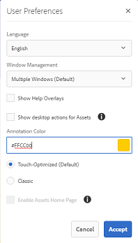
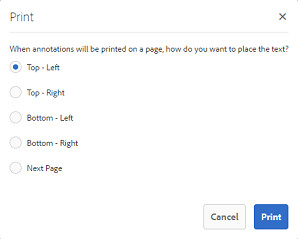

# Administrar sus recursos digitales {#managing-assets-with-the-touch-optimized-ui}

En este artículo se describe cómo administrar y editar recursos en Recursos Adobe Experience Manager (AEM). Para empezar a utilizar la interfaz de usuario y el diseño, consulte Gestión [básica de la IU](/help/sites-authoring/basic-handling.md)táctil. Para administrar fragmentos de contenido, consulte [Administración de fragmentos](content-fragments-managing.md) de contenido.

## Crear carpetas {#creating-folders}

Al organizar una colección de recursos, por ejemplo, todas `Nature` las imágenes, puede crear carpetas para mantenerlas juntas. Puede utilizar carpetas para categorizar y organizar los recursos. Recursos AEM no requiere que organice los recursos en carpetas para que funcionen mejor.

>[!NOTE]
>
>* Compartir una carpeta de recursos del tipo `sling:OrderedFolder`, no se admite al compartir en Marketing Cloud. Si desea compartir una carpeta, no seleccione [!UICONTROL Pedido] al crear una carpeta.
>* Experience Manager no permite usar `subassets` palabras como nombre de una carpeta. Es una palabra clave reservada para el nodo que contiene subrecursos para los recursos compuestos.

1. Vaya al lugar de la carpeta de recursos digitales en el que desea crear una nueva carpeta. En el menú, haga clic en **[!UICONTROL Crear]**. Seleccione **[!UICONTROL Nueva carpeta]**.
1. En el campo **[!UICONTROL Título]** , especifique un nombre de carpeta. De forma predeterminada, DAM utiliza el título que ha proporcionado como nombre de carpeta. Una vez creada la carpeta, puede anular el valor predeterminado y especificar otro nombre de carpeta.
1. Haga clic en **[!UICONTROL Crear]**. La carpeta se muestra en la carpeta de recursos digitales.

No se admiten los siguientes caracteres (lista de caracteres separados por espacios):

* Un nombre de archivo de recurso no puede contener ninguno de estos caracteres: `* / : [ \\ ] | # % { } ? &`
* El nombre de una carpeta de recursos no puede contener ninguno de estos caracteres: `* / : [ \\ ] | # % { } ? \" . ^ ; + & \t`

## Upload assets {#uploading-assets}

<!-- TBD the following:
Move this section into a new article. CQDOC-14874 ticket is created for this.
In this complete article, replace emphasis with UICONTROL where appropriate.
-->

Puede cargar varios tipos de recursos (como imágenes, archivos PDF, archivos RAW, etc.) desde la carpeta local o desde una unidad de red a Recursos AEM.

>[!NOTE]
>
>En el modo Dynamic Media - Scene7, solo se pueden cargar recursos cuyo tamaño de archivo sea de 2 GB o inferior.

Puede elegir cargar recursos en carpetas con o sin un perfil de procesamiento asignado a ellas.

Para las carpetas que tienen asignado un perfil de procesamiento, el nombre del perfil aparece en la miniatura de la vista de tarjeta. En la vista de lista, el nombre del perfil aparece en la columna Perfil **de procesamiento** . Consulte Perfiles [de procesamiento](/help/assets/processing-profiles.md).

Antes de cargar un recurso, asegúrese de que tiene un [formato](/help/assets/assets-formats.md) compatible con Recursos AEM.

1. En la interfaz de usuario de Recursos, navegue hasta la ubicación en la que desee agregar recursos digitales.
1. Para cargar los recursos, realice una de las siguientes acciones:

   * En la barra de herramientas, toque el icono **[!UICONTROL Crear]** . A continuación, en el menú, toque **[!UICONTROL Archivos]**. Si es necesario, puede cambiar el nombre del archivo en el cuadro de diálogo presentado.
   * En un navegador compatible con HTML5, arrastre los recursos directamente en la interfaz de usuario de Recursos. No se muestra el cuadro de diálogo para cambiar el nombre del archivo.
   

   Para seleccionar varios archivos, pulse la tecla Ctrl o Comando y seleccione los recursos en el cuadro de diálogo del selector de archivos. Al utilizar un iPad, solo puede seleccionar un archivo a la vez.

   Puede pausar la carga de recursos de gran tamaño (buenos de 500 MB) y reanudarla más tarde desde la misma página. Toque el icono **[!UICONTROL Pausa]** junto a la barra de progreso que aparece cuando se inicia una carga.

   

   Se puede configurar el tamaño por encima del cual un recurso se considera un recurso grande. Por ejemplo, puede configurar el sistema para que considere los recursos superiores a 1000 MB (en lugar de 500 MB) como recursos grandes. En este caso, **[!UICONTROL Pausa]** aparece en la barra de progreso cuando se cargan recursos de tamaño bueno superior a 1000 MB.

   El botón Pausar no muestra si un archivo bueno de más de 1000 MB se carga con un archivo menor que 1000 MB. Sin embargo, si cancela la carga de archivos de menos de 1000 MB, aparece el botón **[!UICONTROL Pausa]** .

   Para modificar el límite de tamaño, configure la `chunkUploadMinFileSize` propiedad del `fileupload`nodo en el repositorio de CRX.

   Al hacer clic en el icono **[!UICONTROL Pausa]** , se desplaza al icono **[!UICONTROL Reproducir]** . Para reanudar la carga, haga clic en el icono **[!UICONTROL Reproducir]** .

   

   Para cancelar una carga en curso, haga clic en Cerrar (`X`) al lado de la barra de progreso. Al cancelar la operación de carga, AEM Assets elimina la parte parcialmente cargada del recurso.

   La capacidad de reanudar la carga resulta especialmente útil en situaciones de bajo ancho de banda y problemas de red, donde la carga de un recurso de gran tamaño tarda mucho tiempo. Puede pausar la operación de carga y continuar más tarde cuando mejore la situación. Cuando se reanuda, la carga comienza desde el punto en el que se detuvo.

   Durante la operación de carga, AEM guarda las partes del recurso que se cargan como fragmentos de datos en el repositorio de CRX. Una vez completada la carga, AEM consolida estos fragmentos en un solo bloque de datos en el repositorio.

   Para configurar la tarea de limpieza para los trabajos de carga de fragmentos no finalizados, vaya a `https://[aem_server]:[port]/system/console/configMgr/org.apache.sling.servlets.post.impl.helper.ChunkCleanUpTask`.

   Si carga un recurso con el mismo nombre que el de un recurso ya disponible en la ubicación donde está cargando el recurso, se muestra un cuadro de diálogo de advertencia.

   Puede elegir reemplazar un recurso existente, crear otra versión o mantener ambos cambiando el nombre del nuevo recurso que se carga. Si sustituye un recurso existente, se eliminarán los metadatos del recurso y las modificaciones anteriores (por ejemplo, realizar anotaciones o recortes) que haya realizado en el recurso existente. Si decide conservar ambos recursos, se cambiará el nombre del nuevo recurso por el número `1` que se añadirá al nombre.

   

   >[!NOTE]
   >
   >Al seleccionar **[!UICONTROL Reemplazar]** en el cuadro de diálogo Conflicto [!UICONTROL de] nombres, el ID de recurso se regenera para el nuevo recurso. Este ID es diferente del ID del recurso anterior.
   >
   >Si Asset Insights está habilitado para rastrear impresiones/clics con Adobe Analytics, el ID de recurso regenerado invalida los datos capturados para el recurso en Analytics.

   Si el recurso cargado existe en Recursos AEM, el cuadro de diálogo **[!UICONTROL Duplicados detectados]** advierte que está intentando cargar un recurso duplicado. El cuadro de diálogo solo aparece si el valor de suma de `SHA 1` comprobación del binario del recurso existente coincide con el valor de suma de comprobación del recurso que se carga. En este caso, los nombres de los activos no son importantes.

   >[!NOTE]
   >
   >El cuadro de diálogo [!UICONTROL Duplicados detectados] solo aparece cuando la función de detección de duplicados está activada. Para habilitar la función de detección de duplicados, consulte [Habilitar detección](/help/assets/duplicate-detection.md)de duplicados.

   

   Para conservar el recurso duplicado en Recursos AEM, toque o haga clic en **[!UICONTROL Mantener]**. Para eliminar el recurso duplicado que ha cargado, toque o haga clic en **[!UICONTROL Eliminar]**.

   Recursos AEM evita que se carguen recursos con los caracteres prohibidos en sus nombres de archivo. Si intenta cargar un recurso con un nombre de archivo que contenga uno o varios caracteres no permitidos, Recursos AEM muestra un mensaje de advertencia y detiene la carga hasta que elimine estos caracteres o la carga con un nombre permitido.

   Para adaptarse a las convenciones de nombres de archivo específicas de su organización, el cuadro de diálogo [!UICONTROL Cargar recursos] permite especificar nombres largos para los archivos que cargue.

   Sin embargo, no se admiten los siguientes caracteres (lista de) separados por espacios:

   * el nombre del archivo de recurso no debe contener `* / : [ \\ ] | # % { } ? &`
   * el nombre de la carpeta de recursos no debe contener `* / : [ \\ ] | # % { } ? \" . ^ ; + & \t`
   

   Además, la interfaz de usuario de Recursos muestra el recurso más reciente que se ha cargado o la carpeta que se ha creado primero.

   Si cancela la operación de carga antes de que se carguen los archivos, Recursos AEM deja de cargar el archivo actual y actualiza el contenido. Sin embargo, los archivos que ya se han cargado no se eliminan.

   El cuadro de diálogo de progreso de carga en Recursos AEM muestra el recuento de los archivos cargados correctamente y los archivos que no se pudieron cargar.

### Cargas serie {#serialuploads}

La carga masiva de numerosos recursos consume importantes recursos de E/S, lo que puede afectar negativamente al rendimiento de la instancia de Recursos AEM. En particular, si tiene una conexión a Internet lenta, el tiempo para cargar aumenta drásticamente debido a un pico en la E/S de disco. Además, el navegador web puede introducir restricciones adicionales en el número de solicitudes POST que AEM Assets puede gestionar para cargas de recursos simultáneas. Como resultado, la operación de carga falla o finaliza antes de tiempo. En otras palabras, los recursos de AEM pueden perder algunos archivos al ingerirlos o no realizar la ingesta de ningún archivo.

Para superar esta situación, AEM Assets ingiere un recurso a la vez (carga en serie) durante una operación de carga masiva, en lugar de ingerir todos los recursos simultáneamente.

La carga en serie de recursos está activada de forma predeterminada. Para desactivar la función y permitir la carga simultánea, superponga el `fileupload` nodo en Crx-de y defina el valor de la `parallelUploads` propiedad en `true`.

### Carga de recursos mediante FTP {#uploading-assets-using-ftp}

Dynamic Media permite la carga por lotes de recursos a través del servidor FTP. Si desea cargar recursos de gran tamaño (> 1 GB) o carpetas y subcarpetas enteras, debe utilizar FTP. Incluso puede configurar la carga mediante FTP para que se produzca de forma recurrente y programada.

>[!NOTE]
>
>En el modo Dynamic Media - Scene7, solo se pueden cargar recursos cuyo tamaño de archivo sea de 2 GB o inferior.

>[!NOTE]
>
>Para cargar recursos mediante FTP en el modo Dynamic Media - Scene7, instale Feature Pack 18912 en las instancias de creación de AEM. Póngase en contacto con el Servicio de atención al cliente [de](https://helpx.adobe.com/contact/enterprise-support.ec.html) Adobe para obtener acceso al FP-18912 y completar la configuración de su cuenta de FTP. Para obtener más información, consulte [Instalación del paquete de funciones 18912 para la migración](/help/assets/bulk-ingest-migrate.md)masiva de recursos.
>
>Si utiliza FTP para cargar recursos, se ignora la configuración de carga especificada en AEM. En su lugar, se utilizan las reglas de procesamiento de archivos, tal como se definen en Dynamic Media Classic.

**Para cargar recursos mediante FTP**

1. Con el cliente FTP que elija, inicie sesión en el servidor FTP con el nombre de usuario y la contraseña de FTP que recibió del correo electrónico de aprovisionamiento. En el cliente FTP, cargue archivos o carpetas en el servidor FTP.
1. [Inicie sesión en Dynamic Media Classic](https://www.adobe.com/marketing-cloud/experience-manager/scene7-login.html) con las credenciales recibidas del correo electrónico de aprovisionamiento. En la barra de navegación global, toque **[!UICONTROL Cargar]**.

1. En la página Cargar, cerca de la esquina superior izquierda, toque la ficha **[!UICONTROL Por medio de FTP]** .
1. En la parte izquierda de la página, elija una carpeta FTP desde la que cargar los archivos; a la derecha de la página, elija una carpeta de destino.
1. Cerca de la esquina inferior derecha de la página, haga clic en Opciones **[!UICONTROL de]** trabajo y, a continuación, defina las opciones que desee en función de los recursos de la carpeta seleccionada.

   Consulte Opciones [de trabajo de carga](#upload-job-options).

   >[!NOTE]
   >
   >Al cargar recursos a través de FTP, las opciones de trabajo de carga definidas en Dynamic Media Classic (S7) prevalecen sobre los parámetros de procesamiento de recursos establecidos en AEM.

1. En la esquina inferior derecha del cuadro de diálogo Opciones de trabajo de carga, toque **[!UICONTROL Guardar]**.
1. En la esquina inferior derecha de la página Cargar, toque **[!UICONTROL Enviar carga]**.

   Para ver el progreso de la carga, en la barra de navegación global, toque **[!UICONTROL Trabajos]**. La página Trabajos muestra el progreso de la carga. Puede continuar trabajando en AEM y volver a la página Trabajos de Dynamic Media Classic en cualquier momento para revisar un trabajo en curso.
Para cancelar un trabajo de carga en curso, toque **[!UICONTROL Cancelar]** junto al tiempo de duración.

#### Opciones de trabajo de carga {#upload-job-options}

| Opción de carga | Subopción | Descripción |
|---|---|---|
| Nombre del trabajo |  | El nombre predeterminado que se rellena previamente en el campo de texto incluye la parte introducida por el usuario del nombre y la marca de fecha y hora. Puede usar el nombre predeterminado o escribir un nombre de su propia creación para este trabajo de carga.  El trabajo y otros trabajos de carga y publicación se registran en la página Trabajos, donde puede comprobar el estado de los trabajos. |
| Publicar tras la carga |  | Publica automáticamente los recursos que se cargan. |
| Sobrescribir en cualquier carpeta, el mismo nombre de recurso base independientemente de la extensión |  | Seleccione esta opción si desea que los archivos que cargue sustituyan los archivos existentes con los mismos nombres. El nombre de esta opción puede ser diferente, según la configuración de Ajustes **[!UICONTROL de]** aplicación > Configuración **** general > **[!UICONTROL Cargar a la aplicación]** > **[!UICONTROL Sobrescribir imágenes]**. |
| Descomprimir archivos zip o Tar durante la carga |  |  |
| Opciones de trabajo |  | Toque o haga clic en Opciones **[!UICONTROL de]** trabajo para abrir el cuadro de diálogo Opciones [!UICONTROL de trabajo de] carga y elija las opciones que afectan a todo el trabajo de carga. Estas opciones son las mismas para todos los tipos de archivo. Puede elegir las opciones predeterminadas para cargar archivos empezando por la página Configuración general de la aplicación. Para abrir esta página, seleccione **[!UICONTROL Ajustes]** > Ajustes **[!UICONTROL de aplicación]**. Toque el botón Opciones **[!UICONTROL de carga]** predeterminadas para abrir el cuadro de diálogo Opciones [!UICONTROL de trabajo de] carga. |
|  | Cuando | Seleccione Una vez o Recurrente. Para configurar un trabajo recurrente, elija una opción de repetición (diaria, semanal, mensual o personalizada) para especificar cuándo desea que se repita el trabajo de carga de FTP. A continuación, especifique las opciones de programación según sea necesario. |
|  | Incluir subcarpetas | Cargue todas las subcarpetas de la carpeta que desee cargar. Los nombres de la carpeta y sus subcarpetas que cargue se introducirán automáticamente en Recursos AEM. |
|  | Opciones de recorte | Para recortar manualmente de los lados de una imagen, seleccione el menú Recortar y elija Manual. A continuación, introduzca el número de píxeles que desea recortar de cualquier lado o de cada lado de la imagen. La cantidad de imagen que se recorte depende del ajuste ppp (píxeles por pulgada) del archivo de imagen. Por ejemplo, si la imagen muestra 150 ppp y se introduce 75 en los cuadros de texto Superior, Derecha, Inferior e Izquierda, se recortará media pulgada de cada lado.  Para recortar automáticamente píxeles de espacio en blanco de una imagen, abra el menú Recortar, elija Manual e introduzca las medidas en píxeles en los campos Superior, Derecha, Inferior e Izquierda para recortar desde los lados. También puede elegir Recortar en el menú Recortar y elegir estas opciones:  **Recortar según** <ul><li>**Color** : elija la opción Color. A continuación, seleccione el menú Esquina y elija la esquina de la imagen con el color que mejor represente el color de espacio en blanco que desea recortar.</li><li>**Transparencia** : elija la opción Transparencia.  **Tolerancia** : arrastre el control deslizante para especificar una tolerancia de 0 a 1.Para recortar según el color, especifique 0 para recortar píxeles solo si coinciden exactamente con el color seleccionado en la esquina de la imagen. Los números más cercanos a 1 permiten una mayor diferencia de color. Para recortar según la transparencia, especifique 0 para recortar píxeles solo si son transparentes. Los números más cercanos a 1 permiten una mayor transparencia.</li></ul> Tenga en cuenta que estas opciones de recorte no son destructivas. |
|  | Opciones de perfil de color | Elija una conversión de color cuando cree archivos optimizados que se utilicen para la entrega:<ul><li>Conservación de color predeterminada: Mantiene los colores de la imagen de origen siempre que las imágenes contengan información de espacio de color; no hay conversión de color. Casi todas las imágenes actuales ya tienen el perfil de color adecuado incrustado. Sin embargo, si una imagen de origen CMYK no contiene un perfil de color incrustado, los colores se convierten en espacio de color sRGB (estándar rojo verde azul). sRGB es el espacio de color recomendado para mostrar imágenes en páginas web.</li><li>Mantener espacio de color original: Conserva los colores originales sin ninguna conversión de color en el punto. Para las imágenes sin un perfil de color incrustado, cualquier conversión de color se realiza utilizando los perfiles de color predeterminados configurados en la configuración de publicación. Es posible que los perfiles de color no se alineen con el color de los archivos creados con esta opción. Por lo tanto, se le recomienda utilizar la opción Conservación de color predeterminada.</li><li>Personalizado de > Para  abre los menús para que pueda elegir un espacio de color Convertir de y Convertir en. Esta opción avanzada anula toda la información de color incrustada en el archivo de origen. Seleccione esta opción cuando todas las imágenes que va a enviar contengan datos de perfil de color incorrectos o falten.</li></ul> |
|  | Opciones de edición de imágenes | Puede conservar las máscaras de recorte en las imágenes y elegir un perfil de color.  Consulte [Configuración de las opciones de edición de imágenes durante la carga](#setting-image-editing-options-at-upload). |
|  | Opciones de Postscript | Puede rasterizar archivos PostScript®, recortar archivos, mantener fondos transparentes, elegir una resolución y elegir un espacio de color.  Consulte [Configuración de las opciones](#setting-postscript-and-illustrator-upload-options)de carga de PostScript e Illustrator. |
|  | Opciones de Photoshop | Puede crear plantillas a partir de archivos de Adobe® Photoshop®, mantener las capas, especificar el nombre de las capas, extraer texto y especificar cómo se anclan las imágenes en las plantillas.  Tenga en cuenta que las plantillas no son compatibles con AEM.  Consulte [Configuración de las opciones](#setting-photoshop-upload-options)de carga de Photoshop. |
|  | Opciones de PDF | Puede rasterizar los archivos, extraer palabras de búsqueda y vínculos, generar automáticamente un catálogo electrónico, definir la resolución y elegir un espacio de color.  Tenga en cuenta que los catálogos electrónicos no son compatibles con AEM.   Consulte [Configuración de opciones](#setting-pdf-upload-options)de carga de PDF. |
|  | Opciones de Illustrator | Puede rasterizar archivos de Adobe Illustrator®, mantener fondos transparentes, elegir una resolución y elegir un espacio de color.  Consulte [Configuración de las opciones](#setting-postscript-and-illustrator-upload-options)de carga de PostScript e Illustrator. |
|  | Opciones de eVideo | Puede transcodificar un archivo de vídeo seleccionando un ajuste preestablecido de vídeo.  Consulte [Configuración de las opciones](#setting-evideo-upload-options)de carga de eVideo. |
|  | Valores preestablecidos de conjunto de lotes | Para crear un conjunto de imágenes o un conjunto de giros a partir de los archivos cargados, haga clic en la columna Activo del ajuste preestablecido que desee utilizar. Puede seleccionar más de un ajuste preestablecido. Los ajustes preestablecidos se crean en la página Ajustes de aplicación/Valores preestablecidos de conjunto por lotes de Dynamic Media Classic.  Consulte [Configuración de ajustes preestablecidos de conjuntos de lotes para generar automáticamente conjuntos de imágenes y conjuntos](config-dms7.md#creating-batch-set-presets-to-auto-generate-image-sets-and-spin-sets) de giros para obtener más información sobre la creación de ajustes preestablecidos de conjuntos de lotes.  Consulte [Configuración de ajustes preestablecidos de conjunto por lotes al cargar](#setting-batch-set-presets-at-upload). |

#### Establecer las opciones de edición de imágenes al cargar {#setting-image-editing-options-at-upload}

Al cargar archivos de imagen, incluidos archivos AI, EPS y PSD, puede realizar las siguientes acciones de edición en el cuadro de diálogo Opciones [!UICONTROL de trabajo de] carga:

* Recorte el espacio en blanco desde el borde de las imágenes (consulte la descripción en la tabla anterior).
* Recortar manualmente desde los lados de las imágenes (consulte la descripción en la tabla anterior).
* Elija un perfil de color (consulte la descripción de la opción en la tabla anterior).
* Crear una máscara a partir de un trazado de recorte.
* Enfocar imágenes con opciones de máscara de enfoque
* Fondo de cobertura

<!--
| Option | Sub-option | Description |
|---|---|---|
| Create Mask From Clipping Path | | Create a mask for the image based on its clipping path information. This option applies to images created with image-editing applications in which a clipping path was created. |
| Unsharp Masking | | Lets you fine-tune a sharpening filter effect on the final downsampled image, controlling the intensity of the effect, the radius of the effect (as measured in pixels), and a threshold of contrast that is ignored.  This effect uses the same options as Photoshop’s Unsharp Mask filter. Contrary to what the name suggests, Unsharp Mask is a sharpening filter. Under Unsharp Masking, set the options you want. Setting options are described in the following: |
| | Amount | Controls the amount of contrast that is applied to edge pixels.  Think of it as the intensity of the effect. The main difference between the amount values of Unsharp Mask in Dynamic Media and the amount values in Adobe Photoshop, is that Photoshop has an amount range of 1% to 500%. Whereas, in Dynamic Media, the value range is 0.0 to 5.0. A value of 5.0 is the rough equivalent of 500% in Photoshop; a value of 0.9 is the equivalent of 90%, and so on. |
| | Radius | Controls the radius of the effect. The value range is 0-250.  The effect is run on all pixels in an image and radiates out from all pixels in all directions. The radius is measured in pixels. For example, to get a similar sharpening effect for a 2000 x 2000 pixel image and 500 x 500 pixel image, you would set a radius of two pixels on the 2000 x 2000 pixel image and a radius value of one pixel on the 500 x 500 pixel image. A larger value is used for an image that has more pixels. |
| | Threshold | Threshold is a range of contrast that is ignored when the Unsharp Mask filter is applied. It is important so that no "noise" is introduced to an image when this filter is used. The value range is 0-255, which is the number of brightness steps in a grayscale image. 0=black, 128=50% gray and 255=white.  For example, a threshold value of 12 ignores slight variations is skin tone brightness to avoid adding noise, but still add edge contrast to areas such as where eyelashes meet skin.  For example, if you have a photo of someone’s face, the Unsharp Mask affects the parts of the image, such as where eyelashes and skin meet to create an obvious area of contrast, and the smooth skin itself. Even the smoothest skin exhibits subtle changes in brightness values. If you do not use a threshold value, the filter accentuates these subtle changes in skin pixels. In turn, a noisy and undesirable effect is created while contrast on the eyelashes is increased, enhancing sharpness.  To avoid this issue, a threshold value is introduced that tells the filter to ignore pixels that do not change contrast dramatically, like smooth skin.  In the zipper graphic shown earlier, notice the texture next to the zippers. Image noise is exhibited because the threshold values were too low to suppress the noise. |
| | Monochrome | Select to unsharp-mask image brightness (intensity).  Deselect to unsharp-mask each color component separately. |
| Knockout Background | | Automatically removes the background of an image when you upload it. This technique is useful to draw attention to a particular object and make it stand out from a busy background. Select to enable or “turn on” the Knockout Background feature and the following sub-options: |
| | Corner | Required.  The corner of the image that is used to define the background color to knockout.  You can choose from **Upper Left**, **Bottom Left**, **Upper Right**, or **Bottom Right**. |
| | Fill Method | Required.  Controls pixel transparency from the Corner location that you set.  You can choose from the following fill methods: <ul><li>**Flood Fill** - turns all pixels transparent that match the Corner that you have specified and are connected to it.</li><li>**Match Pixel** - turns all matching pixels transparent, regardless of their location on the image.</li></ul> |
| | Tolerance | Optional.  Controls the allowable amount of variation in pixel color matching based on the Corner location that you set.  Use a value of 0.0 to match pixel colors exactly or, use a value of 1.0 to allow for the greatest variation. |
-->

#### Definición de las opciones de carga de PostScript e Illustrator {#setting-postscript-and-illustrator-upload-options}

Al cargar archivos de imagen PostScript (EPS) o Illustrator (AI), puede darles formato de varias formas. Puede rasterizar los archivos, mantener el fondo transparente, elegir una resolución y elegir un espacio de color. Las opciones para dar formato a archivos PostScript e Illustrator están disponibles en el cuadro de diálogo Opciones [!UICONTROL de trabajo de] carga, en Opciones [!UICONTROL de] PostScript y Opciones de [!UICONTROL Illustrator].

| Opción | Subopción | Descripción |
|---|---|---|
| Procesando |  | Elija **[!UICONTROL Rasterizar]** para convertir los gráficos vectoriales del archivo al formato de mapa de bits. |
| Mantener fondo transparente en imagen procesada |  | Mantener la transparencia de fondo del archivo. |
| Resolución |  | Determina la configuración de resolución. Esta configuración determina cuántos píxeles se muestran por pulgada en el archivo. |
| Espacio color |  | Seleccione el menú Espacio de color y elija entre las siguientes opciones de espacio de color: |
|  | Detectar automáticamente | Conserva el espacio de color del archivo. |
|  | Forzar RGB | Convierte al espacio de color RGB. |
|  | Forzar CMYK | Convierte al espacio de color CMYK. |
|  | Forzar escala de grises | Convierte al espacio de color de escala de grises. |

#### Definición de las opciones de carga de Photoshop {#setting-photoshop-upload-options}

Los archivos de documento de Photoshop (PSD) se utilizan con mayor frecuencia para crear plantillas de imagen. Al cargar un archivo PSD, puede crear una plantilla de imagen automáticamente a partir del archivo (seleccione la opción [!UICONTROL Crear plantilla] en la pantalla Cargar).

Dynamic Media crea varias imágenes a partir de un archivo PSD con capas si se utiliza el archivo para crear una plantilla; crea una imagen para cada capa.

Utilice las opciones [!UICONTROL de] recorte y las opciones [!UICONTROL de perfil de]color descritas anteriormente con las opciones de carga de Photoshop.

>[!NOTE]
>
>Las plantillas no son compatibles con AEM.

| Opción | Subopción | Descripción |
|---|---|---|
| Mantener capas |  | Extrae las capas del PSD, si las hay, en recursos individuales. Las capas de recursos permanecen asociadas al PSD. Puede verlos abriendo el archivo PSD en la vista de detalles y seleccionando el panel de capas. |
| Crear plantilla |  | Crea una plantilla a partir de las capas del archivo PSD. |
| Extraer texto |  | Extrae el texto para que los usuarios puedan buscar texto en un visor. |
| Extender las capas al tamaño de fondo |  | Extiende el tamaño de las capas de imagen extraídas al tamaño de la capa de fondo. |
| Nombres de capas |  | Las capas del archivo PSD se cargan como imágenes independientes. |
|  | Nombre de la capa | Asigna a las imágenes los nombres de sus capas en el archivo PSD. Por ejemplo, una capa denominada Etiqueta de precio en el archivo PSD original se convierte en una imagen denominada Etiqueta de precio. Sin embargo, si los nombres de capa del archivo PSD son nombres de capa predeterminados de Photoshop (Fondo, Capa 1, Capa 2, etc.), las imágenes recibirán el nombre de sus números de capa en el archivo PSD, no de sus nombres de capa predeterminados. |
|  | Número de Photoshop y de capa | Asigna a las imágenes los nombres de sus capas en el archivo PSD, sin tener en cuenta los nombres de las capas originales. Las imágenes reciben el nombre del archivo de Photoshop y un número de capa anexado. Por ejemplo, la segunda capa de un archivo llamado Anuncio primavera.psd se denomina Anuncio primavera_2 aunque tenga un nombre no predeterminado en Photoshop. |
|  | Nombre de Photoshop y capa | Nombra las imágenes después del archivo PSD seguido del nombre o el número de capa. El número de capa se utiliza si los nombres de capa del archivo PSD son nombres de capa predeterminados de Photoshop. Por ejemplo, una capa denominada Etiqueta de precio en un archivo PSD llamado Anuncio primavera se denomina Anuncio primavera_Etiqueta de precio. Una capa con el nombre predeterminado Capa 2 se denomina Anuncio primavera_2. |
| Ancla |  | Especifique cómo se anclan las imágenes en plantillas que se generan a partir de la composición en capas producida a partir del archivo PSD. De forma predeterminada, el anclaje es el centro. Un anclaje central permite que las imágenes de reemplazo ocupen mejor el mismo espacio, independientemente de la proporción de aspecto de la imagen de reemplazo. Las imágenes con un aspecto diferente que reemplazan a esta imagen, al hacer referencia a la plantilla y utilizar la sustitución de parámetros, ocupan efectivamente el mismo espacio. Cambie a una configuración diferente si la aplicación requiere que las imágenes de reemplazo ocupen el espacio asignado en la plantilla. |

#### Establecer opciones de carga de PDF {#setting-pdf-upload-options}

Al cargar un archivo PDF, puede darle formato de varias formas. Puede recortar sus páginas, extraer palabras de búsqueda, introducir una resolución de píxeles por pulgada y elegir un espacio de color. Los archivos PDF suelen contener un margen de corte, marcas de recorte, marcas de registro y otras marcas de impresora. Puede recortar estas marcas de los lados de las páginas al cargar un archivo PDF.

>[!NOTE]
>
>Los catálogos electrónicos no son compatibles con AEM.

Elija entre las siguientes opciones:

| Opción | Subopción | Descripción |
|---|---|---|
| Procesando | Rasterizar | (Predeterminado) Extrae las páginas del archivo PDF y convierte los gráficos vectoriales en imágenes de mapa de bits. Elija esta opción para crear un catálogo electrónico. |
| Extraer | Palabras de búsqueda | Extrae palabras del archivo PDF para que el archivo se pueda buscar por palabra clave en un visor de catálogos electrónicos. |
|  | Vínculos | Extrae vínculos de los archivos PDF y los convierte en mapas de imagen que se utilizan en un visor de catálogos electrónicos. |
| Generar catálogo electrónico automáticamente a partir de PDF de varias páginas |  | Crea automáticamente un catálogo electrónico a partir del archivo PDF. El catálogo electrónico recibe el nombre del archivo PDF que ha cargado. (Esta opción solo está disponible si rasteriza el archivo PDF al cargarlo). |
| Resolución |  | Determina la configuración de resolución. Esta configuración determina cuántos píxeles se muestran por pulgada en el archivo PDF. El valor predeterminado es 150. |
| Espacio color |  | Seleccione el menú Espacio de color y elija un espacio de color para el archivo PDF. La mayoría de los archivos PDF tienen imágenes en color RGB y CMYK. El espacio de color RGB es preferible para la visualización en línea. |
|  | Detectar automáticamente | Conserva el espacio de color del archivo PDF. |
|  | Forzar RGB | Convierte al espacio de color RGB. |
|  | Forzar CMYK | Convierte al espacio de color CMYK. |
|  | Forzar como escala de grises | Convierte al espacio de color de escala de grises. |

#### Definición de las opciones de carga de eVideo {#setting-evideo-upload-options}

Para transcodificar un archivo de vídeo mediante la selección de varios ajustes preestablecidos de vídeo.

| Opción | Subopción | Descripción |
|---|---|---|
| Vídeo adaptable |  | Un ajuste preestablecido de codificación único que funciona con cualquier proporción de aspecto para crear vídeos para su distribución en dispositivos móviles, tablets y de escritorio. Los vídeos de origen cargados que se codifican con este ajuste preestablecido se definen con una altura fija. Sin embargo, la anchura se escala automáticamente para conservar la proporción de aspecto del vídeo.  Se recomienda utilizar la codificación de vídeo adaptable. |
| Ajustes preestablecidos de codificación única | Ordenar ajustes preestablecidos de codificación | Seleccione Nombre o Tamaño para ordenar los ajustes preestablecidos de codificación en Escritorio, Móvil y Tablet por nombre o por tamaño de resolución. |
|  | Escritorio | Cree un archivo MP4 para ofrecer una experiencia de vídeo progresivo o de flujo continuo a equipos de escritorio.Seleccione una o varias relaciones de aspecto con el tamaño de resolución y la velocidad de datos de destino que desee. |
|  | Móvil | Cree un archivo MP4 para su envío a dispositivos móviles iPhone o Android.Seleccione una o varias relaciones de aspecto con el tamaño de resolución y la velocidad de datos de destino que desee. |
|  | Tablet | Cree un archivo MP4 para la publicación en dispositivos iPad o tablet Android.Seleccione una o varias relaciones de aspecto con el tamaño de resolución y la velocidad de datos de destino que desee. |

#### Definir ajustes preestablecidos de conjunto por lotes al cargar {#setting-batch-set-presets-at-upload}

Si desea crear automáticamente un conjunto de imágenes o de giros a partir de imágenes cargadas, haga clic en la columna Activo del ajuste preestablecido que desee utilizar. Puede seleccionar más de un ajuste preestablecido.

Consulte [Configuración de ajustes preestablecidos de conjuntos de lotes para generar automáticamente conjuntos de imágenes y conjuntos](/help/assets/config-dms7.md#creating-batch-set-presets-to-auto-generate-image-sets-and-spin-sets) de giros para obtener más información sobre la creación de ajustes preestablecidos de conjuntos de lotes.

### Cargas de flujo continuo {#streamed-uploads}

Si carga muchos recursos en AEM, las solicitudes de E/S al servidor aumentan drásticamente, lo que reduce la eficacia de la carga e incluso puede hacer que se agote el tiempo de espera de alguna tarea de carga. Recursos AEM admite la carga de recursos por flujo. La carga de flujo continuo reduce la E/S de disco durante la operación de carga, ya que evita el almacenamiento de recursos en una carpeta temporal del servidor antes de copiarlo en el repositorio. En su lugar, los datos se transfieren directamente al repositorio. De este modo, se reduce el tiempo de carga de recursos de gran tamaño y la posibilidad de tiempos de espera. La carga de flujo está activada de forma predeterminada en Recursos AEM.

>[!NOTE]
>
>La carga de flujo está deshabilitada para AEM que se ejecuta en el servidor JEE con versión servlet-api inferior a 3.1.

### Extraer archivo ZIP que contiene recursos {#extractzip}

Puede cargar archivos ZIP como cualquier otro recurso admitido. Las mismas reglas de nombre de archivo se aplican a los archivos ZIP. AEM le permite extraer un archivo ZIP en una ubicación DAM. Si los archivos de archivo no contienen ZIP como extensión, habilite la detección de tipo de archivo con contenido.

Seleccione un archivo ZIP a la vez, haga clic en **[!UICONTROL Extraer archivo]** y seleccione una carpeta de destino. Seleccione una opción para controlar los conflictos, si los hay. Si los recursos del archivo ZIP ya existen en la carpeta de destino, puede seleccionar una de estas opciones: omita la extracción, reemplace los archivos existentes, mantenga ambos recursos cambiando el nombre o cree una nueva versión.

Una vez finalizada la extracción, AEM le notifica en el área de notificación. Mientras AEM extrae el ZIP, puede volver a su trabajo sin interrumpir la extracción.

Algunas limitaciones de la función son:

* Si existe una carpeta con el mismo nombre en el destino, los recursos del archivo ZIP se extraen en la carpeta existente.
* Si cancela la extracción, los recursos ya extraídos no se eliminarán.
* No puede seleccionar dos archivos ZIP al mismo tiempo y extraerlos. Sólo puede extraer un archivo ZIP a la vez.
* Al cargar un archivo ZIP, si el cuadro de diálogo de carga muestra un error de servidor de 500, vuelva a intentarlo después de instalar el Service Pack más reciente.

## Vista previa de recursos {#previewing-assets}

Para obtener una vista previa de un recurso, siga estos pasos.

1. En la interfaz de usuario de Recursos, navegue hasta la ubicación del recurso cuya vista previa desee obtener.
1. Toque el recurso que desee para abrirlo.

1. En el modo de vista previa, las opciones de zoom están disponibles para los tipos [de imagen](/help/assets/assets-formats.md#supported-raster-image-formats) admitidos (con edición interactiva).

   Para acercar un recurso, toque o haga clic en `+` (o toque o haga clic en la lupa del recurso). Para alejar, toque o haga clic en `-`. Al acercar, puede ver con detenimiento cualquier área de la imagen. La flecha para restablecer el zoom le lleva de nuevo a la vista original.

   

   Toque **[!UICONTROL Restablecer]** para restablecer el tamaño original de la vista.

   

Consulte también [Vista previa de recursos de Dynamic Media.](/help/assets/previewing-assets.md)

## Editar propiedades y metadatos {#editing-properties}

1. Navegue a la ubicación del recurso cuyos metadatos desee editar.

1. Seleccione el recurso y toque o haga clic en **[!UICONTROL Propiedades]** en la barra de herramientas para ver sus propiedades. También puede seleccionar la acción rápida **[!UICONTROL Propiedades]** en la tarjeta de recursos.

   

1. En la página [!UICONTROL Propiedades] , edite las propiedades de metadatos en varias fichas. Por ejemplo, en la ficha **[!UICONTROL Básico]** , edite el título, la descripción, etc.

   >[!NOTE]
   >
   >El diseño de la página [!UICONTROL Propiedades] y las propiedades de metadatos disponibles dependen del esquema de metadatos subyacente. Para obtener información sobre cómo modificar el diseño de la página [!UICONTROL Propiedades] , consulte Esquemas [de metadatos](/help/assets/metadata-schemas.md).

1. Para programar una fecha y hora determinada para la activación del recurso, utilice el selector de fechas situado junto al campo **[!UICONTROL Tiempo de activación]**.

   

1. Para desactivar el recurso después de una duración determinada, elija la fecha y hora de desactivación en el selector de fechas situado junto al campo Tiempo de **[!UICONTROL desactivación]** . La fecha de desactivación debe ser posterior a la fecha de activación de un recurso. Después del tiempo de [!UICONTROL inactividad], un recurso y sus representaciones no están disponibles ni a través de la interfaz web de Recursos ni a través de la API HTTP.

   

1. En el campo **[!UICONTROL Etiquetas]** , seleccione una o varias etiquetas. Para agregar una etiqueta personalizada, escriba el nombre de la etiqueta en el cuadro y pulse Intro. La nueva etiqueta se guarda en AEM. YouTube requiere que las etiquetas se publiquen. Consulte [Publicación de vídeos en YouTube](video.md#publishing-videos-to-youtube).

   >[!NOTE]
   >
   >Para crear etiquetas, necesita permisos de escritura en `/content/cq:tags/default` el repositorio de CRX.

1. Para clasificar el recurso, pulse o haga clic en la pestaña **[!UICONTROL Avanzado]** y, a continuación, pulse o haga clic en la estrella adecuada para asignar la clasificación que está buscando.

   

   La puntuación de clasificación que asigne al recurso se muestra en **[!UICONTROL Sus clasificaciones]**. La puntuación media de clasificación que el recurso recibió de los usuarios que clasificaron el recurso se muestra en **[!UICONTROL Clasificación]**. Además, el desglose de las puntuaciones de clasificación que contribuyen a la puntuación de clasificación promedio se muestra en Desglose de **[!UICONTROL clasificación]**. Puede buscar recursos en función de las puntuaciones de clasificación promedio.

1. Para ver las estadísticas de uso del recurso, toque o haga clic en la ficha **[!UICONTROL Perspectivas]** .

   Las estadísticas de uso incluyen lo siguiente:

   * Número de veces que se ha visualizado o descargado el recurso
   * Canales/dispositivos a través de los cuales se utilizó el recurso
   * Soluciones creativas en las que el recurso se ha utilizado recientemente
   Para obtener más información, consulte Perspectivas [de recursos](/help/assets/touch-ui-asset-insights.md).

1. Toque o haga clic en **[!UICONTROL Guardar y cerrar]**.
1. Vaya a la interfaz de usuario de Recursos. Las propiedades de metadatos editadas, como título, descripción, clasificaciones, etc., se muestran en la tarjeta del recurso en la vista de tarjeta y en las columnas relevantes de la vista de lista.

## Copiar recursos {#copying-assets}

Al copiar un recurso o una carpeta, se copia todo el recurso o la carpeta, junto con su estructura de contenido. Un recurso copiado o una carpeta se duplica en la ubicación de destino. El recurso en la ubicación de origen no se modifica.

Algunos atributos que son exclusivos de una copia concreta de un activo no se arrastran. Algunos ejemplos son:

* ID del recurso, fecha y hora de creación, y versiones e historial de versiones. Algunas de estas propiedades están indicadas por las propiedades `jcr:uuid`, `jcr:created`y `cq:name`.

* El tiempo de creación y las rutas a las que se hace referencia son únicos para cada recurso y cada una de sus representaciones.

El resto de las propiedades y la información de metadatos se conservan. No se crea una copia parcial al copiar un recurso.

1. En la interfaz de usuario de Recursos, seleccione uno o varios recursos y, a continuación, toque o haga clic en el icono **[!UICONTROL Copiar]** de la barra de herramientas. También puede seleccionar la acción rápida **[!UICONTROL Copiar]** en la tarjeta de recursos.
   

   >[!NOTE]
   >
   >Si utiliza la acción rápida [!UICONTROL Copiar] , solo puede copiar un recurso a la vez.

1. Vaya a la ubicación en la que desea copiar los recursos.

   >[!NOTE]
   >
   >Si copia un recurso en la misma ubicación, AEM genera automáticamente una variación del nombre. Por ejemplo, si copia un recurso con título `Square`, AEM genera automáticamente el título de su copia como `Square1`.

1. Toque o haga clic en el icono **[!UICONTROL Pegar]** recurso de la barra de herramientas.

   Los recursos se copian en esta ubicación.

   >[!NOTE]
   >
   >El icono **[!UICONTROL Pegar]** está disponible en la barra de herramientas hasta que se complete la operación de pegado.

### Mover o cambiar el nombre de los recursos {#moving-or-renaming-assets}

1. Navegue hasta la ubicación del recurso que desee mover.

1. Seleccione el recurso y toque o haga clic en el icono **[!UICONTROL Mover]** de la barra de herramientas.
   

1. En el asistente Mover recursos, realice una de las siguientes acciones:

   * Especifique el nombre del recurso después de moverlo. A continuación, toque o haga clic en **[!UICONTROL Siguiente]** para continuar.

   * Toque o haga clic en **[!UICONTROL Cancelar]** para detener el proceso.
   >[!NOTE]
   >
   >* Puede especificar el mismo nombre para el recurso si no hay ningún recurso con ese nombre en la nueva ubicación. Sin embargo, debe utilizar un nombre diferente si mueve el recurso a una ubicación en la que exista un recurso con el mismo nombre. Si utiliza el mismo nombre, el sistema genera automáticamente una variación del nombre. Por ejemplo, si el recurso tiene el nombre Cuadrado, el sistema genera el nombre Cuadrado1 para su copia.
   >* Al cambiar el nombre, no se permiten espacios en blanco en el nombre del archivo.

1. En el cuadro de diálogo **[!UICONTROL Seleccionar destino]** , realice una de las siguientes acciones:

   * Vaya a la nueva ubicación de los recursos y, a continuación, toque o haga clic en **[!UICONTROL Siguiente]** para continuar.

   * Toque o haga clic en **[!UICONTROL Atrás]** para volver a la pantalla **[!UICONTROL Cambiar nombre]** .

1. Si los recursos que se mueven tienen páginas, recursos o colecciones de referencia, la ficha **[!UICONTROL Ajustar referencias]** aparece junto a la ficha **[!UICONTROL Seleccionar destino]** .

   Realice una de las siguientes acciones en la pantalla **[!UICONTROL Ajustar referencias]** :

   * Especifique las referencias que se van a ajustar en función de los nuevos detalles y, a continuación, toque o haga clic en **[!UICONTROL Mover]** para continuar.

   * En la columna **[!UICONTROL Ajustar]** , seleccione o anule la selección de referencias a los recursos.
   * Toque o haga clic en **[!UICONTROL Atrás]** para volver a la pantalla **[!UICONTROL Seleccionar destino]** .

   * Toque o haga clic en **[!UICONTROL Cancelar]** para detener la operación de movimiento.
   Si no actualiza las referencias, éstas seguirán apuntando a la ruta anterior del recurso. Si ajusta las referencias, se actualizan a la nueva ruta de acceso del recurso.

## Administrar representaciones {#managing-renditions}

1. Puede agregar o quitar representaciones de un recurso, excepto el original. Vaya a la ubicación del recurso para el que desea agregar o quitar representaciones.

1. Toque o haga clic en el recurso para abrir su página de recursos.

   

1. Toque o haga clic en el icono de GlobalNav y seleccione **[!UICONTROL Representaciones]** en la lista.

   

1. En el panel **[!UICONTROL Representaciones]** , consulte la lista de representaciones generadas para el recurso.

   

   >[!NOTE]
   >
   >De forma predeterminada, Recursos AEM no muestra la representación original del recurso en el modo de vista previa. Si es un administrador, puede utilizar superposiciones para configurar Recursos AEM para que muestren las representaciones originales en el modo de vista previa.

1. Seleccione una representación para verla o eliminarla.

   **Eliminar una representación**

   Seleccione una representación en el panel **[!UICONTROL Representaciones]** y, a continuación, toque o haga clic en el icono **[!UICONTROL Eliminar representación]** de la barra de herramientas.

   

   **Cargar una nueva representación**

   Vaya a la página de detalles del recurso y pulse o haga clic en el icono **[!UICONTROL Agregar representación]** de la barra de herramientas para cargar una nueva representación para el recurso.

   

   >[!NOTE]
   >
   >Si selecciona una representación en el panel **[!UICONTROL Representaciones]**, la barra de herramientas cambia de contexto y muestra solo las acciones que son relevantes para la representación. Las opciones, como el icono Cargar representación, no se muestran. Para ver estas opciones en la barra de herramientas, vaya a la página de detalles del recurso.

   Puede configurar las dimensiones de la representación que desee mostrar en la página de detalles de un recurso de vídeo o imagen. En función de las dimensiones que especifique, Recursos AEM muestra la representación con las dimensiones exactas o más cercanas.

   Para configurar las dimensiones de representación de una imagen en el nivel de detalle del recurso, superponga el `renditionpicker` nodo (`libs/dam/gui/content/assets/assetpage/jcr:content/body/content/content/items/assetdetail/items/col1/items/assetview/renditionpicker`) y configure el valor de la propiedad de anchura. Configure el **[!UICONTROL tamaño de la propiedad (Long) en KB]** en lugar de la anchura para personalizar la representación en la página de detalles del recurso según el tamaño de la imagen. En el caso de la personalización basada en el tamaño, la propiedad `preferOriginal` asigna preferencia al original si el tamaño de la representación coincidente es mayor que el del original.

   Del mismo modo, puede personalizar la imagen de la página Anotación superponiendo `libs/dam/gui/content/assets/annotate/jcr:content/body/content/content/items/content/renditionpicker`.

   

   Para configurar las dimensiones de representación de un recurso de vídeo, navegue hasta el `videopicker` nodo del repositorio de CRX en la ubicación `/libs/dam/gui/content/assets/assetpage/jcr:content/body/content/content/items/assetdetail/items/col1/items/assetview/videopicker`, superponga el nodo y, a continuación, edite la propiedad adecuada.

   >[!NOTE]
   >
   >Las anotaciones de vídeo solo se admiten en navegadores con formatos de vídeo compatibles con HTML5. Además, según el navegador, se admiten diferentes formatos de vídeo.

Para obtener más información sobre la generación y visualización de subrecursos, consulte [Gestión de subrecursos](managing-linked-subassets.md#generate-subassets).

## Delete assets {#deleting-assets}

Para resolver o eliminar las referencias entrantes de otras páginas, actualice las referencias relevantes antes de eliminar un recurso.

Asimismo, desactive el botón de forzar eliminación mediante una superposición para impedir que los usuarios eliminen los recursos a los que se hace referencia y dejen vínculos rotos.

1. Navegue a la ubicación de los recursos que desee eliminar.

1. Seleccione el recurso y toque o haga clic en el icono **[!UICONTROL Eliminar]** de la barra de herramientas.

   

1. En el cuadro de diálogo de confirmación, haga clic en:

   * **[!UICONTROL Cancelar]** para detener la acción
   * Seleccione **[!UICONTROL Eliminar]** para confirmar la acción:

      * Si el recurso no tiene referencias, se elimina.
      * Si el recurso tiene referencias, un mensaje de error le informa de que se hace referencia a **uno o varios recursos.** Puede seleccionar **[!UICONTROL Forzar eliminación]** o **[!UICONTROL Cancelar]**.
   >[!NOTE]
   >
   >Para eliminar recursos, un usuario necesita permisos de eliminación en `dam/asset`. Si solo tiene permisos de modificación, solo puede editar los metadatos del recurso y agregar anotaciones al recurso. Sin embargo, no puede eliminar el recurso ni sus metadatos.

   >[!NOTE]
   >
   >Para resolver o eliminar las referencias entrantes de otras páginas, actualice las referencias relevantes antes de eliminar un recurso. Asimismo, desactive el botón de forzar eliminación mediante una superposición para impedir que los usuarios eliminen los recursos a los que se hace referencia y dejen vínculos rotos.

## Descargar recursos {#downloading-assets}

See [Download assets from AEM](/help/assets/download-assets-from-aem.md).

## Publish assets {#publishing-assets}

>[!NOTE]
>
>Para obtener más información específica sobre Dynamic Media, consulte [Publicación de recursos de Dynamic Media.](/help/assets/publishing-dynamicmedia-assets.md)

1. Navegue a la ubicación de los recursos o carpetas que desee publicar

1. Seleccione la acción rápida **[!UICONTROL Publicar]** en la tarjeta de recursos o seleccione el recurso y pulse o haga clic en el icono **[!UICONTROL Publicación rápida]** de la barra de herramientas.
1. Si el recurso hace referencia a otros recursos, sus referencias se enumeran en el asistente. Solo se muestran las referencias que no se han publicado o que se han modificado desde la última vez que se publicaron o no. Elija las referencias que desee publicar.

   

   >[!NOTE]
   >
   >Las carpetas vacías, que forman parte de una carpeta que ha publicado, no se publican.

1. Toque o haga clic en **[!UICONTROL Publicar]** para confirmar la activación de los recursos.

>[!CAUTION]
>
>Si publica recursos que se están procesando, solo se publicará el contenido original. Faltan las representaciones. Espere a que se complete el procesamiento y, a continuación, publique o vuelva a publicar el recurso una vez finalizado el procesamiento.

## Cancelar la publicación de recursos {#unpublishing-assets}

1. Vaya a la ubicación de la carpeta de recursos o recursos que desea eliminar del entorno de publicación (cancelar la publicación).

1. Seleccione el recurso o la carpeta que desea cancelar la publicación y toque o haga clic en el icono **[!UICONTROL Administrar publicación]** de la barra de herramientas.

   

1. Seleccione la acción **[!UICONTROL Cancelar publicación]** en la lista.

   

1. Para cancelar la publicación del recurso posteriormente, seleccione **[!UICONTROL Cancelar publicación posteriormente]** y, a continuación, seleccione una fecha para cancelar la publicación del recurso.
1. Programe una fecha para que el recurso no esté disponible desde el entorno de publicación.
1. Si el recurso hace referencia a otros recursos, elija las referencias que desee cancelar la publicación. Toque o haga clic en **[!UICONTROL Cancelar publicación]**.
1. En el cuadro de diálogo de confirmación, toque o haga clic en:

   * **[!UICONTROL Cancelar]** para detener la acción
   * **[!UICONTROL Cancele la publicación]** para confirmar que los recursos se han cancelado de publicar (ya no están disponibles en el entorno de publicación) en la fecha especificada.
   >[!NOTE]
   >
   >Al cancelar la publicación de un recurso complejo, solo debe cancelar la publicación del recurso. Evite cancelar la publicación de las referencias porque otros recursos publicados pueden hacer referencia a ellas.

## Grupo de usuarios cerrado {#closed-user-group}

Un grupo de usuarios cerrado (CUG) se utiliza para limitar el acceso a carpetas de recursos específicas publicadas desde AEM. Si crea un CUG para una carpeta, el acceso a la carpeta (incluidos los recursos de carpetas y las subcarpetas) se restringirá únicamente a los miembros o grupos asignados. Para acceder a la carpeta, deben iniciar sesión con sus credenciales de seguridad.

Los CUG son una forma adicional de restringir el acceso a sus recursos. También puede configurar una página de inicio de sesión para la carpeta.

1. Seleccione una carpeta en la interfaz de usuario de Recursos y toque o haga clic en el icono Propiedades en la barra de herramientas para mostrar la página de propiedades.
1. En la ficha **[!UICONTROL Permisos]** , agregue miembros o grupos en Grupo **[!UICONTROL de usuarios]** cerrado.

   

1. Para mostrar una pantalla de inicio de sesión cuando los usuarios acceden a la carpeta, seleccione la opción **[!UICONTROL Activar]** . A continuación, seleccione la ruta a una página de inicio de sesión en AEM y guarde los cambios.

   

   >[!NOTE]
   >
   >Si no especifica la ruta a una página de inicio de sesión, AEM muestra la página de inicio de sesión predeterminada en la instancia de publicación.

1. Publique la carpeta e intente acceder a ella desde la instancia de publicación. Aparece una pantalla de inicio de sesión.
1. Si es miembro de CUG, introduzca sus credenciales de seguridad. La carpeta se muestra después de que AEM le autentique.

## Búsqueda de recursos {#assetsearch}

La búsqueda de recursos es fundamental para el uso de un sistema de gestión de activos digitales, ya sea para su uso ulterior por parte de los creativos, para una gestión sólida de los recursos por parte de los usuarios y especialistas en marketing del negocio o para la administración por parte de los administradores de DAM.

Para realizar búsquedas simples, avanzadas y personalizadas con el fin de descubrir y utilizar los recursos más adecuados, consulte [Buscar recursos en AEM](search-assets.md).

## Acciones rápidas {#quick-actions}

Los iconos de acción rápida están disponibles para un único recurso a la vez. Según el dispositivo, realice las siguientes acciones para mostrar los iconos de acción rápida:

* Dispositivos táctiles: Tocar y aguantar. Por ejemplo, en un iPad, puede mantener pulsado un recurso para que se muestren las acciones rápidas.
* Dispositivos no táctiles: Pase el ratón por encima. Por ejemplo, en un dispositivo de escritorio, se muestra la barra de acciones rápidas si pasa el puntero sobre la miniatura del recurso.

### Navegación y selección de recursos {#navigating-and-selecting-assets}

Puede ver, navegar y seleccionar recursos con cualquiera de las vistas disponibles (Tarjeta, Columna y Lista) mediante la opción **[!UICONTROL Seleccionar]** .

En la vista de lista y de columna, aparece la opción **[!UICONTROL Seleccionar]** al pasar el puntero sobre la miniatura del recurso.

En la vista de tarjeta, la opción **[!UICONTROL Seleccionar]** se muestra como una acción rápida.

Al examinar una carpeta o una colección en la interfaz de usuario de Recursos en un navegador, puede seleccionar todos los recursos mostrados o cargados mediante la opción [!UICONTROL Seleccionar todo] de la esquina superior derecha. Si no se desplaza hacia abajo, solo se cargan 100 recursos en la vista de tarjeta y 200 en la vista de lista. La opción Seleccionar todo selecciona solo estos muchos recursos.

Para obtener más información, consulte [Ver y seleccionar los recursos](/help/sites-authoring/basic-handling.md#viewing-and-selecting-resources).

## Edición de imágenes {#editing-images}

Las herramientas de edición de la interfaz de Recursos AEM le permiten realizar pequeños trabajos de edición en recursos de imagen. Puede recortar, rotar, voltear y realizar otros trabajos de edición en imágenes. También puede añadir mapas de imagen a los recursos.

>[!NOTE]
>
>Para algunos componentes, el modo de pantalla completa tiene opciones adicionales disponibles.

1. Realice una de las siguientes acciones para abrir un recurso en modo de edición:

   * Seleccione el recurso y toque o haga clic en el icono **[!UICONTROL Editar]** de la barra de herramientas.
   * Toque o haga clic en el icono **[!UICONTROL Editar]** que aparece en un recurso en la vista de tarjeta.
   * En la página de recursos, toque o haga clic en el icono **[!UICONTROL Editar]** de la barra de herramientas.
   

1. Para recortar la imagen, toque o haga clic en el icono **Recortar** .

   

1. Seleccione la opción que desee en la lista. El área de recorte aparece en la imagen según la opción elegida. La opción **Mano libre** permite recortar la imagen sin restricciones de proporción de aspecto.

   

1. Seleccione el área que desea recortar y cambie su tamaño o posición en la imagen.
1. Utilice el icono **Finalizar** (esquina superior derecha) para recortar la imagen. Al hacer clic en el icono **Finalizar** también se desencadena la regeneración de las representaciones.

   

1. Utilice los iconos **Deshacer** y **Rehacer** de la parte superior derecha para revertir a la imagen sin recortar o conservar la imagen recortada, respectivamente.

   

1. Toque o haga clic en el icono Girar correspondiente para rotar la imagen en el sentido de las agujas del reloj o en el sentido contrario.

   

1. Toque o haga clic en el icono Voltear correspondiente para voltear la imagen horizontal o verticalmente.

   

1. Toque o haga clic en el icono **Finalizar** para guardar los cambios.

   

>[!NOTE]
>
>La edición de imágenes es compatible con los formatos de archivos BMP, GIF, PNG y JPEG.

También puede agregar mapas de imagen mediante el editor de imágenes. Para obtener más información, consulte [Adición de mapas](/help/assets/image-maps.md)de imagen.

>[!NOTE]
>
>Para editar un archivo TXT, configure **Day CQ Link Externalizer** desde Configuration Manager.

## Escala de tiempo {#timeline}

La línea de tiempo le permite ver varios eventos para un elemento seleccionado, como flujos de trabajo activos para un recurso, comentarios/anotaciones, registros de actividades y versiones.

*Figura: Ordenar entradas de línea de tiempo para un recurso*

>[!NOTE]
>
>En la consola Colecciones, la lista **[!UICONTROL Mostrar todo]** proporciona opciones para ver solo comentarios y flujos de trabajo. Además, la línea de tiempo solo se muestra para las colecciones de nivel superior que aparecen en la consola. No se muestra si se desplaza por alguna de las colecciones.

>[!NOTE]
>
>La línea de tiempo contiene varias [opciones específicas de los fragmentos](/help/assets/content-fragments-managing.md#timeline-for-content-fragments)de contenido.

## Anotar recursos {#annotating}

Las anotaciones son comentarios o notas explicativas añadidas a imágenes o vídeos. Las anotaciones proporcionan a los especialistas en marketing la posibilidad de colaborar y dejar comentarios sobre los recursos.

Las anotaciones de vídeo solo se admiten en navegadores con formatos de vídeo compatibles con HTML5. Los formatos de vídeo compatibles con AEM Assets dependen del navegador.

>[!NOTE]
>
>En Fragmentos de contenido, [las anotaciones se crean en el editor](/help/assets/content-fragments-variations.md#annotating-a-content-fragment)de fragmentos.

1. Navegue hasta la ubicación del recurso al que desee agregar anotaciones.
1. Toque o haga clic en el icono **[!UICONTROL Anotar]** de una de las siguientes opciones:

   * [Acciones rápidas](/help/assets/managing-assets-touch-ui.md#quick-actions)
   * Desde la barra de herramientas después de seleccionar el recurso o de desplazarse a la página de recursos
   

1. Agregue un comentario en el cuadro **[!UICONTROL Comentario]** de la parte inferior de la cronología. También puede marcar un área de la imagen y agregar una anotación en el cuadro de diálogo **[!UICONTROL Agregar anotación]**.

   

1. Para notificar a un usuario sobre una anotación, especifique la dirección de correo electrónico del usuario y agregue el comentario. Por ejemplo, para notificar a Aaron MacDonald sobre una anotación, escriba @aa. Las sugerencias para todos los usuarios coincidentes se muestran en una lista. Seleccione la dirección de correo electrónico de Aaron en la lista para etiquetarla con el comentario. Del mismo modo, puede etiquetar a más usuarios en cualquier lugar dentro de la anotación o antes o después de ella.

   >[!NOTE]
   >
   >Para un usuario que no es administrador, las sugerencias solo aparecen si el usuario tiene permisos de lectura en */inicio* en Crx-de.

   

1. Después de agregar la anotación, haga clic en **[!UICONTROL Agregar]** para guardarla. Se envía una notificación para la anotación a Aaron.

   

   >[!NOTE]
   >
   >Puede agregar varias anotaciones antes de guardarlas.

1. Toque o haga clic en **[!UICONTROL Cerrar]** para salir del modo de anotación.
1. Para ver la notificación, inicie sesión en Recursos AEM con las credenciales de Aaron MacDonald&#39;s y haga clic en el icono **[!UICONTROL Notificaciones]** para ver la notificación.

   >[!NOTE]
   >
   >Las anotaciones también se pueden agregar a los recursos de vídeo. Al realizar anotaciones en vídeos, el reproductor se pausa para permitirle realizar anotaciones en un marco. Para obtener más información, consulte [Gestión de recursos](/help/assets/managing-video-assets.md)de vídeo.

1. Para elegir un color diferente y diferenciarlo de los usuarios, toque o haga clic en el icono Perfil y toque o haga clic en **[!UICONTROL Mis preferencias]**.

   

   Especifique el color que desee en el cuadro **[!UICONTROL Color de anotación]** y pulse o haga clic en **[!UICONTROL Aceptar]**.

   

>[!NOTE]
>
>También puede agregar anotaciones a una colección. Sin embargo, si una colección contiene colecciones secundarias, solo puede agregar anotaciones/comentarios a la colección principal. La opción Anotar no está disponible para colecciones secundarias.

### Ver anotaciones guardadas {#viewing-saved-annotations}

1. Para ver las anotaciones guardadas de un recurso, vaya a la ubicación del recurso y abra la página del recurso.

1. Toque o haga clic en el icono de GlobalNav y elija **[!UICONTROL Línea de tiempo]** en la lista.

   

1. En la lista **[!UICONTROL Mostrar todo]** de la cronología, seleccione **[!UICONTROL Comentarios]** para filtrar los resultados según las anotaciones.

   

   Toque o haga clic en un comentario del panel **[!UICONTROL Línea de tiempo]** para ver la anotación correspondiente en la imagen.

   

   Toque o haga clic en **[!UICONTROL Eliminar]** para eliminar un comentario concreto.

### Imprimir anotaciones {#printing-annotations}

Si un recurso tiene anotaciones o se ha sometido a un flujo de trabajo de revisión, puede imprimir el recurso junto con anotaciones y revisar el estado como archivo PDF para su revisión sin conexión.

También puede imprimir solo las anotaciones o el estado de la revisión.

Para imprimir las anotaciones y revisar el estado, toque o haga clic en el icono **[!UICONTROL Imprimir]** y siga las instrucciones del asistente. El icono **[!UICONTROL Imprimir]** aparece en la barra de herramientas solo cuando el recurso tiene al menos una anotación o estado de revisión asignado.

1. En la interfaz de usuario de Recursos, abra la página de vista previa de un recurso.
1. Realice una de las acciones siguientes:

   * Para imprimir todas las anotaciones y el estado de la revisión, omita el paso 3 y vaya directamente al paso 4.
   * Para imprimir anotaciones específicas y revisar el estado, abra la [línea de tiempo](/help/assets/managing-assets-touch-ui.md#timeline) y vaya al paso 3.

1. Para imprimir anotaciones específicas, seleccione las anotaciones en la línea de tiempo.

   

   Para imprimir solo el estado de la revisión, selecciónelo en la línea de tiempo.

   

1. Tap/click the **[!UICONTROL Print]** icon from the toolbar.

   

1. En el cuadro de diálogo Imprimir, elija la posición en la que desea que se muestre el estado de anotaciones/revisión en el PDF. Por ejemplo, si desea que las anotaciones o el estado se impriman en la parte superior derecha de la página que contiene la imagen impresa, utilice la configuración **Superior izquierda** . Se selecciona de forma predeterminada.

   

   Puede elegir otros ajustes en función de la posición en la que desea que aparezcan las anotaciones o el estado en el PDF impreso. Si desea que las anotaciones o el estado aparezcan en una página independiente del recurso impreso, elija **[!UICONTROL Página siguiente]**.

   >[!NOTE]
   >
   >Es posible que las anotaciones largas no se representen correctamente en el archivo PDF. Para una representación óptima, Adobe recomienda limitar las anotaciones a 50 palabras.

1. Pulse o haga clic en **[!UICONTROL Imprimir]**. Según la opción elegida en el paso 2, el PDF generado muestra las anotaciones/el estado en la posición especificada. Por ejemplo, si elige imprimir las anotaciones y el estado de la revisión mediante la configuración **Superior izquierda**, la salida generada se parece al archivo PDF que se muestra aquí.

   

1. Descargue o imprima el PDF con las opciones de la parte superior derecha.

   

   >[!NOTE]
   >
   >Si el recurso tiene subrecursos, puede imprimir todos los subrecursos junto con sus anotaciones específicas por página.

   Para modificar el aspecto del archivo PDF procesado, por ejemplo, el color de fuente, el tamaño y el estilo, el color de fondo de los comentarios y estados, abra la configuración **[!UICONTROL de PDF de]** anotación desde Configuration Manager y modifique las opciones deseadas. Por ejemplo, para cambiar el color de visualización del estado aprobado, modifique el código de color en el campo correspondiente. Para obtener información sobre cómo cambiar el color de fuente de las anotaciones, consulte [Anotación](/help/assets/managing-assets-touch-ui.md#annotating).

   

   Vuelva al archivo PDF procesado y actualícelo. El PDF actualizado refleja los cambios realizados.

Si un recurso incluye anotaciones en idiomas extranjeros (especialmente en idiomas no latinos), primero debe configurar el servicio CQ-DAM-Handler-Gibson Font Manager en el servidor AEM para poder imprimir estas anotaciones. Al configurar el servicio CQ-DAM-Handler-Gibson Font Manager, proporcione la ruta donde se encuentran las fuentes para los idiomas deseados.

1. Abra la página de configuración del servicio CQ-DAM-Handler-Gibson Font Manager desde la dirección URL `https://[aem_server]:[port]/system/console/configMgr/com.day.cq.dam.handler.gibson.fontmanager.impl.FontManagerServiceImpl`.
1. Para configurar el servicio CQ-DAM-Handler-Gibson Font Manager, realice una de las siguientes acciones:

   * En la opción de directorio Fuentes del sistema, especifique la ruta completa al directorio de fuentes del sistema. Por ejemplo, si es un usuario de Mac, puede especificar la ruta como */Biblioteca/Fuentes* en la opción de directorio Fuentes del sistema. AEM obtiene las fuentes de este directorio.
   * Cree un directorio denominado `fonts` dentro de la ``crx-quickstart`` carpeta. CQ-DAM-Handler-Gibson Font Manager Service obtiene automáticamente las fuentes en la ubicación `crx-quickstart/fonts`. Puede anular esta ruta predeterminada desde la opción de directorio de fuentes de Adobe Server.

   * Cree una nueva carpeta para las fuentes del sistema y almacene las fuentes deseadas en la carpeta. A continuación, especifique la ruta completa de esa carpeta en la opción de directorio Fuentes del cliente.

1. Acceda a la configuración del PDF de anotación desde la URL `https://[aem_server]:[4502]/system/console/configMgr/com.day.cq.dam.core.impl.annotation.pdf.AnnotationPdfConfig`.
1. Configure el PDF de anotación con el conjunto correcto de familia de fuentes de la siguiente manera:

   * Incluya la cadena `<font_family_name_of_custom_font, sans-serif>` dentro de la opción font-family. Por ejemplo, si desea imprimir anotaciones en CJK (chino, japonés y coreano), incluya la cadena `Arial Unicode MS, Noto Sans, Noto Sans CJK JP, sans-serif` en la opción font-family. Si desea imprimir anotaciones en hindi, descargue la fuente adecuada y configure la familia de fuentes como Arial Unicode MS, Noto Sans, Noto Sans CJK JP, Noto Sans Devanagari, sans-serif.

1. Reinicie la instancia de AEM.

A continuación se muestra un ejemplo de cómo configurar AEM para que imprima anotaciones en CJK (chino, japonés y coreano):

1. Descargue las fuentes CJK de Google Noto de los siguientes vínculos y guárdelas en el directorio de fuentes configurado en el servicio Font Manager.

   * Todas en una fuente Super CJK: [https://www.google.com/get/noto/help/cjk/](https://www.google.com/get/noto/help/cjk/)
   * Noto Sans (para idiomas europeos): [https://www.google.com/get/noto/](https://www.google.com/get/noto/)
   * No hay fuentes para un idioma de su elección: [https://www.google.com/get/noto/](https://www.google.com/get/noto/)

1. Configure el archivo PDF de anotación estableciendo el parámetro font-family en `Arial Unicode MS, Noto Sans, Noto Sans CJK JP, sans-serif`. Esta configuración está disponible de forma predeterminada y funciona para todos los idiomas europeos y CJK.
1. Si el idioma de su elección es distinto de los idiomas mencionados en el paso 2, anexe una entrada adecuada (separada por comas) a la familia de fuentes predeterminada.

## Versiones de recursos {#asset-versioning}

Al generar una versión se crea una instantánea de activos digitales en un punto específico en el tiempo. La creación de versiones ayuda a restaurar los recursos a un estado anterior posteriormente. Por ejemplo, si desea deshacer un cambio realizado en un recurso, restaure la versión sin editar del recurso.

A continuación se muestran los escenarios en los que se crean versiones:

* Puede modificar una imagen en una aplicación diferente y cargarla en Recursos AEM. Se crea una versión de la imagen para que no se sobrescriba la imagen original.
* Los metadatos de un recurso se editan.
* La aplicación de escritorio de AEM se utiliza para extraer un recurso existente y guardar los cambios. Se crea una nueva versión cada vez que se guarda el recurso.

También puede activar el control automático de versiones mediante un flujo de trabajo. Al crear una versión para un recurso, los metadatos y las representaciones se guardan junto con la versión. Las representaciones son alternativas representadas de las mismas imágenes, por ejemplo, una representación PNG de un archivo JPEG cargado.

La funcionalidad de versiones le permite hacer lo siguiente:

* Cree una versión de un recurso.
* Ver la revisión actual de un recurso.
* Restaure el recurso a una versión anterior.

1. Vaya a la ubicación del recurso para el que desea crear una versión y toque o haga clic en él para abrir su página de recursos.

1. Toque o haga clic en el icono de GlobalNav y elija **[!UICONTROL Cronología]** en el menú.

   

1. Toque o haga clic en el icono **[!UICONTROL Acciones]** (flecha) de la parte inferior para ver las acciones disponibles que puede realizar en el recurso.

   

1. Toque o haga clic en **[!UICONTROL Guardar como versión]** para crear una versión para el recurso.

   

1. Agregue una etiqueta y un comentario y, a continuación, haga clic en **[!UICONTROL Crear]** para crear una versión. También puede tocar o hacer clic en **Cancelar** para salir de la operación.

   

1. Para ver la nueva versión, abra la lista **[!UICONTROL Mostrar todo]** en la cronología de la página de detalles de recursos o de la interfaz de usuario de recursos y elija **[!UICONTROL Versiones]**. Todas las versiones creadas para un recurso se muestran en la pestaña de cronología. Puede filtrar la lista para mostrar Versiones, haciendo clic en la flecha de colocación y seleccionando **[!UICONTROL Versiones]** en la lista.

   

1. Seleccione una versión específica para el recurso para previsualizarlo o habilitarlo para que aparezca en la interfaz de usuario de Recursos.

   

   >[!NOTE]
   >
   >También puede seleccionar el recurso en la vista  Lista o en la vista Columna.

1. Agregue una etiqueta y un comentario para que la versión vuelva a la versión concreta de la interfaz de usuario de Recursos.

   

1. Para generar una vista previa de la versión, pulse o haga clic en **[!UICONTROL Vista previa de la versión]**.
1. Para mostrar esta versión en la interfaz de usuario de Recursos, seleccione **[!UICONTROL Revertir a esta versión]**.
1. Para comparar dos versiones, vaya a la página de recursos del recurso y toque o haga clic en la versión que se va a comparar con la versión actual.

   

1. En la línea de tiempo, seleccione la versión que desee comparar y arrastre el deslizador hacia la izquierda para superponer esta versión sobre la versión actual y comparar.

   

### Inicio de un flujo de trabajo en un recurso {#starting-a-workflow-on-an-asset}

1. Vaya a la ubicación del recurso para el que desea iniciar un flujo de trabajo y toque o haga clic en él para abrir la página del recurso.
1. Puntee en el icono de GlobalNav y, a continuación, seleccione **[!UICONTROL Línea de tiempo]** en el menú para mostrar la línea de tiempo.

   

1. Toque el icono **[!UICONTROL Acciones]** (flecha) de la parte inferior para abrir la lista de acciones disponibles para el recurso.

   

1. Toque **[!UICONTROL Iniciar flujo de trabajo]** en la lista.

   

1. In the **[!UICONTROL Start Workflow]** dialog, select a workflow model from the list.

   

1. (Opcional) Especifique un título para el flujo de trabajo, que se puede utilizar para hacer referencia a la instancia de flujo de trabajo.

   

1. Tap **[!UICONTROL Start]**, then tap **[!UICONTROL Proceed]** in the dialog to confirm. Cada paso del flujo de trabajo se muestra en la cronología como un evento.

   

## Colecciones {#collections}

Una colección es un conjunto ordenado de recursos. Utilice las colecciones para compartir recursos relacionados entre usuarios o para agrupar recursos similares para facilitar la detección.

* Una colección puede incluir recursos de distintas ubicaciones porque solo contienen referencias a estos recursos. Cada colección mantiene la integridad referencial de los recursos.
* Puede compartir colecciones con varios usuarios con diferentes niveles de privilegios, como edición, visualización, etc.

Consulte [Gestión de colecciones](/help/assets/managing-collections-touch-ui.md) para obtener más información sobre la administración de colecciones.
