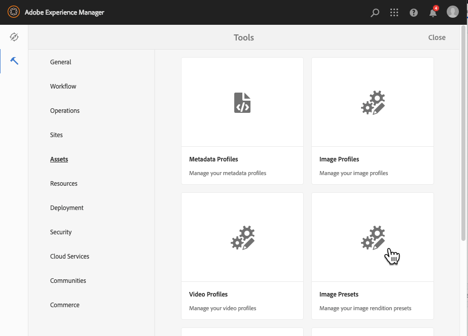

# Administrar ajustes preestablecidos de imagen de Dynamic Media{#managing-image-presets}

Los ajustes preestablecidos de imagen permiten a Adobe Experience Manager Assets entregar dinámicamente imágenes en diferentes tamaños, en diferentes formatos o con otras propiedades de imagen que se generan dinámicamente. Cada ajuste preestablecido de imagen representa una colección predefinida de comandos de tamaño y formato para mostrar imágenes. Al crear un ajuste preestablecido de imagen, elige un tamaño para la entrega de imágenes. También puede elegir comandos de formato para optimizar el aspecto de la imagen cuando se envíe la imagen para su visualización.

Los administradores pueden crear ajustes preestablecidos para exportar recursos. Los usuarios pueden elegir un ajuste preestablecido al exportar imágenes, que también redistribuye las imágenes según las especificaciones del administrador.

También puede crear ajustes preestablecidos de imagen que respondan. Si aplica un ajuste preestablecido de imagen adaptable a los recursos, cambiarán según el dispositivo o el tamaño de pantalla en que se visualicen. Puede configurar los ajustes preestablecidos de imagen para que utilicen CMYK en el espacio de color, además del RGB o el gris.

En esta sección se describe cómo crear, modificar y administrar ajustes preestablecidos de imagen. Puede aplicar un ajuste preestablecido de imagen a una imagen cada vez que la previsualice. Consulte [Aplicar ajustes preestablecidos de imagen](/help/assets/image-presets.md).

>[!NOTE]
>
>Las imágenes inteligentes funcionan con los ajustes preestablecidos de imagen existentes y utilizan inteligencia en el último milisegundo de entrega para reducir aún más el tamaño del archivo de imagen en función de la velocidad de conexión del explorador o de la red. Consulte [Imágenes inteligentes](/help/assets/imaging-faq.md) para obtener más información.

## Explicación de los ajustes preestablecidos de imagen Dynamic Media {#understanding-image-presets}

Al igual que una macro, un ajuste preestablecido de imagen es una colección predefinida de comandos de tamaño y formato guardados con un nombre. Para comprender cómo funcionan los ajustes preestablecidos de imagen, supongamos que el sitio web requiere que cada imagen de producto aparezca en diferentes tamaños, formatos y tasas de compresión para el escritorio y la entrega móvil.

>[!NOTE]
>
>En el modo Dynamic Media - Scene7, los ajustes preestablecidos de imagen solo son compatibles con los recursos de imagen.

Puede crear dos ajustes preestablecidos de imagen: uno con 500 x 500 píxeles para la versión de escritorio y otro con 150 x 150 píxeles para la versión móvil. Puede crear dos ajustes preestablecidos de imagen, uno denominado `Enlarge` para mostrar imágenes a 500x500 píxeles y otro denominado `Thumbnail` para mostrar imágenes a 150 x 150 píxeles. Para entregar imágenes con los tamaños `Enlarge` y `Thumbnail`, el Experience Manager busca la definición de los ajustes preestablecidos Ampliar imagen y Miniatura de imagen. A continuación, el Experience Manager genera dinámicamente una imagen con el tamaño y las especificaciones de formato de cada ajuste preestablecido de imagen.

Las imágenes de tamaño reducido cuando se envían de forma dinámica pueden perder nitidez y detalle. Por este motivo, cada ajuste preestablecido de imagen contiene controles de formato para optimizar una imagen cuando se entrega a un tamaño determinado. Estos controles garantizan que las imágenes sean nítidas y claras cuando se envíen al sitio web o a la aplicación.

Los administradores pueden crear ajustes preestablecidos de imagen. Para crear un ajuste preestablecido de imagen, puede empezar desde cero o puede empezar desde uno existente y guardarlo con un nuevo nombre.

## Administrar ajustes preestablecidos de imagen de Dynamic Media {#managing-image-presets-1}

Para administrar los ajustes preestablecidos de imagen en Experience Manager, toque o haga clic en el logotipo del Experience Manager para acceder a la consola de navegación global, toque o haga clic en el icono Herramientas y vaya a **[!UICONTROL Assets > Ajustes preestablecidos de imagen]**.



>[!NOTE]
>
>Todos los ajustes preestablecidos de imagen que cree también están disponibles como representaciones dinámicas al previsualizar o enviar recursos.
>
>En *Dynamic Media - modo Scene7*, no necesita *publicar ajustes preestablecidos de imagen*, ya que los ajustes preestablecidos de imagen se publican automáticamente.
>
>En *Dynamic Media - Modo híbrido*, debe publicar manualmente los ajustes preestablecidos de imagen.
>
>Consulte [Publicar ajustes preestablecidos de imagen](#publishing-image-presets).

>[!NOTE]
>
>El sistema muestra varias representaciones cuando selecciona **[!UICONTROL Representaciones]** en la vista de detalles de un recurso. Puede aumentar o disminuir el número de ajustes preestablecidos de imagen que se muestran. Ver [Aumento del número de ajustes preestablecidos de imagen que se muestran](#increasing-or-decreasing-the-number-of-image-presets-that-display).

### Recortes inteligentes, formatos de archivo Adobe Illustrator (AI), Postscript (EPS) y PDF {#adobe-illustrator-ai-postscript-eps-and-pdf-file-formats}

>[!NOTE]
>
>Este tema solo se aplica al modo híbrido de Dynamic Media.

Si tiene intención de admitir la ingesta de archivos AI, EPS y PDF para poder generar representaciones dinámicas de estos formatos de archivo, revise la siguiente información antes de crear ajustes preestablecidos de imagen.

El formato de archivo de Adobe Illustrator es una variante de PDF. Las principales diferencias, en el contexto de Experience Manager Assets, son las siguientes:

* Los documentos de Adobe Illustrator constan de una sola página con varias capas. Cada capa se extrae como un subrecurso PNG en el recurso principal de Illustrator.
* Los documentos del PDF constan de una o más páginas. Cada página se extrae como un subactivo de PDF de página única en el documento principal de PDF de varias páginas.

El componente `Create Sub Asset process` crea los subrecursos dentro del flujo de trabajo general `DAM Update Asset`. Para ver este componente de proceso en el flujo de trabajo, seleccione **[!UICONTROL Herramientas]** > **[!UICONTROL Flujo de trabajo]** > **[!UICONTROL Modelos]** > **[!UICONTROL Recurso de actualización DAM]** > **[!UICONTROL Editar]**.

Ver también [Visualización de páginas de un archivo de varias páginas](/help/assets/managing-linked-subassets.md#view-pages-of-a-multi-page-file).

Puede ver los subrecursos o las páginas al abrir el recurso, seleccionar el menú Contenido y seleccionar **[!UICONTROL Subrecursos]** o **[!UICONTROL Páginas]**. Los subactivos son activos reales. Es decir, el componente de flujo de trabajo `Create Sub Asset` extrae las páginas del PDF. Luego se almacenan como `page1.pdf`, `page2.pdf`, etc., debajo del recurso principal. Una vez almacenados, el flujo de trabajo `DAM Update Asset` los procesará.

Para utilizar Dynamic Media para previsualizar y generar representaciones dinámicas para archivos AI, EPS o de PDF, se requieren los siguientes pasos de procesamiento:

1. En el flujo de trabajo `DAM Update Asset`, el componente de proceso `Rasterize PDF/AI Image Preview Rendition` rasteriza la primera página del recurso original (con la resolución configurada) en una representación `cqdam.preview.png`.

1. A continuación, el componente de proceso `Dynamic Media Process Image Assets` del flujo de trabajo optimiza la representación `cqdam.preview.png` en un PTIFF.

>[!NOTE]
>
>En el flujo de trabajo [!UICONTROL DAM Update Asset], el paso **[!UICONTROL miniaturas de EPS]** genera miniaturas para los archivos de EPS.

#### Propiedades de metadatos de recursos de PDF/AI/EPS {#pdf-ai-eps-asset-metadata-properties}

| **Propiedad de metadatos** | **Descripción** |
|---|---|
| `dam:Physicalwidthininches` | Ancho del documento en pulgadas. |
| `dam:Physicalheightininches` | Altura del documento en pulgadas. |

Puede acceder a `Rasterize PDF/AI Image Preview Rendition` opciones de componentes de proceso a través del flujo de trabajo `DAM Update Asset`.

En la esquina superior izquierda, seleccione Adobe Experience Manager y vaya a **[!UICONTROL Herramientas]** > **[!UICONTROL Flujo de trabajo]** > **[!UICONTROL Modelos]**. En la página Modelos de flujo de trabajo, seleccione **[!UICONTROL Recurso de actualización DAM]** y, en la barra de herramientas, seleccione **[!UICONTROL Editar]**. En la página de flujo de trabajo [!UICONTROL DAM Update Asset], haga doble clic en el componente de proceso `Rasterize PDF/AI Image Preview Rendition` para abrir el cuadro de diálogo Propiedades del paso.

#### Rasterizar PDF/AI a las opciones de representación de previsualización de imagen {#rasterize-pdf-ai-image-preview-rendition-options}


Argumentos para rasterizar el PDF o el flujo de trabajo de IA

<table>
 <tbody>
  <tr>
   <td><strong>Argumento del proceso</strong></td>
   <td><strong>Configuración predeterminada</strong></td>
   <td><strong>Descripción</strong></td>
  </tr>
  <tr>
   <td>Tipos MIME</td>
   <td><p>application/pdf</p> <p>application/postscript</p> <p>application/illustrator<br /> </p> </td>
   <td>Lista de tipos MIME de documento que se consideran documentos de PDF o Illustrator.<br /> </td>
  </tr>
  <tr>
   <td>Anchura máxima</td>
   <td>2048</td>
   <td>Anchura máxima de la representación de vista previa generada, en píxeles.<br /> </td>
  </tr>
  <tr>
   <td>Altura máxima</td>
   <td>2048</td>
   <td>Altura máxima de la representación de vista previa generada, en píxeles.<br /> </td>
  </tr>
  <tr>
   <td>Resolución</td>
   <td>72</td>
   <td>Resolución para rasterizar la primera página, en ppp (píxeles por pulgada).</td>
  </tr>
 </tbody>
</table>

Con los argumentos de proceso predeterminados, la primera página de un documento de PDF/IA se rasteriza a 72 ppp y el tamaño de la imagen de vista previa generada es de 2048 x 2048 píxeles. Para una implementación típica, es posible que desee aumentar la resolución a un mínimo de 150 ppp o más. Por ejemplo, un documento de tamaño carta de EE. UU. a 300 ppp requiere una anchura y altura máximas de 2550 x 3300 píxeles, respectivamente.

La anchura máxima y la altura máxima limitan la resolución a la que se va a rasterizar. Por ejemplo, si los máximos no cambian y la resolución se establece en 300 ppp, un documento de carta de EE. UU. se rasteriza a 186 ppp. Es decir, el documento tiene 1581 x 2046 píxeles.

El componente de proceso `Rasterize PDF/AI Image Preview Rendition` tiene un máximo definido para garantizar que no cree imágenes demasiado grandes en la memoria. Estas imágenes de gran tamaño pueden desbordarse de la memoria proporcionada a la máquina virtual JVM (Java™). Se debe tener cuidado de proporcionar a JVM suficiente memoria para administrar el número configurado de flujos de trabajo paralelos, cada uno con el potencial de crear una imagen en el tamaño máximo configurado.

### Formato de archivo InDesign (INDD) {#indesign-indd-file-format}

Si tiene intención de admitir la ingesta de archivos INDD para que pueda generar una representación dinámica de este formato de archivo, puede que desee revisar la siguiente información antes de crear ajustes preestablecidos de imagen.

En el caso de los archivos de InDesign, los subrecursos se extraen únicamente si el Adobe InDesign Server está integrado con el Experience Manager. Los recursos a los que se hace referencia están vinculados según sus metadatos. El InDesign Server no es necesario para la vinculación. Sin embargo, los recursos a los que se hace referencia deben estar presentes en el Experience Manager antes de que se procesen los archivos de InDesign para que se creen los vínculos entre los archivos de InDesign y los recursos a los que se hace referencia.

Ver [Integración de Experience Manager Assets con el InDesign Server](/help/assets/indesign.md).

El componente de proceso Extracción de medios del flujo de trabajo `DAM Update Asset` ejecuta varios scripts extendidos preconfigurados para procesar archivos de InDesign.


Rutas de ExtendScript en los argumentos del componente de proceso de extracción de medios en el flujo de trabajo [!UICONTROL DAM Update Asset].

La integración con Dynamic Media utiliza los siguientes scripts:

<table>
 <tbody>
  <tr>
   <td><strong>Nombre de ExtendScript</strong></td>
   <td><strong>Predeterminado</strong></td>
   <td><strong>Descripción</strong></td>
  </tr>
  <tr>
   <td>ThumbnailExport.jsx</td>
   <td>Sí</td>
   <td>Genera una representación de <code>thumbnail.jpg</code> de 300 ppp que está optimizada y convertida en una representación PTIFF por el componente de proceso <code>Dynamic Media Process Image Assets</code>.<br /> </td>
  </tr>
  <tr>
   <td>JPEGPagesExport.jsx</td>
   <td>Sí</td>
   <td>Genera un subactivo de JPEG de 300 PPP para cada página. El subactivo JPEG es un activo real almacenado bajo el activo InDesign. También se ha optimizado y convertido en un PTIFF mediante el flujo de trabajo <code>DAM Update Asset</code>.<br /> </td>
  </tr>
  <tr>
   <td>PDFPagesExport.jsx</td>
   <td>No</td>
   <td>Genera un subactivo de PDF para cada página. El subactivo PDF se procesa como se describió anteriormente. Dado que el PDF contiene solo una página, no se generan subrecursos.<br /> </td>
  </tr>
 </tbody>
</table>

## Configuración del tamaño de miniatura de imagen {#configuring-image-thumbnail-size}

Puede configurar el tamaño de las miniaturas configurando estos valores en el flujo de trabajo **[!UICONTROL Recurso de actualización DAM]**. En el flujo de trabajo hay dos pasos en los que puede configurar el tamaño de la miniatura de los recursos de imagen. Aunque (**[!UICONTROL Dynamic Media Process Image Assets]**) se usa para recursos de imagen dinámica y (**[!UICONTROL Miniaturas de procesos]**) es para la generación de miniaturas estáticas, o cuando el resto de procesos no pueden generar miniaturas, *ambos* deben tener la misma configuración.

Con el paso **[!UICONTROL Recursos de imagen de proceso de Dynamic Media]**, el servidor de imágenes genera miniaturas y esta configuración es independiente de la configuración aplicada al paso **[!UICONTROL Procesar miniaturas]**. La generación de miniaturas a través del paso **[!UICONTROL Miniaturas de proceso]** es la forma más lenta y con mayor consumo de memoria para crear miniaturas.

El tamaño de la miniatura se define en el formato siguiente: **`width:height:center`**, por ejemplo, `80:80:false`. La anchura y la altura determinan el tamaño en píxeles de la miniatura. El valor central es false o true y, si se establece en true, indica que la imagen en miniatura tiene exactamente el tamaño indicado en la configuración. Si la imagen redimensionada es más pequeña, se centra dentro de la miniatura.

>[!NOTE]
>
>* El tamaño de las miniaturas de los archivos EPS se configura en el paso **[!UICONTROL miniaturas de EPS]**, en la pestaña **[!UICONTROL Argumentos]**, en Miniaturas.
>
>* Los tamaños de las miniaturas de los vídeos se configuran en el paso **[!UICONTROL Miniaturas FFmpeg]**, en la pestaña **[!UICONTROL Proceso]**, en **[!UICONTROL Argumentos]**.
>

**Para configurar el tamaño de la miniatura de la imagen:**

1. Seleccione **[!UICONTROL Herramientas]** > **[!UICONTROL Flujo de trabajo]** > **[!UICONTROL Modelos]** > **[!UICONTROL Recurso de actualización DAM]** > **[!UICONTROL Editar]**.
1. Seleccione el paso **[!UICONTROL Dynamic Media Process Image Assets]** y haga clic en la pestaña **[!UICONTROL Miniaturas]**. Cambie el tamaño de la miniatura, según sea necesario, y luego seleccione **[!UICONTROL Aceptar]**.

   

1. Seleccione el paso **[!UICONTROL Procesar miniaturas]** y, a continuación, seleccione la pestaña **[!UICONTROL Miniaturas]**. Cambie el tamaño de la miniatura, según sea necesario, y luego seleccione **[!UICONTROL Aceptar]**.

   >[!NOTE]
   >
   >Los valores del argumento de miniaturas del paso **[!UICONTROL Miniaturas de proceso]** deben coincidir con el argumento de miniaturas del paso **[!UICONTROL Recursos de imagen de proceso de Dynamic Media]**.

1. Seleccione **[!UICONTROL Guardar]** para guardar los cambios en el flujo de trabajo.

### Aumentar o reducir el número de ajustes preestablecidos de imagen de Dynamic Media que se muestran {#increasing-or-decreasing-the-number-of-image-presets-that-display}

Los ajustes preestablecidos de imagen que cree estarán disponibles como representaciones dinámicas al obtener una vista previa de los recursos. El Experience Manager muestra varias representaciones dinámicas al ver un recurso desde **[!UICONTROL Vista de detalles > Representaciones]**. Puede aumentar o disminuir el límite de representaciones que se muestran.

**Aumente o reduzca el número de ajustes preestablecidos de imagen de Dynamic Media mostrados:**

1. Vaya al CRXDE Lite ([https://localhost:4502/crx/de](https://localhost:4502/crx/de)).
1. Vaya al nodo de lista de ajustes preestablecidos de imagen en `/libs/dam/gui/coral/content/commons/sidepanels/imagepresetsdetail/imgagepresetslist`

   

1. En la propiedad **[!UICONTROL limit]**, cambie el **[!UICONTROL valor]**, que se establece en 15 de forma predeterminada, por el número deseado.
1. Vaya al origen de datos del ajuste preestablecido de imagen en `/libs/dam/gui/coral/content/commons/sidepanels/imagepresetsdetail/imgagepresetslist/datasource`

   

1. En la propiedad limit, cambie el número al deseado, por ejemplo, `{empty requestPathInfo.selectors[1] ? "20" : requestPathInfo.selectors[1]}`
1. Seleccione **[!UICONTROL Guardar todo]**.

## Creación de un ajuste preestablecido de imagen de Dynamic Media {#creating-image-presets}

La creación de un ajuste preestablecido de imagen de Dynamic Media permite aplicar esa configuración a cualquier imagen al previsualizar o publicar.

>[!NOTE]
>
>Si utiliza Internet Explorer 9, la creación de un ajuste preestablecido no aparece en la lista de ajustes preestablecidos inmediatamente después de guardarlo. Para solucionar este problema, deshabilite la caché para IE9.

Si tiene intención de admitir la ingesta de archivos AI, PDF y EPS para poder generar una representación dinámica de estos formatos de archivo, revise la siguiente información antes de crear ajustes preestablecidos de imagen.
Ver [formatos de archivo Adobe Illustrator (AI), Postscript (EPS) y PDF](#adobe-illustrator-ai-postscript-eps-and-pdf-file-formats).

Si tiene intención de admitir la ingesta de archivos INDD para que pueda generar una representación dinámica de este formato de archivo, puede que desee revisar la siguiente información antes de crear ajustes preestablecidos de imagen.
Ver [formato de archivo de InDesign (INDD)](#indesign-indd-file-format).

>[!NOTE]
>
>Para crear ajustes preestablecidos de imagen de Dynamic Media, debe tener privilegios de administrador como Experience Manager o administrador Admin Console.

**Para crear un ajuste preestablecido de imagen de Dynamic Media:**

1. En Experience Manager, seleccione el logotipo del Experience Manager para acceder a la consola de navegación global y, a continuación, seleccione **[!UICONTROL Herramientas]** > **[!UICONTROL Assets]** > **[!UICONTROL Ajustes preestablecidos de imagen]**.
1. Haga clic en **[!UICONTROL Crear]**. Se abre la ventana **[!UICONTROL Editar ajuste preestablecido de imagen]**.

   

   >[!NOTE]
   >
   >Para que este ajuste preestablecido de imagen sea interactivo, borre los valores de los campos de **[!UICONTROL anchura]** y **[!UICONTROL altura]** y déjelos en blanco.

1. Introduzca valores en las pestañas **[!UICONTROL Básico]** y **[!UICONTROL Avanzadas]** según corresponda, incluido un nombre. Las opciones se describen en [Opciones de ajustes preestablecidos de imagen](#image-preset-options). Los ajustes preestablecidos aparecen en el panel izquierdo y se pueden utilizar sobre la marcha con otros recursos.

   

1. Haga clic en **[!UICONTROL Guardar]**.

## Creación de un ajuste preestablecido de imagen interactivo {#creating-a-responsive-image-preset}

Para crear un ajuste preestablecido de imagen adaptable, realice los pasos que se describen en [Creación de ajustes preestablecidos de imagen](#creating-image-presets). Cuando introduzca la altura y anchura en la ventana **[!UICONTROL Editar ajuste preestablecido de imagen]**, borre los valores y déjelos en blanco.

Si los deja en blanco, el Experience Manager verá que este ajuste preestablecido de imagen responde. Puede ajustar los demás valores según corresponda.


>[!NOTE]
>
>Para ver los botones **[!UICONTROL URL]** y **[!UICONTROL RESS]** al aplicar un ajuste preestablecido de imagen a un recurso, este debe publicarse.
>
>
>
>En el modo Dynamic Media - Scene7, los ajustes preestablecidos de imagen y los recursos de imagen se publican automáticamente.
>
>En el modo Híbrido de Dynamic Media, debe publicar manualmente los ajustes preestablecidos y los recursos de imagen.

### Opciones de ajustes preestablecidos de imagen {#image-preset-options}

Al crear o editar ajustes preestablecidos de imagen, tiene las opciones descritas en esta sección. Además, Adobe recomienda estas opciones de &quot;práctica recomendada&quot; para comenzar:

* **[!UICONTROL Formato]** (ficha **[!UICONTROL Básico]**): seleccione **[!UICONTROL JPEG]** u otro formato que cumpla sus requisitos. Todos los navegadores web admiten el formato de imagen JPEG; ofrece un buen equilibrio entre los tamaños de archivos pequeños y la calidad de imagen. Sin embargo, las imágenes en formato JPEG utilizan un esquema de compresión con pérdidas que puede introducir artefactos de imagen no deseados si el ajuste de compresión es demasiado bajo. Por este motivo, Adobe recomienda establecer la calidad de compresión en 75. Este ajuste ofrece un buen equilibrio entre la calidad de imagen y el tamaño de archivo pequeño.

* **[!UICONTROL Activar enfoque simple]**: No seleccione **[!UICONTROL Activar enfoque simple]** (este filtro de enfoque ofrece menos control que la configuración de máscara de enfoque).

* **[!UICONTROL Enfoque: Modo de remuestreo]** - Seleccione **[!UICONTROL Enfoque2]**.

#### Opciones de pestaña básicas {#basic-tab-options}

<table>
 <tbody>
  <tr>
   <td><strong>Campo</strong></td>
   <td><strong>Descripción</strong></td>
  </tr>
  <tr>
   <td><strong>Nombre</strong></td>
   <td>Introduzca un nombre descriptivo sin espacios en blanco. Incluya la especificación de tamaño de imagen en el nombre para que ayude a los usuarios a identificar este ajuste preestablecido de imagen.</td>
  </tr>
  <tr>
   <td><strong>Anchura y altura</strong></td>
   <td>Especifique el tamaño en píxeles de la imagen resultante. La anchura y la altura deben ser superiores a 0 píxeles. Si alguno de los valores es 0, no se crea ningún ajuste preestablecido. Si ambos valores están en blanco, se crea un ajuste preestablecido de imagen interactivo.</td>
  </tr>
  <tr>
   <td><strong>Formato</strong></td>
   <td><p>Elija un formato en el menú.</p> <p>Elegir <strong>JPEG</strong> ofrece las siguientes opciones adicionales:</p>
    <ul>
     <li><strong>Calidad</strong>: controla el nivel de compresión del JPEG. Esta configuración afecta tanto al tamaño del archivo como a la calidad de la imagen. La escala de calidad JPEG es 1-100. La escala es visible cuando arrastra el control deslizante.</li>
     <li>JPG <strong>Habilitar la disminución de resolución de crominancia en la frecuencia de la pantalla</strong>: dado que el ojo es menos sensible a la información de color de alta frecuencia que la luminancia de alta frecuencia, las imágenes en JPEG dividen la información de la imagen en componentes de luminancia y color. Cuando se comprime una imagen del JPEG, el componente de luminancia se deja a resolución completa, mientras que los componentes de color se reducen de resolución promediando grupos de píxeles juntos. La disminución de la resolución reduce el volumen de datos en la mitad o en un tercio, sin afectar casi nada a la calidad percibida. La disminución de resolución no es aplicable a imágenes en escala de grises. Esta técnica reduce la cantidad de compresión útil para imágenes con alto contraste (por ejemplo, imágenes con texto superpuesto).</li>
    </ul>
    <div>
      Elección
     <strong>GIF</strong> o
     El GIF <strong>con alfa</strong> proporciona estos elementos adicionales
     <strong>Cuantificación de color GIF</strong> opciones:
    </div>
    <ul>
     <li><strong>Escriba </strong>- Seleccione <strong>Adaptable</strong> (predeterminado), <strong>Web</strong> o <strong>Macintosh</strong>. Si selecciona <strong>GIF con Alpha</strong>, la opción Macintosh no estará disponible.</li>
     <li><strong>Tramado</strong> - Seleccionar <strong>Difuso</strong> o <strong>Desactivado</strong>.</li>
     <li><strong>Número de colores </strong>- Escriba un número entre 2 y 256.</li>
     <li><strong>Lista de colores</strong>: escriba una lista separada por comas. Por ejemplo, para blanco, gris y negro, escriba <code>000000,888888,ffffff</code>.</li>
    </ul>
    <div>
      Elección
     <strong>PDF</strong>,
     <strong>TIFF</strong>, o
     El TIFF <strong>con alfa</strong> proporciona esta opción adicional:
    </div>
    <ul>
     <li><strong>Compresión</strong>: seleccione un algoritmo de compresión. Las opciones de algoritmo para PDF son <strong>None</strong>, <strong>Zip</strong> y <strong>Jpeg</strong>; para TIFF las opciones son <strong>None</strong>, <strong>LZW</strong>, <strong>Jpeg</strong> y <strong>Zip</strong>; y para TIFF con Alpha son <strong>None</strong>, <strong>LZW</strong> y <strong>Zip</strong>.</li>
    </ul> <p>Elegir <strong>PNG</strong>, <strong>PNG con Alpha,</strong> o <strong>EPS</strong> no proporciona opciones adicionales.</p> </td>
  </tr>
  <tr>
   <td><strong>Enfoque</strong></td>
   <td>Seleccione la opción <strong>Habilitar enfoque simple</strong> para aplicar un filtro de enfoque básico a la imagen después de aplicar todo el escalado. El enfoque puede ayudar a compensar el desenfoque que puede producirse cuando se muestra una imagen en un tamaño diferente. </td>
  </tr>
 </tbody>
</table>

#### Opciones de pestaña avanzadas {#advanced-tab-options}

<table>
 <tbody>
  <tr>
   <td><strong>Campo</strong></td>
   <td><strong>Descripción</strong></td>
  </tr>
  <tr>
   <td><strong>Espacio de color</strong></td>
   <td>Seleccione <strong>RGB, CMYK,</strong> o <strong>Escala de grises</strong> para el espacio de color.</td>
  </tr>
  <tr>
   <td><strong>Perfil de color</strong></td>
   <td>Seleccione el perfil del espacio de color de salida al que se debe convertir el recurso si es diferente del perfil de trabajo.</td>
  </tr>
  <tr>
   <td><strong>Procesar intención</strong></td>
   <td>Puede anular la interpretación predeterminada. Las intenciones de representación determinan lo que sucede con los colores que no se pueden reproducir en el perfil de color de destino (fuera de la gama). La Interpretación se ignora si no es compatible con el perfil ICC.
    <ul>
     <li>Seleccione <strong>Perceptual</strong> para comprimir la gama total de un espacio de color en otro espacio de color cuando uno o más colores de la imagen original estén fuera de la gama del espacio de color de destino.</li>
     <li>Seleccione <strong>Colorimétrico relativo</strong> cuando un color del espacio de color actual esté fuera de la gama en el espacio de color de destino. Y desea asignarlo al color más cercano posible dentro de la gama del espacio de color de destino sin afectar a ningún otro color. </li>
     <li>Seleccione <strong>Saturación</strong> si desea reproducir la saturación de color de la imagen original al convertirla en el espacio de color de destino. </li>
     <li>Seleccione <strong>Colorimétrico absoluto</strong> para que coincida exactamente con los colores sin ningún ajuste para el punto blanco o el punto negro que alteraría el brillo de la imagen.</li>
    </ul> </td>
  </tr>
  <tr>
   <td><strong>Compensación de punto negro</strong></td>
   <td>Seleccione esta opción si el perfil de salida admite esta función. La compensación de punto negro se ignora si no es compatible con el perfil ICC especificado.</td>
  </tr>
  <tr>
   <td><strong>Distorsión</strong></td>
   <td>Seleccione esta opción para evitar o reducir los defectos de las bandas de colores. </td>
  </tr>
  <tr>
   <td><strong>Tipo de enfoque</strong></td>
   <td><p>Seleccione <strong>Ninguno</strong>, <strong>Enfoque</strong> o <strong>Máscara de enfoque</strong>. </p>
    <ul>
     <li>Seleccione <strong>Ninguno</strong> si desea deshabilitar el enfoque.</li>
     <li>Seleccione <strong>Enfoque</strong> si desea aplicar un filtro de enfoque básico a la imagen después de aplicar todo el escalado. El enfoque puede ayudar a compensar el desenfoque que puede producirse cuando se muestra una imagen en un tamaño diferente. </li>
     <li>Seleccione <strong> Máscara de enfoque</strong> si desea ajustar un efecto de filtro de enfoque en la imagen final con disminución de resolución. Puede controlar la intensidad del efecto, el radio del efecto (medido en píxeles) y un umbral de contraste que se ignora. Este efecto utiliza las mismas opciones que el filtro "Máscara de enfoque" de Photoshop.</li>
    </ul> <p>En <strong>Máscara de enfoque</strong>, tiene las siguientes opciones:</p>
    <ul>
     <li><strong>Cantidad</strong>: controla la cantidad de contraste aplicado a los píxeles del borde. El valor predeterminado del número real es 1,0. Para imágenes de alta resolución, puede aumentarla hasta 5,0. Considere la cantidad como una medida de la intensidad del filtro.</li>
     <li><strong>Radio</strong>: Determina el número de píxeles adyacentes a los píxeles de borde que afectarán al enfoque. Para imágenes de alta resolución, introduzca un número real entre 1 y 2. Un valor bajo enfoca únicamente los píxeles de borde; un valor alto enfoca una banda más ancha de píxeles. El valor correcto depende del tamaño de la imagen.</li>
     <li><strong>Umbral</strong>: determina el intervalo de contraste que se omitirá cuando se aplique el filtro de máscara de enfoque. En otras palabras, esta opción determina la diferencia que debe existir entre los píxeles enfocados y el área adyacente para que se consideren píxeles de borde y se enfoquen. Para evitar la introducción de ruido, experimente con valores enteros entre 2 y 20. </li>
     <li><strong>Aplicar a</strong>: determina si el enfoque se aplica a cada color o brillo.</li>
    </ul>
    <div>
      El enfoque se describe en
     <a href="https://experienceleague.adobe.com/docs/experience-manager-65/assets/sharpening_images.pdf?lang=es">Imágenes de enfoque</a>.
    </div> </td>
  </tr>
  <tr>
   <td><strong>Modo de remuestreo</strong></td>
   <td>Seleccione una opción <strong>Modo de remuestreo</strong>. Estas opciones enfocan la imagen cuando se reduce su resolución:
    <ul>
     <li><strong>Bilinear</strong>: el método de remuestreo más rápido. Pueden verse algunos defectos de solapamiento.</li>
     <li><strong>Bicúbico</strong>: aumenta el uso de la CPU, pero genera imágenes más nítidas con defectos de solapamiento menos evidentes.</li>
     <li><strong>Enfocado2</strong> - Puede producir resultados ligeramente más enfocados que los Bicúbicos, pero con un costo de CPU aún mayor.</li>
     <li><strong>Bi-Sharp</strong>: selecciona el remuestreador predeterminado de Photoshop para reducir el tamaño de imagen, lo que se denomina <strong>enfoque bicúbico</strong> en Adobe Photoshop.</li>
     <li><strong>Cada color</strong> y <strong>brillo</strong> - cada método puede basarse en el color o el brillo. De manera predeterminada, <strong>Cada color</strong> está seleccionado.</li>
    </ul> </td>
  </tr>
  <tr>
   <td><strong>Resolución de impresión</strong></td>
   <td>Seleccione una resolución para imprimir esta imagen; el valor predeterminado es 72 píxeles.</td>
  </tr>
  <tr>
   <td><strong>Modificador de imagen</strong></td>
   <td><p>Más allá de la configuración de imagen común disponible en la interfaz de usuario, Dynamic Media admite numerosas modificaciones de imagen avanzadas que se pueden especificar en el campo <strong>Modificadores de imagen</strong>. Estos parámetros se definen en la <a href="https://experienceleague.adobe.com/docs/dynamic-media-developer-resources/image-serving-api/image-serving-api/http-protocol-reference/command-reference/c-command-reference.html?lang=es#image-serving-api">referencia de comando del protocolo Image Server</a>.</p> <p>Importante: No se admiten las siguientes funciones enumeradas en la API:</p>
    <ul>
     <li>Comandos básicos de creación de plantillas y procesamiento de texto: <code>text= textAngle= textAttr= textFlowPath= textFlowXPath= textPath=</code> y <code>textPs=</code></li>
     <li>Comandos de localización: <code>locale=</code> y <code>req=xlate</code></li>
     <li><code>req=set</code> no está disponible para uso general.</li>
     <li><code>req=mbrset</code></li>
     <li><code>req=saveToFile</code></li>
     <li><code>req=targets</code></li>
     <li><code>template=</code></li>
     <li>Servicios no principales de Dynamic Media: SVG, procesamiento de imágenes y web para impresión</li>
    </ul> </td>
  </tr>
 </tbody>
</table>

## Definición de opciones de ajustes preestablecidos de imagen con modificadores de imagen {#defining-image-preset-options-with-image-modifiers}

Además de las opciones disponibles en las pestañas Básico y Avanzado, puede definir modificadores de imagen para que tenga más opciones al definir ajustes preestablecidos de imagen. El procesamiento de imágenes se basa en la API de procesamiento de imágenes que se define en detalle en la [Referencia de protocolo HTTP](https://experienceleague.adobe.com/docs/dynamic-media-developer-resources/image-serving-api/image-serving-api/http-protocol-reference/command-reference/c-command-reference.html?lang=es#image-serving-api).

A continuación se muestran algunos ejemplos básicos de lo que se puede hacer con los modificadores de imagen.

>[!NOTE]
>
>Algunos modificadores de imagen [no se pueden usar en el Experience Manager](#advanced-tab-options).

* [op_invert](https://experienceleague.adobe.com/docs/dynamic-media-developer-resources/image-serving-api/image-serving-api/http-protocol-reference/command-reference/r-op-invert.html?lang=es#image-serving-api): invierte cada componente de color para obtener un efecto de imagen negativo.

  ```xml
  &op_invert=1
  ```

  

* [op_blur](https://experienceleague.adobe.com/docs/dynamic-media-developer-resources/image-serving-api/image-serving-api/http-protocol-reference/command-reference/r-op-blur.html?lang=es#image-serving-api): aplica un filtro de desenfoque a la imagen.

  ```xml
  &op_blur=7
  ```

  

* Comandos combinados - op_blur y op-invert

  ```xml
  &op_invert=1&op_blur=7
  ```

  

* [op_bright](https://experienceleague.adobe.com/docs/dynamic-media-developer-resources/image-serving-api/image-serving-api/http-protocol-reference/command-reference/r-op-brightness.html?lang=es#image-serving-api): disminuye o aumenta el brillo.

  ```xml
  &op_brightness=58
  ```

  

* [opac](https://experienceleague.adobe.com/docs/dynamic-media-developer-resources/image-serving-api/image-serving-api/http-protocol-reference/command-reference/r-opac.html?lang=es#image-serving-api): ajusta la opacidad de la imagen. Permite reducir la opacidad en primer plano.

  ```xml
  opac=29
  ```

  

## Edición de ajustes preestablecidos de imagen {#modifying-image-presets}

1. En Experience Manager, seleccione el logotipo del Experience Manager para acceder a la consola de navegación global y, a continuación, seleccione **[!UICONTROL Herramientas]** > **[!UICONTROL Assets]** > **[!UICONTROL Ajustes preestablecidos de imagen]**.

   

1. Seleccione un ajuste preestablecido y haga clic en **[!UICONTROL Editar]**. Se abre la ventana **[!UICONTROL Editar ajuste preestablecido de imagen]**.
1. Realice cambios y haga clic en **[!UICONTROL Guardar]** para guardar los cambios o en **[!UICONTROL Cancelar]** para cancelarlos.

## Publicar ajustes preestablecidos de imagen de Dynamic Media {#publishing-image-presets}

Si está ejecutando el modo Dynamic Media híbrido, debe publicar manualmente los ajustes preestablecidos de imagen.

(Si está ejecutando el modo Dynamic Media - Scene7, los ajustes preestablecidos de imagen se publican automáticamente; no necesita completar estos pasos).

**Para publicar ajustes preestablecidos de imagen en Dynamic Media, modo híbrido:**

1. En Experience Manager, haga clic en el logotipo del Experience Manager para acceder a la consola de navegación global, haga clic en el icono Herramientas y vaya a **[!UICONTROL Assets]** > **[!UICONTROL Ajustes preestablecidos de imagen]**.
1. Seleccione el ajuste preestablecido de imagen o varios ajustes preestablecidos de imagen de la lista de ajustes preestablecidos de imagen y haga clic en **[!UICONTROL Publish]**.
1. Una vez publicado el ajuste preestablecido de imagen, el estado cambia de sin publicar a publicado.

   

## Eliminando ajustes preestablecidos de imagen de Dynamic Media {#deleting-image-presets}

1. En Experience Manager, haga clic en el logotipo del Experience Manager para acceder a la consola de navegación global.
1. Seleccione el icono **[!UICONTROL Herramientas]** y luego vaya a **[!UICONTROL Assets]** > **[!UICONTROL Ajustes preestablecidos de imagen]**.
1. Seleccione un ajuste preestablecido y haga clic en **[!UICONTROL Eliminar]**. Dynamic Media confirma que desea eliminarlo. Seleccione **[!UICONTROL Eliminar]** para eliminar o seleccione **[!UICONTROL Cancelar]** para anular.
