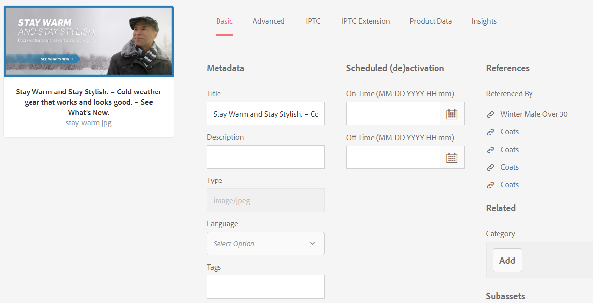
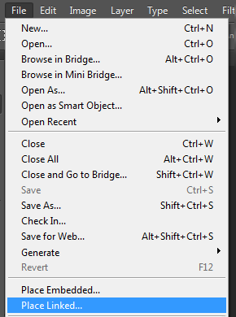

# Administrar recursos compuestos y de varias páginas {#managing-compound-assets}

[!DNL Adobe Experience Manager Assets] puede identificar si un archivo cargado contiene referencias a recursos que ya existen en el repositorio. Esta función solo está disponible para los formatos de archivo admitidos. Si el recurso cargado contiene referencias a [!DNL Experience Manager] los recursos, se crea un vínculo bidireccional entre los recursos cargados y los a los que se hace referencia.

Además de eliminar la redundancia, hacer referencia a los recursos en [!DNL Adobe Creative Cloud] las aplicaciones mejora la colaboración y aumenta la eficiencia y la productividad de los usuarios.

[!DNL Experience Manager Assets] admite referencias bidireccionales. Los recursos a los que se hace referencia se encuentran en la página de detalles del recurso del archivo cargado. Además, puede vista los archivos de referencia en la página de detalles del recurso del recurso al que se hace referencia.

Las referencias se resuelven en función de la ruta de acceso, el ID de documento y el ID de instancia de los recursos a los que se hace referencia.

## Añadir recursos digitales como referencias en [!DNL Adobe Illustrator] {#refai}

Puede hacer referencia a recursos digitales existentes desde dentro de un [!DNL Adobe Illustrator] archivo.

1. Con la aplicación [[!DNL Experience Manager] de](https://experienceleague.adobe.com/docs/experience-manager-desktop-app/using/using.html)escritorio, busque los recursos digitales en el sistema de archivos local. Navegue hasta la ubicación del sistema de archivos del recurso al que desee hacer referencia.
1. Arrastre el recurso desde la carpeta local hasta el [!DNL Illustrator] archivo.

1. Guarde el [!DNL Illustrator] archivo en la unidad montada o [cárguelo](/help/assets/manage-assets.md#uploading-assets) en el [!DNL Experience Manager] repositorio.

1. Una vez finalizado el flujo de trabajo, vaya a la página de detalles del recurso. Las referencias a recursos digitales existentes se enumeran en **[!UICONTROL Dependencias]** en la columna **[!UICONTROL Referencias]** .

   

1. Los recursos a los que se hace referencia y que aparecen en **[!UICONTROL Dependencias]** también pueden ser referenciados por otros archivos que no sean el actual. Para vista de una lista de archivos de referencia para un recurso, haga clic en el recurso en la sección **[!UICONTROL Dependencias]**.

   

1. Haga clic en Propiedades **[!UICONTROL de]** Vista en la barra de herramientas. En la página [!UICONTROL Propiedades] , la lista de archivos que hacen referencia al recurso actual aparece en la columna **[!UICONTROL Referencias]** de la ficha **[!UICONTROL Básico]** .

   

   *Figura: Referencias de recursos en detalles de recursos.*

## Añadir recursos digitales como referencias en [!DNL Adobe InDesign] {#add-aem-assets-as-references-in-adobe-indesign}

Para hacer referencia a recursos digitales desde dentro de un [!DNL InDesign] archivo, arrastre los recursos al [!DNL InDesign] archivo o exporte el [!DNL InDesign] archivo como archivo ZIP.

Los recursos a los que se hace referencia ya existen en [!DNL Experience Manager Assets]. Puede extraer subrecursos [configurando InDesign Server](indesign.md). Los recursos incrustados en un [!DNL InDesign] archivo se extraen como subrecursos.

>[!NOTE]
>
>Si el [!DNL InDesign Server] archivo se procesa como proxy, [!DNL InDesign] los archivos tienen su previsualización incrustada en sus metadatos de XMP. En este caso, la extracción de miniaturas no es obligatoria explícitamente. Sin embargo, si [!DNL InDesign Server] no se procesa como proxy, las miniaturas deben extraerse explícitamente para [!DNL InDesign] los archivos.

### Creación de referencias arrastrando recursos {#create-references-by-dragging-aem-assets}

Este procedimiento es similar a [agregar recursos digitales como referencias en Adobe Illustrator](#refai).

### Creación de referencias a recursos mediante la exportación de un archivo ZIP {#create-references-to-aem-assets-by-exporting-a-zip-file}

1. Siga los pasos que se describen en [Crear modelos](/help/sites-developing/workflows-models.md) de flujo de trabajo para crear un nuevo flujo de trabajo.
1. Utilice la función Empaquetar de [!DNL Adobe InDesign] para exportar el documento. [!DNL Adobe InDesign] Puede exportar un documento y los recursos vinculados como un paquete. En este caso, la carpeta exportada contiene una carpeta Links que contiene subrecursos en el [!DNL InDesign] archivo.
1. Cree un archivo ZIP y cárguelo en el [!DNL Experience Manager] repositorio.
1. Inicio del `Unarchiver` flujo de trabajo.
1. Cuando se completa el flujo de trabajo, se hace referencia automáticamente a las referencias de la carpeta Vínculos como subrecursos. Para realizar la vista de una lista de recursos referidos, navegue a la página de detalles del recurso del [!DNL InDesign] recurso y cierre el [raíl](/help/sites-authoring/basic-handling.md#rail-selector).

## Añadir recursos digitales como referencias en [!DNL Adobe Photoshop] {#refps}

1. Utilice [!DNL Experience Manager] la aplicación de escritorio para acceder a [!DNL Experience Manager Assets]. Descargue y muestre los recursos en el sistema de archivos local. Utilice la funcionalidad [!UICONTROL Colocar vinculado] en [!DNL Adobe Photoshop]. Consulte [Colocación de recursos en la aplicación](https://experienceleague.adobe.com/docs/experience-manager-desktop-app/using/using.html#place-assets-in-native-documents)de escritorio.

   

1. Guarde en el [!DNL Photoshop] archivo en la unidad montada o [cargue](/help/assets/manage-assets.md#uploading-assets) en el [!DNL Experience Manager] repositorio.
1. Una vez completado el flujo de trabajo, las referencias a los recursos existentes [!DNL Experience Manager] se muestran en la página de detalles del recurso.

   Para vista de los recursos a los que se hace referencia, cierre el [raíl](/help/sites-authoring/basic-handling.md#rail-selector) en la página de detalles del recurso.

1. Los recursos a los que se hace referencia también contienen la lista de los recursos desde los que se hace referencia. Para vista de una lista de recursos a los que se hace referencia, vaya a la página de detalles del recurso y cierre el [raíl](/help/sites-authoring/basic-handling.md#rail-selector).

>[!NOTE]
>
>También se puede hacer referencia a los recursos dentro de los recursos compuestos en función de su ID de Documento y su ID de instancia. Esta funcionalidad solo está disponible con [!DNL Adobe Illustrator] y [!DNL Adobe Photoshop] versiones. Para otros, la referencia se realiza en función de la ruta relativa de los recursos vinculados en el activo compuesto principal, como se hace en versiones anteriores de [!DNL Experience Manager].

## Creación de subrecursos {#generate-subassets}

Para los recursos admitidos con formatos de varias páginas: archivos PDF, archivos AI [!DNL Microsoft PowerPoint] y [!DNL Apple Keynote] archivos, y [!DNL Adobe InDesign] archivos — [!DNL Experience Manager] puede generar subrecursos que se correspondan con cada página individual del recurso original. Estos subrecursos están vinculados al recurso *principal* y facilitan la vista de varias páginas. Para todos los demás fines, los subactivos se tratan como activos normales en [!DNL Experience Manager].

La generación de subconjuntos está deshabilitada de forma predeterminada. Para habilitar la generación de subrecursos, siga estos pasos:

1. Inicie sesión [!DNL Experience Manager] como administrador. Acceda a **[!UICONTROL Herramientas]** > **[!UICONTROL Flujo de trabajo]** > **[!UICONTROL Modelos]**.
1. Seleccione **[!UICONTROL Flujo de trabajo de recursos]** de actualización de DAM y haga clic en **[!UICONTROL Editar]**.
1. Haga clic en **[!UICONTROL Alternar panel]** lateral y busque el paso **[!UICONTROL Crear subrecurso]** . Añada el paso al flujo de trabajo. Haga clic en **[!UICONTROL Sincronizar]**.

Para generar los subrecursos, realice una de las siguientes acciones:

* Nuevos recursos: El flujo de trabajo de recursos [!UICONTROL de actualización de] DAM se ejecuta en cualquier recurso nuevo que se cargue en [!DNL Experience Manager]. Los subrecursos se generan automáticamente para los nuevos recursos de varias páginas.
* Recursos existentes de varias páginas: Ejecute manualmente el flujo de trabajo de Recursos [!UICONTROL de actualización de] DAM siguiendo uno de los pasos siguientes:

   * Seleccione un recurso y haga clic en [!UICONTROL Línea de tiempo] para abrir el panel izquierdo. Como alternativa, utilice el método abreviado de teclado `alt + 3`. Haga clic en Flujo de trabajo [!UICONTROL de]Inicio, seleccione [!UICONTROL DAM Update Asset], haga clic en [!UICONTROL Inicio]y, a continuación, en [!UICONTROL Continuar].
   * Seleccione un recurso y haga clic en [!UICONTROL Crear] > [!UICONTROL Flujo de trabajo] en la barra de herramientas. En el cuadro de diálogo emergente, seleccione [!UICONTROL DAM Update Asset] workflow, haga clic en [!UICONTROL Inicio]y, a continuación, en [!UICONTROL Continuar].

Específicamente para documentos de Microsoft Word, ejecute el flujo de trabajo de Documentos **[!UICONTROL de Word de análisis de]** DAM. Genera un `cq:Page` componente a partir del contenido del documento de Microsoft Word. Se hace referencia a las imágenes extraídas del documento desde el `cq:Page` componente. Estas imágenes se extraen aunque la generación de subrecursos esté desactivada.

## View subassets {#viewing-subassets}

Los subrecursos solo se muestran si se generan y están disponibles para el recurso de varias páginas seleccionado. Para vista de los subrecursos generados, abra el recurso de varias páginas. En el área superior izquierda de la página, haga clic en  izquierdo y haga clic en **[!UICONTROL Subrecursos]** desde la lista. Al seleccionar **[!UICONTROL Subrecursos]** en la lista. Como alternativa, utilice el método abreviado de teclado `alt + 5`.

## Vista de páginas de un archivo de varias páginas {#view-pages-of-a-multi-page-file}

Puede realizar la vista de un archivo de varias páginas, como un archivo PDF, INDD, PPT, PPTX y AI, mediante la función Visor de páginas de [!DNL Experience Manager Assets]. Abra un recurso de varias páginas y haga clic en **[!UICONTROL Vista Páginas]** en la esquina superior izquierda de la página. El visor de páginas que se abre muestra las páginas del recurso y los controles para examinar y aplicar zoom en cada página.

Por ejemplo, [!DNL InDesign]puede extraer páginas mediante [!DNL InDesign Server]. Si las previsualizaciones de las páginas se guardan durante la creación [!DNL InDesign] de archivos, no [!DNL InDesign Server] es necesario para la extracción de páginas.

Las siguientes opciones están disponibles en la barra de herramientas, en el carril izquierdo y en los controles del visor de páginas:

* **[!UICONTROL Acciones]** de escritorio para abrir o mostrar un subrecurso específico mediante la aplicación de [!DNL Experience Manager] escritorio. Consulte cómo [configurar acciones](https://experienceleague.adobe.com/docs/experience-manager-desktop-app/using/using.html#desktopactions-v2) de escritorio si utiliza una aplicación [!DNL Experience Manager] de escritorio.

* **[!UICONTROL La opción Propiedades]** abre la página [!UICONTROL Propiedades] del subrecurso específico.

* **[!UICONTROL La opción Anotar]** le permite anotar el subrecurso específico. Las anotaciones que se utilizan en subrecursos independientes se recopilan y muestran juntas cuando se abre el recurso principal para su visualización.

* **[!UICONTROL La opción Información general]** de página muestra todos los subrecursos simultáneamente.

* **[!UICONTROL La opción Línea de tiempo]** del carril izquierdo después de hacer clic en  izquierdo muestra el flujo de actividad del archivo.

## Prácticas recomendadas y limitación {#best-practice-limitation-tips}

* La generación de subrecursos puede requerir muchos recursos en cualquier [!DNL Experience Manager] implementación. Si está generando subrecursos al cargar recursos complejos, agregue el paso en el flujo de trabajo de recursos de actualización de DAM. Si está generando subrecursos a petición, cree un flujo de trabajo independiente para generar subrecursos. Un flujo de trabajo dedicado le permite omitir los demás pasos del flujo de trabajo de recursos de actualización de DAM y guardar los recursos computacionales.

>[!MORELIKETHIS]
>
>* [Uso de la aplicación de escritorio de Adobe Experience Manager](https://experienceleague.adobe.com/docs/experience-manager-desktop-app/using/using.html)
>* [Configurar acciones de escritorio en Adobe Experience Manager](https://experienceleague.adobe.com/docs/experience-manager-desktop-app/using/using.html#desktopactions-v2)
>* [Creación de objetos inteligentes vinculados en Adobe Photoshop](https://helpx.adobe.com/photoshop/using/create-smart-objects.html#create-linked-smart-objects)
>* [Colocar gráficos en Adobe InDesign](https://helpx.adobe.com/indesign/using/placing-graphics.html)

