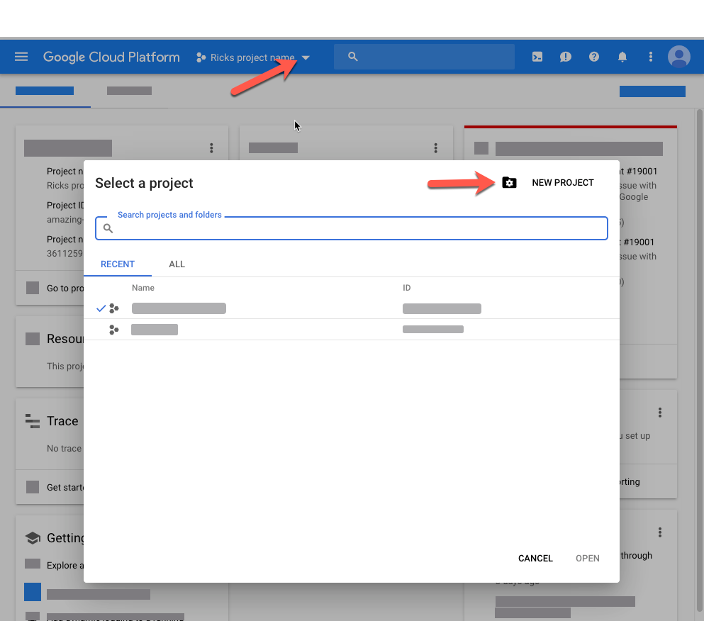
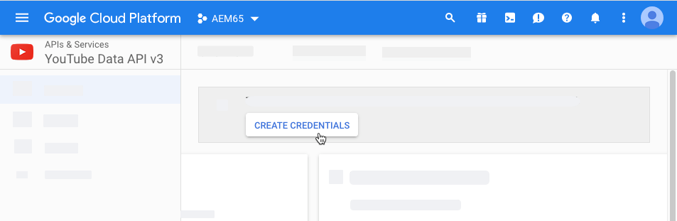

# Administrar recursos de vídeo {#manage-video-assets}

| Versión | Vínculo del artículo |
| -------- | ---------------------------- |
| AEM as a Cloud Service | [Haga clic aquí](https://experienceleague.adobe.com/docs/experience-manager-cloud-service/content/assets/manage/manage-video-assets.html?lang=en) |
| AEM 6.5 | Este artículo |

El formato de vídeo es una parte esencial de los recursos digitales de una organización. [!DNL Adobe Experience Manager] ofrece ofertas y características consolidadas para administrar todo el ciclo de vida de los recursos de vídeo después de su creación.

Obtenga información sobre cómo administrar y editar los recursos de vídeo en [!DNL Adobe Experience Manager Assets]. La codificación y transcodificación de vídeo, por ejemplo, la transcodificación FFmpeg, es posible mediante la integración de [!DNL Dynamic Media].

## Carga y previsualización de recursos de vídeo {#upload-and-preview-video-assets}

[!DNL Adobe Experience Manager Assets] genera vistas previas de recursos de vídeo con la extensión MP4. Si el formato del recurso no es MP4, instale el paquete FFmpeg para generar una previsualización. FFmpeg crea representaciones de vídeo de tipo OGG y MP4. Puede obtener una vista previa de las representaciones en la interfaz de usuario de [!DNL Assets].

1. En la carpeta o subcarpetas de recursos digitales, vaya a la ubicación donde desee agregar recursos digitales.
1. Para cargar el recurso, haga clic en **[!UICONTROL Crear]** en la barra de herramientas y elija **[!UICONTROL Archivos]**. También puede arrastrar un archivo a la interfaz de usuario. Consulte [cargar recursos](manage-assets.md#uploading-assets) para obtener más información.
1. Para obtener una vista previa de un vídeo en la vista de tarjeta, haz clic en la opción **[!UICONTROL Reproducir]**  del recurso de vídeo. Solo puede pausar o reproducir vídeo en la vista de tarjeta. Las opciones [!UICONTROL Reproducir] y [!UICONTROL Pausa] no están disponibles en la vista de lista.

1. Para obtener una vista previa del vídeo en la página de detalles del recurso, haga clic en **[!UICONTROL Editar]** en la tarjeta. El vídeo se reproduce en el reproductor de vídeo nativo del explorador. Puede reproducir, pausar, controlar el volumen y ampliar el vídeo a pantalla completa.

   

## Configuración para cargar recursos que superen los 2 GB {#configuration-to-upload-assets-that-are-larger-than-gb}

De manera predeterminada, [!DNL Assets] no permite cargar recursos que superen los 2 GB debido a un límite de tamaño de archivo. Sin embargo, puede sobrescribir este límite si va al CRXDE Lite y crea un nodo en el directorio `/apps`. El nodo debe tener el mismo nombre de nodo, estructura de directorio y propiedades de nodo comparables de orden.

Además de la configuración de [!DNL Assets], cambie las siguientes configuraciones para cargar recursos grandes:

* Aumente el tiempo de caducidad del token. Consulte [!UICONTROL Servlet CSRF de Granite de Adobe] en la consola web en `https://[aem_server]:[port]/system/console/configMgr`. Para obtener más información, consulte [Protección CSRF](/help/sites-developing/csrf-protection.md).
* Aumente `receiveTimeout` en la configuración de Dispatcher. Para obtener más información, consulte [Configuración de Dispatcher del Experience Manager](https://experienceleague.adobe.com/docs/experience-manager-dispatcher/using/configuring/dispatcher-configuration.html#renders-options).

>[!NOTE]
>
>La interfaz de usuario de [!DNL Experience Manager] Classic no tiene una restricción de límite de tamaño de archivo de 2 GB. Además, el flujo de trabajo completo para vídeos grandes no es totalmente compatible.

Para configurar un límite de tamaño de archivo mayor, realice los siguientes pasos en el directorio `/apps`.

1. En [!DNL Experience Manager], haga clic en **[!UICONTROL Herramientas]** > **[!UICONTROL General]** > **[!UICONTROL CRXDE Lite]**.
1. En el CRXDE Lite, vaya a `/libs/dam/gui/content/assets/jcr:content/actions/secondary/create/items/fileupload`. Para ver la ventana del directorio, haga clic en `>>`.
1. En la barra de herramientas, haga clic en **[!UICONTROL Nodo de superposición]**. También puede seleccionar **[!UICONTROL Nodo de superposición]** en el menú contextual.
1. En el diálogo **[!UICONTROL Nodo de superposición]**, haga clic en **[!UICONTROL Aceptar]**.

   

1. Actualice el explorador. El nodo de superposición `/apps/dam/gui/content/assets/jcr:content/actions/secondary/create/items/fileupload` está seleccionado.
1. En la ficha **[!UICONTROL Propiedades]**, escriba el valor apropiado en bytes para aumentar el límite de tamaño hasta el tamaño deseado. Por ejemplo, para aumentar el límite de tamaño a 30 GB, escriba `32212254720` valor.

1. En la barra de herramientas, haga clic en **[!UICONTROL Guardar todo]**.
1. En [!DNL Experience Manager], haga clic en **[!UICONTROL Herramientas]** > **[!UICONTROL Operaciones]** > **[!UICONTROL Consola web]**.
1. En la página [!DNL Adobe Experience Manager] [!UICONTROL Paquetes de consola web], en la columna Nombre de la tabla, busque y haga clic en **[!UICONTROL Controlador de trabajos de proceso externo de flujo de trabajo de Granite de Adobe]**.
1. En la página [!UICONTROL Controlador de trabajos de proceso externo de flujo de trabajo de Granite de Adobe], establezca los segundos para los campos **[!UICONTROL Tiempo de espera predeterminado]** y **[!UICONTROL Tiempo de espera máximo]** en `18000` (cinco horas). Haga clic en **[!UICONTROL Guardar]**.
1. En [!DNL Experience Manager], haga clic en **[!UICONTROL Herramientas]** > **[!UICONTROL Flujo de trabajo]** > **[!UICONTROL Modelos]**.
1. En la página Modelos de flujo de trabajo, seleccione **[!UICONTROL Dynamic Media Encode Video]** y, a continuación, haga clic en **[!UICONTROL Editar]**.
1. En la página de flujo de trabajo, haga doble clic en el componente **[!UICONTROL Proceso de servicio de vídeo de Dynamic Media]**.
1. En el cuadro de diálogo [!UICONTROL Propiedades del paso], en la pestaña **[!UICONTROL Común]**, expanda **Configuración avanzada**.
1. En el campo **[!UICONTROL Tiempo de espera]**, especifique un valor de `18000` y haga clic en **[!UICONTROL Aceptar]** para volver a la página de flujo de trabajo **[!UICONTROL Dynamic Media Encode Video]**.
1. Cerca de la parte superior de la página, debajo del título de página [!UICONTROL Dynamic Media Encode Video], haga clic en **[!UICONTROL Guardar]**.

## Recursos de vídeo de Publish {#publish-video-assets}

Después de la publicación, puede incluir los recursos de vídeo en una página web como una URL o incrustar directamente los recursos. Para obtener más información, consulte [publicar recursos de Dynamic Media](/help/assets/publishing-dynamicmedia-assets.md).

## Vídeos de Publish a YouTube {#publishing-videos-to-youtube}

Puede publicar recursos de vídeo de Experience Manager on-premise directamente en un canal de YouTube que haya creado anteriormente.

Para publicar recursos de vídeo en YouTube, debe configurar Experience Manager Assets con etiquetas. Estas etiquetas se asocian a un canal de YouTube. Si la etiqueta de un recurso de vídeo coincide con la de un canal de YouTube, el vídeo se publica en YouTube. Publish to YouTube se lleva a cabo junto con una publicación normal del vídeo, siempre y cuando se utilice una etiqueta asociada.

YouTube realiza su propia codificación. De este modo, el archivo de vídeo original que se cargó en Experience Manager se publica en YouTube, en lugar de en cualquier representación de vídeo que haya creado la codificación de Dynamic Media. Aunque no es necesario procesar vídeos con Dynamic Media, se espera que lo hagan en caso de que se necesite un ajuste preestablecido de visualizador para la reproducción.

Cuando evita el perfil de procesamiento de vídeo y publica directamente en YouTube, simplemente significa que el recurso de vídeo en Experience Manager Asset no obtiene una miniatura visible. También significa que si ejecuta en los modos de ejecución `dynamicmedia` o `dynamicmedia_scene7`, los vídeos que no están codificados no funcionan con ninguno de los tipos de recursos de Dynamic Media.

La publicación de recursos de vídeo en servidores de YouTube implica completar las siguientes tareas para garantizar la autenticación segura y protegida servidor a servidor con YouTube:

1. [Configuración de Google Cloud](#configuring-google-cloud-settings)
1. [Crear un canal de YouTube](#creating-a-youtube-channel)
1. [Añadir etiquetas para publicar](#adding-tags-for-publishing)
1. [Habilitar el agente de replicación de YouTube Publish](#enabling-the-youtube-publish-replication-agent)
1. [Configuración de YouTube en Experience Manager](#setting-up-youtube-in-aem)
1. [(Opcional) Automatice la configuración de las propiedades predeterminadas de YouTube para los vídeos cargados](#optional-automating-the-setting-of-default-youtube-properties-for-your-uploaded-videos)
1. [Vídeos de Publish en su canal de YouTube](#publishing-videos-to-your-youtube-channel)
1. [(Opcional) Compruebe el vídeo publicado en YouTube](/help/assets/video.md#optional-verifying-the-published-video-on-youtube)
1. [Vinculación de URL de YouTube a la aplicación web](#linking-youtube-urls-to-your-web-application)

También puede [cancelar la publicación de vídeos para quitarlos de YouTube](#unpublishing-videos-to-remove-them-from-youtube).

### Configuración de Google Cloud {#configuring-google-cloud-settings}

Para publicar en YouTube, necesita una cuenta de Google. Si tiene una cuenta de GMAIL, entonces ya tiene una cuenta de Google; si no tiene una cuenta de Google, puede crear fácilmente una. Necesita la cuenta de porque necesita credenciales para publicar recursos de vídeo en YouTube. Si ya tienes una cuenta creada, entonces omite esta tarea y continúa directamente a [Crear un canal de YouTube](#creating-a-youtube-channel).

La cuenta utilizada con Google Cloud y la cuenta de Google utilizada para YouTube no tienen por qué ser la misma.

Google cambia periódicamente su interfaz de usuario. Como tal, los pasos para publicar vídeos en YouTube pueden variar ligeramente de lo que se documenta a continuación. Esta advertencia también se aplica a YouTube cuando intenta comprobar si se han cargado vídeos en él.

>[!NOTE]
>
>Los siguientes pasos eran precisos en el momento de escribir este artículo. Sin embargo, Google actualiza periódicamente sus sitios web sin previo aviso. Como tal, estos pasos pueden ser ligeramente diferentes.

Para establecer la configuración de Google Cloud:

1. Cree una cuenta de Google.

   Si ya tiene una cuenta de Google, vaya al paso siguiente.

1. Vaya a [https://cloud.google.com/](https://cloud.google.com/).
1. En la página de Google Cloud, cerca de la esquina superior derecha, haga clic en **[!UICONTROL Consola]**.

   Si es necesario, **[!UICONTROL inicia sesión]** con las credenciales de tu cuenta de Google para ver la opción **[!UICONTROL Consola]**.

1. En la página Panel, a la derecha de **[!UICONTROL Google Cloud Platform]**, haga clic en la lista desplegable Proyecto para abrir el cuadro de diálogo Seleccionar un proyecto.
1. En el cuadro de diálogo Seleccionar un proyecto, seleccione **[!UICONTROL Nuevo proyecto]**.

   

1. En el cuadro de diálogo Nuevo proyecto, en el campo Nombre del proyecto, escriba el nombre del nuevo proyecto.

   El ID del proyecto se basa en el nombre del proyecto. Como tal, elija el nombre del proyecto con cuidado; no se puede cambiar después de crearlo. Además, debe volver a introducir el mismo ID de proyecto al configurar YouTube en Experience Manager más adelante; considere la posibilidad de escribirlo.

1. Haga clic en **[!UICONTROL Crear]**.

1. Realice una de las siguientes acciones:

   * En el panel del proyecto, en la tarjeta Introducción, seleccione **[!UICONTROL Explorar y habilitar API]**.
   * En el panel del proyecto, en la tarjeta de API, selecciona **[!UICONTROL Ir a la descripción general de las API]**.

   

1. Cerca de la parte superior de la página API y servicios, seleccione **[!UICONTROL Habilitar API y servicios]**.
1. En la página Biblioteca de API, en la parte izquierda, en **[!UICONTROL Categoría]**, seleccione **[!UICONTROL YouTube]**. En el lado derecho de la página, seleccione **[!UICONTROL API de datos de YouTube]**.
1. En la página YouTube Data API v3, seleccione **[!UICONTROL Habilitar]**.

   

1. Para utilizar la API, necesita credenciales. Si es necesario, haga clic en **[!UICONTROL Crear credenciales]**.

   

1. En la página **[!UICONTROL Agregar credenciales a su proyecto]**, paso 1, haga lo siguiente:

   * Desde **[!UICONTROL ¿Qué API está utilizando?]**, seleccione **[!UICONTROL API de datos de YouTube v3]**.

   * Desde **[!UICONTROL ¿Desde dónde llama a la API?]**, seleccione **[!UICONTROL Servidor web (por ejemplo, node.js, Tomcat)]**

   * Desde **[!UICONTROL ¿A qué datos está accediendo?]**, seleccione **[!UICONTROL Datos de usuario]**.

   

1. Seleccione **[!UICONTROL ¿Qué credenciales necesito?]**
1. En la página **[!UICONTROL Agregar credenciales al proyecto]**, paso 2, en el encabezado **[!UICONTROL Crear un ID de cliente de OAuth 2.0]**, introduzca un nombre único (si lo desea) en el campo Nombre. También puede utilizar el nombre predeterminado especificado por Google.
1. Bajo el encabezado **[!UICONTROL Orígenes autorizados de JavaScript]**, en el campo de texto, escriba la siguiente ruta, sustituyendo su propio dominio y número de puerto en la ruta, luego presione **[!UICONTROL Entrar]** para agregar la ruta a la lista:

   `https://<servername.domain>:<port_number>`

   Por ejemplo, `https://1a2b3c.mycompany.com:4321`

   **Nota**: el ejemplo de ruta de acceso anterior está diseñado únicamente con fines de demostración.

   

1. Bajo el encabezado **[!UICONTROL URI de redireccionamiento autorizados]**, en el campo de texto, introduzca la siguiente ruta, sustituyendo su propio dominio y número de puerto en la ruta, luego presione **[!UICONTROL Entrar]** para agregar la ruta a la lista:

   `https://<servername.domain>:<port_number>/etc/cloudservices/youtube.youtubecredentialcallback.json`

   Por ejemplo, `https://1a2b3c.mycompany.com:4321/etc/cloudservices/youtube.youtubecredentialcallback.json`

   **Nota**: el ejemplo de ruta de acceso anterior está diseñado únicamente con fines de demostración.

1. Haga clic en **[!UICONTROL Crear ID de cliente de OAuth]**.
1. En la página **[!UICONTROL Agregar credenciales a su proyecto]**, paso 3, en el encabezado **[!UICONTROL Configurar la pantalla de consentimiento de OAuth 2.0]**, seleccione la dirección de correo electrónico de Gmail que está utilizando actualmente.

   

1. Bajo el encabezado **[!UICONTROL Nombre de producto mostrado a los usuarios]**, en el campo de texto, escriba lo que desee mostrar en la pantalla de consentimiento.

   La pantalla de consentimiento se muestra al Experience Manager cuando se autentica en YouTube; el Experience Manager se pone en contacto con YouTube para obtener permiso.

1. Haga clic en **[!UICONTROL Continuar]**.
1. En la página Agregar credenciales a su proyecto, paso 4, bajo el encabezado **[!UICONTROL Descargar credenciales]**, seleccione **[!UICONTROL Descargar]**.

   

1. Guarde el archivo `client_id.json`.

   Necesita este archivo json descargado cuando configure YouTube en Adobe Experience Manager más adelante.

1. Haga clic en **[!UICONTROL Listo]**.

   Cierre la sesión de su cuenta de Google. Ahora cree un canal de YouTube.

### Crear un canal de YouTube {#creating-a-youtube-channel}

La publicación de vídeos en YouTube requiere que tenga uno o más canales. Si ya has creado un canal de YouTube, puedes omitir esta tarea y ir a [Agregar etiquetas para publicar](/help/assets/video.md#adding-tags-for-publishing).

>[!WARNING]
>
>Asegúrese de que ya ha configurado uno o más canales en YouTube *antes de* que agregue canales en Configuración de YouTube en el Experience Manager (consulte [Configurar YouTube en el Experience Manager](#setting-up-youtube-in-aem) a continuación). Si no puede configurar uno o más canales, no se le avisará de que hay otros que no existen. Sin embargo, la autenticación de Google sigue ocurriendo cuando se agrega un canal, pero no hay una opción para elegir qué canal se envía el vídeo.

**Para crear un canal de YouTube:**

1. Vaya a [https://www.youtube.com](https://www.youtube.com/) e inicie sesión con las credenciales de su cuenta de Google.
1. En la esquina superior derecha de la página de YouTube, haga clic en la imagen de perfil (también puede aparecer como una letra dentro de un círculo de color sólido) y, a continuación, haga clic en **[!UICONTROL Configuración de YouTube]** (icono de engranaje redondo).
1. En la página Información general, bajo el encabezado Características adicionales, haz clic en **[!UICONTROL Ver todos mis canales o crear un canal]**.
1. En la página Canales, haga clic en **[!UICONTROL Crear un canal nuevo]**.
1. En la página Cuenta de marca, en el campo Nombre de cuenta de marca, escribe un nombre de empresa o cualquier otro nombre de canal que elijas donde deseas publicar tus recursos de vídeo y, a continuación, haz clic en **[!UICONTROL Crear]**.

   Recuerde el nombre que introduce aquí porque debe introducirlo de nuevo al configurar YouTube en Experience Manager.

1. (Opcional) Si es necesario, agregue más canales.

   Ahora añada etiquetas para publicar.

### Añadir etiquetas para publicar {#adding-tags-for-publishing}

Para publicar en los vídeos en YouTube, Experience Manager asocia las etiquetas a uno o más canales de YouTube. Para agregar etiquetas para la publicación, consulte [Administrar etiquetas](/help/sites-administering/tags.md).

O bien, si tiene intención de usar las etiquetas predeterminadas en el Experience Manager, puede omitir esta tarea y ir a [Habilitar el agente de replicación de YouTube Publish](#enabling-the-youtube-publish-replication-agent).

### Habilitar el agente de replicación de YouTube Publish {#enabling-the-youtube-publish-replication-agent}

Después de habilitar el agente de replicación de YouTube Publish, si desea probar la conexión con la cuenta de Google Cloud, seleccione **[!UICONTROL Probar conexión]**. Una pestaña del explorador muestra los resultados de la conexión. Si ha añadido canales de YouTube, se mostrará un listado de ellos como parte de la prueba.

1. En la esquina superior izquierda del Experience Manager, haga clic en el logotipo del Experience Manager y, a continuación, en el carril izquierdo, haga clic en **[!UICONTROL Herramientas]** > **[!UICONTROL Implementación]** > **[!UICONTROL Replicación]** > **[!UICONTROL Agentes en Autor]**.
1. En la página Agentes de autor, haga clic en **[!UICONTROL YouTube Publish]**.
1. En la barra de herramientas, a la derecha de Configuración, haga clic en **[!UICONTROL Editar]**.
1. Seleccione la casilla de verificación **[!UICONTROL Habilitado]** para activar el agente de replicación.
1. Haga clic en **[!UICONTROL OK]**.

   Ahora configure YouTube en Experience Manager.

### Configuración de YouTube en Experience Manager {#setting-up-youtube-in-aem}

A partir de Experience Manager 6.4, se introdujo un nuevo método de interfaz de usuario táctil para configurar la publicación de YouTube en Experience Manager. En función de la instancia instalada de Experience Manager que esté utilizando, realice una de las siguientes acciones:

* Para configurar YouTube en un Experience Manager anterior a la versión 6.4, consulte [Configurar YouTube en un Experience Manager anterior a la versión 6.4](/help/assets/video.md#setting-up-youtube-in-aem-before).
* Para configurar YouTube en Experience Manager 6.4 o posterior, consulte [Configurar YouTube en Experience Manager 6.4 y posterior](#setting-up-youtube-in-aem-and-later).

#### Configuración de YouTube en Experience Manager 6.4 y posterior {#setting-up-youtube-in-aem-and-later}

1. Asegúrese de iniciar sesión en la instancia de Dynamic Media como administrador.
1. En la esquina superior izquierda, seleccione el logotipo del Experience Manager y, a continuación, en el carril izquierdo, seleccione **[!UICONTROL Herramientas]**(icono de martillo) > **[!UICONTROL Cloud Service]** > **[!UICONTROL Configuración de publicación de YouTube]**.
1. Seleccione **[!UICONTROL global]** (no lo seleccione).

1. Cerca de la esquina superior derecha de la página global, seleccione **[!UICONTROL Crear]**.
1. En la página Crear configuración de YouTube, en Configuración de plataforma de Google Cloud, en el campo **[!UICONTROL Nombre de aplicación]**, introduzca el ID de proyecto de Google.

   Especificó el ID del proyecto al establecer inicialmente la configuración de Google Cloud anteriormente.
Deje abierta la página Crear configuración de YouTube; en un momento, volverá a ella.

   

1. Con un editor de texto sin formato, abra el archivo JSON que descargó y guardó anteriormente en la tarea [Configuración de Google Cloud](/help/assets/video.md#configuring-google-cloud-settings).
1. Seleccione y copie todo el texto JSON.
1. Vuelva al cuadro de diálogo Configuración de cuenta de YouTube. En el campo **[!UICONTROL Configuración JSON]**, pegue el texto JSON.
1. Cerca de la esquina superior derecha de la página, seleccione **[!UICONTROL Guardar]**.

   Ahora configure los canales de YouTube en Experience Manager.

1. Seleccione **[!UICONTROL Agregar canal]**.
1. En el campo Nombre de canal, escriba el nombre del canal que creó en la tarea **[!UICONTROL Agregar uno o más canales a YouTube]** anteriormente.

   Si lo desea, puede añadir una descripción.

1. Seleccione **[!UICONTROL Añadir]**.
1. Se muestra la autenticación de YouTube/Google. Si aún no ha iniciado sesión en la cuenta de Google Cloud, omita este paso.

   * Introduzca el nombre de usuario y la contraseña de Google asociados con el ID del proyecto de Google y el texto JSON anteriores.
   * Según el número de canales de su cuenta, verá dos o más elementos. Seleccione un canal. No seleccione la dirección de correo electrónico; no es un canal.
   * En la página siguiente, seleccione **[!UICONTROL Aceptar]** para permitir el acceso a este canal.

1. Seleccione **[!UICONTROL Permitir]**.

   Ahora configure etiquetas para la publicación.

1. **[!UICONTROL Configuración de etiquetas para la publicación]**: en la página Cloud Service > YouTube, seleccione el icono de lápiz para editar la lista de etiquetas que desee utilizar.
1. Seleccione el icono de lista desplegable (acento circunflejo invertido) para poder mostrar la lista de etiquetas disponibles en Experience Manager.
1. Seleccione una o varias etiquetas para poder agregarlas.

   Para eliminar una etiqueta que hayas agregado, selecciona la etiqueta y selecciona **[!UICONTROL X]**.

1. Cuando termine de agregar las etiquetas que desea, seleccione **[!UICONTROL Guardar]**.

   Ahora puede publicar vídeos en su canal de YouTube.

#### Configuración de YouTube en Experience Manager anterior a 6.4 {#setting-up-youtube-in-aem-before}

1. Asegúrese de iniciar sesión en la instancia de Dynamic Media como administrador.

1. En la esquina superior izquierda, seleccione el logotipo del Experience Manager y, a continuación, en el carril izquierdo, seleccione **[!UICONTROL Herramientas]** (icono de martillo) > **[!UICONTROL Implementación]** > **[!UICONTROL Cloud Service]**.
1. En el encabezado Servicios de terceros, en YouTube, seleccione **[!UICONTROL Configurar ahora]**.
1. En el cuadro de diálogo Crear configuración, introduzca un título (obligatorio) y un nombre (opcional) en los campos respectivos.
1. Seleccione **[!UICONTROL Crear]**.
1. En el cuadro de diálogo Configuración de cuenta de YouTube, en el campo **[!UICONTROL Nombre de la aplicación]**, introduzca el ID del proyecto de Google.

   Especificó el identificador de proyecto al [establecer inicialmente la configuración de Google Cloud](/help/assets/video.md#configuring-google-cloud-settings) antes.
Deje abierto el cuadro de diálogo Configuración de cuenta de YouTube; volverá a él en un momento.

1. Con un editor de texto sin formato, abra el archivo JSON que descargó y guardó anteriormente en la tarea Configuración de Google Cloud.
1. Seleccione y copie todo el texto JSON.
1. Vuelva al cuadro de diálogo Configuración de cuenta de YouTube. En el campo **[!UICONTROL Configuración JSON]**, pegue el texto JSON.
1. Seleccione **[!UICONTROL Aceptar]**.

   Ahora configure los canales de YouTube en Experience Manager.

1. A la derecha de **[!UICONTROL Canales disponibles]**, seleccione **+** (icono de signo más).
1. En el cuadro de diálogo Configuración de canal de YouTube, en el apartado Título, escriba el nombre del canal que creó en la tarea **[!UICONTROL Agregar uno o más canales a YouTube]** anteriormente.

   Si lo desea, puede añadir una descripción.

1. Seleccione **[!UICONTROL Aceptar]**.
1. Se muestra la autenticación de YouTube/Google. Si aún no ha iniciado sesión en la cuenta de Google Cloud, omita este paso.

   * Introduzca el nombre de usuario y la contraseña de Google asociados con el ID del proyecto de Google y el texto JSON anteriores.
   * Según el número de canales de su cuenta, verá dos o más elementos. Seleccione un canal. No seleccione la dirección de correo electrónico; no es un canal.
   * En la página siguiente, seleccione **[!UICONTROL Aceptar]** para permitir el acceso a este canal.

1. Seleccione **[!UICONTROL Permitir]**.

   Ahora configure etiquetas para la publicación.

1. **[!UICONTROL Configuración de etiquetas para la publicación]**: en la página Cloud Service > YouTube, seleccione el icono de lápiz para editar la lista de etiquetas que desee utilizar.
1. Seleccione el icono de lista desplegable (acento circunflejo invertido) para poder mostrar la lista de etiquetas disponibles en Experience Manager.
1. Seleccione una o varias etiquetas para poder agregarlas.

   Para eliminar una etiqueta que hayas agregado, selecciona la etiqueta y selecciona **X**.

1. Cuando termine de agregar las etiquetas que desee, seleccione **[!UICONTROL Aceptar]**.

   Ahora puede publicar vídeos en su canal de YouTube.

### (Opcional) Automatice la configuración de las propiedades predeterminadas de YouTube para los vídeos cargados {#optional-automating-the-setting-of-default-youtube-properties-for-your-uploaded-videos}

Si lo desea, puede automatizar la configuración de las propiedades de YouTube al cargar los vídeos creando un perfil de procesamiento de metadatos en Experience Manager.

Para crear el perfil de procesamiento de metadatos, en primer lugar copiará valores de los campos **[!UICONTROL Etiqueta de campo]**, **[!UICONTROL Asignar a propiedad]** y **[!UICONTROL Opciones]**, todos se encuentran en Esquemas de metadatos para vídeo. A continuación, cree su perfil de procesamiento de metadatos de vídeo de YouTube agregándole esos valores.

Para automatizar la configuración de las propiedades predeterminadas de YouTube para los vídeos cargados:

1. En la esquina superior izquierda, seleccione el logotipo del Experience Manager y, a continuación, en el carril izquierdo, haga clic en **[!UICONTROL Herramientas]** (icono de martillo) > **[!UICONTROL Assets]** > **[!UICONTROL Esquemas de metadatos]**.
1. Haga clic en **[!UICONTROL predeterminado]**. (No añada una marca de verificación al cuadro de selección a la izquierda de &quot;predeterminado&quot;.)
1. En la página **[!UICONTROL default]**, marque la casilla a la izquierda de **[!UICONTROL video]** y luego seleccione **[!UICONTROL Editar]**.
1. En la página Editor de esquemas de metadatos, seleccione la ficha **[!UICONTROL Avanzado]**.
1. Bajo el encabezado Publicación de YouTube, haga clic en **[!UICONTROL Categoría de YouTube]**.
1. En el lado derecho de la página, en la ficha **[!UICONTROL Configuración]**, haga lo siguiente:

   * En el campo de texto **[!UICONTROL Asignar a propiedad]**, seleccione y copie el valor.
Pegue el valor copiado en el editor de texto abierto. Necesitará este valor más adelante cuando cree su perfil de procesamiento de metadatos. Deje abierto el editor de texto.

   * En **[!UICONTROL Opciones]**, seleccione y copie el valor predeterminado que desee usar (como Personas y blogs o Ciencia y tecnología).
Pegue el valor copiado en el editor de texto abierto. Necesitará este valor más adelante cuando cree su perfil de procesamiento de metadatos. Deje abierto el editor de texto.

1. En el encabezado Publicación de YouTube, seleccione **[!UICONTROL Privacidad de YouTube]**.
1. En el lado derecho de la página, en la ficha **[!UICONTROL Configuración]**, haga lo siguiente:

   * En el campo de texto **[!UICONTROL Asignar a propiedad]**, seleccione y copie el valor.
Pegue el valor copiado en el editor de texto abierto. Necesitará este valor más adelante cuando cree su perfil de procesamiento de metadatos. Deje abierto el editor de texto.

   * En **[!UICONTROL Opciones]**, seleccione y copie el valor predeterminado que desee utilizar. Observe que las Opciones se agrupan en pares de dos. El campo inferior del par es el valor predeterminado que desea copiar, como público, no incluido en la lista o privado.
Pegue el valor copiado en el editor de texto abierto. Necesitará este valor más adelante cuando cree su perfil de procesamiento de metadatos. Deje abierto el editor de texto.

1. Cerca de la esquina superior derecha de la página Editor de esquemas de metadatos, haga clic en **[!UICONTROL Cancelar]**.
1. En la esquina superior izquierda de Experience Manager, seleccione el logotipo del Experience Manager y, a continuación, en el carril izquierdo, haga clic en **[!UICONTROL Herramientas]** (icono de martillo) > **[!UICONTROL Assets]** > **[!UICONTROL Perfiles de metadatos]**.

1. En la página Perfiles de metadatos, cerca de la esquina superior derecha de la página, haga clic en **[!UICONTROL Crear]**.
1. En el cuadro de diálogo Agregar perfil de metadatos, en el campo de texto **[!UICONTROL Título del perfil]**, escriba el nombre `YouTube Video` y haga clic en **[!UICONTROL Crear]**.
1. En la página Editor de perfiles de metadatos, haga clic en la ficha **[!UICONTROL Avanzar]**.
1. Agregue los valores de publicación de YouTube copiados al perfil haciendo lo siguiente:

   * En el lado derecho de la página, haga clic en la ficha **[!UICONTROL Generar formulario]**.
   * (Opcional) Arrastre el componente con la etiqueta **[!UICONTROL Encabezado de sección]** hacia la izquierda y suéltelo en el área de formulario.
   * (Opcional) Haga clic en **[!UICONTROL Etiqueta de campo]** para seleccionar el componente.
   * (Opcional) En el lado derecho de la página, en la pestaña Configuración, en el campo de texto Etiqueta de campo, escriba `YouTube Publishing`.
   * Haga clic en la ficha **[!UICONTROL Generar formulario]**, luego arrastre el componente etiquetado **[!UICONTROL Texto de varios valores]** y suéltelo debajo del encabezado **[!UICONTROL Publicación de YouTube]** que ha creado.

   * Haga clic en **[!UICONTROL Etiqueta de campo]** para que se seleccione el componente.
   * En el lado derecho de la página, en la pestaña Configuración, pegue los valores de publicación de YouTube (valor Etiqueta de campo y Asignar a valor de propiedad) que copió anteriormente, en sus respectivos campos del formulario. Pegue el valor Choices en el campo Default Value.

1. Agregue los valores de privacidad de YouTube copiados al perfil haciendo lo siguiente:

   * En el lado derecho de la página, haga clic en la ficha **[!UICONTROL Generar formulario]**.
   * (Opcional) Arrastre el componente con la etiqueta **[!UICONTROL Encabezado de sección]** hacia la izquierda y suéltelo en el área de formulario.
   * (Opcional) Haga clic en **[!UICONTROL Etiqueta de campo]** para seleccionar el componente.
   * (Opcional) En el lado derecho de la página, en la pestaña Configuración, en el campo de texto Etiqueta de campo, escriba `YouTube Privacy`.
   * Haga clic en la pestaña **[!UICONTROL Generar formulario]**, luego arrastre el componente etiquetado **[!UICONTROL Texto de varios valores]** y suéltelo debajo del encabezado **[!UICONTROL Privacidad de YouTube]** que ha creado.

   * Haga clic en **[!UICONTROL Etiqueta de campo]** para que se seleccione el componente.
   * En el lado derecho de la página, en la pestaña Configuración, pegue los valores de publicación de YouTube (valor Etiqueta de campo y Asignar a valor de propiedad) que copió anteriormente, en sus respectivos campos del formulario. Pegue el valor Choices en el campo Default Value.

1. Junto a la esquina superior derecha de la página, haga clic en **[!UICONTROL Guardar]**.
1. Aplique el perfil de metadatos de publicación de YouTube a las carpetas en las que va a cargar los vídeos. Debe tener establecidos tanto el perfil de metadatos como el perfil de vídeo.

   Consulte [Perfiles de metadatos](/help/assets/metadata-config.md#metadata-profiles) y [Perfiles de vídeo](/help/assets/video-profiles.md).

### Vídeos de Publish en su canal de YouTube {#publishing-videos-to-your-youtube-channel}

Ahora asocia las etiquetas que agregó anteriormente a los recursos de vídeo. Este proceso permite al Experience Manager saber qué recursos publicar en el canal de YouTube.

>[!NOTE]
>
>Cuando se ejecuta en el modo Dynamic Media - Scene7, la publicación inmediata no se publica automáticamente en YouTube. Cuando se configura el modo Dynamic Media - Scene7, hay dos opciones de publicación entre las que elegir: **[!UICONTROL Inmediatamente]** o **[!UICONTROL Tras la activación]**.
>
>**[!UICONTROL Publish Inmediatamente]** significa que el recurso cargado (una vez sincronizado con IPS) se publica automáticamente en el sistema de entrega. Aunque esto se aplica a Dynamic Media, no se aplica a YouTube. Para publicar en YouTube, debe publicar mediante Experience Manager Author.

>[!NOTE]
>
>Para publicar contenido desde YouTube, Experience Manager usa el flujo de trabajo **[!UICONTROL Publish to YouTube]**, que le permite supervisar el progreso y ver cualquier información de error.
>
>Ver [Supervisión de la codificación de vídeo y progreso de publicación en YouTube](#monitoring-video-encoding-and-youtube-publishing-progress).
>
>Para obtener información de progreso más detallada, puede monitorizar el registro de YouTube en replicación. Sin embargo, tenga en cuenta que esta monitorización requiere acceso de administrador.

**Para publicar vídeos en su canal de YouTube:**

1. En Experience Manager, vaya al recurso de vídeo que desee publicar en el canal de YouTube.
1. Seleccione el recurso de vídeo (el conjunto de vídeos adaptable).
1. En la barra de herramientas, haga clic en **[!UICONTROL Propiedades]**.
1. En la pestaña Básico, debajo del encabezado Metadatos, haga clic en **[!UICONTROL Abrir cuadro de diálogo de selección]** a la derecha del campo Etiquetas.
1. En la página Seleccionar etiquetas, vaya a las etiquetas que desee utilizar y, a continuación, seleccione una o varias etiquetas.

   Recuerde que las etiquetas deben estar asociadas al canal de YouTube.

1. En la esquina superior derecha de la página, haga clic en **[!UICONTROL Seleccionar]**.
1. En la esquina superior derecha de la página de propiedades del vídeo, haga clic en **[!UICONTROL Guardar y cerrar]**.
1. En la barra de herramientas, haga clic en **[!UICONTROL Quick Publish]**.

   Consulte también [Uso de la administración de publicaciones con Experience Manager Sites](https://experienceleague.adobe.com/docs/experience-manager-learn/sites/page-authoring/publication-management-feature-video-use.html).

   Si lo desea, puede comprobar el vídeo publicado en el canal de YouTube.

### (Opcional) Compruebe el vídeo publicado en YouTube {#optional-verifying-the-published-video-on-youtube}

Si lo desea, puede monitorizar el progreso de la publicación de YouTube (o cancelar la publicación).

Ver [Supervisión de la codificación de vídeo y progreso de publicación en YouTube](#monitoring-video-encoding-and-youtube-publishing-progress).

Los tiempos de publicación pueden variar considerablemente según numerosos factores, entre los que se incluyen el formato del vídeo de origen principal, el tamaño del archivo y el tráfico de carga. El proceso de publicación puede tardar entre unos minutos y varias horas. Además, los formatos de mayor resolución se procesan mucho más lentamente. Por ejemplo, 720p y 1080p tardan más en aparecer que 480p.

Pasadas ocho horas, si sigue viendo un mensaje de estado que indica **[!UICONTROL Cargado (procesando, espere)]**, intente quitar el vídeo del sitio de Adobe y vuelva a cargarlo.

### Vinculación de URL de YouTube a la aplicación web {#linking-youtube-urls-to-your-web-application}

Puede obtener una cadena URL de YouTube generada por Dynamic Media después de publicar el vídeo. Al copiar la URL de YouTube, esta aterriza en el Portapapeles para que pueda pegarla según sea necesario en las páginas de su sitio web o aplicación.

>[!NOTE]
>
>La URL de YouTube no estará disponible para copiar hasta que haya publicado el recurso de vídeo en YouTube.

**Para vincular URL de YouTube a su aplicación web:**

1. Vaya al recurso de vídeo *YouTube publicado* cuya URL desee copiar y selecciónelo.

   Recuerde que las direcciones URL de YouTube solo están disponibles para copiar *después de* de haber *publicado* los recursos de vídeo por primera vez en YouTube.

1. En la barra de herramientas, haga clic en **[!UICONTROL Propiedades]**.
1. Haga clic en la ficha **[!UICONTROL Avanzadas]**.
1. En el encabezado Publicación de YouTube, en la Lista de URL de YouTube, seleccione y copie el texto de la URL en el explorador web para previsualizar el recurso o añadirlo a la página de contenido web.

### Cancele la publicación de vídeos para poder eliminarlos de YouTube {#unpublishing-videos-to-remove-them-from-youtube}

Cuando se cancela la publicación de un recurso de vídeo en Experience Manager, el vídeo se elimina de YouTube.

>[!CAUTION]
>
>Si elimina un vídeo directamente desde YouTube, Experience Manager no lo tendrá en cuenta y seguirá comportándose como si el vídeo se publicara en YouTube. Cancele siempre la publicación de un recurso de vídeo de YouTube mediante Experience Manager.

>[!NOTE]
>
>Para quitar contenido de YouTube, Experience Manager usa el flujo de trabajo **[!UICONTROL Cancelar la publicación de YouTube]**, que le permite supervisar el progreso y ver cualquier información de error.
>
>Ver [Supervisión de la codificación de vídeo y progreso de publicación en YouTube](#monitoring-video-encoding-and-youtube-publishing-progress).

**Para cancelar la publicación de vídeos y quitarlos de YouTube:**

1. Desplácese hasta los recursos de vídeo cuya publicación desea cancelar del canal de YouTube.
1. En un modo de selección de recursos, seleccione uno o varios recursos de vídeo publicados.
1. En la barra de herramientas, haga clic en **[!UICONTROL Administrar publicación]**. Seleccione el icono de tres puntos (. . .) en la barra de herramientas para que se abra **[!UICONTROL Administrar publicación]**.
1. En la página Administrar publicación, seleccione **[!UICONTROL Cancelar publicación]**.
1. En la esquina superior derecha de la página, seleccione **[!UICONTROL Siguiente]**.
1. En la esquina superior derecha de la página, seleccione **[!UICONTROL Cancelar publicación]**.

## Monitorización de la codificación de vídeo y progreso de publicación en YouTube {#monitoring-video-encoding-and-youtube-publishing-progress}

Al cargar un nuevo vídeo en una carpeta a la que se ha aplicado la codificación de vídeo o al publicar el vídeo en YouTube, puede monitorizar el progreso de la codificación de vídeo y la publicación en Youtube. El progreso real de publicación de YouTube solo está disponible a través de los registros. Sin embargo, su fracaso o éxito se enumera de formas adicionales descritas en el siguiente procedimiento. Además, recibirá notificaciones por correo electrónico cuando se complete o interrumpa un flujo de trabajo de publicación de YouTube o una codificación de vídeo.

### Monitorización del progreso {#monitoring-progress}

1. Vea el progreso de la codificación de vídeo en la carpeta de recursos:

   * En la vista de tarjeta, el progreso de codificación de vídeo se muestra en el recurso en porcentaje. Si hay un error, esta información también se muestra en el recurso.

   

   * En la vista de lista, el progreso de codificación de vídeo se muestra en la columna **[!UICONTROL Estado de procesamiento]**. Si hay un error, este mensaje se muestra en la misma columna.

   

   Esta columna no se muestra de forma predeterminada. Para habilitar la columna, selecciona **[!UICONTROL Ver configuración]** en el menú desplegable de vistas, agrega la columna **[!UICONTROL Estado de procesamiento]** y haz clic en **[!UICONTROL Actualizar]**.

   

1. Vea el progreso en los detalles del recurso. Al hacer clic en un recurso, abra el menú desplegable y seleccione **[!UICONTROL Cronología]**. Para reducirlo a actividades de flujo de trabajo como codificación o publicación en YouTube, seleccione **[!UICONTROL Flujos de trabajo]**.

   

   Cualquier información del flujo de trabajo, como la codificación, se muestra en la cronología. Para la publicación en YouTube, la cronología del flujo de trabajo también incluye el nombre del canal de YouTube y la dirección URL del vídeo de YouTube. Además, verá cualquier notificación de error en la cronología del flujo de trabajo una vez completada la publicación.

   >[!NOTE]
   >
   >Podría tomar mucho tiempo que los mensajes de error/error finalmente se registren debido a varias configuraciones de flujo de trabajo en **[!UICONTROL reintentos]**, **[!UICONTROL retraso de reintentos]** y **[!UICONTROL tiempo de espera]** de [https://localhost:4502/system/console/configMgr](https://localhost:4502/system/console/configMgr), por ejemplo:
   >
   >* Configuración de cola de trabajos de Apache Sling
   >* Controlador de trabajos de proceso externo de Adobe Granite Workflow
   >* Cola de tiempo de espera de Granite Workflow
   >
   >Puede ajustar las propiedades de **[!UICONTROL reintentos]**, **[!UICONTROL retraso de reintentos]** y **[!UICONTROL tiempo de espera]** en estas configuraciones.

1. Para los flujos de trabajo en curso, consulte Instancias de flujo de trabajo disponibles en **[!UICONTROL Herramientas]** > **[!UICONTROL Flujo de trabajo]** > **[!UICONTROL Instancias]**.

   >[!NOTE]
   >
   >Necesita derechos administrativos para acceder al menú **[!UICONTROL Herramientas]**.

   

   Seleccione la instancia y seleccione **[!UICONTROL Abrir historial]**.

   

   Desde el área Instancias de flujo de trabajo, también puede suspender, finalizar o cambiar el nombre de los flujos de trabajo. Consulte [Administración de flujos de trabajo](/help/sites-administering/workflows-administering.md) para obtener más información.

1. Para los trabajos con errores, consulte Errores de flujo de trabajo disponibles en **[!UICONTROL Herramientas]** > **[!UICONTROL Flujo de trabajo]** > **[!UICONTROL Errores]**. El **[!UICONTROL error de flujo de trabajo]** muestra todas las actividades de flujo de trabajo con errores.

   >[!NOTE]
   >
   >Necesita derechos administrativos para acceder al menú **[!UICONTROL Herramientas]**.

   

   >[!NOTE]
   >
   >Podría tomar mucho tiempo que el mensaje de error finalmente se registre debido a varias configuraciones de flujo de trabajo en **[!UICONTROL reintentos]**, **[!UICONTROL retraso de reintentos]** y **[!UICONTROL tiempo de espera]** de [https://localhost:4502/system/console/configMgr](https://localhost:4502/system/console/configMgr), por ejemplo:
   >
   >* Configuración de cola de trabajos de Apache Sling
   >* Controlador de trabajos de proceso externo de Adobe Granite Workflow
   >* Cola de tiempo de espera de Granite Workflow
   >
   >Puede ajustar las propiedades de **[!UICONTROL reintentos]**, **[!UICONTROL retraso de reintentos]** y **[!UICONTROL tiempo de espera]** en estas configuraciones.

1. Para ver los flujos de trabajo completados, consulte Archivo de flujo de trabajo, disponible en **[!UICONTROL Herramientas]** > **[!UICONTROL Flujo de trabajo]** > **[!UICONTROL Archivar]**. El **[!UICONTROL archivo de flujo de trabajo]** enumera todas las actividades de flujo de trabajo completadas.

   >[!NOTE]
   >
   >Necesita derechos administrativos para acceder al menú **[!UICONTROL Herramientas]**.

   

1. Recibirá notificaciones por correo electrónico sobre trabajos de flujo de trabajo anulados o fallidos. Un administrador puede configurar estas notificaciones por correo electrónico. Consulte [Configurar notificaciones por correo electrónico](#configuring-e-mail-notifications).

#### Configurar notificaciones por correo electrónico {#configuring-e-mail-notifications}

>[!NOTE]
>
>Necesita derechos administrativos para acceder al menú **[!UICONTROL Herramientas]**.

La configuración de las notificaciones depende de si desea recibir notificaciones para trabajos de codificación o para trabajos de publicación de YouTube:

* Para los trabajos de codificación, puede acceder a la página de configuración de todas las notificaciones por correo electrónico del flujo de trabajo del Experience Manager en **[!UICONTROL Herramientas]** > **[!UICONTROL Operaciones]** > **[!UICONTROL Consola web]** y buscando **[!UICONTROL Servicio de notificación por correo electrónico del flujo de trabajo de CQ por día]**. Consulte [Configuración de notificaciones por correo electrónico en Experience Manager](/help/sites-administering/notification.md). Puede activar o desactivar las casillas de verificación de **[!UICONTROL Notificar al cancelar]** o **[!UICONTROL Notificar al finalizar]** según corresponda.

* Para trabajos de publicación de YouTube, haga lo siguiente:

1. En Experience Manager, seleccione **[!UICONTROL Herramientas]** > **[!UICONTROL Flujo de trabajo]** > **[!UICONTROL Modelos]**.
1. En la página Modelos de flujo de trabajo, seleccione **[!UICONTROL Publish to YouTube]** y, a continuación, seleccione **[!UICONTROL Editar]** en la barra de herramientas.
1. Cerca de la esquina superior derecha de la página de flujo de trabajo Publish to YouTube, seleccione **[!UICONTROL Editar]**.
1. Pase el puntero del ratón sobre el componente Carga de YouTube y, a continuación, seleccione una vez para mostrar la barra de herramientas en línea.

   

1. En la barra de herramientas en línea, seleccione el icono Configuración (llave inglesa). Haga clic en la ficha **[!UICONTROL Argumentos]**.

   

1. En el cuadro de diálogo Proceso de carga de YouTube - Propiedades de la etapa, seleccione la pestaña **[!UICONTROL Argumentos]**.

   

1. Puede activar o desactivar las siguientes casillas de verificación:

   * Inicio de publicación
   * Error durante la publicación
   * Finalización de Publish: incluye información sobre canales y direcciones URL

   Si desactiva una casilla de verificación, no recibirá la notificación por correo electrónico especificada del flujo de trabajo de YouTube Publish.

   >[!NOTE]
   >
   >Estos correos electrónicos son específicos de YouTube y se añaden a las notificaciones de correo electrónico genéricas del flujo de trabajo. Como resultado, puede recibir dos conjuntos de notificaciones por correo electrónico: la notificación genérica disponible en el **[!UICONTROL Servicio de notificación por correo electrónico del flujo de trabajo de CQ por día]** y una específica de YouTube, según la configuración.

1. Cuando termine, cerca de la esquina superior derecha del cuadro de diálogo, seleccione el icono **[!UICONTROL Listo]** (marca de verificación).
1. En la página Flujo de trabajo de Publish a YouTube, cerca de la esquina superior derecha, seleccione **[!UICONTROL Sincronizar]**.

## Anotar recursos de vídeo {#annotate-video-assets}

1. En la consola [!DNL Assets], seleccione **[!UICONTROL Editar]** en la tarjeta de recursos para mostrar la página de detalles del recurso.
1. Para reproducir el vídeo, haz clic en **[!UICONTROL Vista previa]**.
1. Para anotar el vídeo, haz clic en **[!UICONTROL Anotar]**. Se añade una anotación en el momento (fotograma) concreto del vídeo. Al realizar anotaciones, puede dibujar en el lienzo e incluir un comentario con el dibujo. Los comentarios se guardan automáticamente. Para salir del asistente para anotaciones, haga clic en **[!UICONTROL Cerrar]**.

   

1. Busque un punto específico en el vídeo, establezca el tiempo en segundos en el campo de **texto** y haga clic en **Saltar**. Por ejemplo, para omitir los primeros 20 segundos de vídeo, introduzca 20 en el campo de texto.

   

1. Para verla en la cronología, haga clic en una anotación. Para eliminar la anotación de la cronología, haga clic en **[!UICONTROL Eliminar]**.

   

>[!MORELIKETHIS]
>
>* [Administrar recursos digitales en Experience Manager Assets](/help/assets/manage-assets.md)
>* [Administrar colecciones en Experience Manager Assets](/help/assets/manage-collections.md)
>* [Documentación de vídeo de Dynamic Media](/help/assets/video.md).
